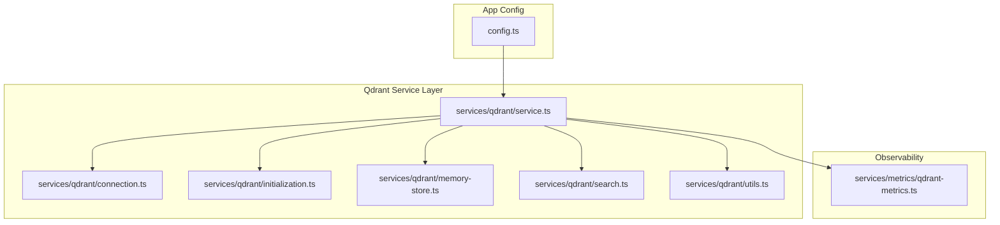
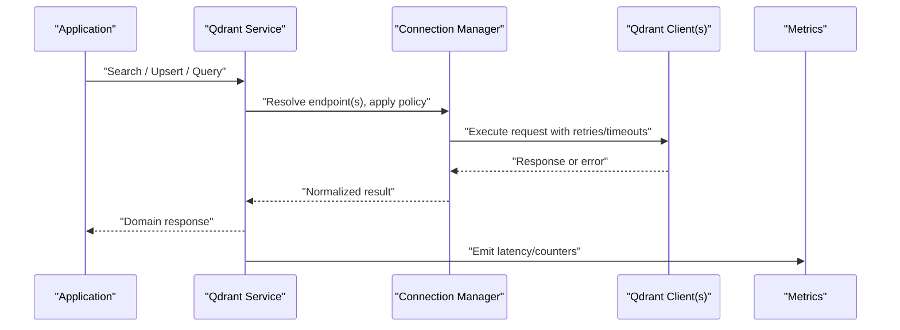
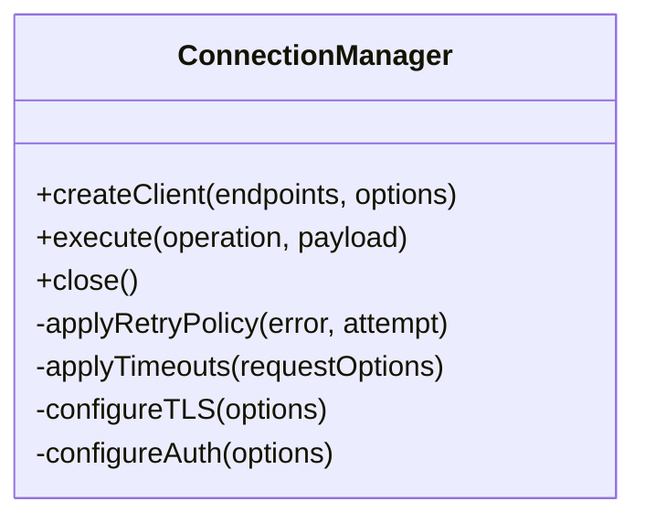
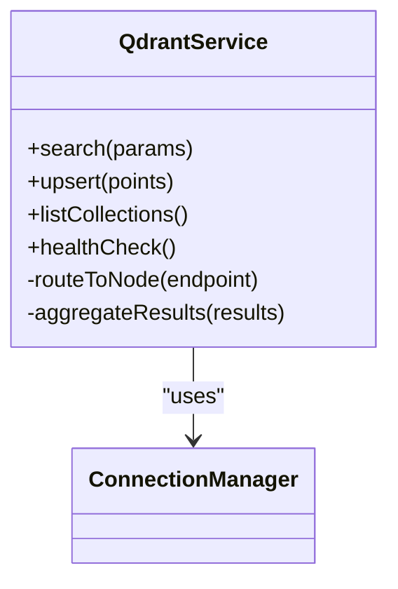
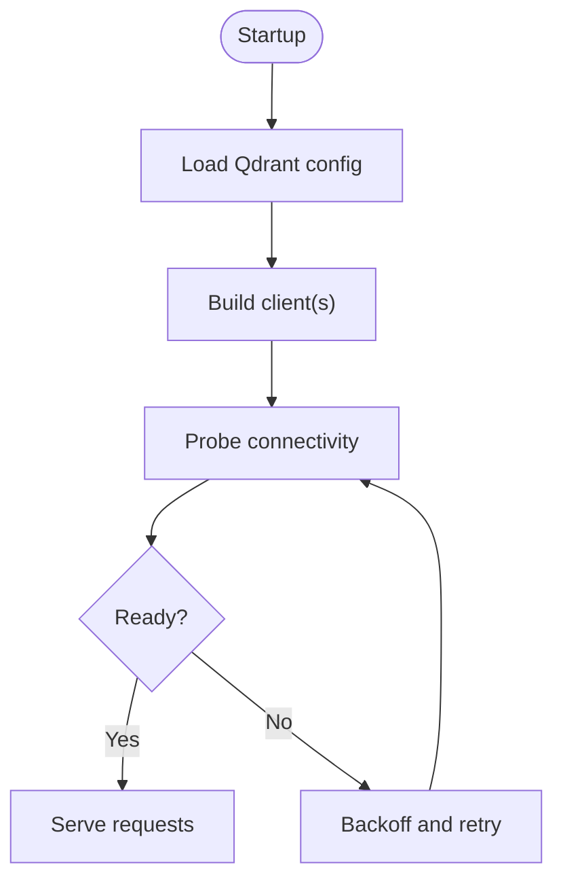
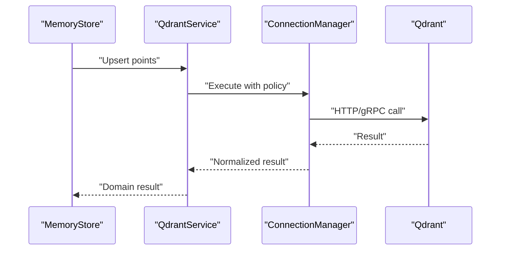
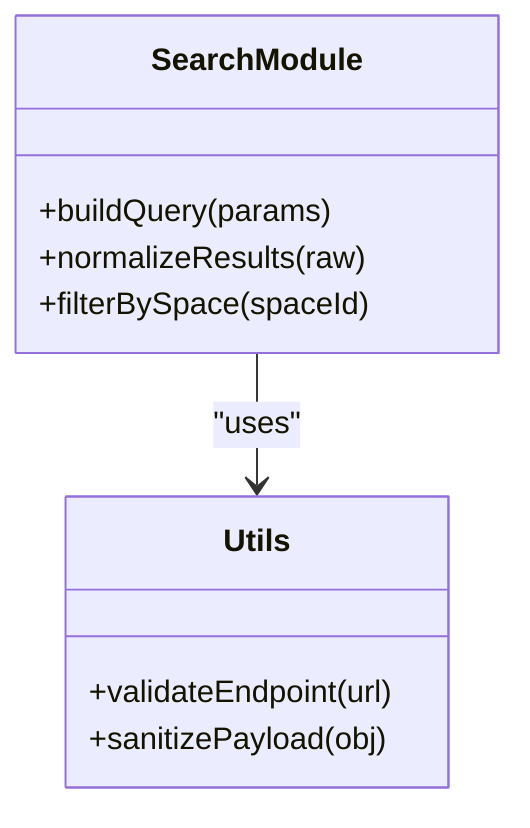
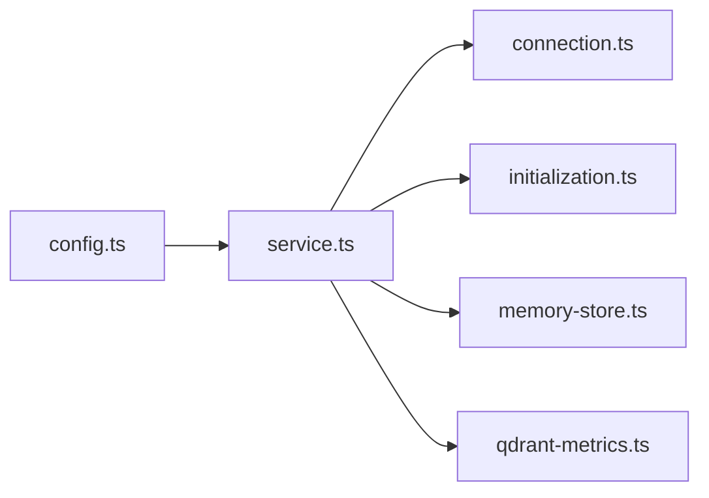

# Connection Management

<cite>
**Referenced Files in This Document**
- [connection.ts](file://src/services/qdrant/connection.ts)
- [service.ts](file://src/services/qdrant/service.ts)
- [initialization.ts](file://src/services/qdrant/initialization.ts)
- [config.ts](file://src/config.ts)
- [memory-store.ts](file://src/services/qdrant/memory-store.ts)
- [search.ts](file://src/services/qdrant/search.ts)
- [utils.ts](file://src/services/qdrant/utils.ts)
- [qdrant-metrics.ts](file://src/services/metrics/qdrant-metrics.ts)
</cite>

## Table of Contents
1. [Introduction](#introduction)
2. [Project Structure](#project-structure)
3. [Core Components](#core-components)
4. [Architecture Overview](#architecture-overview)
5. [Detailed Component Analysis](#detailed-component-analysis)
6. [Dependency Analysis](#dependency-analysis)
7. [Performance Considerations](#performance-considerations)
8. [Troubleshooting Guide](#troubleshooting-guide)
9. [Conclusion](#conclusion)

## Introduction
This document explains how Qdrant connections are managed across the application, including connection pooling, cluster configuration, high availability, authentication, SSL/TLS, lifecycle management, retry strategies, timeouts, error recovery, load balancing, failover, monitoring, health checks, and performance tuning. It is intended for developers and operators who configure or extend the Qdrant integration.

## Project Structure
The Qdrant integration is implemented under services/qdrant and integrates with configuration, metrics, and memory store layers. Key responsibilities:
- Connection lifecycle and pool management
- Cluster discovery and routing
- Authentication and TLS setup
- Retry and timeout policies
- Health checks and metrics

**Diagram sources**
- [service.ts](file://src/services/qdrant/service.ts)
- [connection.ts](file://src/services/qdrant/connection.ts)
- [initialization.ts](file://src/services/qdrant/initialization.ts)
- [memory-store.ts](file://src/services/qdrant/memory-store.ts)
- [search.ts](file://src/services/qdrant/search.ts)
- [utils.ts](file://src/services/qdrant/utils.ts)
- [config.ts](file://src/config.ts)
- [qdrant-metrics.ts](file://src/services/metrics/qdrant-metrics.ts)

**Section sources**
- [service.ts](file://src/services/qdrant/service.ts)
- [connection.ts](file://src/services/qdrant/connection.ts)
- [initialization.ts](file://src/services/qdrant/initialization.ts)
- [config.ts](file://src/config.ts)

## Core Components
- Connection manager: encapsulates client creation, pool sizing, retries, timeouts, and TLS/auth settings.
- Service facade: exposes typed operations (e.g., search, upsert) and coordinates cluster routing and load balancing.
- Initialization: bootstraps clients, validates connectivity, and performs readiness probes.
- Memory store: higher-level domain operations that rely on the service layer.
- Metrics: exposes counters and histograms for connection usage and errors.

**Section sources**
- [connection.ts](file://src/services/qdrant/connection.ts)
- [service.ts](file://src/services/qdrant/service.ts)
- [initialization.ts](file://src/services/qdrant/initialization.ts)
- [memory-store.ts](file://src/services/qdrant/memory-store.ts)
- [qdrant-metrics.ts](file://src/services/metrics/qdrant-metrics.ts)

## Architecture Overview
The application uses a service facade to abstract Qdrant interactions. The connection manager creates and maintains one or more Qdrant clients depending on single-node or multi-node configurations. The initialization routine validates connectivity and exposes readiness endpoints. Observability hooks emit metrics for latency, throughput, and failures.

**Diagram sources**
- [service.ts](file://src/services/qdrant/service.ts)
- [connection.ts](file://src/services/qdrant/connection.ts)
- [qdrant-metrics.ts](file://src/services/metrics/qdrant-metrics.ts)

## Detailed Component Analysis

### Connection Manager
Responsibilities:
- Create and cache Qdrant clients per endpoint or cluster.
- Configure timeouts, retries, backoff, and jitter.
- Apply authentication headers and TLS options.
- Provide a stable interface for upper layers.

Key behaviors:
- Pool sizing and concurrency limits to avoid resource exhaustion.
- Per-request timeout and overall operation timeout.
- Exponential backoff with jitter for transient failures.
- Circuit breaker-like behavior to short-circuit repeated failures.

**Diagram sources**
- [connection.ts](file://src/services/qdrant/connection.ts)

**Section sources**
- [connection.ts](file://src/services/qdrant/connection.ts)

### Service Facade
Responsibilities:
- Orchestrate calls to the connection manager.
- Route requests to appropriate nodes in a cluster.
- Aggregate results and handle partial failures.
- Expose domain methods used by memory store and other consumers.

**Diagram sources**
- [service.ts](file://src/services/qdrant/service.ts)
- [connection.ts](file://src/services/qdrant/connection.ts)

**Section sources**
- [service.ts](file://src/services/qdrant/service.ts)

### Initialization and Readiness
Responsibilities:
- Build clients from configuration.
- Validate connectivity and collection existence.
- Expose readiness/liveness signals.

**Diagram sources**
- [initialization.ts](file://src/services/qdrant/initialization.ts)

**Section sources**
- [initialization.ts](file://src/services/qdrant/initialization.ts)

### Memory Store Integration
Responsibilities:
- Translate domain operations into Qdrant API calls via the service facade.
- Handle batching and normalization of payloads.

**Diagram sources**
- [memory-store.ts](file://src/services/qdrant/memory-store.ts)
- [service.ts](file://src/services/qdrant/service.ts)
- [connection.ts](file://src/services/qdrant/connection.ts)

**Section sources**
- [memory-store.ts](file://src/services/qdrant/memory-store.ts)
- [service.ts](file://src/services/qdrant/service.ts)

### Search and Utilities
Responsibilities:
- Implement search-specific logic and helpers.
- Provide utilities for query building, scoring, and filtering.

**Diagram sources**
- [search.ts](file://src/services/qdrant/search.ts)
- [utils.ts](file://src/services/qdrant/utils.ts)

**Section sources**
- [search.ts](file://src/services/qdrant/search.ts)
- [utils.ts](file://src/services/qdrant/utils.ts)

## Dependency Analysis
High-level dependencies:
- Configuration drives endpoints, auth, TLS, and pool parameters.
- Service depends on connection manager for transport details.
- Memory store depends on service for data operations.
- Metrics module observes latency and error rates.

**Diagram sources**
- [config.ts](file://src/config.ts)
- [service.ts](file://src/services/qdrant/service.ts)
- [connection.ts](file://src/services/qdrant/connection.ts)
- [initialization.ts](file://src/services/qdrant/initialization.ts)
- [memory-store.ts](file://src/services/qdrant/memory-store.ts)
- [qdrant-metrics.ts](file://src/services/metrics/qdrant-metrics.ts)

**Section sources**
- [config.ts](file://src/config.ts)
- [service.ts](file://src/services/qdrant/service.ts)
- [connection.ts](file://src/services/qdrant/connection.ts)
- [initialization.ts](file://src/services/qdrant/initialization.ts)
- [memory-store.ts](file://src/services/qdrant/memory-store.ts)
- [qdrant-metrics.ts](file://src/services/metrics/qdrant-metrics.ts)

## Performance Considerations
- Connection pooling: tune pool size and max concurrent requests to match workload and server capacity.
- Timeouts: set per-request and overall operation timeouts to prevent long tail latencies.
- Retries: use exponential backoff with jitter; limit total attempts to avoid amplification.
- Batching: prefer batched writes and queries where supported to reduce overhead.
- TLS: reuse TLS sessions when possible; ensure certificate chains are valid to avoid handshake delays.
- Metrics: monitor latency percentiles, error rates, and queue lengths to identify bottlenecks.

[No sources needed since this section provides general guidance]

## Troubleshooting Guide
Common issues and remedies:
- Connectivity failures: verify endpoints, DNS resolution, firewall rules, and certificates.
- Auth errors: confirm token validity, scopes, and header format.
- Timeouts: increase timeouts cautiously; investigate server-side latency and resource saturation.
- High error rates: check circuit breaker state, retry counts, and downstream health.
- Partial failures in clusters: inspect routing logs and node health; consider failover configuration.

Operational checks:
- Use readiness probe to validate startup connectivity.
- Monitor metrics for anomalies in latency and error rates.
- Review logs around retries and fallback decisions.

**Section sources**
- [initialization.ts](file://src/services/qdrant/initialization.ts)
- [qdrant-metrics.ts](file://src/services/metrics/qdrant-metrics.ts)

## Conclusion
The Qdrant integration centralizes connection management behind a service facade, enabling robust configuration for single-node and multi-node deployments. With configurable retries, timeouts, TLS, and observability, it supports high availability and predictable performance. Operators should tune pool sizes, timeouts, and retry policies according to workload characteristics and continuously monitor metrics for optimal utilization.