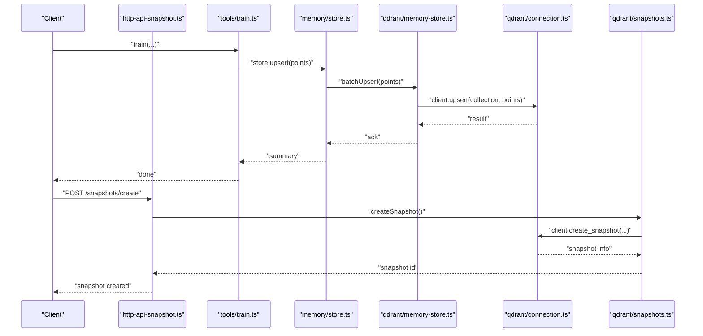
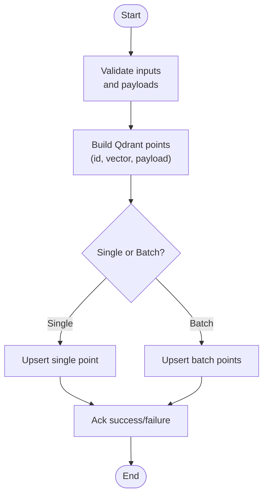
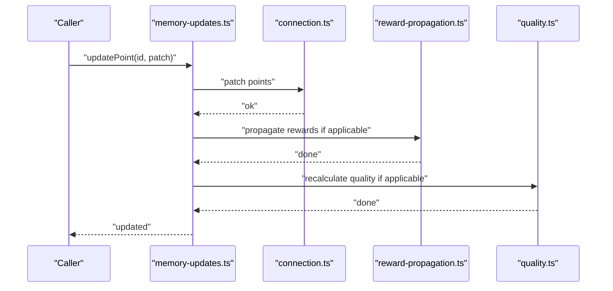
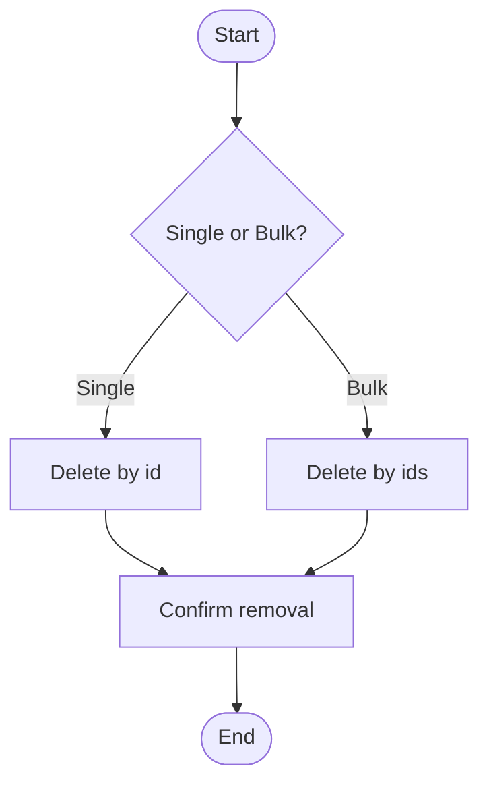
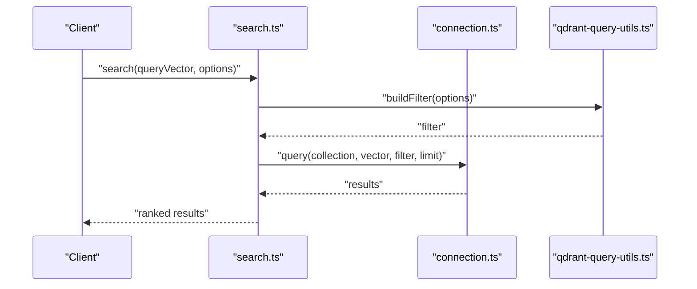
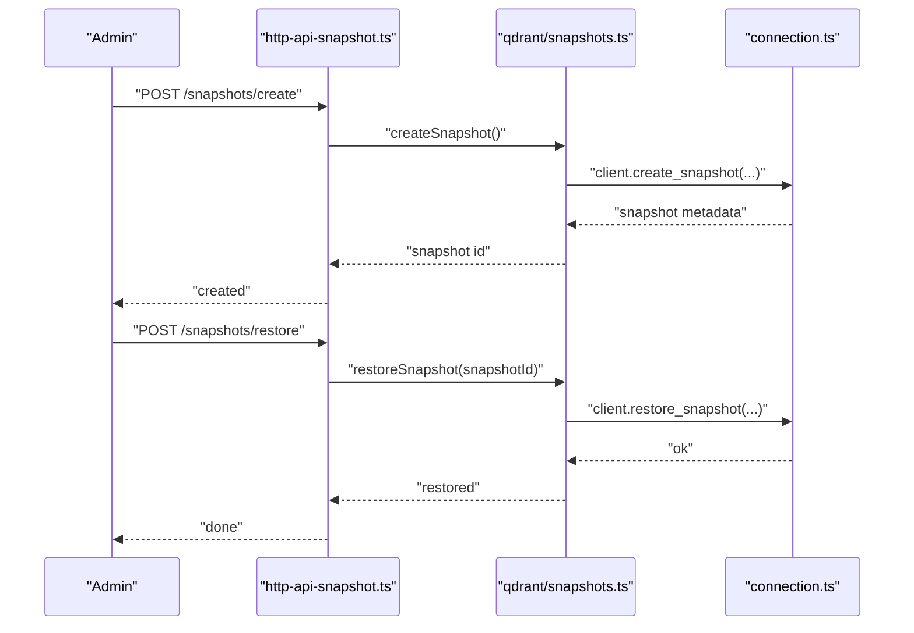
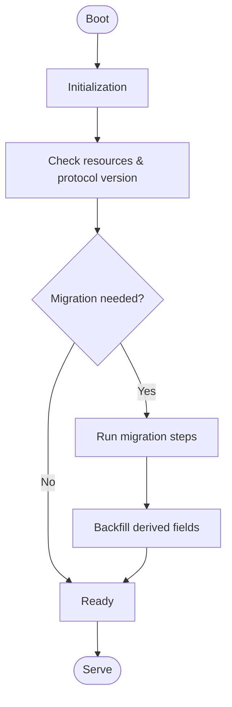
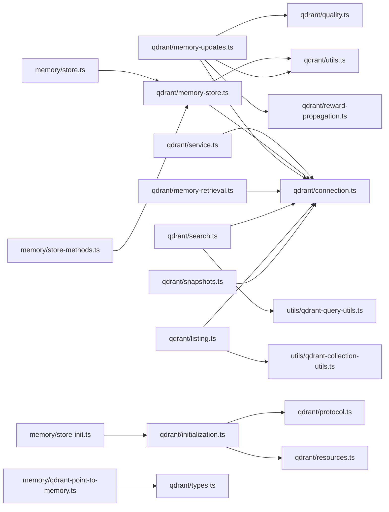

# Data Operations

<cite>
**Referenced Files in This Document**
- [src/services/qdrant/service.ts](file://src/services/qdrant/service.ts)
- [src/services/qdrant/connection.ts](file://src/services/qdrant/connection.ts)
- [src/services/qdrant/initialization.ts](file://src/services/qdrant/initialization.ts)
- [src/services/qdrant/memory-store.ts](file://src/services/qdrant/memory-store.ts)
- [src/services/qdrant/memory-updates.ts](file://src/services/qdrant/memory-updates.ts)
- [src/services/qdrant/memory-retrieval.ts](file://src/services/qdrant/memory-retrieval.ts)
- [src/services/qdrant/search.ts](file://src/services/qdrant/search.ts)
- [src/services/qdrant/listing.ts](file://src/services/qdrant/listing.ts)
- [src/services/qdrant/snapshots.ts](file://src/services/qdrant/snapshots.ts)
- [src/services/qdrant/types.ts](file://src/services/qdrant/types.ts)
- [src/services/qdrant/utils.ts](file://src/services/qdrant/utils.ts)
- [src/services/qdrant/resources.ts](file://src/services/qdrant/resources.ts)
- [src/services/qdrant/protocol.ts](file://src/services/qdrant/protocol.ts)
- [src/services/qdrant/reward-propagation.ts](file://src/services/qdrant/reward-propagation.ts)
- [src/services/qdrant/quality.ts](file://src/services/qdrant/quality.ts)
- [src/utils/qdrant-vector-management.ts](file://src/utils/qdrant-vector-management.ts)
- [src/utils/qdrant-query-utils.ts](file://src/utils/qdrant-query-utils.ts)
- [src/utils/qdrant-collection-utils.ts](file://src/utils/qdrant-collection-utils.ts)
- [src/utils/qdrant-utils.ts](file://src/utils/qdrant-utils.ts)
- [src/http/http-api-snapshot.ts](file://src/http/http-api-snapshot.ts)
- [src/tools/dump.ts](file://src/tools/dump.ts)
- [src/tools/export.ts](file://src/tools/export.ts)
- [src/tools/train.ts](file://src/tools/train.ts)
- [src/tools/update.ts](file://src/tools/update.ts)
- [src/tools/delete.ts](file://src/tools/delete.ts)
- [src/tools/search.ts](file://src/tools/search.ts)
- [src/services/memory/store.ts](file://src/services/memory/store.ts)
- [src/services/memory/store-methods.ts](file://src/services/memory/store-methods.ts)
- [src/services/memory/store-init.ts](file://src/services/memory/store-init.ts)
- [src/services/memory/qdrant-point-to-memory.ts](file://src/services/memory/qdrant-point-to-memory.ts)
- [src/services/memory/activation-search-backfill.ts](file://src/services/memory/activation-search-backfill.ts)
- [src/services/memory/adapter-builder.ts](file://src/services/memory/adapter-builder.ts)
- [src/services/memory/validate-adapter-markdown-size.ts](file://src/services/memory/validate-adapter-markdown-size.ts)
- [src/services/memory/validate-protocol-structure.ts](file://src/services/memory/validate-protocol-structure.ts)
- [src/services/metrics/qdrant-metrics.ts](file://src/services/metrics/qdrant-metrics.ts)
- [scripts/deploy-raw-qdrant-search.mjs](file://scripts/deploy-raw-qdrant-search.mjs)
</cite>

## Table of Contents
1. [Introduction](#introduction)
2. [Project Structure](#project-structure)
3. [Core Components](#core-components)
4. [Architecture Overview](#architecture-overview)
5. [Detailed Component Analysis](#detailed-component-analysis)
6. [Dependency Analysis](#dependency-analysis)
7. [Performance Considerations](#performance-considerations)
8. [Troubleshooting Guide](#troubleshooting-guide)
9. [Conclusion](#conclusion)
10. [Appendices](#appendices)

## Introduction
This document explains how data operations are implemented and orchestrated around Qdrant within the project. It covers CRUD operations, batch processing, lifecycle management, snapshotting and backup, migration strategies, transaction handling, consistency guarantees, conflict resolution, and patterns for efficient large-scale operations with validation and error handling. The goal is to provide both a high-level understanding and actionable guidance for developers working with vector storage and memory persistence.

## Project Structure
The Qdrant integration is organized under services/qdrant with supporting utilities and HTTP/tooling layers:
- Service layer: connection, initialization, store, updates, retrieval, search, listing, snapshots, types, utils, resources, protocol, reward propagation, quality
- Utilities: vector management, query helpers, collection helpers, general qdrant utils
- HTTP endpoints: snapshot API
- Tools: dump, export, train, update, delete, search
- Memory service: higher-level store methods and adapters that build on Qdrant
- Metrics: Qdrant-specific metrics

```mermaid
graph TB
subgraph "HTTP Layer"
HAPI["http-api-snapshot.ts"]
end
subgraph "Tools Layer"
TTrain["tools/train.ts"]
TUpdate["tools/update.ts"]
TDelete["tools/delete.ts"]
TSearch["tools/search.ts"]
TDump["tools/dump.ts"]
TExport["tools/export.ts"]
end
subgraph "Memory Service"
MStore["memory/store.ts"]
MMethods["memory/store-methods.ts"]
MInit["memory/store-init.ts"]
MP2M["memory/qdrant-point-to-memory.ts"]
end
subgraph "Qdrant Service"
QConn["qdrant/connection.ts"]
QInit["qdrant/initialization.ts"]
QSvc["qdrant/service.ts"]
QStore["qdrant/memory-store.ts"]
QUpd["qdrant/memory-updates.ts"]
QRet["qdrant/memory-retrieval.ts"]
QSearch["qdrant/search.ts"]
QList["qdrant/listing.ts"]
QSnap["qdrant/snapshots.ts"]
QTypes["qdrant/types.ts"]
QUtils["qdrant/utils.ts"]
QRes["qdrant/resources.ts"]
QProto["qdrant/protocol.ts"]
QRew["qdrant/reward-propagation.ts"]
QQual["qdrant/quality.ts"]
end
subgraph "Utilities"
UVec["utils/qdrant-vector-management.ts"]
UQuery["utils/qdrant-query-utils.ts"]
UColl["utils/qdrant-collection-utils.ts"]
UGen["utils/qdrant-utils.ts"]
end
HAPI --> QSnap
TTrain --> QStore
TUpdate --> QUpd
TDelete --> QUpd
TSearch --> QSearch
TDump --> QList
TExport --> QList
MStore --> QStore
MMethods --> QStore
MInit --> QInit
MP2M --> QTypes
QStore --> QConn
QUpd --> QConn
QRet --> QConn
QSearch --> QConn
QList --> QConn
QSnap --> QConn
QStore --> QUtils
QUpd --> QUtils
QSearch --> UQuery
QList --> UColl
QInit --> QRes
QInit --> QProto
QUpd --> QRew
QUpd --> QQual
QStore --> UVec
```

**Diagram sources**
- [src/http/http-api-snapshot.ts](file://src/http/http-api-snapshot.ts)
- [src/tools/train.ts](file://src/tools/train.ts)
- [src/tools/update.ts](file://src/tools/update.ts)
- [src/tools/delete.ts](file://src/tools/delete.ts)
- [src/tools/search.ts](file://src/tools/search.ts)
- [src/tools/dump.ts](file://src/tools/dump.ts)
- [src/tools/export.ts](file://src/tools/export.ts)
- [src/services/memory/store.ts](file://src/services/memory/store.ts)
- [src/services/memory/store-methods.ts](file://src/services/memory/store-methods.ts)
- [src/services/memory/store-init.ts](file://src/services/memory/store-init.ts)
- [src/services/memory/qdrant-point-to-memory.ts](file://src/services/memory/qdrant-point-to-memory.ts)
- [src/services/qdrant/service.ts](file://src/services/qdrant/service.ts)
- [src/services/qdrant/connection.ts](file://src/services/qdrant/connection.ts)
- [src/services/qdrant/initialization.ts](file://src/services/qdrant/initialization.ts)
- [src/services/qdrant/memory-store.ts](file://src/services/qdrant/memory-store.ts)
- [src/services/qdrant/memory-updates.ts](file://src/services/qdrant/memory-updates.ts)
- [src/services/qdrant/memory-retrieval.ts](file://src/services/qdrant/memory-retrieval.ts)
- [src/services/qdrant/search.ts](file://src/services/qdrant/search.ts)
- [src/services/qdrant/listing.ts](file://src/services/qdrant/listing.ts)
- [src/services/qdrant/snapshots.ts](file://src/services/qdrant/snapshots.ts)
- [src/services/qdrant/types.ts](file://src/services/qdrant/types.ts)
- [src/services/qdrant/utils.ts](file://src/services/qdrant/utils.ts)
- [src/services/qdrant/resources.ts](file://src/services/qdrant/resources.ts)
- [src/services/qdrant/protocol.ts](file://src/services/qdrant/protocol.ts)
- [src/services/qdrant/reward-propagation.ts](file://src/services/qdrant/reward-propagation.ts)
- [src/services/qdrant/quality.ts](file://src/services/qdrant/quality.ts)
- [src/utils/qdrant-vector-management.ts](file://src/utils/qdrant-vector-management.ts)
- [src/utils/qdrant-query-utils.ts](file://src/utils/qdrant-query-utils.ts)
- [src/utils/qdrant-collection-utils.ts](file://src/utils/qdrant-collection-utils.ts)
- [src/utils/qdrant-utils.ts](file://src/utils/qdrant-utils.ts)

**Section sources**
- [src/services/qdrant/service.ts](file://src/services/qdrant/service.ts)
- [src/services/qdrant/connection.ts](file://src/services/qdrant/connection.ts)
- [src/services/qdrant/initialization.ts](file://src/services/qdrant/initialization.ts)
- [src/services/qdrant/memory-store.ts](file://src/services/qdrant/memory-store.ts)
- [src/services/qdrant/memory-updates.ts](file://src/services/qdrant/memory-updates.ts)
- [src/services/qdrant/memory-retrieval.ts](file://src/services/qdrant/memory-retrieval.ts)
- [src/services/qdrant/search.ts](file://src/services/qdrant/search.ts)
- [src/services/qdrant/listing.ts](file://src/services/qdrant/listing.ts)
- [src/services/qdrant/snapshots.ts](file://src/services/qdrant/snapshots.ts)
- [src/services/qdrant/types.ts](file://src/services/qdrant/types.ts)
- [src/services/qdrant/utils.ts](file://src/services/qdrant/utils.ts)
- [src/services/qdrant/resources.ts](file://src/services/qdrant/resources.ts)
- [src/services/qdrant/protocol.ts](file://src/services/qdrant/protocol.ts)
- [src/services/qdrant/reward-propagation.ts](file://src/services/qdrant/reward-propagation.ts)
- [src/services/qdrant/quality.ts](file://src/services/qdrant/quality.ts)
- [src/utils/qdrant-vector-management.ts](file://src/utils/qdrant-vector-management.ts)
- [src/utils/qdrant-query-utils.ts](file://src/utils/qdrant-query-utils.ts)
- [src/utils/qdrant-collection-utils.ts](file://src/utils/qdrant-collection-utils.ts)
- [src/utils/qdrant-utils.ts](file://src/utils/qdrant-utils.ts)
- [src/http/http-api-snapshot.ts](file://src/http/http-api-snapshot.ts)
- [src/tools/train.ts](file://src/tools/train.ts)
- [src/tools/update.ts](file://src/tools/update.ts)
- [src/tools/delete.ts](file://src/tools/delete.ts)
- [src/tools/search.ts](file://src/tools/search.ts)
- [src/tools/dump.ts](file://src/tools/dump.ts)
- [src/tools/export.ts](file://src/tools/export.ts)
- [src/services/memory/store.ts](file://src/services/memory/store.ts)
- [src/services/memory/store-methods.ts](file://src/services/memory/store-methods.ts)
- [src/services/memory/store-init.ts](file://src/services/memory/store-init.ts)
- [src/services/memory/qdrant-point-to-memory.ts](file://src/services/memory/qdrant-point-to-memory.ts)
- [src/services/memory/activation-search-backfill.ts](file://src/services/memory/activation-search-backfill.ts)
- [src/services/memory/adapter-builder.ts](file://src/services/memory/adapter-builder.ts)
- [src/services/memory/validate-adapter-markdown-size.ts](file://src/services/memory/validate-adapter-markdown-size.ts)
- [src/services/memory/validate-protocol-structure.ts](file://src/services/memory/validate-protocol-structure.ts)
- [src/services/metrics/qdrant-metrics.ts](file://src/services/metrics/qdrant-metrics.ts)

## Core Components
- Connection and client lifecycle: manages Qdrant client instance, retries, timeouts, and health checks.
- Initialization: ensures collections exist, sets up vectors/config, and bootstraps resources.
- Store (CRUD): creates, retrieves, updates, deletes points; supports batching and upserts.
- Updates: handles partial updates, payload mutations, and side effects like reward propagation and quality scoring.
- Retrieval and Search: point lookup by ID, filtering, and vector similarity search with metadata filters.
- Listing: paginated enumeration of points and collections.
- Snapshots: create, list, restore, and manage snapshots for backup and recovery.
- Types and Utils: shared models, payload shaping, and helper functions for IDs, vectors, and queries.
- Resources and Protocol: resource definitions and protocol versioning used during initialization and migrations.
- Reward Propagation and Quality: post-update hooks for analytics and scoring.

Key responsibilities and interactions:
- Tools and HTTP endpoints call into the memory service or directly into Qdrant service modules depending on operation scope.
- Validation occurs at multiple layers: tool input schemas, adapter builders, and payload validators before writing to Qdrant.
- Metrics capture latency and counts for observability.

**Section sources**
- [src/services/qdrant/connection.ts](file://src/services/qdrant/connection.ts)
- [src/services/qdrant/initialization.ts](file://src/services/qdrant/initialization.ts)
- [src/services/qdrant/memory-store.ts](file://src/services/qdrant/memory-store.ts)
- [src/services/qdrant/memory-updates.ts](file://src/services/qdrant/memory-updates.ts)
- [src/services/qdrant/memory-retrieval.ts](file://src/services/qdrant/memory-retrieval.ts)
- [src/services/qdrant/search.ts](file://src/services/qdrant/search.ts)
- [src/services/qdrant/listing.ts](file://src/services/qdrant/listing.ts)
- [src/services/qdrant/snapshots.ts](file://src/services/qdrant/snapshots.ts)
- [src/services/qdrant/types.ts](file://src/services/qdrant/types.ts)
- [src/services/qdrant/utils.ts](file://src/services/qdrant/utils.ts)
- [src/services/qdrant/resources.ts](file://src/services/qdrant/resources.ts)
- [src/services/qdrant/protocol.ts](file://src/services/qdrant/protocol.ts)
- [src/services/qdrant/reward-propagation.ts](file://src/services/qdrant/reward-propagation.ts)
- [src/services/qdrant/quality.ts](file://src/services/qdrant/quality.ts)
- [src/utils/qdrant-vector-management.ts](file://src/utils/qdrant-vector-management.ts)
- [src/utils/qdrant-query-utils.ts](file://src/utils/qdrant-query-utils.ts)
- [src/utils/qdrant-collection-utils.ts](file://src/utils/qdrant-collection-utils.ts)
- [src/utils/qdrant-utils.ts](file://src/utils/qdrant-utils.ts)
- [src/services/metrics/qdrant-metrics.ts](file://src/services/metrics/qdrant-metrics.ts)

## Architecture Overview
The system separates concerns across layers:
- HTTP and tools orchestrate user-facing operations
- Memory service abstracts domain logic and adapts payloads
- Qdrant service encapsulates low-level operations against Qdrant
- Utilities provide reusable helpers for vectors, queries, and collections
- Metrics instrument performance and reliability

**Diagram sources**
- [src/http/http-api-snapshot.ts](file://src/http/http-api-snapshot.ts)
- [src/tools/train.ts](file://src/tools/train.ts)
- [src/services/memory/store.ts](file://src/services/memory/store.ts)
- [src/services/qdrant/memory-store.ts](file://src/services/qdrant/memory-store.ts)
- [src/services/qdrant/connection.ts](file://src/services/qdrant/connection.ts)
- [src/services/qdrant/snapshots.ts](file://src/services/qdrant/snapshots.ts)

## Detailed Component Analysis

### Point Creation and Upserts (Batch and Single)
- Single point creation uses upsert semantics to insert or overwrite existing points by ID.
- Batch upsert improves throughput by grouping writes and reducing round-trips.
- Payload construction leverages shared utilities to ensure consistent schema and vector formatting.
- Validation occurs before write via adapters and size constraints to prevent oversized payloads.

**Diagram sources**
- [src/services/qdrant/memory-store.ts](file://src/services/qdrant/memory-store.ts)
- [src/services/qdrant/utils.ts](file://src/services/qdrant/utils.ts)
- [src/services/memory/validate-adapter-markdown-size.ts](file://src/services/memory/validate-adapter-markdown-size.ts)
- [src/services/memory/adapter-builder.ts](file://src/services/memory/adapter-builder.ts)

**Section sources**
- [src/services/qdrant/memory-store.ts](file://src/services/qdrant/memory-store.ts)
- [src/services/qdrant/utils.ts](file://src/services/qdrant/utils.ts)
- [src/services/memory/validate-adapter-markdown-size.ts](file://src/services/memory/validate-adapter-markdown-size.ts)
- [src/services/memory/adapter-builder.ts](file://src/services/memory/adapter-builder.ts)

### Point Updates and Partial Mutations
- Partial updates merge new fields into existing payloads without overwriting unrelated keys.
- Side effects such as reward propagation and quality recalculation can be triggered after successful updates.
- Conflict resolution favors last-write-wins semantics per point ID; application-level deduplication should be applied upstream when necessary.

**Diagram sources**
- [src/services/qdrant/memory-updates.ts](file://src/services/qdrant/memory-updates.ts)
- [src/services/qdrant/connection.ts](file://src/services/qdrant/connection.ts)
- [src/services/qdrant/reward-propagation.ts](file://src/services/qdrant/reward-propagation.ts)
- [src/services/qdrant/quality.ts](file://src/services/qdrant/quality.ts)

**Section sources**
- [src/services/qdrant/memory-updates.ts](file://src/services/qdrant/memory-updates.ts)
- [src/services/qdrant/reward-propagation.ts](file://src/services/qdrant/reward-propagation.ts)
- [src/services/qdrant/quality.ts](file://src/services/qdrant/quality.ts)

### Deletion and Bulk Removal
- Delete by ID removes a point atomically.
- Bulk deletion supports removing multiple points efficiently.
- Listing utilities assist in identifying points to remove based on filters or pagination.

**Diagram sources**
- [src/services/qdrant/memory-store.ts](file://src/services/qdrant/memory-store.ts)
- [src/services/qdrant/listing.ts](file://src/services/qdrant/listing.ts)

**Section sources**
- [src/services/qdrant/memory-store.ts](file://src/services/qdrant/memory-store.ts)
- [src/services/qdrant/listing.ts](file://src/services/qdrant/listing.ts)

### Retrieval and Search
- Point retrieval by ID returns full payload and vector metadata.
- Similarity search accepts a query vector and optional filter conditions, returning ranked results.
- Query utilities help construct filters and normalize parameters.

**Diagram sources**
- [src/services/qdrant/search.ts](file://src/services/qdrant/search.ts)
- [src/services/qdrant/connection.ts](file://src/services/qdrant/connection.ts)
- [src/utils/qdrant-query-utils.ts](file://src/utils/qdrant-query-utils.ts)

**Section sources**
- [src/services/qdrant/memory-retrieval.ts](file://src/services/qdrant/memory-retrieval.ts)
- [src/services/qdrant/search.ts](file://src/services/qdrant/search.ts)
- [src/utils/qdrant-query-utils.ts](file://src/utils/qdrant-query-utils.ts)

### Listing and Pagination
- Enumerate points with pagination controls for efficient browsing and backfills.
- Useful for audit, export, and migration workflows.

**Section sources**
- [src/services/qdrant/listing.ts](file://src/services/qdrant/listing.ts)

### Snapshot Management, Backup, and Restore
- Create snapshots for point-in-time backups.
- List available snapshots and restore from a selected snapshot.
- Exposed via HTTP endpoint for operational use.

**Diagram sources**
- [src/http/http-api-snapshot.ts](file://src/http/http-api-snapshot.ts)
- [src/services/qdrant/snapshots.ts](file://src/services/qdrant/snapshots.ts)
- [src/services/qdrant/connection.ts](file://src/services/qdrant/connection.ts)

**Section sources**
- [src/http/http-api-snapshot.ts](file://src/http/http-api-snapshot.ts)
- [src/services/qdrant/snapshots.ts](file://src/services/qdrant/snapshots.ts)

### Data Migration Strategies
- Initialization routines ensure collections and configurations match expected versions.
- Resource and protocol modules define versioned contracts and migration steps.
- Backfill flows support re-indexing activation search fields and other derived data.

**Diagram sources**
- [src/services/qdrant/initialization.ts](file://src/services/qdrant/initialization.ts)
- [src/services/qdrant/resources.ts](file://src/services/qdrant/resources.ts)
- [src/services/qdrant/protocol.ts](file://src/services/qdrant/protocol.ts)
- [src/services/memory/activation-search-backfill.ts](file://src/services/memory/activation-search-backfill.ts)

**Section sources**
- [src/services/qdrant/initialization.ts](file://src/services/qdrant/initialization.ts)
- [src/services/qdrant/resources.ts](file://src/services/qdrant/resources.ts)
- [src/services/qdrant/protocol.ts](file://src/services/qdrant/protocol.ts)
- [src/services/memory/activation-search-backfill.ts](file://src/services/memory/activation-search-backfill.ts)

### Transaction Handling, Consistency, and Conflict Resolution
- Atomicity: individual upsert/delete operations are atomic per point.
- Transactions: no multi-operation transactions are exposed; implement idempotent upserts and compensating actions at the application layer.
- Consistency: eventual consistency typical of distributed vector stores; read-your-writes may require explicit refresh or retry.
- Conflict resolution: last-write-wins by default; apply deterministic IDs and deduplication upstream to avoid unintended overwrites.

[No sources needed since this section provides conceptual guidance]

### Efficient Batch Operations and Large-Scale Workflows
- Use batch upserts to reduce network overhead and improve throughput.
- Chunk large datasets and process concurrently with bounded concurrency to avoid overload.
- Employ listing and pagination to stream data for exports or migrations.
- Monitor metrics to tune batch sizes and concurrency.

**Section sources**
- [src/services/qdrant/memory-store.ts](file://src/services/qdrant/memory-store.ts)
- [src/services/qdrant/listing.ts](file://src/services/qdrant/listing.ts)
- [src/services/metrics/qdrant-metrics.ts](file://src/services/metrics/qdrant-metrics.ts)

### Data Validation Patterns
- Enforce payload size limits and structure before writing.
- Validate protocol structures and adapter schemas to maintain integrity.
- Normalize IDs and vectors using utility helpers.

**Section sources**
- [src/services/memory/validate-adapter-markdown-size.ts](file://src/services/memory/validate-adapter-markdown-size.ts)
- [src/services/memory/validate-protocol-structure.ts](file://src/services/memory/validate-protocol-structure.ts)
- [src/utils/qdrant-vector-management.ts](file://src/utils/qdrant-vector-management.ts)
- [src/utils/qdrant-utils.ts](file://src/utils/qdrant-utils.ts)

### Error Handling Patterns
- Wrap I/O calls with retries and timeout policies where appropriate.
- Surface meaningful errors to callers and log context for diagnostics.
- Distinguish between transient failures (retryable) and permanent errors (abort).

**Section sources**
- [src/services/qdrant/connection.ts](file://src/services/qdrant/connection.ts)
- [src/services/qdrant/memory-store.ts](file://src/services/qdrant/memory-store.ts)
- [src/services/qdrant/memory-updates.ts](file://src/services/qdrant/memory-updates.ts)

## Dependency Analysis
The following diagram highlights key dependencies among core modules:

**Diagram sources**
- [src/services/qdrant/service.ts](file://src/services/qdrant/service.ts)
- [src/services/qdrant/connection.ts](file://src/services/qdrant/connection.ts)
- [src/services/qdrant/memory-store.ts](file://src/services/qdrant/memory-store.ts)
- [src/services/qdrant/memory-updates.ts](file://src/services/qdrant/memory-updates.ts)
- [src/services/qdrant/memory-retrieval.ts](file://src/services/qdrant/memory-retrieval.ts)
- [src/services/qdrant/search.ts](file://src/services/qdrant/search.ts)
- [src/services/qdrant/listing.ts](file://src/services/qdrant/listing.ts)
- [src/services/qdrant/snapshots.ts](file://src/services/qdrant/snapshots.ts)
- [src/services/qdrant/utils.ts](file://src/services/qdrant/utils.ts)
- [src/utils/qdrant-query-utils.ts](file://src/utils/qdrant-query-utils.ts)
- [src/utils/qdrant-collection-utils.ts](file://src/utils/qdrant-collection-utils.ts)
- [src/services/qdrant/initialization.ts](file://src/services/qdrant/initialization.ts)
- [src/services/qdrant/resources.ts](file://src/services/qdrant/resources.ts)
- [src/services/qdrant/protocol.ts](file://src/services/qdrant/protocol.ts)
- [src/services/qdrant/reward-propagation.ts](file://src/services/qdrant/reward-propagation.ts)
- [src/services/qdrant/quality.ts](file://src/services/qdrant/quality.ts)
- [src/services/memory/store.ts](file://src/services/memory/store.ts)
- [src/services/memory/store-methods.ts](file://src/services/memory/store-methods.ts)
- [src/services/memory/store-init.ts](file://src/services/memory/store-init.ts)
- [src/services/memory/qdrant-point-to-memory.ts](file://src/services/memory/qdrant-point-to-memory.ts)
- [src/services/qdrant/types.ts](file://src/services/qdrant/types.ts)

**Section sources**
- [src/services/qdrant/service.ts](file://src/services/qdrant/service.ts)
- [src/services/qdrant/connection.ts](file://src/services/qdrant/connection.ts)
- [src/services/qdrant/memory-store.ts](file://src/services/qdrant/memory-store.ts)
- [src/services/qdrant/memory-updates.ts](file://src/services/qdrant/memory-updates.ts)
- [src/services/qdrant/memory-retrieval.ts](file://src/services/qdrant/memory-retrieval.ts)
- [src/services/qdrant/search.ts](file://src/services/qdrant/search.ts)
- [src/services/qdrant/listing.ts](file://src/services/qdrant/listing.ts)
- [src/services/qdrant/snapshots.ts](file://src/services/qdrant/snapshots.ts)
- [src/services/qdrant/utils.ts](file://src/services/qdrant/utils.ts)
- [src/utils/qdrant-query-utils.ts](file://src/utils/qdrant-query-utils.ts)
- [src/utils/qdrant-collection-utils.ts](file://src/utils/qdrant-collection-utils.ts)
- [src/services/qdrant/initialization.ts](file://src/services/qdrant/initialization.ts)
- [src/services/qdrant/resources.ts](file://src/services/qdrant/resources.ts)
- [src/services/qdrant/protocol.ts](file://src/services/qdrant/protocol.ts)
- [src/services/qdrant/reward-propagation.ts](file://src/services/qdrant/reward-propagation.ts)
- [src/services/qdrant/quality.ts](file://src/services/qdrant/quality.ts)
- [src/services/memory/store.ts](file://src/services/memory/store.ts)
- [src/services/memory/store-methods.ts](file://src/services/memory/store-methods.ts)
- [src/services/memory/store-init.ts](file://src/services/memory/store-init.ts)
- [src/services/memory/qdrant-point-to-memory.ts](file://src/services/memory/qdrant-point-to-memory.ts)
- [src/services/qdrant/types.ts](file://src/services/qdrant/types.ts)

## Performance Considerations
- Prefer batch upserts and deletes to minimize round-trips.
- Tune concurrency for bulk operations; monitor metrics to find optimal throughput.
- Use pagination and streaming for large enumerations and exports.
- Keep payloads compact; enforce size limits to avoid overhead.
- Reuse connections and clients; avoid frequent re-initialization.
- Index configuration and vector dimensions should align with workload characteristics.

[No sources needed since this section provides general guidance]

## Troubleshooting Guide
Common issues and remedies:
- Connection failures: verify endpoint, credentials, and network reachability; check retry/backoff settings.
- Timeouts: adjust request timeouts and batch sizes; consider splitting large batches.
- Validation errors: inspect payload schemas and size limits; normalize IDs and vectors.
- Inconsistent reads: add explicit refresh or retry; confirm eventual consistency expectations.
- Snapshot issues: ensure sufficient disk space and permissions; validate snapshot IDs.

Operational references:
- Raw Qdrant search script for ad-hoc diagnostics.
- Metrics module for monitoring latency and error rates.

**Section sources**
- [src/services/qdrant/connection.ts](file://src/services/qdrant/connection.ts)
- [src/services/metrics/qdrant-metrics.ts](file://src/services/metrics/qdrant-metrics.ts)
- [scripts/deploy-raw-qdrant-search.mjs](file://scripts/deploy-raw-qdrant-search.mjs)

## Conclusion
The Qdrant integration provides a robust foundation for vector-backed memory operations with clear separation of concerns, strong validation, and operational tooling for snapshots and migrations. By leveraging batch operations, careful concurrency control, and consistent validation, teams can achieve reliable, high-throughput data workflows while maintaining data integrity and observability.

[No sources needed since this section summarizes without analyzing specific files]

## Appendices

### Example Workflows and Entry Points
- Training pipeline entry point for bulk ingestion and indexing.
- Update and delete tools for targeted mutations.
- Search tool for querying and exploration.
- Dump and export tools for listing and exporting data.
- Snapshot HTTP API for backup and restore.

**Section sources**
- [src/tools/train.ts](file://src/tools/train.ts)
- [src/tools/update.ts](file://src/tools/update.ts)
- [src/tools/delete.ts](file://src/tools/delete.ts)
- [src/tools/search.ts](file://src/tools/search.ts)
- [src/tools/dump.ts](file://src/tools/dump.ts)
- [src/tools/export.ts](file://src/tools/export.ts)
- [src/http/http-api-snapshot.ts](file://src/http/http-api-snapshot.ts)