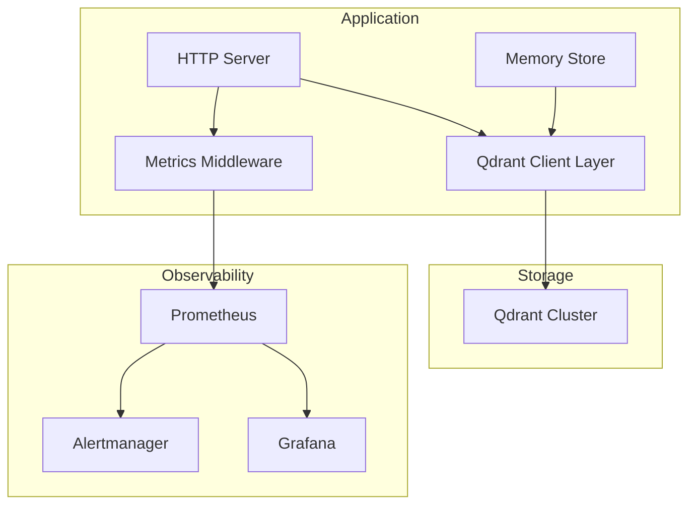
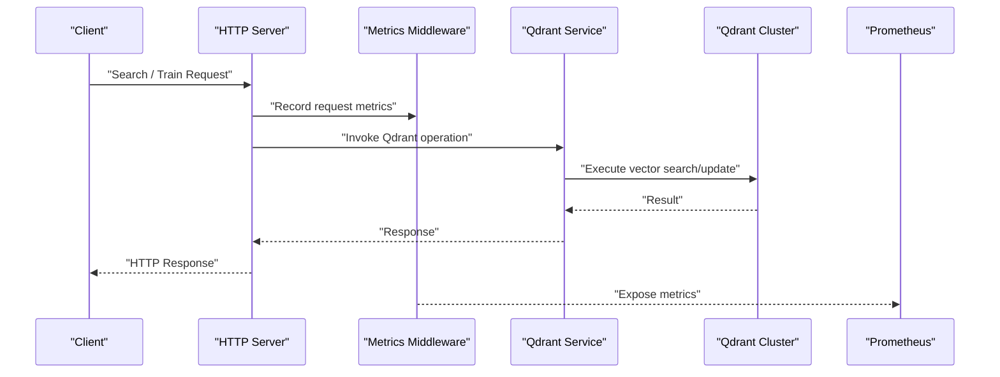
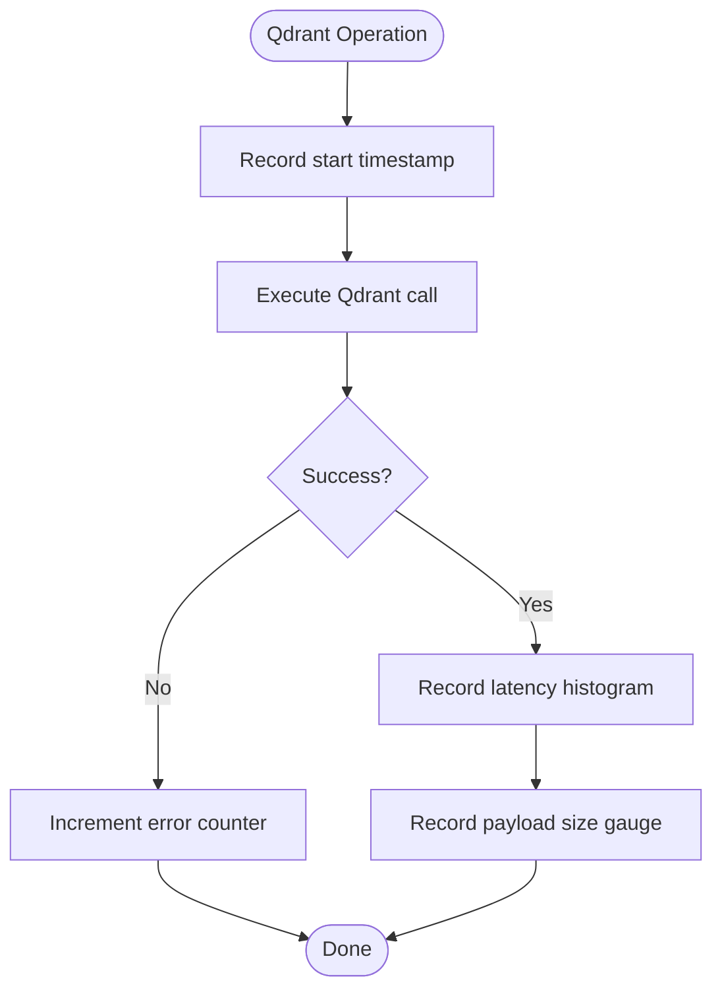
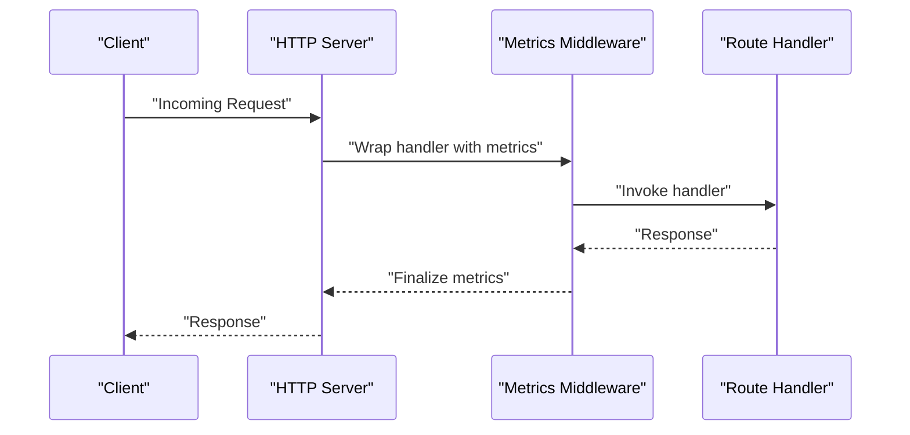
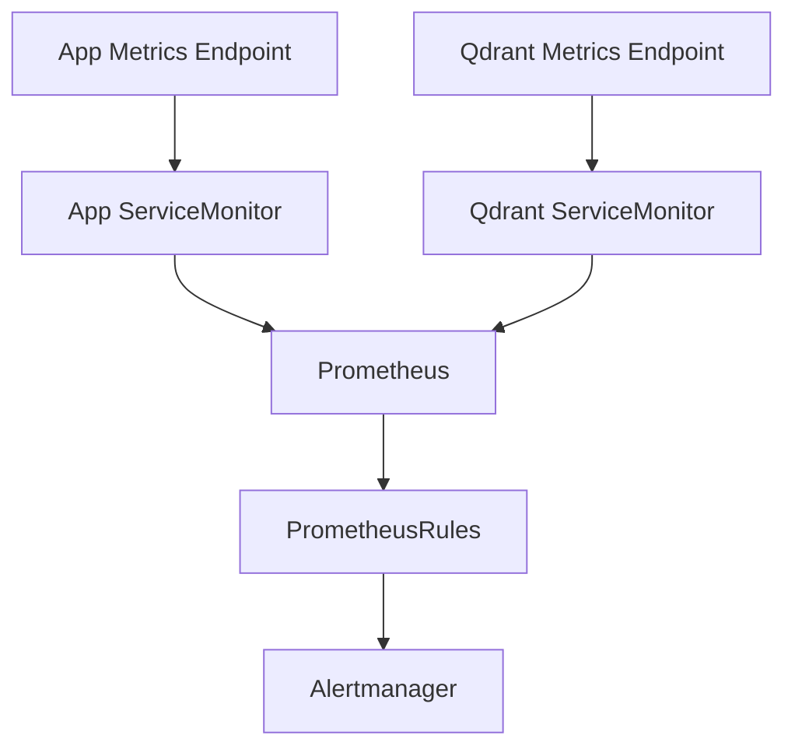
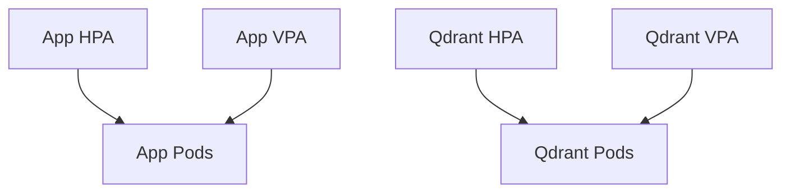
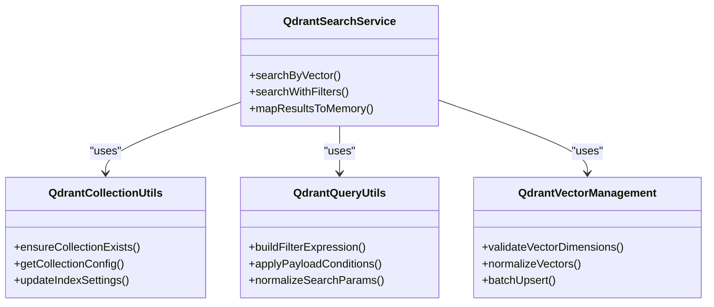
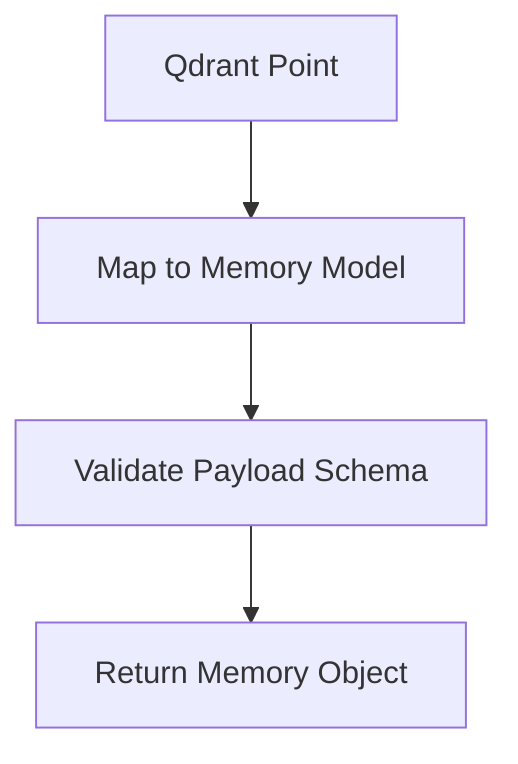
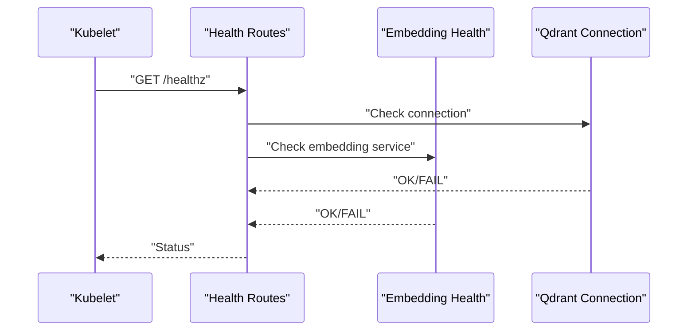
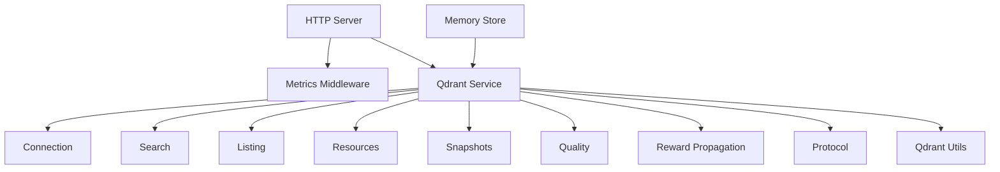

# Performance and Monitoring

<cite>
**Referenced Files in This Document**
- [qdrant-metrics.ts](file://src/services/metrics/qdrant-metrics.ts)
- [http-metrics-middleware.ts](file://src/http/http-metrics-middleware.ts)
- [metrics-server.ts](file://src/metrics-server.ts)
- [prometheusrule.yaml](file://helm/kairos-mcp/templates/prometheusrule.yaml)
- [qdrant-servicemonitor.yaml](file://helm/kairos-mcp/templates/qdrant-servicemonitor.yaml)
- [app-servicemonitor.yaml](file://helm/kairos-mcp/templates/app-servicemonitor.yaml)
- [qdrant-hpa.yaml](file://helm/kairos-mcp/templates/qdrant-hpa.yaml)
- [app-hpa.yaml](file://helm/kairos-mcp/templates/app-hpa.yaml)
- [qdrant-vpa.yaml](file://helm/kairos-mcp/templates/qdrant-vpa.yaml)
- [app-vpa.yaml](file://helm/kairos-mcp/templates/app-vpa.yaml)
- [qdrant-collection-utils.ts](file://src/utils/qdrant-collection-utils.ts)
- [qdrant-query-utils.ts](file://src/utils/qdrant-query-utils.ts)
- [qdrant-vector-management.ts](file://src/utils/qdrant-vector-management.ts)
- [qdrant-vector-types.ts](file://src/utils/qdrant-vector-types.ts)
- [qdrant-search.ts](file://src/services/qdrant/search.ts)
- [qdrant-memory-store.ts](file://src/services/qdrant/memory-store.ts)
- [qdrant-initialization.ts](file://src/services/qdrant/initialization.ts)
- [qdrant-listing.ts](file://src/services/qdrant/listing.ts)
- [qdrant-resources.ts](file://src/services/qdrant/resources.ts)
- [qdrant-snapshots.ts](file://src/services/qdrant/snapshots.ts)
- [qdrant-quality.ts](file://src/services/qdrant/quality.ts)
- [qdrant-reward-propagation.ts](file://src/services/qdrant/reward-propagation.ts)
- [qdrant-connection.ts](file://src/services/qdrant/connection.ts)
- [qdrant-service.ts](file://src/services/qdrant/service.ts)
- [qdrant-types.ts](file://src/services/qdrant/types.ts)
- [qdrant-protocol.ts](file://src/services/qdrant/protocol.ts)
- [qdrant-utils.ts](file://src/utils/qdrant-utils.ts)
- [deploy-raw-qdrant-search.mjs](file://scripts/deploy-raw-qdrant-search.mjs)
- [qdrant-binary.sh](file://scripts/qdrant-binary.sh)
- [qdrant-migrations-boot.md](file://docs/architecture/qdrant-migrations-boot.md)
- [search-query.md](file://docs/architecture/search-query.md)
- [memory-store.ts](file://src/services/memory/store.ts)
- [store-methods.ts](file://src/services/memory/store-methods.ts)
- [qdrant-point-to-memory.ts](file://src/services/memory/qdrant-point-to-memory.ts)
- [embedding-health.ts](file://src/services/embedding/health.ts)
- [http-health-routes.ts](file://src/http/http-health-routes.ts)
</cite>

## Table of Contents
1. [Introduction](#introduction)
2. [Project Structure](#project-structure)
3. [Core Components](#core-components)
4. [Architecture Overview](#architecture-overview)
5. [Detailed Component Analysis](#detailed-component-analysis)
6. [Dependency Analysis](#dependency-analysis)
7. [Performance Considerations](#performance-considerations)
8. [Troubleshooting Guide](#troubleshooting-guide)
9. [Conclusion](#conclusion)
10. [Appendices](#appendices)

## Introduction
This document provides comprehensive guidance for optimizing Qdrant performance and monitoring its behavior within the application. It covers key performance indicators (KPIs), metrics collection, alerting strategies, query performance analysis, index optimization, resource utilization monitoring, health checks, diagnostics, troubleshooting techniques, benchmarking examples, capacity planning, scaling recommendations, and common bottlenecks with solutions. The content is grounded in the repository’s implementation details and deployment artifacts.

## Project Structure
The project integrates Qdrant as a vector store for memory retrieval and search. Performance and monitoring are implemented across:
- Metrics collection and exposition for Qdrant and HTTP endpoints
- Kubernetes ServiceMonitors and PrometheusRules for scraping and alerting
- Horizontal and Vertical Pod Autoscalers for Qdrant and application components
- Utilities for Qdrant collections, queries, vectors, and search flows
- Health endpoints and embedding service health checks

[No sources needed since this diagram shows conceptual workflow, not actual code structure]

## Core Components
- Qdrant metrics collection: Exposes Qdrant-specific counters, histograms, and gauges to Prometheus.
- HTTP metrics middleware: Captures request latency, throughput, and error rates for API routes.
- Metrics server: Serves internal metrics endpoints for scraping.
- Kubernetes observability: ServiceMonitors scrape Qdrant and app metrics; PrometheusRules define alerts.
- Autoscaling: HPAs scale based on CPU/memory or custom metrics; VPAs recommend resources.
- Qdrant utilities: Collection management, query building, vector operations, and search orchestration.
- Memory integration: Mapping between Qdrant points and application memory structures.
- Health endpoints: Readiness/liveness probes and embedding service health checks.

**Section sources**
- [qdrant-metrics.ts](file://src/services/metrics/qdrant-metrics.ts)
- [http-metrics-middleware.ts](file://src/http/http-metrics-middleware.ts)
- [metrics-server.ts](file://src/metrics-server.ts)
- [prometheusrule.yaml](file://helm/kairos-mcp/templates/prometheusrule.yaml)
- [qdrant-servicemonitor.yaml](file://helm/kairos-mcp/templates/qdrant-servicemonitor.yaml)
- [app-servicemonitor.yaml](file://helm/kairos-mcp/templates/app-servicemonitor.yaml)
- [qdrant-hpa.yaml](file://helm/kairos-mcp/templates/qdrant-hpa.yaml)
- [app-hpa.yaml](file://helm/kairos-mcp/templates/app-hpa.yaml)
- [qdrant-vpa.yaml](file://helm/kairos-mcp/templates/qdrant-vpa.yaml)
- [app-vpa.yaml](file://helm/kairos-mcp/templates/app-vpa.yaml)
- [qdrant-collection-utils.ts](file://src/utils/qdrant-collection-utils.ts)
- [qdrant-query-utils.ts](file://src/utils/qdrant-query-utils.ts)
- [qdrant-vector-management.ts](file://src/utils/qdrant-vector-management.ts)
- [qdrant-vector-types.ts](file://src/utils/qdrant-vector-types.ts)
- [qdrant-search.ts](file://src/services/qdrant/search.ts)
- [qdrant-memory-store.ts](file://src/services/qdrant/memory-store.ts)
- [qdrant-initialization.ts](file://src/services/qdrant/initialization.ts)
- [qdrant-listing.ts](file://src/services/qdrant/listing.ts)
- [qdrant-resources.ts](file://src/services/qdrant/resources.ts)
- [qdrant-snapshots.ts](file://src/services/qdrant/snapshots.ts)
- [qdrant-quality.ts](file://src/services/qdrant/quality.ts)
- [qdrant-reward-propagation.ts](file://src/services/qdrant/reward-propagation.ts)
- [qdrant-connection.ts](file://src/services/qdrant/connection.ts)
- [qdrant-service.ts](file://src/services/qdrant/service.ts)
- [qdrant-types.ts](file://src/services/qdrant/types.ts)
- [qdrant-protocol.ts](file://src/services/qdrant/protocol.ts)
- [qdrant-utils.ts](file://src/utils/qdrant-utils.ts)
- [deploy-raw-qdrant-search.mjs](file://scripts/deploy-raw-qdrant-search.mjs)
- [qdrant-binary.sh](file://scripts/qdrant-binary.sh)
- [qdrant-migrations-boot.md](file://docs/architecture/qdrant-migrations-boot.md)
- [search-query.md](file://docs/architecture/search-query.md)
- [memory-store.ts](file://src/services/memory/store.ts)
- [store-methods.ts](file://src/services/memory/store-methods.ts)
- [qdrant-point-to-memory.ts](file://src/services/memory/qdrant-point-to-memory.ts)
- [embedding-health.ts](file://src/services/embedding/health.ts)
- [http-health-routes.ts](file://src/http/http-health-routes.ts)

## Architecture Overview
The system exposes metrics via Prometheus-compatible endpoints and uses Kubernetes ServiceMonitors to collect them. Alerts are defined through PrometheusRules. Autoscaling is configured using HPAs and VPAs for both the application and Qdrant. Qdrant interactions are encapsulated in a dedicated service layer with utilities for collections, queries, and vectors.

**Diagram sources**
- [http-metrics-middleware.ts](file://src/http/http-metrics-middleware.ts)
- [qdrant-service.ts](file://src/services/qdrant/service.ts)
- [qdrant-search.ts](file://src/services/qdrant/search.ts)
- [qdrant-connection.ts](file://src/services/qdrant/connection.ts)
- [metrics-server.ts](file://src/metrics-server.ts)

**Section sources**
- [http-metrics-middleware.ts](file://src/http/http-metrics-middleware.ts)
- [qdrant-service.ts](file://src/services/qdrant/service.ts)
- [qdrant-search.ts](file://src/services/qdrant/search.ts)
- [qdrant-connection.ts](file://src/services/qdrant/connection.ts)
- [metrics-server.ts](file://src/metrics-server.ts)

## Detailed Component Analysis

### Qdrant Metrics Collection
- Purpose: Instrument Qdrant client calls with counters, histograms, and gauges for latency, throughput, errors, and payload sizes.
- Key KPIs:
  - Request rate and latency percentiles for search, upsert, and list operations
  - Error rates by operation and status
  - Payload size distributions
  - Connection pool utilization and retry counts
- Implementation highlights:
  - Centralized metric registry for Qdrant-specific metrics
  - Histogram buckets tuned for typical vector search latencies
  - Labels include operation type, space, and result count where applicable

**Diagram sources**
- [qdrant-metrics.ts](file://src/services/metrics/qdrant-metrics.ts)
- [qdrant-search.ts](file://src/services/qdrant/search.ts)
- [qdrant-memory-store.ts](file://src/services/qdrant/memory-store.ts)

**Section sources**
- [qdrant-metrics.ts](file://src/services/metrics/qdrant-metrics.ts)
- [qdrant-search.ts](file://src/services/qdrant/search.ts)
- [qdrant-memory-store.ts](file://src/services/qdrant/memory-store.ts)

### HTTP Metrics Middleware
- Purpose: Capture per-route request metrics including duration, status codes, and request/response sizes.
- Integration: Applied globally to HTTP routes; complements Qdrant metrics for end-to-end visibility.
- KPIs:
  - Requests per second by endpoint
  - Latency distribution (p50/p90/p99)
  - Error rate by route and status class
  - Active connections and queue depth if applicable

**Diagram sources**
- [http-metrics-middleware.ts](file://src/http/http-metrics-middleware.ts)
- [http-api-routes.ts](file://src/http/http-api-routes.ts)

**Section sources**
- [http-metrics-middleware.ts](file://src/http/http-metrics-middleware.ts)
- [http-api-routes.ts](file://src/http/http-api-routes.ts)

### Observability and Alerting
- Scraping:
  - Application metrics exposed via metrics server
  - Qdrant metrics scraped via ServiceMonitor
- Alerting:
  - PrometheusRules define thresholds for latency, error rates, and resource saturation
  - Alerts target Qdrant and application components
- Visualization:
  - Grafana dashboards can be built from collected metrics

**Diagram sources**
- [metrics-server.ts](file://src/metrics-server.ts)
- [app-servicemonitor.yaml](file://helm/kairos-mcp/templates/app-servicemonitor.yaml)
- [qdrant-servicemonitor.yaml](file://helm/kairos-mcp/templates/qdrant-servicemonitor.yaml)
- [prometheusrule.yaml](file://helm/kairos-mcp/templates/prometheusrule.yaml)

**Section sources**
- [metrics-server.ts](file://src/metrics-server.ts)
- [app-servicemonitor.yaml](file://helm/kairos-mcp/templates/app-servicemonitor.yaml)
- [qdrant-servicemonitor.yaml](file://helm/kairos-mcp/templates/qdrant-servicemonitor.yaml)
- [prometheusrule.yaml](file://helm/kairos-mcp/templates/prometheusrule.yaml)

### Autoscaling and Resource Management
- Horizontal Pod Autoscaler (HPA):
  - Scales replicas based on CPU/memory or custom metrics (e.g., Qdrant request latency)
- Vertical Pod Autoscaler (VPA):
  - Recommends optimal resource requests/limits for pods
- Configuration:
  - Separate HPAs and VPAs for application and Qdrant workloads

**Diagram sources**
- [app-hpa.yaml](file://helm/kairos-mcp/templates/app-hpa.yaml)
- [qdrant-hpa.yaml](file://helm/kairos-mcp/templates/qdrant-hpa.yaml)
- [app-vpa.yaml](file://helm/kairos-mcp/templates/app-vpa.yaml)
- [qdrant-vpa.yaml](file://helm/kairos-mcp/templates/qdrant-vpa.yaml)

**Section sources**
- [app-hpa.yaml](file://helm/kairos-mcp/templates/app-hpa.yaml)
- [qdrant-hpa.yaml](file://helm/kairos-mcp/templates/qdrant-hpa.yaml)
- [app-vpa.yaml](file://helm/kairos-mcp/templates/app-vpa.yaml)
- [qdrant-vpa.yaml](file://helm/kairos-mcp/templates/qdrant-vpa.yaml)

### Qdrant Utilities and Search Flow
- Collections and indices:
  - Utility functions manage collection existence, configuration, and schema alignment
- Query construction:
  - Helpers build filter expressions, payload conditions, and vector parameters
- Vector management:
  - Types and helpers ensure consistent vector dimensions and normalization
- Search orchestration:
  - Service layer coordinates search, filtering, and result mapping

**Diagram sources**
- [qdrant-collection-utils.ts](file://src/utils/qdrant-collection-utils.ts)
- [qdrant-query-utils.ts](file://src/utils/qdrant-query-utils.ts)
- [qdrant-vector-management.ts](file://src/utils/qdrant-vector-management.ts)
- [qdrant-search.ts](file://src/services/qdrant/search.ts)

**Section sources**
- [qdrant-collection-utils.ts](file://src/utils/qdrant-collection-utils.ts)
- [qdrant-query-utils.ts](file://src/utils/qdrant-query-utils.ts)
- [qdrant-vector-management.ts](file://src/utils/qdrant-vector-management.ts)
- [qdrant-search.ts](file://src/services/qdrant/search.ts)

### Memory Integration and Point Mapping
- Mapping:
  - Converts Qdrant points into application memory structures
- Consistency:
  - Ensures payload schemas align with memory models
- Performance:
  - Minimizes serialization overhead during read paths

**Diagram sources**
- [qdrant-point-to-memory.ts](file://src/services/memory/qdrant-point-to-memory.ts)
- [memory-store.ts](file://src/services/memory/store.ts)
- [store-methods.ts](file://src/services/memory/store-methods.ts)

**Section sources**
- [qdrant-point-to-memory.ts](file://src/services/memory/qdrant-point-to-memory.ts)
- [memory-store.ts](file://src/services/memory/store.ts)
- [store-methods.ts](file://src/services/memory/store-methods.ts)

### Health Checks and Diagnostics
- Health endpoints:
  - Liveness/readiness probes for application and Qdrant connectivity
- Embedding health:
  - Checks embedding provider availability and latency
- Diagnostics:
  - Export raw Qdrant search payloads for debugging
  - Scripts to bootstrap Qdrant binary and migrations

**Diagram sources**
- [http-health-routes.ts](file://src/http/http-health-routes.ts)
- [embedding-health.ts](file://src/services/embedding/health.ts)
- [qdrant-connection.ts](file://src/services/qdrant/connection.ts)

**Section sources**
- [http-health-routes.ts](file://src/http/http-health-routes.ts)
- [embedding-health.ts](file://src/services/embedding/health.ts)
- [qdrant-connection.ts](file://src/services/qdrant/connection.ts)

## Dependency Analysis
Key dependencies and relationships:
- HTTP layer depends on metrics middleware and Qdrant service
- Qdrant service depends on connection, search, listing, resources, snapshots, quality, reward propagation, and protocol definitions
- Utilities provide shared functionality for collections, queries, and vectors
- Memory store bridges Qdrant points to application models

**Diagram sources**
- [http-metrics-middleware.ts](file://src/http/http-metrics-middleware.ts)
- [qdrant-service.ts](file://src/services/qdrant/service.ts)
- [qdrant-connection.ts](file://src/services/qdrant/connection.ts)
- [qdrant-search.ts](file://src/services/qdrant/search.ts)
- [qdrant-listing.ts](file://src/services/qdrant/listing.ts)
- [qdrant-resources.ts](file://src/services/qdrant/resources.ts)
- [qdrant-snapshots.ts](file://src/services/qdrant/snapshots.ts)
- [qdrant-quality.ts](file://src/services/qdrant/quality.ts)
- [qdrant-reward-propagation.ts](file://src/services/qdrant/reward-propagation.ts)
- [qdrant-protocol.ts](file://src/services/qdrant/protocol.ts)
- [qdrant-utils.ts](file://src/utils/qdrant-utils.ts)
- [memory-store.ts](file://src/services/memory/store.ts)

**Section sources**
- [http-metrics-middleware.ts](file://src/http/http-metrics-middleware.ts)
- [qdrant-service.ts](file://src/services/qdrant/service.ts)
- [qdrant-connection.ts](file://src/services/qdrant/connection.ts)
- [qdrant-search.ts](file://src/services/qdrant/search.ts)
- [qdrant-listing.ts](file://src/services/qdrant/listing.ts)
- [qdrant-resources.ts](file://src/services/qdrant/resources.ts)
- [qdrant-snapshots.ts](file://src/services/qdrant/snapshots.ts)
- [qdrant-quality.ts](file://src/services/qdrant/quality.ts)
- [qdrant-reward-propagation.ts](file://src/services/qdrant/reward-propagation.ts)
- [qdrant-protocol.ts](file://src/services/qdrant/protocol.ts)
- [qdrant-utils.ts](file://src/utils/qdrant-utils.ts)
- [memory-store.ts](file://src/services/memory/store.ts)

## Performance Considerations
- Index optimization:
  - Ensure collection configurations match workload characteristics (dimensionality, distance metric, indexing level)
  - Use batch upserts for high-throughput ingestion
  - Avoid frequent re-indexing; schedule maintenance windows
- Query tuning:
  - Limit top-k results to reduce payload processing
  - Apply precise filters to minimize scan scope
  - Normalize vectors consistently to improve recall and speed
- Resource utilization:
  - Monitor CPU/memory saturation on Qdrant nodes
  - Scale horizontally when latency increases under load
  - Use VPAs to right-size pod resources over time
- Concurrency and backpressure:
  - Tune connection pools and request concurrency limits
  - Implement retries with exponential backoff for transient failures
- Data lifecycle:
  - Periodically prune stale data to maintain index efficiency
  - Snapshot and restore procedures should be scheduled off-peak

[No sources needed since this section provides general guidance]

## Troubleshooting Guide
Common issues and resolutions:
- High latency spikes:
  - Check Qdrant node CPU/memory and disk I/O
  - Review recent index changes or large batch writes
  - Inspect Prometheus alerts for latency thresholds
- Elevated error rates:
  - Verify Qdrant connectivity and authentication
  - Inspect malformed payloads or schema mismatches
  - Review retry policies and circuit breakers
- Scaling anomalies:
  - Validate HPA metrics targets and thresholds
  - Confirm VPA recommendations and apply conservative updates
- Health check failures:
  - Inspect liveness/readiness probe logs
  - Validate embedding service availability and timeouts
- Diagnostic steps:
  - Export raw Qdrant search payloads for reproduction
  - Use scripts to bootstrap Qdrant binary and validate environment
  - Review migration boot documentation for schema consistency

**Section sources**
- [prometheusrule.yaml](file://helm/kairos-mcp/templates/prometheusrule.yaml)
- [qdrant-connection.ts](file://src/services/qdrant/connection.ts)
- [http-health-routes.ts](file://src/http/http-health-routes.ts)
- [embedding-health.ts](file://src/services/embedding/health.ts)
- [deploy-raw-qdrant-search.mjs](file://scripts/deploy-raw-qdrant-search.mjs)
- [qdrant-binary.sh](file://scripts/qdrant-binary.sh)
- [qdrant-migrations-boot.md](file://docs/architecture/qdrant-migrations-boot.md)

## Conclusion
Effective Qdrant performance and monitoring require coordinated instrumentation, alerting, autoscaling, and operational practices. By leveraging the provided metrics, ServiceMonitors, PrometheusRules, and autoscalers, teams can maintain low-latency search and robust ingestion. Continuous tuning of indexes, queries, and resources, combined with proactive troubleshooting, ensures reliable scaling and resilience.

[No sources needed since this section summarizes without analyzing specific files]

## Appendices

### Benchmarking Examples
- Synthetic workload generation:
  - Create representative datasets with realistic vector dimensions and payload sizes
  - Simulate mixed read/write patterns to reflect production traffic
- Measurement approach:
  - Track end-to-end latency, throughput, and error rates
  - Correlate application metrics with Qdrant node metrics
- Iterative tuning:
  - Adjust batch sizes, top-k, and filters
  - Re-run benchmarks after index or resource changes

[No sources needed since this section provides general guidance]

### Capacity Planning
- Estimate storage growth based on vector count and payload size
- Plan CPU/memory headroom for peak loads and index rebuilds
- Use VPAs to inform long-term resource requests/limits
- Schedule snapshotting and backups to avoid contention

[No sources needed since this section provides general guidance]

### Scaling Recommendations
- Horizontal scaling:
  - Increase Qdrant replicas when latency or error rates rise
  - Distribute write load across multiple nodes
- Vertical scaling:
  - Right-size pods using VPA recommendations
  - Monitor disk I/O and adjust storage classes if necessary
- Autoscaling policies:
  - Set conservative HPA thresholds to avoid thrashing
  - Incorporate custom metrics (e.g., p99 latency) for responsiveness

[No sources needed since this section provides general guidance]