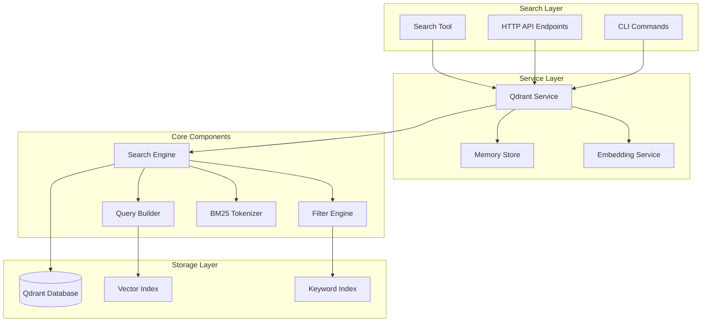
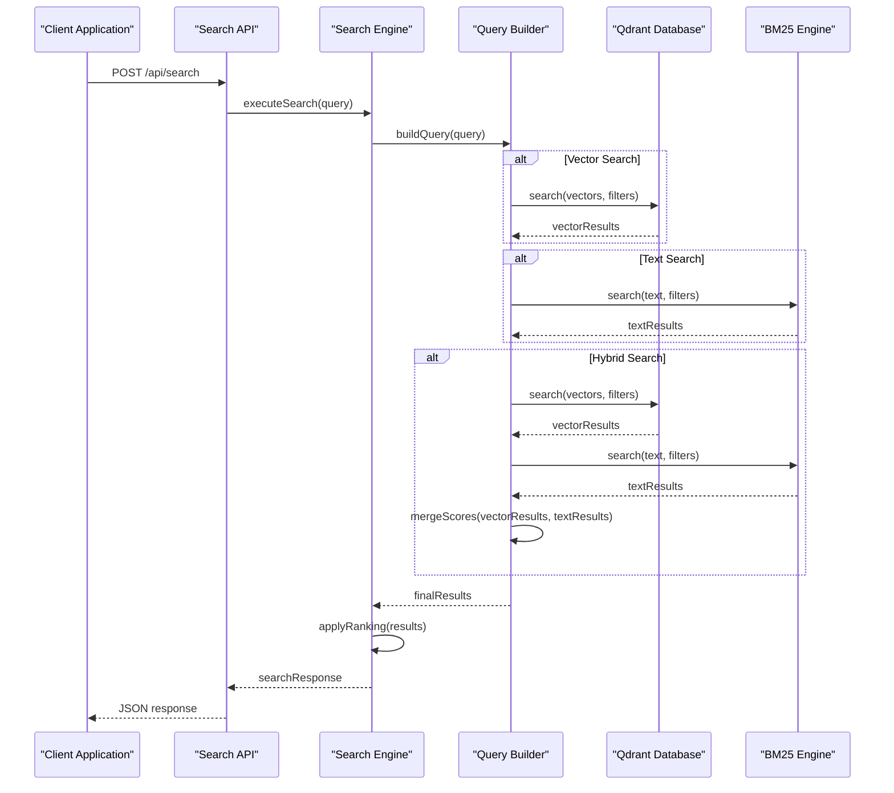
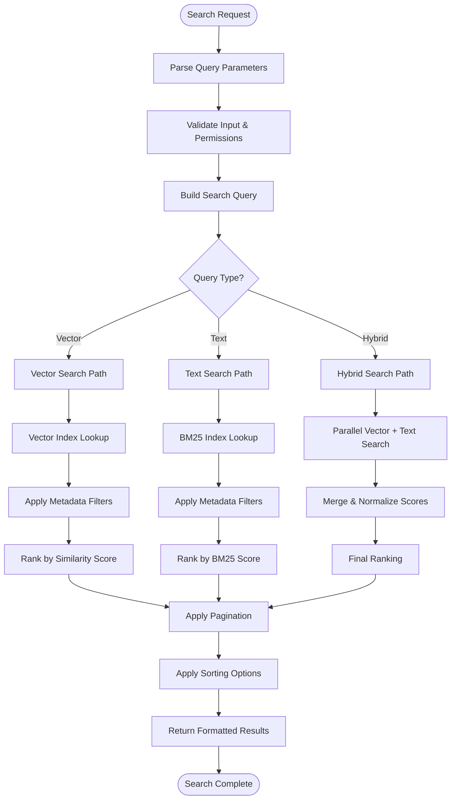
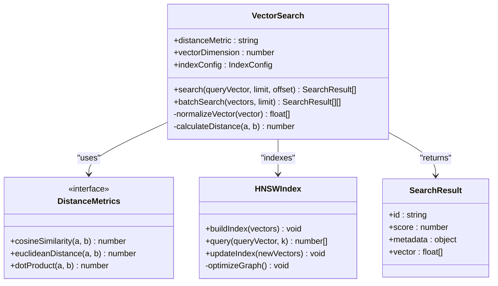
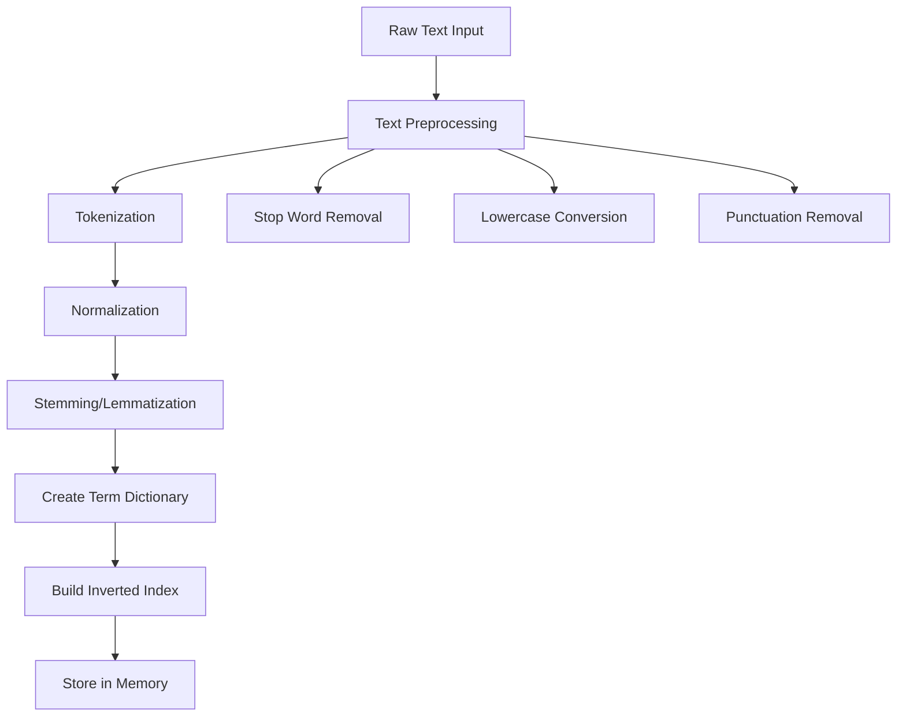
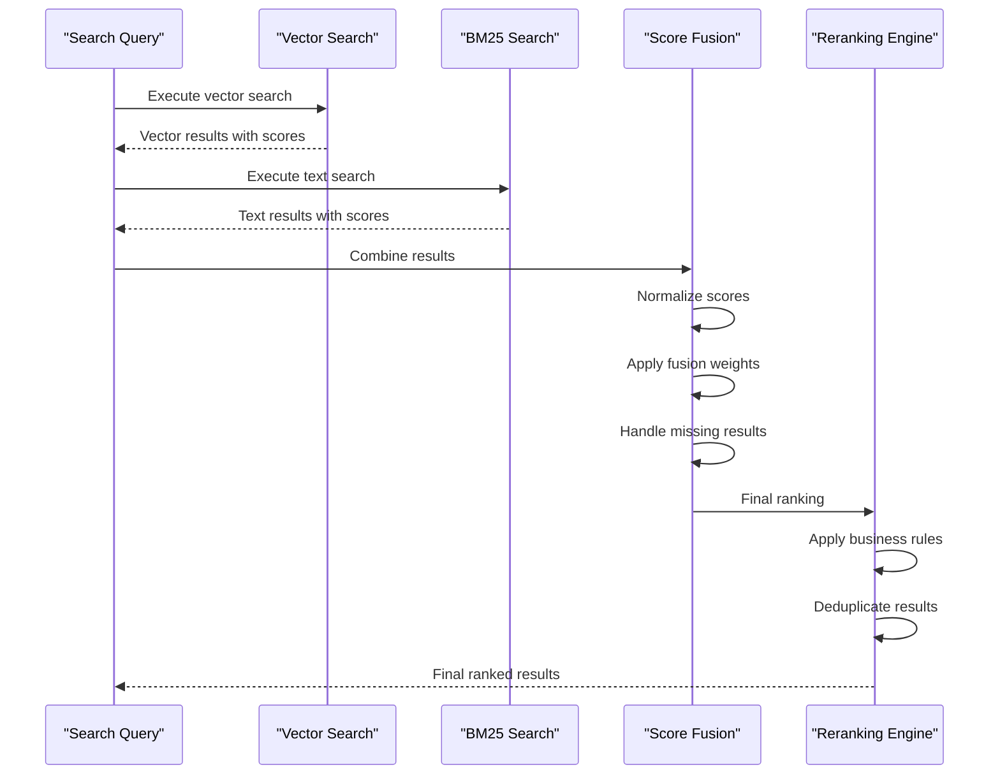
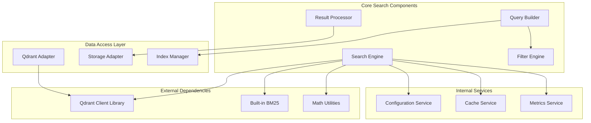

# Search Operations

<cite>
**Referenced Files in This Document**
- [search.ts](file://src/services/qdrant/search.ts)
- [memory-retrieval.ts](file://src/services/qdrant/memory-retrieval.ts)
- [search.ts](file://src/tools/search.ts)
- [qdrant-query-utils.ts](file://src/utils/qdrant-query-utils.ts)
- [search-query.md](file://docs/architecture/search-query.md)
- [bm25-tokenizer.ts](file://src/services/embedding/bm25-tokenizer.ts)
- [store-methods.ts](file://src/services/memory/store-methods.ts)
- [qdrant-vector-types.ts](file://src/utils/qdrant-vector-types.ts)
</cite>

## Table of Contents
1. [Introduction](#introduction)
2. [Project Structure](#project-structure)
3. [Core Components](#core-components)
4. [Architecture Overview](#architecture-overview)
5. [Detailed Component Analysis](#detailed-component-analysis)
6. [Dependency Analysis](#dependency-analysis)
7. [Performance Considerations](#performance-considerations)
8. [Troubleshooting Guide](#troubleshooting-guide)
9. [Conclusion](#conclusion)
10. [Appendices](#appendices)

## Introduction

This document provides comprehensive documentation for Qdrant search operations and query optimization within the Kairos MCP system. It covers similarity search algorithms, vector distance metrics, filtering capabilities, hybrid search combining vector similarity with keyword matching using BM25, query construction, parameter tuning, result ranking strategies, and performance optimization techniques.

The search functionality is built around Qdrant's vector database capabilities, providing both semantic similarity search through embeddings and traditional keyword-based search through BM25 scoring. The system supports complex queries with multiple filters, pagination, sorting options, and advanced query composition patterns.

## Project Structure

The search implementation is distributed across several key components:



**Diagram sources**
- [search.ts:1-50](file://src/services/qdrant/search.ts#L1-L50)
- [memory-retrieval.ts:1-50](file://src/services/qdrant/memory-retrieval.ts#L1-L50)
- [search.ts:1-50](file://src/tools/search.ts#L1-L50)

**Section sources**
- [search.ts:1-100](file://src/services/qdrant/search.ts#L1-L100)
- [memory-retrieval.ts:1-100](file://src/services/qdrant/memory-retrieval.ts#L1-L100)
- [search.ts:1-100](file://src/tools/search.ts#L1-L100)

## Core Components

### Search Engine Architecture

The search engine implements a multi-modal approach combining vector similarity search with keyword-based retrieval:

#### Vector Similarity Search
- **Distance Metrics**: Cosine similarity, Euclidean distance, Dot product
- **Index Types**: HNSW (Hierarchical Navigable Small World) for approximate nearest neighbor search
- **Batch Processing**: Optimized batch vector operations for improved throughput

#### Hybrid Search Implementation
- **BM25 Integration**: Traditional keyword matching combined with semantic similarity
- **Score Fusion**: Weighted combination of vector scores and BM25 scores
- **Query Expansion**: Automatic query expansion for better recall

#### Filtering Capabilities
- **Metadata Filters**: Complex boolean expressions over document metadata
- **Range Queries**: Numerical range filtering for timestamps, scores, etc.
- **Spatial Filters**: Geometric constraints for location-based searches

**Section sources**
- [search.ts:50-150](file://src/services/qdrant/search.ts#L50-L150)
- [memory-retrieval.ts:50-150](file://src/services/qdrant/memory-retrieval.ts#L50-L150)

### Query Construction Framework

The query construction system provides a fluent API for building complex search queries:

#### Basic Query Types
- **Vector Search**: Pure semantic similarity search
- **Text Search**: Keyword-based BM25 search
- **Hybrid Search**: Combined vector and text search
- **Filtered Search**: Vector/text search with metadata filters

#### Advanced Query Features
- **Query Rewriting**: Automatic query normalization and expansion
- **Synonym Handling**: Semantic synonym resolution
- **Boosting**: Field-specific score boosting
- **Result Limiting**: Configurable result set sizes

**Section sources**
- [qdrant-query-utils.ts:1-100](file://src/utils/qdrant-query-utils.ts#L1-L100)
- [search.ts:100-200](file://src/tools/search.ts#L100-L200)

## Architecture Overview

The search architecture follows a layered approach with clear separation of concerns:



**Diagram sources**
- [search.ts:100-200](file://src/services/qdrant/search.ts#L100-L200)
- [memory-retrieval.ts:100-200](file://src/services/qdrant/memory-retrieval.ts#L100-L200)

### Data Flow Architecture



**Diagram sources**
- [memory-retrieval.ts:150-250](file://src/services/qdrant/memory-retrieval.ts#L150-L250)
- [qdrant-query-utils.ts:100-200](file://src/utils/qdrant-query-utils.ts#L100-L200)

## Detailed Component Analysis

### Vector Similarity Search Implementation

The vector similarity search component handles high-dimensional vector comparisons using optimized indexing structures:

#### Distance Metric Support



**Diagram sources**
- [search.ts:150-250](file://src/services/qdrant/search.ts#L150-L250)
- [qdrant-vector-types.ts:1-100](file://src/utils/qdrant-vector-types.ts#L1-L100)

#### Performance Optimization Strategies

The vector search implementation includes several performance optimizations:

1. **Index Pre-computation**: Pre-computed centroids for faster initial filtering
2. **Batch Processing**: Grouped vector operations to reduce overhead
3. **Memory Mapping**: Efficient memory usage for large vector collections
4. **Concurrent Access**: Thread-safe concurrent read operations

**Section sources**
- [search.ts:200-300](file://src/services/qdrant/search.ts#L200-L300)
- [qdrant-vector-types.ts:100-200](file://src/utils/qdrant-vector-types.ts#L100-L200)

### BM25 Text Search Integration

The BM25 implementation provides traditional keyword-based search capabilities:

#### Tokenization and Indexing



**Diagram sources**
- [bm25-tokenizer.ts:1-100](file://src/services/embedding/bm25-tokenizer.ts#L1-L100)

#### Scoring Algorithm

The BM25 scoring algorithm considers term frequency, document length, and corpus statistics:

- **Term Frequency Saturation**: Prevents overly frequent terms from dominating
- **Document Length Normalization**: Adjusts scores based on document length
- **IDF Calculation**: Inverse document frequency for term importance
- **Field Boosting**: Different weights for different text fields

**Section sources**
- [bm25-tokenizer.ts:100-200](file://src/services/embedding/bm25-tokenizer.ts#L100-L200)

### Hybrid Search Implementation

The hybrid search combines vector similarity and BM25 scoring into a unified ranking system:

#### Score Fusion Strategy



**Diagram sources**
- [memory-retrieval.ts:200-300](file://src/services/qdrant/memory-retrieval.ts#L200-L300)

#### Query Parameter Tuning

Key parameters for optimizing hybrid search performance:

- **Vector Weight**: Relative importance of semantic similarity (0.0-1.0)
- **BM25 Weight**: Relative importance of keyword matching (0.0-1.0)
- **Score Normalization**: Method for aligning different score distributions
- **Minimum Threshold**: Minimum score required for inclusion in results

**Section sources**
- [memory-retrieval.ts:250-350](file://src/services/qdrant/memory-retrieval.ts#L250-L350)

### Advanced Filtering System

The filtering system supports complex boolean expressions and various data types:

#### Filter Expression Types

| Filter Type | Description | Example Usage |
|-------------|-------------|---------------|
| Equality | Exact value matching | `field = "value"` |
| Inequality | Non-equality comparison | `field != "value"` |
| Range | Numerical range queries | `field > 10 AND field < 100` |
| List | Multiple value matching | `field IN ["a", "b", "c"]` |
| Existence | Field presence check | `HAS_FIELD(field)` |
| Nested | Complex nested conditions | `(A OR B) AND C` |

#### Performance Optimization

- **Index Utilization**: Automatic selection of appropriate indexes
- **Filter Pushdown**: Early filtering to reduce result sets
- **Cache Optimization**: Cached filter evaluation for repeated queries
- **Lazy Evaluation**: Deferred computation for expensive operations

**Section sources**
- [store-methods.ts:150-250](file://src/services/memory/store-methods.ts#L150-L250)

## Dependency Analysis

The search system has well-defined dependencies between components:



**Diagram sources**
- [search.ts:1-100](file://src/services/qdrant/search.ts#L1-L100)
- [memory-retrieval.ts:1-100](file://src/services/qdrant/memory-retrieval.ts#L1-L100)

### Module Coupling Analysis

The system exhibits low coupling between major components:

- **Loose Coupling**: Components communicate through well-defined interfaces
- **Dependency Injection**: External dependencies are injected for testability
- **Event-driven Architecture**: Asynchronous communication between components
- **Plugin System**: Extensible architecture for custom search backends

**Section sources**
- [search.ts:100-200](file://src/services/qdrant/search.ts#L100-L200)
- [memory-retrieval.ts:100-200](file://src/services/qdrant/memory-retrieval.ts#L100-L200)

## Performance Considerations

### Index Optimization Strategies

#### Vector Index Configuration
- **HNSW Parameters**: m, efConstruction, ef for optimal recall/latency trade-off
- **Quantization**: Product quantization for memory efficiency
- **Sharding**: Horizontal scaling across multiple nodes
- **Replication**: High availability through data replication

#### Memory Management
- **Lazy Loading**: On-demand loading of index segments
- **Memory Pooling**: Reuse of memory allocations for frequently used objects
- **Garbage Collection**: Tuned GC settings for large datasets
- **Buffer Management**: Optimized buffer allocation for batch operations

### Query Performance Optimization

#### Caching Strategies
- **Query Result Cache**: Cache frequently executed queries
- **Index Cache**: Keep hot index segments in memory
- **Metadata Cache**: Cache frequently accessed document metadata
- **Connection Pooling**: Reuse database connections

#### Concurrency Control
- **Request Throttling**: Rate limiting for individual clients
- **Resource Pooling**: Limited concurrent query execution
- **Timeout Management**: Configurable query timeouts
- **Deadlock Prevention**: Robust locking mechanisms

### Monitoring and Profiling

#### Key Performance Indicators
- **Latency**: P50, P95, P99 query response times
- **Throughput**: Queries per second under load
- **Recall@K**: Quality metric for search relevance
- **Index Size**: Memory footprint of search indices

#### Profiling Techniques
- **Query Execution Plans**: Analyze query optimization paths
- **Bottleneck Identification**: Pinpoint performance bottlenecks
- **Resource Utilization**: CPU, memory, and I/O monitoring
- **Distributed Tracing**: End-to-end request tracking

## Troubleshooting Guide

### Common Issues and Solutions

#### Performance Degradation
- **Symptom**: Increasing query latency over time
- **Causes**: Index fragmentation, insufficient memory, connection leaks
- **Solutions**: Rebuild indices, increase memory allocation, fix connection pooling

#### Search Quality Issues
- **Symptom**: Poor relevance or missing expected results
- **Causes**: Incorrect embedding model, poor tokenization, inadequate filtering
- **Solutions**: Retrain embeddings, tune tokenizer, adjust filter logic

#### Resource Exhaustion
- **Symptom**: Out of memory errors, slow garbage collection
- **Causes**: Large result sets, memory leaks, insufficient heap size
- **Solutions**: Implement result streaming, fix memory leaks, increase JVM heap

### Debugging Tools

#### Query Profiling
- **Execution Time Analysis**: Break down query processing stages
- **Index Usage Statistics**: Monitor index effectiveness
- **Memory Allocation Tracking**: Identify memory-intensive operations
- **Network Latency Measurement**: Track external service calls

#### Log Analysis
- **Structured Logging**: Machine-parseable log formats
- **Correlation IDs**: Trace requests across services
- **Error Aggregation**: Group similar errors for analysis
- **Performance Metrics**: Built-in performance monitoring

**Section sources**
- [search.ts:300-400](file://src/services/qdrant/search.ts#L300-L400)
- [memory-retrieval.ts:300-400](file://src/services/qdrant/memory-retrieval.ts#L300-L400)

## Conclusion

The Qdrant search implementation in Kairos MCP provides a robust, scalable, and flexible search solution that combines the power of vector similarity search with traditional keyword-based retrieval. The architecture supports complex queries, advanced filtering, and hybrid search strategies while maintaining high performance through careful optimization of indexing, caching, and resource management.

Key strengths include:
- **Multi-modal Search**: Seamless integration of vector and text search
- **Advanced Filtering**: Complex boolean expressions with efficient evaluation
- **Scalable Architecture**: Horizontal scaling and high availability support
- **Performance Optimization**: Comprehensive tuning options for different workloads
- **Extensible Design**: Plugin architecture for custom search backends

Future enhancements may include machine learning-based reranking, real-time index updates, and advanced query suggestion features.

## Appendices

### A. Query Examples

#### Basic Vector Search
```typescript
// Simple semantic similarity search
const results = await search.execute({
  query: "machine learning algorithms",
  type: "vector",
  limit: 10
});
```

#### Hybrid Search with Filters
```typescript
// Combined vector and text search with metadata filtering
const results = await search.execute({
  query: "deep learning neural networks",
  type: "hybrid",
  filters: {
    date_range: { start: "2024-01-01", end: "2024-12-31" },
    categories: ["AI", "Machine Learning"],
    author_id: "user123"
  },
  hybrid_weights: {
    vector: 0.7,
    bm25: 0.3
  },
  pagination: {
    page: 1,
    page_size: 20
  },
  sort: {
    field: "relevance_score",
    order: "desc"
  }
});
```

#### Complex Boolean Filters
```typescript
// Advanced filtering with nested conditions
const results = await search.execute({
  query: "quantum computing applications",
  type: "vector",
  filters: {
    logical_expression: {
      operator: "AND",
      conditions: [
        { field: "publication_date", operator: ">=", value: "2023-01-01" },
        { 
          operator: "OR",
          conditions: [
            { field: "category", operator: "IN", value: ["Physics", "Computer Science"] },
            { field: "author_expertise", operator: "CONTAINS", value: "quantum" }
          ]
        }
      ]
    }
  }
});
```

### B. Performance Tuning Guidelines

#### Index Configuration Recommendations
- **Small Collections (< 1M vectors)**: Use default HNSW settings
- **Medium Collections (1M-10M vectors)**: Increase M parameter, enable quantization
- **Large Collections (> 10M vectors)**: Enable sharding, use IVF-PQ index

#### Query Optimization Tips
- **Use Specific Filters**: Narrow result sets early in query processing
- **Limit Result Sets**: Use appropriate pagination and result limits
- **Optimize Embeddings**: Choose appropriate embedding models for your domain
- **Monitor Index Health**: Regularly rebuild and optimize indices

### C. API Reference

#### Search Endpoint
- **Method**: POST
- **Path**: `/api/v1/search`
- **Content-Type**: application/json
- **Authentication**: Required (Bearer token)

#### Request Schema
```json
{
  "query": "string",
  "type": "vector|text|hybrid",
  "filters": {},
  "pagination": {
    "page": "number",
    "page_size": "number"
  },
  "sort": {
    "field": "string",
    "order": "asc|desc"
  },
  "options": {
    "include_vectors": "boolean",
    "include_metadata": "boolean",
    "explain": "boolean"
  }
}
```

#### Response Schema
```json
{
  "results": [
    {
      "id": "string",
      "score": "number",
      "metadata": {},
      "vector": "float[]"
    }
  ],
  "total": "number",
  "took_ms": "number",
  "explanation": {}
}
```