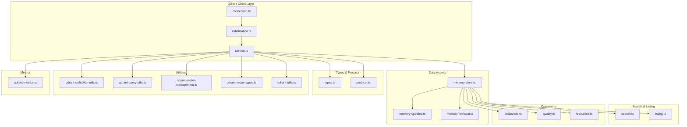
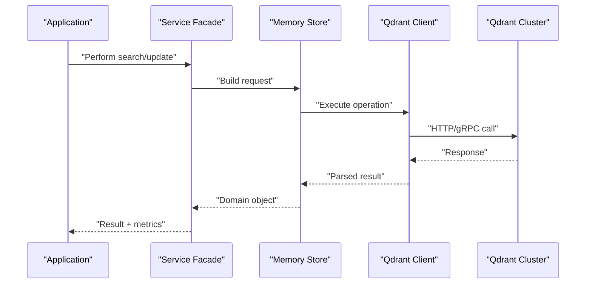
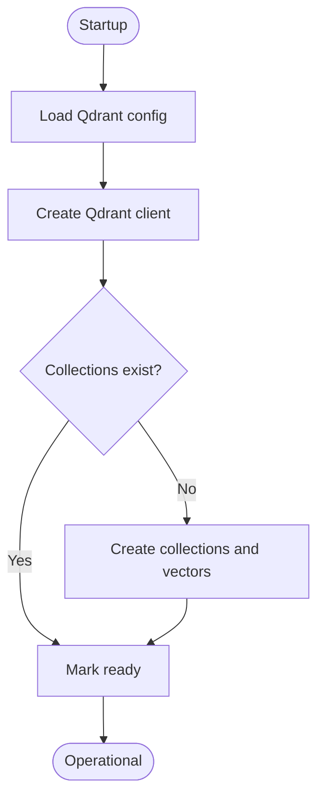
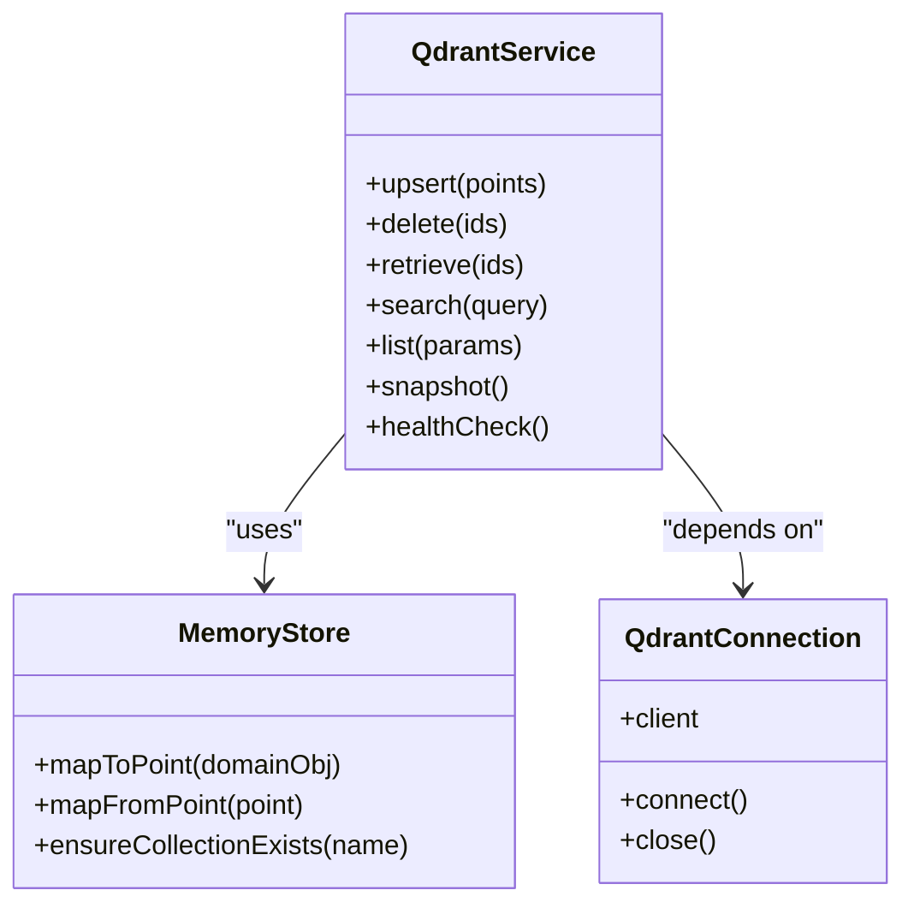
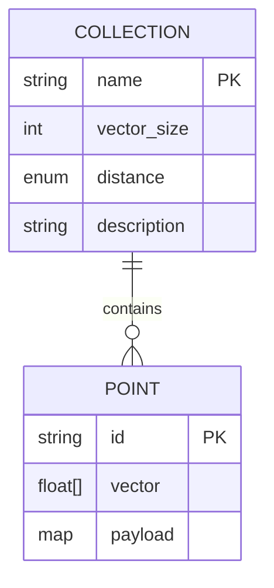
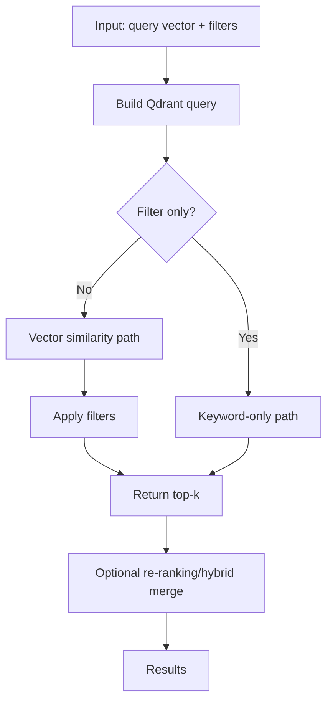
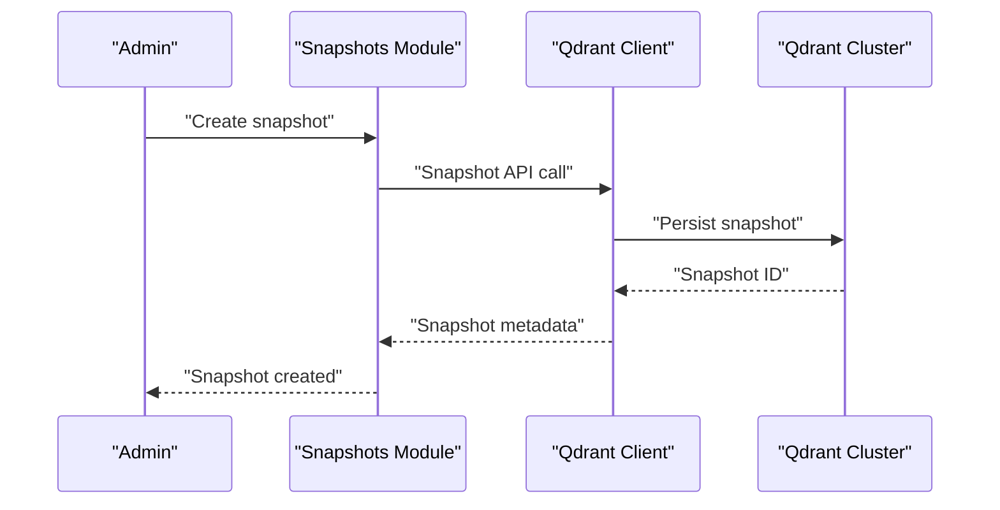
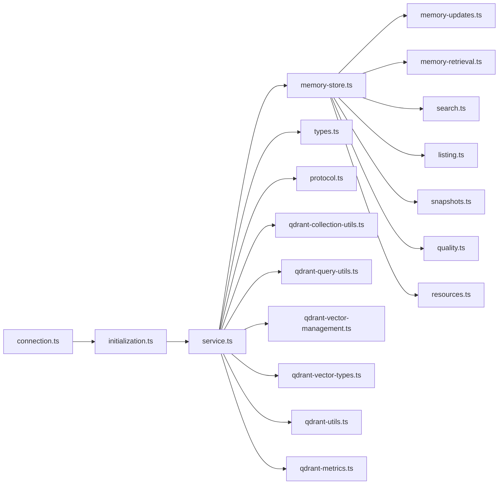

# Vector Database Integration

<cite>
**Referenced Files in This Document**
- [src/services/qdrant/connection.ts](file://src/services/qdrant/connection.ts)
- [src/services/qdrant/initialization.ts](file://src/services/qdrant/initialization.ts)
- [src/services/qdrant/service.ts](file://src/services/qdrant/service.ts)
- [src/services/qdrant/index.ts](file://src/services/qdrant/index.ts)
- [src/services/qdrant/memory-store.ts](file://src/services/qdrant/memory-store.ts)
- [src/services/qdrant/memory-updates.ts](file://src/services/qdrant/memory-updates.ts)
- [src/services/qdrant/memory-retrieval.ts](file://src/services/qdrant/memory-retrieval.ts)
- [src/services/qdrant/search.ts](file://src/services/qdrant/search.ts)
- [src/services/qdrant/listing.ts](file://src/services/qdrant/listing.ts)
- [src/services/qdrant/snapshots.ts](file://src/services/qdrant/snapshots.ts)
- [src/services/qdrant/types.ts](file://src/services/qdrant/types.ts)
- [src/services/qdrant/protocol.ts](file://src/services/qdrant/protocol.ts)
- [src/services/qdrant/resources.ts](file://src/services/qdrant/resources.ts)
- [src/services/qdrant/quality.ts](file://src/services/qdrant/quality.ts)
- [src/utils/qdrant-collection-utils.ts](file://src/utils/qdrant-collection-utils.ts)
- [src/utils/qdrant-query-utils.ts](file://src/utils/qdrant-query-utils.ts)
- [src/utils/qdrant-vector-management.ts](file://src/utils/qdrant-vector-management.ts)
- [src/utils/qdrant-vector-types.ts](file://src/utils/qdrant-vector-types.ts)
- [src/utils/qdrant-utils.ts](file://src/utils/qdrant-utils.ts)
- [src/metrics/qdrant-metrics.ts](file://src/metrics/qdrant-metrics.ts)
- [helm/kairos-mcp/templates/qdrant-hpa.yaml](file://helm/kairos-mcp/templates/qdrant-hpa.yaml)
- [helm/kairos-mcp/templates/qdrant-servicemonitor.yaml](file://helm/kairos-mcp/templates/qdrant-servicemonitor.yaml)
- [scripts/deploy-raw-qdrant-search.mjs](file://scripts/deploy-raw-qdrant-search.mjs)
</cite>

## Table of Contents
1. [Introduction](#introduction)
2. [Project Structure](#project-structure)
3. [Core Components](#core-components)
4. [Architecture Overview](#architecture-overview)
5. [Detailed Component Analysis](#detailed-component-analysis)
6. [Dependency Analysis](#dependency-analysis)
7. [Performance Considerations](#performance-considerations)
8. [Troubleshooting Guide](#troubleshooting-guide)
9. [Conclusion](#conclusion)
10. [Appendices](#appendices)

## Introduction
This document explains how the application integrates with Qdrant as a vector database for semantic memory and search. It covers connection management, cluster configuration, high availability setup, indexing strategies, collection management, schema definitions, search operations (similarity, filtering, hybrid), performance tuning, monitoring, custom algorithms, batch operations, error recovery, scaling, backups, and maintenance tasks. The goal is to provide both conceptual guidance and code-level references so that engineers can operate and extend the integration confidently.

## Project Structure
The Qdrant integration is implemented under services/qdrant and supported by utilities and metrics modules:
- Connection and lifecycle: connection.ts, initialization.ts, service.ts
- Data access layer: memory-store.ts, memory-updates.ts, memory-retrieval.ts
- Search and listing: search.ts, listing.ts
- Operational features: snapshots.ts, quality.ts, resources.ts
- Types and protocol helpers: types.ts, protocol.ts
- Utilities: qdrant-* files under utils
- Metrics: qdrant-metrics.ts
- Helm charts for HPA and ServiceMonitor

**Diagram sources**
- [src/services/qdrant/connection.ts](file://src/services/qdrant/connection.ts)
- [src/services/qdrant/initialization.ts](file://src/services/qdrant/initialization.ts)
- [src/services/qdrant/service.ts](file://src/services/qdrant/service.ts)
- [src/services/qdrant/memory-store.ts](file://src/services/qdrant/memory-store.ts)
- [src/services/qdrant/memory-updates.ts](file://src/services/qdrant/memory-updates.ts)
- [src/services/qdrant/memory-retrieval.ts](file://src/services/qdrant/memory-retrieval.ts)
- [src/services/qdrant/search.ts](file://src/services/qdrant/search.ts)
- [src/services/qdrant/listing.ts](file://src/services/qdrant/listing.ts)
- [src/services/qdrant/snapshots.ts](file://src/services/qdrant/snapshots.ts)
- [src/services/qdrant/quality.ts](file://src/services/qdrant/quality.ts)
- [src/services/qdrant/resources.ts](file://src/services/qdrant/resources.ts)
- [src/services/qdrant/types.ts](file://src/services/qdrant/types.ts)
- [src/services/qdrant/protocol.ts](file://src/services/qdrant/protocol.ts)
- [src/utils/qdrant-collection-utils.ts](file://src/utils/qdrant-collection-utils.ts)
- [src/utils/qdrant-query-utils.ts](file://src/utils/qdrant-query-utils.ts)
- [src/utils/qdrant-vector-management.ts](file://src/utils/qdrant-vector-management.ts)
- [src/utils/qdrant-vector-types.ts](file://src/utils/qdrant-vector-types.ts)
- [src/utils/qdrant-utils.ts](file://src/utils/qdrant-utils.ts)
- [src/metrics/qdrant-metrics.ts](file://src/metrics/qdrant-metrics.ts)

**Section sources**
- [src/services/qdrant/connection.ts](file://src/services/qdrant/connection.ts)
- [src/services/qdrant/initialization.ts](file://src/services/qdrant/initialization.ts)
- [src/services/qdrant/service.ts](file://src/services/qdrant/service.ts)
- [src/services/qdrant/memory-store.ts](file://src/services/qdrant/memory-store.ts)
- [src/services/qdrant/memory-updates.ts](file://src/services/qdrant/memory-updates.ts)
- [src/services/qdrant/memory-retrieval.ts](file://src/services/qdrant/memory-retrieval.ts)
- [src/services/qdrant/search.ts](file://src/services/qdrant/search.ts)
- [src/services/qdrant/listing.ts](file://src/services/qdrant/listing.ts)
- [src/services/qdrant/snapshots.ts](file://src/services/qdrant/snapshots.ts)
- [src/services/qdrant/quality.ts](file://src/services/qdrant/quality.ts)
- [src/services/qdrant/resources.ts](file://src/services/qdrant/resources.ts)
- [src/services/qdrant/types.ts](file://src/services/qdrant/types.ts)
- [src/services/qdrant/protocol.ts](file://src/services/qdrant/protocol.ts)
- [src/utils/qdrant-collection-utils.ts](file://src/utils/qdrant-collection-utils.ts)
- [src/utils/qdrant-query-utils.ts](file://src/utils/qdrant-query-utils.ts)
- [src/utils/qdrant-vector-management.ts](file://src/utils/qdrant-vector-management.ts)
- [src/utils/qdrant-vector-types.ts](file://src/utils/qdrant-vector-types.ts)
- [src/utils/qdrant-utils.ts](file://src/utils/qdrant-utils.ts)
- [src/metrics/qdrant-metrics.ts](file://src/metrics/qdrant-metrics.ts)

## Core Components
- Connection and lifecycle
  - Establishes and manages the Qdrant client instance, including retry/backoff and TLS settings.
  - Initializes collections and vectors on startup based on configuration.
- Service facade
  - Exposes typed methods for CRUD, search, listing, snapshots, and quality checks.
  - Centralizes metrics emission and tenant-aware routing.
- Memory store
  - Implements point upserts, deletes, and retrieval with payload mapping.
  - Coordinates index creation and vector configuration per collection.
- Search and listing
  - Builds filter-based queries, supports similarity search, and composes hybrid queries when applicable.
  - Lists collections and points with pagination and filters.
- Operations
  - Snapshotting for backup/restore.
  - Quality checks for index health and data integrity.
  - Resource usage reporting for capacity planning.
- Types and protocol
  - Shared type definitions for payloads, vectors, and query shapes.
  - Helpers for building Qdrant filter/query structures.
- Utilities
  - Collection naming, vector dimension validation, and query composition helpers.
- Metrics
  - Prometheus-compatible counters, histograms, and gauges for Qdrant interactions.

**Section sources**
- [src/services/qdrant/connection.ts](file://src/services/qdrant/connection.ts)
- [src/services/qdrant/initialization.ts](file://src/services/qdrant/initialization.ts)
- [src/services/qdrant/service.ts](file://src/services/qdrant/service.ts)
- [src/services/qdrant/memory-store.ts](file://src/services/qdrant/memory-store.ts)
- [src/services/qdrant/memory-updates.ts](file://src/services/qdrant/memory-updates.ts)
- [src/services/qdrant/memory-retrieval.ts](file://src/services/qdrant/memory-retrieval.ts)
- [src/services/qdrant/search.ts](file://src/services/qdrant/search.ts)
- [src/services/qdrant/listing.ts](file://src/services/qdrant/listing.ts)
- [src/services/qdrant/snapshots.ts](file://src/services/qdrant/snapshots.ts)
- [src/services/qdrant/quality.ts](file://src/services/qdrant/quality.ts)
- [src/services/qdrant/resources.ts](file://src/services/qdrant/resources.ts)
- [src/services/qdrant/types.ts](file://src/services/qdrant/types.ts)
- [src/services/qdrant/protocol.ts](file://src/services/qdrant/protocol.ts)
- [src/utils/qdrant-collection-utils.ts](file://src/utils/qdrant-collection-utils.ts)
- [src/utils/qdrant-query-utils.ts](file://src/utils/qdrant-query-utils.ts)
- [src/utils/qdrant-vector-management.ts](file://src/utils/qdrant-vector-management.ts)
- [src/utils/qdrant-vector-types.ts](file://src/utils/qdrant-vector-types.ts)
- [src/utils/qdrant-utils.ts](file://src/utils/qdrant-utils.ts)
- [src/metrics/qdrant-metrics.ts](file://src/metrics/qdrant-metrics.ts)

## Architecture Overview
The integration follows a layered architecture:
- Application layer calls into the Qdrant service facade.
- The service orchestrates memory store operations and search routines.
- Underneath, the Qdrant client handles HTTP/gRPC transport, retries, and serialization.
- Metrics are emitted at each major operation boundary.

**Diagram sources**
- [src/services/qdrant/service.ts](file://src/services/qdrant/service.ts)
- [src/services/qdrant/memory-store.ts](file://src/services/qdrant/memory-store.ts)
- [src/services/qdrant/connection.ts](file://src/services/qdrant/connection.ts)
- [src/metrics/qdrant-metrics.ts](file://src/metrics/qdrant-metrics.ts)

## Detailed Component Analysis

### Connection Management and Initialization
- Responsibilities
  - Create and configure the Qdrant client with endpoint, API key, TLS, timeouts, and retry policies.
  - Ensure required collections and vector configurations exist at startup.
- Key behaviors
  - Health checks and readiness signals.
  - Graceful reconnection on transient failures.
  - Environment-driven configuration for dev/prod clusters.

**Diagram sources**
- [src/services/qdrant/connection.ts](file://src/services/qdrant/connection.ts)
- [src/services/qdrant/initialization.ts](file://src/services/qdrant/initialization.ts)

**Section sources**
- [src/services/qdrant/connection.ts](file://src/services/qdrant/connection.ts)
- [src/services/qdrant/initialization.ts](file://src/services/qdrant/initialization.ts)

### Service Facade and Data Access
- Responsibilities
  - Provide typed APIs for upsert, delete, retrieve, search, list, snapshot, and quality checks.
  - Apply tenant scoping and resource tagging.
  - Emit metrics for latency, throughput, and errors.
- Implementation highlights
  - Centralized error handling and translation to domain errors.
  - Batched operations where supported by the client.
  - Consistent payload mapping between domain models and Qdrant points.

**Diagram sources**
- [src/services/qdrant/service.ts](file://src/services/qdrant/service.ts)
- [src/services/qdrant/memory-store.ts](file://src/services/qdrant/memory-store.ts)
- [src/services/qdrant/connection.ts](file://src/services/qdrant/connection.ts)

**Section sources**
- [src/services/qdrant/service.ts](file://src/services/qdrant/service.ts)
- [src/services/qdrant/memory-store.ts](file://src/services/qdrant/memory-store.ts)

### Vector Indexing Strategies and Schema Definitions
- Indexing strategy
  - Choose distance metric appropriate for embeddings (e.g., cosine).
  - Configure vector size based on embedding model output dimensions.
  - Enable on-disk storage and optimization levels suitable for workload.
- Schema definition
  - Define collection name conventions and payload schema.
  - Enforce required fields and types via shared types and validation helpers.
- Best practices
  - Keep payload sizes small; prefer external storage for large blobs.
  - Use consistent naming for collections across tenants or environments.

**Diagram sources**
- [src/services/qdrant/types.ts](file://src/services/qdrant/types.ts)
- [src/utils/qdrant-vector-types.ts](file://src/utils/qdrant-vector-types.ts)
- [src/utils/qdrant-collection-utils.ts](file://src/utils/qdrant-collection-utils.ts)

**Section sources**
- [src/services/qdrant/types.ts](file://src/services/qdrant/types.ts)
- [src/utils/qdrant-vector-types.ts](file://src/utils/qdrant-vector-types.ts)
- [src/utils/qdrant-collection-utils.ts](file://src/utils/qdrant-collection-utils.ts)

### Search Operations: Similarity, Filtering, Hybrid Queries
- Similarity search
  - Build vector query with top-k and optional score threshold.
  - Apply filters to restrict scope (e.g., space, tags, date range).
- Filtering
  - Compose filter conditions using utility helpers for AND/OR logic.
  - Leverage payload keys for efficient pre-filtering.
- Hybrid queries
  - Combine vector similarity with keyword matching by chaining filters or running two-phase queries and merging results.
  - Re-rank if necessary using business rules.

**Diagram sources**
- [src/services/qdrant/search.ts](file://src/services/qdrant/search.ts)
- [src/utils/qdrant-query-utils.ts](file://src/utils/qdrant-query-utils.ts)

**Section sources**
- [src/services/qdrant/search.ts](file://src/services/qdrant/search.ts)
- [src/utils/qdrant-query-utils.ts](file://src/utils/qdrant-query-utils.ts)

### Listing and Resource Management
- Listing collections and points
  - Paginated listing with filters and field selection.
  - Efficient enumeration for administrative tasks.
- Resource usage
  - Report storage and index sizes for capacity planning.
  - Surface health indicators for operational dashboards.

**Section sources**
- [src/services/qdrant/listing.ts](file://src/services/qdrant/listing.ts)
- [src/services/qdrant/resources.ts](file://src/services/qdrant/resources.ts)

### Snapshots, Backup, and Restore
- Snapshot workflow
  - Create named snapshots for point-in-time backups.
  - List and delete snapshots for lifecycle management.
- Restore procedures
  - Restore from snapshot during maintenance windows.
  - Validate restored state before resuming traffic.

**Diagram sources**
- [src/services/qdrant/snapshots.ts](file://src/services/qdrant/snapshots.ts)
- [src/services/qdrant/connection.ts](file://src/services/qdrant/connection.ts)

**Section sources**
- [src/services/qdrant/snapshots.ts](file://src/services/qdrant/snapshots.ts)

### Quality Checks and Monitoring
- Quality checks
  - Verify index consistency and data completeness.
  - Detect anomalies in embedding distributions or payload schemas.
- Monitoring
  - Emit metrics for latency, throughput, errors, and resource usage.
  - Integrate with Prometheus via ServiceMonitor for scraping.

**Section sources**
- [src/services/qdrant/quality.ts](file://src/services/qdrant/quality.ts)
- [src/metrics/qdrant-metrics.ts](file://src/metrics/qdrant-metrics.ts)
- [helm/kairos-mcp/templates/qdrant-servicemonitor.yaml](file://helm/kairos-mcp/templates/qdrant-servicemonitor.yaml)

### Custom Search Algorithms and Batch Operations
- Custom algorithms
  - Implement multi-stage pipelines: candidate generation via vector search, then refine with filters or secondary scoring.
  - Use batched requests to reduce round-trips while respecting rate limits.
- Batch operations
  - Upsert/delete in batches to improve throughput.
  - Handle partial failures and implement idempotency keys where possible.

**Section sources**
- [src/services/qdrant/memory-updates.ts](file://src/services/qdrant/memory-updates.ts)
- [src/services/qdrant/memory-retrieval.ts](file://src/services/qdrant/memory-retrieval.ts)
- [src/services/qdrant/search.ts](file://src/services/qdrant/search.ts)

### Error Recovery Patterns
- Retry and backoff
  - Automatic retries for transient network errors.
  - Exponential backoff with jitter to avoid thundering herds.
- Circuit breaking and fallbacks
  - Short-circuit on repeated failures.
  - Return degraded responses or cached results when safe.
- Idempotency
  - Ensure upserts and deletes are safe to retry without side effects.

**Section sources**
- [src/services/qdrant/connection.ts](file://src/services/qdrant/connection.ts)
- [src/services/qdrant/service.ts](file://src/services/qdrant/service.ts)

## Dependency Analysis
The following diagram shows key dependencies among Qdrant-related modules.

**Diagram sources**
- [src/services/qdrant/connection.ts](file://src/services/qdrant/connection.ts)
- [src/services/qdrant/initialization.ts](file://src/services/qdrant/initialization.ts)
- [src/services/qdrant/service.ts](file://src/services/qdrant/service.ts)
- [src/services/qdrant/memory-store.ts](file://src/services/qdrant/memory-store.ts)
- [src/services/qdrant/memory-updates.ts](file://src/services/qdrant/memory-updates.ts)
- [src/services/qdrant/memory-retrieval.ts](file://src/services/qdrant/memory-retrieval.ts)
- [src/services/qdrant/search.ts](file://src/services/qdrant/search.ts)
- [src/services/qdrant/listing.ts](file://src/services/qdrant/listing.ts)
- [src/services/qdrant/snapshots.ts](file://src/services/qdrant/snapshots.ts)
- [src/services/qdrant/quality.ts](file://src/services/qdrant/quality.ts)
- [src/services/qdrant/resources.ts](file://src/services/qdrant/resources.ts)
- [src/services/qdrant/types.ts](file://src/services/qdrant/types.ts)
- [src/services/qdrant/protocol.ts](file://src/services/qdrant/protocol.ts)
- [src/utils/qdrant-collection-utils.ts](file://src/utils/qdrant-collection-utils.ts)
- [src/utils/qdrant-query-utils.ts](file://src/utils/qdrant-query-utils.ts)
- [src/utils/qdrant-vector-management.ts](file://src/utils/qdrant-vector-management.ts)
- [src/utils/qdrant-vector-types.ts](file://src/utils/qdrant-vector-types.ts)
- [src/utils/qdrant-utils.ts](file://src/utils/qdrant-utils.ts)
- [src/metrics/qdrant-metrics.ts](file://src/metrics/qdrant-metrics.ts)

**Section sources**
- [src/services/qdrant/index.ts](file://src/services/qdrant/index.ts)
- [src/services/qdrant/service.ts](file://src/services/qdrant/service.ts)

## Performance Considerations
- Index and vector configuration
  - Select appropriate distance metric and vector size.
  - Tune on-disk storage and optimization levels for write/read balance.
- Query tuning
  - Limit top-k and use score thresholds to reduce processing.
  - Pre-filter with payload keys to narrow candidate sets.
- Throughput and batching
  - Use batched upsert/delete operations.
  - Respect client-side concurrency limits and server quotas.
- Caching and memoization
  - Cache frequent queries and computed embeddings where safe.
- Observability
  - Monitor latency percentiles, error rates, and resource saturation.
  - Alert on slow queries and high rejection rates.

[No sources needed since this section provides general guidance]

## Troubleshooting Guide
Common issues and diagnostics:
- Connection failures
  - Verify endpoint, API key, TLS settings, and firewall rules.
  - Check retry logs and circuit breaker states.
- Index inconsistencies
  - Run quality checks and compare expected vs actual counts.
  - Recreate indexes if corruption is suspected.
- Slow queries
  - Analyze query plans by reducing top-k and adding filters.
  - Review vector dimension mismatches and payload sizes.
- Backups and restores
  - Validate snapshot integrity and restore order.
  - Confirm post-restore health checks pass.

**Section sources**
- [src/services/qdrant/connection.ts](file://src/services/qdrant/connection.ts)
- [src/services/qdrant/quality.ts](file://src/services/qdrant/quality.ts)
- [src/services/qdrant/snapshots.ts](file://src/services/qdrant/snapshots.ts)

## Conclusion
The Qdrant integration provides a robust foundation for semantic memory and search. By carefully managing connections, configuring indexes, composing efficient queries, and monitoring performance, teams can achieve scalable and reliable vector search capabilities. The modular design enables custom algorithms, batch operations, and resilient error handling while maintaining clear observability and operational controls.

[No sources needed since this section summarizes without analyzing specific files]

## Appendices

### High Availability and Scaling
- Cluster configuration
  - Deploy multiple Qdrant nodes with replication and sharding as needed.
  - Configure persistence and disk sizing based on dataset growth.
- Horizontal scaling
  - Use HPA to scale replicas based on CPU/memory or custom metrics.
  - Balance read/write workloads across replicas.
- Disaster recovery
  - Schedule regular snapshots and test restores periodically.
  - Maintain runbooks for failover and rollback.

**Section sources**
- [helm/kairos-mcp/templates/qdrant-hpa.yaml](file://helm/kairos-mcp/templates/qdrant-hpa.yaml)
- [helm/kairos-mcp/templates/qdrant-servicemonitor.yaml](file://helm/kairos-mcp/templates/qdrant-servicemonitor.yaml)
- [src/services/qdrant/snapshots.ts](file://src/services/qdrant/snapshots.ts)

### Example: Raw Qdrant Search Script
A script demonstrates direct interaction with Qdrant for ad-hoc searches and experimentation.

**Section sources**
- [scripts/deploy-raw-qdrant-search.mjs](file://scripts/deploy-raw-qdrant-search.mjs)