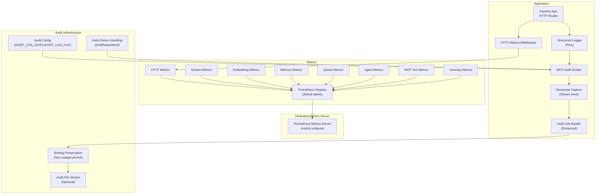
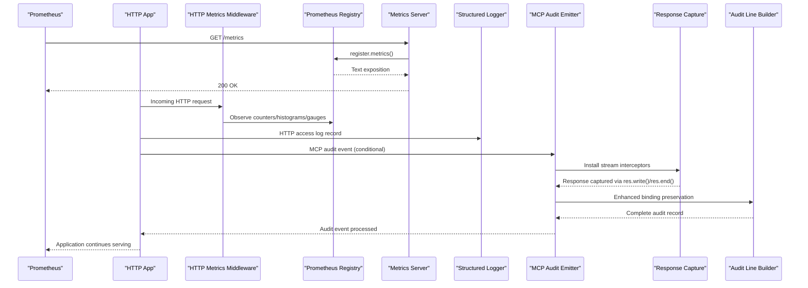
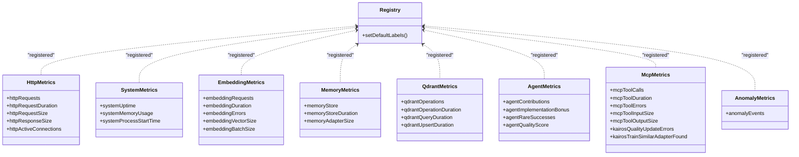
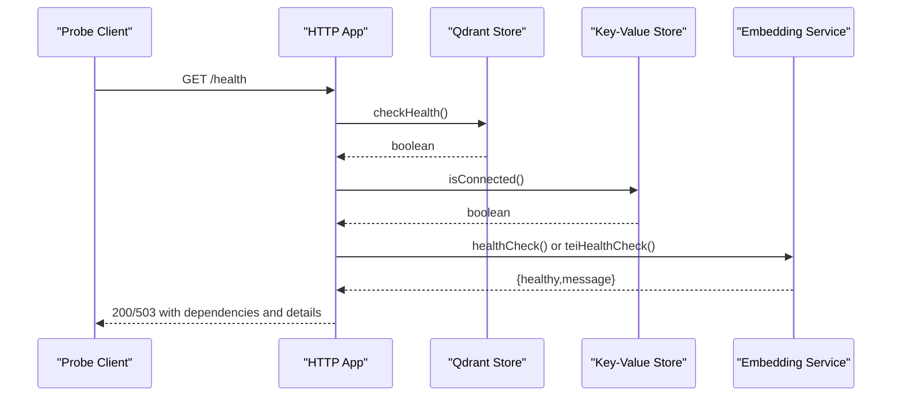
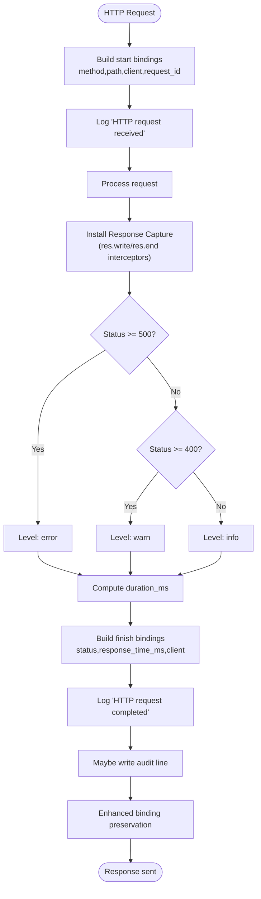
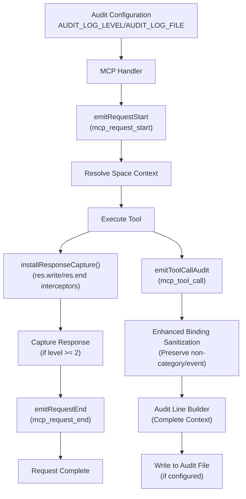
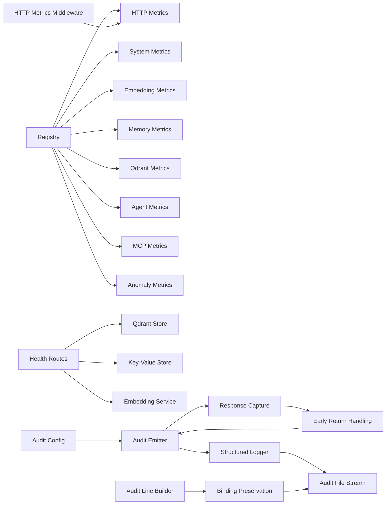

# Monitoring & Observability

<cite>
**Referenced Files in This Document**
- [metrics-server.ts](file://src/metrics-server.ts)
- [http-metrics-middleware.ts](file://src/http/http-metrics-middleware.ts)
- [registry.ts](file://src/services/metrics/registry.ts)
- [system-metrics.ts](file://src/services/metrics/system-metrics.ts)
- [http-metrics.ts](file://src/services/metrics/http-metrics.ts)
- [embedding-metrics.ts](file://src/services/metrics/embedding-metrics.ts)
- [memory-metrics.ts](file://src/services/metrics/memory-metrics.ts)
- [qdrant-metrics.ts](file://src/services/metrics/qdrant-metrics.ts)
- [anomaly-metrics.ts](file://src/services/metrics/anomaly-metrics.ts)
- [agent-metrics.ts](file://src/services/metrics/agent-metrics.ts)
- [mcp-metrics.ts](file://src/services/metrics/mcp-metrics.ts)
- [structured-logger.ts](file://src/utils/structured-logger.ts)
- [log-core.ts](file://src/utils/log-core.ts)
- [http-health-routes.ts](file://src/http/http-health-routes.ts)
- [health.ts](file://src/services/embedding/health.ts)
- [service.ts](file://src/services/qdrant/service.ts)
- [http-mcp-handler.ts](file://src/http/http-mcp-handler.ts)
- [mcp-audit-emit.ts](file://src/http/mcp-audit-emit.ts)
- [audit-log.md](file://docs/security/audit-log.md)
- [config.ts](file://src/config.ts)
- [audit-mcp-summary.ts](file://src/utils/audit-mcp-summary.ts)
- [audit-log-events.ts](file://src/utils/audit-log-events.ts)
</cite>

## Update Summary
**Changes Made**
- Enhanced MCP audit system documentation to reflect improved response capture mechanism using stream-level interception
- Updated audit event specifications to show proper emitRequestEnd calls in all early-return scenarios
- Added comprehensive coverage of res.write() and res.end() response capture implementation
- Expanded audit infrastructure documentation with optimized audit levels and better error handling

## Table of Contents
1. [Introduction](#introduction)
2. [Project Structure](#project-structure)
3. [Core Components](#core-components)
4. [Architecture Overview](#architecture-overview)
5. [Detailed Component Analysis](#detailed-component-analysis)
6. [Dependency Analysis](#dependency-analysis)
7. [Performance Considerations](#performance-considerations)
8. [Troubleshooting Guide](#troubleshooting-guide)
9. [Conclusion](#conclusion)
10. [Appendices](#appendices)

## Introduction
This document describes the monitoring and observability capabilities of KAIROS MCP. It covers metrics collection (performance, system, embedding), health checks (service readiness, database connectivity, external provider status), structured logging with request tracing and audit events, and operational guidance for scraping, alerting, dashboards, and troubleshooting. The system leverages Prometheus-compatible metrics and a robust structured logging pipeline built on Pino. **Updated** to include comprehensive MCP audit logging infrastructure with enhanced response capture using stream-level interception, improved error handling, and optimized audit levels.

## Project Structure
The observability stack is organized around:
- Metrics exposure via a dedicated metrics server and middleware
- A central Prometheus registry with default labels
- Per-domain metric families for HTTP, system, embedding, memory, Qdrant, anomalies, agents, and MCP tools
- Structured logging with HTTP access logs, error tracking, audit event writes, and **MCP audit logging**
- Health endpoints that probe critical dependencies
- **Enhanced MCP audit infrastructure with stream-level response capture and comprehensive error handling**

**Diagram sources**
- [metrics-server.ts:19-43](file://src/metrics-server.ts#L19-L43)
- [http-metrics-middleware.ts:15-71](file://src/http/http-metrics-middleware.ts#L15-L71)
- [registry.ts:11-18](file://src/services/metrics/registry.ts#L11-L18)
- [system-metrics.ts:10-41](file://src/services/metrics/system-metrics.ts#L10-L41)
- [http-metrics.ts:11-47](file://src/services/metrics/http-metrics.ts#L11-L47)
- [embedding-metrics.ts:11-39](file://src/services/metrics/embedding-metrics.ts#L11-L39)
- [memory-metrics.ts:11-32](file://src/services/metrics/memory-metrics.ts#L11-L32)
- [qdrant-metrics.ts:11-40](file://src/services/metrics/qdrant-metrics.ts#L11-L40)
- [agent-metrics.ts:12-39](file://src/services/metrics/agent-metrics.ts#L12-L39)
- [mcp-metrics.ts:11-63](file://src/services/metrics/mcp-metrics.ts#L11-L63)
- [anomaly-metrics.ts:4-9](file://src/services/metrics/anomaly-metrics.ts#L4-L9)
- [mcp-audit-emit.ts:17-43](file://src/http/mcp-audit-emit.ts#L17-L43)
- [structured-logger.ts:46-48](file://src/utils/structured-logger.ts#L46-L48)
- [config.ts:85-91](file://src/config.ts#L85-L91)
- [audit-log-events.ts:68-88](file://src/utils/audit-log-events.ts#L68-L88)

**Section sources**
- [metrics-server.ts:19-43](file://src/metrics-server.ts#L19-L43)
- [http-metrics-middleware.ts:15-71](file://src/http/http-metrics-middleware.ts#L15-L71)
- [registry.ts:11-18](file://src/services/metrics/registry.ts#L11-L18)

## Core Components
- Metrics registry and default labels
  - Central registry with default labels for service, version, and instance.
  - Tenant ID is not a default label; it is added per-metric based on request context.
- HTTP metrics middleware
  - Tracks requests, durations, payload sizes, and active connections with tenant scoping.
- Dedicated metrics server
  - Exposes a clean /metrics endpoint for Prometheus scraping, with optional /health.
- Structured logging
  - Pino-based logger with redaction, JSON formatting, and audit stream writes.
  - HTTP access logging with request_id, client IP, status, and response time.
  - **Enhanced MCP audit logging with stream-level response capture and comprehensive error handling**.
- Health checks
  - Application readiness probes dependencies: Qdrant, Redis/Cache, and embedding provider.
  - Embedding health supports OpenAI and TEI with provider-specific checks and timeouts.
- **Enhanced MCP audit infrastructure**
  - **Configurable audit logging with AUDIT_LOG_LEVEL (0-3) controlling event verbosity**.
  - **Optional AUDIT_LOG_FILE for dedicated append-only audit stream**.
  - **Comprehensive audit event tracking for MCP tool calls, requests, and responses**.
  - **Enhanced binding preservation ensures all non-category/event fields are maintained for complete traceability**.
  - **Stream-level response capture using res.write() and res.end() interceptors**.
  - **Proper emitRequestEnd calls in all early-return scenarios for complete audit trail**.

**Section sources**
- [registry.ts:11-18](file://src/services/metrics/registry.ts#L11-L18)
- [http-metrics-middleware.ts:15-71](file://src/http/http-metrics-middleware.ts#L15-L71)
- [metrics-server.ts:19-43](file://src/metrics-server.ts#L19-L43)
- [structured-logger.ts:145-178](file://src/utils/structured-logger.ts#L145-L178)
- [http-health-routes.ts:14-89](file://src/http/http-health-routes.ts#L14-L89)
- [health.ts:16-119](file://src/services/embedding/health.ts#L16-L119)
- [mcp-audit-emit.ts:17-43](file://src/http/mcp-audit-emit.ts#L17-L43)
- [audit-log.md:30-35](file://docs/security/audit-log.md#L30-L35)

## Architecture Overview
The observability architecture separates concerns:
- Application HTTP server collects HTTP metrics via middleware and emits structured logs.
- A dedicated metrics server serves Prometheus metrics independently from application traffic.
- Health endpoints probe critical subsystems and return readiness status.
- **Enhanced MCP audit events are emitted with stream-level response capture and comprehensive error handling**.

**Diagram sources**
- [metrics-server.ts:23-32](file://src/metrics-server.ts#L23-L32)
- [http-metrics-middleware.ts:15-71](file://src/http/http-metrics-middleware.ts#L15-L71)
- [registry.ts:11-18](file://src/services/metrics/registry.ts#L11-L18)
- [structured-logger.ts:145-178](file://src/utils/structured-logger.ts#L145-L178)
- [mcp-audit-emit.ts:23-43](file://src/http/mcp-audit-emit.ts#L23-L43)
- [audit-log-events.ts:68-88](file://src/utils/audit-log-events.ts#L68-L88)

## Detailed Component Analysis

### Metrics Collection System
- Registry and default labels
  - All metrics are registered with default labels for service identity and instance.
  - Tenant scoping is applied per-metric via middleware and service code.
- HTTP metrics
  - Counters for requests by method/route/status/tenant.
  - Histograms for request/response sizes and durations.
  - Gauge for active connections.
- System metrics
  - Uptime, process start time, and memory usage gauges updated periodically.
- Embedding metrics
  - Requests, durations, errors, vector sizes, and batch sizes scoped by provider and tenant.
- Memory/Qdrant metrics
  - Store/update/delete operations and durations; query/upsert timing.
- Agent and MCP tool metrics
  - Tool invocation counts, durations, errors, input/output sizes; agent contribution and quality metrics.
- Anomaly metrics
  - Heuristic anomaly event counters with severity and type.

**Diagram sources**
- [registry.ts:11-18](file://src/services/metrics/registry.ts#L11-L18)
- [http-metrics.ts:11-47](file://src/services/metrics/http-metrics.ts#L11-L47)
- [system-metrics.ts:10-41](file://src/services/metrics/system-metrics.ts#L10-L41)
- [embedding-metrics.ts:11-39](file://src/services/metrics/embedding-metrics.ts#L11-L39)
- [memory-metrics.ts:11-32](file://src/services/metrics/memory-metrics.ts#L11-L32)
- [qdrant-metrics.ts:11-40](file://src/services/metrics/qdrant-metrics.ts#L11-L40)
- [agent-metrics.ts:12-39](file://src/services/metrics/agent-metrics.ts#L12-L39)
- [mcp-metrics.ts:11-63](file://src/services/metrics/mcp-metrics.ts#L11-L63)
- [anomaly-metrics.ts:4-9](file://src/services/metrics/anomaly-metrics.ts#L4-L9)

**Section sources**
- [registry.ts:11-18](file://src/services/metrics/registry.ts#L11-L18)
- [http-metrics.ts:11-47](file://src/services/metrics/http-metrics.ts#L11-L47)
- [system-metrics.ts:10-41](file://src/services/metrics/system-metrics.ts#L10-L41)
- [embedding-metrics.ts:11-39](file://src/services/metrics/embedding-metrics.ts#L11-L39)
- [memory-metrics.ts:11-32](file://src/services/metrics/memory-metrics.ts#L11-L32)
- [qdrant-metrics.ts:11-40](file://src/services/metrics/qdrant-metrics.ts#L11-L40)
- [agent-metrics.ts:12-39](file://src/services/metrics/agent-metrics.ts#L12-L39)
- [mcp-metrics.ts:11-63](file://src/services/metrics/mcp-metrics.ts#L11-L63)
- [anomaly-metrics.ts:4-9](file://src/services/metrics/anomaly-metrics.ts#L4-L9)

### Health Checks
- Service health
  - Probes Qdrant, Redis/cache, and embedding provider health.
  - Embedding health is bounded by a timeout to keep /health responsive.
  - Returns readiness status, version, uptime, and dependency details.
- Embedding health
  - Supports OpenAI and TEI with provider-specific checks and error classification (authentication, rate-limited, etc.).
- Qdrant service
  - Provides a facade around Qdrant operations; health checks leverage the underlying connection and collection management.

**Diagram sources**
- [http-health-routes.ts:14-89](file://src/http/http-health-routes.ts#L14-L89)
- [health.ts:16-119](file://src/services/embedding/health.ts#L16-L119)
- [service.ts:16-27](file://src/services/qdrant/service.ts#L16-L27)

**Section sources**
- [http-health-routes.ts:14-89](file://src/http/http-health-routes.ts#L14-L89)
- [health.ts:16-119](file://src/services/embedding/health.ts#L16-L119)
- [service.ts:16-27](file://src/services/qdrant/service.ts#L16-L27)

### Structured Logging System
- HTTP access logging
  - Captures method, path, protocol, client IP, user agent, request_id, status, and response time.
  - Uses a middleware to log start and completion events.
- Error tracking and audit events
  - Error logs include error_code and request_id when provided.
  - Audit events are sanitized and written to a configurable audit file stream.
- **Enhanced MCP audit logging infrastructure**
  - **Configurable verbosity levels (0-3) controlled by AUDIT_LOG_LEVEL environment variable**.
  - **Optional dedicated audit file stream controlled by AUDIT_LOG_FILE environment variable**.
  - **Comprehensive audit event tracking for MCP tool calls, requests, and responses**.
  - **Enhanced binding preservation ensures all non-category/event fields are maintained for complete traceability**.
  - **Correlation IDs for grouping related MCP requests across the system**.
  - **Stream-level response capture using res.write() and res.end() interceptors for accurate response data**.
- Transport and formatting
  - Supports JSON or text output with redaction of sensitive fields.
  - HTTP transport writes to stdout/stderr depending on configuration.

**Diagram sources**
- [structured-logger.ts:145-178](file://src/utils/structured-logger.ts#L145-L178)
- [structured-logger.ts:134-142](file://src/utils/structured-logger.ts#L134-L142)
- [log-core.ts:44-73](file://src/utils/log-core.ts#L44-L73)
- [mcp-audit-emit.ts:23-43](file://src/http/mcp-audit-emit.ts#L23-L43)
- [audit-log-events.ts:68-88](file://src/utils/audit-log-events.ts#L68-L88)

**Section sources**
- [structured-logger.ts:145-178](file://src/utils/structured-logger.ts#L145-L178)
- [structured-logger.ts:134-142](file://src/utils/structured-logger.ts#L134-L142)
- [log-core.ts:44-73](file://src/utils/log-core.ts#L44-L73)
- [mcp-audit-emit.ts:17-43](file://src/http/mcp-audit-emit.ts#L17-L43)
- [audit-log.md:30-35](file://docs/security/audit-log.md#L30-L35)

### Enhanced MCP Audit Logging Infrastructure
**Updated** The MCP audit logging infrastructure provides comprehensive audit event tracking with enhanced response capture and improved error handling.

- **Configuration Variables**
  - `AUDIT_LOG_FILE`: Optional path to dedicated audit file (append mode); empty disables audit file streaming.
  - `AUDIT_LOG_LEVEL`: Verbosity level (0-3) controlling MCP audit event detail.
- **Audit Event Types**
  - `mcp_request_start`: Emitted before space context resolution with correlation ID and unknown tenant.
  - `mcp_request_end`: Emitted on response completion with duration and correlation ID.
  - `mcp_tool_call`: Comprehensive tool call audit with request arguments, response summaries, and error codes.
- **Enhanced Response Capture Mechanism**
  - **Stream-level response capture using res.write() and res.end() interceptors**.
  - **Accurate response data capture for audit level 3 without relying on res.json()**.
  - **Buffer chunk accumulation and JSON parsing for response reconstruction**.
  - **Proper emitRequestEnd calls in all early-return scenarios for complete audit trail**.
- **Enhanced Binding Preservation**
  - **All non-category/event bindings are preserved in audit records for complete traceability**.
  - **Audit line builder maintains tenant_id, request_id, correlation_id, and other contextual fields**.
  - **Enhanced sanitization ensures data completeness while maintaining security boundaries**.
- **Audit Event Fields**
  - `category`: Always `audit.mcp` for MCP audit events.
  - `correlation_id`: Unique identifier for grouping related requests.
  - `tenant_id`: Resolved from space context during tool execution.
  - `request_id`: MCP request identifier.
  - `mcp_method`: JSON-RPC method name.
  - `tool_name`: MCP tool being invoked.
  - `duration_ms`: Request processing time.
  - `server_version`: Build version for audit trail.
  - `request_args`: Summarized tool input arguments (level 2+).
  - `response`: Tool response summary (level 2+).
  - `error_code`: Error classification for failed requests (level 3+).
  - **Enhanced**: All other contextual bindings are preserved for complete audit trail data.
- **Verbosity Levels**
  - Level 0: Disable all MCP audit events.
  - Level 1: Basic request lifecycle events (`mcp_request_start`, `mcp_request_end`).
  - Level 2: Include tool call details with argument summaries.
  - Level 3: Include comprehensive response summaries and error details.
- **Audit File Streaming**
  - Optional append-only file stream for compliance and security requirements.
  - Separate from main structured log for dedicated audit trails.
  - File stream is opened at server startup if configured.
  - **Enhanced line building preserves all relevant bindings for complete audit context**.

**Diagram sources**
- [mcp-audit-emit.ts:23-43](file://src/http/mcp-audit-emit.ts#L23-L43)
- [mcp-audit-emit.ts:50-63](file://src/http/mcp-audit-emit.ts#L50-L63)
- [mcp-audit-emit.ts:67-75](file://src/http/mcp-audit-emit.ts#L67-L75)
- [http-mcp-handler.ts:253-267](file://src/http/http-mcp-handler.ts#L253-L267)
- [audit-log-events.ts:68-88](file://src/utils/audit-log-events.ts#L68-L88)

**Section sources**
- [mcp-audit-emit.ts:17-43](file://src/http/mcp-audit-emit.ts#L17-L43)
- [mcp-audit-emit.ts:50-63](file://src/http/mcp-audit-emit.ts#L50-L63)
- [mcp-audit-emit.ts:67-75](file://src/http/mcp-audit-emit.ts#L67-L75)
- [http-mcp-handler.ts:253-267](file://src/http/http-mcp-handler.ts#L253-L267)
- [audit-log.md:30-35](file://docs/security/audit-log.md#L30-L35)
- [config.ts:85-91](file://src/config.ts#L85-L91)
- [audit-log-events.ts:68-88](file://src/utils/audit-log-events.ts#L68-L88)

### Metrics Scraping, Alerting, and Dashboards
- Scraping
  - Scrape the dedicated metrics server's /metrics endpoint.
  - Ensure Prometheus targets scrape the metrics port and apply relabeling for service, version, and instance.
- Alerting
  - Use thresholds on HTTP error rates, latency SLOs, embedding provider availability, and Qdrant operation failures.
  - Monitor anomaly events and cache/backend connectivity.
  - **Monitor MCP audit infrastructure health (file stream availability, audit event rates, binding preservation completeness)**.
- Dashboards
  - Build panels for:
    - HTTP request volume, error rates, and latency by method/route/status
    - Embedding provider usage and latency
    - Memory store/update/delete rates and durations
    - Qdrant operation latencies and error counters
    - System memory and uptime
    - Agent quality score distributions and contribution totals
    - **MCP tool call volumes, durations, and error rates by tool**
    - **Audit event rates, file stream health indicators, and binding preservation metrics**

## Dependency Analysis
- Coupling and cohesion
  - Metrics are cohesive per domain and registered centrally for consistent labeling.
  - HTTP middleware depends on tenant context and the registry; embedding and memory services increment metrics.
  - **Enhanced MCP audit emitter depends on configuration module, structured logger, audit line builder, and response capture mechanism**.
- External dependencies
  - Prometheus registry and client libraries
  - Qdrant client for vector operations
  - Embedding providers (OpenAI/TEI) for health checks
  - **Optional file system for audit log streaming**
- Health dependency chain
  - Application health depends on Qdrant, Redis/cache, and embedding provider health.
  - **Enhanced MCP audit infrastructure depends on configuration availability, file system access, response capture mechanism, and binding preservation systems**.

**Diagram sources**
- [registry.ts:11-18](file://src/services/metrics/registry.ts#L11-L18)
- [http-metrics.ts:11-47](file://src/services/metrics/http-metrics.ts#L11-L47)
- [system-metrics.ts:10-41](file://src/services/metrics/system-metrics.ts#L10-L41)
- [embedding-metrics.ts:11-39](file://src/services/metrics/embedding-metrics.ts#L11-L39)
- [memory-metrics.ts:11-32](file://src/services/metrics/memory-metrics.ts#L11-L32)
- [qdrant-metrics.ts:11-40](file://src/services/metrics/qdrant-metrics.ts#L11-L40)
- [agent-metrics.ts:12-39](file://src/services/metrics/agent-metrics.ts#L12-L39)
- [mcp-metrics.ts:11-63](file://src/services/metrics/mcp-metrics.ts#L11-L63)
- [anomaly-metrics.ts:4-9](file://src/services/metrics/anomaly-metrics.ts#L4-L9)
- [http-health-routes.ts:14-89](file://src/http/http-health-routes.ts#L14-L89)
- [mcp-audit-emit.ts:17-43](file://src/http/mcp-audit-emit.ts#L17-L43)
- [structured-logger.ts:46-48](file://src/utils/structured-logger.ts#L46-L48)
- [config.ts:85-91](file://src/config.ts#L85-L91)
- [audit-log-events.ts:68-88](file://src/utils/audit-log-events.ts#L68-L88)

**Section sources**
- [http-health-routes.ts:14-89](file://src/http/http-health-routes.ts#L14-L89)
- [mcp-audit-emit.ts:17-43](file://src/http/mcp-audit-emit.ts#L17-L43)
- [structured-logger.ts:46-48](file://src/utils/structured-logger.ts#L46-L48)
- [config.ts:85-91](file://src/config.ts#L85-L91)
- [audit-log-events.ts:68-88](file://src/utils/audit-log-events.ts#L68-L88)

## Performance Considerations
- Metrics overhead
  - Use histograms with appropriate buckets to balance fidelity and cardinality.
  - Avoid excessive label cardinality; prefer tenant_id scoping where necessary.
- Logging throughput
  - JSON formatting and redaction are efficient; ensure audit stream does not block request path.
  - **Enhanced MCP audit events are conditional based on AUDIT_LOG_LEVEL, minimizing overhead when disabled**.
- Health checks
  - Embedding health checks are bounded by timeouts to prevent blocking readiness.
- System metrics
  - Periodic updates are lightweight; ensure intervals align with scraping cadence.
- **Enhanced audit infrastructure performance**
  - **Stream-level response capture adds minimal overhead through buffer accumulation and selective JSON parsing**.
  - **File I/O operations are minimized through append-only streaming and conditional event emission**.
  - **Response capture only occurs when AUDIT_LOG_LEVEL >= 2, avoiding unnecessary serialization overhead**.
  - **Enhanced binding preservation adds minimal overhead while ensuring complete audit trail data**.
  - **Early return handling ensures proper audit event emission even in error scenarios**.

## Troubleshooting Guide
- Metrics not appearing in Prometheus
  - Verify the metrics server is running and exposing /metrics.
  - Confirm the registry content type and that scraping target matches the port.
- High HTTP error rates
  - Inspect HTTP metrics by status and route; correlate with embedding provider errors.
- Embedding provider issues
  - Check embedding health endpoint and provider configuration; watch for rate limits or authentication failures.
- Qdrant connectivity
  - Review Qdrant operation metrics and durations; confirm collection existence and permissions.
- Audit logs not written
  - Validate audit file path and permissions; ensure sanitization does not truncate records unexpectedly.
  - **Check AUDIT_LOG_FILE configuration and verify file system write permissions**.
  - **Verify AUDIT_LOG_LEVEL is set appropriately (1-3 for MCP audit events)**.
  - **Monitor audit file stream health and ensure it remains open during server runtime**.
- **Enhanced MCP audit event issues**
  - **Confirm AUDIT_LOG_LEVEL is set to enable MCP audit events (levels 1-3)**.
  - **Verify correlation IDs are being generated and associated with audit events**.
  - **Check that tenant context is resolving correctly for MCP tool call audits**.
  - **Validate that non-category/event bindings are being preserved in audit records**.
  - **Ensure audit line builder is maintaining complete contextual data for traceability**.
  - **Verify stream-level response capture is working correctly for audit level 3**.
  - **Check that emitRequestEnd is called in all early-return scenarios**.
- **Response capture issues**
  - **Verify res.write() and res.end() interceptors are properly installed**.
  - **Check buffer accumulation and JSON parsing for response reconstruction**.
  - **Ensure response capture handles both successful and error responses correctly**.

**Section sources**
- [metrics-server.ts:23-32](file://src/metrics-server.ts#L23-L32)
- [http-health-routes.ts:14-89](file://src/http/http-health-routes.ts#L14-L89)
- [health.ts:16-119](file://src/services/embedding/health.ts#L16-L119)
- [structured-logger.ts:134-142](file://src/utils/structured-logger.ts#L134-L142)
- [mcp-audit-emit.ts:23-43](file://src/http/mcp-audit-emit.ts#L23-L43)
- [audit-log.md:30-35](file://docs/security/audit-log.md#L30-L35)

## Conclusion
KAIROS MCP provides a comprehensive observability foundation with Prometheus-compatible metrics, structured logging, and health checks. **The enhanced MCP audit logging infrastructure significantly improves security and compliance capabilities by implementing stream-level response capture using res.write() and res.end() interceptors, providing accurate response data for audit level 3, and ensuring proper emitRequestEnd calls in all early-return scenarios. The system maintains configurable verbosity levels, optional dedicated audit file streaming, and comprehensive binding preservation for complete audit trail data.** By leveraging the dedicated metrics server, HTTP middleware, centralized registry, and enhanced MCP audit infrastructure with optimized response capture and error handling, operators can monitor performance, troubleshoot issues, maintain service reliability, and meet audit requirements with improved data completeness and traceability. Align alerting and dashboards with the metric families and audit event categories described to achieve operational excellence.

## Appendices

### Best Practices
- Labeling
  - Scope tenant_id per-metric for tenant isolation.
  - Limit label cardinality to avoid memory growth.
- Alerting
  - Define SLOs for HTTP latency and error rates.
  - Monitor embedding provider health and Qdrant operation latencies.
  - **Monitor MCP audit infrastructure health, audit event rates, and binding preservation completeness**.
- Logging
  - Redact sensitive fields; ensure audit streams do not degrade performance.
  - **Configure AUDIT_LOG_LEVEL appropriately for your compliance requirements**.
  - **Use AUDIT_LOG_FILE for regulatory compliance and security investigations**.
  - **Validate that enhanced binding preservation is working correctly for complete audit trails**.
  - **Ensure stream-level response capture is functioning properly for audit level 3**.
- Scraping
  - Separate metrics port from application traffic; restrict access to internal networks.
- **Enhanced MCP Audit Configuration**
  - **Set AUDIT_LOG_LEVEL=1 for basic audit event tracking, 2 for tool call details, 3 for comprehensive auditing**.
  - **Configure AUDIT_LOG_FILE for compliance requirements and security monitoring**.
  - **Monitor audit file stream health and ensure continuous write capability**.
  - **Verify that non-category/event bindings are preserved for complete audit trail data**.
  - **Test audit line building to ensure all contextual fields are maintained in audit records**.
  - **Validate stream-level response capture mechanism for accurate response data collection**.
  - **Ensure proper emitRequestEnd handling in all error and early-return scenarios**.