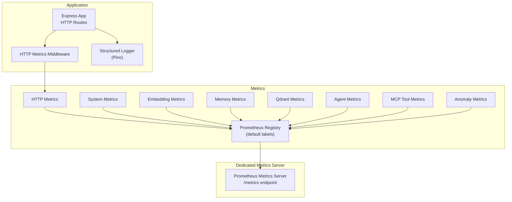
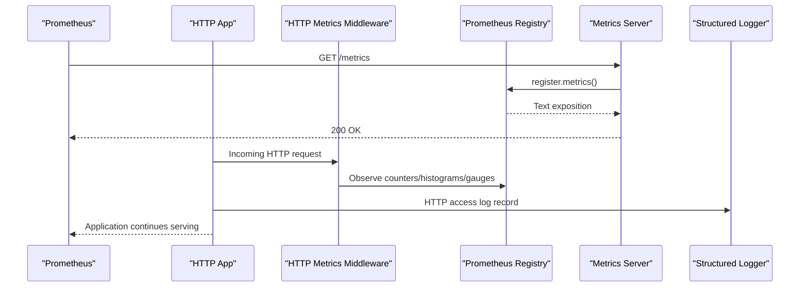
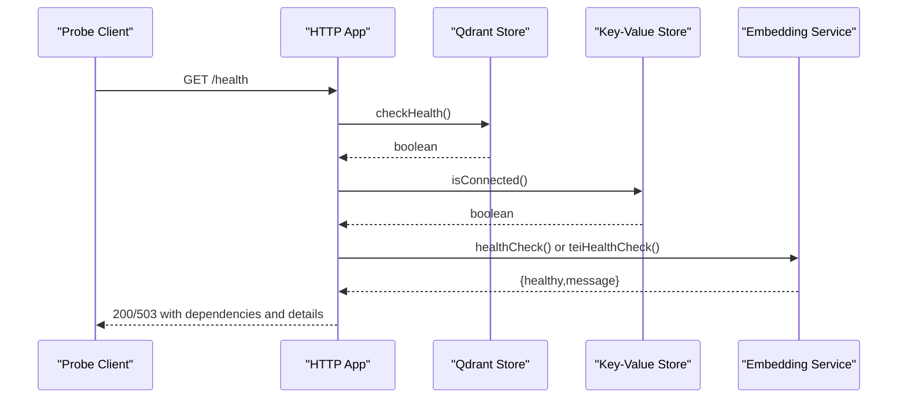
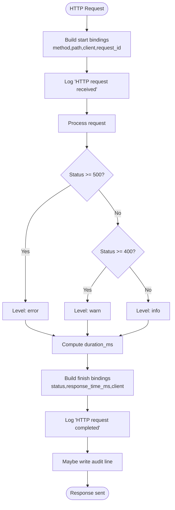
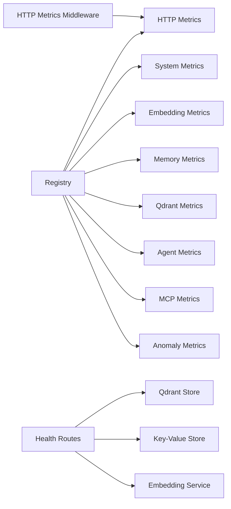

# Monitoring & Observability

<cite>
**Referenced Files in This Document**
- [metrics-server.ts](file://src/metrics-server.ts)
- [http-metrics-middleware.ts](file://src/http/http-metrics-middleware.ts)
- [registry.ts](file://src/services/metrics/registry.ts)
- [system-metrics.ts](file://src/services/metrics/system-metrics.ts)
- [http-metrics.ts](file://src/services/metrics/http-metrics.ts)
- [embedding-metrics.ts](file://src/services/metrics/embedding-metrics.ts)
- [memory-metrics.ts](file://src/services/metrics/memory-metrics.ts)
- [qdrant-metrics.ts](file://src/services/qdrant-metrics.ts)
- [anomaly-metrics.ts](file://src/services/metrics/anomaly-metrics.ts)
- [agent-metrics.ts](file://src/services/metrics/agent-metrics.ts)
- [mcp-metrics.ts](file://src/services/metrics/mcp-metrics.ts)
- [structured-logger.ts](file://src/utils/structured-logger.ts)
- [log-core.ts](file://src/utils/log-core.ts)
- [http-health-routes.ts](file://src/http/http-health-routes.ts)
- [health.ts](file://src/services/embedding/health.ts)
- [service.ts](file://src/services/qdrant/service.ts)
</cite>

## Table of Contents
1. [Introduction](#introduction)
2. [Project Structure](#project-structure)
3. [Core Components](#core-components)
4. [Architecture Overview](#architecture-overview)
5. [Detailed Component Analysis](#detailed-component-analysis)
6. [Dependency Analysis](#dependency-analysis)
7. [Performance Considerations](#performance-considerations)
8. [Troubleshooting Guide](#troubleshooting-guide)
9. [Conclusion](#conclusion)
10. [Appendices](#appendices)

## Introduction
This document describes the monitoring and observability capabilities of KAIROS MCP. It covers metrics collection (performance, system, embedding), health checks (service readiness, database connectivity, external provider status), structured logging with request tracing and audit events, and operational guidance for scraping, alerting, dashboards, and troubleshooting. The system leverages Prometheus-compatible metrics and a robust structured logging pipeline built on Pino.

## Project Structure
The observability stack is organized around:
- Metrics exposure via a dedicated metrics server and middleware
- A central Prometheus registry with default labels
- Per-domain metric families for HTTP, system, embedding, memory, Qdrant, anomalies, agents, and MCP tools
- Structured logging with HTTP access logs, error tracking, and audit event writes
- Health endpoints that probe critical dependencies

**Diagram sources**
- [metrics-server.ts:19-43](file://src/metrics-server.ts#L19-L43)
- [http-metrics-middleware.ts:15-71](file://src/http/http-metrics-middleware.ts#L15-L71)
- [registry.ts:11-18](file://src/services/metrics/registry.ts#L11-L18)
- [system-metrics.ts:10-41](file://src/services/metrics/system-metrics.ts#L10-L41)
- [http-metrics.ts:11-47](file://src/services/metrics/http-metrics.ts#L11-L47)
- [embedding-metrics.ts:11-39](file://src/services/metrics/embedding-metrics.ts#L11-L39)
- [memory-metrics.ts:11-32](file://src/services/metrics/memory-metrics.ts#L11-L32)
- [qdrant-metrics.ts:11-40](file://src/services/metrics/qdrant-metrics.ts#L11-L40)
- [agent-metrics.ts:12-39](file://src/services/metrics/agent-metrics.ts#L12-L39)
- [mcp-metrics.ts:11-63](file://src/services/metrics/mcp-metrics.ts#L11-L63)
- [anomaly-metrics.ts:4-9](file://src/services/metrics/anomaly-metrics.ts#L4-L9)

**Section sources**
- [metrics-server.ts:19-43](file://src/metrics-server.ts#L19-L43)
- [http-metrics-middleware.ts:15-71](file://src/http/http-metrics-middleware.ts#L15-L71)
- [registry.ts:11-18](file://src/services/metrics/registry.ts#L11-L18)

## Core Components
- Metrics registry and default labels
  - Central registry with default labels for service, version, and instance.
  - Tenant ID is not a default label; it is added per-metric based on request context.
- HTTP metrics middleware
  - Tracks requests, durations, payload sizes, and active connections with tenant scoping.
- Dedicated metrics server
  - Exposes a clean /metrics endpoint for Prometheus scraping, with optional /health.
- Structured logging
  - Pino-based logger with redaction, JSON formatting, and audit stream writes.
  - HTTP access logging with request_id, client IP, status, and response time.
- Health checks
  - Application readiness probes dependencies: Qdrant, Redis/Cache, and embedding provider.
  - Embedding health supports OpenAI and TEI with provider-specific checks and timeouts.

**Section sources**
- [registry.ts:11-18](file://src/services/metrics/registry.ts#L11-L18)
- [http-metrics-middleware.ts:15-71](file://src/http/http-metrics-middleware.ts#L15-L71)
- [metrics-server.ts:19-43](file://src/metrics-server.ts#L19-L43)
- [structured-logger.ts:145-178](file://src/utils/structured-logger.ts#L145-L178)
- [http-health-routes.ts:14-89](file://src/http/http-health-routes.ts#L14-L89)
- [health.ts:16-119](file://src/services/embedding/health.ts#L16-L119)

## Architecture Overview
The observability architecture separates concerns:
- Application HTTP server collects HTTP metrics via middleware and emits structured logs.
- A dedicated metrics server serves Prometheus metrics independently from application traffic.
- Health endpoints probe critical subsystems and return readiness status.

**Diagram sources**
- [metrics-server.ts:23-32](file://src/metrics-server.ts#L23-L32)
- [http-metrics-middleware.ts:15-71](file://src/http/http-metrics-middleware.ts#L15-L71)
- [registry.ts:11-18](file://src/services/metrics/registry.ts#L11-L18)
- [structured-logger.ts:145-178](file://src/utils/structured-logger.ts#L145-L178)

## Detailed Component Analysis

### Metrics Collection System
- Registry and default labels
  - All metrics are registered with default labels for service identity and instance.
  - Tenant scoping is applied per-metric via middleware and service code.
- HTTP metrics
  - Counters for requests by method/route/status/tenant.
  - Histograms for request/response sizes and durations.
  - Gauge for active connections.
- System metrics
  - Uptime, process start time, and memory usage gauges updated periodically.
- Embedding metrics
  - Requests, durations, errors, vector sizes, and batch sizes scoped by provider and tenant.
- Memory/Qdrant metrics
  - Store/update/delete operations and durations; query/upsert timing.
- Agent and MCP tool metrics
  - Tool invocation counts, durations, errors, input/output sizes; agent contribution and quality metrics.
- Anomaly metrics
  - Heuristic anomaly event counters with severity and type.

**Diagram sources**
- [registry.ts:11-18](file://src/services/metrics/registry.ts#L11-L18)
- [http-metrics.ts:11-47](file://src/services/metrics/http-metrics.ts#L11-L47)
- [system-metrics.ts:10-41](file://src/services/metrics/system-metrics.ts#L10-L41)
- [embedding-metrics.ts:11-39](file://src/services/metrics/embedding-metrics.ts#L11-L39)
- [memory-metrics.ts:11-32](file://src/services/metrics/memory-metrics.ts#L11-L32)
- [qdrant-metrics.ts:11-40](file://src/services/metrics/qdrant-metrics.ts#L11-L40)
- [agent-metrics.ts:12-39](file://src/services/metrics/agent-metrics.ts#L12-L39)
- [mcp-metrics.ts:11-63](file://src/services/metrics/mcp-metrics.ts#L11-L63)
- [anomaly-metrics.ts:4-9](file://src/services/metrics/anomaly-metrics.ts#L4-L9)

**Section sources**
- [registry.ts:11-18](file://src/services/metrics/registry.ts#L11-L18)
- [http-metrics.ts:11-47](file://src/services/metrics/http-metrics.ts#L11-L47)
- [system-metrics.ts:10-41](file://src/services/metrics/system-metrics.ts#L10-L41)
- [embedding-metrics.ts:11-39](file://src/services/metrics/embedding-metrics.ts#L11-L39)
- [memory-metrics.ts:11-32](file://src/services/metrics/memory-metrics.ts#L11-L32)
- [qdrant-metrics.ts:11-40](file://src/services/metrics/qdrant-metrics.ts#L11-L40)
- [agent-metrics.ts:12-39](file://src/services/metrics/agent-metrics.ts#L12-L39)
- [mcp-metrics.ts:11-63](file://src/services/metrics/mcp-metrics.ts#L11-L63)
- [anomaly-metrics.ts:4-9](file://src/services/metrics/anomaly-metrics.ts#L4-L9)

### Health Checks
- Service health
  - Probes Qdrant, Redis/cache, and embedding provider health.
  - Embedding health is bounded by a timeout to keep /health responsive.
  - Returns readiness status, version, uptime, and dependency details.
- Embedding health
  - Supports OpenAI and TEI with provider-specific checks and error classification (authentication, rate-limited, etc.).
- Qdrant service
  - Provides a facade around Qdrant operations; health checks leverage the underlying connection and collection management.

**Diagram sources**
- [http-health-routes.ts:14-89](file://src/http/http-health-routes.ts#L14-L89)
- [health.ts:16-119](file://src/services/embedding/health.ts#L16-L119)
- [service.ts:16-27](file://src/services/qdrant/service.ts#L16-L27)

**Section sources**
- [http-health-routes.ts:14-89](file://src/http/http-health-routes.ts#L14-L89)
- [health.ts:16-119](file://src/services/embedding/health.ts#L16-L119)
- [service.ts:16-27](file://src/services/qdrant/service.ts#L16-L27)

### Structured Logging System
- HTTP access logging
  - Captures method, path, protocol, client IP, user agent, request_id, status, and response time.
  - Uses a middleware to log start and completion events.
- Error tracking and audit events
  - Error logs include error_code and request_id when provided.
  - Audit events are sanitized and written to a configurable audit file stream.
- Transport and formatting
  - Supports JSON or text output with redaction of sensitive fields.
  - HTTP transport writes to stdout/stderr depending on configuration.

**Diagram sources**
- [structured-logger.ts:145-178](file://src/utils/structured-logger.ts#L145-L178)
- [structured-logger.ts:134-142](file://src/utils/structured-logger.ts#L134-L142)
- [log-core.ts:44-73](file://src/utils/log-core.ts#L44-L73)

**Section sources**
- [structured-logger.ts:145-178](file://src/utils/structured-logger.ts#L145-L178)
- [structured-logger.ts:134-142](file://src/utils/structured-logger.ts#L134-L142)
- [log-core.ts:44-73](file://src/utils/log-core.ts#L44-L73)

### Metrics Scraping, Alerting, and Dashboards
- Scraping
  - Scrape the dedicated metrics server’s /metrics endpoint.
  - Ensure Prometheus targets scrape the metrics port and apply relabeling for service, version, and instance.
- Alerting
  - Use thresholds on HTTP error rates, latency SLOs, embedding provider availability, and Qdrant operation failures.
  - Monitor anomaly events and cache/backend connectivity.
- Dashboards
  - Build panels for:
    - HTTP request volume, error rates, and latency by method/route/status
    - Embedding provider usage and latency
    - Memory store/update/delete rates and durations
    - Qdrant operation latencies and error counters
    - System memory and uptime
    - Agent quality score distributions and contribution totals

[No sources needed since this section provides general guidance]

## Dependency Analysis
- Coupling and cohesion
  - Metrics are cohesive per domain and registered centrally for consistent labeling.
  - HTTP middleware depends on tenant context and the registry; embedding and memory services increment metrics.
- External dependencies
  - Prometheus registry and client libraries
  - Qdrant client for vector operations
  - Embedding providers (OpenAI/TEI) for health checks
- Health dependency chain
  - Application health depends on Qdrant, Redis/cache, and embedding provider health.

**Diagram sources**
- [registry.ts:11-18](file://src/services/metrics/registry.ts#L11-L18)
- [http-metrics.ts:11-47](file://src/services/metrics/http-metrics.ts#L11-L47)
- [system-metrics.ts:10-41](file://src/services/metrics/system-metrics.ts#L10-L41)
- [embedding-metrics.ts:11-39](file://src/services/metrics/embedding-metrics.ts#L11-L39)
- [memory-metrics.ts:11-32](file://src/services/metrics/memory-metrics.ts#L11-L32)
- [qdrant-metrics.ts:11-40](file://src/services/metrics/qdrant-metrics.ts#L11-L40)
- [agent-metrics.ts:12-39](file://src/services/metrics/agent-metrics.ts#L12-L39)
- [mcp-metrics.ts:11-63](file://src/services/metrics/mcp-metrics.ts#L11-L63)
- [anomaly-metrics.ts:4-9](file://src/services/metrics/anomaly-metrics.ts#L4-L9)
- [http-health-routes.ts:14-89](file://src/http/http-health-routes.ts#L14-L89)

**Section sources**
- [http-health-routes.ts:14-89](file://src/http/http-health-routes.ts#L14-L89)

## Performance Considerations
- Metrics overhead
  - Use histograms with appropriate buckets to balance fidelity and cardinality.
  - Avoid excessive label cardinality; prefer tenant_id scoping where necessary.
- Logging throughput
  - JSON formatting and redaction are efficient; ensure audit stream does not block request path.
- Health checks
  - Embedding health checks are bounded by timeouts to prevent blocking readiness.
- System metrics
  - Periodic updates are lightweight; ensure intervals align with scraping cadence.

[No sources needed since this section provides general guidance]

## Troubleshooting Guide
- Metrics not appearing in Prometheus
  - Verify the metrics server is running and exposing /metrics.
  - Confirm the registry content type and that scraping target matches the port.
- High HTTP error rates
  - Inspect HTTP metrics by status and route; correlate with embedding provider errors.
- Embedding provider issues
  - Check embedding health endpoint and provider configuration; watch for rate limits or authentication failures.
- Qdrant connectivity
  - Review Qdrant operation metrics and durations; confirm collection existence and permissions.
- Audit logs not written
  - Validate audit file path and permissions; ensure sanitization does not truncate records unexpectedly.

**Section sources**
- [metrics-server.ts:23-32](file://src/metrics-server.ts#L23-L32)
- [http-health-routes.ts:14-89](file://src/http/http-health-routes.ts#L14-L89)
- [health.ts:16-119](file://src/services/embedding/health.ts#L16-L119)
- [structured-logger.ts:134-142](file://src/utils/structured-logger.ts#L134-L142)

## Conclusion
KAIROS MCP provides a comprehensive observability foundation with Prometheus-compatible metrics, structured logging, and health checks. By leveraging the dedicated metrics server, HTTP middleware, and centralized registry, operators can monitor performance, troubleshoot issues, and maintain service reliability. Align alerting and dashboards with the metric families described to achieve operational excellence.

[No sources needed since this section summarizes without analyzing specific files]

## Appendices

### Best Practices
- Labeling
  - Scope tenant_id per-metric for tenant isolation.
  - Limit label cardinality to avoid memory growth.
- Alerting
  - Define SLOs for HTTP latency and error rates.
  - Monitor embedding provider health and Qdrant operation latencies.
- Logging
  - Redact sensitive fields; ensure audit streams do not degrade performance.
- Scraping
  - Separate metrics port from application traffic; restrict access to internal networks.

[No sources needed since this section provides general guidance]