# Architecture Overview

<cite>
**Referenced Files in This Document**
- [src/index.ts](file://src/index.ts)
- [src/server.ts](file://src/server.ts)
- [src/http/http-server.ts](file://src/http/http-server.ts)
- [src/http/http-auth-middleware.ts](file://src/http/http-auth-middleware.ts)
- [src/http/bearer-validate.ts](file://src/http/bearer-validate.ts)
- [src/http/http-api-routes.ts](file://src/http/http-api-routes.ts)
- [src/tools/activate.ts](file://src/tools/activate.ts)
- [src/tools/forward.ts](file://src/tools/forward.ts)
- [src/tools/reward.ts](file://src/tools/reward.ts)
- [src/services/memory/store.ts](file://src/services/memory/store.ts)
- [src/ui/main.tsx](file://src/ui/main.tsx)
- [src/cli/index.ts](file://src/cli/index.ts)
- [package.json](file://package.json)
- [compose.yaml](file://compose.yaml)
- [helm/kairos-mcp/values.yaml](file://helm/kairos-mcp/values.yaml)
</cite>

## Table of Contents
1. [Introduction](#introduction)
2. [Project Structure](#project-structure)
3. [Core Components](#core-components)
4. [Architecture Overview](#architecture-overview)
5. [Detailed Component Analysis](#detailed-component-analysis)
6. [Dependency Analysis](#dependency-analysis)
7. [Performance Considerations](#performance-considerations)
8. [Troubleshooting Guide](#troubleshooting-guide)
9. [Conclusion](#conclusion)
10. [Appendices](#appendices)

## Introduction
This document describes the KAIROS MCP system architecture. It covers the high-level design with the Express HTTP server, the MCP protocol layer, REST API endpoints, React web UI, and CLI interface. It documents the three main execution phases—activate (semantic matching), forward (layer execution), and reward (performance evaluation)—and explains the persistent memory architecture using Qdrant vector storage and optional Redis cache. It also details the authentication flow with Keycloak OIDC integration and bearer token validation, system boundaries, component interactions, and data flows between services. Finally, it outlines the technology stack, scalability considerations, deployment topology options, and infrastructure requirements.

## Project Structure
The system is organized around a Node.js/TypeScript backend with Express HTTP server, an MCP protocol layer, a React SPA frontend, and a CLI. Persistent memory is backed by Qdrant with optional Redis caching. Authentication integrates with Keycloak via OIDC.

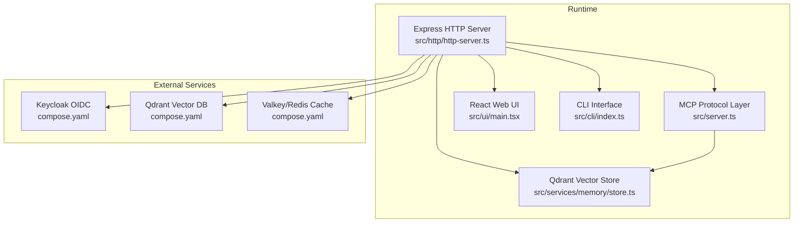

**Diagram sources**
- [src/http/http-server.ts:22-58](file://src/http/http-server.ts#L22-L58)
- [src/server.ts:125-193](file://src/server.ts#L125-L193)
- [src/services/memory/store.ts:20-53](file://src/services/memory/store.ts#L20-L53)
- [src/ui/main.tsx:1-20](file://src/ui/main.tsx#L1-L20)
- [src/cli/index.ts:1-11](file://src/cli/index.ts#L1-L11)
- [compose.yaml:10-183](file://compose.yaml#L10-L183)

**Section sources**
- [src/index.ts:74-139](file://src/index.ts#L74-L139)
- [src/http/http-server.ts:22-58](file://src/http/http-server.ts#L22-L58)
- [src/server.ts:125-193](file://src/server.ts#L125-L193)
- [src/services/memory/store.ts:20-53](file://src/services/memory/store.ts#L20-L53)
- [src/ui/main.tsx:1-20](file://src/ui/main.tsx#L1-L20)
- [src/cli/index.ts:1-11](file://src/cli/index.ts#L1-L11)
- [compose.yaml:10-183](file://compose.yaml#L10-L183)

## Core Components
- Express HTTP server: Hosts REST endpoints, MCP handler, UI static assets, health checks, and exports. Mounted in [src/http/http-server.ts:22-58](file://src/http/http-server.ts#L22-L58).
- MCP protocol layer: Registers tools (activate, forward, train, reward, tune, delete, export, spaces) and UI resources. Created in [src/server.ts:125-193](file://src/server.ts#L125-L193).
- Qdrant memory store: Provides vector search, adapter/artifact storage, and retrieval. Implemented in [src/services/memory/store.ts:20-152](file://src/services/memory/store.ts#L20-L152).
- React UI: SPA entry point and routing for protocol editing, runs, and account pages. Entry in [src/ui/main.tsx:1-20](file://src/ui/main.tsx#L1-L20).
- CLI: Command-line interface for login, serving, training, exporting, and other operations. Entry in [src/cli/index.ts:1-11](file://src/cli/index.ts#L1-L11).
- Authentication: Session-based browser auth and Bearer token validation via Keycloak/JWKS. Middleware in [src/http/http-auth-middleware.ts:167-313](file://src/http/http-auth-middleware.ts#L167-L313); token validation in [src/http/bearer-validate.ts:120-208](file://src/http/bearer-validate.ts#L120-L208).

**Section sources**
- [src/http/http-server.ts:22-58](file://src/http/http-server.ts#L22-L58)
- [src/server.ts:42-108](file://src/server.ts#L42-L108)
- [src/services/memory/store.ts:20-152](file://src/services/memory/store.ts#L20-L152)
- [src/ui/main.tsx:1-20](file://src/ui/main.tsx#L1-L20)
- [src/cli/index.ts:1-11](file://src/cli/index.ts#L1-L11)
- [src/http/http-auth-middleware.ts:167-313](file://src/http/http-auth-middleware.ts#L167-L313)
- [src/http/bearer-validate.ts:120-208](file://src/http/bearer-validate.ts#L120-L208)

## Architecture Overview
High-level architecture showing the Express server, MCP protocol layer, REST endpoints, React UI, CLI, and persistent memory with optional Redis cache.

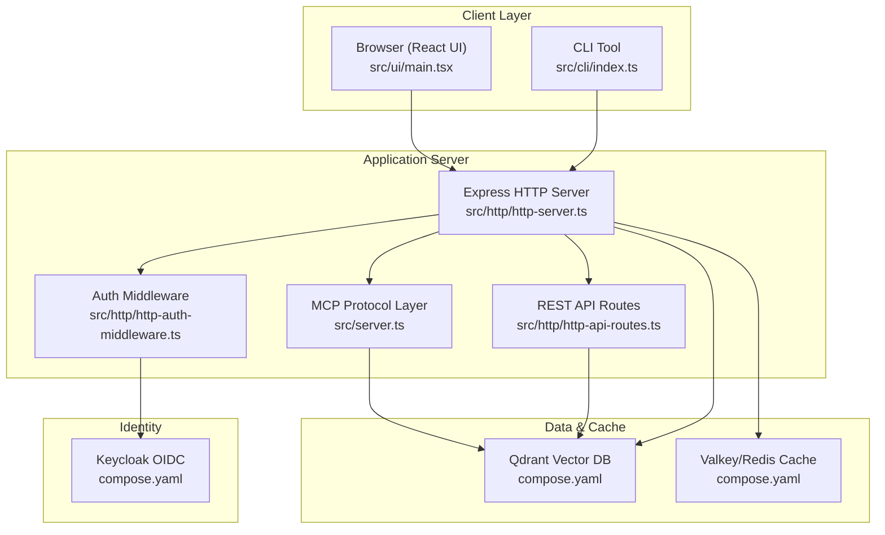

**Diagram sources**
- [src/http/http-server.ts:22-58](file://src/http/http-server.ts#L22-L58)
- [src/server.ts:125-193](file://src/server.ts#L125-L193)
- [src/http/http-auth-middleware.ts:167-313](file://src/http/http-auth-middleware.ts#L167-L313)
- [src/http/http-api-routes.ts:22-36](file://src/http/http-api-routes.ts#L22-L36)
- [compose.yaml:10-183](file://compose.yaml#L10-L183)

## Detailed Component Analysis

### Express HTTP Server and Routing
The Express server initializes middleware, registers well-known endpoints, CORS, authentication, health checks, API routes, MCP handler, UI static assets, and error handlers. It starts on the configured port and delegates to the MCP server.

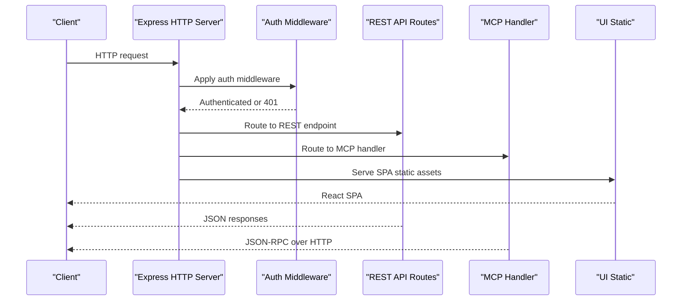

**Diagram sources**
- [src/http/http-server.ts:22-58](file://src/http/http-server.ts#L22-L58)
- [src/http/http-auth-middleware.ts:167-313](file://src/http/http-auth-middleware.ts#L167-L313)
- [src/http/http-api-routes.ts:22-36](file://src/http/http-api-routes.ts#L22-L36)

**Section sources**
- [src/http/http-server.ts:22-58](file://src/http/http-server.ts#L22-L58)

### Authentication Flow with Keycloak OIDC
Authentication supports two modes:
- Browser session: Cookie-based session with RP-initiated logout support.
- Bearer tokens: OIDC access tokens validated via JWKS from Keycloak.

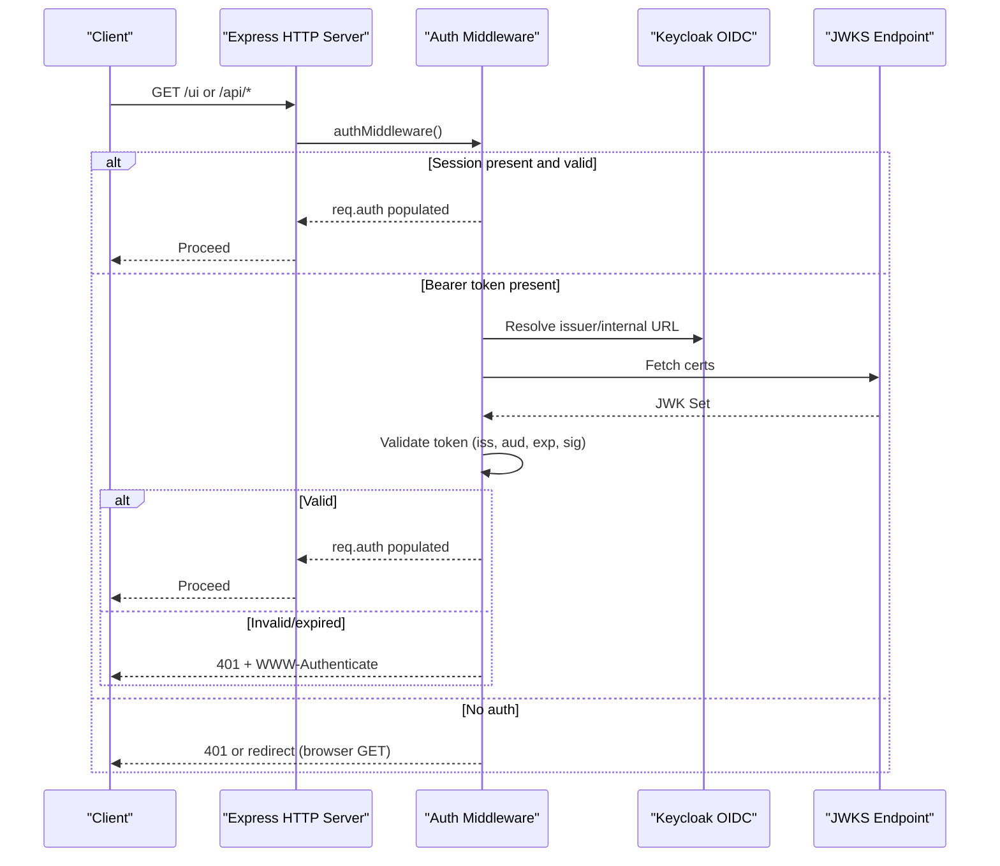

**Diagram sources**
- [src/http/http-auth-middleware.ts:167-313](file://src/http/http-auth-middleware.ts#L167-L313)
- [src/http/bearer-validate.ts:120-208](file://src/http/bearer-validate.ts#L120-L208)

**Section sources**
- [src/http/http-auth-middleware.ts:167-313](file://src/http/http-auth-middleware.ts#L167-L313)
- [src/http/bearer-validate.ts:120-208](file://src/http/bearer-validate.ts#L120-L208)

### MCP Protocol Layer and Tools
The MCP server registers tools and UI resources. Tools include activate, forward, train, reward, tune, delete, export, and spaces. The server exposes capabilities and resources for UI presentation.

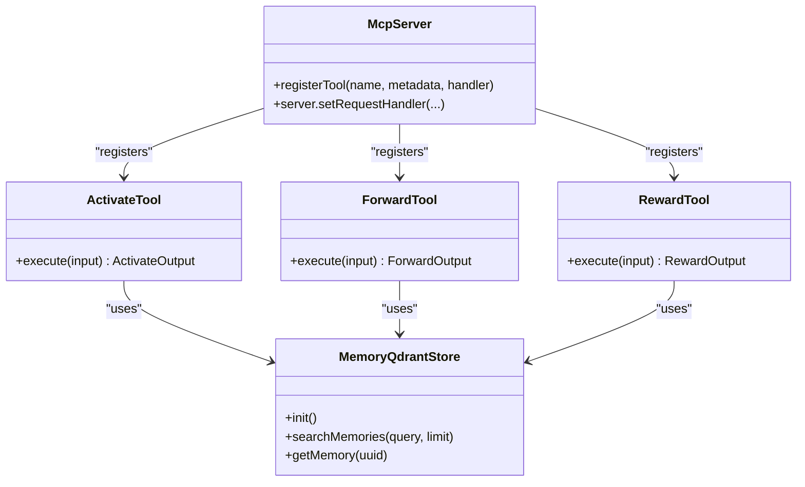

**Diagram sources**
- [src/server.ts:42-108](file://src/server.ts#L42-L108)
- [src/tools/activate.ts:236-283](file://src/tools/activate.ts#L236-L283)
- [src/tools/forward.ts:317-318](file://src/tools/forward.ts#L317-L318)
- [src/tools/reward.ts:112-155](file://src/tools/reward.ts#L112-L155)
- [src/services/memory/store.ts:20-53](file://src/services/memory/store.ts#L20-L53)

**Section sources**
- [src/server.ts:125-193](file://src/server.ts#L125-L193)
- [src/tools/activate.ts:236-283](file://src/tools/activate.ts#L236-L283)
- [src/tools/forward.ts:317-318](file://src/tools/forward.ts#L317-L318)
- [src/tools/reward.ts:112-155](file://src/tools/reward.ts#L112-L155)

### Three Execution Phases

#### Phase 1: Activate (Semantic Matching)
The activate tool performs semantic search to find the best adapter for the current input and returns ranked choices with next actions and optional linked artifacts.

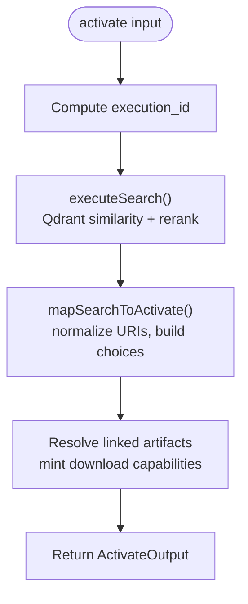

**Diagram sources**
- [src/tools/activate.ts:208-234](file://src/tools/activate.ts#L208-L234)
- [src/tools/activate.ts:43-206](file://src/tools/activate.ts#L43-L206)

**Section sources**
- [src/tools/activate.ts:208-234](file://src/tools/activate.ts#L208-L234)

#### Phase 2: Forward (Layer Execution)
The forward tool executes the first or next adapter layer, handles proof-of-work challenges, updates execution traces, and advances to subsequent layers.

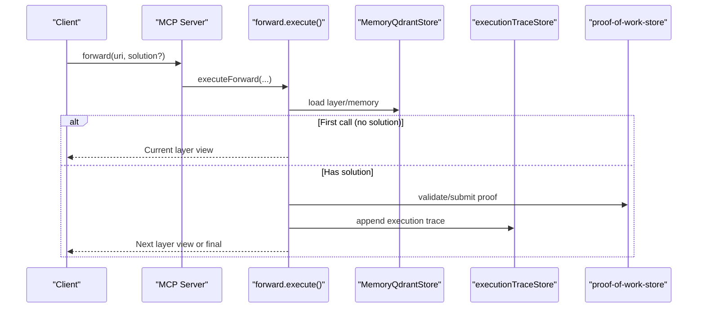

**Diagram sources**
- [src/tools/forward.ts:93-317](file://src/tools/forward.ts#L93-L317)
- [src/services/execution-trace-store.ts](file://src/services/execution-trace-store.ts)
- [src/services/proof-of-work-store.ts](file://src/services/proof-of-work-store.ts)

**Section sources**
- [src/tools/forward.ts:93-317](file://src/tools/forward.ts#L93-L317)

#### Phase 3: Reward (Performance Evaluation)
The reward tool records outcomes and scores, computes metrics, and persists evaluation metadata.

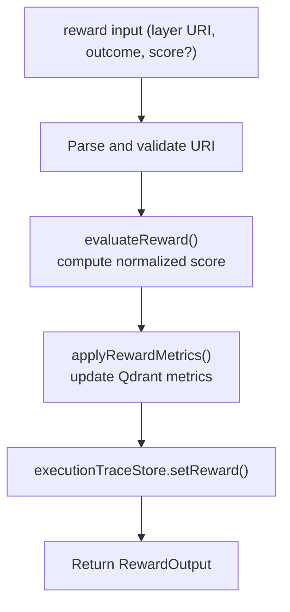

**Diagram sources**
- [src/tools/reward.ts:27-110](file://src/tools/reward.ts#L27-L110)
- [src/services/reward-evals.ts](file://src/services/reward-evals.ts)
- [src/services/reward-metrics.ts](file://src/services/reward-metrics.ts)

**Section sources**
- [src/tools/reward.ts:27-110](file://src/tools/reward.ts#L27-L110)

### Persistent Memory Architecture (Qdrant + Optional Redis)
- Qdrant vector store: Central memory for adapters, artifacts, and training data. Provides health checks, search, and retrieval. See [src/services/memory/store.ts:20-152](file://src/services/memory/store.ts#L20-L152).
- Optional Redis cache: Used for key-value caching and pub/sub (Valkey in Compose). See [compose.yaml:11-31](file://compose.yaml#L11-L31).
- Startup bootstrapping: On startup, the application waits for Qdrant readiness, probes embedding dimension, initializes memory store, triggers optional snapshot, and injects embedded MCP resources. See [src/index.ts:74-139](file://src/index.ts#L74-L139).

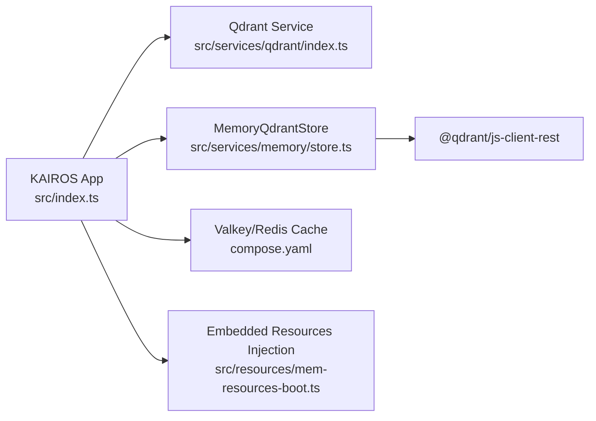

**Diagram sources**
- [src/index.ts:74-139](file://src/index.ts#L74-L139)
- [src/services/memory/store.ts:20-53](file://src/services/memory/store.ts#L20-L53)
- [compose.yaml:11-31](file://compose.yaml#L11-L31)

**Section sources**
- [src/index.ts:74-139](file://src/index.ts#L74-L139)
- [src/services/memory/store.ts:20-152](file://src/services/memory/store.ts#L20-L152)
- [compose.yaml:11-31](file://compose.yaml#L11-L31)

### REST API Endpoints
The Express server mounts REST endpoints for training, activation, forwarding, reward, updates, deletion, dumping, and spaces. See [src/http/http-api-routes.ts:22-36](file://src/http/http-api-routes.ts#L22-L36).

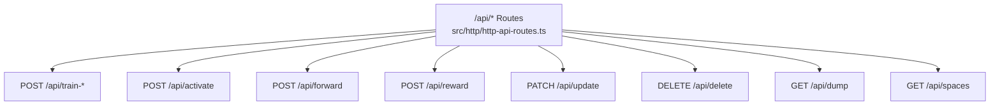

**Diagram sources**
- [src/http/http-api-routes.ts:22-36](file://src/http/http-api-routes.ts#L22-L36)

**Section sources**
- [src/http/http-api-routes.ts:22-36](file://src/http/http-api-routes.ts#L22-L36)

### React Web UI
The React SPA is bootstrapped in [src/ui/main.tsx:1-20](file://src/ui/main.tsx#L1-L20) with TanStack Query for data fetching and theme provider. It integrates with the backend via REST and MCP endpoints.

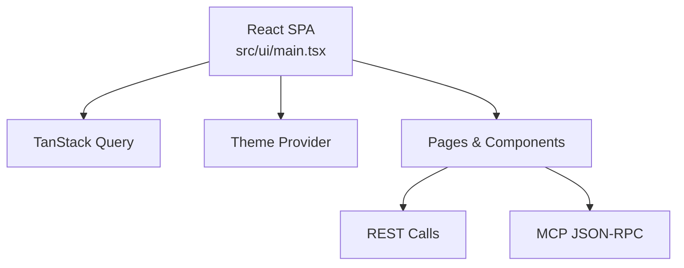

**Diagram sources**
- [src/ui/main.tsx:1-20](file://src/ui/main.tsx#L1-L20)

**Section sources**
- [src/ui/main.tsx:1-20](file://src/ui/main.tsx#L1-L20)

### CLI Interface
The CLI entry point is defined in [src/cli/index.ts:1-11](file://src/cli/index.ts#L1-L11). It provides commands for login, serving, training, exporting, and other operations.

**Section sources**
- [src/cli/index.ts:1-11](file://src/cli/index.ts#L1-L11)

## Dependency Analysis
Technology stack and key dependencies:
- Node.js runtime and TypeScript
- Express for HTTP server
- MCP SDK for protocol handling
- Qdrant JS client for vector operations
- React, TanStack Query, and related UI libraries
- Redis/Valkey for caching
- Keycloak for OIDC

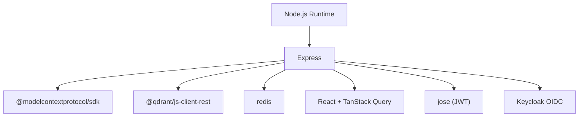

**Diagram sources**
- [package.json:117-148](file://package.json#L117-L148)

**Section sources**
- [package.json:117-148](file://package.json#L117-L148)

## Performance Considerations
- Concurrency and rate limiting: Express rate limiter is included in dependencies; consider applying per-endpoint limits for MCP and API routes.
- Embedding dimension probing and Qdrant health checks occur at startup to ensure alignment and availability.
- Qdrant search parameters (overfetch, max fetch, group collapse) are configurable and influence latency and recall.
- Redis cache can reduce repeated reads and accelerate hot paths; ensure proper TTL and eviction policies.
- Horizontal scaling: The Helm chart supports replicas and HPA/VPA; ensure stateless HTTP layer and shared Qdrant/Redis.

[No sources needed since this section provides general guidance]

## Troubleshooting Guide
Common areas to inspect:
- Authentication: 401 responses with WWW-Authenticate indicate missing or invalid Bearer tokens or misconfiguration of trusted issuers/audiences. See [src/http/http-auth-middleware.ts:248-282](file://src/http/http-auth-middleware.ts#L248-L282) and [src/http/bearer-validate.ts:120-208](file://src/http/bearer-validate.ts#L120-L208).
- Qdrant readiness: Startup waits for health checks; timeouts indicate network or credentials issues. See [src/index.ts:44-67](file://src/index.ts#L44-L67) and [src/services/memory/store.ts:59-121](file://src/services/memory/store.ts#L59-L121).
- MCP tool validation: Input schema mismatches return structured validation errors; review tool schemas and inputs. See [src/tools/activate.ts:257-263](file://src/tools/activate.ts#L257-L263), [src/tools/forward.ts:317-318](file://src/tools/forward.ts#L317-L318), [src/tools/reward.ts:129-135](file://src/tools/reward.ts#L129-L135).

**Section sources**
- [src/http/http-auth-middleware.ts:248-282](file://src/http/http-auth-middleware.ts#L248-L282)
- [src/http/bearer-validate.ts:120-208](file://src/http/bearer-validate.ts#L120-L208)
- [src/index.ts:44-67](file://src/index.ts#L44-L67)
- [src/services/memory/store.ts:59-121](file://src/services/memory/store.ts#L59-L121)
- [src/tools/activate.ts:257-263](file://src/tools/activate.ts#L257-L263)
- [src/tools/forward.ts:317-318](file://src/tools/forward.ts#L317-L318)
- [src/tools/reward.ts:129-135](file://src/tools/reward.ts#L129-L135)

## Conclusion
KAIROS MCP integrates an Express HTTP server with an MCP protocol layer, a React UI, and a CLI, backed by Qdrant vector storage and optional Redis caching. The system supports robust OIDC-based authentication and provides a deterministic workflow across three phases: activate, forward, and reward. The architecture is designed for scalability via horizontal replication and shared infrastructure, with clear separation of concerns and modular components.

[No sources needed since this section summarizes without analyzing specific files]

## Appendices

### Deployment Topologies and Infrastructure
- Docker Compose: Includes Qdrant, optional Valkey/Redis, Keycloak, and the application service. See [compose.yaml:10-183](file://compose.yaml#L10-L183).
- Kubernetes/Helm: Chart supports replicas, HPA/VPA, gateway/route exposure, and optional Keycloak/Postgres/Redis clusters. See [helm/kairos-mcp/values.yaml:39-279](file://helm/kairos-mcp/values.yaml#L39-L279).

**Section sources**
- [compose.yaml:10-183](file://compose.yaml#L10-L183)
- [helm/kairos-mcp/values.yaml:39-279](file://helm/kairos-mcp/values.yaml#L39-L279)