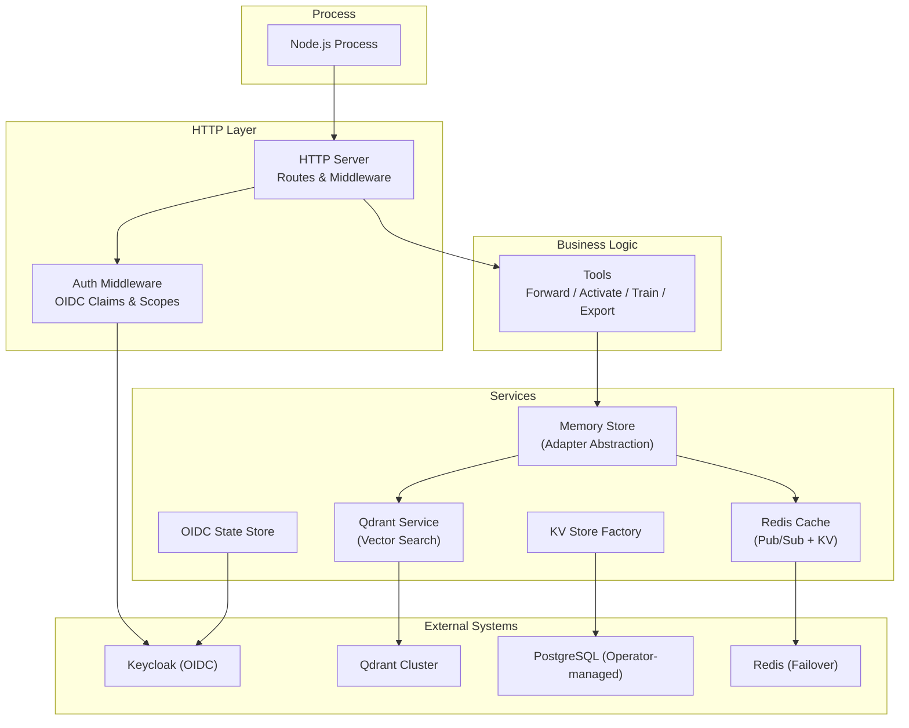
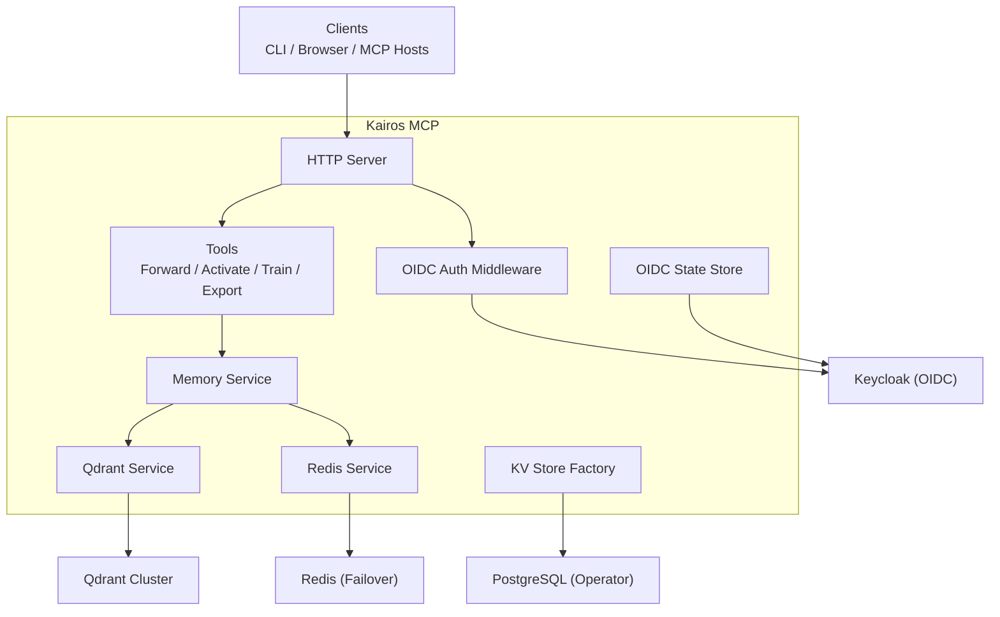
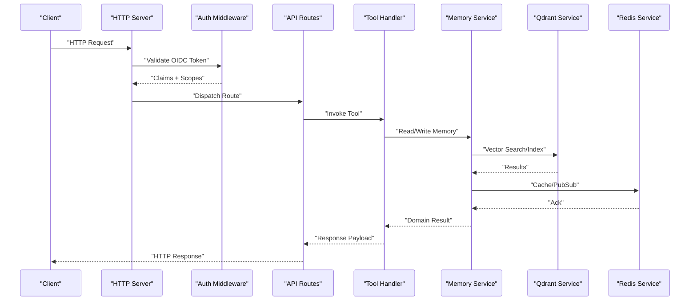
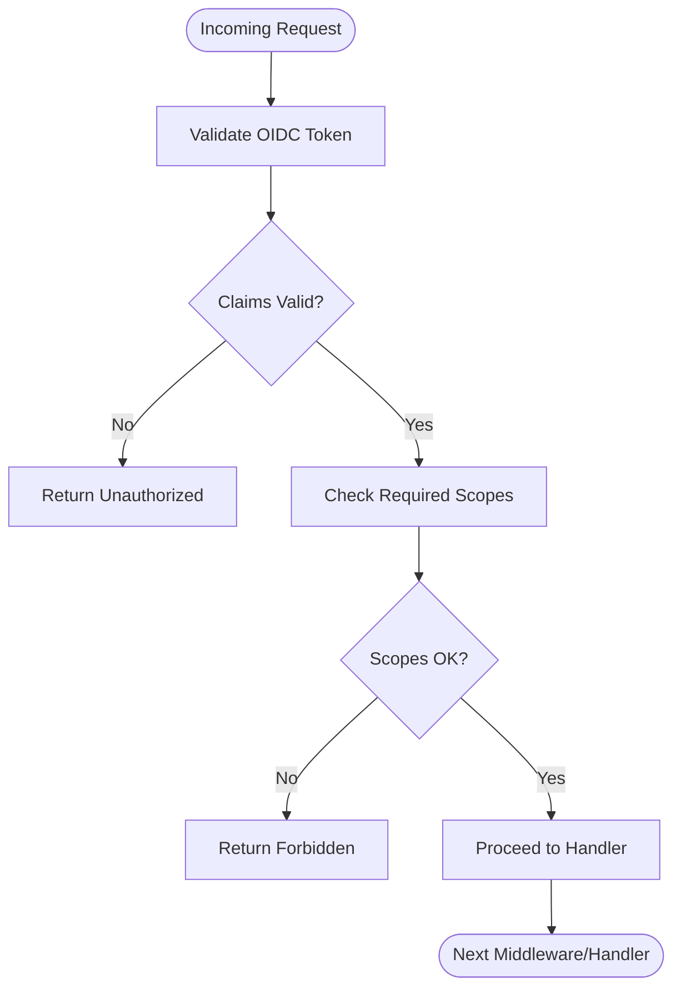
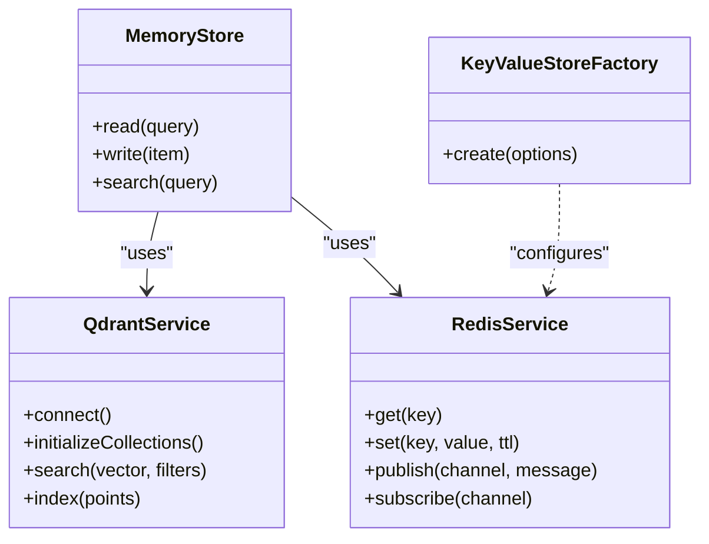
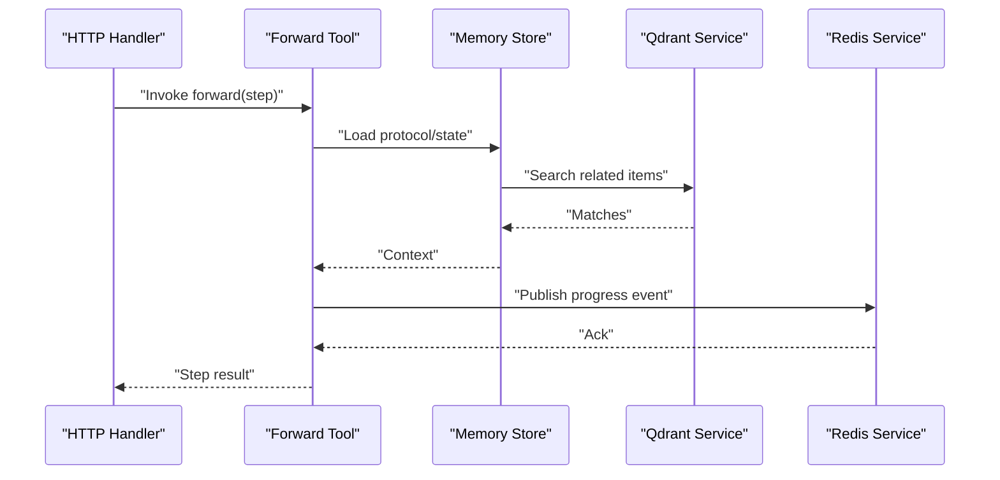
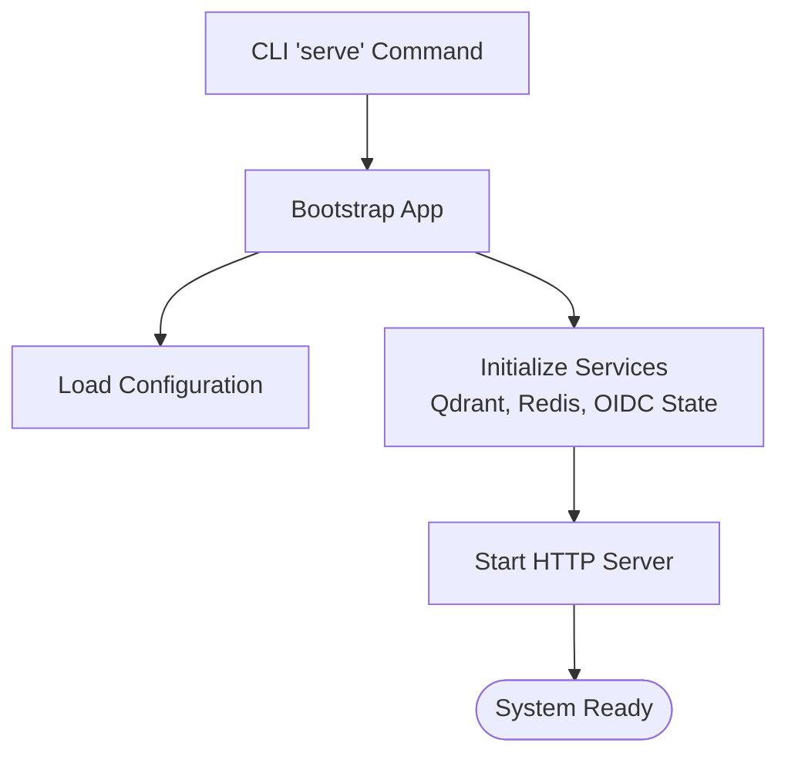
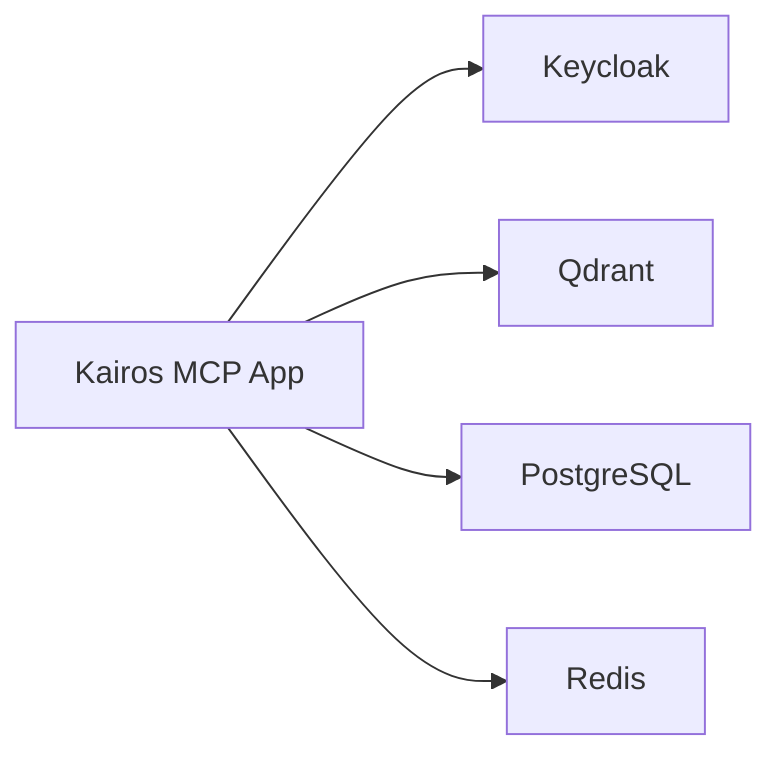

# Architecture Overview

<cite>
**Referenced Files in This Document**
- [src/index.ts](file://src/index.ts)
- [src/server.ts](file://src/server.ts)
- [src/bootstrap.ts](file://src/bootstrap.ts)
- [src/config.ts](file://src/config.ts)
- [src/metrics-server.ts](file://src/metrics-server.ts)
- [src/http/http-server.ts](file://src/http/http-server.ts)
- [src/http/http-server-startup.ts](file://src/http/http-server-startup.ts)
- [src/http/http-api-routes.ts](file://src/http/http-api-routes.ts)
- [src/http/http-auth-middleware.ts](file://src/http/http-auth-middleware.ts)
- [src/http/oidc-profile-claims.ts](file://src/http/oidc-profile-claims.ts)
- [src/http/oidc-scopes.ts](file://src/http/oidc-scopes.ts)
- [src/services/memory/store.ts](file://src/services/memory/store.ts)
- [src/services/memory/store-init.ts](file://src/services/memory/store-init.ts)
- [src/services/qdrant/service.ts](file://src/services/qdrant/service.ts)
- [src/services/qdrant/connection.ts](file://src/services/qdrant/connection.ts)
- [src/services/qdrant/initialization.ts](file://src/services/qdrant/initialization.ts)
- [src/services/qdrant/search.ts](file://src/services/qdrant/search.ts)
- [src/services/qdrant/memory-store.ts](file://src/services/qdrant/memory-store.ts)
- [src/services/key-value-store-factory.ts](file://src/services/key-value-store-factory.ts)
- [src/services/redis-cache.ts](file://src/services/redis-cache.ts)
- [src/services/oidc-state-store.ts](file://src/services/oidc-state-store.ts)
- [src/tools/forward.ts](file://src/tools/forward.ts)
- [src/tools/activate.ts](file://src/tools/activate.ts)
- [src/tools/train.ts](file://src/tools/train.ts)
- [src/tools/export.ts](file://src/tools/export.ts)
- [src/cli/commands/serve.ts](file://src/cli/commands/serve.ts)
- [helm/kairos-mcp/templates/kairos-mcp-deployment.yaml](file://helm/kairos-mcp/templates/kairos-mcp-deployment.yaml)
- [helm/kairos-mcp/templates/postgres-cluster-cr.yaml](file://helm/kairos-mcp/templates/postgres-cluster-cr.yaml)
- [helm/kairos-mcp/templates/qdrant-hpa.yaml](file://helm/kairos-mcp/templates/qdrant-hpa.yaml)
- [helm/kairos-mcp/templates/redis-failover-cr.yaml](file://helm/kairos-mcp/templates/redis-failover-cr.yaml)
- [helm/kairos-mcp/templates/keycloak-realm-import.yaml](file://helm/kairos-mcp/templates/keycloak-realm-import.yaml)
</cite>

## Update Summary
**Changes Made**
- Updated documentation structure to reflect migration from manual 'Considerations.md' file to automated documentation system
- Preserved all architectural overview content within the wiki structure
- Enhanced source tracking for better traceability of architectural decisions
- Maintained comprehensive coverage of service-oriented design patterns and component boundaries

## Table of Contents
1. [Introduction](#introduction)
2. [Project Structure](#project-structure)
3. [Core Components](#core-components)
4. [Architecture Overview](#architecture-overview)
5. [Detailed Component Analysis](#detailed-component-analysis)
6. [Dependency Analysis](#dependency-analysis)
7. [Performance Considerations](#performance-considerations)
8. [Troubleshooting Guide](#troubleshooting-guide)
9. [Conclusion](#conclusion)

## Introduction
This document describes the architecture of the Kairos MCP system with a focus on service-oriented design, layered boundaries, and integration points. It explains how HTTP/API handlers orchestrate business logic implemented as tools, which in turn coordinate memory services, workflow execution, authentication, and UI resources. The system integrates external identity (Keycloak), vector search (Qdrant), relational storage (PostgreSQL via operators), and caching/pub-sub (Redis). Deployment is containerized and orchestrated via Helm, with horizontal scaling and observability built-in.

**Updated** Documentation now reflects the migration from manual architectural decision files to an automated documentation system while preserving all architectural overview content in the wiki structure.

## Project Structure
The codebase follows a layered and modular organization:
- Entry points bootstrap the server and CLI
- HTTP layer exposes REST and MCP endpoints with middleware for auth and metrics
- Business logic is implemented as tools that encapsulate workflows
- Services provide cross-cutting capabilities: memory, Qdrant, Redis, OIDC state, key-value store
- UI assets are served statically and integrated into MCP offerings
- Helm charts define deployment topology and dependencies

[No sources needed since this diagram shows conceptual workflow, not actual code structure]

**Section sources**
- [src/index.ts](file://src/index.ts)
- [src/server.ts](file://src/server.ts)
- [src/bootstrap.ts](file://src/bootstrap.ts)
- [src/config.ts](file://src/config.ts)
- [src/http/http-server.ts](file://src/http/http-server.ts)
- [src/http/http-server-startup.ts](file://src/http/http-server-startup.ts)
- [src/http/http-api-routes.ts](file://src/http/http-api-routes.ts)
- [src/http/http-auth-middleware.ts](file://src/http/http-auth-middleware.ts)
- [src/http/oidc-profile-claims.ts](file://src/http/oidc-profile-claims.ts)
- [src/http/oidc-scopes.ts](file://src/http/oidc-scopes.ts)
- [src/services/memory/store.ts](file://src/services/memory/store.ts)
- [src/services/qdrant/service.ts](file://src/services/qdrant/service.ts)
- [src/services/qdrant/connection.ts](file://src/services/qdrant/connection.ts)
- [src/services/qdrant/initialization.ts](file://src/services/qdrant/initialization.ts)
- [src/services/qdrant/search.ts](file://src/services/qdrant/search.ts)
- [src/services/qdrant/memory-store.ts](file://src/services/qdrant/memory-store.ts)
- [src/services/redis-cache.ts](file://src/services/redis-cache.ts)
- [src/services/oidc-state-store.ts](file://src/services/oidc-state-store.ts)
- [src/services/key-value-store-factory.ts](file://src/services/key-value-store-factory.ts)
- [src/tools/forward.ts](file://src/tools/forward.ts)
- [src/tools/activate.ts](file://src/tools/activate.ts)
- [src/tools/train.ts](file://src/tools/train.ts)
- [src/tools/export.ts](file://src/tools/export.ts)
- [src/cli/commands/serve.ts](file://src/cli/commands/serve.ts)

## Core Components
- Bootstrap and configuration: centralizes environment-driven setup, dependency wiring, and lifecycle management.
- HTTP server and routes: registers API endpoints, static UI, and MCP handlers; applies auth and metrics middleware.
- Authentication: OIDC-based middleware validates tokens, extracts claims, and enforces scopes.
- Tools: implement domain workflows such as forward, activate, train, export; they compose services to perform operations.
- Memory services: abstract adapter contracts and persistence; integrate with Qdrant for vector search and Redis for cache/pub-sub.
- Qdrant service: manages connection, initialization, indexing, and retrieval.
- Key-value store factory: provides pluggable backends (e.g., Redis-backed or file-backed) for transient and durable state.
- Metrics server: exposes operational metrics for Prometheus scraping.

**Section sources**
- [src/bootstrap.ts](file://src/bootstrap.ts)
- [src/config.ts](file://src/config.ts)
- [src/http/http-server.ts](file://src/http/http-server.ts)
- [src/http/http-server-startup.ts](file://src/http/http-server-startup.ts)
- [src/http/http-api-routes.ts](file://src/http/http-api-routes.ts)
- [src/http/http-auth-middleware.ts](file://src/http/http-auth-middleware.ts)
- [src/http/oidc-profile-claims.ts](file://src/http/oidc-profile-claims.ts)
- [src/http/oidc-scopes.ts](file://src/http/oidc-scopes.ts)
- [src/tools/forward.ts](file://src/tools/forward.ts)
- [src/tools/activate.ts](file://src/tools/activate.ts)
- [src/tools/train.ts](file://src/tools/train.ts)
- [src/tools/export.ts](file://src/tools/export.ts)
- [src/services/memory/store.ts](file://src/services/memory/store.ts)
- [src/services/qdrant/service.ts](file://src/services/qdrant/service.ts)
- [src/services/qdrant/connection.ts](file://src/services/qdrant/connection.ts)
- [src/services/qdrant/initialization.ts](file://src/services/qdrant/initialization.ts)
- [src/services/qdrant/search.ts](file://src/services/qdrant/search.ts)
- [src/services/qdrant/memory-store.ts](file://src/services/qdrant/memory-store.ts)
- [src/services/redis-cache.ts](file://src/services/redis-cache.ts)
- [src/services/oidc-state-store.ts](file://src/services/oidc-state-store.ts)
- [src/services/key-value-store-factory.ts](file://src/services/key-value-store-factory.ts)
- [src/metrics-server.ts](file://src/metrics-server.ts)

## Architecture Overview
Kairos MCP uses a service-oriented, layered architecture:
- Presentation layer: HTTP server serves REST APIs, MCP JSON-RPC endpoints, and static UI.
- Middleware layer: handles OIDC validation, scope checks, tenant context, and metrics collection.
- Application layer: tool implementations orchestrate workflows using services.
- Domain services: memory abstraction, Qdrant vector search, Redis caching/pub-sub, OIDC state, and generic key-value store.
- External integrations: Keycloak for identity, Qdrant for semantic search, PostgreSQL for relational data (operator-managed), Redis for caching and pub/sub.

**Diagram sources**
- [src/http/http-server.ts](file://src/http/http-server.ts)
- [src/http/http-auth-middleware.ts](file://src/http/http-auth-middleware.ts)
- [src/http/oidc-profile-claims.ts](file://src/http/oidc-profile-claims.ts)
- [src/http/oidc-scopes.ts](file://src/http/oidc-scopes.ts)
- [src/tools/forward.ts](file://src/tools/forward.ts)
- [src/tools/activate.ts](file://src/tools/activate.ts)
- [src/tools/train.ts](file://src/tools/train.ts)
- [src/tools/export.ts](file://src/tools/export.ts)
- [src/services/memory/store.ts](file://src/services/memory/store.ts)
- [src/services/qdrant/service.ts](file://src/services/qdrant/service.ts)
- [src/services/qdrant/connection.ts](file://src/services/qdrant/connection.ts)
- [src/services/qdrant/initialization.ts](file://src/services/qdrant/initialization.ts)
- [src/services/qdrant/search.ts](file://src/services/qdrant/search.ts)
- [src/services/qdrant/memory-store.ts](file://src/services/qdrant/memory-store.ts)
- [src/services/redis-cache.ts](file://src/services/redis-cache.ts)
- [src/services/oidc-state-store.ts](file://src/services/oidc-state-store.ts)
- [src/services/key-value-store-factory.ts](file://src/services/key-value-store-factory.ts)

## Detailed Component Analysis

### HTTP and API Layer
Responsibilities:
- Start and configure the HTTP server
- Register API routes and MCP handlers
- Serve static UI assets
- Apply auth and metrics middleware

Integration points:
- OIDC profile claims and scopes for authorization
- Well-known endpoints and health checks
- CORS configuration for MCP clients

**Diagram sources**
- [src/http/http-server.ts](file://src/http/http-server.ts)
- [src/http/http-server-startup.ts](file://src/http/http-server-startup.ts)
- [src/http/http-api-routes.ts](file://src/http/http-api-routes.ts)
- [src/http/http-auth-middleware.ts](file://src/http/http-auth-middleware.ts)
- [src/http/oidc-profile-claims.ts](file://src/http/oidc-profile-claims.ts)
- [src/http/oidc-scopes.ts](file://src/http/oidc-scopes.ts)
- [src/tools/forward.ts](file://src/tools/forward.ts)
- [src/services/memory/store.ts](file://src/services/memory/store.ts)
- [src/services/qdrant/service.ts](file://src/services/qdrant/service.ts)
- [src/services/qdrant/search.ts](file://src/services/qdrant/search.ts)
- [src/services/redis-cache.ts](file://src/services/redis-cache.ts)

**Section sources**
- [src/http/http-server.ts](file://src/http/http-server.ts)
- [src/http/http-server-startup.ts](file://src/http/http-server-startup.ts)
- [src/http/http-api-routes.ts](file://src/http/http-api-routes.ts)
- [src/http/http-auth-middleware.ts](file://src/http/http-auth-middleware.ts)
- [src/http/oidc-profile-claims.ts](file://src/http/oidc-profile-claims.ts)
- [src/http/oidc-scopes.ts](file://src/http/oidc-scopes.ts)

### Authentication and Authorization
- OIDC-based authentication validates tokens and maps claims to user context.
- Scopes enforce resource access policies at route/tool level.
- OIDC state store persists temporary state for flows (e.g., PKCE/callback).

**Diagram sources**
- [src/http/http-auth-middleware.ts](file://src/http/http-auth-middleware.ts)
- [src/http/oidc-profile-claims.ts](file://src/http/oidc-profile-claims.ts)
- [src/http/oidc-scopes.ts](file://src/http/oidc-scopes.ts)
- [src/services/oidc-state-store.ts](file://src/services/oidc-state-store.ts)

**Section sources**
- [src/http/http-auth-middleware.ts](file://src/http/http-auth-middleware.ts)
- [src/http/oidc-profile-claims.ts](file://src/http/oidc-profile-claims.ts)
- [src/http/oidc-scopes.ts](file://src/http/oidc-scopes.ts)
- [src/services/oidc-state-store.ts](file://src/services/oidc-state-store.ts)

### Memory Services and Vector Search
- Memory store abstracts adapters and coordinates read/write operations.
- Qdrant service manages connections, collections, and vector search.
- Redis provides caching and pub/sub for cache invalidation and coordination across replicas.

**Diagram sources**
- [src/services/memory/store.ts](file://src/services/memory/store.ts)
- [src/services/qdrant/service.ts](file://src/services/qdrant/service.ts)
- [src/services/qdrant/connection.ts](file://src/services/qdrant/connection.ts)
- [src/services/qdrant/initialization.ts](file://src/services/qdrant/initialization.ts)
- [src/services/qdrant/search.ts](file://src/services/qdrant/search.ts)
- [src/services/qdrant/memory-store.ts](file://src/services/qdrant/memory-store.ts)
- [src/services/redis-cache.ts](file://src/services/redis-cache.ts)
- [src/services/key-value-store-factory.ts](file://src/services/key-value-store-factory.ts)

**Section sources**
- [src/services/memory/store.ts](file://src/services/memory/store.ts)
- [src/services/qdrant/service.ts](file://src/services/qdrant/service.ts)
- [src/services/qdrant/connection.ts](file://src/services/qdrant/connection.ts)
- [src/services/qdrant/initialization.ts](file://src/services/qdrant/initialization.ts)
- [src/services/qdrant/search.ts](file://src/services/qdrant/search.ts)
- [src/services/qdrant/memory-store.ts](file://src/services/qdrant/memory-store.ts)
- [src/services/redis-cache.ts](file://src/services/redis-cache.ts)
- [src/services/key-value-store-factory.ts](file://src/services/key-value-store-factory.ts)

### Workflow Tools
Tools encapsulate domain workflows:
- Forward: orchestrates step execution and state transitions
- Activate: activates protocols and prepares runtime context
- Train: ingests artifacts, computes embeddings, and indexes content
- Export: serializes skills and artifacts for distribution

**Diagram sources**
- [src/tools/forward.ts](file://src/tools/forward.ts)
- [src/tools/activate.ts](file://src/tools/activate.ts)
- [src/tools/train.ts](file://src/tools/train.ts)
- [src/tools/export.ts](file://src/tools/export.ts)
- [src/services/memory/store.ts](file://src/services/memory/store.ts)
- [src/services/qdrant/service.ts](file://src/services/qdrant/service.ts)
- [src/services/redis-cache.ts](file://src/services/redis-cache.ts)

**Section sources**
- [src/tools/forward.ts](file://src/tools/forward.ts)
- [src/tools/activate.ts](file://src/tools/activate.ts)
- [src/tools/train.ts](file://src/tools/train.ts)
- [src/tools/export.ts](file://src/tools/export.ts)

### CLI and Server Entrypoints
- CLI serve command starts the HTTP server with configured options.
- Bootstrap wires dependencies and initializes services.
- Config centralizes environment variables and feature toggles.

**Diagram sources**
- [src/cli/commands/serve.ts](file://src/cli/commands/serve.ts)
- [src/bootstrap.ts](file://src/bootstrap.ts)
- [src/config.ts](file://src/config.ts)
- [src/http/http-server.ts](file://src/http/http-server.ts)
- [src/services/qdrant/initialization.ts](file://src/services/qdrant/initialization.ts)
- [src/services/redis-cache.ts](file://src/services/redis-cache.ts)
- [src/services/oidc-state-store.ts](file://src/services/oidc-state-store.ts)

**Section sources**
- [src/cli/commands/serve.ts](file://src/cli/commands/serve.ts)
- [src/bootstrap.ts](file://src/bootstrap.ts)
- [src/config.ts](file://src/config.ts)
- [src/http/http-server.ts](file://src/http/http-server.ts)
- [src/services/qdrant/initialization.ts](file://src/services/qdrant/initialization.ts)
- [src/services/redis-cache.ts](file://src/services/redis-cache.ts)
- [src/services/oidc-state-store.ts](file://src/services/oidc-state-store.ts)

## Dependency Analysis
External systems and internal components interact through well-defined interfaces:
- Identity: Keycloak provides OIDC provider; app validates tokens and reads claims/scopes.
- Vector search: Qdrant cluster stores vectors and performs similarity search.
- Relational storage: PostgreSQL managed by operator supports durable state where required.
- Caching/pub-sub: Redis enables fast lookups and cross-instance coordination.

**Diagram sources**
- [src/http/http-auth-middleware.ts](file://src/http/http-auth-middleware.ts)
- [src/http/oidc-profile-claims.ts](file://src/http/oidc-profile-claims.ts)
- [src/services/qdrant/connection.ts](file://src/services/qdrant/connection.ts)
- [src/services/qdrant/initialization.ts](file://src/services/qdrant/initialization.ts)
- [src/services/redis-cache.ts](file://src/services/redis-cache.ts)
- [src/services/key-value-store-factory.ts](file://src/services/key-value-store-factory.ts)

**Section sources**
- [src/http/http-auth-middleware.ts](file://src/http/http-auth-middleware.ts)
- [src/http/oidc-profile-claims.ts](file://src/http/oidc-profile-claims.ts)
- [src/services/qdrant/connection.ts](file://src/services/qdrant/connection.ts)
- [src/services/qdrant/initialization.ts](file://src/services/qdrant/initialization.ts)
- [src/services/redis-cache.ts](file://src/services/redis-cache.ts)
- [src/services/key-value-store-factory.ts](file://src/services/key-value-store-factory.ts)

## Performance Considerations
- Horizontal scalability: Deploy multiple replicas behind a load balancer; use Redis for shared cache and pub/sub to maintain consistency.
- Vector search tuning: Configure Qdrant collection sizes, shard count, and replication factor based on dataset scale and query patterns.
- Connection pooling: Ensure Qdrant and Redis clients are pooled and tuned for concurrency.
- Caching strategy: Use Redis for hot paths (e.g., frequently accessed metadata) and invalidate on writes.
- Observability: Expose metrics via the metrics server and scrape with Prometheus; monitor latency, error rates, and queue depths.

[No sources needed since this section provides general guidance]

## Troubleshooting Guide
Common areas to inspect:
- Authentication failures: verify OIDC issuer URL, client credentials, and token introspection; check claim mapping and scope enforcement.
- Vector search issues: validate Qdrant connectivity, collection existence, and vector dimensions; review search filters and payload schemas.
- Cache inconsistencies: ensure Redis pub/sub channels are correctly subscribed and TTLs align with write operations.
- Startup errors: confirm service initialization order and readiness probes for Qdrant and Redis.

Operational references:
- Health and well-known endpoints for liveness/readiness checks
- Metrics endpoint for monitoring
- Helm values for configuring TLS, replicas, and resource limits

**Section sources**
- [src/http/http-health-routes.ts](file://src/http/http-health-routes.ts)
- [src/http/http-well-known.ts](file://src/http/http-well-known.ts)
- [src/metrics-server.ts](file://src/metrics-server.ts)
- [helm/kairos-mcp/templates/kairos-mcp-deployment.yaml](file://helm/kairos-mcp/templates/kairos-mcp-deployment.yaml)
- [helm/kairos-mcp/templates/qdrant-hpa.yaml](file://helm/kairos-mcp/templates/qdrant-hpa.yaml)
- [helm/kairos-mcp/templates/redis-failover-cr.yaml](file://helm/kairos-mcp/templates/redis-failover-cr.yaml)
- [helm/kairos-mcp/templates/postgres-cluster-cr.yaml](file://helm/kairos-mcp/templates/postgres-cluster-cr.yaml)
- [helm/kairos-mcp/templates/keycloak-realm-import.yaml](file://helm/kairos-mcp/templates/keycloak-realm-import.yaml)

## Conclusion
Kairos MCP implements a clear layered architecture with strong separation between HTTP/API, business logic, and services. The system integrates Keycloak for identity, Qdrant for semantic search, PostgreSQL for relational needs, and Redis for caching and coordination. Helm-based deployment supports scalable, observable operation with horizontal scaling and robust external dependencies.

**Updated** The documentation structure now reflects the successful migration from manual architectural decision files to an automated documentation system, with all architectural overview content preserved and enhanced within the wiki structure for better maintainability and accessibility.