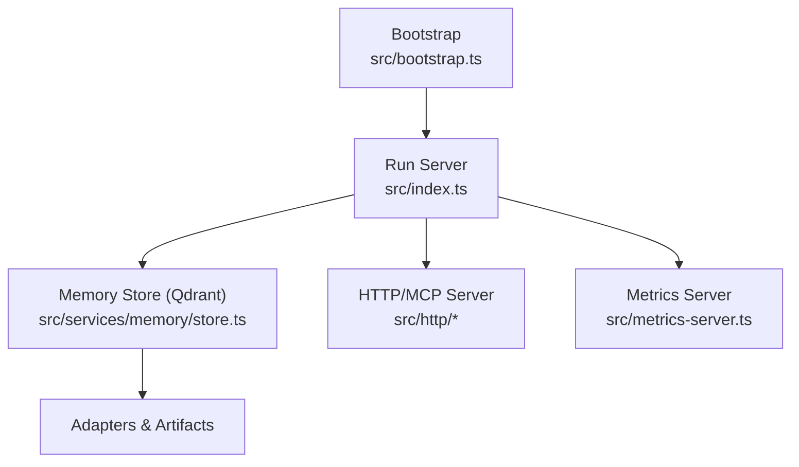
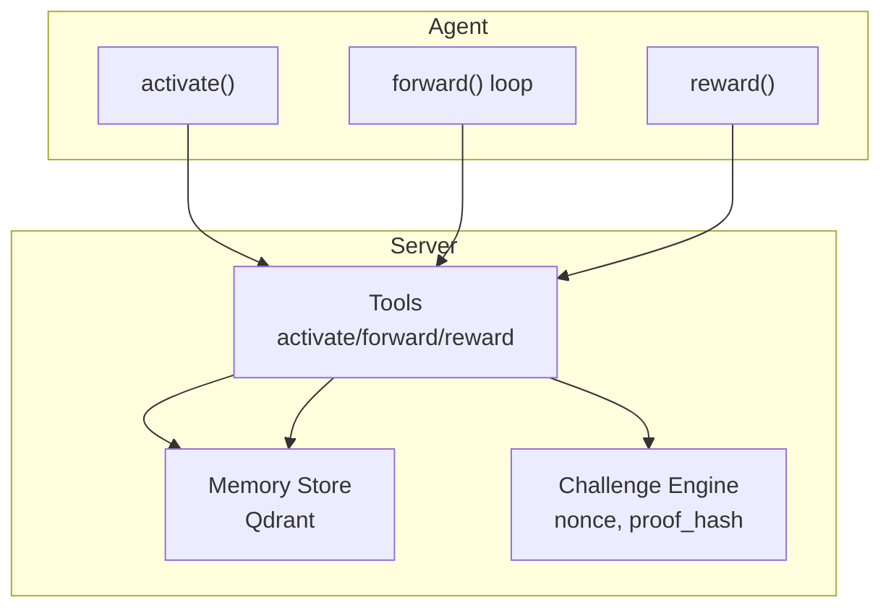
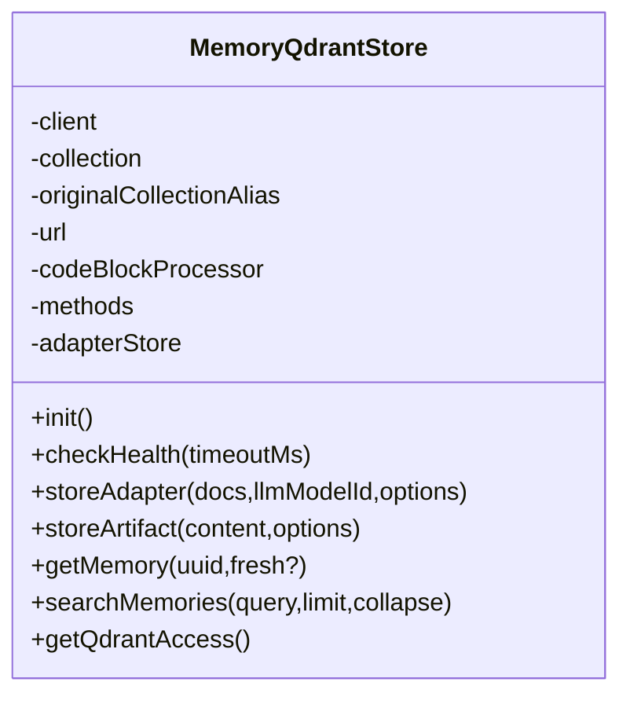
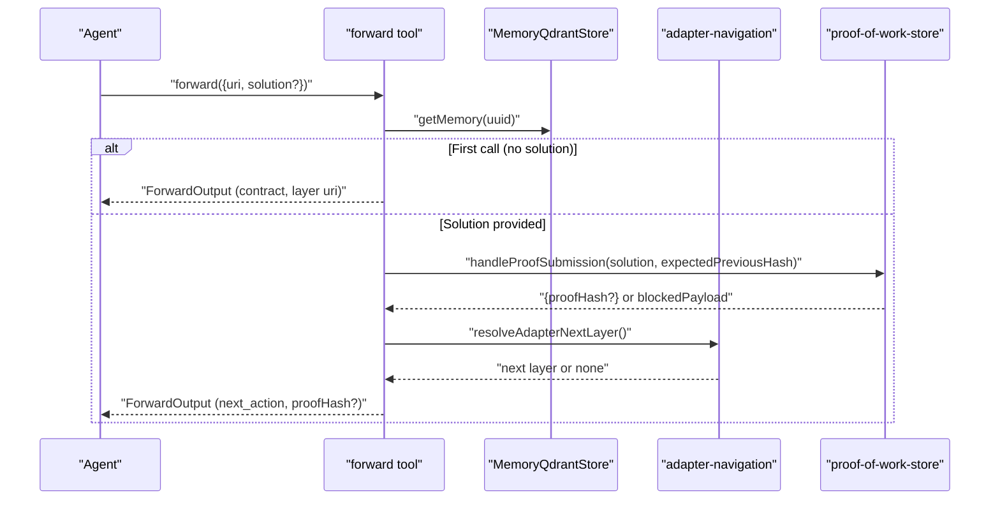
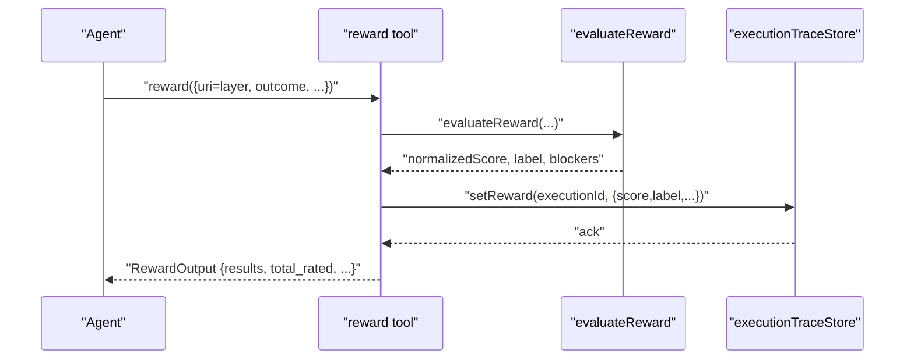
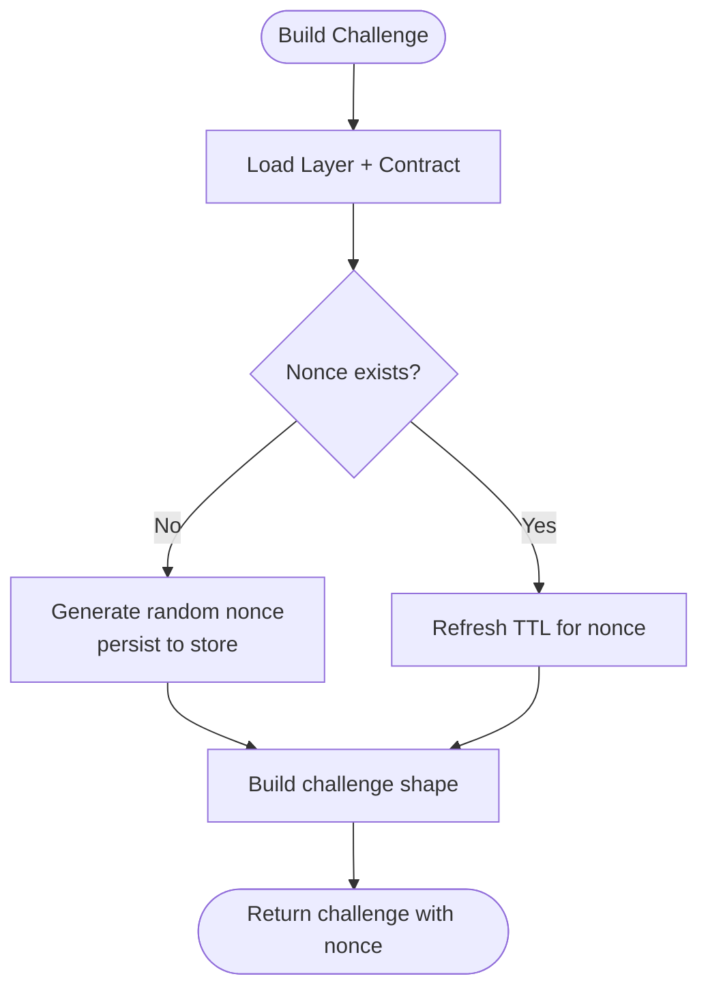
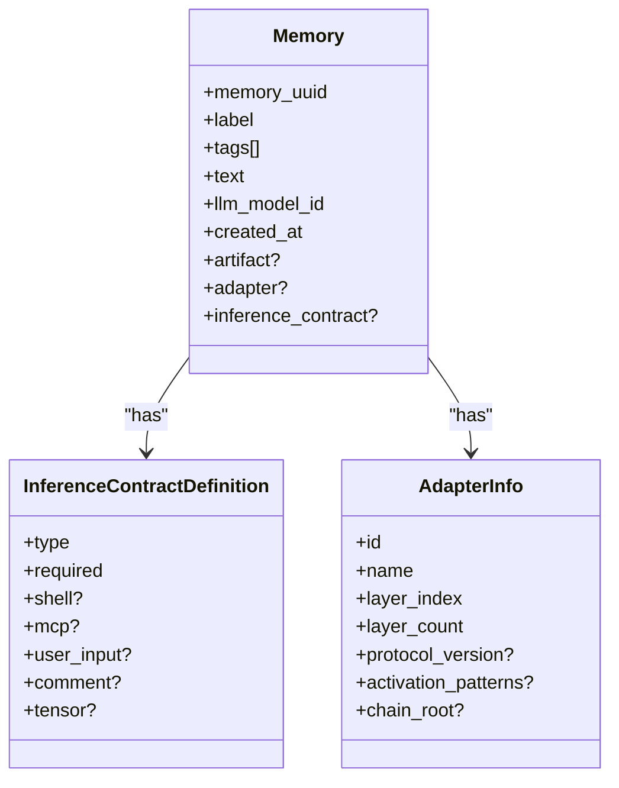
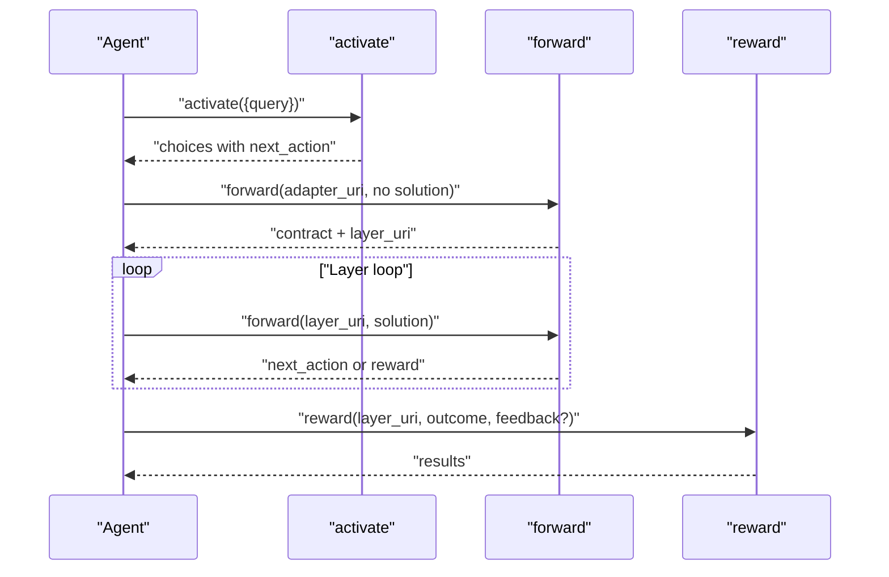
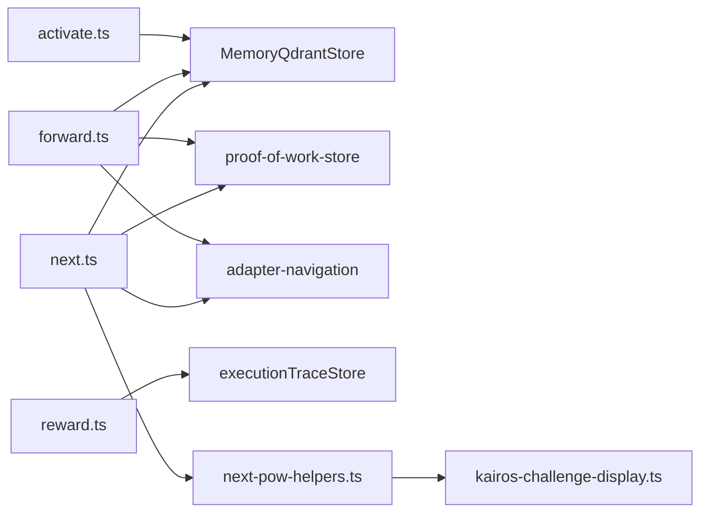

# Core Concepts

<cite>
**Referenced Files in This Document**
- [README.md](file://README.md)
- [src/index.ts](file://src/index.ts)
- [src/bootstrap.ts](file://src/bootstrap.ts)
- [src/services/memory/store.ts](file://src/services/memory/store.ts)
- [src/tools/activate.ts](file://src/tools/activate.ts)
- [src/tools/forward.ts](file://src/tools/forward.ts)
- [src/tools/reward.ts](file://src/tools/reward.ts)
- [src/tools/next-pow-helpers.ts](file://src/tools/next-pow-helpers.ts)
- [src/tools/kairos-challenge-display.ts](file://src/tools/kairos-challenge-display.ts)
- [src/tools/next.ts](file://src/tools/next.ts)
- [src/types/memory.ts](file://src/types/memory.ts)
- [src/services/memory/memory-accessors.ts](file://src/services/memory/memory-accessors.ts)
- [docs/architecture/workflow-full-execution.md](file://docs/architecture/workflow-full-execution.md)
</cite>

## Table of Contents
1. [Introduction](#introduction)
2. [Project Structure](#project-structure)
3. [Core Components](#core-components)
4. [Architecture Overview](#architecture-overview)
5. [Detailed Component Analysis](#detailed-component-analysis)
6. [Dependency Analysis](#dependency-analysis)
7. [Performance Considerations](#performance-considerations)
8. [Troubleshooting Guide](#troubleshooting-guide)
9. [Conclusion](#conclusion)

## Introduction
This document explains KAIROS MCP’s core concepts and fundamental principles as implemented in the codebase:
- Persistent memory: store and retrieve protocol chains across sessions using a Qdrant-backed memory store.
- Deterministic execution: a fixed three-phase workflow—activate, forward, reward—driven by server-generated guidance.
- Agent-facing design: tools and error messages are optimized for programmatic consumption and recovery.
- Challenge data system: nonce, proof_hash, and URIs enable secure, auditable agent-server communication.
- Protocols, adapters, and layers: execution model organized around adapters (root containers) and ordered layers (steps) with inference contracts.

These concepts are grounded in authoritative tool documentation and the runtime behavior defined in the server.

**Section sources**
- [README.md:18-92](file://README.md#L18-L92)
- [docs/architecture/workflow-full-execution.md:1-110](file://docs/architecture/workflow-full-execution.md#L1-L110)

## Project Structure
At runtime, the server initializes supporting services, waits for Qdrant readiness, injects embedded memory resources, and starts the HTTP/MCP application. The memory subsystem integrates with Qdrant and provides adapter and artifact storage.



**Diagram sources**
- [src/bootstrap.ts:1-55](file://src/bootstrap.ts#L1-L55)
- [src/index.ts:74-139](file://src/index.ts#L74-L139)
- [src/services/memory/store.ts:20-57](file://src/services/memory/store.ts#L20-L57)

**Section sources**
- [src/bootstrap.ts:1-55](file://src/bootstrap.ts#L1-L55)
- [src/index.ts:74-139](file://src/index.ts#L74-L139)
- [src/services/memory/store.ts:20-57](file://src/services/memory/store.ts#L20-L57)

## Core Components
- Persistent memory: The MemoryQdrantStore encapsulates Qdrant client configuration, collection resolution, and methods for adapter and artifact storage, retrieval, and search. It ensures health checks and resolves collections via aliases.
- Deterministic execution: The three-phase workflow is enforced by tools:
  - activate: semantic search and adapter matching, returning ranked choices with precise next actions.
  - forward: layer-by-layer execution with loop control, enforcing contract types and proof submission.
  - reward: final evaluation and feedback recording.
- Agent-facing design: Tools expose structured content, strict schemas, and precise guidance (next_action, must_obey). Errors include actionable retry instructions and recovery hints.
- Challenge data system: Each step emits a nonce and a challenge shaped by the layer’s inference contract. Agents must echo the nonce and include the previous proof_hash when required.

**Section sources**
- [src/services/memory/store.ts:20-152](file://src/services/memory/store.ts#L20-L152)
- [src/tools/activate.ts:208-234](file://src/tools/activate.ts#L208-L234)
- [src/tools/forward.ts:93-318](file://src/tools/forward.ts#L93-L318)
- [src/tools/reward.ts:27-110](file://src/tools/reward.ts#L27-L110)
- [src/tools/next-pow-helpers.ts:38-56](file://src/tools/next-pow-helpers.ts#L38-L56)
- [README.md:18-92](file://README.md#L18-L92)

## Architecture Overview
The execution model centers on adapters and layers. An adapter is a reusable protocol chain identified by a stable ID and composed of ordered layers. Each layer carries an inference contract specifying the required proof type and validation rules. The server manages challenges (nonce, proof_hash) and guides agents through next_action.



**Diagram sources**
- [src/tools/activate.ts:236-284](file://src/tools/activate.ts#L236-L284)
- [src/tools/forward.ts:93-318](file://src/tools/forward.ts#L93-L318)
- [src/tools/reward.ts:112-156](file://src/tools/reward.ts#L112-L156)
- [src/tools/next-pow-helpers.ts:38-56](file://src/tools/next-pow-helpers.ts#L38-L56)
- [src/services/memory/store.ts:20-57](file://src/services/memory/store.ts#L20-L57)

## Detailed Component Analysis

### Persistent Memory and Storage
- MemoryQdrantStore initializes the Qdrant client, resolves collection aliases, and exposes methods for adapter and artifact storage, retrieval, and search. Health checks gate startup to ensure Qdrant availability.
- The store composes lower-level methods and an adapter store to manage protocol artifacts and metadata.



**Diagram sources**
- [src/services/memory/store.ts:20-152](file://src/services/memory/store.ts#L20-L152)

**Section sources**
- [src/services/memory/store.ts:20-152](file://src/services/memory/store.ts#L20-L152)
- [src/index.ts:84-94](file://src/index.ts#L84-L94)

### Deterministic Execution: Activate
- The activate tool performs semantic search and returns ranked choices. Each choice includes a precise next_action and optional linked artifacts. The output is strongly typed and includes execution_id and grounding guidance.

```mermaid
sequenceDiagram
participant Agent as "Agent"
participant Activate as "activate tool"
participant Search as "search impl"
participant Store as "MemoryQdrantStore"
Agent->>Activate : "activate({query, execution_id?})"
Activate->>Search : "executeSearch(...)"
Search->>Store : "searchMemories(...)"
Store-->>Search : "choices + scores"
Search-->>Activate : "searchOutput"
Activate-->>Agent : "ActivateOutput {choices, next_action, execution_id}"
```

**Diagram sources**
- [src/tools/activate.ts:208-234](file://src/tools/activate.ts#L208-L234)
- [src/tools/activate.ts:43-206](file://src/tools/activate.ts#L43-L206)

**Section sources**
- [src/tools/activate.ts:208-234](file://src/tools/activate.ts#L208-L234)
- [README.md:67-86](file://README.md#L67-L86)

### Deterministic Execution: Forward
- The forward tool orchestrates layer-by-layer execution:
  - Loads the requested adapter or layer.
  - Starts or resumes an execution session with an execution_id.
  - Enforces inference contracts and proof submission.
  - Manages loop control and transitions to the next layer or reward.
  - Records execution traces and updates quality metrics.



**Diagram sources**
- [src/tools/forward.ts:93-318](file://src/tools/forward.ts#L93-L318)
- [src/tools/next-pow-helpers.ts:155-322](file://src/tools/next-pow-helpers.ts#L155-L322)
- [src/services/memory/memory-accessors.ts:1-42](file://src/services/memory/memory-accessors.ts#L1-L42)

**Section sources**
- [src/tools/forward.ts:93-318](file://src/tools/forward.ts#L93-L318)
- [src/tools/next.ts:137-273](file://src/tools/next.ts#L137-L273)
- [README.md:73-83](file://README.md#L73-L83)

### Deterministic Execution: Reward
- The reward tool validates that the input references a layer URI, evaluates the outcome, persists reward metrics, and records the result in the execution trace store.



**Diagram sources**
- [src/tools/reward.ts:27-110](file://src/tools/reward.ts#L27-L110)

**Section sources**
- [src/tools/reward.ts:27-110](file://src/tools/reward.ts#L27-L110)
- [README.md:80-83](file://README.md#L80-L83)

### Challenge Data System: Nonce, Proof Hash, and URIs
- Each step builds a challenge derived from the layer’s inference contract. The server generates a random nonce and stores it with the layer. Agents must echo the nonce and include the previous proof_hash when required by the contract.
- The challenge shape is normalized for display and MCP output schema compliance, including type-specific fields and invocation hints.



**Diagram sources**
- [src/tools/next-pow-helpers.ts:38-56](file://src/tools/next-pow-helpers.ts#L38-L56)
- [src/tools/kairos-challenge-display.ts:20-89](file://src/tools/kairos-challenge-display.ts#L20-L89)

**Section sources**
- [src/tools/next-pow-helpers.ts:38-56](file://src/tools/next-pow-helpers.ts#L38-L56)
- [src/tools/kairos-challenge-display.ts:20-89](file://src/tools/kairos-challenge-display.ts#L20-L89)
- [README.md:57-58](file://README.md#L57-L58)

### Protocols, Adapters, and Layers
- Protocols are represented as adapters (root-level identifiers) composed of ordered layers. Each layer has an inference contract dictating the required proof type and validation rules. The system navigates next/previous layers and enforces contract compliance.
- Types define inference contracts, tensor contracts, and execution traces, enabling deterministic behavior and robust auditing.



**Diagram sources**
- [src/types/memory.ts:99-125](file://src/types/memory.ts#L99-L125)

**Section sources**
- [src/types/memory.ts:1-125](file://src/types/memory.ts#L1-L125)
- [src/services/memory/memory-accessors.ts:1-42](file://src/services/memory/memory-accessors.ts#L1-L42)

### Practical Execution Example
- A minimal end-to-end run:
  1. activate with a concise query; choose a next_action from the returned choices.
  2. forward with the adapter URI (no solution) to receive the first layer contract and layer URI.
  3. forward with the layer URI and a matching solution; repeat until next_action indicates reward.
  4. reward with the layer URI and outcome (success/failure), optionally including feedback and evaluator metadata.



**Diagram sources**
- [docs/architecture/workflow-full-execution.md:46-88](file://docs/architecture/workflow-full-execution.md#L46-L88)
- [README.md:67-86](file://README.md#L67-L86)

**Section sources**
- [docs/architecture/workflow-full-execution.md:1-110](file://docs/architecture/workflow-full-execution.md#L1-L110)
- [README.md:67-86](file://README.md#L67-L86)

## Dependency Analysis
The execution depends on a clear separation of concerns:
- Tools depend on the memory store for retrieval and navigation.
- The forward tool coordinates with the proof-of-work store and adapter navigation.
- The reward tool persists outcomes and updates execution traces.
- The challenge engine produces nonces and shapes challenges from inference contracts.



**Diagram sources**
- [src/tools/activate.ts:208-234](file://src/tools/activate.ts#L208-L234)
- [src/tools/forward.ts:93-318](file://src/tools/forward.ts#L93-L318)
- [src/tools/reward.ts:27-110](file://src/tools/reward.ts#L27-L110)
- [src/tools/next.ts:137-273](file://src/tools/next.ts#L137-L273)
- [src/tools/next-pow-helpers.ts:38-56](file://src/tools/next-pow-helpers.ts#L38-L56)
- [src/tools/kairos-challenge-display.ts:20-89](file://src/tools/kairos-challenge-display.ts#L20-L89)

**Section sources**
- [src/tools/activate.ts:208-234](file://src/tools/activate.ts#L208-L234)
- [src/tools/forward.ts:93-318](file://src/tools/forward.ts#L93-L318)
- [src/tools/reward.ts:27-110](file://src/tools/reward.ts#L27-L110)
- [src/tools/next.ts:137-273](file://src/tools/next.ts#L137-L273)
- [src/tools/next-pow-helpers.ts:38-56](file://src/tools/next-pow-helpers.ts#L38-L56)
- [src/tools/kairos-challenge-display.ts:20-89](file://src/tools/kairos-challenge-display.ts#L20-L89)

## Performance Considerations
- Startup resilience: The server waits for Qdrant readiness and probes embedding dimensions before initializing memory stores and injecting embedded resources.
- Caching: The next tool caches memory retrievals via Redis to reduce latency for repeated lookups.
- Health gating: The application reports healthy only when Qdrant is available, preventing premature operation.

Practical implications:
- Ensure Qdrant is reachable and initialized before starting the server.
- Configure Redis for caching when deploying with higher throughput expectations.
- Monitor embedding provider health to avoid startup delays.

**Section sources**
- [src/index.ts:44-108](file://src/index.ts#L44-L108)
- [src/tools/next.ts:24-34](file://src/tools/next.ts#L24-L34)
- [README.md:363-370](file://README.md#L363-L370)

## Troubleshooting Guide
Common issues and recovery guidance:
- Server not healthy: Wait for Qdrant to become available; the health check will surface errors if Qdrant fails readiness.
- Embedding provider misconfiguration: Set a supported embedding backend in environment variables.
- CLI login loops: Verify the configured API URL, token validity, and Keycloak/JWT issuer/audience alignment.
- Nonce mismatches: Echo the nonce from the current contract; do not reuse stale values.
- Missing proof_hash: Include the previous proof_hash when required by the contract.

Operational tips:
- Use the health endpoint to verify readiness.
- Review structured logs for startup and runtime errors.
- Leverage next_action and error payloads to recover from transient failures without restarting the run.

**Section sources**
- [src/index.ts:44-108](file://src/index.ts#L44-L108)
- [src/tools/next-pow-helpers.ts:194-211](file://src/tools/next-pow-helpers.ts#L194-L211)
- [README.md:346-401](file://README.md#L346-L401)

## Conclusion
KAIROS MCP’s design centers on persistent memory, deterministic execution, and agent-friendly tooling. The three-phase workflow—activate, forward, reward—ensures reliable, auditable protocol execution. The challenge data system (nonce, proof_hash, URIs) secures agent-server interactions and enables replayable, verifiable runs. Together, these concepts provide a robust foundation for building and operating reusable protocol chains across sessions.