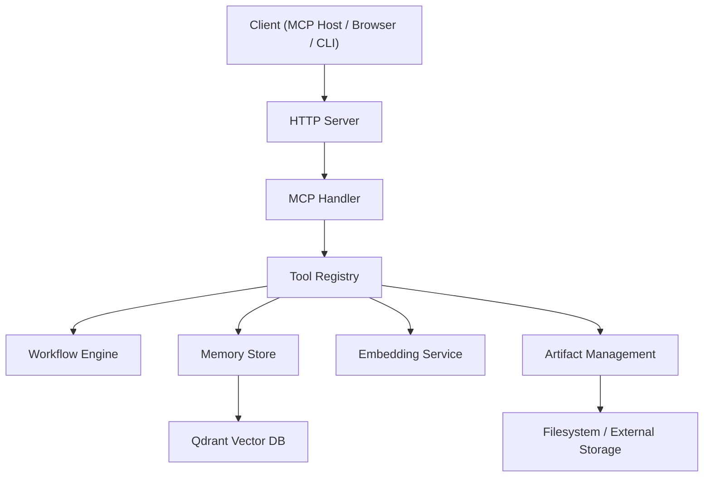
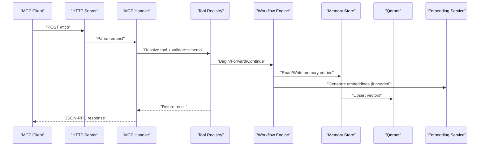
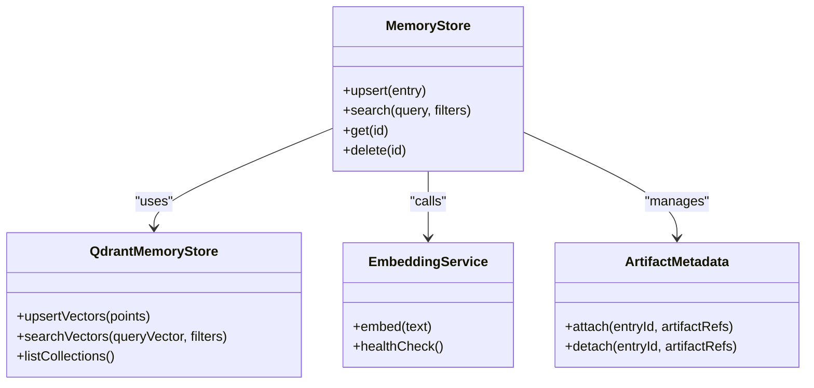
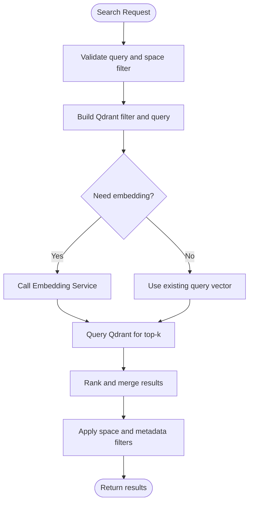
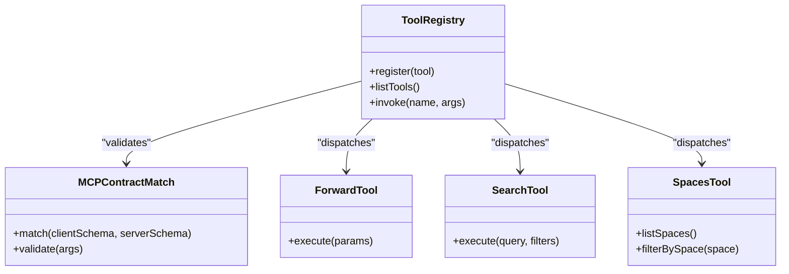
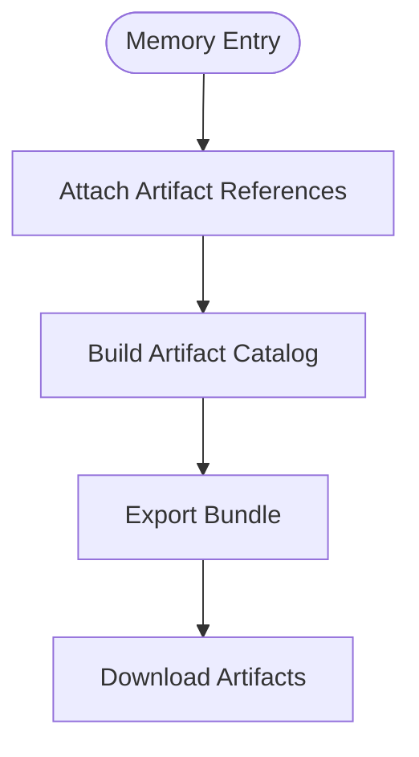
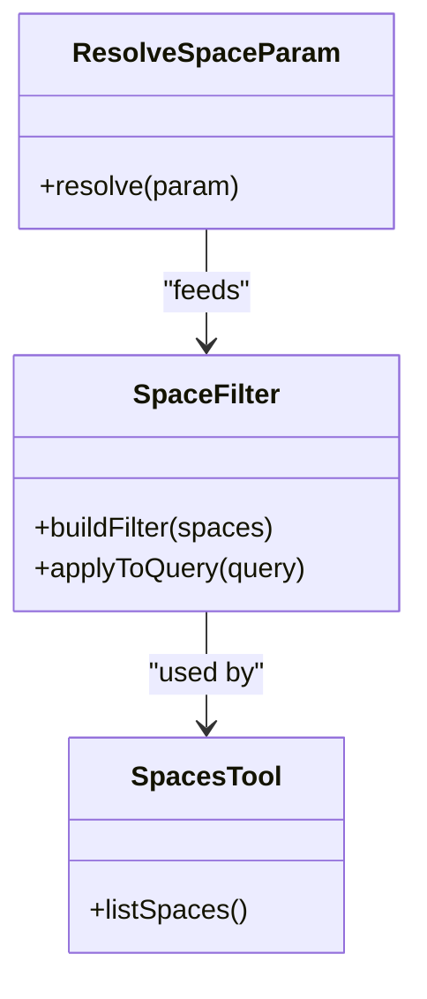
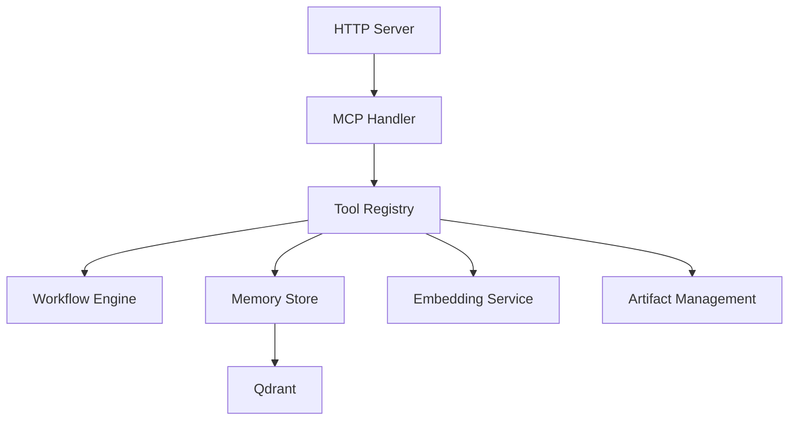

# Core Concepts

<cite>
**Referenced Files in This Document**
- [README.md](file://README.md)
- [bootstrap.ts](file://src/bootstrap.ts)
- [server.ts](file://src/server.ts)
- [index.ts](file://src/index.ts)
- [http-server.ts](file://src/http/http-server.ts)
- [http-mcp-handler.ts](file://src/http/http-mcp-handler.ts)
- [memory-store.ts](file://src/services/memory/store.ts)
- [store-methods.ts](file://src/services/memory/store-methods.ts)
- [qdrant-memory-store.ts](file://src/services/qdrant/memory-store.ts)
- [embedding-service.ts](file://src/services/embedding/service.ts)
- [tools-forward.ts](file://src/tools/forward.ts)
- [tools-search.ts](file://src/tools/search.ts)
- [tools-spaces.ts](file://src/tools/spaces.ts)
- [tools-artifact-catalog.ts](file://src/tools/artifact-catalog.ts)
- [mcp-contract-match.ts](file://src/tools/mcp-contract-match.ts)
- [artifact-relative-path.ts](file://src/tools/artifact-relative-path.ts)
- [artifact-metadata.ts](file://src/services/memory/artifact-metadata.ts)
- [qdrant-search.ts](file://src/services/qdrant/search.ts)
- [qdrant-memory-retrieval.ts](file://src/services/qdrant/memory-retrieval.ts)
- [qdrant-vector-types.ts](file://src/utils/qdrant-vector-types.ts)
- [qdrant-query-utils.ts](file://src/utils/qdrant-query-utils.ts)
- [resolve-space-param.ts](file://src/utils/resolve-space-param.ts)
- [space-filter.ts](file://src/utils/space-filter.ts)
- [workflow-full-execution.md](file://docs/architecture/workflow-full-execution.md)
- [workflow-forward-first-call.md](file://docs/architecture/workflow-forward-first-call.md)
- [workflow-forward-continue.md](file://docs/architecture/workflow-forward-continue.md)
- [artifacts.md](file://docs/architecture/artifacts.md)
</cite>

## Table of Contents
1. [Introduction](#introduction)
2. [Project Structure](#project-structure)
3. [Core Components](#core-components)
4. [Architecture Overview](#architecture-overview)
5. [Detailed Component Analysis](#detailed-component-analysis)
6. [Dependency Analysis](#dependency-analysis)
7. [Performance Considerations](#performance-considerations)
8. [Troubleshooting Guide](#troubleshooting-guide)
9. [Conclusion](#conclusion)
10. [Appendices](#appendices)

## Introduction
This document explains the fundamental architecture and terminology of Kairos MCP, focusing on:
- Model Context Protocol (MCP) fundamentals as implemented by the server
- Memory store concepts with semantic search capabilities
- Workflow orchestration patterns for guided execution
- Tool registry system and how tools are discovered and invoked
- Artifact management across spaces and exports
- Key components such as adapters, protocols, spaces, and their relationships to memory entries, embeddings, and vector search

The goal is to provide a clear mental model of how data flows through the system and how components interact to deliver AI-driven workflows powered by semantic memory.

## Project Structure
At a high level, the application boots an HTTP server that exposes both UI and MCP endpoints. The MCP layer routes requests to a tool registry, which orchestrates workflows and interacts with the memory store. The memory store persists structured content and vectors for semantic search using Qdrant. Embeddings are generated via an embedding service. Artifacts are managed alongside memory entries and can be exported or referenced within workflows.

[No sources needed since this diagram shows conceptual workflow, not actual code structure]

**Section sources**
- [README.md](file://README.md)
- [bootstrap.ts](file://src/bootstrap.ts)
- [server.ts](file://src/server.ts)
- [index.ts](file://src/index.ts)
- [http-server.ts](file://src/http/http-server.ts)
- [http-mcp-handler.ts](file://src/http/http-mcp-handler.ts)

## Core Components
- Model Context Protocol (MCP): A standardized protocol enabling hosts to call tools and read resources provided by servers. In Kairos, MCP is exposed over HTTP and used by clients to invoke workflows and query memory.
- Memory Store: A persistent store for memory entries, including metadata and optional embeddings. It supports filtering by space and semantic search backed by Qdrant.
- Workflow Engine: Orchestrates multi-step processes (begin, forward, continue, reward) and maintains state across calls.
- Tool Registry: Discovers and registers available tools (e.g., forward, search, spaces), validates inputs against schemas, and dispatches calls.
- Artifact Management: Handles creation, referencing, and export of artifacts associated with memory entries and workflows.
- Spaces: Logical partitions of memory and artifacts, enabling isolation and scoped operations.
- Adapters and Protocols: Adapters define how external systems integrate; protocols describe the shape of workflows and interactions.

Practical examples:
- Use the search tool to find relevant memory entries semantically within a specific space.
- Start a workflow with begin, then progress it with forward and continue until completion.
- Export artifacts from a space for offline use or sharing.

**Section sources**
- [http-mcp-handler.ts](file://src/http/http-mcp-handler.ts)
- [memory-store.ts](file://src/services/memory/store.ts)
- [store-methods.ts](file://src/services/memory/store-methods.ts)
- [qdrant-memory-store.ts](file://src/services/qdrant/memory-store.ts)
- [embedding-service.ts](file://src/services/embedding/service.ts)
- [tools-forward.ts](file://src/tools/forward.ts)
- [tools-search.ts](file://src/tools/search.ts)
- [tools-spaces.ts](file://src/tools/spaces.ts)
- [tools-artifact-catalog.ts](file://src/tools/artifact-catalog.ts)
- [mcp-contract-match.ts](file://src/tools/mcp-contract-match.ts)
- [artifact-relative-path.ts](file://src/tools/artifact-relative-path.ts)
- [artifact-metadata.ts](file://src/services/memory/artifact-metadata.ts)
- [qdrant-search.ts](file://src/services/qdrant/search.ts)
- [qdrant-memory-retrieval.ts](file://src/services/qdrant/memory-retrieval.ts)
- [qdrant-vector-types.ts](file://src/utils/qdrant-vector-types.ts)
- [qdrant-query-utils.ts](file://src/utils/qdrant-query-utils.ts)
- [resolve-space-param.ts](file://src/utils/resolve-space-param.ts)
- [space-filter.ts](file://src/utils/space-filter.ts)
- [workflow-full-execution.md](file://docs/architecture/workflow-full-execution.md)
- [workflow-forward-first-call.md](file://docs/architecture/workflow-forward-first-call.md)
- [workflow-forward-continue.md](file://docs/architecture/workflow-forward-continue.md)
- [artifacts.md](file://docs/architecture/artifacts.md)

## Architecture Overview
Kairos MCP follows a layered architecture:
- HTTP Layer: Serves UI, health, and MCP JSON-RPC endpoints.
- MCP Handler: Parses incoming requests, enforces contracts, and maps them to tools.
- Tool Registry: Provides discoverable tools with input validation and schema enforcement.
- Workflow Engine: Manages lifecycle of guided runs (begin, forward, continue, reward).
- Memory Store: Persists memory entries and coordinates with Qdrant for vector search.
- Embedding Service: Generates embeddings for text content to enable semantic retrieval.
- Artifact Management: Tracks artifacts linked to memory entries and supports export/download.

**Diagram sources**
- [http-mcp-handler.ts](file://src/http/http-mcp-handler.ts)
- [tools-forward.ts](file://src/tools/forward.ts)
- [memory-store.ts](file://src/services/memory/store.ts)
- [qdrant-memory-store.ts](file://src/services/qdrant/memory-store.ts)
- [embedding-service.ts](file://src/services/embedding/service.ts)

**Section sources**
- [http-server.ts](file://src/http/http-server.ts)
- [http-mcp-handler.ts](file://src/http/http-mcp-handler.ts)
- [tools-forward.ts](file://src/tools/forward.ts)
- [memory-store.ts](file://src/services/memory/store.ts)
- [qdrant-memory-store.ts](file://src/services/qdrant/memory-store.ts)
- [embedding-service.ts](file://src/services/embedding/service.ts)

## Detailed Component Analysis

### Memory Store and Semantic Search
The memory store abstracts persistence and retrieval of memory entries. It integrates with Qdrant for vector similarity search and manages metadata, filtering by space, and artifact associations.

Key responsibilities:
- Upserting memory entries and their embeddings
- Filtering results by space and other metadata
- Returning ranked results based on semantic similarity
- Coordinating with the embedding service to generate vectors when needed

**Diagram sources**
- [memory-store.ts](file://src/services/memory/store.ts)
- [qdrant-memory-store.ts](file://src/services/qdrant/memory-store.ts)
- [embedding-service.ts](file://src/services/embedding/service.ts)
- [artifact-metadata.ts](file://src/services/memory/artifact-metadata.ts)

**Section sources**
- [memory-store.ts](file://src/services/memory/store.ts)
- [store-methods.ts](file://src/services/memory/store-methods.ts)
- [qdrant-memory-store.ts](file://src/services/qdrant/memory-store.ts)
- [qdrant-search.ts](file://src/services/qdrant/search.ts)
- [qdrant-memory-retrieval.ts](file://src/services/qdrant/memory-retrieval.ts)
- [qdrant-vector-types.ts](file://src/utils/qdrant-vector-types.ts)
- [qdrant-query-utils.ts](file://src/utils/qdrant-query-utils.ts)
- [artifact-metadata.ts](file://src/services/memory/artifact-metadata.ts)

#### Data Flow: Semantic Search

**Diagram sources**
- [qdrant-search.ts](file://src/services/qdrant/search.ts)
- [qdrant-memory-retrieval.ts](file://src/services/qdrant/memory-retrieval.ts)
- [qdrant-query-utils.ts](file://src/utils/qdrant-query-utils.ts)
- [embedding-service.ts](file://src/services/embedding/service.ts)

### Workflow Orchestration Patterns
Workflows are guided sequences of steps defined by protocols. The engine supports:
- Begin: Initialize a run context
- Forward: Execute the next step and return required inputs or outputs
- Continue: Provide additional inputs to resume a paused step
- Reward: Submit feedback or evaluation signals

```mermaid
sequenceDiagram
participant Client as "Client"
participant Tools as "Tool Registry"
participant WF as "Workflow Engine"
participant Mem as "Memory Store"
Client->>Tools : "begin(protocol, params)"
Tools->>WF : "Initialize run"
WF->>Mem : "Persist initial state"
WF-->>Tools : "Next action + required inputs"
Tools-->>Client : "Response with guidance"
Client->>Tools : "forward(runId, inputs)"
Tools->>WF : "Execute step"
WF->>Mem : "Update state"
WF-->>Tools : "Result or next step"
Tools-->>Client : "Progressed output"
Client->>Tools : "continue(runId, moreInputs)"
Tools->>WF : "Resume step"
WF->>Mem : "Finalize step"
WF-->>Tools : "Completion or further actions"
Tools-->>Client : "Final result"
```

**Diagram sources**
- [tools-forward.ts](file://src/tools/forward.ts)
- [workflow-full-execution.md](file://docs/architecture/workflow-full-execution.md)
- [workflow-forward-first-call.md](file://docs/architecture/workflow-forward-first-call.md)
- [workflow-forward-continue.md](file://docs/architecture/workflow-forward-continue.md)

**Section sources**
- [tools-forward.ts](file://src/tools/forward.ts)
- [workflow-full-execution.md](file://docs/architecture/workflow-full-execution.md)
- [workflow-forward-first-call.md](file://docs/architecture/workflow-forward-first-call.md)
- [workflow-forward-continue.md](file://docs/architecture/workflow-forward-continue.md)

### Tool Registry System
The tool registry discovers and exposes tools with strict input validation and schema enforcement. It ensures compatibility between client expectations and server implementations.

Key aspects:
- Contract matching between MCP clients and server tools
- Schema-based validation for inputs
- Registration of built-in tools (forward, search, spaces)
- Error handling and telemetry integration

**Diagram sources**
- [mcp-contract-match.ts](file://src/tools/mcp-contract-match.ts)
- [tools-forward.ts](file://src/tools/forward.ts)
- [tools-search.ts](file://src/tools/search.ts)
- [tools-spaces.ts](file://src/tools/spaces.ts)

**Section sources**
- [mcp-contract-match.ts](file://src/tools/mcp-contract-match.ts)
- [tools-forward.ts](file://src/tools/forward.ts)
- [tools-search.ts](file://src/tools/search.ts)
- [tools-spaces.ts](file://src/tools/spaces.ts)

### Artifact Management
Artifacts are files or resources associated with memory entries and workflows. They support relative path resolution, metadata attachment, and export bundles.

Responsibilities:
- Resolve artifact URIs and relative paths
- Attach artifact references to memory entries
- Generate catalogs for export
- Ensure consistent MIME types and sanitization during export

**Diagram sources**
- [artifact-relative-path.ts](file://src/tools/artifact-relative-path.ts)
- [tools-artifact-catalog.ts](file://src/tools/artifact-catalog.ts)
- [artifacts.md](file://docs/architecture/artifacts.md)

**Section sources**
- [artifact-relative-path.ts](file://src/tools/artifact-relative-path.ts)
- [tools-artifact-catalog.ts](file://src/tools/artifact-catalog.ts)
- [artifacts.md](file://docs/architecture/artifacts.md)

### Spaces and Filtering
Spaces provide logical isolation for memory and artifacts. Operations can be scoped to a single space or filtered across multiple spaces.

Key utilities:
- Resolving space parameters from requests
- Building filters for queries and listings
- Display helpers for user-facing interfaces

**Diagram sources**
- [resolve-space-param.ts](file://src/utils/resolve-space-param.ts)
- [space-filter.ts](file://src/utils/space-filter.ts)
- [tools-spaces.ts](file://src/tools/spaces.ts)

**Section sources**
- [resolve-space-param.ts](file://src/utils/resolve-space-param.ts)
- [space-filter.ts](file://src/utils/space-filter.ts)
- [tools-spaces.ts](file://src/tools/spaces.ts)

## Dependency Analysis
The following diagram highlights core dependencies among major modules:

**Diagram sources**
- [http-server.ts](file://src/http/http-server.ts)
- [http-mcp-handler.ts](file://src/http/http-mcp-handler.ts)
- [tools-forward.ts](file://src/tools/forward.ts)
- [memory-store.ts](file://src/services/memory/store.ts)
- [qdrant-memory-store.ts](file://src/services/qdrant/memory-store.ts)
- [embedding-service.ts](file://src/services/embedding/service.ts)
- [tools-artifact-catalog.ts](file://src/tools/artifact-catalog.ts)

**Section sources**
- [http-server.ts](file://src/http/http-server.ts)
- [http-mcp-handler.ts](file://src/http/http-mcp-handler.ts)
- [tools-forward.ts](file://src/tools/forward.ts)
- [memory-store.ts](file://src/services/memory/store.ts)
- [qdrant-memory-store.ts](file://src/services/qdrant/memory-store.ts)
- [embedding-service.ts](file://src/services/embedding/service.ts)
- [tools-artifact-catalog.ts](file://src/tools/artifact-catalog.ts)

## Performance Considerations
- Embedding generation cost: Batch or cache embeddings where possible to reduce latency and API usage.
- Vector search tuning: Adjust top-k and filters to balance recall and performance.
- Concurrency limits: Enforce rate limits at the MCP handler and tool layers to protect downstream services.
- Artifact I/O: Stream large artifacts and avoid unnecessary duplication in exports.

[No sources needed since this section provides general guidance]

## Troubleshooting Guide
Common issues and strategies:
- MCP contract mismatches: Verify client and server schemas match; use contract matching utilities to diagnose differences.
- Empty search results: Check space filters and ensure embeddings exist for queried content.
- Workflow stalls: Inspect run state and required inputs; confirm forward/continue payloads adhere to protocol schemas.
- Artifact export failures: Validate artifact paths and permissions; review catalog generation logs.

**Section sources**
- [mcp-contract-match.ts](file://src/tools/mcp-contract-match.ts)
- [qdrant-query-utils.ts](file://src/utils/qdrant-query-utils.ts)
- [tools-forward.ts](file://src/tools/forward.ts)
- [tools-artifact-catalog.ts](file://src/tools/artifact-catalog.ts)

## Conclusion
Kairos MCP integrates a robust memory store with semantic search, a flexible workflow engine, and a comprehensive tool registry. Spaces and artifacts provide organization and portability, while the embedding service enables intelligent retrieval. Understanding these core concepts helps developers build effective integrations and workflows that leverage contextual memory and guided execution.

[No sources needed since this section summarizes without analyzing specific files]

## Appendices

### Practical Examples
- Semantic search within a space:
  - Use the search tool with a natural language query and a space filter to retrieve relevant memory entries.
- Guided workflow execution:
  - Begin a protocol, follow forward prompts, provide additional inputs via continue, and optionally submit rewards.
- Artifact export:
  - Generate a bundle containing artifacts linked to selected memory entries for offline distribution.

[No sources needed since this section provides general guidance]