# Memory Store Architecture

<cite>
**Referenced Files in This Document**
- [store.ts](file://src/services/memory/store.ts)
- [store-methods.ts](file://src/services/memory/store-methods.ts)
- [store-init.ts](file://src/services/memory/store-init.ts)
- [store-artifact.ts](file://src/services/memory/store-artifact.ts)
- [memory-accessors.ts](file://src/services/memory/memory-accessors.ts)
- [qdrant-memory-store.ts](file://src/services/qdrant/memory-store.ts)
- [qdrant-initialization.ts](file://src/services/qdrant/initialization.ts)
- [qdrant-memory-retrieval.ts](file://src/services/qdrant/memory-retrieval.ts)
- [qdrant-memory-updates.ts](file://src/services/qdrant/memory-updates.ts)
- [key-value-store-factory.ts](file://src/services/key-value-store-factory.ts)
- [key-value-store.ts](file://src/services/key-value-store.ts)
- [types.ts](file://src/types/memory.ts)
</cite>

## Table of Contents
1. [Introduction](#introduction)
2. [Project Structure](#project-structure)
3. [Core Components](#core-components)
4. [Architecture Overview](#architecture-overview)
5. [Detailed Component Analysis](#detailed-component-analysis)
6. [Dependency Analysis](#dependency-analysis)
7. [Performance Considerations](#performance-considerations)
8. [Troubleshooting Guide](#troubleshooting-guide)
9. [Conclusion](#conclusion)

## Introduction
This document explains the memory store architecture, focusing on the core interface, data persistence layer, and storage abstraction patterns. It covers initialization, connection management, lifecycle hooks, entry structure and metadata handling, relationship mapping between entities, CRUD and batch operations, transaction handling, error recovery, consistency mechanisms, accessor patterns for safe access, and factory-based creation of different store implementations.

## Project Structure
The memory subsystem is organized around a stable interface and multiple concrete backends:
- A high-level memory store interface and method wrappers
- An artifact-oriented store for protocol artifacts
- A Qdrant-backed implementation providing vector search and persistence
- Key-value store abstractions and factories used by higher layers
- Shared types for memory entries and relationships

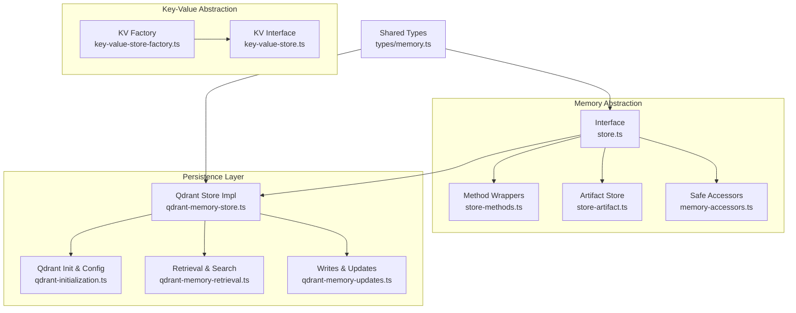

**Diagram sources**
- [store.ts](file://src/services/memory/store.ts)
- [store-methods.ts](file://src/services/memory/store-methods.ts)
- [store-artifact.ts](file://src/services/memory/store-artifact.ts)
- [memory-accessors.ts](file://src/services/memory/memory-accessors.ts)
- [qdrant-memory-store.ts](file://src/services/qdrant/memory-store.ts)
- [qdrant-initialization.ts](file://src/services/qdrant/initialization.ts)
- [qdrant-memory-retrieval.ts](file://src/services/qdrant/memory-retrieval.ts)
- [qdrant-memory-updates.ts](file://src/services/qdrant/memory-updates.ts)
- [key-value-store-factory.ts](file://src/services/key-value-store-factory.ts)
- [key-value-store.ts](file://src/services/key-value-store.ts)
- [types/memory.ts](file://src/types/memory.ts)

**Section sources**
- [store.ts](file://src/services/memory/store.ts)
- [store-methods.ts](file://src/services/memory/store-methods.ts)
- [store-artifact.ts](file://src/services/memory/store-artifact.ts)
- [memory-accessors.ts](file://src/services/memory/memory-accessors.ts)
- [qdrant-memory-store.ts](file://src/services/qdrant/memory-store.ts)
- [qdrant-initialization.ts](file://src/services/qdrant/initialization.ts)
- [qdrant-memory-retrieval.ts](file://src/services/qdrant/memory-retrieval.ts)
- [qdrant-memory-updates.ts](file://src/services/qdrant/memory-updates.ts)
- [key-value-store-factory.ts](file://src/services/key-value-store-factory.ts)
- [key-value-store.ts](file://src/services/key-value-store.ts)
- [types/memory.ts](file://src/types/memory.ts)

## Core Components
- Memory store interface: Defines the contract for create, read, update, delete, search, and batch operations, along with lifecycle methods such as initialization and shutdown.
- Method wrappers: Provide consistent error handling, validation, and optional instrumentation around core operations.
- Artifact store: Encapsulates protocol artifact-specific logic (e.g., versioning, content normalization).
- Safe accessors: Offer typed getters and helpers to prevent accidental mutation and ensure consistent shape of returned data.
- Qdrant-backed store: Implements the interface using Qdrant for vector similarity search and persistent storage.
- Key-value store abstraction: Provides a simple key-value API used by higher layers for caching or auxiliary state; created via a factory.

**Section sources**
- [store.ts](file://src/services/memory/store.ts)
- [store-methods.ts](file://src/services/memory/store-methods.ts)
- [store-artifact.ts](file://src/services/memory/store-artifact.ts)
- [memory-accessors.ts](file://src/services/memory/memory-accessors.ts)
- [qdrant-memory-store.ts](file://src/services/qdrant/memory-store.ts)
- [key-value-store-factory.ts](file://src/services/key-value-store-factory.ts)
- [key-value-store.ts](file://src/services/key-value-store.ts)

## Architecture Overview
The system separates concerns across three layers:
- Interface and composition layer: The memory store interface and its composition with method wrappers, artifact store, and accessors.
- Persistence layer: Concrete backend(s), currently Qdrant, encapsulating all IO and indexing details.
- Auxiliary services: Key-value store for cache/state and shared types for contracts.

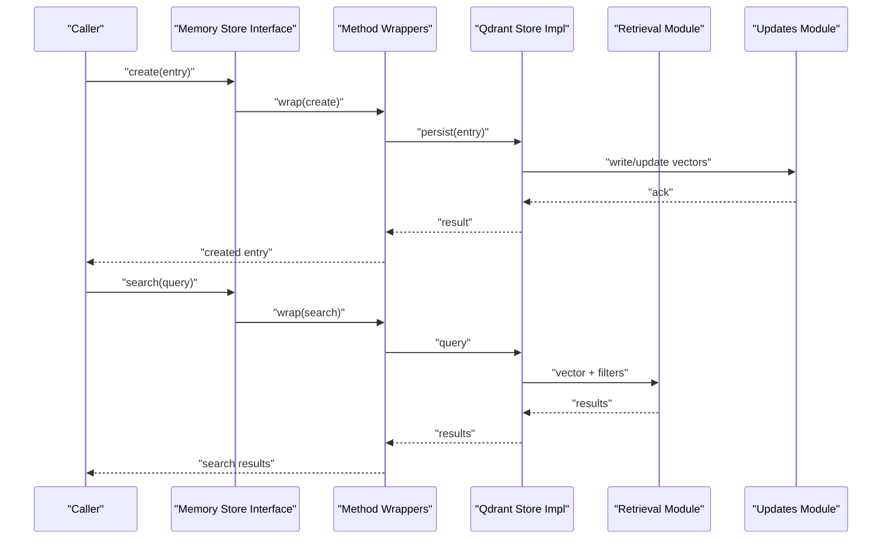

**Diagram sources**
- [store.ts](file://src/services/memory/store.ts)
- [store-methods.ts](file://src/services/memory/store-methods.ts)
- [qdrant-memory-store.ts](file://src/services/qdrant/memory-store.ts)
- [qdrant-memory-retrieval.ts](file://src/services/qdrant/memory-retrieval.ts)
- [qdrant-memory-updates.ts](file://src/services/qdrant/memory-updates.ts)

## Detailed Component Analysis

### Memory Store Interface and Composition
- Responsibilities:
  - Define the public API for memory operations.
  - Compose method wrappers, artifact store, and accessors.
  - Expose lifecycle hooks for initialization and teardown.
- Design patterns:
  - Strategy pattern for pluggable backends.
  - Decorator-like wrapping for cross-cutting concerns (validation, metrics, retries).

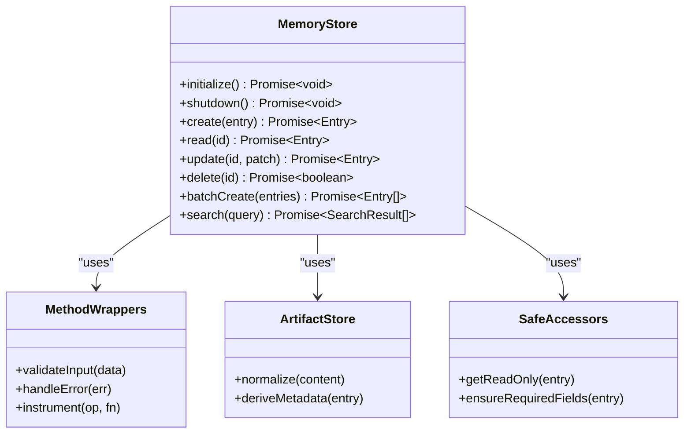

**Diagram sources**
- [store.ts](file://src/services/memory/store.ts)
- [store-methods.ts](file://src/services/memory/store-methods.ts)
- [store-artifact.ts](file://src/services/memory/store-artifact.ts)
- [memory-accessors.ts](file://src/services/memory/memory-accessors.ts)

**Section sources**
- [store.ts](file://src/services/memory/store.ts)
- [store-methods.ts](file://src/services/memory/store-methods.ts)
- [store-artifact.ts](file://src/services/memory/store-artifact.ts)
- [memory-accessors.ts](file://src/services/memory/memory-accessors.ts)

### Data Persistence Layer (Qdrant Backend)
- Responsibilities:
  - Implement the memory store interface against Qdrant.
  - Manage collection setup, schema, and index configuration.
  - Coordinate retrieval and updates.
- Connection management:
  - Centralized client initialization and health checks.
  - Reconnection and retry policies.
- Lifecycle hooks:
  - On startup: ensure collections exist, verify indexes.
  - On shutdown: close connections gracefully.

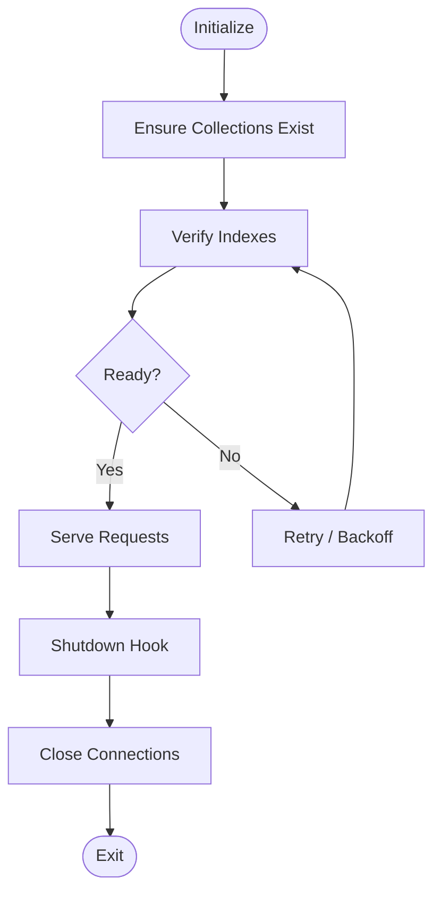

**Diagram sources**
- [qdrant-initialization.ts](file://src/services/qdrant/initialization.ts)
- [qdrant-memory-store.ts](file://src/services/qdrant/memory-store.ts)

**Section sources**
- [qdrant-memory-store.ts](file://src/services/qdrant/memory-store.ts)
- [qdrant-initialization.ts](file://src/services/qdrant/initialization.ts)

### Retrieval and Search
- Responsibilities:
  - Translate queries into vector and filter expressions.
  - Apply tenant/space scoping and metadata filters.
  - Return normalized results aligned with the interface.
- Performance considerations:
  - Batched reads where applicable.
  - Efficient filtering and pagination.

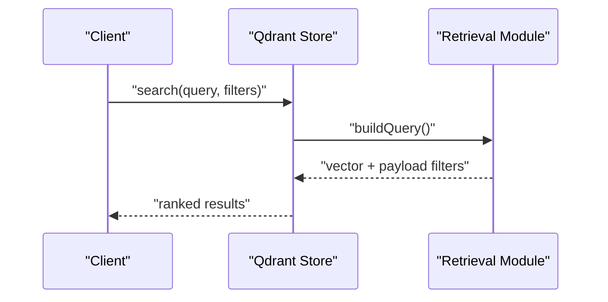

**Diagram sources**
- [qdrant-memory-store.ts](file://src/services/qdrant/memory-store.ts)
- [qdrant-memory-retrieval.ts](file://src/services/qdrant/memory-retrieval.ts)

**Section sources**
- [qdrant-memory-retrieval.ts](file://src/services/qdrant/memory-retrieval.ts)
- [qdrant-memory-store.ts](file://src/services/qdrant/memory-store.ts)

### Writes and Updates
- Responsibilities:
  - Create, update, and delete entries.
  - Maintain vector embeddings and metadata indices.
  - Enforce idempotency and conflict resolution strategies.
- Transaction handling:
  - Use upserts and conditional writes to maintain consistency.
  - Group related writes when supported by the backend.

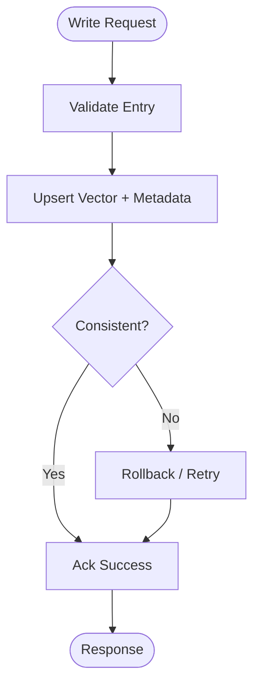

**Diagram sources**
- [qdrant-memory-updates.ts](file://src/services/qdrant/memory-updates.ts)
- [qdrant-memory-store.ts](file://src/services/qdrant/memory-store.ts)

**Section sources**
- [qdrant-memory-updates.ts](file://src/services/qdrant/memory-updates.ts)
- [qdrant-memory-store.ts](file://src/services/qdrant/memory-store.ts)

### Key-Value Store Abstraction and Factory
- Responsibilities:
  - Provide a simple key-value API for caches or auxiliary state.
  - Abstract over underlying implementations (in-memory, Redis, etc.).
- Factory pattern:
  - Creates appropriate KV store based on configuration.
  - Ensures consistent initialization and lifecycle management.

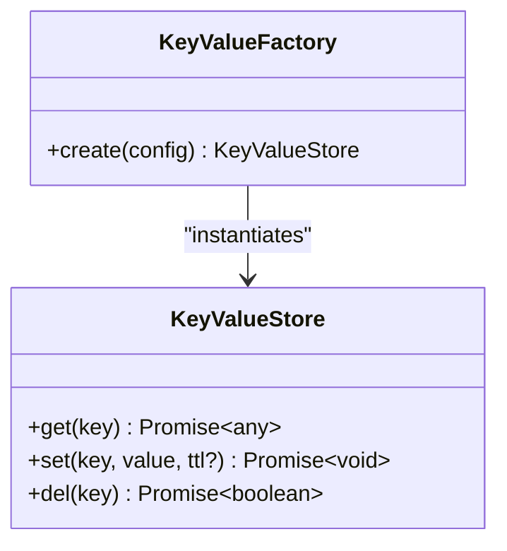

**Diagram sources**
- [key-value-store.ts](file://src/services/key-value-store.ts)
- [key-value-store-factory.ts](file://src/services/key-value-store-factory.ts)

**Section sources**
- [key-value-store.ts](file://src/services/key-value-store.ts)
- [key-value-store-factory.ts](file://src/services/key-value-store-factory.ts)

### Memory Entry Structure and Metadata
- Entry fields:
  - Unique identifier, content/artifact reference, versioning info.
  - Relationship mappings linking to other entities (e.g., protocols, spaces).
  - Rich metadata for filtering and ranking.
- Normalization:
  - Content sanitization and canonicalization.
  - Derivation of computed metadata (e.g., hashes, summaries).

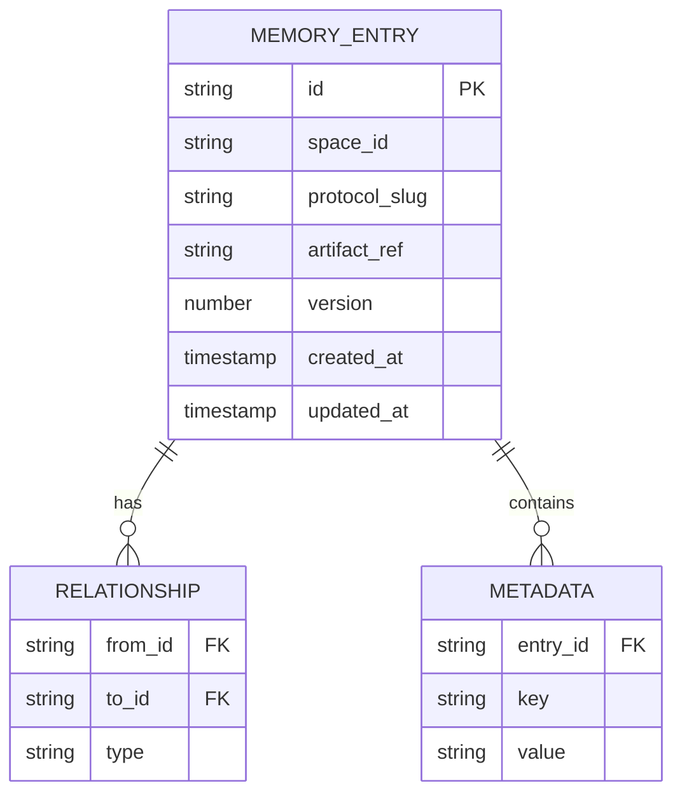

**Diagram sources**
- [types/memory.ts](file://src/types/memory.ts)
- [store-artifact.ts](file://src/services/memory/store-artifact.ts)

**Section sources**
- [types/memory.ts](file://src/types/memory.ts)
- [store-artifact.ts](file://src/services/memory/store-artifact.ts)

### Accessor Patterns for Safe Data Access
- Read-only views:
  - Prevent accidental mutation of returned objects.
- Validation helpers:
  - Ensure required fields are present before persistence.
- Transformation utilities:
  - Normalize payloads and responses consistently.

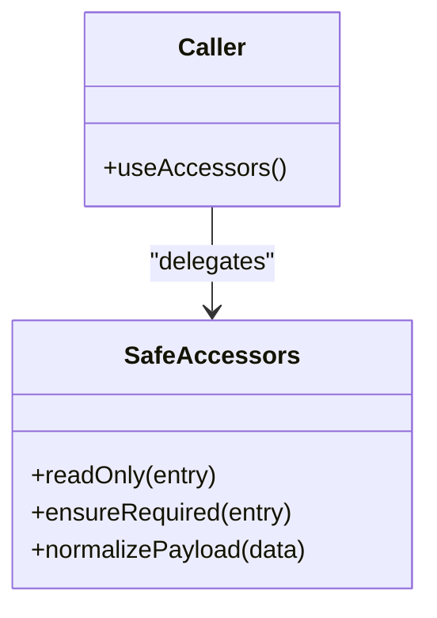

**Diagram sources**
- [memory-accessors.ts](file://src/services/memory/memory-accessors.ts)

**Section sources**
- [memory-accessors.ts](file://src/services/memory/memory-accessors.ts)

### Factory Pattern for Store Implementations
- Purpose:
  - Select and configure the appropriate memory store backend at runtime.
- Behavior:
  - Reads configuration (e.g., Qdrant endpoint, TLS settings).
  - Initializes backend-specific resources.
  - Returns a fully wired store instance implementing the interface.

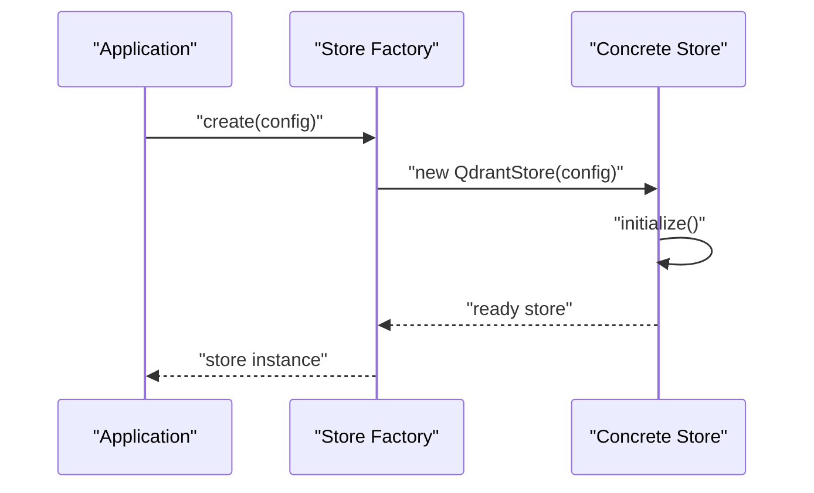

**Diagram sources**
- [qdrant-memory-store.ts](file://src/services/qdrant/memory-store.ts)
- [qdrant-initialization.ts](file://src/services/qdrant/initialization.ts)

**Section sources**
- [qdrant-memory-store.ts](file://src/services/qdrant/memory-store.ts)
- [qdrant-initialization.ts](file://src/services/qdrant/initialization.ts)

## Dependency Analysis
- Coupling:
  - The interface layer depends only on shared types and abstracts away backend specifics.
  - The Qdrant backend depends on retrieval and updates modules for focused responsibilities.
- Cohesion:
  - Each module has a single responsibility (init, retrieval, updates, accessors).
- External dependencies:
  - Qdrant client for vector search and persistence.
  - Optional key-value store for caching.

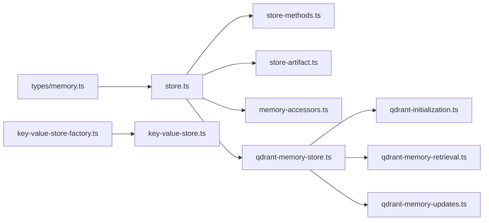

**Diagram sources**
- [types/memory.ts](file://src/types/memory.ts)
- [store.ts](file://src/services/memory/store.ts)
- [store-methods.ts](file://src/services/memory/store-methods.ts)
- [store-artifact.ts](file://src/services/memory/store-artifact.ts)
- [memory-accessors.ts](file://src/services/memory/memory-accessors.ts)
- [qdrant-memory-store.ts](file://src/services/qdrant/memory-store.ts)
- [qdrant-initialization.ts](file://src/services/qdrant/initialization.ts)
- [qdrant-memory-retrieval.ts](file://src/services/qdrant/memory-retrieval.ts)
- [qdrant-memory-updates.ts](file://src/services/qdrant/memory-updates.ts)
- [key-value-store-factory.ts](file://src/services/key-value-store-factory.ts)
- [key-value-store.ts](file://src/services/key-value-store.ts)

**Section sources**
- [store.ts](file://src/services/memory/store.ts)
- [qdrant-memory-store.ts](file://src/services/qdrant/memory-store.ts)
- [key-value-store-factory.ts](file://src/services/key-value-store-factory.ts)

## Performance Considerations
- Vector search efficiency:
  - Prefer filtered searches to reduce payload scanning.
  - Use pagination and limit result sets.
- Write throughput:
  - Batch upserts where possible.
  - Avoid redundant recomputation of embeddings.
- Caching:
  - Leverage the key-value store for hot paths and frequently accessed metadata.
- Resource management:
  - Initialize connections once and reuse them.
  - Graceful shutdown to avoid resource leaks.

[No sources needed since this section provides general guidance]

## Troubleshooting Guide
- Initialization failures:
  - Verify Qdrant connectivity and collection existence.
  - Inspect initialization logs for index mismatches.
- Search anomalies:
  - Confirm embedding dimensions and index configurations.
  - Validate metadata filters and tenant scoping.
- Write errors:
  - Check idempotency keys and conflict resolution behavior.
  - Review retry/backoff policies and circuit breakers.
- Accessor issues:
  - Ensure required fields are present before persistence.
  - Use read-only views to detect unintended mutations.

**Section sources**
- [qdrant-initialization.ts](file://src/services/qdrant/initialization.ts)
- [qdrant-memory-retrieval.ts](file://src/services/qdrant/memory-retrieval.ts)
- [qdrant-memory-updates.ts](file://src/services/qdrant/memory-updates.ts)
- [memory-accessors.ts](file://src/services/memory/memory-accessors.ts)

## Conclusion
The memory store architecture cleanly separates interface, composition, and persistence concerns. The Qdrant-backed implementation fulfills the interface while encapsulating complex vector search and persistence details. Method wrappers, artifact normalization, and safe accessors provide robustness and consistency. The factory pattern enables flexible backend selection, and the key-value abstraction supports auxiliary caching needs. Together, these patterns deliver a scalable, maintainable, and testable memory subsystem.