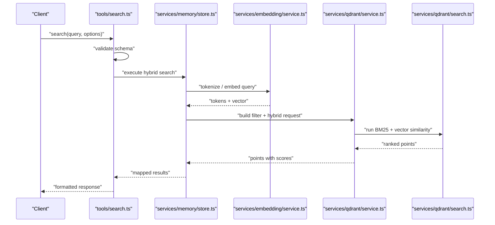
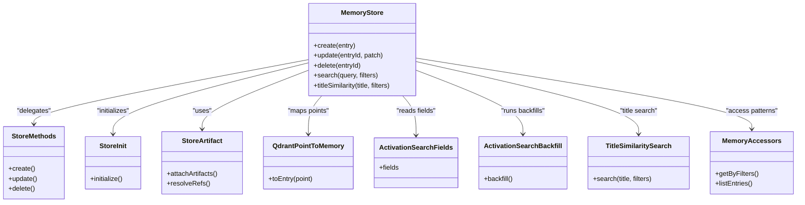
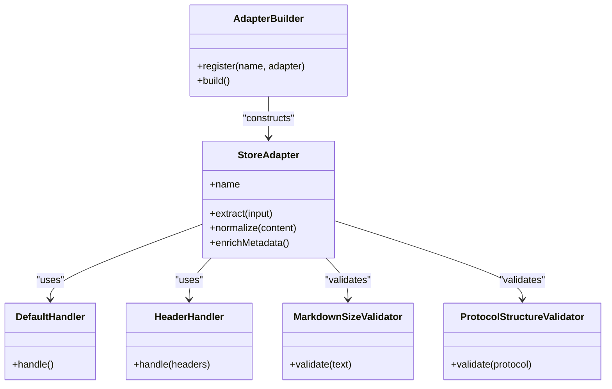
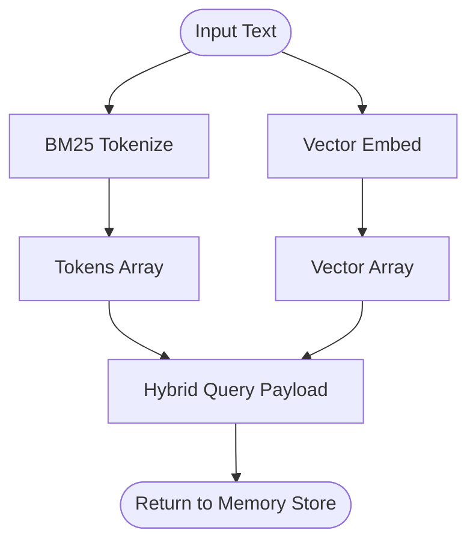
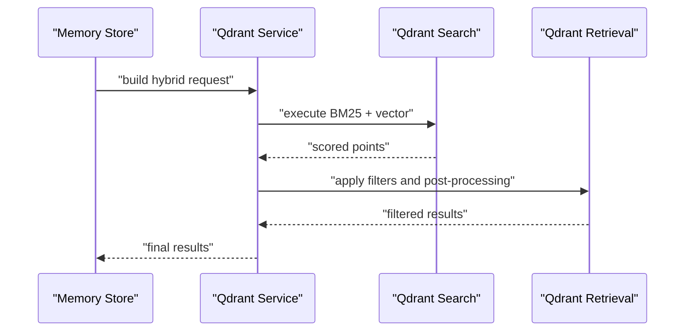
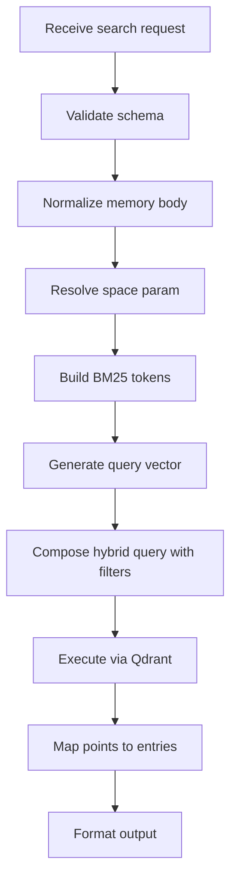
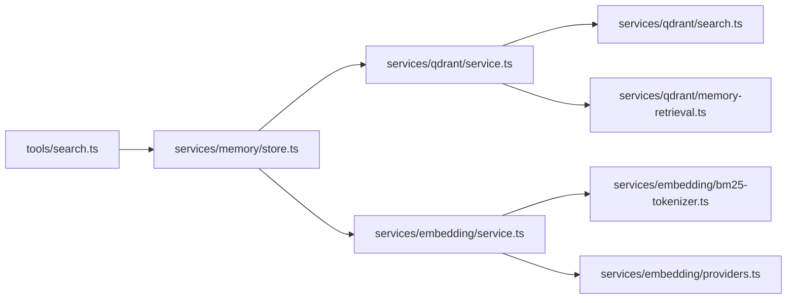

# Memory and Semantic Search System

<cite>
**Referenced Files in This Document**
- [src/services/memory/store.ts](file://src/services/memory/store.ts)
- [src/services/memory/store-methods.ts](file://src/services/memory/store-methods.ts)
- [src/services/memory/store-init.ts](file://src/services/memory/store-init.ts)
- [src/services/memory/store-artifact.ts](file://src/services/memory/store-artifact.ts)
- [src/services/memory/store-adapter.ts](file://src/services/memory/store-adapter.ts)
- [src/services/memory/adapter-builder.ts](file://src/services/memory/adapter-builder.ts)
- [src/services/memory/qdrant-point-to-memory.ts](file://src/services/memory/qdrant-point-to-memory.ts)
- [src/services/memory/memory-accessors.ts](file://src/services/memory/memory-accessors.ts)
- [src/services/memory/activation-search-fields.ts](file://src/services/memory/activation-search-fields.ts)
- [src/services/memory/activation-search-backfill.ts](file://src/services/memory/activation-search-backfill.ts)
- [src/services/memory/store-title-similarity-search.ts](file://src/services/memory/store-title-similarity-search.ts)
- [src/services/memory/store-adapter-helpers.ts](file://src/services/memory/store-adapter-helpers.ts)
- [src/services/memory/store-adapter-default-handler.ts](file://src/services/memory/store-adapter-default-handler.ts)
- [src/services/memory/store-adapter-header-handler.ts](file://src/services/memory/store-adapter-header-handler.ts)
- [src/services/memory/validate-adapter-markdown-size.ts](file://src/services/memory/validate-adapter-markdown-size.ts)
- [src/services/memory/validate-protocol-structure.ts](file://src/services/memory/validate-protocol-structure.ts)
- [src/services/memory/artifact-metadata.ts](file://src/services/memory/artifact-metadata.ts)
- [src/services/qdrant/service.ts](file://src/services/qdrant/service.ts)
- [src/services/qdrant/connection.ts](file://src/services/qdrant/connection.ts)
- [src/services/qdrant/index.ts](file://src/services/qdrant/index.ts)
- [src/services/qdrant/search.ts](file://src/services/qdrant/search.ts)
- [src/services/qdrant/memory-store.ts](file://src/services/qdrant/memory-store.ts)
- [src/services/qdrant/memory-retrieval.ts](file://src/services/qdrant/memory-retrieval.ts)
- [src/services/qdrant/memory-updates.ts](file://src/services/qdrant/memory-updates.ts)
- [src/services/qdrant/protocol.ts](file://src/services/qdrant/protocol.ts)
- [src/services/qdrant/types.ts](file://src/services/qdrant/types.ts)
- [src/services/qdrant/utils.ts](file://src/services/qdrant/utils.ts)
- [src/services/qdrant/resources.ts](file://src/services/qdrant/resources.ts)
- [src/services/qdrant/snapshots.ts](file://src/services/qdrant/snapshots.ts)
- [src/services/qdrant/quality.ts](file://src/services/qdrant/quality.ts)
- [src/services/qdrant/reward-propagation.ts](file://src/services/qdrant/reward-propagation.ts)
- [src/services/embedding/service.ts](file://src/services/embedding/service.ts)
- [src/services/embedding/config.ts](file://src/services/embedding/config.ts)
- [src/services/embedding/providers.ts](file://src/services/embedding/providers.ts)
- [src/services/embedding/bm25-tokenizer.ts](file://src/services/embedding/bm25-tokenizer.ts)
- [src/services/embedding/audit.ts](file://src/services/embedding/audit.ts)
- [src/services/embedding/health.ts](file://src/services/embedding/health.ts)
- [src/services/embedding/types.ts](file://src/services/embedding/types.ts)
- [src/tools/search.ts](file://src/tools/search.ts)
- [src/tools/search_schema.ts](file://src/tools/search_schema.ts)
- [src/tools/search_output.ts](file://src/tools/search_output.ts)
- [src/constants/builtin-search-meta.ts](file://src/constants/builtin-search-meta.ts)
- [src/utils/qdrant-query-utils.ts](file://src/utils/qdrant-query-utils.ts)
- [src/utils/qdrant-vector-types.ts](file://src/utils/qdrant-vector-types.ts)
- [src/utils/qdrant-vector-management.ts](file://src/utils/qdrant-vector-management.ts)
- [src/utils/qdrant-collection-utils.ts](file://src/utils/qdrant-collection-utils.ts)
- [src/utils/space-filter.ts](file://src/utils/space-filter.ts)
- [src/utils/resolve-space-param.ts](file://src/utils/resolve-space-param.ts)
- [src/utils/memory-store-utils.ts](file://src/utils/memory-store-utils.ts)
- [src/utils/memory-body.ts](file://src/utils/memory-body.ts)
- [src/services/redis-cache.ts](file://src/services/redis-cache.ts)
- [src/services/metrics/memory-metrics.ts](file://src/services/metrics/memory-metrics.ts)
- [src/services/metrics/qdrant-metrics.ts](file://src/services/metrics/qdrant-metrics.ts)
- [src/services/metrics/embedding-metrics.ts](file://src/services/metrics/embedding-metrics.ts)
</cite>

## Table of Contents
1. [Introduction](#introduction)
2. [Project Structure](#project-structure)
3. [Core Components](#core-components)
4. [Architecture Overview](#architecture-overview)
5. [Detailed Component Analysis](#detailed-component-analysis)
6. [Dependency Analysis](#dependency-analysis)
7. [Performance Considerations](#performance-considerations)
8. [Troubleshooting Guide](#troubleshooting-guide)
9. [Conclusion](#conclusion)
10. [Appendices](#appendices)

## Introduction
This document explains the memory and semantic search system, focusing on:
- Memory store architecture and data model
- Vector embedding generation and provider abstraction
- Semantic search with hybrid retrieval (BM25 + vector similarity)
- Adapter system for diverse data sources and content processing pipelines
- Indexing strategies, query formulation, ranking, filtering by spaces and metadata
- Caching, real-time updates, and scalability considerations
- Practical examples for creating memory entries, running searches, and implementing custom adapters

The system integrates a Qdrant-backed vector index with BM25 tokenization to deliver fast, relevant results across heterogeneous content types via pluggable adapters.

## Project Structure
High-level organization relevant to memory and search:
- services/memory: High-level memory operations, adapter orchestration, artifact handling, and search helpers
- services/qdrant: Qdrant client, indexing, retrieval, schema, and utilities
- services/embedding: Embedding providers, BM25 tokenizer, configuration, health, and metrics
- tools/search: Tool entry points for search queries and output formatting
- utils: Shared utilities for Qdrant queries, vectors, spaces, and memory body normalization
- constants: Built-in search metadata fields
- services/metrics: Observability for memory, Qdrant, and embedding subsystems

```mermaid
graph TB
subgraph "Memory Layer"
MStore["store.ts"]
MMethods["store-methods.ts"]
MInit["store-init.ts"]
MAdapter["store-adapter.ts"]
MBuilder["adapter-builder.ts"]
MArtifact["store-artifact.ts"]
MHelpers["store-adapter-helpers.ts"]
MDefaultHandler["store-adapter-default-handler.ts"]
MHeaderHandler["store-adapter-header-handler.ts"]
MTitleSim["store-title-similarity-search.ts"]
MBackfill["activation-search-backfill.ts"]
MFields["activation-search-fields.ts"]
MPointConv["qdrant-point-to-memory.ts"]
MAccess["memory-accessors.ts"]
end
subgraph "Qdrant Layer"
QSvc["service.ts"]
QConn["connection.ts"]
QIdx["index.ts"]
QSearch["search.ts"]
QMemStore["memory-store.ts"]
QRetrieval["memory-retrieval.ts"]
QUpdates["memory-updates.ts"]
QProto["protocol.ts"]
QTypes["types.ts"]
QUtils["utils.ts"]
QRes["resources.ts"]
QSnap["snapshots.ts"]
QQual["quality.ts"]
QReward["reward-propagation.ts"]
end
subgraph "Embedding Layer"
EService["service.ts"]
EConfig["config.ts"]
EProviders["providers.ts"]
EBM25["bm25-tokenizer.ts"]
EHealth["health.ts"]
EAudit["audit.ts"]
ETypes["types.ts"]
end
subgraph "Tools & Utils"
TSearch["tools/search.ts"]
TSchema["tools/search_schema.ts"]
TOutput["tools/search_output.ts"]
UQuery["utils/qdrant-query-utils.ts"]
UVectors["utils/qdrant-vector-types.ts"]
UVecMgmt["utils/qdrant-vector-management.ts"]
UCollections["utils/qdrant-collection-utils.ts"]
USpaceFilter["utils/space-filter.ts"]
USpaceResolve["utils/resolve-space-param.ts"]
UMemBody["utils/memory-body.ts"]
UMemUtils["utils/memory-store-utils.ts"]
CBuiltin["constants/builtin-search-meta.ts"]
end
MStore --> MMethods
MStore --> MInit
MStore --> MAdapter
MAdapter --> MBuilder
MAdapter --> MHelpers
MAdapter --> MDefaultHandler
MAdapter --> MHeaderHandler
MStore --> MArtifact
MStore --> MPointConv
MStore --> MAccess
MStore --> MTitleSim
MStore --> MBackfill
MStore --> MFields
MStore --> QSvc
QSvc --> QConn
QSvc --> QIdx
QSvc --> QSearch
QSvc --> QMemStore
QSvc --> QRetrieval
QSvc --> QUpdates
QSvc --> QProto
QSvc --> QTypes
QSvc --> QUtils
QSvc --> QRes
QSvc --> QSnap
QSvc --> QQual
QSvc --> QReward
MStore --> EService
EService --> EConfig
EService --> EProviders
EService --> EBM25
EService --> EHealth
EService --> EAudit
EService --> ETypes
TSearch --> MStore
TSearch --> TSchema
TSearch --> TOutput
TSearch --> UQuery
TSearch --> USpaceFilter
TSearch --> USpaceResolve
TSearch --> CBuiltin
TSearch --> UMemBody
TSearch --> UMemUtils
```

**Diagram sources**
- [src/services/memory/store.ts](file://src/services/memory/store.ts)
- [src/services/qdrant/service.ts](file://src/services/qdrant/service.ts)
- [src/services/embedding/service.ts](file://src/services/embedding/service.ts)
- [src/tools/search.ts](file://src/tools/search.ts)

**Section sources**
- [src/services/memory/store.ts](file://src/services/memory/store.ts)
- [src/services/qdrant/service.ts](file://src/services/qdrant/service.ts)
- [src/services/embedding/service.ts](file://src/services/embedding/service.ts)
- [src/tools/search.ts](file://src/tools/search.ts)

## Core Components
- Memory Store: Orchestrates creation, update, deletion, and search over memory entries; coordinates adapters, embeddings, and Qdrant persistence.
- Qdrant Integration: Manages collections, points, filters, and hybrid search execution.
- Embedding Service: Abstracts vector providers and BM25 tokenization; exposes health and audit hooks.
- Tools: Expose search capabilities through typed schemas and standardized outputs.
- Utilities: Provide shared logic for space scoping, query building, vector management, and memory body normalization.

Key responsibilities:
- Normalize inputs into canonical memory bodies
- Generate text chunks and compute embeddings
- Index points with rich metadata and vectors
- Execute hybrid queries combining BM25 and vector similarity
- Filter by spaces and metadata
- Return ranked results with consistent output shape

**Section sources**
- [src/services/memory/store.ts](file://src/services/memory/store.ts)
- [src/services/qdrant/service.ts](file://src/services/qdrant/service.ts)
- [src/services/embedding/service.ts](file://src/services/embedding/service.ts)
- [src/tools/search.ts](file://src/tools/search.ts)

## Architecture Overview
End-to-end flow for search:
- Client invokes search tool with query, optional filters, and space scope
- Tool validates input schema and normalizes parameters
- Memory store composes a hybrid query using BM25 tokens and vector similarity
- Qdrant executes combined scoring and returns top-k results
- Results are mapped back to memory entries and returned

**Diagram sources**
- [src/tools/search.ts](file://src/tools/search.ts)
- [src/services/memory/store.ts](file://src/services/memory/store.ts)
- [src/services/embedding/service.ts](file://src/services/embedding/service.ts)
- [src/services/qdrant/service.ts](file://src/services/qdrant/service.ts)
- [src/services/qdrant/search.ts](file://src/services/qdrant/search.ts)

## Detailed Component Analysis

### Memory Store Architecture
Responsibilities:
- Entry lifecycle: create, update, delete, list
- Adapter integration: resolve and invoke adapters to extract content and metadata
- Embedding coordination: chunking and vector generation
- Hybrid search composition: combine BM25 and vector similarity
- Space and metadata filtering: enforce tenant/space scoping and additional filters
- Result mapping: convert Qdrant points to domain objects

Key modules:
- store.ts: Central orchestrator
- store-methods.ts: CRUD operations
- store-init.ts: Initialization and bootstrapping
- store-artifact.ts: Artifact handling and references
- qdrant-point-to-memory.ts: Point-to-entry conversion
- activation-search-fields.ts: Fields used in activation search
- activation-search-backfill.ts: Backfill routines for activation search
- store-title-similarity-search.ts: Title-based similarity helper
- memory-accessors.ts: Access patterns and helpers

**Diagram sources**
- [src/services/memory/store.ts](file://src/services/memory/store.ts)
- [src/services/memory/store-methods.ts](file://src/services/memory/store-methods.ts)
- [src/services/memory/store-init.ts](file://src/services/memory/store-init.ts)
- [src/services/memory/store-artifact.ts](file://src/services/memory/store-artifact.ts)
- [src/services/memory/qdrant-point-to-memory.ts](file://src/services/memory/qdrant-point-to-memory.ts)
- [src/services/memory/activation-search-fields.ts](file://src/services/memory/activation-search-fields.ts)
- [src/services/memory/activation-search-backfill.ts](file://src/services/memory/activation-search-backfill.ts)
- [src/services/memory/store-title-similarity-search.ts](file://src/services/memory/store-title-similarity-search.ts)
- [src/services/memory/memory-accessors.ts](file://src/services/memory/memory-accessors.ts)

**Section sources**
- [src/services/memory/store.ts](file://src/services/memory/store.ts)
- [src/services/memory/store-methods.ts](file://src/services/memory/store-methods.ts)
- [src/services/memory/store-init.ts](file://src/services/memory/store-init.ts)
- [src/services/memory/store-artifact.ts](file://src/services/memory/store-artifact.ts)
- [src/services/memory/qdrant-point-to-memory.ts](file://src/services/memory/qdrant-point-to-memory.ts)
- [src/services/memory/activation-search-fields.ts](file://src/services/memory/activation-search-fields.ts)
- [src/services/memory/activation-search-backfill.ts](file://src/services/memory/activation-search-backfill.ts)
- [src/services/memory/store-title-similarity-search.ts](file://src/services/memory/store-title-similarity-search.ts)
- [src/services/memory/memory-accessors.ts](file://src/services/memory/memory-accessors.ts)

### Adapter System
Purpose:
- Pluggable ingestion from multiple data sources (e.g., markdown, MCP, shell, comments, user input)
- Content extraction, normalization, and metadata enrichment
- Size validation and protocol structure checks

Core files:
- store-adapter.ts: Adapter contract and interface
- adapter-builder.ts: Builder to construct adapters with handlers
- store-adapter-helpers.ts: Shared adapter utilities
- store-adapter-default-handler.ts: Default handler behavior
- store-adapter-header-handler.ts: Header-specific handling
- validate-adapter-markdown-size.ts: Enforce size limits
- validate-protocol-structure.ts: Validate protocol structures

**Diagram sources**
- [src/services/memory/store-adapter.ts](file://src/services/memory/store-adapter.ts)
- [src/services/memory/adapter-builder.ts](file://src/services/memory/adapter-builder.ts)
- [src/services/memory/store-adapter-helpers.ts](file://src/services/memory/store-adapter-helpers.ts)
- [src/services/memory/store-adapter-default-handler.ts](file://src/services/memory/store-adapter-default-handler.ts)
- [src/services/memory/store-adapter-header-handler.ts](file://src/services/memory/store-adapter-header-handler.ts)
- [src/services/memory/validate-adapter-markdown-size.ts](file://src/services/memory/validate-adapter-markdown-size.ts)
- [src/services/memory/validate-protocol-structure.ts](file://src/services/memory/validate-protocol-structure.ts)

**Section sources**
- [src/services/memory/store-adapter.ts](file://src/services/memory/store-adapter.ts)
- [src/services/memory/adapter-builder.ts](file://src/services/memory/adapter-builder.ts)
- [src/services/memory/store-adapter-helpers.ts](file://src/services/memory/store-adapter-helpers.ts)
- [src/services/memory/store-adapter-default-handler.ts](file://src/services/memory/store-adapter-default-handler.ts)
- [src/services/memory/store-adapter-header-handler.ts](file://src/services/memory/store-adapter-header-handler.ts)
- [src/services/memory/validate-adapter-markdown-size.ts](file://src/services/memory/validate-adapter-markdown-size.ts)
- [src/services/memory/validate-protocol-structure.ts](file://src/services/memory/validate-protocol-structure.ts)

### Embedding Generation and Providers
Responsibilities:
- Provider abstraction for vector models
- BM25 tokenization for lexical matching
- Health checks and audit logging
- Configuration-driven selection of providers

Key modules:
- service.ts: Main embedding orchestration
- config.ts: Provider configuration
- providers.ts: Provider registry and selection
- bm25-tokenizer.ts: Tokenization pipeline
- health.ts: Health endpoints
- audit.ts: Audit hooks
- types.ts: Shared types

**Diagram sources**
- [src/services/embedding/service.ts](file://src/services/embedding/service.ts)
- [src/services/embedding/config.ts](file://src/services/embedding/config.ts)
- [src/services/embedding/providers.ts](file://src/services/embedding/providers.ts)
- [src/services/embedding/bm25-tokenizer.ts](file://src/services/embedding/bm25-tokenizer.ts)
- [src/services/embedding/health.ts](file://src/services/embedding/health.ts)
- [src/services/embedding/audit.ts](file://src/services/embedding/audit.ts)
- [src/services/embedding/types.ts](file://src/services/embedding/types.ts)

**Section sources**
- [src/services/embedding/service.ts](file://src/services/embedding/service.ts)
- [src/services/embedding/config.ts](file://src/services/embedding/config.ts)
- [src/services/embedding/providers.ts](file://src/services/embedding/providers.ts)
- [src/services/embedding/bm25-tokenizer.ts](file://src/services/embedding/bm25-tokenizer.ts)
- [src/services/embedding/health.ts](file://src/services/embedding/health.ts)
- [src/services/embedding/audit.ts](file://src/services/embedding/audit.ts)
- [src/services/embedding/types.ts](file://src/services/embedding/types.ts)

### Qdrant Integration and Hybrid Search
Responsibilities:
- Connection management and collection setup
- Point indexing and updates
- Retrieval with filters and hybrid scoring
- Quality and reward propagation utilities
- Resource and snapshot management

Key modules:
- service.ts: Top-level Qdrant service
- connection.ts: Connection lifecycle
- index.ts: Collection initialization
- search.ts: Search execution including hybrid queries
- memory-store.ts: Memory-specific storage operations
- memory-retrieval.ts: Retrieval helpers
- memory-updates.ts: Update operations
- protocol.ts: Data protocol definitions
- types.ts: Shared types
- utils.ts: Utility functions
- resources.ts: Resource management
- snapshots.ts: Snapshot operations
- quality.ts: Quality metrics
- reward-propagation.ts: Reward propagation

**Diagram sources**
- [src/services/qdrant/service.ts](file://src/services/qdrant/service.ts)
- [src/services/qdrant/search.ts](file://src/services/qdrant/search.ts)
- [src/services/qdrant/memory-retrieval.ts](file://src/services/qdrant/memory-retrieval.ts)

**Section sources**
- [src/services/qdrant/service.ts](file://src/services/qdrant/service.ts)
- [src/services/qdrant/connection.ts](file://src/services/qdrant/connection.ts)
- [src/services/qdrant/index.ts](file://src/services/qdrant/index.ts)
- [src/services/qdrant/search.ts](file://src/services/qdrant/search.ts)
- [src/services/qdrant/memory-store.ts](file://src/services/qdrant/memory-store.ts)
- [src/services/qdrant/memory-retrieval.ts](file://src/services/qdrant/memory-retrieval.ts)
- [src/services/qdrant/memory-updates.ts](file://src/services/qdrant/memory-updates.ts)
- [src/services/qdrant/protocol.ts](file://src/services/qdrant/protocol.ts)
- [src/services/qdrant/types.ts](file://src/services/qdrant/types.ts)
- [src/services/qdrant/utils.ts](file://src/services/qdrant/utils.ts)
- [src/services/qdrant/resources.ts](file://src/services/qdrant/resources.ts)
- [src/services/qdrant/snapshots.ts](file://src/services/qdrant/snapshots.ts)
- [src/services/qdrant/quality.ts](file://src/services/qdrant/quality.ts)
- [src/services/qdrant/reward-propagation.ts](file://src/services/qdrant/reward-propagation.ts)

### Search Tool and Query Formulation
Responsibilities:
- Accept search requests with query text, filters, and options
- Validate against schema
- Normalize memory body and space parameters
- Build hybrid queries and return formatted results

Key modules:
- tools/search.ts: Search entry point
- tools/search_schema.ts: Input schema validation
- tools/search_output.ts: Output formatting
- constants/builtin-search-meta.ts: Built-in metadata fields
- utils/qdrant-query-utils.ts: Query construction helpers
- utils/space-filter.ts: Space scoping filters
- utils/resolve-space-param.ts: Resolve space parameter
- utils/memory-body.ts: Normalize memory body
- utils/memory-store-utils.ts: General memory utilities

**Diagram sources**
- [src/tools/search.ts](file://src/tools/search.ts)
- [src/tools/search_schema.ts](file://src/tools/search_schema.ts)
- [src/tools/search_output.ts](file://src/tools/search_output.ts)
- [src/constants/builtin-search-meta.ts](file://src/constants/builtin-search-meta.ts)
- [src/utils/qdrant-query-utils.ts](file://src/utils/qdrant-query-utils.ts)
- [src/utils/space-filter.ts](file://src/utils/space-filter.ts)
- [src/utils/resolve-space-param.ts](file://src/utils/resolve-space-param.ts)
- [src/utils/memory-body.ts](file://src/utils/memory-body.ts)
- [src/utils/memory-store-utils.ts](file://src/utils/memory-store-utils.ts)

**Section sources**
- [src/tools/search.ts](file://src/tools/search.ts)
- [src/tools/search_schema.ts](file://src/tools/search_schema.ts)
- [src/tools/search_output.ts](file://src/tools/search_output.ts)
- [src/constants/builtin-search-meta.ts](file://src/constants/builtin-search-meta.ts)
- [src/utils/qdrant-query-utils.ts](file://src/utils/qdrant-query-utils.ts)
- [src/utils/space-filter.ts](file://src/utils/space-filter.ts)
- [src/utils/resolve-space-param.ts](file://src/utils/resolve-space-param.ts)
- [src/utils/memory-body.ts](file://src/utils/memory-body.ts)
- [src/utils/memory-store-utils.ts](file://src/utils/memory-store-utils.ts)

### Indexing Strategies and Content Processing Pipelines
- Chunking: Split large documents into manageable segments for embedding and BM25 indexing
- Metadata enrichment: Attach space, type, and built-in fields for filtering
- Validation: Enforce size limits and protocol structure before indexing
- Deduplication: Avoid redundant points for identical or near-duplicate content
- Batch operations: Use bulk inserts and updates for performance

Relevant modules:
- store-artifact.ts: Artifact attachment and reference resolution
- validate-adapter-markdown-size.ts: Size enforcement
- validate-protocol-structure.ts: Structure validation
- qdrant-memory-store.ts: Bulk operations and upserts
- qdrant-memory-updates.ts: Incremental updates

**Section sources**
- [src/services/memory/store-artifact.ts](file://src/services/memory/store-artifact.ts)
- [src/services/memory/validate-adapter-markdown-size.ts](file://src/services/memory/validate-adapter-markdown-size.ts)
- [src/services/memory/validate-protocol-structure.ts](file://src/services/memory/validate-protocol-structure.ts)
- [src/services/qdrant/memory-store.ts](file://src/services/qdrant/memory-store.ts)
- [src/services/qdrant/memory-updates.ts](file://src/services/qdrant/memory-updates.ts)

### Filtering by Spaces and Metadata
- Space scoping: Ensure queries respect tenant and space boundaries
- Metadata filters: Apply built-in and custom metadata constraints
- Query composition: Combine space filters with BM25 and vector filters

Key modules:
- utils/space-filter.ts: Space filter builder
- utils/resolve-space-param.ts: Parameter resolution
- constants/builtin-search-meta.ts: Built-in fields
- utils/qdrant-query-utils.ts: Filter composition

**Section sources**
- [src/utils/space-filter.ts](file://src/utils/space-filter.ts)
- [src/utils/resolve-space-param.ts](file://src/utils/resolve-space-param.ts)
- [src/constants/builtin-search-meta.ts](file://src/constants/builtin-search-meta.ts)
- [src/utils/qdrant-query-utils.ts](file://src/utils/qdrant-query-utils.ts)

### Result Ranking and Relevance
- Hybrid scoring: Combine BM25 lexical relevance with vector similarity
- Post-processing: Apply filters, normalize scores, and rank top-k
- Title similarity: Optional title-focused boosting when appropriate

Key modules:
- services/qdrant/search.ts: Hybrid scoring implementation
- services/memory/store-title-similarity-search.ts: Title similarity helper
- services/qdrant/memory-retrieval.ts: Retrieval and ranking helpers

**Section sources**
- [src/services/qdrant/search.ts](file://src/services/qdrant/search.ts)
- [src/services/memory/store-title-similarity-search.ts](file://src/services/memory/store-title-similarity-search.ts)
- [src/services/qdrant/memory-retrieval.ts](file://src/services/qdrant/memory-retrieval.ts)

### Caching Strategies and Real-Time Updates
- Redis cache: Cache frequent queries and computed embeddings where applicable
- Cache invalidation: Invalidate on updates or deletions to maintain consistency
- Real-time updates: Use incremental upserts and pub/sub signals for live changes

Key modules:
- services/redis-cache.ts: Redis caching layer
- services/qdrant/memory-updates.ts: Incremental updates
- services/metrics/memory-metrics.ts: Metrics for cache hit rates and latency

**Section sources**
- [src/services/redis-cache.ts](file://src/services/redis-cache.ts)
- [src/services/qdrant/memory-updates.ts](file://src/services/qdrant/memory-updates.ts)
- [src/services/metrics/memory-metrics.ts](file://src/services/metrics/memory-metrics.ts)

### Scalability Considerations
- Vector dimensionality: Choose embedding dimensions balancing accuracy and throughput
- Collection partitioning: Partition by space or tenant to reduce query scope
- Concurrency control: Limit concurrent embedding calls and Qdrant writes
- Monitoring: Track Qdrant and embedding metrics for capacity planning

Key modules:
- services/qdrant/collection-utils.ts: Collection management
- services/qdrant/vector-management.ts: Vector utilities
- services/qdrant/vector-types.ts: Vector type definitions
- services/metrics/qdrant-metrics.ts: Qdrant observability
- services/metrics/embedding-metrics.ts: Embedding observability

**Section sources**
- [src/utils/qdrant-collection-utils.ts](file://src/utils/qdrant-collection-utils.ts)
- [src/utils/qdrant-vector-management.ts](file://src/utils/qdrant-vector-management.ts)
- [src/utils/qdrant-vector-types.ts](file://src/utils/qdrant-vector-types.ts)
- [src/services/metrics/qdrant-metrics.ts](file://src/services/metrics/qdrant-metrics.ts)
- [src/services/metrics/embedding-metrics.ts](file://src/services/metrics/embedding-metrics.ts)

## Dependency Analysis
Component coupling and cohesion:
- Memory Store depends on Qdrant Service and Embedding Service
- Qdrant Service encapsulates all storage interactions and is cohesive around persistence
- Embedding Service abstracts providers and tokenization, decoupled from storage
- Tools depend on Memory Store and utilities for query building and formatting

**Diagram sources**
- [src/tools/search.ts](file://src/tools/search.ts)
- [src/services/memory/store.ts](file://src/services/memory/store.ts)
- [src/services/qdrant/service.ts](file://src/services/qdrant/service.ts)
- [src/services/qdrant/search.ts](file://src/services/qdrant/search.ts)
- [src/services/qdrant/memory-retrieval.ts](file://src/services/qdrant/memory-retrieval.ts)
- [src/services/embedding/service.ts](file://src/services/embedding/service.ts)
- [src/services/embedding/bm25-tokenizer.ts](file://src/services/embedding/bm25-tokenizer.ts)
- [src/services/embedding/providers.ts](file://src/services/embedding/providers.ts)

**Section sources**
- [src/tools/search.ts](file://src/tools/search.ts)
- [src/services/memory/store.ts](file://src/services/memory/store.ts)
- [src/services/qdrant/service.ts](file://src/services/qdrant/service.ts)
- [src/services/qdrant/search.ts](file://src/services/qdrant/search.ts)
- [src/services/qdrant/memory-retrieval.ts](file://src/services/qdrant/memory-retrieval.ts)
- [src/services/embedding/service.ts](file://src/services/embedding/service.ts)
- [src/services/embedding/bm25-tokenizer.ts](file://src/services/embedding/bm25-tokenizer.ts)
- [src/services/embedding/providers.ts](file://src/services/embedding/providers.ts)

## Performance Considerations
- Prefer batch indexing to minimize network overhead
- Tune BM25 tokenization to balance recall and precision
- Use space filters to reduce search scope
- Cache frequent queries and avoid redundant embeddings
- Monitor embedding provider rate limits and implement backoff
- Keep vector dimensions reasonable for your use case
- Use title similarity selectively to avoid unnecessary computation

[No sources needed since this section provides general guidance]

## Troubleshooting Guide
Common issues and diagnostics:
- Embedding failures: Check provider health and configuration
- Qdrant connectivity errors: Verify connection settings and collection existence
- Search result anomalies: Inspect filters and space scoping
- Large payload rejections: Validate adapter markdown size limits
- Inconsistent results after updates: Ensure cache invalidation and incremental updates

Diagnostic utilities:
- Embedding health endpoint
- Qdrant metrics and logs
- Memory metrics for latency and throughput

**Section sources**
- [src/services/embedding/health.ts](file://src/services/embedding/health.ts)
- [src/services/metrics/qdrant-metrics.ts](file://src/services/metrics/qdrant-metrics.ts)
- [src/services/metrics/memory-metrics.ts](file://src/services/metrics/memory-metrics.ts)
- [src/services/memory/validate-adapter-markdown-size.ts](file://src/services/memory/validate-adapter-markdown-size.ts)

## Conclusion
The memory and semantic search system combines robust adapter-driven ingestion, high-quality embeddings, and hybrid retrieval to deliver accurate and scalable search across diverse content. By leveraging Qdrant for vector storage and BM25 for lexical matching, it achieves strong relevance while maintaining performance. The modular design supports extensibility through new adapters and embedding providers, and includes comprehensive observability and caching strategies for production readiness.

[No sources needed since this section summarizes without analyzing specific files]

## Appendices

### Example: Creating a Memory Entry
- Use the memory store’s create method to insert normalized entries
- Ensure adapters extract content and metadata correctly
- Validate size and protocol structure before indexing

**Section sources**
- [src/services/memory/store-methods.ts](file://src/services/memory/store-methods.ts)
- [src/services/memory/store-artifact.ts](file://src/services/memory/store-artifact.ts)
- [src/services/memory/validate-adapter-markdown-size.ts](file://src/services/memory/validate-adapter-markdown-size.ts)
- [src/services/memory/validate-protocol-structure.ts](file://src/services/memory/validate-protocol-structure.ts)

### Example: Running a Search Query
- Invoke the search tool with query text and optional filters
- Specify space scope and metadata constraints
- Receive ranked results with hybrid scores

**Section sources**
- [src/tools/search.ts](file://src/tools/search.ts)
- [src/tools/search_schema.ts](file://src/tools/search_schema.ts)
- [src/tools/search_output.ts](file://src/tools/search_output.ts)
- [src/utils/space-filter.ts](file://src/utils/space-filter.ts)
- [src/utils/resolve-space-param.ts](file://src/utils/resolve-space-param.ts)

### Example: Implementing a Custom Adapter
- Define an adapter implementing the store adapter contract
- Register via the adapter builder
- Include header handling and default behavior as needed
- Validate content size and protocol structure

**Section sources**
- [src/services/memory/store-adapter.ts](file://src/services/memory/store-adapter.ts)
- [src/services/memory/adapter-builder.ts](file://src/services/memory/adapter-builder.ts)
- [src/services/memory/store-adapter-default-handler.ts](file://src/services/memory/store-adapter-default-handler.ts)
- [src/services/memory/store-adapter-header-handler.ts](file://src/services/memory/store-adapter-header-handler.ts)
- [src/services/memory/validate-adapter-markdown-size.ts](file://src/services/memory/validate-adapter-markdown-size.ts)
- [src/services/memory/validate-protocol-structure.ts](file://src/services/memory/validate-protocol-structure.ts)