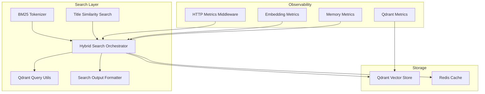
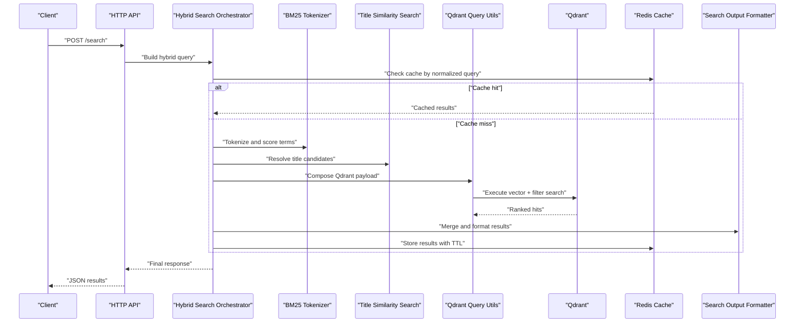
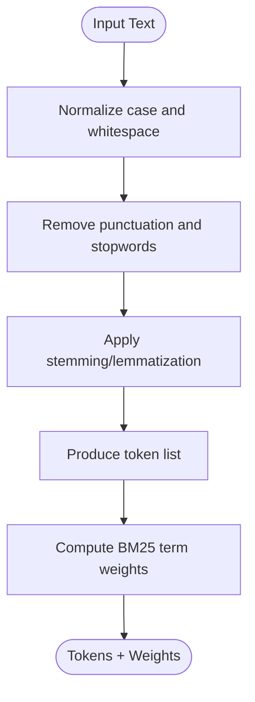
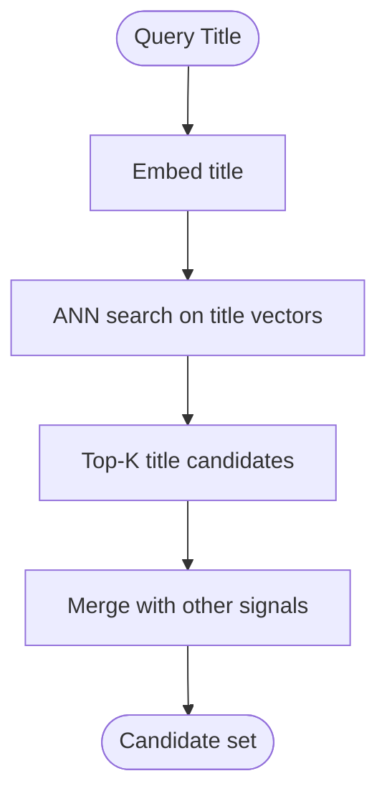
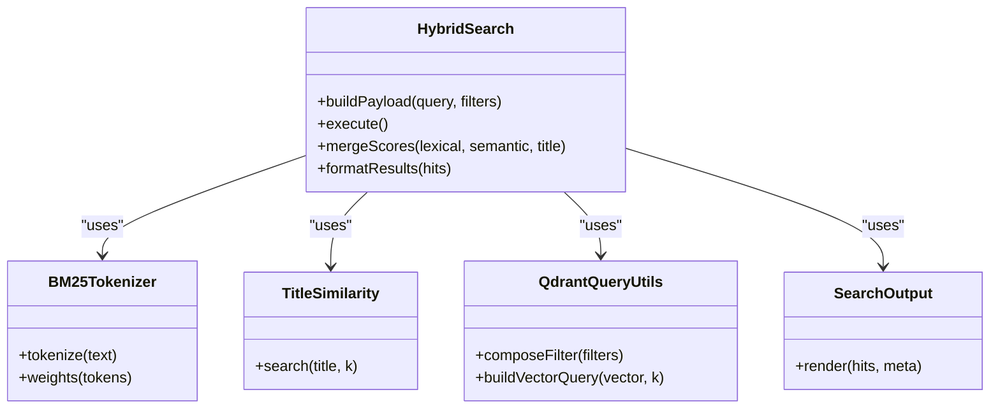
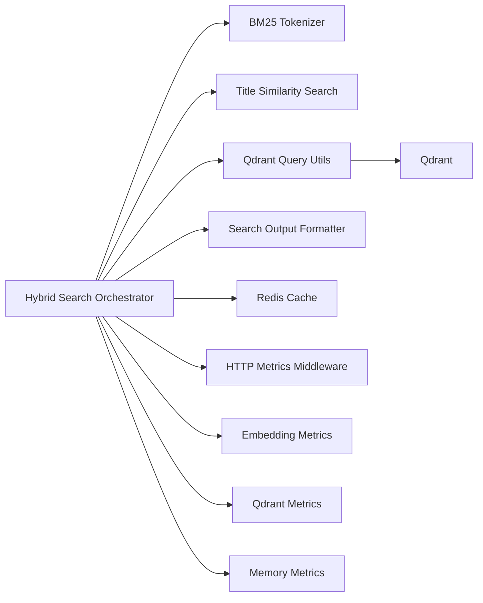
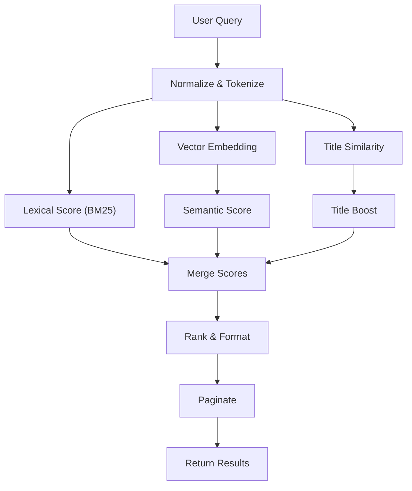

# Search Optimization and Performance

<cite>
**Referenced Files in This Document**
- [bm25-tokenizer.ts](file://src/services/embedding/bm25-tokenizer.ts)
- [store-title-similarity-search.ts](file://src/services/memory/store-title-similarity-search.ts)
- [memory-retrieval.ts](file://src/services/qdrant/memory-retrieval.ts)
- [search.ts](file://src/services/qdrant/search.ts)
- [qdrant-query-utils.ts](file://src/utils/qdrant-query-utils.ts)
- [redis-cache.ts](file://src/services/redis-cache.ts)
- [http-metrics-middleware.ts](file://src/http/http-metrics-middleware.ts)
- [embedding-metrics.ts](file://src/services/metrics/embedding-metrics.ts)
- [qdrant-metrics.ts](file://src/services/metrics/qdrant-metrics.ts)
- [memory-metrics.ts](file://src/services/metrics/memory-metrics.ts)
- [search_output.ts](file://src/tools/search_output.ts)
- [search_schema.ts](file://src/tools/search_schema.ts)
- [search.ts](file://src/tools/search.ts)
- [search-query.md](file://docs/architecture/search-query.md)
</cite>

## Table of Contents
1. [Introduction](#introduction)
2. [Project Structure](#project-structure)
3. [Core Components](#core-components)
4. [Architecture Overview](#architecture-overview)
5. [Detailed Component Analysis](#detailed-component-analysis)
6. [Dependency Analysis](#dependency-analysis)
7. [Performance Considerations](#performance-considerations)
8. [Troubleshooting Guide](#troubleshooting-guide)
9. [Conclusion](#conclusion)
10. [Appendices](#appendices)

## Introduction
This document provides a comprehensive guide to search optimization and performance tuning for the system’s retrieval stack. It covers indexing strategies, query optimization techniques, result caching mechanisms, BM25 tokenization, title similarity search, hybrid search configuration, performance monitoring, query profiling, bottleneck identification, best practices for query formulation, filter usage, pagination, scaling considerations, distributed search patterns, load balancing, and concrete examples for optimizing performance and troubleshooting slow queries.

## Project Structure
The search functionality spans multiple layers:
- Tokenization and text processing (BM25 tokenizer)
- Title similarity search
- Hybrid search orchestration over Qdrant
- Query utilities and schema validation
- Result formatting and output
- Caching via Redis
- Metrics and observability

**Diagram sources**
- [bm25-tokenizer.ts](file://src/services/embedding/bm25-tokenizer.ts)
- [store-title-similarity-search.ts](file://src/services/memory/store-title-similarity-search.ts)
- [search.ts](file://src/services/qdrant/search.ts)
- [memory-retrieval.ts](file://src/services/qdrant/memory-retrieval.ts)
- [qdrant-query-utils.ts](file://src/utils/qdrant-query-utils.ts)
- [redis-cache.ts](file://src/services/redis-cache.ts)
- [search_output.ts](file://src/tools/search_output.ts)
- [http-metrics-middleware.ts](file://src/http/http-metrics-middleware.ts)
- [embedding-metrics.ts](file://src/services/metrics/embedding-metrics.ts)
- [qdrant-metrics.ts](file://src/services/metrics/qdrant-metrics.ts)
- [memory-metrics.ts](file://src/services/metrics/memory-metrics.ts)

**Section sources**
- [search-query.md](file://docs/architecture/search-query.md)

## Core Components
- BM25 Tokenizer: Normalizes and tokenizes input text for lexical scoring and filtering.
- Title Similarity Search: Performs fast, approximate matching on titles using vector or fuzzy heuristics.
- Hybrid Search Orchestrator: Combines lexical (BM25), semantic (vector), and metadata filters into a unified query pipeline.
- Qdrant Query Utilities: Builds efficient Qdrant payloads, manages filters, and optimizes vector search parameters.
- Search Output Formatter: Structures results, applies ranking, and formats responses consistently.
- Redis Cache: Stores frequent queries and partial results to reduce latency and backend load.
- Observability: HTTP metrics middleware and domain-specific metrics capture latency, throughput, and error rates.

**Section sources**
- [bm25-tokenizer.ts](file://src/services/embedding/bm25-tokenizer.ts)
- [store-title-similarity-search.ts](file://src/services/memory/store-title-similarity-search.ts)
- [search.ts](file://src/services/qdrant/search.ts)
- [memory-retrieval.ts](file://src/services/qdrant/memory-retrieval.ts)
- [qdrant-query-utils.ts](file://src/utils/qdrant-query-utils.ts)
- [search_output.ts](file://src/tools/search_output.ts)
- [redis-cache.ts](file://src/services/redis-cache.ts)
- [http-metrics-middleware.ts](file://src/http/http-metrics-middleware.ts)
- [embedding-metrics.ts](file://src/services/metrics/embedding-metrics.ts)
- [qdrant-metrics.ts](file://src/services/metrics/qdrant-metrics.ts)
- [memory-metrics.ts](file://src/services/metrics/memory-metrics.ts)

## Architecture Overview
The search pipeline integrates lexical and semantic signals, with caching and observability at each stage.

**Diagram sources**
- [search.ts](file://src/services/qdrant/search.ts)
- [memory-retrieval.ts](file://src/services/qdrant/memory-retrieval.ts)
- [qdrant-query-utils.ts](file://src/utils/qdrant-query-utils.ts)
- [bm25-tokenizer.ts](file://src/services/embedding/bm25-tokenizer.ts)
- [store-title-similarity-search.ts](file://src/services/memory/store-title-similarity-search.ts)
- [redis-cache.ts](file://src/services/redis-cache.ts)
- [search_output.ts](file://src/tools/search_output.ts)

## Detailed Component Analysis

### BM25 Tokenization Strategy
- Purpose: Normalize input text, remove noise, and produce tokens for lexical scoring and filtering.
- Key behaviors:
  - Lowercasing and punctuation handling
  - Stopword removal and stemming/lemmatization where applicable
  - Term frequency weighting for BM25 scoring
- Optimization tips:
  - Preprocess heavy inputs to reduce token count
  - Avoid overly long queries; split into focused phrases
  - Use consistent normalization across training and query time

**Diagram sources**
- [bm25-tokenizer.ts](file://src/services/embedding/bm25-tokenizer.ts)

**Section sources**
- [bm25-tokenizer.ts](file://src/services/embedding/bm25-tokenizer.ts)

### Title Similarity Search
- Purpose: Quickly identify candidate documents by title proximity to improve recall and speed up downstream merging.
- Techniques:
  - Approximate nearest neighbor on title embeddings
  - Fuzzy string matching fallback for short titles
- Best practices:
  - Limit top-K candidates early to reduce merge cost
  - Combine with metadata filters to prune irrelevant space or type scopes

**Diagram sources**
- [store-title-similarity-search.ts](file://src/services/memory/store-title-similarity-search.ts)

**Section sources**
- [store-title-similarity-search.ts](file://src/services/memory/store-title-similarity-search.ts)

### Hybrid Search Configuration
- Components:
  - Lexical (BM25) signal
  - Semantic (vector) signal
  - Metadata filters (space, type, date ranges)
  - Title similarity boost
- Orchestration:
  - Build composite query payload
  - Execute vector search with filters
  - Re-rank by combined score
  - Format and paginate results

**Diagram sources**
- [search.ts](file://src/services/qdrant/search.ts)
- [memory-retrieval.ts](file://src/services/qdrant/memory-retrieval.ts)
- [qdrant-query-utils.ts](file://src/utils/qdrant-query-utils.ts)
- [bm25-tokenizer.ts](file://src/services/embedding/bm25-tokenizer.ts)
- [store-title-similarity-search.ts](file://src/services/memory/store-title-similarity-search.ts)
- [search_output.ts](file://src/tools/search_output.ts)

**Section sources**
- [search.ts](file://src/services/qdrant/search.ts)
- [memory-retrieval.ts](file://src/services/qdrant/memory-retrieval.ts)
- [qdrant-query-utils.ts](file://src/utils/qdrant-query-utils.ts)
- [search_output.ts](file://src/tools/search_output.ts)

### Query Utilities and Payload Construction
- Responsibilities:
  - Translate high-level filters into Qdrant-compatible structures
  - Optimize vector search parameters (k, score threshold, exact vs approximate)
  - Apply pre-filtering to reduce search space
- Tips:
  - Prefer equality filters on high-cardinality fields when possible
  - Use range filters judiciously; combine with other filters to limit IO

**Section sources**
- [qdrant-query-utils.ts](file://src/utils/qdrant-query-utils.ts)

### Result Formatting and Pagination
- Responsibilities:
  - Normalize scores and apply final ranking
  - Paginate results efficiently (cursor-based or offset-based)
  - Attach metadata and relevance hints
- Best practices:
  - Use cursor-based pagination for large datasets
  - Keep page sizes moderate to balance latency and UX

**Section sources**
- [search_output.ts](file://src/tools/search_output.ts)

### Caching Mechanisms
- Scope:
  - Cache normalized query signatures and their results
  - Short TTLs for volatile data; longer TTLs for stable indexes
- Strategies:
  - Key normalization (lowercase, trim, canonicalize filters)
  - Cache invalidation on index updates
  - Stale-while-revalidate for hot queries

**Section sources**
- [redis-cache.ts](file://src/services/redis-cache.ts)

### Observability and Metrics
- HTTP layer:
  - Latency histograms, request counts, error rates
- Domain metrics:
  - Embedding generation stats
  - Qdrant query latencies and cardinalities
  - Memory operations counters
- Usage:
  - Identify slow endpoints
  - Track cache hit ratios
  - Monitor vector search performance

**Section sources**
- [http-metrics-middleware.ts](file://src/http/http-metrics-middleware.ts)
- [embedding-metrics.ts](file://src/services/metrics/embedding-metrics.ts)
- [qdrant-metrics.ts](file://src/services/metrics/qdrant-metrics.ts)
- [memory-metrics.ts](file://src/services/metrics/memory-metrics.ts)

## Dependency Analysis
The search subsystem depends on storage backends, caching, and metrics. The following diagram highlights key relationships.

**Diagram sources**
- [search.ts](file://src/services/qdrant/search.ts)
- [memory-retrieval.ts](file://src/services/qdrant/memory-retrieval.ts)
- [qdrant-query-utils.ts](file://src/utils/qdrant-query-utils.ts)
- [bm25-tokenizer.ts](file://src/services/embedding/bm25-tokenizer.ts)
- [store-title-similarity-search.ts](file://src/services/memory/store-title-similarity-search.ts)
- [search_output.ts](file://src/tools/search_output.ts)
- [redis-cache.ts](file://src/services/redis-cache.ts)
- [http-metrics-middleware.ts](file://src/http/http-metrics-middleware.ts)
- [embedding-metrics.ts](file://src/services/metrics/embedding-metrics.ts)
- [qdrant-metrics.ts](file://src/services/metrics/qdrant-metrics.ts)
- [memory-metrics.ts](file://src/services/metrics/memory-metrics.ts)

**Section sources**
- [search.ts](file://src/services/qdrant/search.ts)
- [memory-retrieval.ts](file://src/services/qdrant/memory-retrieval.ts)
- [qdrant-query-utils.ts](file://src/utils/qdrant-query-utils.ts)
- [bm25-tokenizer.ts](file://src/services/embedding/bm25-tokenizer.ts)
- [store-title-similarity-search.ts](file://src/services/memory/store-title-similarity-search.ts)
- [search_output.ts](file://src/tools/search_output.ts)
- [redis-cache.ts](file://src/services/redis-cache.ts)
- [http-metrics-middleware.ts](file://src/http/http-metrics-middleware.ts)
- [embedding-metrics.ts](file://src/services/metrics/embedding-metrics.ts)
- [qdrant-metrics.ts](file://src/services/metrics/qdrant-metrics.ts)
- [memory-metrics.ts](file://src/services/metrics/memory-metrics.ts)

## Performance Considerations
- Indexing strategies:
  - Maintain separate vectors for titles and bodies to enable targeted searches
  - Use sparse indices for high-cardinality metadata filters
  - Periodically rebuild or optimize collections after bulk updates
- Query optimization:
  - Narrow scope early with space/type/date filters
  - Prefer exact matches on low-cardinality fields
  - Tune k and score thresholds to avoid excessive re-ranking
- Result caching:
  - Normalize query keys aggressively
  - Set appropriate TTLs based on data volatility
  - Invalidate caches on write paths
- Monitoring and profiling:
  - Track P95/P99 latency per endpoint
  - Monitor cache hit ratio and Qdrant query durations
  - Profile tokenization and embedding costs
- Scaling and distribution:
  - Shard by space or tenant to distribute load
  - Use read replicas for vector stores if available
  - Implement client-side retries with exponential backoff
- Load balancing:
  - Distribute requests across nodes evenly
  - Prefer sticky sessions only if necessary; otherwise stateless design
- Best practices for queries:
  - Use concise, specific phrases
  - Leverage filters instead of broad free-text
  - Avoid extremely large pages; use cursor pagination

[No sources needed since this section provides general guidance]

## Troubleshooting Guide
Common issues and diagnostics:
- Slow queries:
  - Check Qdrant metrics for high-latency operations
  - Inspect HTTP metrics middleware for endpoint bottlenecks
  - Validate that filters are applied before vector search
- High memory usage:
  - Reduce page size and k values
  - Ensure tokenization does not retain large intermediate structures
- Cache misses:
  - Verify key normalization consistency
  - Confirm cache invalidation on writes
- Incorrect results:
  - Review BM25 tokenization settings and stopword lists
  - Adjust title similarity weight and thresholds
  - Re-check metadata filter construction

Actionable steps:
- Enable detailed logging around orchestrator phases
- Add timing instrumentation per stage (tokenize, title sim, qdrant call, format)
- Correlate errors with metrics dashboards
- Reproduce with minimal payloads and incremental complexity

**Section sources**
- [http-metrics-middleware.ts](file://src/http/http-metrics-middleware.ts)
- [embedding-metrics.ts](file://src/services/metrics/embedding-metrics.ts)
- [qdrant-metrics.ts](file://src/services/metrics/qdrant-metrics.ts)
- [memory-metrics.ts](file://src/services/metrics/memory-metrics.ts)

## Conclusion
Effective search performance hinges on disciplined indexing, precise query construction, robust caching, and continuous observability. By combining BM25 lexical signals, title similarity, and semantic vectors—orchestrated through a hybrid pipeline—you can achieve both accuracy and speed. Monitor metrics closely, tune parameters iteratively, and adopt scalable patterns such as sharding and read replicas to sustain growth.

[No sources needed since this section summarizes without analyzing specific files]

## Appendices

### API and Schema References
- Search tool entry points and schemas define accepted inputs and outputs.
- Output formatter ensures consistent structure and metadata.

**Section sources**
- [search.ts](file://src/tools/search.ts)
- [search_schema.ts](file://src/tools/search_schema.ts)
- [search_output.ts](file://src/tools/search_output.ts)

### Conceptual Overview

[No sources needed since this diagram shows conceptual workflow, not actual code structure]