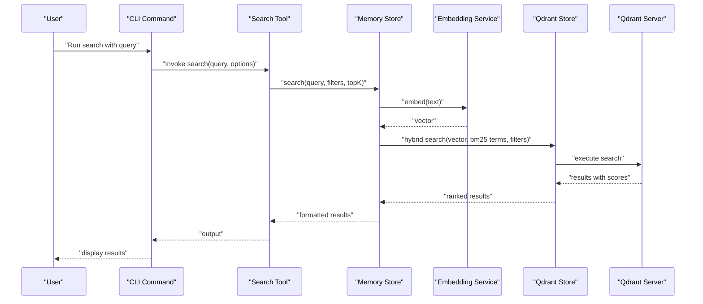
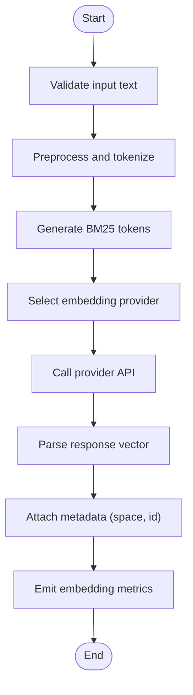
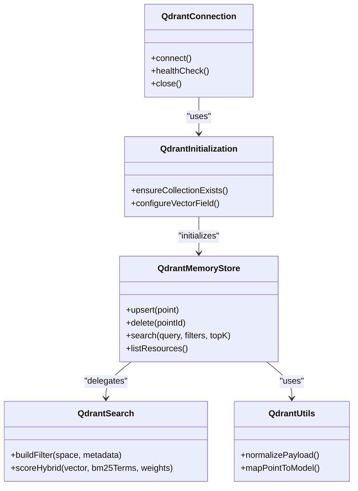
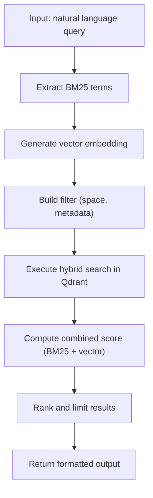
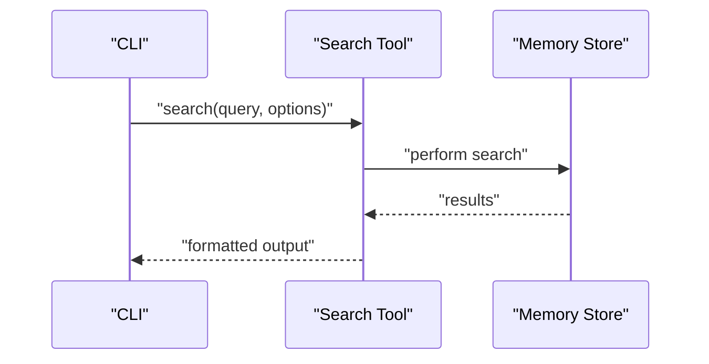
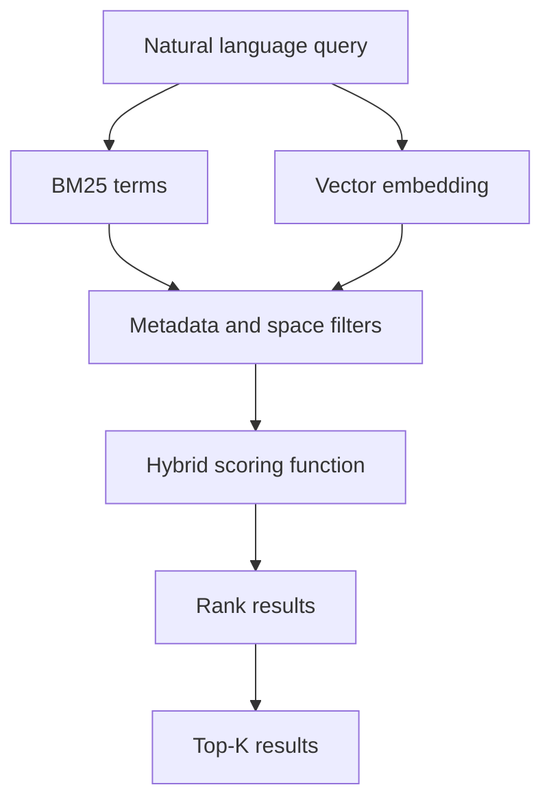
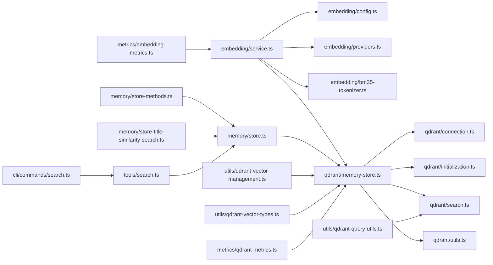

# Vector Embeddings and Search

<cite>
**Referenced Files in This Document**
- [embedding/service.ts](file://src/services/embedding/service.ts)
- [embedding/config.ts](file://src/services/embedding/config.ts)
- [embedding/providers.ts](file://src/services/embedding/providers.ts)
- [embedding/types.ts](file://src/services/embedding/types.ts)
- [qdrant/connection.ts](file://src/services/qdrant/connection.ts)
- [qdrant/initialization.ts](file://src/services/qdrant/initialization.ts)
- [qdrant/memory-store.ts](file://src/services/qdrant/memory-store.ts)
- [qdrant/memory-updates.ts](file://src/services/qdrant/memory-updates.ts)
- [qdrant/search.ts](file://src/services/qdrant/search.ts)
- [qdrant/memory-retrieval.ts](file://src/services/qdrant/memory-retrieval.ts)
- [qdrant/types.ts](file://src/services/qdrant/types.ts)
- [qdrant/utils.ts](file://src/services/qdrant/utils.ts)
- [qdrant/resources.ts](file://src/services/qdrant/resources.ts)
- [qdrant/snapshots.ts](file://src/services/qdrant/snapshots.ts)
- [memory/store.ts](file://src/services/memory/store.ts)
- [memory/store-methods.ts](file://src/services/memory/store-methods.ts)
- [memory/store-title-similarity-search.ts](file://src/services/memory/store-title-similarity-search.ts)
- [memory/qdrant-point-to-memory.ts](file://src/services/memory/qdrant-point-to-memory.ts)
- [tools/search.ts](file://src/tools/search.ts)
- [tools/search_output.ts](file://src/tools/search_output.ts)
- [tools/search_schema.ts](file://src/tools/search_schema.ts)
- [cli/commands/search.ts](file://src/cli/commands/search.ts)
- [http/http-api-routes.ts](file://src/http/http-api-routes.ts)
- [utils/qdrant-query-utils.ts](file://src/utils/qdrant-query-utils.ts)
- [utils/qdrant-vector-management.ts](file://src/utils/qdrant-vector-management.ts)
- [utils/qdrant-vector-types.ts](file://src/utils/qdrant-vector-types.ts)
- [services/bm25-tokenizer.ts](file://src/services/embedding/bm25-tokenizer.ts)
- [services/redis-cache.ts](file://src/services/redis-cache.ts)
- [services/redis.ts](file://src/services/redis.ts)
- [metrics/embedding-metrics.ts](file://src/services/metrics/embedding-metrics.ts)
- [metrics/qdrant-metrics.ts](file://src/services/metrics/qdrant-metrics.ts)
</cite>

## Table of Contents
1. [Introduction](#introduction)
2. [Project Structure](#project-structure)
3. [Core Components](#core-components)
4. [Architecture Overview](#architecture-overview)
5. [Detailed Component Analysis](#detailed-component-analysis)
6. [Dependency Analysis](#dependency-analysis)
7. [Performance Considerations](#performance-considerations)
8. [Troubleshooting Guide](#troubleshooting-guide)
9. [Conclusion](#conclusion)
10. [Appendices](#appendices)

## Introduction
This document explains the vector embeddings and semantic search functionality, including embedding generation, Qdrant integration, similarity search algorithms, hybrid search combining BM25 with vector similarity, filtering by spaces and metadata, result ranking, caching strategies, real-time index updates, and scalability considerations for large datasets. It is designed to be accessible to both technical and non-technical readers while providing deep insights into implementation details.

## Project Structure
The embedding and search features are implemented across several modules:
- Embedding service: configuration, providers, types, and core logic
- Qdrant client and memory store: connection, initialization, indexing, updates, retrieval, and search
- Memory layer: higher-level operations over Qdrant-backed storage
- Tools and CLI: user-facing search interfaces
- Utilities: query building, vector management, and type definitions
- Metrics: observability for embedding and Qdrant operations

```mermaid
graph TB
subgraph "Embedding Service"
EConfig["config.ts"]
EProviders["providers.ts"]
EService["service.ts"]
ETypes["types.ts"]
EBM25["bm25-tokenizer.ts"]
end
subgraph "Qdrant Integration"
QConn["connection.ts"]
QInit["initialization.ts"]
QStore["memory-store.ts"]
QUpdates["memory-updates.ts"]
QSearch["search.ts"]
QRetrieval["memory-retrieval.ts"]
QTypes["types.ts"]
QUtils["utils.ts"]
QResources["resources.ts"]
QSnapshots["snapshots.ts"]
end
subgraph "Memory Layer"
MStore["store.ts"]
MMethods["store-methods.ts"]
MTitleSim["store-title-similarity-search.ts"]
MQPoint["qdrant-point-to-memory.ts"]
end
subgraph "User Interfaces"
TSearch["tools/search.ts"]
TOut["tools/search_output.ts"]
TSchema["tools/search_schema.ts"]
CLISearch["cli/commands/search.ts"]
end
subgraph "Utilities"
UQuery["utils/qdrant-query-utils.ts"]
UVect["utils/qdrant-vector-management.ts"]
UVT["utils/qdrant-vector-types.ts"]
end
subgraph "Observability"
ME["metrics/embedding-metrics.ts"]
MQ["metrics/qdrant-metrics.ts"]
end
EConfig --> EService
EProviders --> EService
EService --> QStore
EBM25 --> EService
QConn --> QInit
QInit --> QStore
QStore --> QUpdates
QStore --> QSearch
QStore --> QRetrieval
QStore --> QResources
QStore --> QSnapshots
MStore --> QStore
MMethods --> MStore
MTitleSim --> MStore
MQPoint --> MStore
TSearch --> MStore
TOut --> TSearch
TSchema --> TSearch
CLISearch --> TSearch
UQuery --> QSearch
UVect --> QStore
UVT --> QStore
ME --> EService
MQ --> QStore
```

**Diagram sources**
- [embedding/service.ts](file://src/services/embedding/service.ts)
- [embedding/config.ts](file://src/services/embedding/config.ts)
- [embedding/providers.ts](file://src/services/embedding/providers.ts)
- [embedding/types.ts](file://src/services/embedding/types.ts)
- [embedding/bm25-tokenizer.ts](file://src/services/embedding/bm25-tokenizer.ts)
- [qdrant/connection.ts](file://src/services/qdrant/connection.ts)
- [qdrant/initialization.ts](file://src/services/qdrant/initialization.ts)
- [qdrant/memory-store.ts](file://src/services/qdrant/memory-store.ts)
- [qdrant/memory-updates.ts](file://src/services/qdrant/memory-updates.ts)
- [qdrant/search.ts](file://src/services/qdrant/search.ts)
- [qdrant/memory-retrieval.ts](file://src/services/qdrant/memory-retrieval.ts)
- [qdrant/types.ts](file://src/services/qdrant/types.ts)
- [qdrant/utils.ts](file://src/services/qdrant/utils.ts)
- [qdrant/resources.ts](file://src/services/qdrant/resources.ts)
- [qdrant/snapshots.ts](file://src/services/qdrant/snapshots.ts)
- [memory/store.ts](file://src/services/memory/store.ts)
- [memory/store-methods.ts](file://src/services/memory/store-methods.ts)
- [memory/store-title-similarity-search.ts](file://src/services/memory/store-title-similarity-search.ts)
- [memory/qdrant-point-to-memory.ts](file://src/services/memory/qdrant-point-to-memory.ts)
- [tools/search.ts](file://src/tools/search.ts)
- [tools/search_output.ts](file://src/tools/search_output.ts)
- [tools/search_schema.ts](file://src/tools/search_schema.ts)
- [cli/commands/search.ts](file://src/cli/commands/search.ts)
- [utils/qdrant-query-utils.ts](file://src/utils/qdrant-query-utils.ts)
- [utils/qdrant-vector-management.ts](file://src/utils/qdrant-vector-management.ts)
- [utils/qdrant-vector-types.ts](file://src/utils/qdrant-vector-types.ts)
- [metrics/embedding-metrics.ts](file://src/services/metrics/embedding-metrics.ts)
- [metrics/qdrant-metrics.ts](file://src/services/metrics/qdrant-metrics.ts)

**Section sources**
- [embedding/service.ts](file://src/services/embedding/service.ts)
- [qdrant/memory-store.ts](file://src/services/qdrant/memory-store.ts)
- [memory/store.ts](file://src/services/memory/store.ts)
- [tools/search.ts](file://src/tools/search.ts)
- [cli/commands/search.ts](file://src/cli/commands/search.ts)

## Core Components
- Embedding Service: orchestrates text preprocessing, tokenization (including BM25 tokenizer), and embedding provider calls; exposes methods to generate vectors and manage metadata.
- Qdrant Client and Store: manages connection lifecycle, collection/vector field initialization, upserting points, searching with filters, and retrieving results.
- Memory Layer: provides high-level operations such as indexing artifacts, updating indices, and performing title similarity searches.
- User Interfaces: tools and CLI commands that accept natural language queries and return ranked results.
- Utilities: helpers for constructing Qdrant queries, managing vector dimensions, and defining shared types.
- Observability: metrics for embedding latency, Qdrant request performance, and error rates.

Key responsibilities:
- Generate embeddings from text inputs using configured providers
- Upsert vectors and metadata into Qdrant collections
- Perform vector similarity search with optional filters (spaces, metadata)
- Combine BM25 keyword matching with vector similarity for hybrid search
- Cache frequent queries and support real-time index updates
- Expose search via tools and CLI

**Section sources**
- [embedding/service.ts](file://src/services/embedding/service.ts)
- [embedding/config.ts](file://src/services/embedding/config.ts)
- [embedding/providers.ts](file://src/services/embedding/providers.ts)
- [embedding/types.ts](file://src/services/embedding/types.ts)
- [embedding/bm25-tokenizer.ts](file://src/services/embedding/bm25-tokenizer.ts)
- [qdrant/connection.ts](file://src/services/qdrant/connection.ts)
- [qdrant/initialization.ts](file://src/services/qdrant/initialization.ts)
- [qdrant/memory-store.ts](file://src/services/qdrant/memory-store.ts)
- [qdrant/memory-updates.ts](file://src/services/qdrant/memory-updates.ts)
- [qdrant/search.ts](file://src/services/qdrant/search.ts)
- [qdrant/memory-retrieval.ts](file://src/services/qdrant/memory-retrieval.ts)
- [memory/store.ts](file://src/services/memory/store.ts)
- [memory/store-methods.ts](file://src/services/memory/store-methods.ts)
- [memory/store-title-similarity-search.ts](file://src/services/memory/store-title-similarity-search.ts)
- [memory/qdrant-point-to-memory.ts](file://src/services/memory/qdrant-point-to-memory.ts)
- [tools/search.ts](file://src/tools/search.ts)
- [tools/search_output.ts](file://src/tools/search_output.ts)
- [tools/search_schema.ts](file://src/tools/search_schema.ts)
- [cli/commands/search.ts](file://src/cli/commands/search.ts)
- [utils/qdrant-query-utils.ts](file://src/utils/qdrant-query-utils.ts)
- [utils/qdrant-vector-management.ts](file://src/utils/qdrant-vector-management.ts)
- [utils/qdrant-vector-types.ts](file://src/utils/qdrant-vector-types.ts)
- [metrics/embedding-metrics.ts](file://src/services/metrics/embedding-metrics.ts)
- [metrics/qdrant-metrics.ts](file://src/services/metrics/qdrant-metrics.ts)

## Architecture Overview
The system follows a layered architecture:
- Presentation layer: CLI and tool endpoints accept natural language queries
- Business layer: memory store orchestrates search workflows, including hybrid scoring and filtering
- Data access layer: Qdrant client performs vector and metadata operations
- Embedding layer: generates vectors and supports BM25 tokenization
- Observability: metrics capture performance and errors

**Diagram sources**
- [cli/commands/search.ts](file://src/cli/commands/search.ts)
- [tools/search.ts](file://src/tools/search.ts)
- [memory/store.ts](file://src/services/memory/store.ts)
- [embedding/service.ts](file://src/services/embedding/service.ts)
- [qdrant/memory-store.ts](file://src/services/qdrant/memory-store.ts)
- [qdrant/search.ts](file://src/services/qdrant/search.ts)

## Detailed Component Analysis

### Embedding Generation Pipeline
Responsibilities:
- Configure embedding providers and model parameters
- Tokenize input text (including BM25-compatible tokens)
- Call provider APIs to obtain vectors
- Attach metadata (e.g., space, resource identifiers)
- Emit metrics for latency and errors

Processing steps:
- Input validation and normalization
- Optional pre-processing (e.g., truncation, chunking)
- Provider selection based on configuration
- Batch or single embedding requests
- Error handling and retries where applicable

**Diagram sources**
- [embedding/service.ts](file://src/services/embedding/service.ts)
- [embedding/config.ts](file://src/services/embedding/config.ts)
- [embedding/providers.ts](file://src/services/embedding/providers.ts)
- [embedding/types.ts](file://src/services/embedding/types.ts)
- [embedding/bm25-tokenizer.ts](file://src/services/embedding/bm25-tokenizer.ts)
- [metrics/embedding-metrics.ts](file://src/services/metrics/embedding-metrics.ts)

**Section sources**
- [embedding/service.ts](file://src/services/embedding/service.ts)
- [embedding/config.ts](file://src/services/embedding/config.ts)
- [embedding/providers.ts](file://src/services/embedding/providers.ts)
- [embedding/types.ts](file://src/services/embedding/types.ts)
- [embedding/bm25-tokenizer.ts](file://src/services/embedding/bm25-tokenizer.ts)
- [metrics/embedding-metrics.ts](file://src/services/metrics/embedding-metrics.ts)

### Qdrant Integration and Index Management
Responsibilities:
- Manage connection lifecycle and health checks
- Initialize collections and vector fields with correct dimensions
- Upsert points with vectors and structured metadata
- Execute vector similarity searches with filters
- Support snapshots and resource listing

Key operations:
- Connection setup and retry policies
- Collection creation and schema enforcement
- Point upserts with payload (metadata)
- Query construction utilities for filters and scoring
- Retrieval mapping from Qdrant points to application models

**Diagram sources**
- [qdrant/connection.ts](file://src/services/qdrant/connection.ts)
- [qdrant/initialization.ts](file://src/services/qdrant/initialization.ts)
- [qdrant/memory-store.ts](file://src/services/qdrant/memory-store.ts)
- [qdrant/search.ts](file://src/services/qdrant/search.ts)
- [qdrant/utils.ts](file://src/services/qdrant/utils.ts)
- [qdrant/types.ts](file://src/services/qdrant/types.ts)

**Section sources**
- [qdrant/connection.ts](file://src/services/qdrant/connection.ts)
- [qdrant/initialization.ts](file://src/services/qdrant/initialization.ts)
- [qdrant/memory-store.ts](file://src/services/qdrant/memory-store.ts)
- [qdrant/memory-updates.ts](file://src/services/qdrant/memory-updates.ts)
- [qdrant/search.ts](file://src/services/qdrant/search.ts)
- [qdrant/memory-retrieval.ts](file://src/services/qdrant/memory-retrieval.ts)
- [qdrant/types.ts](file://src/services/qdrant/types.ts)
- [qdrant/utils.ts](file://src/services/qdrant/utils.ts)
- [qdrant/resources.ts](file://src/services/qdrant/resources.ts)
- [qdrant/snapshots.ts](file://src/services/qdrant/snapshots.ts)

### Memory Layer and Hybrid Search
Responsibilities:
- Orchestrate hybrid search combining BM25 keyword matching and vector similarity
- Apply filters by spaces and metadata
- Rank results using configurable scoring functions
- Provide title similarity search as a specialized case

Workflow:
- Parse natural language query
- Extract BM25 terms and construct vector representation
- Build Qdrant filter for space and metadata constraints
- Execute hybrid search and compute combined scores
- Return ranked results with metadata

**Diagram sources**
- [memory/store.ts](file://src/services/memory/store.ts)
- [memory/store-methods.ts](file://src/services/memory/store-methods.ts)
- [memory/store-title-similarity-search.ts](file://src/services/memory/store-title-similarity-search.ts)
- [qdrant/search.ts](file://src/services/qdrant/search.ts)
- [utils/qdrant-query-utils.ts](file://src/utils/qdrant-query-utils.ts)

**Section sources**
- [memory/store.ts](file://src/services/memory/store.ts)
- [memory/store-methods.ts](file://src/services/memory/store-methods.ts)
- [memory/store-title-similarity-search.ts](file://src/services/memory/store-title-similarity-search.ts)
- [memory/qdrant-point-to-memory.ts](file://src/services/memory/qdrant-point-to-memory.ts)
- [qdrant/search.ts](file://src/services/qdrant/search.ts)
- [utils/qdrant-query-utils.ts](file://src/utils/qdrant-query-utils.ts)

### User Interfaces: Tools and CLI
Responsibilities:
- Accept user queries and options (topK, filters)
- Invoke memory store search
- Format and display results

Examples:
- CLI command to run a search with a query string and optional filters
- Tool function to programmatically perform search within applications

**Diagram sources**
- [cli/commands/search.ts](file://src/cli/commands/search.ts)
- [tools/search.ts](file://src/tools/search.ts)
- [tools/search_output.ts](file://src/tools/search_output.ts)
- [tools/search_schema.ts](file://src/tools/search_schema.ts)
- [memory/store.ts](file://src/services/memory/store.ts)

**Section sources**
- [cli/commands/search.ts](file://src/cli/commands/search.ts)
- [tools/search.ts](file://src/tools/search.ts)
- [tools/search_output.ts](file://src/tools/search_output.ts)
- [tools/search_schema.ts](file://src/tools/search_schema.ts)

### Query Formulation and Similarity Scoring
Responsibilities:
- Convert natural language queries into BM25 terms and vectors
- Construct Qdrant filters for spaces and metadata
- Define custom similarity functions and weighting schemes
- Normalize and rank final scores

Key aspects:
- BM25 term extraction and tokenization
- Vector normalization and dimension alignment
- Weighted combination of BM25 and vector scores
- Filtering by space path and arbitrary metadata keys

**Diagram sources**
- [embedding/bm25-tokenizer.ts](file://src/services/embedding/bm25-tokenizer.ts)
- [embedding/service.ts](file://src/services/embedding/service.ts)
- [qdrant/search.ts](file://src/services/qdrant/search.ts)
- [utils/qdrant-query-utils.ts](file://src/utils/qdrant-query-utils.ts)

**Section sources**
- [embedding/bm25-tokenizer.ts](file://src/services/embedding/bm25-tokenizer.ts)
- [embedding/service.ts](file://src/services/embedding/service.ts)
- [qdrant/search.ts](file://src/services/qdrant/search.ts)
- [utils/qdrant-query-utils.ts](file://src/utils/qdrant-query-utils.ts)

### Real-Time Index Updates and Snapshots
Responsibilities:
- Upsert new or updated points in Qdrant
- Delete outdated points
- Create and manage snapshots for durability and recovery

Operations:
- Incremental updates for live content changes
- Snapshot creation and restoration procedures
- Resource listing and synchronization

**Section sources**
- [qdrant/memory-updates.ts](file://src/services/qdrant/memory-updates.ts)
- [qdrant/snapshots.ts](file://src/services/qdrant/snapshots.ts)
- [qdrant/resources.ts](file://src/services/qdrant/resources.ts)

### Caching Strategies
Responsibilities:
- Cache frequent search queries and results
- Invalidate cache when underlying data changes
- Use Redis for distributed caching

Strategies:
- Key design based on query hash and filters
- TTL-based expiration for stale results
- Cache invalidation hooks on upsert/delete operations

**Section sources**
- [services/redis-cache.ts](file://src/services/redis-cache.ts)
- [services/redis.ts](file://src/services/redis.ts)
- [qdrant/memory-updates.ts](file://src/services/qdrant/memory-updates.ts)

## Dependency Analysis
The following diagram shows key dependencies between components involved in embeddings and search:

**Diagram sources**
- [embedding/service.ts](file://src/services/embedding/service.ts)
- [embedding/config.ts](file://src/services/embedding/config.ts)
- [embedding/providers.ts](file://src/services/embedding/providers.ts)
- [embedding/bm25-tokenizer.ts](file://src/services/embedding/bm25-tokenizer.ts)
- [qdrant/memory-store.ts](file://src/services/qdrant/memory-store.ts)
- [qdrant/connection.ts](file://src/services/qdrant/connection.ts)
- [qdrant/initialization.ts](file://src/services/qdrant/initialization.ts)
- [qdrant/search.ts](file://src/services/qdrant/search.ts)
- [qdrant/utils.ts](file://src/services/qdrant/utils.ts)
- [memory/store.ts](file://src/services/memory/store.ts)
- [memory/store-methods.ts](file://src/services/memory/store-methods.ts)
- [memory/store-title-similarity-search.ts](file://src/services/memory/store-title-similarity-search.ts)
- [tools/search.ts](file://src/tools/search.ts)
- [cli/commands/search.ts](file://src/cli/commands/search.ts)
- [utils/qdrant-query-utils.ts](file://src/utils/qdrant-query-utils.ts)
- [utils/qdrant-vector-management.ts](file://src/utils/qdrant-vector-management.ts)
- [utils/qdrant-vector-types.ts](file://src/utils/qdrant-vector-types.ts)
- [metrics/embedding-metrics.ts](file://src/services/metrics/embedding-metrics.ts)
- [metrics/qdrant-metrics.ts](file://src/services/metrics/qdrant-metrics.ts)

**Section sources**
- [embedding/service.ts](file://src/services/embedding/service.ts)
- [qdrant/memory-store.ts](file://src/services/qdrant/memory-store.ts)
- [memory/store.ts](file://src/services/memory/store.ts)
- [tools/search.ts](file://src/tools/search.ts)
- [cli/commands/search.ts](file://src/cli/commands/search.ts)

## Performance Considerations
- Embedding batching: group multiple texts to reduce API overhead
- Vector dimension alignment: ensure consistent dimensions across providers to avoid re-computation
- BM25 term pruning: remove low-value tokens to improve speed
- Filter optimization: narrow search scope by space and metadata before vector search
- Result limiting: cap topK to reduce network and processing costs
- Caching: leverage Redis for repeated queries and short TTLs
- Index updates: use incremental upserts and batch writes for throughput
- Monitoring: track embedding latency, Qdrant request times, and error rates

[No sources needed since this section provides general guidance]

## Troubleshooting Guide
Common issues and resolutions:
- Embedding provider failures: check configuration, credentials, and rate limits; inspect embedding metrics
- Qdrant connection errors: verify server availability, authentication, and collection existence; review Qdrant metrics
- Dimension mismatch: confirm vector size matches collection schema; adjust provider settings
- Filter not applied: validate space and metadata keys; ensure payloads are correctly attached
- Slow queries: reduce topK, add filters, enable caching, and monitor Qdrant performance

Operational checks:
- Health endpoints for Qdrant and embedding services
- Metrics dashboards for latency and error rates
- Logs around upsert and search operations

**Section sources**
- [metrics/embedding-metrics.ts](file://src/services/metrics/embedding-metrics.ts)
- [metrics/qdrant-metrics.ts](file://src/services/metrics/qdrant-metrics.ts)
- [qdrant/connection.ts](file://src/services/qdrant/connection.ts)
- [qdrant/initialization.ts](file://src/services/qdrant/initialization.ts)
- [qdrant/memory-store.ts](file://src/services/qdrant/memory-store.ts)

## Conclusion
The vector embeddings and semantic search system integrates an embedding service with Qdrant to provide hybrid search capabilities. It supports natural language queries, flexible filtering by spaces and metadata, and customizable similarity scoring. With caching, real-time updates, and comprehensive metrics, it scales effectively for large datasets while maintaining performance and reliability.

[No sources needed since this section summarizes without analyzing specific files]

## Appendices

### Examples and Usage Patterns
- Embedding creation: configure provider, preprocess text, call embedding service, attach metadata
- Search queries: formulate natural language queries, specify filters (space, metadata), set topK
- Custom similarity functions: define weighting between BM25 and vector scores, normalize outputs
- Caching: implement Redis-backed caches keyed by query hash and filters
- Real-time updates: upsert new points, delete outdated ones, create snapshots periodically

[No sources needed since this section provides general guidance]