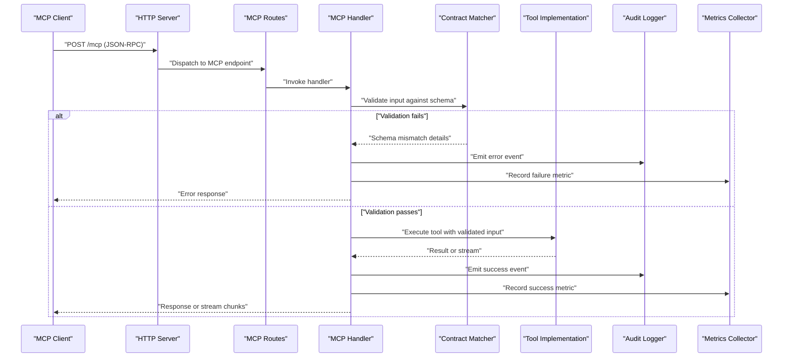
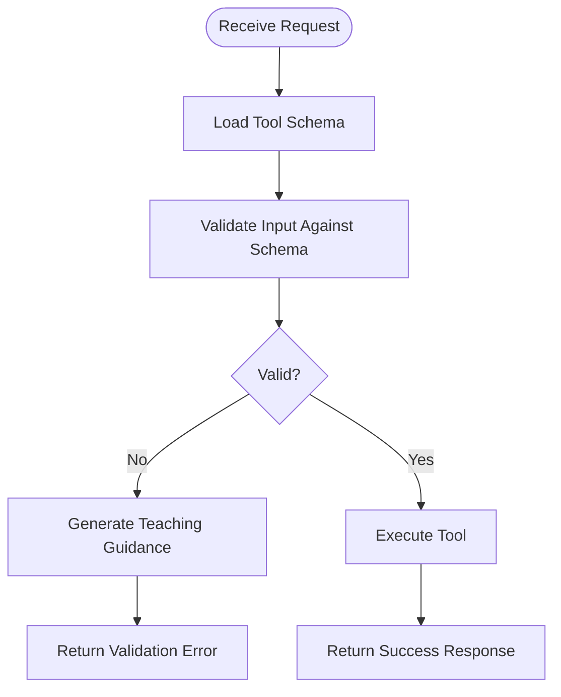
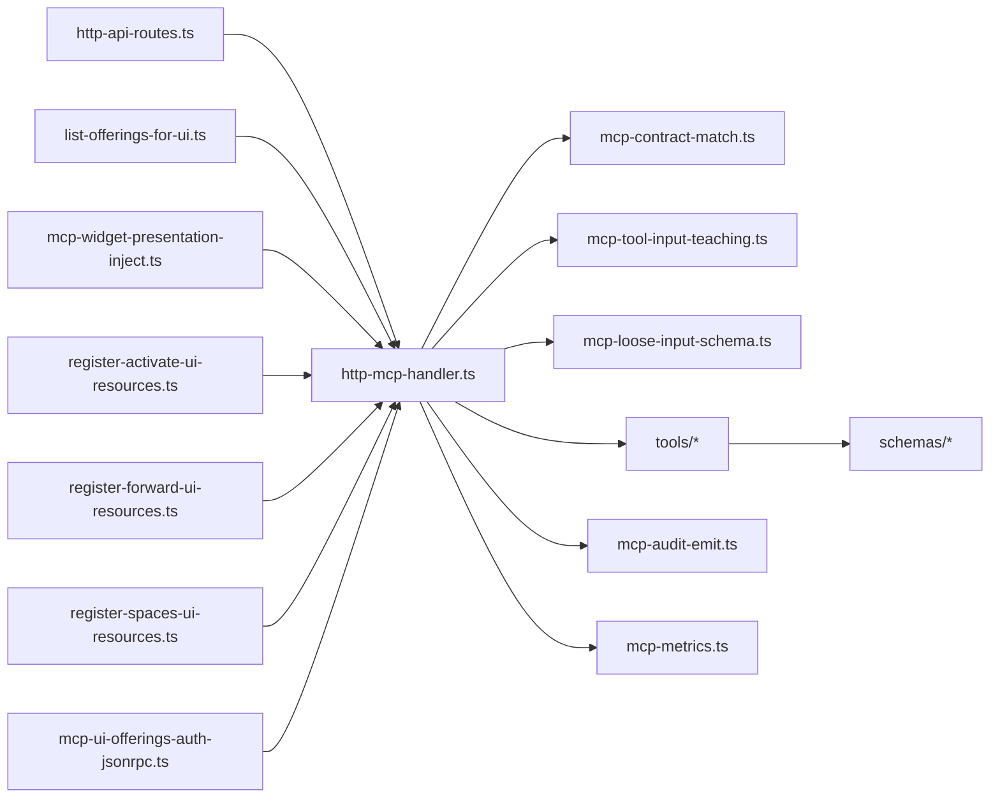

# Model Context Protocol (MCP) Fundamentals

<cite>
**Referenced Files in This Document**
- [http-mcp-handler.ts](file://src/http/http-mcp-handler.ts)
- [mcp-contract-match.ts](file://src/tools/mcp-contract-match.ts)
- [mcp-tool-input-teaching.ts](file://src/tools/mcp-tool-input-teaching.ts)
- [mcp-runtime-error.ts](file://src/tools/mcp-runtime-error.ts)
- [mcp-audit-emit.ts](file://src/http/mcp-audit-emit.ts)
- [mcp-ui-offerings-auth-jsonrpc.ts](file://src/http/mcp-ui-offerings-auth-jsonrpc.ts)
- [mcp-widget-presentation-inject.ts](file://src/mcp-apps/mcp-widget-presentation-inject.ts)
- [list-offerings-for-ui.ts](file://src/mcp-apps/list-offerings-for-ui.ts)
- [register-activate-ui-resources.ts](file://src/mcp-apps/register-activate-ui-resources.ts)
- [register-forward-ui-resources.ts](file://src/mcp-apps/register-forward-ui-resources.ts)
- [register-spaces-ui-resources.ts](file://src/mcp-apps/register-spaces-ui-resources.ts)
- [activate.ts](file://src/tools/activate.ts)
- [forward.ts](file://src/tools/forward.ts)
- [search.ts](file://src/tools/search.ts)
- [train.ts](file://src/tools/train.ts)
- [tune.ts](file://src/tools/tune.ts)
- [export.ts](file://src/tools/export.ts)
- [delete.ts](file://src/tools/delete.ts)
- [update.ts](file://src/tools/update.ts)
- [reward.ts](file://src/tools/reward.ts)
- [spaces.ts](file://src/tools/spaces.ts)
- [next.ts](file://src/tools/next.ts)
- [dump.ts](file://src/tools/dump.ts)
- [activate_schema.ts](file://src/tools/activate_schema.ts)
- [forward_schema.ts](file://src/tools/forward_schema.ts)
- [search_schema.ts](file://src/tools/search_schema.ts)
- [train_schema.ts](file://src/tools/train_schema.ts)
- [tune_schema.ts](file://src/tools/tune_schema.ts)
- [export_schema.ts](file://src/tools/export_schema.ts)
- [delete_schema.ts](file://src/tools/delete_schema.ts)
- [update_schema.ts](file://src/tools/update_schema.ts)
- [reward_schema.ts](file://src/tools/reward_schema.ts)
- [spaces_schema.ts](file://src/tools/spaces_schema.ts)
- [next_schema.ts](file://src/tools/next_schema.ts)
- [dump_schema.ts](file://src/tools/dump_schema.ts)
- [mcp-loose-input-schema.ts](file://src/tools/mcp-loose-input-schema.ts)
- [mcp-tool-doc-runtime.ts](file://src/utils/mcp-tool-doc-runtime.ts)
- [http-api-routes.ts](file://src/http/http-api-routes.ts)
- [http-mcp-cors.ts](file://src/http/http-mcp-cors.ts)
- [mcp-metrics.ts](file://src/services/metrics/mcp-metrics.ts)
- [mcp-client-connection.test.ts](file://tests/integration/mcp-client-connection.test.ts)
- [mcp-list-tools.test.ts](file://tests/integration/mcp-list-tools.test.ts)
- [mcp-ui-resource-read.test.ts](file://tests/integration/mcp-ui-resource-read.test.ts)
- [mcp-host-client-groups.test.ts](file://tests/integration/mcp-host-client-groups.test.ts)
- [mcp-auth-jsonrpc-error.test.ts](file://tests/integration/mcp-auth-jsonrpc-error.test.ts)
- [v4-kairos-forward-v2-solution.test.ts](file://tests/integration/v4-kairos-forward-v2-solution.test.ts)
- [kairos-protocol-versioning.test.ts](file://tests/integration/kairos-protocol-versioning.test.ts)
</cite>

## Table of Contents
1. [Introduction](#introduction)
2. [Project Structure](#project-structure)
3. [Core Components](#core-components)
4. [Architecture Overview](#architecture-overview)
5. [Detailed Component Analysis](#detailed-component-analysis)
6. [Dependency Analysis](#dependency-analysis)
7. [Performance Considerations](#performance-considerations)
8. [Troubleshooting Guide](#troubleshooting-guide)
9. [Conclusion](#conclusion)
10. [Appendices](#appendices)

## Introduction
This document explains the Model Context Protocol (MCP) fundamentals as implemented in Kairos. It covers:
- The MCP standard and how it is exposed by Kairos
- Tool registration and discovery mechanisms
- Schema validation system for inputs and outputs
- Request/response patterns, including streaming support
- Contract matching between client requests and tool schemas
- Error handling strategies
- Practical examples of tool definitions, schema specifications, and client integration patterns
- Protocol versioning, backwards compatibility, and migration strategies

The goal is to help developers understand how tools are registered, discovered, validated, invoked, and observed through the MCP interface in Kairos.

## Project Structure
Kairos exposes MCP capabilities primarily via HTTP JSON-RPC with optional UI resource offerings. The relevant areas include:
- HTTP transport and routing for MCP endpoints
- Tool implementations and their input/output schemas
- Contract matching and validation logic
- UI resources for offering discovery and presentation
- Metrics and audit logging for observability
- Integration tests that validate behavior and compatibility

```mermaid
graph TB
subgraph "HTTP Layer"
A["http-mcp-handler.ts"]
B["http-api-routes.ts"]
C["http-mcp-cors.ts"]
end
subgraph "Tools & Schemas"
T1["activate.ts / activate_schema.ts"]
T2["forward.ts / forward_schema.ts"]
T3["search.ts / search_schema.ts"]
T4["train.ts / train_schema.ts"]
T5["tune.ts / tune_schema.ts"]
T6["export.ts / export_schema.ts"]
T7["delete.ts / delete_schema.ts"]
T8["update.ts / update_schema.ts"]
T9["reward.ts / reward_schema.ts"]
T10["spaces.ts / spaces_schema.ts"]
T11["next.ts / next_schema.ts"]
T12["dump.ts / dump_schema.ts"]
end
subgraph "Validation & Matching"
V1["mcp-contract-match.ts"]
V2["mcp-tool-input-teaching.ts"]
V3["mcp-loose-input-schema.ts"]
end
subgraph "UI Offerings"
U1["list-offerings-for-ui.ts"]
U2["mcp-widget-presentation-inject.ts"]
U3["register-activate-ui-resources.ts"]
U4["register-forward-ui-resources.ts"]
U5["register-spaces-ui-resources.ts"]
U6["mcp-ui-offerings-auth-jsonrpc.ts"]
end
subgraph "Observability"
O1["mcp-audit-emit.ts"]
O2["mcp-metrics.ts"]
end
A --> V1
A --> V2
A --> V3
A --> T1
A --> T2
A --> T3
A --> T4
A --> T5
A --> T6
A --> T7
A --> T8
A --> T9
A --> T10
A --> T11
A --> T12
B --> A
C --> A
U1 --> A
U2 --> A
U3 --> A
U4 --> A
U5 --> A
U6 --> A
A --> O1
A --> O2
```

**Diagram sources**
- [http-mcp-handler.ts](file://src/http/http-mcp-handler.ts)
- [http-api-routes.ts](file://src/http/http-api-routes.ts)
- [http-mcp-cors.ts](file://src/http/http-mcp-cors.ts)
- [mcp-contract-match.ts](file://src/tools/mcp-contract-match.ts)
- [mcp-tool-input-teaching.ts](file://src/tools/mcp-tool-input-teaching.ts)
- [mcp-loose-input-schema.ts](file://src/tools/mcp-loose-input-schema.ts)
- [activate.ts](file://src/tools/activate.ts)
- [activate_schema.ts](file://src/tools/activate_schema.ts)
- [forward.ts](file://src/tools/forward.ts)
- [forward_schema.ts](file://src/tools/forward_schema.ts)
- [search.ts](file://src/tools/search.ts)
- [search_schema.ts](file://src/tools/search_schema.ts)
- [train.ts](file://src/tools/train.ts)
- [train_schema.ts](file://src/tools/train_schema.ts)
- [tune.ts](file://src/tools/tune.ts)
- [tune_schema.ts](file://src/tools/tune_schema.ts)
- [export.ts](file://src/tools/export.ts)
- [export_schema.ts](file://src/tools/export_schema.ts)
- [delete.ts](file://src/tools/delete.ts)
- [delete_schema.ts](file://src/tools/delete_schema.ts)
- [update.ts](file://src/tools/update.ts)
- [update_schema.ts](file://src/tools/update_schema.ts)
- [reward.ts](file://src/tools/reward.ts)
- [reward_schema.ts](file://src/tools/reward_schema.ts)
- [spaces.ts](file://src/tools/spaces.ts)
- [spaces_schema.ts](file://src/tools/spaces_schema.ts)
- [next.ts](file://src/tools/next.ts)
- [next_schema.ts](file://src/tools/next_schema.ts)
- [dump.ts](file://src/tools/dump.ts)
- [dump_schema.ts](file://src/tools/dump_schema.ts)
- [list-offerings-for-ui.ts](file://src/mcp-apps/list-offerings-for-ui.ts)
- [mcp-widget-presentation-inject.ts](file://src/mcp-apps/mcp-widget-presentation-inject.ts)
- [register-activate-ui-resources.ts](file://src/mcp-apps/register-activate-ui-resources.ts)
- [register-forward-ui-resources.ts](file://src/mcp-apps/register-forward-ui-resources.ts)
- [register-spaces-ui-resources.ts](file://src/mcp-apps/register-spaces-ui-resources.ts)
- [mcp-ui-offerings-auth-jsonrpc.ts](file://src/http/mcp-ui-offerings-auth-jsonrpc.ts)
- [mcp-audit-emit.ts](file://src/http/mcp-audit-emit.ts)
- [mcp-metrics.ts](file://src/services/metrics/mcp-metrics.ts)

**Section sources**
- [http-mcp-handler.ts](file://src/http/http-mcp-handler.ts)
- [http-api-routes.ts](file://src/http/http-api-routes.ts)
- [http-mcp-cors.ts](file://src/http/http-mcp-cors.ts)
- [mcp-contract-match.ts](file://src/tools/mcp-contract-match.ts)
- [mcp-tool-input-teaching.ts](file://src/tools/mcp-tool-input-teaching.ts)
- [mcp-loose-input-schema.ts](file://src/tools/mcp-loose-input-schema.ts)
- [list-offerings-for-ui.ts](file://src/mcp-apps/list-offerings-for-ui.ts)
- [mcp-widget-presentation-inject.ts](file://src/mcp-apps/mcp-widget-presentation-inject.ts)
- [register-activate-ui-resources.ts](file://src/mcp-apps/register-activate-ui-resources.ts)
- [register-forward-ui-resources.ts](file://src/mcp-apps/register-forward-ui-resources.ts)
- [register-spaces-ui-resources.ts](file://src/mcp-apps/register-spaces-ui-resources.ts)
- [mcp-ui-offerings-auth-jsonrpc.ts](file://src/http/mcp-ui-offerings-auth-jsonrpc.ts)
- [mcp-audit-emit.ts](file://src/http/mcp-audit-emit.ts)
- [mcp-metrics.ts](file://src/services/metrics/mcp-metrics.ts)

## Core Components
- HTTP MCP handler: Receives JSON-RPC requests, routes them to tools, validates inputs against schemas, executes tools, and returns responses or errors.
- Contract matcher: Validates that incoming request payloads match declared tool schemas and provides guidance when mismatches occur.
- Input teaching utilities: Generate helpful error messages and suggestions based on schema differences.
- Loose input schema: Provides a permissive fallback for cases where strict validation is not required.
- Tool modules: Each business capability (e.g., activate, forward, search, train, tune, export, delete, update, reward, spaces, next, dump) has an implementation file and a corresponding schema definition file.
- UI offerings: Endpoints and helpers to list available offerings and inject UI resources for interactive experiences.
- Observability: Audit events and metrics capture for MCP calls.

Key responsibilities:
- Registration: Tools and their schemas are defined alongside each other and made discoverable via MCP listing endpoints.
- Discovery: Clients can enumerate available tools and their schemas.
- Validation: Inputs are validated against JSON Schema; mismatches produce actionable errors.
- Execution: Tools run business logic and return structured results.
- Streaming: Some flows may use streaming responses for long-running operations.

**Section sources**
- [http-mcp-handler.ts](file://src/http/http-mcp-handler.ts)
- [mcp-contract-match.ts](file://src/tools/mcp-contract-match.ts)
- [mcp-tool-input-teaching.ts](file://src/tools/mcp-tool-input-teaching.ts)
- [mcp-loose-input-schema.ts](file://src/tools/mcp-loose-input-schema.ts)
- [activate.ts](file://src/tools/activate.ts)
- [activate_schema.ts](file://src/tools/activate_schema.ts)
- [forward.ts](file://src/tools/forward.ts)
- [forward_schema.ts](file://src/tools/forward_schema.ts)
- [search.ts](file://src/tools/search.ts)
- [search_schema.ts](file://src/tools/search_schema.ts)
- [train.ts](file://src/tools/train.ts)
- [train_schema.ts](file://src/tools/train_schema.ts)
- [tune.ts](file://src/tools/tune.ts)
- [tune_schema.ts](file://src/tools/tune_schema.ts)
- [export.ts](file://src/tools/export.ts)
- [export_schema.ts](file://src/tools/export_schema.ts)
- [delete.ts](file://src/tools/delete.ts)
- [delete_schema.ts](file://src/tools/delete_schema.ts)
- [update.ts](file://src/tools/update.ts)
- [update_schema.ts](file://src/tools/update_schema.ts)
- [reward.ts](file://src/tools/reward.ts)
- [reward_schema.ts](file://src/tools/reward_schema.ts)
- [spaces.ts](file://src/tools/spaces.ts)
- [spaces_schema.ts](file://src/tools/spaces_schema.ts)
- [next.ts](file://src/tools/next.ts)
- [next_schema.ts](file://src/tools/next_schema.ts)
- [dump.ts](file://src/tools/dump.ts)
- [dump_schema.ts](file://src/tools/dump_schema.ts)
- [list-offerings-for-ui.ts](file://src/mcp-apps/list-offerings-for-ui.ts)
- [mcp-widget-presentation-inject.ts](file://src/mcp-apps/mcp-widget-presentation-inject.ts)
- [register-activate-ui-resources.ts](file://src/mcp-apps/register-activate-ui-resources.ts)
- [register-forward-ui-resources.ts](file://src/mcp-apps/register-forward-ui-resources.ts)
- [register-spaces-ui-resources.ts](file://src/mcp-apps/register-spaces-ui-resources.ts)
- [mcp-ui-offerings-auth-jsonrpc.ts](file://src/http/mcp-ui-offerings-auth-jsonrpc.ts)
- [mcp-audit-emit.ts](file://src/http/mcp-audit-emit.ts)
- [mcp-metrics.ts](file://src/services/metrics/mcp-metrics.ts)

## Architecture Overview
The MCP layer sits atop HTTP JSON-RPC. Requests arrive at the MCP route, are authenticated and authorized if needed, then routed to the appropriate tool. Before execution, inputs are validated against the tool’s schema using contract matching. Errors are normalized and audited. Responses may be immediate or streamed depending on the operation.

**Diagram sources**
- [http-api-routes.ts](file://src/http/http-api-routes.ts)
- [http-mcp-handler.ts](file://src/http/http-mcp-handler.ts)
- [mcp-contract-match.ts](file://src/tools/mcp-contract-match.ts)
- [mcp-audit-emit.ts](file://src/http/mcp-audit-emit.ts)
- [mcp-metrics.ts](file://src/services/metrics/mcp-metrics.ts)

## Detailed Component Analysis

### HTTP MCP Handler and Routing
Responsibilities:
- Parse JSON-RPC envelopes
- Route to specific tool handlers
- Apply CORS and authentication middleware
- Normalize errors and emit audit/metrics

Key interactions:
- Uses route definitions to map endpoints to handlers
- Integrates with CORS configuration
- Emits audit events and metrics around tool invocations

**Section sources**
- [http-api-routes.ts](file://src/http/http-api-routes.ts)
- [http-mcp-handler.ts](file://src/http/http-mcp-handler.ts)
- [http-mcp-cors.ts](file://src/http/http-mcp-cors.ts)
- [mcp-audit-emit.ts](file://src/http/mcp-audit-emit.ts)
- [mcp-metrics.ts](file://src/services/metrics/mcp-metrics.ts)

### Contract Matching and Schema Validation
Responsibilities:
- Match incoming request payloads against tool schemas
- Provide detailed mismatch diagnostics
- Support loose input mode for flexible scenarios

Key behaviors:
- Compares required fields, types, enums, and nested structures
- Produces human-readable guidance for clients
- Allows fallback to a looser schema when configured

**Diagram sources**
- [mcp-contract-match.ts](file://src/tools/mcp-contract-match.ts)
- [mcp-tool-input-teaching.ts](file://src/tools/mcp-tool-input-teaching.ts)
- [mcp-loose-input-schema.ts](file://src/tools/mcp-loose-input-schema.ts)

**Section sources**
- [mcp-contract-match.ts](file://src/tools/mcp-contract-match.ts)
- [mcp-tool-input-teaching.ts](file://src/tools/mcp-tool-input-teaching.ts)
- [mcp-loose-input-schema.ts](file://src/tools/mcp-loose-input-schema.ts)

### Tool Implementations and Schemas
Each tool consists of:
- An implementation module containing business logic
- A schema module defining input and output contracts

Examples of tools:
- Activate: Activates a protocol or workflow step
- Forward: Continues or advances a session
- Search: Queries memory or artifacts
- Train: Trains models from artifacts
- Tune: Fine-tunes configurations
- Export: Exports skills or artifacts
- Delete: Removes resources
- Update: Updates existing resources
- Reward: Records feedback signals
- Spaces: Manages spaces and access
- Next: Determines next actions
- Dump: Dumps state or logs

Best practices:
- Keep schemas precise and descriptive
- Align input shapes with expected client usage
- Ensure outputs are stable and documented
- Use consistent naming and structure across tools

**Section sources**
- [activate.ts](file://src/tools/activate.ts)
- [activate_schema.ts](file://src/tools/activate_schema.ts)
- [forward.ts](file://src/tools/forward.ts)
- [forward_schema.ts](file://src/tools/forward_schema.ts)
- [search.ts](file://src/tools/search.ts)
- [search_schema.ts](file://src/tools/search_schema.ts)
- [train.ts](file://src/tools/train.ts)
- [train_schema.ts](file://src/tools/train_schema.ts)
- [tune.ts](file://src/tools/tune.ts)
- [tune_schema.ts](file://src/tools/tune_schema.ts)
- [export.ts](file://src/tools/export.ts)
- [export_schema.ts](file://src/tools/export_schema.ts)
- [delete.ts](file://src/tools/delete.ts)
- [delete_schema.ts](file://src/tools/delete_schema.ts)
- [update.ts](file://src/tools/update.ts)
- [update_schema.ts](file://src/tools/update_schema.ts)
- [reward.ts](file://src/tools/reward.ts)
- [reward_schema.ts](file://src/tools/reward_schema.ts)
- [spaces.ts](file://src/tools/spaces.ts)
- [spaces_schema.ts](file://src/tools/spaces_schema.ts)
- [next.ts](file://src/tools/next.ts)
- [next_schema.ts](file://src/tools/next_schema.ts)
- [dump.ts](file://src/tools/dump.ts)
- [dump_schema.ts](file://src/tools/dump_schema.ts)

### UI Offerings and Resource Injection
Responsibilities:
- List available MCP offerings for UI consumption
- Inject UI resources for interactive tool experiences
- Handle auth-related JSON-RPC for UI contexts

Key components:
- Listing helper for offerings
- Widget presentation injection
- Resource registration for activate, forward, and spaces

**Section sources**
- [list-offerings-for-ui.ts](file://src/mcp-apps/list-offerings-for-ui.ts)
- [mcp-widget-presentation-inject.ts](file://src/mcp-apps/mcp-widget-presentation-inject.ts)
- [register-activate-ui-resources.ts](file://src/mcp-apps/register-activate-ui-resources.ts)
- [register-forward-ui-resources.ts](file://src/mcp-apps/register-forward-ui-resources.ts)
- [register-spaces-ui-resources.ts](file://src/mcp-apps/register-spaces-ui-resources.ts)
- [mcp-ui-offerings-auth-jsonrpc.ts](file://src/http/mcp-ui-offerings-auth-jsonrpc.ts)

### Error Handling Strategies
Patterns:
- Normalized error responses for schema mismatches
- Rich diagnostic messages generated from schema comparisons
- Audit logging for both failures and successes
- Metrics collection for monitoring and alerting

Common error categories:
- Invalid or missing required fields
- Type mismatches or enum violations
- Authorization failures
- Runtime exceptions within tools

**Section sources**
- [mcp-contract-match.ts](file://src/tools/mcp-contract-match.ts)
- [mcp-tool-input-teaching.ts](file://src/tools/mcp-tool-input-teaching.ts)
- [mcp-audit-emit.ts](file://src/http/mcp-audit-emit.ts)
- [mcp-metrics.ts](file://src/services/metrics/mcp-metrics.ts)

### Streaming Response Support
Some operations may stream responses to provide incremental updates for long-running tasks. The handler supports returning streams where applicable, allowing clients to consume progress and partial results without blocking.

Considerations:
- Ensure schema descriptions indicate streaming behavior
- Maintain consistent chunk formats
- Handle backpressure appropriately
- Close streams cleanly on errors or cancellation

**Section sources**
- [http-mcp-handler.ts](file://src/http/http-mcp-handler.ts)

### Practical Examples and Client Integration Patterns
- Tool registration: Define a tool implementation and its schema side-by-side. Register them via the MCP handler so they appear in listings.
- Discovery: Clients call the listing endpoint to retrieve available tools and their schemas.
- Invocation: Send JSON-RPC requests with inputs conforming to the tool’s schema.
- Error handling: Inspect validation errors for field-level guidance and adjust payloads accordingly.
- Streaming: For long-running operations, handle stream chunks and finalize upon completion or error.

For concrete examples, refer to:
- Tool implementations and schemas under src/tools
- UI offerings and resource registration under src/mcp-apps
- Integration tests demonstrating client interactions

**Section sources**
- [activate.ts](file://src/tools/activate.ts)
- [activate_schema.ts](file://src/tools/activate_schema.ts)
- [forward.ts](file://src/tools/forward.ts)
- [forward_schema.ts](file://src/tools/forward_schema.ts)
- [list-offerings-for-ui.ts](file://src/mcp-apps/list-offerings-for-ui.ts)
- [mcp-client-connection.test.ts](file://tests/integration/mcp-client-connection.test.ts)
- [mcp-list-tools.test.ts](file://tests/integration/mcp-list-tools.test.ts)
- [mcp-ui-resource-read.test.ts](file://tests/integration/mcp-ui-resource-read.test.ts)

### Protocol Versioning, Backwards Compatibility, and Migration
Guidelines:
- Prefer additive changes to schemas (new optional fields) to maintain compatibility
- Deprecate fields gradually with clear documentation and warnings
- Introduce new versions of endpoints or tools when breaking changes are necessary
- Use contract matching to enforce compatibility checks during development and testing
- Leverage integration tests to verify backward compatibility across versions

Relevant references:
- Tests covering protocol versioning and forward v2 solution behavior
- Schema files for each tool to track evolution over time

**Section sources**
- [kairos-protocol-versioning.test.ts](file://tests/integration/kairos-protocol-versioning.test.ts)
- [v4-kairos-forward-v2-solution.test.ts](file://tests/integration/v4-kairos-forward-v2-solution.test.ts)
- [activate_schema.ts](file://src/tools/activate_schema.ts)
- [forward_schema.ts](file://src/tools/forward_schema.ts)
- [search_schema.ts](file://src/tools/search_schema.ts)
- [train_schema.ts](file://src/tools/train_schema.ts)
- [tune_schema.ts](file://src/tools/tune_schema.ts)
- [export_schema.ts](file://src/tools/export_schema.ts)
- [delete_schema.ts](file://src/tools/delete_schema.ts)
- [update_schema.ts](file://src/tools/update_schema.ts)
- [reward_schema.ts](file://src/tools/reward_schema.ts)
- [spaces_schema.ts](file://src/tools/spaces_schema.ts)
- [next_schema.ts](file://src/tools/next_schema.ts)
- [dump_schema.ts](file://src/tools/dump_schema.ts)

## Dependency Analysis
High-level dependencies:
- HTTP routes depend on the MCP handler
- MCP handler depends on contract matcher, input teaching, and loose schema utilities
- Tools depend on their respective schemas
- UI offerings depend on listing and resource registration helpers
- Observability depends on audit and metrics collectors

**Diagram sources**
- [http-api-routes.ts](file://src/http/http-api-routes.ts)
- [http-mcp-handler.ts](file://src/http/http-mcp-handler.ts)
- [mcp-contract-match.ts](file://src/tools/mcp-contract-match.ts)
- [mcp-tool-input-teaching.ts](file://src/tools/mcp-tool-input-teaching.ts)
- [mcp-loose-input-schema.ts](file://src/tools/mcp-loose-input-schema.ts)
- [list-offerings-for-ui.ts](file://src/mcp-apps/list-offerings-for-ui.ts)
- [mcp-widget-presentation-inject.ts](file://src/mcp-apps/mcp-widget-presentation-inject.ts)
- [register-activate-ui-resources.ts](file://src/mcp-apps/register-activate-ui-resources.ts)
- [register-forward-ui-resources.ts](file://src/mcp-apps/register-forward-ui-resources.ts)
- [register-spaces-ui-resources.ts](file://src/mcp-apps/register-spaces-ui-resources.ts)
- [mcp-ui-offerings-auth-jsonrpc.ts](file://src/http/mcp-ui-offerings-auth-jsonrpc.ts)
- [mcp-audit-emit.ts](file://src/http/mcp-audit-emit.ts)
- [mcp-metrics.ts](file://src/services/metrics/mcp-metrics.ts)

**Section sources**
- [http-api-routes.ts](file://src/http/http-api-routes.ts)
- [http-mcp-handler.ts](file://src/http/http-mcp-handler.ts)
- [mcp-contract-match.ts](file://src/tools/mcp-contract-match.ts)
- [mcp-tool-input-teaching.ts](file://src/tools/mcp-tool-input-teaching.ts)
- [mcp-loose-input-schema.ts](file://src/tools/mcp-loose-input-schema.ts)
- [list-offerings-for-ui.ts](file://src/mcp-apps/list-offerings-for-ui.ts)
- [mcp-widget-presentation-inject.ts](file://src/mcp-apps/mcp-widget-presentation-inject.ts)
- [register-activate-ui-resources.ts](file://src/mcp-apps/register-activate-ui-resources.ts)
- [register-forward-ui-resources.ts](file://src/mcp-apps/register-forward-ui-resources.ts)
- [register-spaces-ui-resources.ts](file://src/mcp-apps/register-spaces-ui-resources.ts)
- [mcp-ui-offerings-auth-jsonrpc.ts](file://src/http/mcp-ui-offerings-auth-jsonrpc.ts)
- [mcp-audit-emit.ts](file://src/http/mcp-audit-emit.ts)
- [mcp-metrics.ts](file://src/services/metrics/mcp-metrics.ts)

## Performance Considerations
- Schema validation should be efficient; avoid overly complex constraints that increase latency
- Cache tool listings and UI offerings where appropriate
- Stream responses for long-running operations to reduce client wait times
- Monitor metrics and audit logs to identify bottlenecks and error hotspots
- Limit concurrency for expensive operations to protect system stability

[No sources needed since this section provides general guidance]

## Troubleshooting Guide
Common issues and resolutions:
- Schema mismatch errors: Review field names, types, and required flags; use teaching guidance to correct payloads
- Authentication failures: Verify credentials and scopes; check auth-related JSON-RPC endpoints
- Missing tools in listings: Ensure tool implementations and schemas are registered and accessible
- Streaming interruptions: Handle stream errors gracefully and implement retries where suitable

Useful references:
- Contract matcher and input teaching for detailed diagnostics
- Integration tests for example client interactions and error paths

**Section sources**
- [mcp-contract-match.ts](file://src/tools/mcp-contract-match.ts)
- [mcp-tool-input-teaching.ts](file://src/tools/mcp-tool-input-teaching.ts)
- [mcp-auth-jsonrpc-error.test.ts](file://tests/integration/mcp-auth-jsonrpc-error.test.ts)
- [mcp-client-connection.test.ts](file://tests/integration/mcp-client-connection.test.ts)
- [mcp-list-tools.test.ts](file://tests/integration/mcp-list-tools.test.ts)
- [mcp-ui-resource-read.test.ts](file://tests/integration/mcp-ui-resource-read.test.ts)

## Conclusion
Kairos implements MCP over HTTP JSON-RPC with robust schema validation, contract matching, and observability. Tools are defined alongside their schemas, enabling reliable discovery and invocation. The system supports streaming responses for long-running operations and provides comprehensive error diagnostics. By following versioning and compatibility guidelines, teams can evolve MCP capabilities safely while maintaining client integrations.

[No sources needed since this section summarizes without analyzing specific files]

## Appendices

### Appendix A: Example Tool Definition and Schema References
- Activate tool and schema: [activate.ts](file://src/tools/activate.ts), [activate_schema.ts](file://src/tools/activate_schema.ts)
- Forward tool and schema: [forward.ts](file://src/tools/forward.ts), [forward_schema.ts](file://src/tools/forward_schema.ts)
- Search tool and schema: [search.ts](file://src/tools/search.ts), [search_schema.ts](file://src/tools/search_schema.ts)
- Train tool and schema: [train.ts](file://src/tools/train.ts), [train_schema.ts](file://src/tools/train_schema.ts)
- Tune tool and schema: [tune.ts](file://src/tools/tune.ts), [tune_schema.ts](file://src/tools/tune_schema.ts)
- Export tool and schema: [export.ts](file://src/tools/export.ts), [export_schema.ts](file://src/tools/export_schema.ts)
- Delete tool and schema: [delete.ts](file://src/tools/delete.ts), [delete_schema.ts](file://src/tools/delete_schema.ts)
- Update tool and schema: [update.ts](file://src/tools/update.ts), [update_schema.ts](file://src/tools/update_schema.ts)
- Reward tool and schema: [reward.ts](file://src/tools/reward.ts), [reward_schema.ts](file://src/tools/reward_schema.ts)
- Spaces tool and schema: [spaces.ts](file://src/tools/spaces.ts), [spaces_schema.ts](file://src/tools/spaces_schema.ts)
- Next tool and schema: [next.ts](file://src/tools/next.ts), [next_schema.ts](file://src/tools/next_schema.ts)
- Dump tool and schema: [dump.ts](file://src/tools/dump.ts), [dump_schema.ts](file://src/tools/dump_schema.ts)

### Appendix B: Client Integration Test References
- Basic connection and listing: [mcp-client-connection.test.ts](file://tests/integration/mcp-client-connection.test.ts), [mcp-list-tools.test.ts](file://tests/integration/mcp-list-tools.test.ts)
- UI resource reading: [mcp-ui-resource-read.test.ts](file://tests/integration/mcp-ui-resource-read.test.ts)
- Host client groups: [mcp-host-client-groups.test.ts](file://tests/integration/mcp-host-client-groups.test.ts)
- Auth JSON-RPC errors: [mcp-auth-jsonrpc-error.test.ts](file://tests/integration/mcp-auth-jsonrpc-error.test.ts)
- Versioning and forward v2: [kairos-protocol-versioning.test.ts](file://tests/integration/kairos-protocol-versioning.test.ts), [v4-kairos-forward-v2-solution.test.ts](file://tests/integration/v4-kairos-forward-v2-solution.test.ts)