# Tool Development and Registry

<cite>
**Referenced Files in This Document**
- [src/tools/tool-registry.ts](file://src/tools/tool-registry.ts)
- [src/tools/forward.ts](file://src/tools/forward.ts)
- [src/tools/forward_schema.ts](file://src/tools/forward_schema.ts)
- [src/tools/activate.ts](file://src/tools/activate.ts)
- [src/tools/activate_schema.ts](file://src/tools/activate_schema.ts)
- [src/tools/search.ts](file://src/tools/search.ts)
- [src/tools/search_schema.ts](file://src/tools/search_schema.ts)
- [src/tools/export.ts](file://src/tools/export.ts)
- [src/tools/export_schema.ts](file://src/tools/export_schema.ts)
- [src/tools/train.ts](file://src/tools/train.ts)
- [src/tools/train_schema.ts](file://src/tools/train_schema.ts)
- [src/tools/tune.ts](file://src/tools/tune.ts)
- [src/tools/tune_schema.ts](file://src/tools/tune_schema.ts)
- [src/tools/reward.ts](file://src/tools/reward.ts)
- [src/tools/reward_schema.ts](file://src/tools/reward_schema.ts)
- [src/tools/delete.ts](file://src/tools/delete.ts)
- [src/tools/delete_schema.ts](file://src/tools/delete_schema.ts)
- [src/tools/spaces.ts](file://src/tools/spaces.ts)
- [src/tools/spaces_schema.ts](file://src/tools/spaces_schema.ts)
- [src/tools/dump.ts](file://src/tools/dump.ts)
- [src/tools/dump_schema.ts](file://src/tools/dump_schema.ts)
- [src/tools/update.ts](file://src/tools/update.ts)
- [src/tools/update_schema.ts](file://src/tools/update_schema.ts)
- [src/tools/next.ts](file://src/tools/next.ts)
- [src/tools/next_schema.ts](file://src/tools/next_schema.ts)
- [src/tools/mcp-tool-input-teaching.ts](file://src/tools/mcp-tool-input-teaching.ts)
- [src/tools/mcp-runtime-error.ts](file://src/tools/mcp-runtime-error.ts)
- [src/tools/forward-register.ts](file://src/tools/forward-register.ts)
- [src/tools/forward-helpers.ts](file://src/tools/forward-helpers.ts)
- [src/tools/forward-view.ts](file://src/tools/forward-view.ts)
- [src/tools/forward-trace.ts](file://src/tools/forward-trace.ts)
- [src/tools/forward-tool-error.ts](file://src/tools/forward-tool-error.ts)
- [src/http/http-mcp-handler.ts](file://src/http/http-mcp-handler.ts)
- [src/services/memory/store.ts](file://src/services/memory/store.ts)
- [src/services/qdrant/service.ts](file://src/services/qdrant/service.ts)
- [src/utils/zod-to-jsonschema.ts](file://src/utils/zod-to-jsonschema.ts)
- [tests/integration/mcp-list-tools.test.ts](file://tests/integration/mcp-list-tools.test.ts)
- [tests/unit/mcp-tool-input-teaching.test.ts](file://tests/unit/mcp-tool-input-teaching.test.ts)
</cite>

## Update Summary
**Changes Made**
- Added comprehensive documentation for the new centralized tool registry system
- Updated architecture diagrams to reflect the new registry pattern
- Enhanced tool registration mechanisms section with registry-based discovery
- Added new sections covering registry metadata, tool discovery, and centralized management
- Updated dependency analysis to include the new registry component

## Table of Contents
1. [Introduction](#introduction)
2. [Project Structure](#project-structure)
3. [Core Components](#core-components)
4. [Architecture Overview](#architecture-overview)
5. [Tool Registry System](#tool-registry-system)
6. [Detailed Component Analysis](#detailed-component-analysis)
7. [Dependency Analysis](#dependency-analysis)
8. [Performance Considerations](#performance-considerations)
9. [Troubleshooting Guide](#troubleshooting-guide)
10. [Conclusion](#conclusion)
11. [Appendices](#appendices)

## Introduction
This document explains how tools are developed, registered, validated, executed, and observed within the system. The newly introduced centralized tool registry system provides enhanced tool discovery and management capabilities. It focuses on:
- Centralized tool registration mechanisms and schema validation through the registry system
- Input/output handling and error propagation
- Tool lifecycle, dependency injection, and service access patterns
- Testing strategies, debugging techniques, and performance profiling
- Creating custom tools with complex business logic and external integrations
- Versioning, backward compatibility, and distribution patterns

The goal is to provide a comprehensive guide for building robust, testable, and maintainable tools that integrate seamlessly with the runtime and MCP layer through the centralized registry system.

## Project Structure
Tools are implemented as modules under src/tools, each paired with a JSON Schema definition file (e.g., _schema.ts). The new centralized tool registry system in src/tools/tool-registry.ts manages all tool registrations and metadata. The HTTP/MCP handler wires tool execution into the server and exposes them via MCP endpoints. Services such as memory and Qdrant are accessed through dependency injection or shared services.

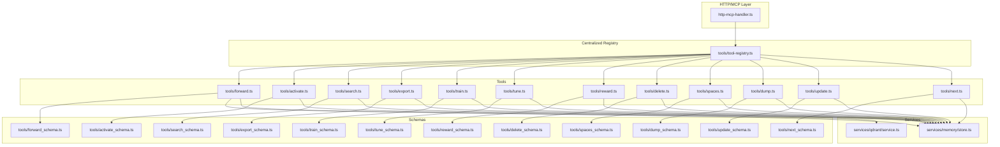

**Diagram sources**
- [src/http/http-mcp-handler.ts](file://src/http/http-mcp-handler.ts)
- [src/tools/tool-registry.ts](file://src/tools/tool-registry.ts)
- [src/tools/forward.ts](file://src/tools/forward.ts)
- [src/tools/activate.ts](file://src/tools/activate.ts)
- [src/tools/search.ts](file://src/tools/search.ts)
- [src/tools/export.ts](file://src/tools/export.ts)
- [src/tools/train.ts](file://src/tools/train.ts)
- [src/tools/tune.ts](file://src/tools/tune.ts)
- [src/tools/reward.ts](file://src/tools/reward.ts)
- [src/tools/delete.ts](file://src/tools/delete.ts)
- [src/tools/spaces.ts](file://src/tools/spaces.ts)
- [src/tools/dump.ts](file://src/tools/dump.ts)
- [src/tools/update.ts](file://src/tools/update.ts)
- [src/tools/next.ts](file://src/tools/next.ts)
- [src/tools/forward_schema.ts](file://src/tools/forward_schema.ts)
- [src/tools/activate_schema.ts](file://src/tools/activate_schema.ts)
- [src/tools/search_schema.ts](file://src/tools/search_schema.ts)
- [src/tools/export_schema.ts](file://src/tools/export_schema.ts)
- [src/tools/train_schema.ts](file://src/tools/train_schema.ts)
- [src/tools/tune_schema.ts](file://src/tools/tune_schema.ts)
- [src/tools/reward_schema.ts](file://src/tools/reward_schema.ts)
- [src/tools/delete_schema.ts](file://src/tools/delete_schema.ts)
- [src/tools/spaces_schema.ts](file://src/tools/spaces_schema.ts)
- [src/tools/dump_schema.ts](file://src/tools/dump_schema.ts)
- [src/tools/update_schema.ts](file://src/tools/update_schema.ts)
- [src/tools/next_schema.ts](file://src/tools/next_schema.ts)
- [src/services/memory/store.ts](file://src/services/memory/store.ts)
- [src/services/qdrant/service.ts](file://src/services/qdrant/service.ts)

**Section sources**
- [src/http/http-mcp-handler.ts](file://src/http/http-mcp-handler.ts)
- [src/tools/tool-registry.ts](file://src/tools/tool-registry.ts)
- [src/tools/forward.ts](file://src/tools/forward.ts)
- [src/tools/activate.ts](file://src/tools/activate.ts)
- [src/tools/search.ts](file://src/tools/search.ts)
- [src/tools/export.ts](file://src/tools/export.ts)
- [src/tools/train.ts](file://src/tools/train.ts)
- [src/tools/tune.ts](file://src/tools/tune.ts)
- [src/tools/reward.ts](file://src/tools/reward.ts)
- [src/tools/delete.ts](file://src/tools/delete.ts)
- [src/tools/spaces.ts](file://src/tools/spaces.ts)
- [src/tools/dump.ts](file://src/tools/dump.ts)
- [src/tools/update.ts](file://src/tools/update.ts)
- [src/tools/next.ts](file://src/tools/next.ts)
- [src/services/memory/store.ts](file://src/services/memory/store.ts)
- [src/services/qdrant/service.ts](file://src/services/qdrant/service.ts)

## Core Components
- **Centralized Tool Registry**: A new registry system that provides centralized management of all available tools and their metadata, enhancing tool discovery and registration mechanisms within the MCP ecosystem.
- Tool modules: Each tool is a module implementing an invocation function and exporting a corresponding JSON Schema. Examples include forward, activate, search, export, train, tune, reward, delete, spaces, dump, update, next.
- Schema definitions: Paired _schema.ts files define input contracts using JSON Schema. These schemas are used for validation and documentation.
- MCP handler: The HTTP/MCP handler routes incoming requests to the registry, which resolves and invokes tool implementations, validates inputs against schemas, and returns standardized responses.
- Service access: Tools interact with domain services like memory store and Qdrant for persistence and retrieval.

Key responsibilities:
- Centralized tool registration and metadata management
- Validate inputs against schemas before executing business logic
- Produce structured outputs conforming to expected shapes
- Propagate errors consistently to callers
- Provide observability via traces and metrics
- Enable dynamic tool discovery and listing

**Section sources**
- [src/tools/tool-registry.ts](file://src/tools/tool-registry.ts)
- [src/tools/forward.ts](file://src/tools/forward.ts)
- [src/tools/forward_schema.ts](file://src/tools/forward_schema.ts)
- [src/tools/activate.ts](file://src/tools/activate.ts)
- [src/tools/activate_schema.ts](file://src/tools/activate_schema.ts)
- [src/tools/search.ts](file://src/tools/search.ts)
- [src/tools/search_schema.ts](file://src/tools/search_schema.ts)
- [src/tools/export.ts](file://src/tools/export.ts)
- [src/tools/export_schema.ts](file://src/tools/export_schema.ts)
- [src/tools/train.ts](file://src/tools/train.ts)
- [src/tools/train_schema.ts](file://src/tools/train_schema.ts)
- [src/tools/tune.ts](file://src/tools/tune.ts)
- [src/tools/tune_schema.ts](file://src/tools/tune_schema.ts)
- [src/tools/reward.ts](file://src/tools/reward.ts)
- [src/tools/reward_schema.ts](file://src/tools/reward_schema.ts)
- [src/tools/delete.ts](file://src/tools/delete.ts)
- [src/tools/delete_schema.ts](file://src/tools/delete_schema.ts)
- [src/tools/spaces.ts](file://src/tools/spaces.ts)
- [src/tools/spaces_schema.ts](file://src/tools/spaces_schema.ts)
- [src/tools/dump.ts](file://src/tools/dump.ts)
- [src/tools/dump_schema.ts](file://src/tools/dump_schema.ts)
- [src/tools/update.ts](file://src/tools/update.ts)
- [src/tools/update_schema.ts](file://src/tools/update_schema.ts)
- [src/tools/next.ts](file://src/tools/next.ts)
- [src/tools/next_schema.ts](file://src/tools/next_schema.ts)
- [src/http/http-mcp-handler.ts](file://src/http/http-mcp-handler.ts)
- [src/services/memory/store.ts](file://src/services/memory/store.ts)
- [src/services/qdrant/service.ts](file://src/services/qdrant/service.ts)

## Architecture Overview
The new centralized tool registry system provides a single point of control for tool discovery, registration, and invocation. The registry maintains metadata about all available tools, handles dynamic registration, and coordinates tool resolution and execution. Inputs are validated against JSON Schemas, then passed to tool implementations through the registry. Tools may call services for data operations and return structured results. Errors are normalized and propagated back to clients.

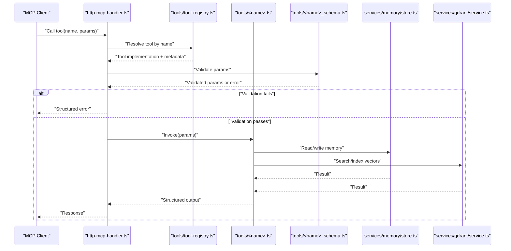

**Diagram sources**
- [src/http/http-mcp-handler.ts](file://src/http/http-mcp-handler.ts)
- [src/tools/tool-registry.ts](file://src/tools/tool-registry.ts)
- [src/tools/forward.ts](file://src/tools/forward.ts)
- [src/tools/forward_schema.ts](file://src/tools/forward_schema.ts)
- [src/services/memory/store.ts](file://src/services/memory/store.ts)
- [src/services/qdrant/service.ts](file://src/services/qdrant/service.ts)

## Tool Registry System

### Centralized Registration and Discovery
The new tool registry system provides centralized management of all available tools and their metadata. This enhances tool discovery and registration mechanisms within the MCP ecosystem by offering a single source of truth for tool information.

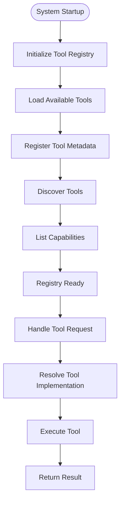

**Diagram sources**
- [src/tools/tool-registry.ts](file://src/tools/tool-registry.ts)

### Registry Features and Capabilities
The centralized registry system provides several key features:

- **Centralized Management**: Single point for all tool registration and metadata management
- **Dynamic Discovery**: Runtime tool discovery and listing capabilities
- **Metadata Management**: Comprehensive tool metadata including descriptions, versions, and dependencies
- **Registration API**: Programmatic tool registration and unregistration
- **Version Control**: Support for multiple tool versions and compatibility checking
- **Health Monitoring**: Registry health checks and tool status monitoring

### Registry Architecture
The registry follows a modular architecture that separates concerns between registration, discovery, and execution coordination.

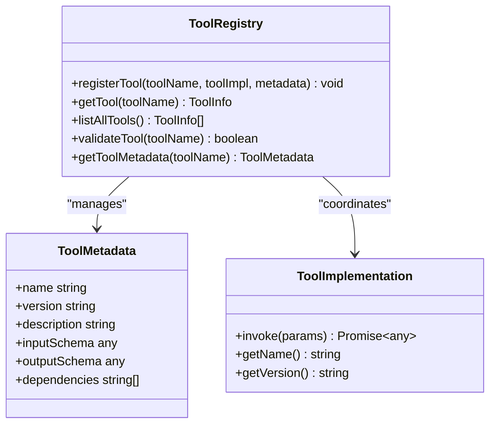

**Diagram sources**
- [src/tools/tool-registry.ts](file://src/tools/tool-registry.ts)

**Section sources**
- [src/tools/tool-registry.ts](file://src/tools/tool-registry.ts)

## Detailed Component Analysis

### Forward Tool
The forward tool orchestrates multi-step workflows, manages state transitions, and integrates with UI views and tracing.

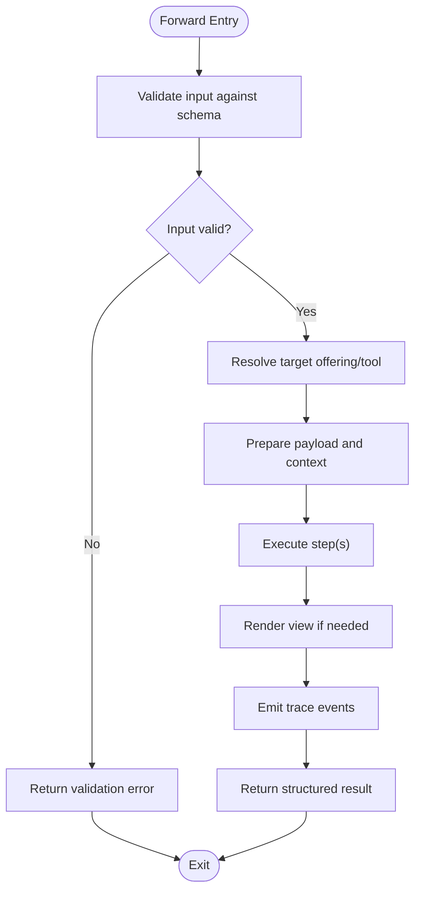

**Diagram sources**
- [src/tools/forward.ts](file://src/tools/forward.ts)
- [src/tools/forward_schema.ts](file://src/tools/forward_schema.ts)
- [src/tools/forward-helpers.ts](file://src/tools/forward-helpers.ts)
- [src/tools/forward-view.ts](file://src/tools/forward-view.ts)
- [src/tools/forward-trace.ts](file://src/tools/forward-trace.ts)
- [src/tools/forward-tool-error.ts](file://src/tools/forward-tool-error.ts)

**Section sources**
- [src/tools/forward.ts](file://src/tools/forward.ts)
- [src/tools/forward_schema.ts](file://src/tools/forward_schema.ts)
- [src/tools/forward-helpers.ts](file://src/tools/forward-helpers.ts)
- [src/tools/forward-view.ts](file://src/tools/forward-view.ts)
- [src/tools/forward-trace.ts](file://src/tools/forward-trace.ts)
- [src/tools/forward-tool-error.ts](file://src/tools/forward-tool-error.ts)

### Activate Tool
The activate tool initializes sessions and prepares contexts for subsequent interactions.

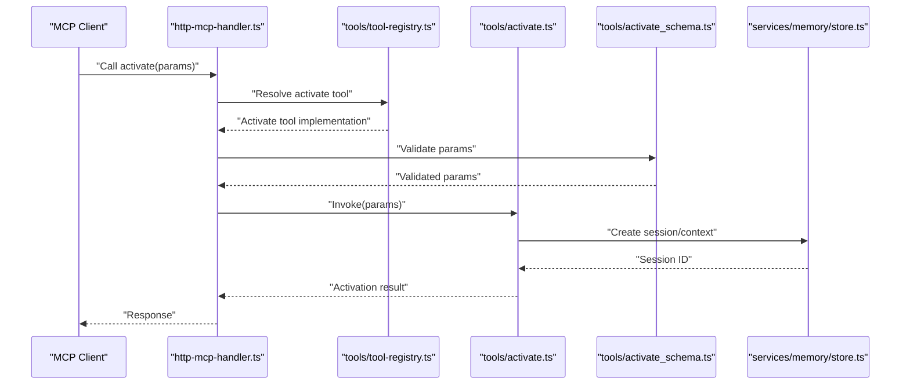

**Diagram sources**
- [src/tools/activate.ts](file://src/tools/activate.ts)
- [src/tools/activate_schema.ts](file://src/tools/activate_schema.ts)
- [src/tools/tool-registry.ts](file://src/tools/tool-registry.ts)
- [src/services/memory/store.ts](file://src/services/memory/store.ts)

**Section sources**
- [src/tools/activate.ts](file://src/tools/activate.ts)
- [src/tools/activate_schema.ts](file://src/tools/activate_schema.ts)
- [src/tools/tool-registry.ts](file://src/tools/tool-registry.ts)
- [src/services/memory/store.ts](file://src/services/memory/store.ts)

### Search Tool
The search tool queries memory and vector stores to retrieve relevant artifacts.

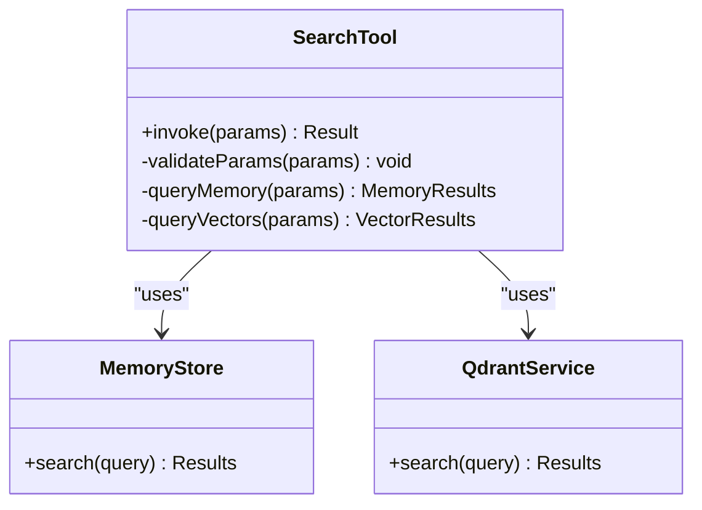

**Diagram sources**
- [src/tools/search.ts](file://src/tools/search.ts)
- [src/tools/search_schema.ts](file://src/tools/search_schema.ts)
- [src/services/memory/store.ts](file://src/services/memory/store.ts)
- [src/services/qdrant/service.ts](file://src/services/qdrant/service.ts)

**Section sources**
- [src/tools/search.ts](file://src/tools/search.ts)
- [src/tools/search_schema.ts](file://src/tools/search_schema.ts)
- [src/services/memory/store.ts](file://src/services/memory/store.ts)
- [src/services/qdrant/service.ts](file://src/services/qdrant/service.ts)

### Export Tool
The export tool packages artifacts and metadata into bundles for distribution.

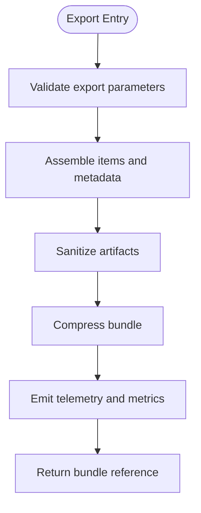

**Diagram sources**
- [src/tools/export.ts](file://src/tools/export.ts)
- [src/tools/export_schema.ts](file://src/tools/export_schema.ts)

**Section sources**
- [src/tools/export.ts](file://src/tools/export.ts)
- [src/tools/export_schema.ts](file://src/tools/export_schema.ts)

### Train Tool
The train tool ingests artifacts, computes embeddings, and updates indexes.

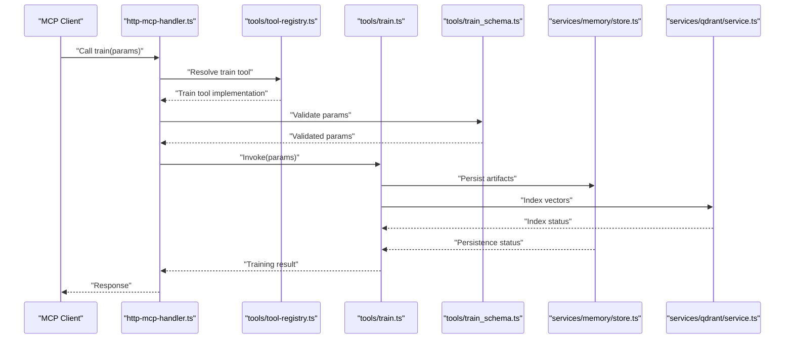

**Diagram sources**
- [src/tools/train.ts](file://src/tools/train.ts)
- [src/tools/train_schema.ts](file://src/tools/train_schema.ts)
- [src/tools/tool-registry.ts](file://src/tools/tool-registry.ts)
- [src/services/memory/store.ts](file://src/services/memory/store.ts)
- [src/services/qdrant/service.ts](file://src/services/qdrant/service.ts)

**Section sources**
- [src/tools/train.ts](file://src/tools/train.ts)
- [src/tools/train_schema.ts](file://src/tools/train_schema.ts)
- [src/tools/tool-registry.ts](file://src/tools/tool-registry.ts)
- [src/services/memory/store.ts](file://src/services/memory/store.ts)
- [src/services/qdrant/service.ts](file://src/services/qdrant/service.ts)

### Tune Tool
The tune tool executes tuning jobs, verifies outcomes, and invalidates caches when necessary.

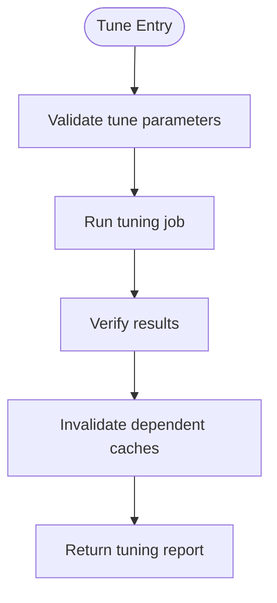

**Diagram sources**
- [src/tools/tune.ts](file://src/tools/tune.ts)
- [src/tools/tune_schema.ts](file://src/tools/tune_schema.ts)
- [src/tools/tune-execute.ts](file://src/tools/tune-execute.ts)
- [src/tools/tune-verify.ts](file://src/tools/tune-verify.ts)
- [src/tools/tune-cache-invalidation.ts](file://src/tools/tune-cache-invalidation.ts)

**Section sources**
- [src/tools/tune.ts](file://src/tools/tune.ts)
- [src/tools/tune_schema.ts](file://src/tools/tune_schema.ts)
- [src/tools/tune-execute.ts](file://src/tools/tune-execute.ts)
- [src/tools/tune-verify.ts](file://src/tools/tune-verify.ts)
- [src/tools/tune-cache-invalidation.ts](file://src/tools/tune-cache-invalidation.ts)

### Reward Tool
The reward tool records feedback and propagates rewards across related artifacts.

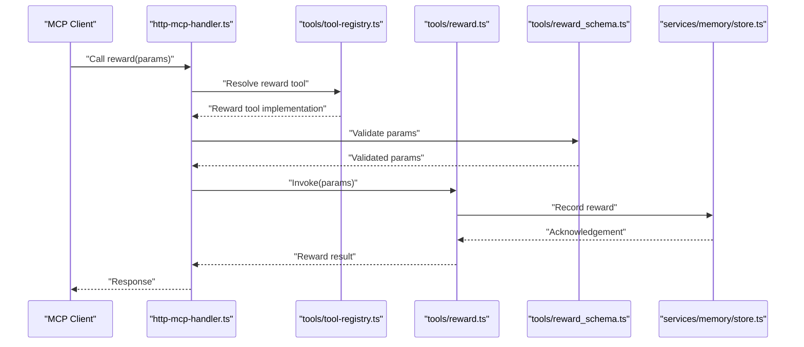

**Diagram sources**
- [src/tools/reward.ts](file://src/tools/reward.ts)
- [src/tools/reward_schema.ts](file://src/tools/reward_schema.ts)
- [src/tools/tool-registry.ts](file://src/tools/tool-registry.ts)
- [src/services/memory/store.ts](file://src/services/memory/store.ts)

**Section sources**
- [src/tools/reward.ts](file://src/tools/reward.ts)
- [src/tools/reward_schema.ts](file://src/tools/reward_schema.ts)
- [src/tools/tool-registry.ts](file://src/tools/tool-registry.ts)
- [src/services/memory/store.ts](file://src/services/memory/store.ts)

### Delete, Spaces, Dump, Update, Next Tools
These tools manage resources, list spaces, dump states, update configurations, and compute next steps. They follow the same pattern: validate inputs via schemas, perform operations on services, and return structured outputs. All tools are now managed through the centralized registry system.

**Section sources**
- [src/tools/delete.ts](file://src/tools/delete.ts)
- [src/tools/delete_schema.ts](file://src/tools/delete_schema.ts)
- [src/tools/spaces.ts](file://src/tools/spaces.ts)
- [src/tools/spaces_schema.ts](file://src/tools/spaces_schema.ts)
- [src/tools/dump.ts](file://src/tools/dump.ts)
- [src/tools/dump_schema.ts](file://src/tools/dump_schema.ts)
- [src/tools/update.ts](file://src/tools/update.ts)
- [src/tools/update_schema.ts](file://src/tools/update_schema.ts)
- [src/tools/next.ts](file://src/tools/next.ts)
- [src/tools/next_schema.ts](file://src/tools/next_schema.ts)
- [src/tools/tool-registry.ts](file://src/tools/tool-registry.ts)

### Schema Validation and JSON Schema Utilities
Schema files define strict input contracts. A utility converts Zod schemas to JSON Schema for consistent validation and documentation. The registry system integrates with schema validation to ensure proper tool contract enforcement.

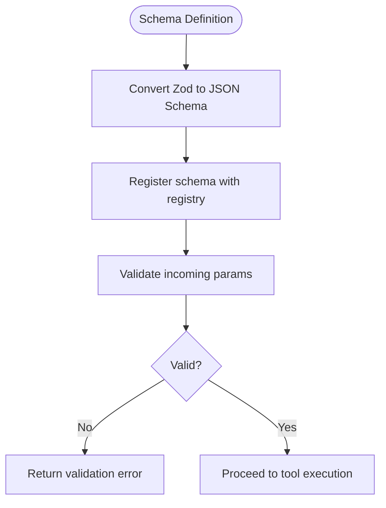

**Diagram sources**
- [src/utils/zod-to-jsonschema.ts](file://src/utils/zod-to-jsonschema.ts)
- [src/tools/tool-registry.ts](file://src/tools/tool-registry.ts)
- [src/tools/forward_schema.ts](file://src/tools/forward_schema.ts)
- [src/tools/activate_schema.ts](file://src/tools/activate_schema.ts)
- [src/tools/search_schema.ts](file://src/tools/search_schema.ts)
- [src/tools/export_schema.ts](file://src/tools/export_schema.ts)
- [src/tools/train_schema.ts](file://src/tools/train_schema.ts)
- [src/tools/tune_schema.ts](file://src/tools/tune_schema.ts)
- [src/tools/reward_schema.ts](file://src/tools/reward_schema.ts)
- [src/tools/delete_schema.ts](file://src/tools/delete_schema.ts)
- [src/tools/spaces_schema.ts](file://src/tools/spaces_schema.ts)
- [src/tools/dump_schema.ts](file://src/tools/dump_schema.ts)
- [src/tools/update_schema.ts](file://src/tools/update_schema.ts)
- [src/tools/next_schema.ts](file://src/tools/next_schema.ts)

**Section sources**
- [src/utils/zod-to-jsonschema.ts](file://src/utils/zod-to-jsonschema.ts)
- [src/tools/tool-registry.ts](file://src/tools/tool-registry.ts)
- [src/tools/forward_schema.ts](file://src/tools/forward_schema.ts)
- [src/tools/activate_schema.ts](file://src/tools/activate_schema.ts)
- [src/tools/search_schema.ts](file://src/tools/search_schema.ts)
- [src/tools/export_schema.ts](file://src/tools/export_schema.ts)
- [src/tools/train_schema.ts](file://src/tools/train_schema.ts)
- [src/tools/tune_schema.ts](file://src/tools/tune_schema.ts)
- [src/tools/reward_schema.ts](file://src/tools/reward_schema.ts)
- [src/tools/delete_schema.ts](file://src/tools/delete_schema.ts)
- [src/tools/spaces_schema.ts](file://src/tools/spaces_schema.ts)
- [src/tools/dump_schema.ts](file://src/tools/dump_schema.ts)
- [src/tools/update_schema.ts](file://src/tools/update_schema.ts)
- [src/tools/next_schema.ts](file://src/tools/next_schema.ts)

### Error Handling and Runtime Errors
Tools use a consistent error model to propagate failures back to clients. The runtime error type standardizes messages and codes. The registry system ensures consistent error handling across all registered tools.

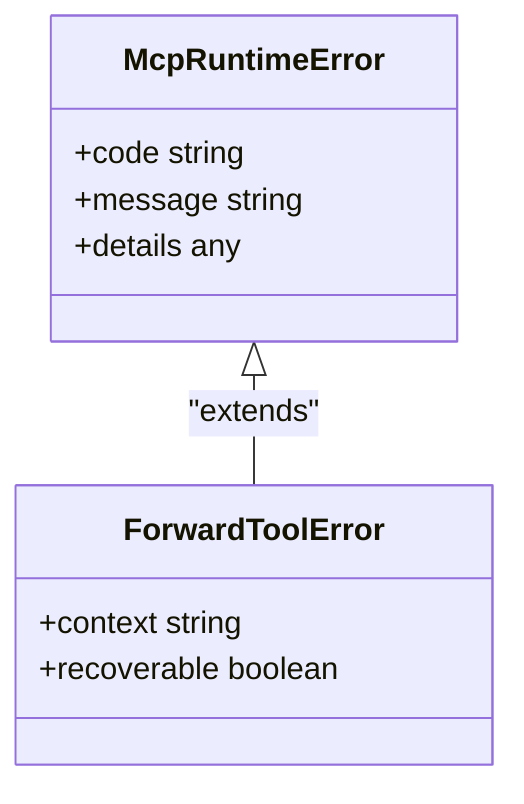

**Diagram sources**
- [src/tools/mcp-runtime-error.ts](file://src/tools/mcp-runtime-error.ts)
- [src/tools/forward-tool-error.ts](file://src/tools/forward-tool-error.ts)

**Section sources**
- [src/tools/mcp-runtime-error.ts](file://src/tools/mcp-runtime-error.ts)
- [src/tools/forward-tool-error.ts](file://src/tools/forward-tool-error.ts)

### Teaching and Guidance for Tool Inputs
A teaching utility provides guidance and examples for tool inputs, improving developer experience and reducing validation errors. This utility works seamlessly with the registry system to provide contextual help for registered tools.

**Section sources**
- [src/tools/mcp-tool-input-teaching.ts](file://src/tools/mcp-tool-input-teaching.ts)

## Dependency Analysis
The new registry system centralizes tool dependencies and provides better visibility into tool relationships. Tools depend on schemas for validation and on services for data operations. The MCP handler coordinates resolution through the registry, which manages tool invocations.

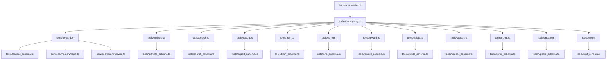

**Diagram sources**
- [src/http/http-mcp-handler.ts](file://src/http/http-mcp-handler.ts)
- [src/tools/tool-registry.ts](file://src/tools/tool-registry.ts)
- [src/tools/forward.ts](file://src/tools/forward.ts)
- [src/tools/activate.ts](file://src/tools/activate.ts)
- [src/tools/search.ts](file://src/tools/search.ts)
- [src/tools/export.ts](file://src/tools/export.ts)
- [src/tools/train.ts](file://src/tools/train.ts)
- [src/tools/tune.ts](file://src/tools/tune.ts)
- [src/tools/reward.ts](file://src/tools/reward.ts)
- [src/tools/delete.ts](file://src/tools/delete.ts)
- [src/tools/spaces.ts](file://src/tools/spaces.ts)
- [src/tools/dump.ts](file://src/tools/dump.ts)
- [src/tools/update.ts](file://src/tools/update.ts)
- [src/tools/next.ts](file://src/tools/next.ts)
- [src/tools/forward_schema.ts](file://src/tools/forward_schema.ts)
- [src/tools/activate_schema.ts](file://src/tools/activate_schema.ts)
- [src/tools/search_schema.ts](file://src/tools/search_schema.ts)
- [src/tools/export_schema.ts](file://src/tools/export_schema.ts)
- [src/tools/train_schema.ts](file://src/tools/train_schema.ts)
- [src/tools/tune_schema.ts](file://src/tools/tune_schema.ts)
- [src/tools/reward_schema.ts](file://src/tools/reward_schema.ts)
- [src/tools/delete_schema.ts](file://src/tools/delete_schema.ts)
- [src/tools/spaces_schema.ts](file://src/tools/spaces_schema.ts)
- [src/tools/dump_schema.ts](file://src/tools/dump_schema.ts)
- [src/tools/update_schema.ts](file://src/tools/update_schema.ts)
- [src/tools/next_schema.ts](file://src/tools/next_schema.ts)
- [src/services/memory/store.ts](file://src/services/memory/store.ts)
- [src/services/qdrant/service.ts](file://src/services/qdrant/service.ts)

**Section sources**
- [src/http/http-mcp-handler.ts](file://src/http/http-mcp-handler.ts)
- [src/tools/tool-registry.ts](file://src/tools/tool-registry.ts)
- [src/tools/forward.ts](file://src/tools/forward.ts)
- [src/tools/activate.ts](file://src/tools/activate.ts)
- [src/tools/search.ts](file://src/tools/search.ts)
- [src/tools/export.ts](file://src/tools/export.ts)
- [src/tools/train.ts](file://src/tools/train.ts)
- [src/tools/tune.ts](file://src/tools/tune.ts)
- [src/tools/reward.ts](file://src/tools/reward.ts)
- [src/tools/delete.ts](file://src/tools/delete.ts)
- [src/tools/spaces.ts](file://src/tools/spaces.ts)
- [src/tools/dump.ts](file://src/tools/dump.ts)
- [src/tools/update.ts](file://src/tools/update.ts)
- [src/tools/next.ts](file://src/tools/next.ts)
- [src/services/memory/store.ts](file://src/services/memory/store.ts)
- [src/services/qdrant/service.ts](file://src/services/qdrant/service.ts)

## Performance Considerations
- **Registry Caching**: The centralized registry can cache tool metadata and implementations for faster discovery
- Batch operations: Prefer batching writes and reads to reduce round trips to services.
- Indexing efficiency: Optimize vector indexing and search queries; consider pre-filtering and pagination.
- Caching: Leverage cache invalidation strategies (e.g., after tuning) to avoid recomputation.
- Concurrency limits: Apply concurrency controls to prevent resource exhaustion during heavy workloads.
- Telemetry: Emit metrics and traces for critical paths to identify bottlenecks.
- **Registry Health Monitoring**: Monitor registry performance and tool availability metrics

[No sources needed since this section provides general guidance]

## Troubleshooting Guide
- **Registry Issues**: Check registry initialization and tool registration status
- Validation errors: Check schema definitions and ensure inputs match expected types and constraints.
- Runtime errors: Inspect standardized error objects for codes and messages; use teaching utilities to refine inputs.
- Tracing: Use trace emissions to reconstruct execution flows and pinpoint failures.
- Integration tests: Run integration tests to verify end-to-end behavior and error paths.
- **Tool Discovery Problems**: Verify tool registration and metadata completeness

**Section sources**
- [src/tools/tool-registry.ts](file://src/tools/tool-registry.ts)
- [src/tools/mcp-tool-input-teaching.ts](file://src/tools/mcp-tool-input-teaching.ts)
- [src/tools/mcp-runtime-error.ts](file://src/tools/mcp-runtime-error.ts)
- [src/tools/forward-trace.ts](file://src/tools/forward-trace.ts)
- [tests/integration/mcp-list-tools.test.ts](file://tests/integration/mcp-list-tools.test.ts)
- [tests/unit/mcp-tool-input-teaching.test.ts](file://tests/unit/mcp-tool-input-teaching.test.ts)

## Conclusion
The tool development and registry system emphasizes clear contracts via JSON Schema, consistent error handling, and strong integration with services. The new centralized tool registry system enhances tool discovery and management capabilities, providing a single point of control for all tool operations. By following the patterns outlined here—validating inputs early, returning structured outputs, emitting traces, leveraging teaching utilities, and utilizing the centralized registry—you can build reliable tools that scale and remain maintainable.

[No sources needed since this section summarizes without analyzing specific files]

## Appendices

### Creating Custom Tools with Registry Integration
- Define a new tool module under src/tools with an invoke function and a paired _schema.ts file.
- Register the tool with the centralized registry system using the registry's registration API.
- Ensure the MCP handler uses the registry for tool resolution instead of direct imports.
- Implement validation using the schema utility and handle errors with the runtime error model.
- Add unit and integration tests to cover happy paths, edge cases, and error scenarios.
- Test registry integration including tool discovery and metadata validation.

**Section sources**
- [src/tools/tool-registry.ts](file://src/tools/tool-registry.ts)
- [src/tools/forward.ts](file://src/tools/forward.ts)
- [src/tools/forward_schema.ts](file://src/tools/forward_schema.ts)
- [src/utils/zod-to-jsonschema.ts](file://src/utils/zod-to-jsonschema.ts)
- [src/tools/mcp-runtime-error.ts](file://src/tools/mcp-runtime-error.ts)
- [tests/integration/mcp-list-tools.test.ts](file://tests/integration/mcp-list-tools.test.ts)

### Versioning and Backward Compatibility
- Maintain schema versions and deprecation policies to support gradual upgrades.
- Use version checks in tool invocations to route to compatible implementations.
- Document breaking changes and migration steps in tool documentation.
- **Registry Version Management**: Utilize registry versioning capabilities for tool compatibility management.

[No sources needed since this section provides general guidance]

### Distribution Patterns
- Package tools as part of skill bundles or extensions.
- Provide manifests describing tool capabilities, schemas, and dependencies.
- Distribute via registries or catalogs and validate installations with integration tests.
- **Registry-Based Distribution**: Leverage the centralized registry for tool distribution and discovery.

[No sources needed since this section provides general guidance]

### Registry Migration Guide
For teams migrating from direct tool imports to the centralized registry system:

1. **Update Tool Imports**: Replace direct imports with registry-based tool resolution
2. **Register Tool Metadata**: Ensure all tools have complete metadata in the registry
3. **Update Tests**: Modify tests to use registry-based tool discovery
4. **Monitor Migration**: Track registry usage and tool availability during transition

**Section sources**
- [src/tools/tool-registry.ts](file://src/tools/tool-registry.ts)
- [src/http/http-mcp-handler.ts](file://src/http/http-mcp-handler.ts)