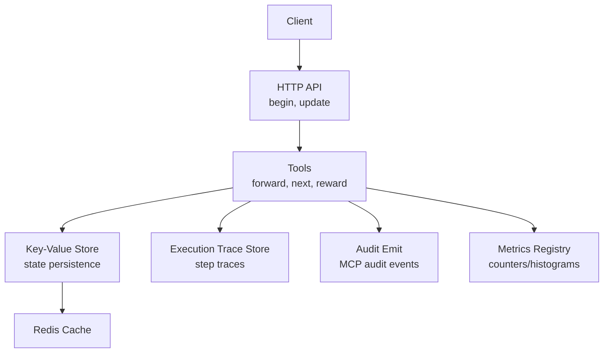
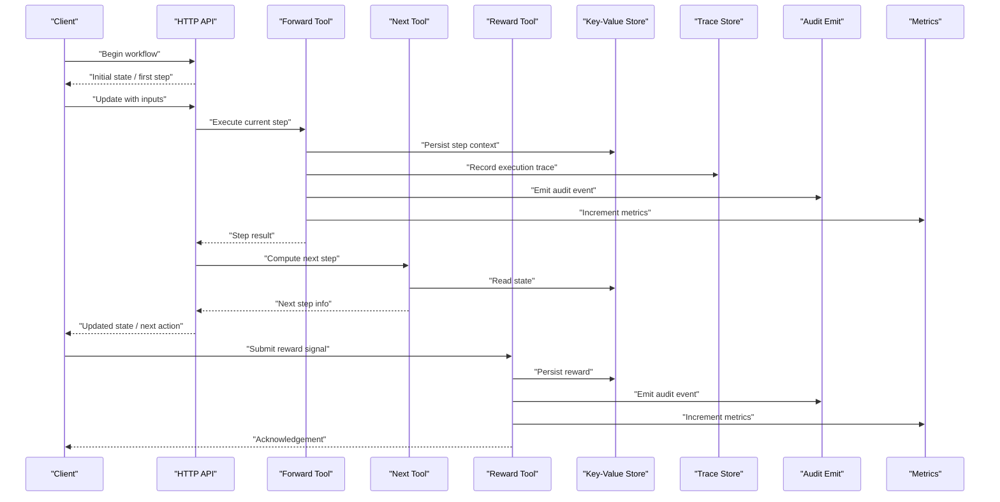
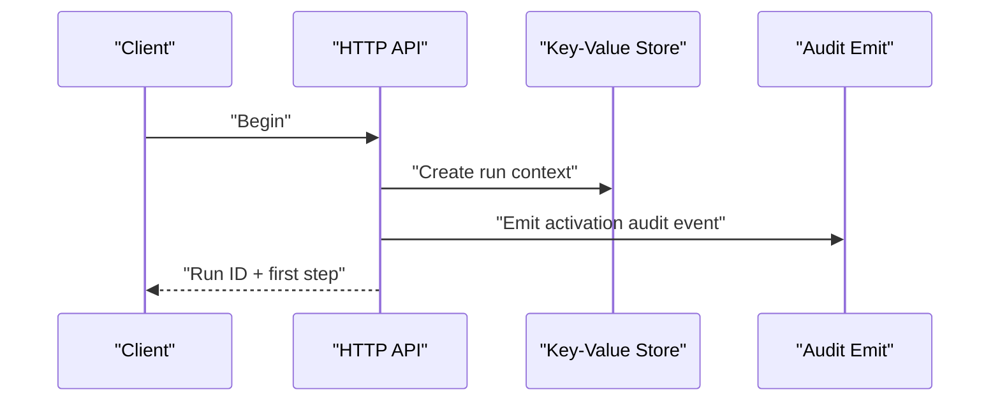
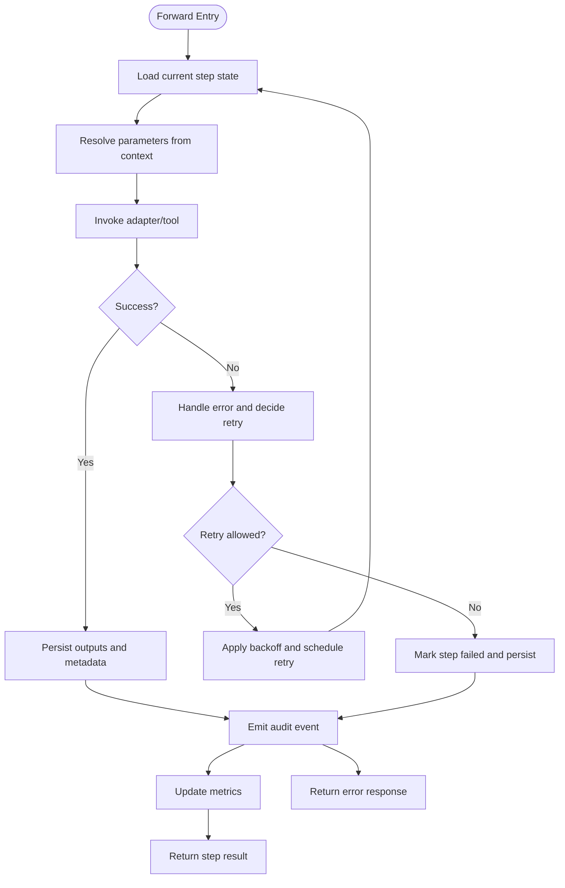
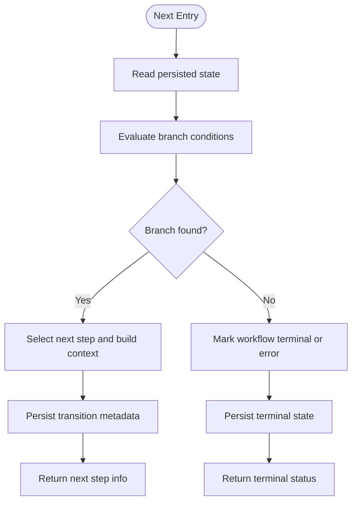
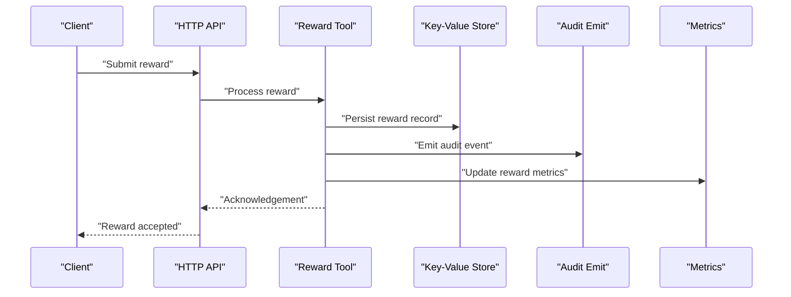
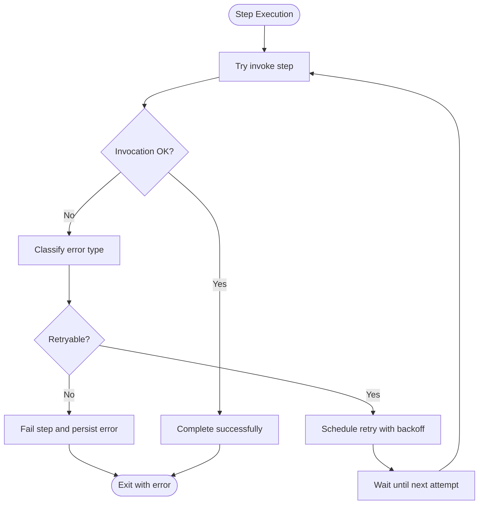
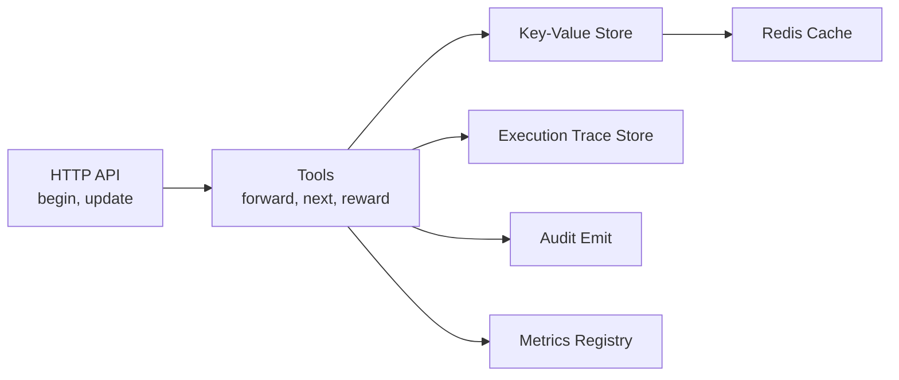

# Workflow Orchestration Engine

<cite>
**Referenced Files in This Document**
- [workflow-activate.md](file://docs/architecture/workflow-activate.md)
- [workflow-forward-first-call.md](file://docs/architecture/workflow-forward-first-call.md)
- [workflow-forward-continue.md](file://docs/architecture/workflow-forward-continue.md)
- [workflow-reward.md](file://docs/architecture/workflow-reward.md)
- [http-api-begin.ts](file://src/http/http-api-begin.ts)
- [http-api-update.ts](file://src/http/http-api-update.ts)
- [tools/forward.ts](file://src/tools/forward.ts)
- [tools/next.ts](file://src/tools/next.ts)
- [tools/reward.ts](file://src/tools/reward.ts)
- [services/execution-trace-store.ts](file://src/services/execution-trace-store.ts)
- [utils/audit-log-events.ts](file://src/utils/audit-log-events.ts)
- [mcp-audit-emit.ts](file://src/http/mcp-audit-emit.ts)
- [services/key-value-store-factory.ts](file://src/services/key-value-store-factory.ts)
- [services/key-value-store.ts](file://src/services/key-value-store.ts)
- [services/redis-cache.ts](file://src/services/redis-cache.ts)
- [services/concurrency-limit.ts](file://src/utils/concurrency-limit.ts)
- [services/metrics/registry.ts](file://src/services/metrics/registry.ts)
</cite>

## Table of Contents
1. [Introduction](#introduction)
2. [Project Structure](#project-structure)
3. [Core Components](#core-components)
4. [Architecture Overview](#architecture-overview)
5. [Detailed Component Analysis](#detailed-component-analysis)
6. [Dependency Analysis](#dependency-analysis)
7. [Performance Considerations](#performance-considerations)
8. [Troubleshooting Guide](#troubleshooting-guide)
9. [Conclusion](#conclusion)
10. [Appendices](#appendices)

## Introduction
This document explains the workflow orchestration engine’s lifecycle, state management, persistence and recovery, and operational patterns such as activate-forward-reward, conditional branching, error handling with retries, and audit logging. It also covers workflow definition formats, step execution context, parameter passing between steps, monitoring, examples, debugging techniques, performance optimization, concurrent execution, and scaling considerations.

## Project Structure
The workflow orchestration spans HTTP endpoints, tool implementations, services for persistence and tracing, and utilities for auditing and metrics. The key areas are:
- HTTP API layer that exposes workflow operations (begin/update)
- Tool layer implementing forward, next, and reward semantics
- Persistence and tracing services for state and audit data
- Concurrency control and metrics instrumentation

**Diagram sources**
- [http-api-begin.ts](file://src/http/http-api-begin.ts)
- [http-api-update.ts](file://src/http/http-api-update.ts)
- [tools/forward.ts](file://src/tools/forward.ts)
- [tools/next.ts](file://src/tools/next.ts)
- [tools/reward.ts](file://src/tools/reward.ts)
- [services/key-value-store-factory.ts](file://src/services/key-value-store-factory.ts)
- [services/key-value-store.ts](file://src/services/key-value-store.ts)
- [services/redis-cache.ts](file://src/services/redis-cache.ts)
- [services/execution-trace-store.ts](file://src/services/execution-trace-store.ts)
- [mcp-audit-emit.ts](file://src/http/mcp-audit-emit.ts)
- [services/metrics/registry.ts](file://src/services/metrics/registry.ts)

**Section sources**
- [http-api-begin.ts](file://src/http/http-api-begin.ts)
- [http-api-update.ts](file://src/http/http-api-update.ts)
- [tools/forward.ts](file://src/tools/forward.ts)
- [tools/next.ts](file://src/tools/next.ts)
- [tools/reward.ts](file://src/tools/reward.ts)
- [services/key-value-store-factory.ts](file://src/services/key-value-store-factory.ts)
- [services/key-value-store.ts](file://src/services/key-value-store.ts)
- [services/redis-cache.ts](file://src/services/redis-cache.ts)
- [services/execution-trace-store.ts](file://src/services/execution-trace-store.ts)
- [mcp-audit-emit.ts](file://src/http/mcp-audit-emit.ts)
- [services/metrics/registry.ts](file://src/services/metrics/registry.ts)

## Core Components
- HTTP API Layer
  - begin: Initializes a new workflow run and returns initial state or first step instructions.
  - update: Advances workflow state by applying user input or system actions to move from one step to the next.
- Tools Layer
  - forward: Executes the current step, resolves parameters, invokes adapters/tools, and persists outputs.
  - next: Determines the next step based on current state and conditions; supports branching.
  - reward: Records evaluation signals and propagates feedback into the system.
- Persistence and Tracing
  - Key-Value Store: Durable state storage for workflow runs and step contexts.
  - Execution Trace Store: Captures per-step execution details for observability and debugging.
- Auditing and Metrics
  - MCP Audit Emit: Emits structured audit events for compliance and traceability.
  - Metrics Registry: Exposes counters and histograms for monitoring.

**Section sources**
- [http-api-begin.ts](file://src/http/http-api-begin.ts)
- [http-api-update.ts](file://src/http/http-api-update.ts)
- [tools/forward.ts](file://src/tools/forward.ts)
- [tools/next.ts](file://src/tools/next.ts)
- [tools/reward.ts](file://src/tools/reward.ts)
- [services/key-value-store-factory.ts](file://src/services/key-value-store-factory.ts)
- [services/key-value-store.ts](file://src/services/key-value-store.ts)
- [services/execution-trace-store.ts](file://src/services/execution-trace-store.ts)
- [mcp-audit-emit.ts](file://src/http/mcp-audit-emit.ts)
- [services/metrics/registry.ts](file://src/services/metrics/registry.ts)

## Architecture Overview
The orchestration follows an event-driven, state-machine-like flow:
- Activate begins a run and establishes initial context.
- Forward executes the active step, producing outputs and side effects.
- Next computes the subsequent step using conditions and previous outputs.
- Reward records evaluation outcomes and may influence future routing or scoring.

**Diagram sources**
- [http-api-begin.ts](file://src/http/http-api-begin.ts)
- [http-api-update.ts](file://src/http/http-api-update.ts)
- [tools/forward.ts](file://src/tools/forward.ts)
- [tools/next.ts](file://src/tools/next.ts)
- [tools/reward.ts](file://src/tools/reward.ts)
- [services/key-value-store-factory.ts](file://src/services/key-value-store-factory.ts)
- [services/key-value-store.ts](file://src/services/key-value-store.ts)
- [services/execution-trace-store.ts](file://src/services/execution-trace-store.ts)
- [mcp-audit-emit.ts](file://src/http/mcp-audit-emit.ts)
- [services/metrics/registry.ts](file://src/services/metrics/registry.ts)

## Detailed Component Analysis

### Workflow States and Lifecycle
- States include initialization, active step execution, waiting for user/system input, completion, and terminal error states.
- Transitions are driven by update calls that apply inputs and compute the next step via the next tool.
- State is persisted after each transition to ensure durability and recoverability.

Practical example references:
- [workflow-activate.md](file://docs/architecture/workflow-activate.md)
- [workflow-forward-first-call.md](file://docs/architecture/workflow-forward-first-call.md)
- [workflow-forward-continue.md](file://docs/architecture/workflow-forward-continue.md)
- [workflow-reward.md](file://docs/architecture/workflow-reward.md)

**Section sources**
- [workflow-activate.md](file://docs/architecture/workflow-activate.md)
- [workflow-forward-first-call.md](file://docs/architecture/workflow-forward-first-call.md)
- [workflow-forward-continue.md](file://docs/architecture/workflow-forward-continue.md)
- [workflow-reward.md](file://docs/architecture/workflow-reward.md)

### Activation Flow
- Begin initializes a new run, sets up context, and returns the first actionable step.
- The client then proceeds with forward calls to execute steps.

**Diagram sources**
- [http-api-begin.ts](file://src/http/http-api-begin.ts)
- [services/key-value-store-factory.ts](file://src/services/key-value-store-factory.ts)
- [services/key-value-store.ts](file://src/services/key-value-store.ts)
- [mcp-audit-emit.ts](file://src/http/mcp-audit-emit.ts)

**Section sources**
- [http-api-begin.ts](file://src/http/http-api-begin.ts)
- [services/key-value-store-factory.ts](file://src/services/key-value-store-factory.ts)
- [services/key-value-store.ts](file://src/services/key-value-store.ts)
- [mcp-audit-emit.ts](file://src/http/mcp-audit-emit.ts)

### Forward Step Execution
- Forward executes the current step, resolves parameters, invokes adapters/tools, and persists outputs.
- Supports retry logic and error handling, emitting audit events and metrics.

**Diagram sources**
- [tools/forward.ts](file://src/tools/forward.ts)
- [services/key-value-store-factory.ts](file://src/services/key-value-store-factory.ts)
- [services/key-value-store.ts](file://src/services/key-value-store.ts)
- [services/execution-trace-store.ts](file://src/services/execution-trace-store.ts)
- [mcp-audit-emit.ts](file://src/http/mcp-audit-emit.ts)
- [services/metrics/registry.ts](file://src/services/metrics/registry.ts)

**Section sources**
- [tools/forward.ts](file://src/tools/forward.ts)
- [services/key-value-store-factory.ts](file://src/services/key-value-store-factory.ts)
- [services/key-value-store.ts](file://src/services/key-value-store.ts)
- [services/execution-trace-store.ts](file://src/services/execution-trace-store.ts)
- [mcp-audit-emit.ts](file://src/http/mcp-audit-emit.ts)
- [services/metrics/registry.ts](file://src/services/metrics/registry.ts)

### Conditional Branching and Next Step Resolution
- Next evaluates conditions based on current state and previous outputs to determine the next step.
- Supports multiple branches and decision trees defined in workflow definitions.

**Diagram sources**
- [tools/next.ts](file://src/tools/next.ts)
- [services/key-value-store-factory.ts](file://src/services/key-value-store-factory.ts)
- [services/key-value-store.ts](file://src/services/key-value-store.ts)

**Section sources**
- [tools/next.ts](file://src/tools/next.ts)
- [services/key-value-store-factory.ts](file://src/services/key-value-store-factory.ts)
- [services/key-value-store.ts](file://src/services/key-value-store.ts)

### Reward Handling
- Reward records evaluation signals, persists them, emits audit events, and updates metrics.
- Can influence future routing or scoring depending on configuration.

**Diagram sources**
- [tools/reward.ts](file://src/tools/reward.ts)
- [services/key-value-store-factory.ts](file://src/services/key-value-store-factory.ts)
- [services/key-value-store.ts](file://src/services/key-value-store.ts)
- [mcp-audit-emit.ts](file://src/http/mcp-audit-emit.ts)
- [services/metrics/registry.ts](file://src/services/metrics/registry.ts)

**Section sources**
- [tools/reward.ts](file://src/tools/reward.ts)
- [services/key-value-store-factory.ts](file://src/services/key-value-store-factory.ts)
- [services/key-value-store.ts](file://src/services/key-value-store.ts)
- [mcp-audit-emit.ts](file://src/http/mcp-audit-emit.ts)
- [services/metrics/registry.ts](file://src/services/metrics/registry.ts)

### Error Handling and Retry Logic
- Errors during step execution are captured and logged.
- Retry policies can be applied with exponential backoff and maximum attempts.
- Failed transitions are persisted to allow inspection and recovery.

[No sources needed since this diagram shows conceptual workflow, not actual code structure]

### Audit Logging
- Structured audit events are emitted for activation, step execution, rewards, and errors.
- Events are persisted and queryable for compliance and debugging.

**Section sources**
- [mcp-audit-emit.ts](file://src/http/mcp-audit-emit.ts)
- [utils/audit-log-events.ts](file://src/utils/audit-log-events.ts)

### Monitoring Capabilities
- Metrics registry provides counters and histograms for operational visibility.
- Execution traces capture detailed per-step information for diagnostics.

**Section sources**
- [services/metrics/registry.ts](file://src/services/metrics/registry.ts)
- [services/execution-trace-store.ts](file://src/services/execution-trace-store.ts)

## Dependency Analysis
The following diagram maps core dependencies among components:

**Diagram sources**
- [http-api-begin.ts](file://src/http/http-api-begin.ts)
- [http-api-update.ts](file://src/http/http-api-update.ts)
- [tools/forward.ts](file://src/tools/forward.ts)
- [tools/next.ts](file://src/tools/next.ts)
- [tools/reward.ts](file://src/tools/reward.ts)
- [services/key-value-store-factory.ts](file://src/services/key-value-store-factory.ts)
- [services/key-value-store.ts](file://src/services/key-value-store.ts)
- [services/redis-cache.ts](file://src/services/redis-cache.ts)
- [services/execution-trace-store.ts](file://src/services/execution-trace-store.ts)
- [mcp-audit-emit.ts](file://src/http/mcp-audit-emit.ts)
- [services/metrics/registry.ts](file://src/services/metrics/registry.ts)

**Section sources**
- [http-api-begin.ts](file://src/http/http-api-begin.ts)
- [http-api-update.ts](file://src/http/http-api-update.ts)
- [tools/forward.ts](file://src/tools/forward.ts)
- [tools/next.ts](file://src/tools/next.ts)
- [tools/reward.ts](file://src/tools/reward.ts)
- [services/key-value-store-factory.ts](file://src/services/key-value-store-factory.ts)
- [services/key-value-store.ts](file://src/services/key-value-store.ts)
- [services/redis-cache.ts](file://src/services/redis-cache.ts)
- [services/execution-trace-store.ts](file://src/services/execution-trace-store.ts)
- [mcp-audit-emit.ts](file://src/http/mcp-audit-emit.ts)
- [services/metrics/registry.ts](file://src/services/metrics/registry.ts)

## Performance Considerations
- Concurrency Control
  - Use concurrency limits to prevent overload when invoking external tools or adapters.
- Caching
  - Leverage Redis-backed cache for frequently accessed state and results to reduce latency.
- Metrics and Tracing
  - Instrument hot paths with metrics and traces to identify bottlenecks.
- Batch Operations
  - Where possible, batch writes to persistence layers to reduce overhead.

**Section sources**
- [services/concurrency-limit.ts](file://src/utils/concurrency-limit.ts)
- [services/redis-cache.ts](file://src/services/redis-cache.ts)
- [services/metrics/registry.ts](file://src/services/metrics/registry.ts)
- [services/execution-trace-store.ts](file://src/services/execution-trace-store.ts)

## Troubleshooting Guide
- Inspect execution traces for step-level details and failures.
- Review audit logs for compliance and timeline reconstruction.
- Check metrics for error rates, latency spikes, and throughput anomalies.
- Validate state persistence integrity by querying the key-value store.

**Section sources**
- [services/execution-trace-store.ts](file://src/services/execution-trace-store.ts)
- [mcp-audit-emit.ts](file://src/http/mcp-audit-emit.ts)
- [services/metrics/registry.ts](file://src/services/metrics/registry.ts)
- [services/key-value-store.ts](file://src/services/key-value-store.ts)

## Conclusion
The workflow orchestration engine provides a robust, observable, and auditable framework for executing multi-step workflows. Its design emphasizes durable state management, clear separation of concerns across HTTP, tools, and services, and comprehensive monitoring and auditing capabilities. By leveraging conditional branching, retry logic, and concurrency controls, it supports complex workflows at scale while maintaining reliability and transparency.

## Appendices

### Workflow Definition Formats
- Definitions describe steps, conditions, parameters, and outputs.
- Refer to architecture docs for concrete examples and schemas.

**Section sources**
- [workflow-activate.md](file://docs/architecture/workflow-activate.md)
- [workflow-forward-first-call.md](file://docs/architecture/workflow-forward-first-call.md)
- [workflow-forward-continue.md](file://docs/architecture/workflow-forward-continue.md)
- [workflow-reward.md](file://docs/architecture/workflow-reward.md)

### Step Execution Context and Parameter Passing
- Context includes run identifiers, previous outputs, and environment variables.
- Parameters are resolved before invocation and passed to adapters/tools.

**Section sources**
- [tools/forward.ts](file://src/tools/forward.ts)
- [tools/next.ts](file://src/tools/next.ts)

### Practical Examples
- Activation: See activation documentation for end-to-end setup.
- Forward first call: Understand initial step execution and output shaping.
- Forward continue: Learn how subsequent steps consume prior outputs.
- Reward: Explore recording evaluations and their impact.

**Section sources**
- [workflow-activate.md](file://docs/architecture/workflow-activate.md)
- [workflow-forward-first-call.md](file://docs/architecture/workflow-forward-first-call.md)
- [workflow-forward-continue.md](file://docs/architecture/workflow-forward-continue.md)
- [workflow-reward.md](file://docs/architecture/workflow-reward.md)

### Debugging Techniques
- Enable detailed traces and audit events for problematic runs.
- Correlate metrics with specific time windows to isolate issues.
- Use run IDs to track state transitions across components.

**Section sources**
- [services/execution-trace-store.ts](file://src/services/execution-trace-store.ts)
- [mcp-audit-emit.ts](file://src/http/mcp-audit-emit.ts)
- [services/metrics/registry.ts](file://src/services/metrics/registry.ts)

### Scaling Considerations
- Horizontal scaling: Stateless HTTP API with shared persistence and caching.
- Queue-based retries: Offload long-running steps to background workers if needed.
- Partitioning: Distribute runs across namespaces or spaces to reduce contention.

[No sources needed since this section provides general guidance]