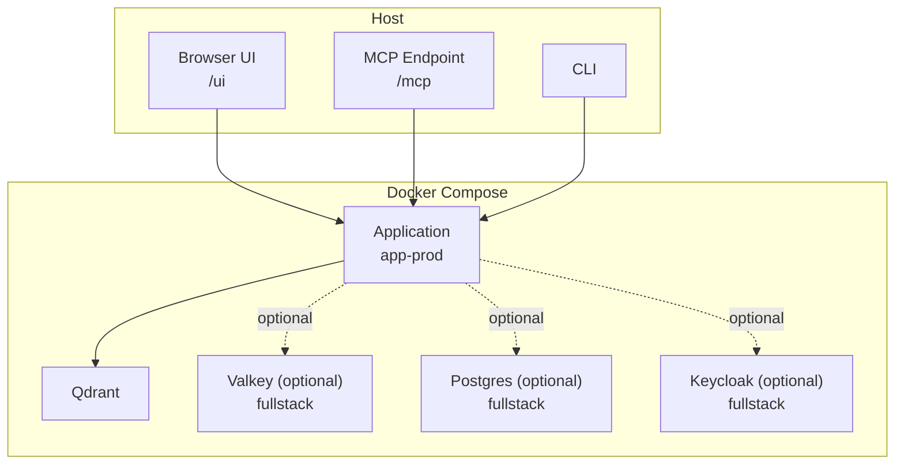
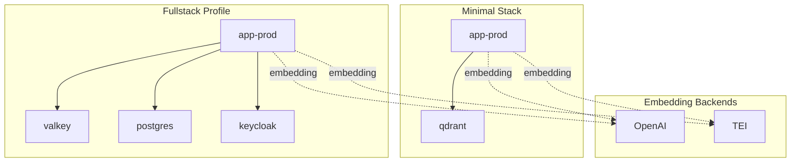
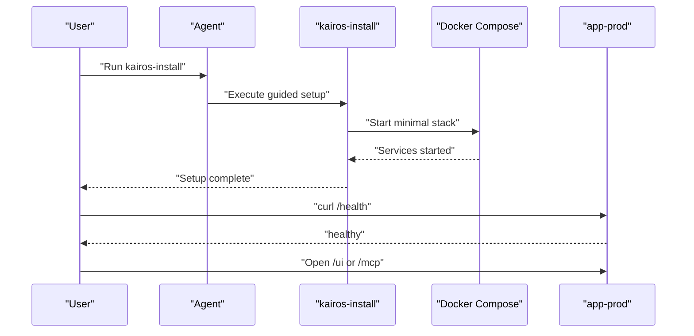
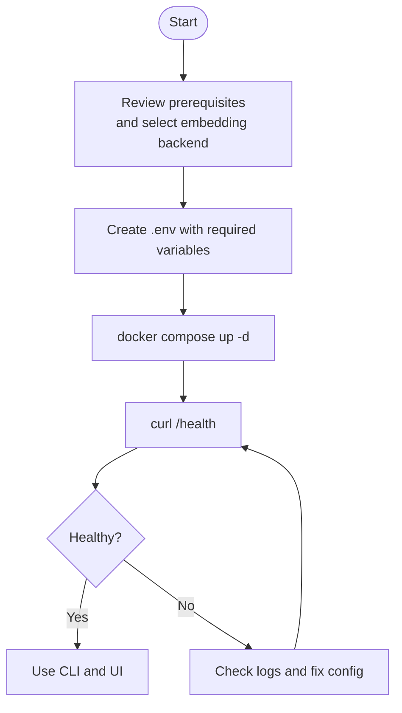
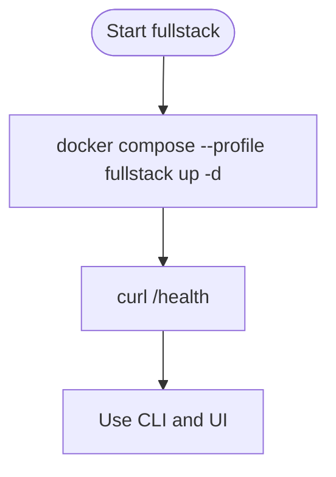
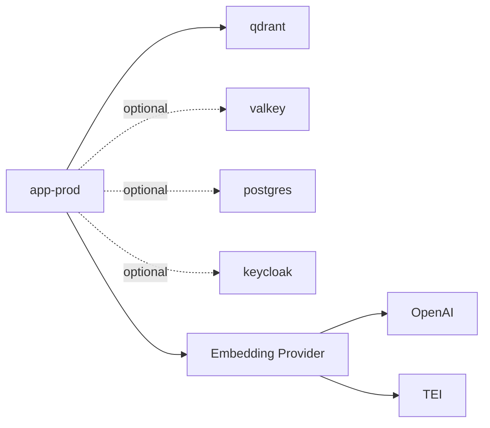

# Getting Started

<cite>
**Referenced Files in This Document**
- [README.md](file://README.md)
- [compose.yaml](file://compose.yaml)
- [docs/install/README.md](file://docs/install/README.md)
- [docs/install/docker-compose-simple.md](file://docs/install/docker-compose-simple.md)
- [docs/install/docker-compose-full-stack.md](file://docs/install/docker-compose-full-stack.md)
- [docs/install/prerequisites.md](file://docs/install/prerequisites.md)
- [package.json](file://package.json)
- [scripts/deploy-run-env.sh](file://scripts/deploy-run-env.sh)
- [scripts/deploy-dev-cli-ready.sh](file://scripts/deploy-dev-cli-ready.sh)
- [scripts/env/create-env.sh](file://scripts/env/create-env.sh)
- [src/services/embedding/service.ts](file://src/services/embedding/service.ts)
- [src/services/embedding/providers.ts](file://src/services/embedding/providers.ts)
</cite>

## Table of Contents
1. [Introduction](#introduction)
2. [Project Structure](#project-structure)
3. [Core Components](#core-components)
4. [Architecture Overview](#architecture-overview)
5. [Detailed Component Analysis](#detailed-component-analysis)
6. [Dependency Analysis](#dependency-analysis)
7. [Performance Considerations](#performance-considerations)
8. [Troubleshooting Guide](#troubleshooting-guide)
9. [Conclusion](#conclusion)
10. [Appendices](#appendices)

## Introduction
This guide helps you install and run KAIROS MCP quickly across three main paths:
- Guided setup using the kairos-install skill
- Manual Docker Compose deployment (minimal stack)
- Optional fullstack profile for broader local environments

You will learn how to configure environment variables for embedding providers (OpenAI, Ollama, TEI), understand the differences between minimal and fullstack deployments, verify your installation with health checks and UI access, troubleshoot common startup issues, and follow the development workflow using npm scripts.

## Project Structure
KAIROS MCP provides:
- A Docker Compose-based minimal stack (application + Qdrant)
- Optional fullstack profile (Valkey/Redis, Postgres, Keycloak)
- A CLI for authentication and operations
- A React UI served by the same server
- MCP endpoint for agent integration

**Diagram sources**
- [compose.yaml:10-183](file://compose.yaml#L10-L183)
- [README.md:105-192](file://README.md#L105-L192)

**Section sources**
- [README.md:105-192](file://README.md#L105-L192)
- [compose.yaml:1-183](file://compose.yaml#L1-L183)

## Core Components
- Application server: Express-based HTTP server exposing MCP, REST, UI, and metrics.
- Qdrant-backed memory: Required vector database for adapter storage and semantic search.
- Optional Redis cache: Enabled via REDIS_URL; improves performance for activation caching and proof-of-work state.
- Optional Keycloak: Provides OIDC authentication for browser sessions and Bearer JWT validation.
- CLI: Talks to the running server for authentication, verification, and daily operations.
- React UI: Served from the same origin at /ui.

**Section sources**
- [README.md:94-104](file://README.md#L94-L104)
- [compose.yaml:11-183](file://compose.yaml#L11-L183)

## Architecture Overview
The minimal stack runs the application and Qdrant. The optional fullstack profile adds Valkey, Postgres, and Keycloak. Embedding requests are routed to either OpenAI or TEI depending on environment configuration.

**Diagram sources**
- [compose.yaml:11-183](file://compose.yaml#L11-L183)
- [docs/install/docker-compose-simple.md:18-42](file://docs/install/docker-compose-simple.md#L18-L42)
- [docs/install/docker-compose-full-stack.md:69-78](file://docs/install/docker-compose-full-stack.md#L69-L78)

## Detailed Component Analysis

### Installation Paths

#### 1) Guided setup with the kairos-install skill
- Install the setup skill and run it to configure Ollama, generate .env, and start the minimal Docker stack.
- Verify the server health endpoint and open the UI or MCP.

**Diagram sources**
- [README.md:110-137](file://README.md#L110-L137)

**Section sources**
- [README.md:110-137](file://README.md#L110-L137)

#### 2) Manual minimal Docker Compose deployment
- Choose an embedding backend, create .env, start the stack, and verify health.
- Use the CLI for authentication and operations; configure MCP only if required.

**Diagram sources**
- [docs/install/docker-compose-simple.md:46-100](file://docs/install/docker-compose-simple.md#L46-L100)
- [docs/install/README.md:16-36](file://docs/install/README.md#L16-L36)

**Section sources**
- [docs/install/docker-compose-simple.md:46-100](file://docs/install/docker-compose-simple.md#L46-L100)
- [docs/install/README.md:16-36](file://docs/install/README.md#L16-L36)

#### 3) Optional fullstack profile
- Use the fullstack profile when you need broader services (Valkey, Postgres, Keycloak).
- Start with docker compose --profile fullstack and verify health.

**Diagram sources**
- [docs/install/docker-compose-full-stack.md:48-58](file://docs/install/docker-compose-full-stack.md#L48-L58)
- [compose.yaml:6-8](file://compose.yaml#L6-L8)

**Section sources**
- [docs/install/docker-compose-full-stack.md:48-58](file://docs/install/docker-compose-full-stack.md#L48-L58)
- [compose.yaml:6-8](file://compose.yaml#L6-L8)

### Environment Variables for Embedding Providers
Configure one of the following embedding backends in .env before starting the stack:

- OpenAI
  - OPENAI_API_KEY
  - Optional: OPENAI_EMBEDDING_MODEL

- Ollama (OpenAI-compatible)
  - OPENAI_API_URL (base URL without /v1)
  - OPENAI_EMBEDDING_MODEL (e.g., nomic-embed-text)
  - OPENAI_API_KEY must be set to "ollama"

- TEI
  - TEI_BASE_URL
  - Optional: TEI_MODEL

Notes:
- The application probes embedding dimension at startup and caches it.
- The server prefers OpenAI when both OpenAI and TEI variables are present; otherwise falls back to TEI if configured.

**Section sources**
- [docs/install/prerequisites.md:68-192](file://docs/install/prerequisites.md#L68-L192)
- [src/services/embedding/service.ts:1-292](file://src/services/embedding/service.ts#L1-L292)
- [src/services/embedding/providers.ts:251-280](file://src/services/embedding/providers.ts#L251-L280)

### Minimal vs Fullstack Deployments
- Minimal stack: app-prod + qdrant only.
- Fullstack profile: adds valkey, postgres, keycloak (profiles: fullstack, infra-ui).
- Optional UI (redisinsight) is available when enabling infra-ui profile.

Ports and services:
- Minimal: app (default 3000), Qdrant (6333, 6344), metrics (default 9090)
- Fullstack: adds Valkey (6379), Postgres (5432), Keycloak (8080, 9000), and optional redisinsight (5540)

**Section sources**
- [docs/install/docker-compose-simple.md:85-92](file://docs/install/docker-compose-simple.md#L85-L92)
- [compose.yaml:11-183](file://compose.yaml#L11-L183)
- [docs/install/docker-compose-full-stack.md:69-78](file://docs/install/docker-compose-full-stack.md#L69-L78)

### Verification Steps
- Health check: curl the health endpoint on the configured port.
- UI: navigate to /ui.
- MCP: use the URL derived from the same host and port as /health with /mcp appended.
- Metrics: visit /metrics on the metrics port.

For Docker Compose:
- Minimal: curl http://localhost:3000/health
- Fullstack: curl http://localhost:3000/health

For development scripts:
- The repo’s dev scripts default the app to port 3300 and metrics to 9390.

**Section sources**
- [README.md:127-167](file://README.md#L127-L167)
- [docs/install/docker-compose-simple.md:95-110](file://docs/install/docker-compose-simple.md#L95-L110)
- [package.json:38-116](file://package.json#L38-L116)

### Development Workflow Using npm Scripts
Recommended local development flow:
- npm ci
- npm run infra:up (starts fullstack and configures Keycloak realms)
- npm run dev:deploy (builds and restarts the dev server)

Additional useful scripts:
- dev:start, dev:stop, dev:restart, dev:status, dev:logs
- dev:test (runs integration tests)
- prod:health, prod:status, prod:logs (inspect prod environment)

Environment defaults:
- dev: PORT=3300, METRICS_PORT=9390
- dev_simple: PORT=4300, METRICS_PORT=9490
- prod: PORT=3500, METRICS_PORT=9390

**Section sources**
- [README.md:177-192](file://README.md#L177-L192)
- [package.json:38-116](file://package.json#L38-L116)
- [scripts/deploy-run-env.sh:93-110](file://scripts/deploy-run-env.sh#L93-L110)

## Dependency Analysis
- Application depends on Qdrant for vector storage.
- Optional dependencies: Valkey for caching/state, Postgres for Keycloak, Keycloak for OIDC.
- Embedding provider selection is driven by environment variables.

**Diagram sources**
- [compose.yaml:11-183](file://compose.yaml#L11-L183)
- [src/services/embedding/providers.ts:251-280](file://src/services/embedding/providers.ts#L251-L280)

**Section sources**
- [compose.yaml:11-183](file://compose.yaml#L11-L183)
- [src/services/embedding/providers.ts:251-280](file://src/services/embedding/providers.ts#L251-L280)

## Performance Considerations
- Enable Redis cache by setting REDIS_URL to reduce repeated computation and improve activation caching.
- Ensure embedding dimension consistency; switching models mid-collection may require vector migrations.
- Use appropriate ports and avoid conflicts by adjusting PORT and METRICS_PORT in .env.

[No sources needed since this section provides general guidance]

## Troubleshooting Guide
Common startup issues and resolutions:

- Server does not start
  - Check container logs: docker compose -p kairos-mcp logs app-prod
  - Verify required ports are free:
    - Minimal: app 3000 (or your PORT), Qdrant 6333, metrics 9090 (or your METRICS_PORT)
    - Repo dev scripts: app often 3300, metrics often 9390
    - Fullstack adds: 6379, 5432, 8080, 9000

- Health check returns 503
  - KAIROS only reports healthy when Qdrant is ready. Wait for Qdrant to finish starting, then retry.

- Embeddings fail on startup
  - Set one working embedding backend in .env:
    - OpenAI: OPENAI_API_KEY
    - Ollama/OpenAI-compatible: OPENAI_API_URL, OPENAI_EMBEDDING_MODEL, OPENAI_API_KEY=ollama
    - TEI: TEI_BASE_URL (+ optional TEI_MODEL)

- Auth-enabled development failing
  - Use the fullstack env example, start the fullstack profile, and configure realms via npm run infra:up.

- The CLI keeps asking for login
  - Confirm you are using the expected --url / KAIROS_API_URL, the token is still valid, and Keycloak and the server agree on issuer and audience.
  - Validate with: kairos token --validate

- Port conflicts
  - Change PORT or METRICS_PORT in .env, or stop the conflicting process.

- Qdrant readiness
  - Ensure Qdrant is healthy and reachable; the server waits for Qdrant readiness before reporting healthy.

**Section sources**
- [README.md:346-402](file://README.md#L346-L402)
- [docs/install/docker-compose-simple.md:150-158](file://docs/install/docker-compose-simple.md#L150-L158)

## Conclusion
You now have multiple installation paths to get KAIROS MCP running:
- Use the guided kairos-install skill for a streamlined first-time setup.
- Use the manual minimal Docker Compose path for a quick local deployment.
- Use the optional fullstack profile when you need broader services like Redis cache, Postgres, and Keycloak.

Follow the environment variable configuration for your chosen embedding provider, verify with health checks and UI access, and leverage the development npm scripts for local iteration. If issues arise, consult the troubleshooting section for targeted fixes.

[No sources needed since this section summarizes without analyzing specific files]

## Appendices

### Appendix A: Environment Variable Reference
- Qdrant
  - QDRANT_API_KEY (required for health checks and protected endpoints)
  - QDRANT_URL (default http://localhost:6333)
  - QDRANT_COLLECTION (default kairos)
  - QDRANT_SNAPSHOT_DIR (optional snapshot directory)

- Embedding
  - OPENAI_API_KEY (OpenAI)
  - OPENAI_EMBEDDING_MODEL (OpenAI)
  - OPENAI_API_URL (Ollama/TEI compatible)
  - TEI_BASE_URL (TEI)
  - TEI_MODEL (TEI)

- Optional Redis
  - REDIS_URL (e.g., redis://localhost:6379)
  - KAIROS_REDIS_PREFIX (default kb:)

- Optional Keycloak
  - KEYCLOAK_URL (internal or overridden for dev)
  - KEYCLOAK_DB_PASSWORD
  - KEYCLOAK_ADMIN_PASSWORD
  - KEYCLOAK_REALM
  - KEYCLOAK_CLIENT_ID
  - KEYCLOAK_CLI_CLIENT_ID

- Ports
  - PORT (default 3000 for Compose; 3300 for dev scripts)
  - METRICS_PORT (default 9090 for Compose; 9390 for dev scripts)

**Section sources**
- [docs/install/docker-compose-simple.md:60-92](file://docs/install/docker-compose-simple.md#L60-L92)
- [scripts/deploy-run-env.sh:688-700](file://scripts/deploy-run-env.sh#L688-L700)

### Appendix B: Quick Start Checklist
- Choose embedding backend and create .env
- Start stack with docker compose (minimal) or npm scripts (dev/fullstack)
- Verify: curl /health, open /ui, confirm /mcp connectivity
- Use CLI for authentication and operations

**Section sources**
- [README.md:105-192](file://README.md#L105-L192)
- [docs/install/README.md:16-36](file://docs/install/README.md#L16-L36)