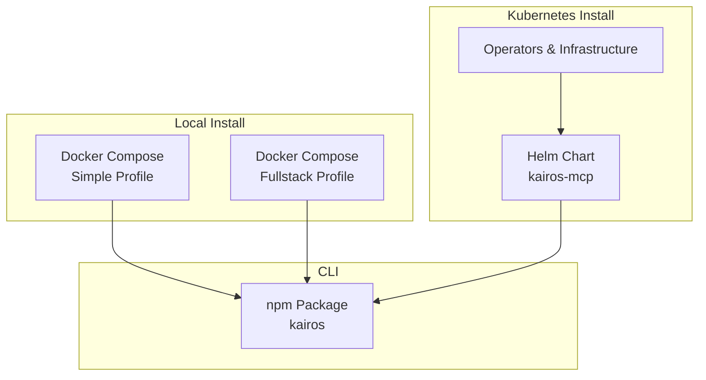
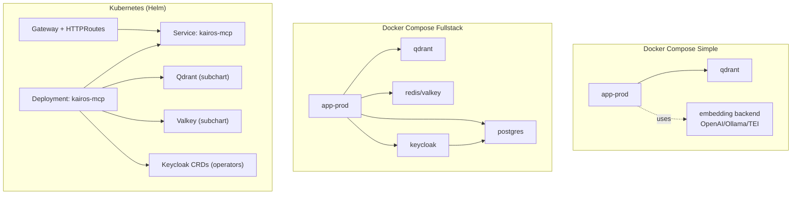
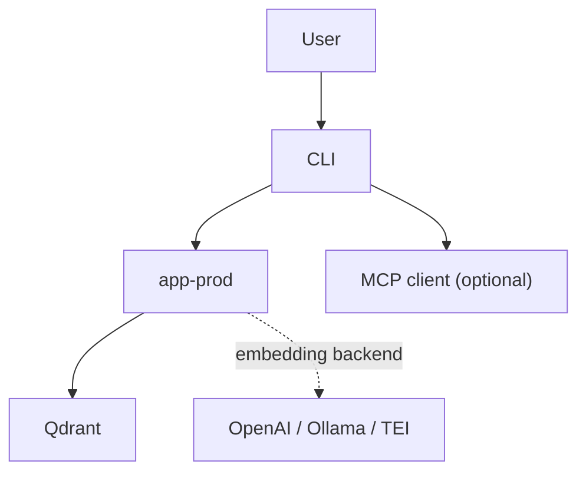
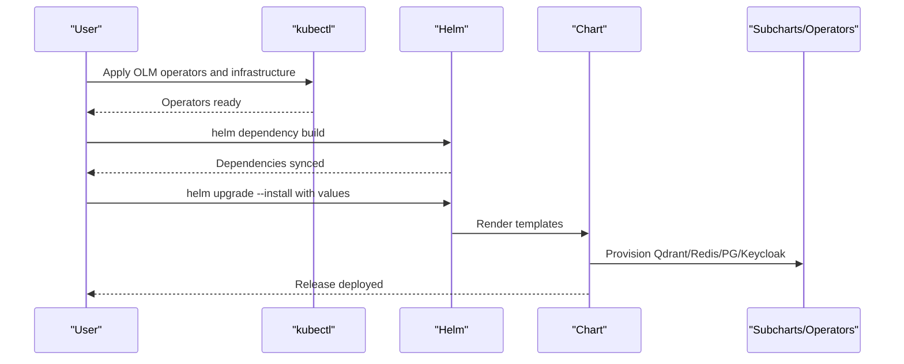
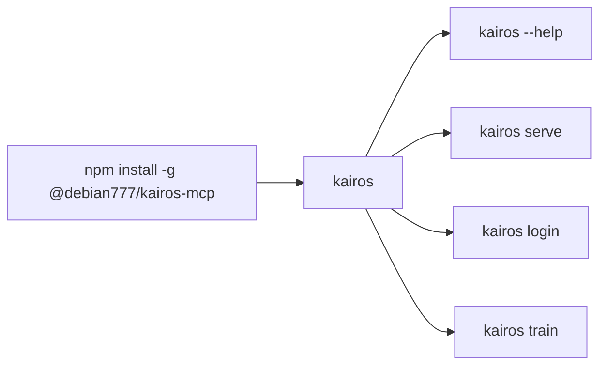
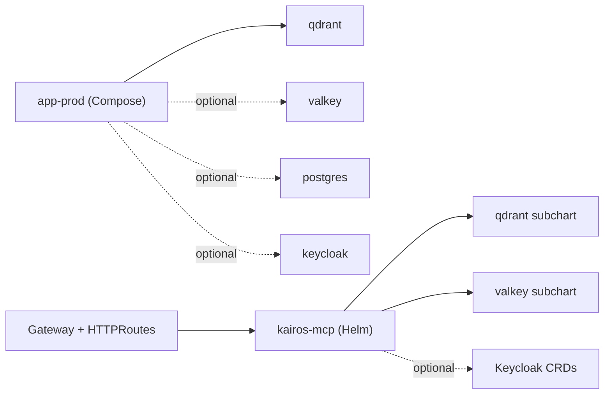

# Installation Options

<cite>
**Referenced Files in This Document**
- [docs/install/README.md](file://docs/install/README.md)
- [docs/install/docker-compose-simple.md](file://docs/install/docker-compose-simple.md)
- [docs/install/docker-compose-full-stack.md](file://docs/install/docker-compose-full-stack.md)
- [docs/install/helm.md](file://docs/install/helm.md)
- [docs/install/prerequisites.md](file://docs/install/prerequisites.md)
- [docs/CLI.md](file://docs/CLI.md)
- [compose.yaml](file://compose.yaml)
- [helm/README.md](file://helm/README.md)
- [helm/kairos-mcp/Chart.yaml](file://helm/kairos-mcp/Chart.yaml)
- [helm/kairos-mcp/values.yaml](file://helm/kairos-mcp/values.yaml)
- [helm/values.dev.yaml](file://helm/values.dev.yaml)
- [helm/values.prod.yaml](file://helm/values.prod.yaml)
- [helm/kairos-mcp/templates/kairos-mcp-deployment.yaml](file://helm/kairos-mcp/templates/kairos-mcp-deployment.yaml)
- [helm/kairos-mcp/templates/kairos-mcp-service.yaml](file://helm/kairos-mcp/templates/kairos-mcp-service.yaml)
- [package.json](file://package.json)
- [scripts/env/create-env.sh](file://scripts/env/create-env.sh)
</cite>

## Table of Contents
1. [Introduction](#introduction)
2. [Project Structure](#project-structure)
3. [Core Components](#core-components)
4. [Architecture Overview](#architecture-overview)
5. [Detailed Component Analysis](#detailed-component-analysis)
6. [Dependency Analysis](#dependency-analysis)
7. [Performance Considerations](#performance-considerations)
8. [Troubleshooting Guide](#troubleshooting-guide)
9. [Conclusion](#conclusion)
10. [Appendices](#appendices)

## Introduction
This document consolidates all supported installation paths for KAIROS MCP: Docker Compose (minimal and fullstack profiles), Helm chart for Kubernetes, and CLI installation via npm. It explains environment variable configuration, service dependencies, and operational guidance for development and production. It also provides upgrade and backup strategies for production deployments.

## Project Structure
KAIROS MCP provides:
- Docker Compose stacks for local and broader environments
- A Helm chart for Kubernetes with optional operators and infrastructure
- A CLI package for authentication, operations, and development workflows
- Supporting scripts and documentation for environment setup and validation

**Diagram sources**
- [docs/install/docker-compose-simple.md:1-169](file://docs/install/docker-compose-simple.md#L1-L169)
- [docs/install/docker-compose-full-stack.md:1-90](file://docs/install/docker-compose-full-stack.md#L1-L90)
- [docs/install/helm.md:1-238](file://docs/install/helm.md#L1-L238)
- [docs/CLI.md:1-382](file://docs/CLI.md#L1-L382)

**Section sources**
- [docs/install/README.md:1-163](file://docs/install/README.md#L1-L163)
- [docs/install/docker-compose-simple.md:1-169](file://docs/install/docker-compose-simple.md#L1-L169)
- [docs/install/docker-compose-full-stack.md:1-90](file://docs/install/docker-compose-full-stack.md#L1-L90)
- [docs/install/helm.md:1-238](file://docs/install/helm.md#L1-L238)
- [docs/CLI.md:1-382](file://docs/CLI.md#L1-L382)

## Core Components
- Application server: HTTP/MCP server exposing health, UI, and MCP endpoints
- Vector database: Qdrant for semantic storage and retrieval
- Optional caches and databases: Redis/Valkey, PostgreSQL
- Identity provider: Keycloak (optional)
- Embedding backends: OpenAI, Ollama, or TEI
- CLI: Primary operational interface for authentication, training, and exports

Key ports and endpoints:
- Application: PORT (default 3000), METRICS_PORT (default 9090)
- Qdrant: 6333, 6344
- Redis/Valkey: 6379 (optional)
- Keycloak: 8080, 9000 (optional)
- UI: http://localhost:PORT/ui
- MCP: http://localhost:PORT/mcp
- Metrics: http://localhost:METRICS_PORT/metrics

**Section sources**
- [docs/install/docker-compose-simple.md:85-110](file://docs/install/docker-compose-simple.md#L85-L110)
- [compose.yaml:53-172](file://compose.yaml#L53-L172)
- [docs/CLI.md:39-60](file://docs/CLI.md#L39-L60)

## Architecture Overview
High-level installation architectures mapped to actual files:

**Diagram sources**
- [compose.yaml:10-183](file://compose.yaml#L10-L183)
- [helm/kairos-mcp/templates/kairos-mcp-deployment.yaml:1-174](file://helm/kairos-mcp/templates/kairos-mcp-deployment.yaml#L1-L174)
- [helm/kairos-mcp/templates/kairos-mcp-service.yaml:1-23](file://helm/kairos-mcp/templates/kairos-mcp-service.yaml#L1-L23)
- [helm/kairos-mcp/Chart.yaml:14-23](file://helm/kairos-mcp/Chart.yaml#L14-L23)

## Detailed Component Analysis

### Docker Compose — Simple Stack
Recommended for local development and first-time setup. Includes the application and Qdrant. Embedding backend is external to Compose.

- Profiles: default (mini) includes app and qdrant; fullstack adds Redis, Postgres, Keycloak
- Environment variables: QDRANT_API_KEY, embedding backend variables (OpenAI, Ollama, or TEI), AUTH_ENABLED
- Ports: APP (default 3000), METRICS_PORT (default 9090), Qdrant 6333/6344
- Services: qdrant, app-prod
- MCP client configuration: optional, only when a host needs streamable HTTP

**Diagram sources**
- [docs/install/docker-compose-simple.md:18-42](file://docs/install/docker-compose-simple.md#L18-L42)
- [compose.yaml:53-172](file://compose.yaml#L53-L172)

**Section sources**
- [docs/install/docker-compose-simple.md:1-169](file://docs/install/docker-compose-simple.md#L1-L169)
- [docs/install/prerequisites.md:48-193](file://docs/install/prerequisites.md#L48-L193)
- [compose.yaml:10-183](file://compose.yaml#L10-L183)

### Docker Compose — Fullstack (Advanced)
Adds Redis/Valkey, Postgres, and Keycloak to the local environment. Useful for validating broader topologies or modeling production-like setups without Kubernetes.

- Profiles: fullstack enables valkey, postgres, keycloak
- Environment variables: embedding backend variables and secrets; KEY_VALUE_STORE_PASSWORD, KEYCLOAK_DB_PASSWORD, KEYCLOAK_ADMIN_PASSWORD
- Access: use CLI for operations; MCP only when required by a host

**Section sources**
- [docs/install/docker-compose-full-stack.md:1-90](file://docs/install/docker-compose-full-stack.md#L1-L90)
- [compose.yaml:10-183](file://compose.yaml#L10-L183)

### Helm Chart — Kubernetes Deployment
Deploys KAIROS MCP on Kubernetes using the kairos-mcp Helm chart. Supports optional operators and infrastructure for Qdrant, Redis/Valkey, PostgreSQL, and Keycloak.

- Operators: install via OLM using manifests under helm/operators and helm/infrastructure
- Chart installation: add repositories, build dependencies, create values file, helm upgrade --install
- Embedding backends: OpenAI (via secret), Ollama (StatefulSet), or TEI (via extraEnv)
- Optional components: Qdrant cluster, Redis/Valkey, PostgreSQL cluster, Keycloak instance/realm import, Gateway + HTTPRoutes
- Authentication: OIDC via Keycloak; SMTP for email verification configured externally
- Versioning: independent lanes for app release, dependencies, and chart version

**Diagram sources**
- [docs/install/helm.md:19-84](file://docs/install/helm.md#L19-L84)
- [helm/kairos-mcp/Chart.yaml:14-23](file://helm/kairos-mcp/Chart.yaml#L14-L23)
- [helm/kairos-mcp/values.yaml:123-279](file://helm/kairos-mcp/values.yaml#L123-L279)

**Section sources**
- [docs/install/helm.md:1-238](file://docs/install/helm.md#L1-L238)
- [helm/README.md:1-18](file://helm/README.md#L1-L18)
- [helm/kairos-mcp/Chart.yaml:1-23](file://helm/kairos-mcp/Chart.yaml#L1-L23)
- [helm/kairos-mcp/values.yaml:1-279](file://helm/kairos-mcp/values.yaml#L1-L279)
- [helm/values.dev.yaml:1-83](file://helm/values.dev.yaml#L1-L83)
- [helm/values.prod.yaml:1-94](file://helm/values.prod.yaml#L1-L94)

### CLI Installation via npm
The CLI is mandatory for all installation paths and provides authentication, training, and operational commands.

- Global installation: npm install -g @debian777/kairos-mcp
- Local usage: npx @debian777/kairos-mcp
- Server mode: kairos serve (requires Qdrant and embedding variables in .env)
- URL selection: --url, KAIROS_API_URL, default fallback

**Diagram sources**
- [docs/CLI.md:5-44](file://docs/CLI.md#L5-L44)
- [package.json:30-32](file://package.json#L30-L32)

**Section sources**
- [docs/CLI.md:1-382](file://docs/CLI.md#L1-L382)
- [package.json:1-195](file://package.json#L1-L195)

### Development Environment Setup with Docker Containers
For rapid local iteration, use Docker Compose profiles to spin up supporting services. The repository provides:
- Simple stack: app + Qdrant
- Fullstack: app + Qdrant + Redis/Valkey + Postgres + Keycloak
- Scripts to generate environment files and orchestrate deployments

Environment generation:
- scripts/env/create-env.sh creates .env from template when missing

**Section sources**
- [compose.yaml:10-183](file://compose.yaml#L10-L183)
- [scripts/env/create-env.sh:1-12](file://scripts/env/create-env.sh#L1-12)

## Dependency Analysis
- Compose dependencies:
  - app-prod depends on qdrant (service name and port)
  - Optional: valkey, postgres, keycloak (fullstack profile)
- Helm dependencies:
  - Chart depends on qdrant and valkey subcharts
  - Optional: Keycloak CRDs via operators; Gateway API CRDs for HTTPRoutes

**Diagram sources**
- [compose.yaml:139-172](file://compose.yaml#L139-L172)
- [helm/kairos-mcp/Chart.yaml:14-23](file://helm/kairos-mcp/Chart.yaml#L14-L23)

**Section sources**
- [compose.yaml:10-183](file://compose.yaml#L10-L183)
- [helm/kairos-mcp/Chart.yaml:14-23](file://helm/kairos-mcp/Chart.yaml#L14-L23)

## Performance Considerations
- Horizontal scaling:
  - Kubernetes: adjust app.replicaCount and enable HPA/VPA in values.yaml
  - Compose: scale app-prod using docker compose scale (note: stateful dependencies may require careful handling)
- Resource requests/limits:
  - Configure app.resources and component-specific resources in Helm values
- Embedding backend sizing:
  - Ensure embedding model dimensions and capacity align with workload
- Monitoring:
  - Enable ServiceMonitors and PrometheusRules in values.yaml for production visibility

[No sources needed since this section provides general guidance]

## Troubleshooting Guide
Common issues and resolutions:
- Qdrant API key missing: ensure QDRANT_API_KEY is set in .env; restart affected services
- Port conflicts: change PORT or METRICS_PORT; verify no process occupies the port
- Application unhealthy: inspect app-prod logs; confirm Qdrant availability and embedding backend connectivity
- Embedding errors: re-check embedding backend configuration; review server logs
- CLI authentication failures: run kairos login; verify stored tokens and API URL
- Helm upgrades: ensure dependencies are built and values are valid; check subchart conditions

**Section sources**
- [docs/install/docker-compose-simple.md:150-158](file://docs/install/docker-compose-simple.md#L150-L158)
- [docs/CLI.md:335-374](file://docs/CLI.md#L335-L374)
- [docs/install/helm.md:194-215](file://docs/install/helm.md#L194-L215)

## Conclusion
KAIROS MCP supports flexible installation paths tailored to local development, broader local environments, and Kubernetes production. The CLI is essential for authentication and operations across all paths. Helm provides robust production-grade deployment with optional operators and infrastructure. Ensure proper environment configuration, embedding backend alignment, and monitoring for reliable operation.

[No sources needed since this section summarizes without analyzing specific files]

## Appendices

### Environment Variables Reference
- Application
  - PORT: HTTP bind port (default 3000)
  - METRICS_PORT: Metrics endpoint port (default 9090)
  - QDRANT_URL: Vector database endpoint
  - REDIS_URL: Cache/queue endpoint (optional)
  - KEYCLOAK_URL: Identity provider endpoint (optional)
  - KEYCLOAK_INTERNAL_URL: Internal Keycloak URL (optional)
  - AUTH_ENABLED: Enable OIDC authentication (boolean)
  - KEYCLOAK_REALM, KEYCLOAK_CLIENT_ID: OIDC realm and client
  - AUTH_CALLBACK_BASE_URL: Public origin for OIDC redirect_uri
  - OIDC_GROUPS_ALLOWLIST: Allowlist for JWT groups
  - SESSION_SECRET: Secret for session encryption (optional)
- Qdrant
  - QDRANT_API_KEY: API key for Qdrant
  - QDRANT_SNAPSHOT_DIR: Snapshot backup directory (optional)
- Embedding backends
  - OpenAI: OPENAI_API_KEY, OPENAI_EMBEDDING_MODEL
  - Ollama: OPENAI_API_URL, OPENAI_EMBEDDING_MODEL, OPENAI_API_KEY=ollama
  - TEI: TEI_BASE_URL
- Optional services
  - KEY_VALUE_STORE_PASSWORD or REDIS_PASSWORD: Valkey/Redis password
  - KEYCLOAK_DB_PASSWORD, KEYCLOAK_ADMIN_PASSWORD: Keycloak credentials
- CLI
  - KAIROS_API_URL: Default server URL for CLI commands
  - KAIROS_TIMEOUT_MS, KAIROS_RETRIES: Network behavior overrides

**Section sources**
- [docs/install/docker-compose-simple.md:60-92](file://docs/install/docker-compose-simple.md#L60-L92)
- [docs/install/prerequisites.md:91-191](file://docs/install/prerequisites.md#L91-L191)
- [compose.yaml:53-172](file://compose.yaml#L53-L172)
- [helm/kairos-mcp/values.yaml:39-87](file://helm/kairos-mcp/values.yaml#L39-L87)
- [docs/CLI.md:78-86](file://docs/CLI.md#L78-L86)

### Ports and Service Dependencies
- Application: PORT (default 3000), METRICS_PORT (default 9090)
- Qdrant: 6333, 6344
- Redis/Valkey: 6379 (optional)
- Postgres: 5432 (optional)
- Keycloak: 8080, 9000 (optional)
- Dependencies:
  - app-prod depends on qdrant
  - keycloak depends on postgres (when enabled)
  - app-prod may depend on valkey, keycloak, and embedding backend

**Section sources**
- [docs/install/docker-compose-simple.md:85-92](file://docs/install/docker-compose-simple.md#L85-L92)
- [compose.yaml:53-172](file://compose.yaml#L53-L172)

### Upgrade Procedures
- Helm:
  - helm repo update
  - helm dependency build helm/kairos-mcp
  - helm upgrade kairos helm/kairos-mcp -n kairos -f my-values.yaml --wait
- Compose:
  - Pull latest images and restart services
  - Validate health endpoints after upgrade
- CLI:
  - Update npm package and verify commands

**Section sources**
- [docs/install/helm.md:194-204](file://docs/install/helm.md#L194-L204)
- [docs/install/docker-compose-simple.md:95-104](file://docs/install/docker-compose-simple.md#L95-L104)
- [docs/CLI.md:5-18](file://docs/CLI.md#L5-L18)

### Backup Strategies for Production
- Qdrant snapshots:
  - Enable QDRANT_SNAPSHOT_DIR and mount a persistent volume
  - Use built-in snapshot APIs for backups
- Helm:
  - Configure PVC retention policies for stateful components
  - Consider pgBackRest for PostgreSQL backups (if enabled)
- Compose:
  - Named volumes for qdrant-data, snapshots-prod, valkey-data, postgres-data

**Section sources**
- [compose.yaml:53-172](file://compose.yaml#L53-L172)
- [helm/kairos-mcp/values.yaml:215-232](file://helm/kairos-mcp/values.yaml#L215-L232)