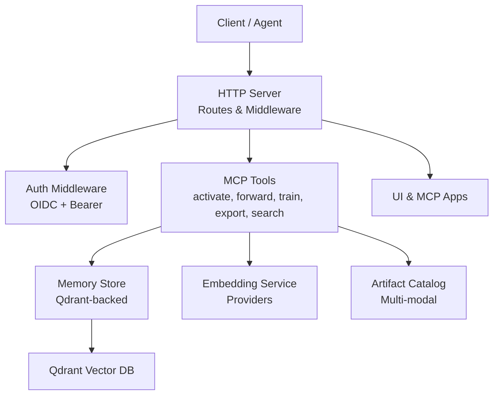
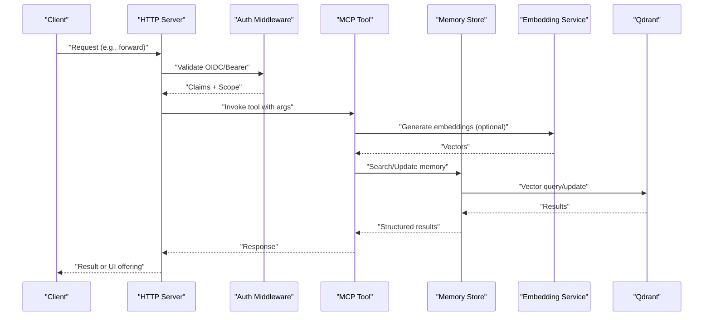
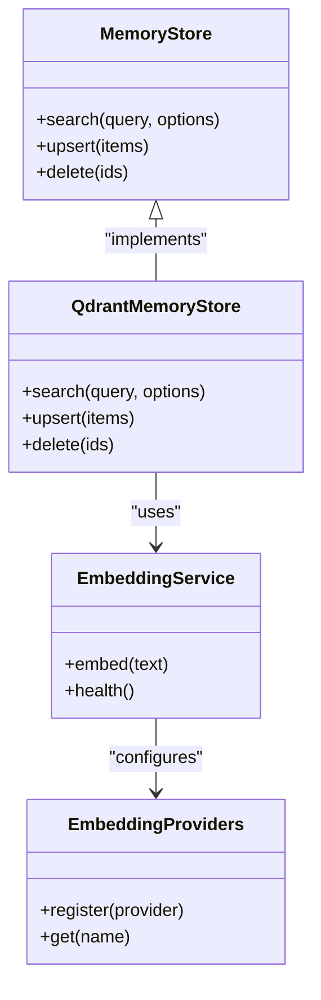
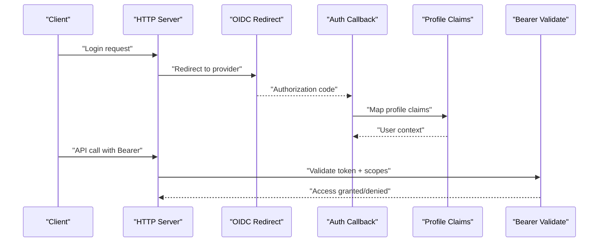
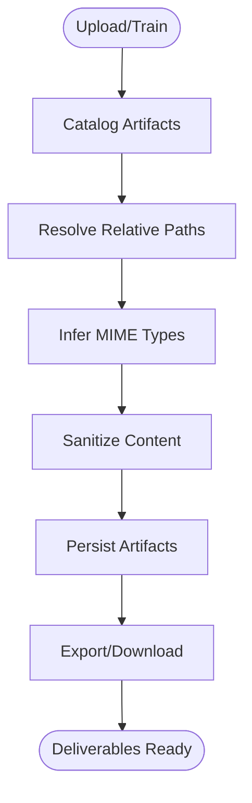
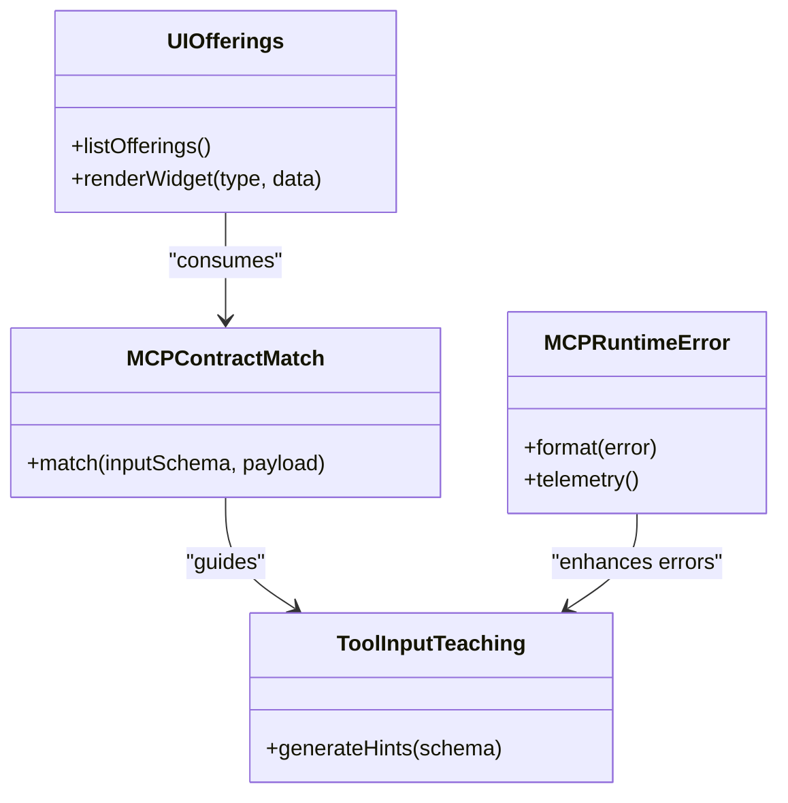
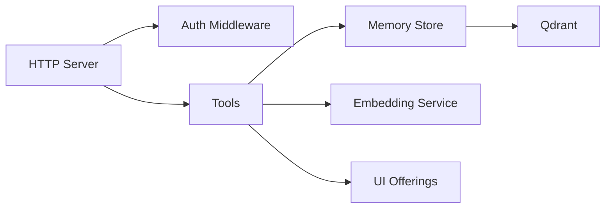

# Key Features

<cite>
**Referenced Files in This Document**
- [README.md](file://README.md)
- [bootstrap.ts](file://src/bootstrap.ts)
- [server.ts](file://src/server.ts)
- [http-server.ts](file://src/http/http-server.ts)
- [http-auth-middleware.ts](file://src/http/http-auth-middleware.ts)
- [http-auth-callback.ts](file://src/http/http-auth-callback.ts)
- [http-auth-oidc-redirect.ts](file://src/http/http-auth-oidc-redirect.ts)
- [oidc-profile-claims.ts](file://src/http/oidc-profile-claims.ts)
- [oidc-scopes.ts](file://src/http/oidc-scopes.ts)
- [bearer-validate.ts](file://src/http/bearer-validate.ts)
- [memory-store.ts](file://src/services/memory-store.ts)
- [store.ts](file://src/services/memory/store.ts)
- [qdrant-memory-store.ts](file://src/services/qdrant/memory-store.ts)
- [qdrant-search.ts](file://src/services/qdrant/search.ts)
- [embedding-service.ts](file://src/services/embedding/service.ts)
- [embedding-providers.ts](file://src/services/embedding/providers.ts)
- [forward-tool.ts](file://src/tools/forward.ts)
- [forward-register.ts](file://src/tools/forward-register.ts)
- [forward-view.ts](file://src/tools/forward-view.ts)
- [activate-tool.ts](file://src/tools/activate.ts)
- [train-tool.ts](file://src/tools/train.ts)
- [export-tool.ts](file://src/tools/export.ts)
- [search-tool.ts](file://src/tools/search.ts)
- [artifact-catalog.ts](file://src/tools/artifact-catalog.ts)
- [artifact-relative-path.ts](file://src/tools/artifact-relative-path.ts)
- [mcp-contract-match.ts](file://src/tools/mcp-contract-match.ts)
- [mcp-runtime-error.ts](file://src/tools/mcp-runtime-error.ts)
- [mcp-tool-input-teaching.ts](file://src/tools/mcp-tool-input-teaching.ts)
- [kairos-ui-capability.ts](file://src/mcp-apps/kairos-server-ui-capability.ts)
- [list-offerings-for-ui.ts](file://src/mcp-apps/list-offerings-for-ui.ts)
- [ui-frontend-architecture.md](file://docs/architecture/ui-frontend-architecture.md)
- [auth-overview.md](file://docs/architecture/auth-overview.md)
- [artifacts.md](file://docs/architecture/artifacts.md)
- [workflow-full-execution.md](file://docs/architecture/workflow-full-execution.md)
- [workflow-forward-first-call.md](file://docs/architecture/workflow-forward-first-call.md)
- [workflow-forward-continue.md](file://docs/architecture/workflow-forward-continue.md)
- [agent-recovery-ux.md](file://docs/architecture/agent-recovery-ux.md)
</cite>

## Table of Contents
1. [Introduction](#introduction)
2. [Project Structure](#project-structure)
3. [Core Components](#core-components)
4. [Architecture Overview](#architecture-overview)
5. [Detailed Component Analysis](#detailed-component-analysis)
6. [Dependency Analysis](#dependency-analysis)
7. [Performance Considerations](#performance-considerations)
8. [Troubleshooting Guide](#troubleshooting-guide)
9. [Conclusion](#conclusion)

## Introduction
Kairos MCP is an AI workflow automation platform that combines intelligent memory, secure authentication, multi-modal artifact handling, and a powerful orchestration layer for stateful workflows. It exposes capabilities via the Model Context Protocol (MCP), enabling seamless integration with AI agents and tools while providing enterprise-grade security, observability, and extensibility.

Key value propositions:
- Intelligent memory with semantic search and vector embeddings to retrieve relevant context quickly
- Workflow orchestration with stateful execution, recovery, and guided user interactions
- Secure authentication with OIDC integration and fine-grained access control
- Multi-modal artifact handling across text, code, documents, and rich media
- Extensible tool development framework with strong contracts and runtime safety

## Project Structure
At a high level, Kairos MCP consists of:
- HTTP server and middleware for routing, authentication, and metrics
- Memory subsystem backed by Qdrant for vector similarity search
- Embedding service supporting multiple providers
- Tools implementing MCP operations such as activate, forward, train, export, and search
- UI and MCP app integrations for interactive experiences
- CLI and configuration utilities for management and automation



**Diagram sources**
- [http-server.ts](file://src/http/http-server.ts)
- [http-auth-middleware.ts](file://src/http/http-auth-middleware.ts)
- [memory-store.ts](file://src/services/memory-store.ts)
- [qdrant-memory-store.ts](file://src/services/qdrant/memory-store.ts)
- [embedding-service.ts](file://src/services/embedding/service.ts)
- [forward-tool.ts](file://src/tools/forward.ts)
- [artifact-catalog.ts](file://src/tools/artifact-catalog.ts)
- [kairos-ui-capability.ts](file://src/mcp-apps/kairos-server-ui-capability.ts)

**Section sources**
- [README.md](file://README.md)
- [bootstrap.ts](file://src/bootstrap.ts)
- [server.ts](file://src/server.ts)
- [http-server.ts](file://src/http/http-server.ts)

## Core Components
- Intelligent Memory System: Semantic search over stored content using vector embeddings and hybrid retrieval strategies.
- Workflow Orchestration: Stateful execution model with begin, forward, continue, reward, and training/tuning flows.
- Secure Authentication: OIDC-based login, token validation, and profile claims mapping.
- Multi-modal Artifact Handling: Rich artifact cataloging, relative path resolution, and export/download support.
- Extensible Tool Framework: Strongly typed MCP tool contracts, input teaching, error handling, and UI offerings.

**Section sources**
- [memory-store.ts](file://src/services/memory-store.ts)
- [store.ts](file://src/services/memory/store.ts)
- [qdrant-memory-store.ts](file://src/services/qdrant/memory-store.ts)
- [qdrant-search.ts](file://src/services/qdrant/search.ts)
- [embedding-service.ts](file://src/services/embedding/service.ts)
- [embedding-providers.ts](file://src/services/embedding/providers.ts)
- [forward-tool.ts](file://src/tools/forward.ts)
- [activate-tool.ts](file://src/tools/activate.ts)
- [train-tool.ts](file://src/tools/train.ts)
- [export-tool.ts](file://src/tools/export.ts)
- [search-tool.ts](file://src/tools/search.ts)
- [artifact-catalog.ts](file://src/tools/artifact-catalog.ts)
- [artifact-relative-path.ts](file://src/tools/artifact-relative-path.ts)
- [mcp-contract-match.ts](file://src/tools/mcp-contract-match.ts)
- [mcp-runtime-error.ts](file://src/tools/mcp-runtime-error.ts)
- [mcp-tool-input-teaching.ts](file://src/tools/mcp-tool-input-teaching.ts)
- [kairos-ui-capability.ts](file://src/mcp-apps/kairos-server-ui-capability.ts)
- [list-offerings-for-ui.ts](file://src/mcp-apps/list-offerings-for-ui.ts)

## Architecture Overview
The system follows a layered architecture:
- Presentation Layer: UI and MCP apps expose interactive widgets and resource listings.
- API Layer: HTTP routes handle requests, enforce auth, and dispatch to tools.
- Tool Layer: Implements business logic for workflows, artifacts, and memory operations.
- Services Layer: Memory store, embedding service, and Qdrant client provide core capabilities.
- Storage Layer: Qdrant for vectors, Redis for cache/state, and file systems for artifacts.



**Diagram sources**
- [http-auth-middleware.ts](file://src/http/http-auth-middleware.ts)
- [bearer-validate.ts](file://src/http/bearer-validate.ts)
- [forward-tool.ts](file://src/tools/forward.ts)
- [memory-store.ts](file://src/services/memory-store.ts)
- [qdrant-memory-store.ts](file://src/services/qdrant/memory-store.ts)
- [embedding-service.ts](file://src/services/embedding/service.ts)

**Section sources**
- [ui-frontend-architecture.md](file://docs/architecture/ui-frontend-architecture.md)
- [auth-overview.md](file://docs/architecture/auth-overview.md)
- [workflow-full-execution.md](file://docs/architecture/workflow-full-execution.md)

## Detailed Component Analysis

### Intelligent Memory System
Highlights:
- Semantic search powered by vector embeddings and hybrid retrieval
- Configurable providers and health checks
- Qdrant-backed storage with optimized queries and metadata filtering

Benefits:
- Fast, accurate recall of relevant context for AI workflows
- Scalable vector indexing and querying
- Flexible provider abstraction for different embedding models

Use cases:
- Retrieving prior steps or related artifacts during workflow execution
- Enhancing prompts with semantically similar knowledge
- Powering “spaces” and curated collections



**Diagram sources**
- [memory-store.ts](file://src/services/memory-store.ts)
- [qdrant-memory-store.ts](file://src/services/qdrant/memory-store.ts)
- [embedding-service.ts](file://src/services/embedding/service.ts)
- [embedding-providers.ts](file://src/services/embedding/providers.ts)

**Section sources**
- [memory-store.ts](file://src/services/memory-store.ts)
- [store.ts](file://src/services/memory/store.ts)
- [qdrant-memory-store.ts](file://src/services/qdrant/memory-store.ts)
- [qdrant-search.ts](file://src/services/qdrant/search.ts)
- [embedding-service.ts](file://src/services/embedding/service.ts)
- [embedding-providers.ts](file://src/services/embedding/providers.ts)

### Workflow Orchestration with Stateful Execution and Recovery
Highlights:
- Begin, forward, continue, reward, train, tune operations
- Guided UX and widget-based interactions
- Robust recovery and audit trails

Benefits:
- Reliable long-running workflows with checkpoints
- Interactive guidance for complex tasks
- Observability and reproducibility

Use cases:
- Automated code reviews and PR standardization
- Compliance checks from PDFs
- Terraform module standardization

```mermaid
sequenceDiagram
participant Client as "Agent"
participant HTTP as "HTTP Server"
participant Activate as "Activate Tool"
participant Forward as "Forward Tool"
participant View as "Forward View"
participant Reward as "Reward Tool"
Client->>HTTP : "Begin activation"
HTTP->>Activate : "activate(params)"
Activate-->>HTTP : "State snapshot + next action"
Client->>HTTP : "Forward step"
HTTP->>Forward : "forward(stepId, payload)"
Forward-->>HTTP : "Next step or completion"
HTTP->>View : "Render UI offering"
View-->>Client : "Interactive form"
Client->>HTTP : "Submit solution"
HTTP->>Reward : "reward(stepId, score)"
Reward-->>Client : "Acknowledgement"
```

**Diagram sources**
- [activate-tool.ts](file://src/tools/activate.ts)
- [forward-tool.ts](file://src/tools/forward.ts)
- [forward-view.ts](file://src/tools/forward-view.ts)
- [forward-register.ts](file://src/tools/forward-register.ts)

**Section sources**
- [workflow-full-execution.md](file://docs/architecture/workflow-full-execution.md)
- [workflow-forward-first-call.md](file://docs/architecture/workflow-forward-first-call.md)
- [workflow-forward-continue.md](file://docs/architecture/workflow-forward-continue.md)
- [agent-recovery-ux.md](file://docs/architecture/agent-recovery-ux.md)

### Secure Authentication with OIDC Integration
Highlights:
- OIDC redirect and callback flows
- Bearer token validation and scope enforcement
- Profile claims mapping for authorization decisions

Benefits:
- Enterprise SSO compatibility
- Fine-grained access control per space/tool
- Secure session management

Use cases:
- Team collaboration with role-based access
- Integrating with corporate identity providers
- Auditing and compliance logging



**Diagram sources**
- [http-auth-oidc-redirect.ts](file://src/http/http-auth-oidc-redirect.ts)
- [http-auth-callback.ts](file://src/http/http-auth-callback.ts)
- [oidc-profile-claims.ts](file://src/http/oidc-profile-claims.ts)
- [oidc-scopes.ts](file://src/http/oidc-scopes.ts)
- [bearer-validate.ts](file://src/http/bearer-validate.ts)
- [http-auth-middleware.ts](file://src/http/http-auth-middleware.ts)

**Section sources**
- [auth-overview.md](file://docs/architecture/auth-overview.md)

### Multi-modal Artifact Handling
Highlights:
- Artifact cataloging and relative path resolution
- Export and download capabilities for diverse formats
- MIME inference and sanitization

Benefits:
- Unified handling of code, docs, images, and binaries
- Safe packaging and distribution of skill bundles
- Consistent paths and references across environments

Use cases:
- Bundling documentation and assets for skills
- Downloading generated reports and diagrams
- Sharing multi-format deliverables with clients



**Diagram sources**
- [artifact-catalog.ts](file://src/tools/artifact-catalog.ts)
- [artifact-relative-path.ts](file://src/tools/artifact-relative-path.ts)
- [export-tool.ts](file://src/tools/export.ts)

**Section sources**
- [artifacts.md](file://docs/architecture/artifacts.md)

### Extensible Tool Development Framework
Highlights:
- Strongly typed MCP contracts and schema validation
- Input teaching for better agent guidance
- Runtime error handling and telemetry
- UI offerings for interactive tool experiences

Benefits:
- Rapid development of new tools with consistent behavior
- Improved agent usability through structured inputs
- Seamless integration with UI and MCP hosts

Use cases:
- Building custom domain-specific tools
- Creating guided forms for complex inputs
- Publishing reusable capabilities to teams



**Diagram sources**
- [mcp-contract-match.ts](file://src/tools/mcp-contract-match.ts)
- [mcp-runtime-error.ts](file://src/tools/mcp-runtime-error.ts)
- [mcp-tool-input-teaching.ts](file://src/tools/mcp-tool-input-teaching.ts)
- [kairos-ui-capability.ts](file://src/mcp-apps/kairos-server-ui-capability.ts)
- [list-offerings-for-ui.ts](file://src/mcp-apps/list-offerings-for-ui.ts)

**Section sources**
- [mcp-contract-match.ts](file://src/tools/mcp-contract-match.ts)
- [mcp-runtime-error.ts](file://src/tools/mcp-runtime-error.ts)
- [mcp-tool-input-teaching.ts](file://src/tools/mcp-tool-input-teaching.ts)
- [kairos-ui-capability.ts](file://src/mcp-apps/kairos-server-ui-capability.ts)
- [list-offerings-for-ui.ts](file://src/mcp-apps/list-offerings-for-ui.ts)

## Dependency Analysis
High-level dependencies:
- HTTP server depends on auth middleware and tool handlers
- Tools depend on memory store and embedding service
- Memory store depends on Qdrant client
- UI and MCP apps depend on tool offerings and resources



**Diagram sources**
- [http-server.ts](file://src/http/http-server.ts)
- [http-auth-middleware.ts](file://src/http/http-auth-middleware.ts)
- [memory-store.ts](file://src/services/memory-store.ts)
- [qdrant-memory-store.ts](file://src/services/qdrant/memory-store.ts)
- [embedding-service.ts](file://src/services/embedding/service.ts)
- [kairos-ui-capability.ts](file://src/mcp-apps/kairos-server-ui-capability.ts)

**Section sources**
- [bootstrap.ts](file://src/bootstrap.ts)
- [server.ts](file://src/server.ts)

## Performance Considerations
- Use embedding batching and caching where possible to reduce latency
- Tune Qdrant collection sizes and query parameters for optimal recall/speed
- Apply concurrency limits at the HTTP layer to protect downstream services
- Monitor metrics and logs for hotspots and adjust thresholds accordingly

[No sources needed since this section provides general guidance]

## Troubleshooting Guide
Common issues and resolutions:
- Authentication failures: Verify OIDC configuration, scopes, and bearer tokens
- Search anomalies: Check embedding provider health and Qdrant connectivity
- Workflow stalls: Inspect state snapshots and recovery UX logs
- Artifact errors: Validate MIME types and relative path resolution

**Section sources**
- [bearer-validate.ts](file://src/http/bearer-validate.ts)
- [embedding-service.ts](file://src/services/embedding/service.ts)
- [qdrant-memory-store.ts](file://src/services/qdrant/memory-store.ts)
- [agent-recovery-ux.md](file://docs/architecture/agent-recovery-ux.md)

## Conclusion
Kairos MCP delivers a robust foundation for AI workflow automation with intelligent memory, secure authentication, multi-modal artifacts, and a powerful orchestration layer. Its extensible tool framework and interactive UI offerings enable rapid development and deployment of sophisticated, enterprise-ready AI solutions.

[No sources needed since this section summarizes without analyzing specific files]