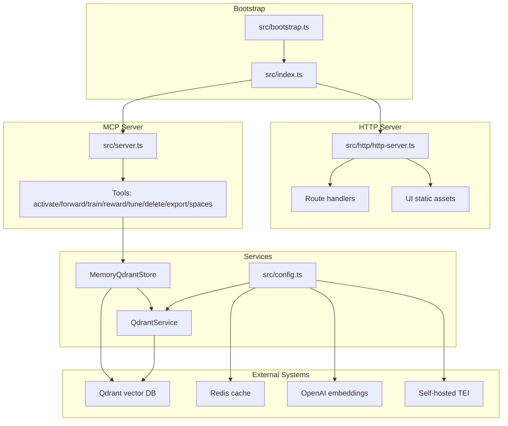
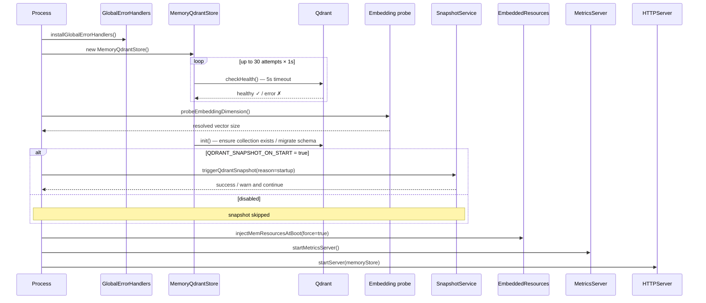
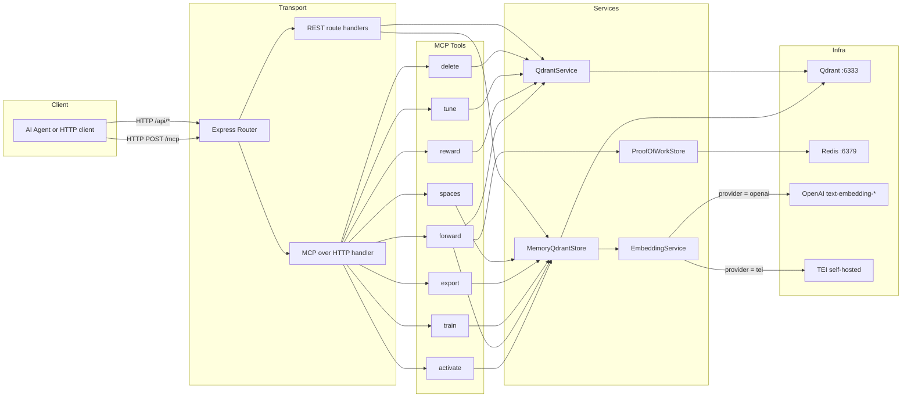
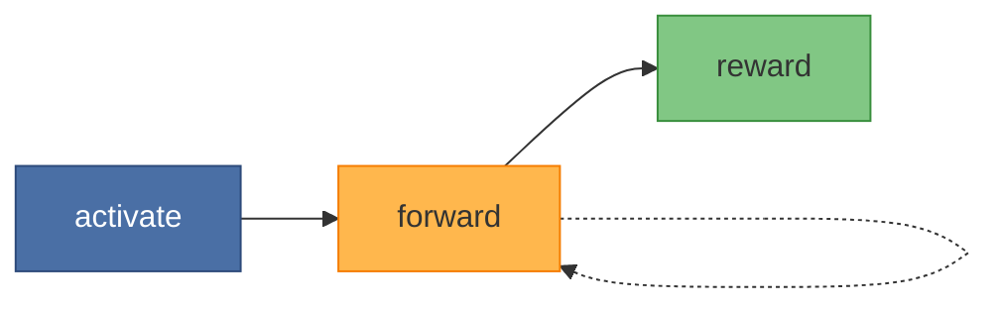
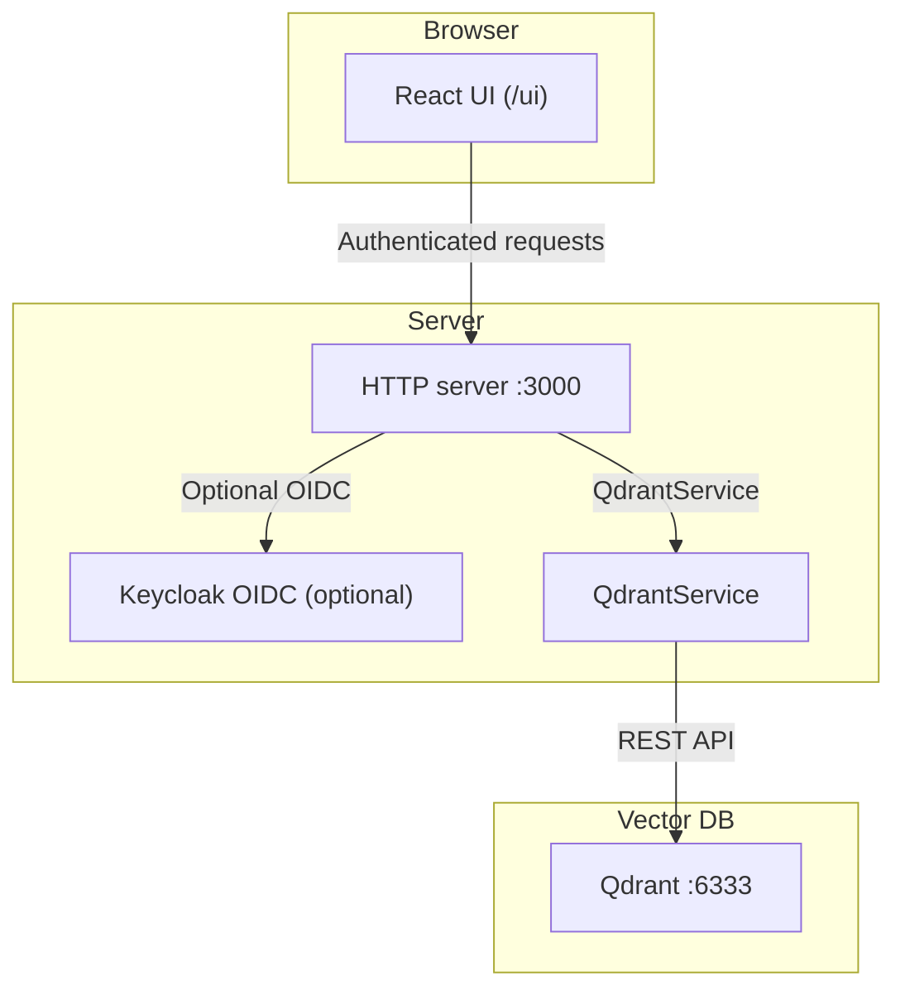
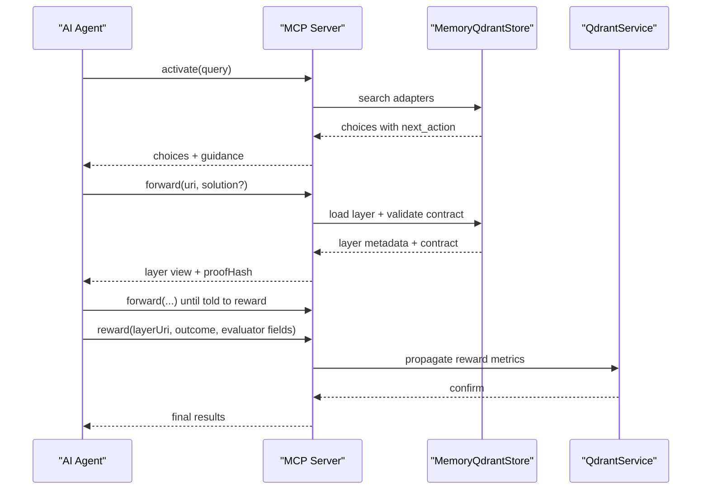
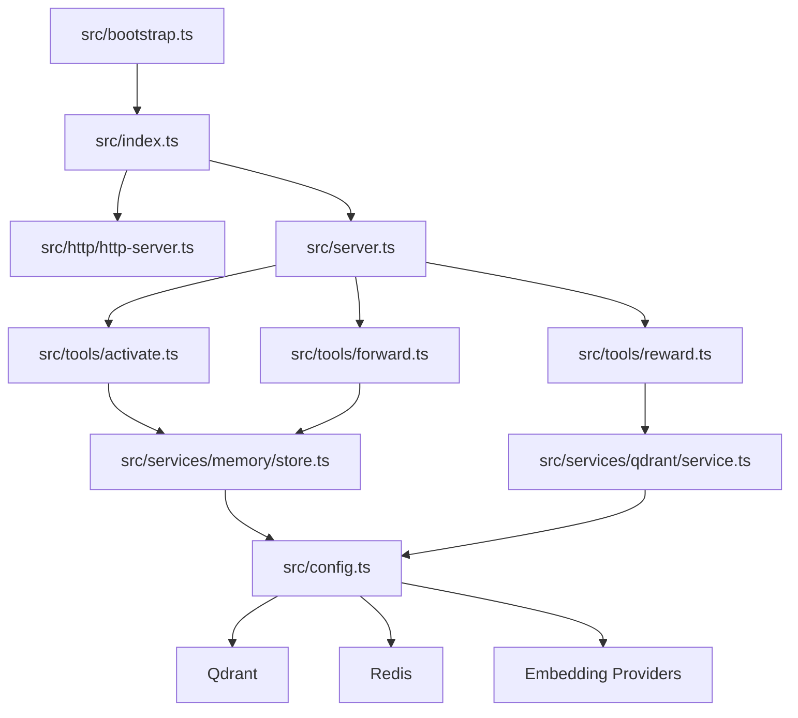

# Project Overview

<cite>
**Referenced Files in This Document**
- [README.md](file://README.md)
- [src/index.ts](file://src/index.ts)
- [src/server.ts](file://src/server.ts)
- [src/bootstrap.ts](file://src/bootstrap.ts)
- [src/http/http-server.ts](file://src/http/http-server.ts)
- [src/services/memory/store.ts](file://src/services/memory/store.ts)
- [src/services/qdrant/service.ts](file://src/services/qdrant/service.ts)
- [src/config.ts](file://src/config.ts)
- [src/mcp-apps/kairos-server-ui-capability.ts](file://src/mcp-apps/kairos-server-ui-capability.ts)
- [src/ui/App.tsx](file://src/ui/App.tsx)
- [docs/architecture/README.md](file://docs/architecture/README.md)
- [docs/architecture/infrastructure.md](file://docs/architecture/infrastructure.md)
- [src/tools/activate.ts](file://src/tools/activate.ts)
- [src/tools/forward.ts](file://src/tools/forward.ts)
- [src/tools/reward.ts](file://src/tools/reward.ts)
- [package.json](file://package.json)
</cite>

## Table of Contents
1. [Introduction](#introduction)
2. [Project Structure](#project-structure)
3. [Core Components](#core-components)
4. [Architecture Overview](#architecture-overview)
5. [Detailed Component Analysis](#detailed-component-analysis)
6. [Dependency Analysis](#dependency-analysis)
7. [Performance Considerations](#performance-considerations)
8. [Troubleshooting Guide](#troubleshooting-guide)
9. [Conclusion](#conclusion)

## Introduction
KAIROS MCP is a TypeScript service designed to store and execute reusable protocol chains for AI agents. It provides:
- An MCP endpoint at POST /mcp
- REST endpoints under /api/*
- A browser UI under /ui
- A CLI named kairos

The system centers on three core ideas:
- Persistent memory: store and retrieve protocol chains across sessions
- Deterministic execution: activate → forward (per layer) → reward; the server drives next_action at every step
- Agent-facing design: tool descriptions and error messages built for programmatic consumption and recovery

Protocol execution follows a fixed order: activate (match adapters), forward (run each layer’s contract; loop), then reward (finalize the run). Discovery and adapter lifecycle tools (spaces → train → tune → export → delete) operate independently of the run order.

**Section sources**
- [README.md:10-31](file://README.md#L10-L31)
- [README.md:60-92](file://README.md#L60-L92)

## Project Structure
The project is organized around a layered architecture:
- Bootstrap and server entrypoint orchestrate startup and HTTP/MCP server creation
- HTTP server composes middleware, routes, and UI static assets
- Service layer integrates Qdrant vector storage, embedding providers, and optional Redis cache
- UI is a React application served from the same origin
- CLI provides HTTP-based command-line access

**Diagram sources**
- [src/bootstrap.ts:1-55](file://src/bootstrap.ts#L1-L55)
- [src/index.ts:74-134](file://src/index.ts#L74-L134)
- [src/http/http-server.ts:22-58](file://src/http/http-server.ts#L22-L58)
- [src/server.ts:125-193](file://src/server.ts#L125-L193)
- [src/services/memory/store.ts:20-53](file://src/services/memory/store.ts#L20-L53)
- [src/services/qdrant/service.ts:16-46](file://src/services/qdrant/service.ts#L16-L46)
- [src/config.ts:276-330](file://src/config.ts#L276-L330)

**Section sources**
- [src/bootstrap.ts:1-55](file://src/bootstrap.ts#L1-L55)
- [src/index.ts:74-134](file://src/index.ts#L74-L134)
- [src/http/http-server.ts:22-58](file://src/http/http-server.ts#L22-L58)
- [src/server.ts:125-193](file://src/server.ts#L125-L193)
- [src/config.ts:276-330](file://src/config.ts#L276-L330)

## Core Components
- Memory and vector storage: Qdrant-backed adapter store with collection management and health checks
- Embedding service: vector generation via OpenAI or TEI with dimension probing
- Authentication: optional Keycloak OIDC integration with bearer/JWT validation
- UI: React SPA served from the same origin under /ui
- CLI: HTTP client wrapper for server interactions
- Observability: dedicated metrics server on a separate port

Key runtime configuration includes port settings, embedding provider selection, search tuning, and optional Redis and Keycloak integration.

**Section sources**
- [src/services/memory/store.ts:20-152](file://src/services/memory/store.ts#L20-L152)
- [src/services/qdrant/service.ts:16-152](file://src/services/qdrant/service.ts#L16-L152)
- [src/config.ts:224-330](file://src/config.ts#L224-L330)
- [src/http/http-server.ts:22-58](file://src/http/http-server.ts#L22-L58)
- [package.json:30-32](file://package.json#L30-L32)

## Architecture Overview
The system enforces a strict startup sequence to ensure readiness before serving traffic:
1. Install global error handlers
2. Initialize Qdrant client and wait for health
3. Probe embedding dimension
4. Initialize memory store and inject embedded resources
5. Start metrics server
6. Start HTTP server

**Diagram sources**
- [src/index.ts:44-121](file://src/index.ts#L44-L121)
- [src/services/memory/store.ts:59-121](file://src/services/memory/store.ts#L59-L121)

The internal wiring connects HTTP/MCP routes to tool implementations, which delegate to service layer components. Qdrant stores durable adapter data; Redis caches transient state; embedding providers supply vectors.

**Diagram sources**
- [docs/architecture/infrastructure.md:170-257](file://docs/architecture/infrastructure.md#L170-L257)
- [src/server.ts:125-193](file://src/server.ts#L125-L193)
- [src/http/http-server.ts:22-48](file://src/http/http-server.ts#L22-L48)

**Section sources**
- [src/index.ts:44-121](file://src/index.ts#L44-L121)
- [docs/architecture/infrastructure.md:110-163](file://docs/architecture/infitecture.md#L110-L163)
- [docs/architecture/infrastructure.md:170-257](file://docs/architecture/infrastructure.md#L170-L257)

## Detailed Component Analysis

### Three Execution Phases
The protocol execution proceeds deterministically across three phases:

1) Activate
- Purpose: Match adapters to the input query and return ranked choices
- Behavior: Agents select one choice and follow its next_action exactly
- Outputs include adapter URIs, roles (match/refine/create), activation scores, and guidance for subsequent steps

2) Forward
- Purpose: Execute adapter layers in sequence
- Behavior: For the first call, omit solution; for subsequent calls, supply a solution whose type matches the layer’s contract
- Loop continues until the server signals to call reward

3) Reward
- Purpose: Finalize the run by attaching a reward signal
- Behavior: Submit outcome (success/failure) and optional evaluator fields; server propagates metrics and closes the execution

**Diagram sources**
- [README.md:35-43](file://README.md#L35-L43)
- [README.md:67-83](file://README.md#L67-L83)

**Section sources**
- [README.md:28-83](file://README.md#L28-L83)
- [src/tools/activate.ts:43-200](file://src/tools/activate.ts#L43-L200)
- [src/tools/forward.ts:93-200](file://src/tools/forward.ts#L93-L200)
- [src/tools/reward.ts:27-156](file://src/tools/reward.ts#L27-L156)

### Relationship Between Qdrant, Keycloak, and React UI
- Qdrant vector storage: Durable adapter and step storage with collection management and health checks
- Keycloak authentication: Optional OIDC integration enabling browser sessions and Bearer JWT validation
- React UI: Served from the same origin at /ui with route-based code splitting and navigation

**Diagram sources**
- [src/http/http-server.ts:22-48](file://src/http/http-server.ts#L22-L48)
- [src/services/qdrant/service.ts:16-46](file://src/services/qdrant/service.ts#L16-L46)
- [src/config.ts:113-171](file://src/config.ts#L113-L171)
- [src/ui/App.tsx:1-133](file://src/ui/App.tsx#L1-L133)

**Section sources**
- [src/services/memory/store.ts:20-53](file://src/services/memory/store.ts#L20-L53)
- [src/config.ts:113-171](file://src/config.ts#L113-L171)
- [src/ui/App.tsx:1-133](file://src/ui/App.tsx#L1-L133)

### Practical Examples: Agent Interactions via MCP
Agents interact with KAIROS by invoking tools in the prescribed order. The authoritative behavior is defined in the embedded tool resources and enforced by strict input/output schemas. Agents must:
- Obey next_action verbatim
- Echo server-issued nonces, proof hashes, and URIs exactly
- Not invent URIs, skip layers, or submit mismatched solution types

**Diagram sources**
- [README.md:62-92](file://README.md#L62-L92)
- [src/server.ts:42-108](file://src/server.ts#L42-L108)
- [src/tools/activate.ts:43-200](file://src/tools/activate.ts#L43-L200)
- [src/tools/forward.ts:93-200](file://src/tools/forward.ts#L93-L200)
- [src/tools/reward.ts:27-156](file://src/tools/reward.ts#L27-L156)

**Section sources**
- [README.md:62-92](file://README.md#L62-L92)
- [src/server.ts:42-108](file://src/server.ts#L42-L108)

## Dependency Analysis
The system exhibits clear separation of concerns:
- Bootstrap and server orchestration depend on configuration and service initialization
- HTTP server depends on middleware, routes, and UI static assets
- MCP server registers tools that depend on memory store and Qdrant service
- Services depend on external systems (Qdrant, Redis, embedding providers) configured via environment variables

**Diagram sources**
- [src/bootstrap.ts:1-55](file://src/bootstrap.ts#L1-L55)
- [src/index.ts:74-134](file://src/index.ts#L74-L134)
- [src/http/http-server.ts:22-58](file://src/http/http-server.ts#L22-L58)
- [src/server.ts:125-193](file://src/server.ts#L125-L193)
- [src/tools/activate.ts:1-28](file://src/tools/activate.ts#L1-L28)
- [src/tools/forward.ts:1-36](file://src/tools/forward.ts#L1-L36)
- [src/tools/reward.ts:1-16](file://src/tools/reward.ts#L1-L16)
- [src/services/memory/store.ts:1-11](file://src/services/memory/store.ts#L1-L11)
- [src/services/qdrant/service.ts:1-14](file://src/services/qdrant/service.ts#L1-L14)
- [src/config.ts:276-330](file://src/config.ts#L276-L330)

**Section sources**
- [src/bootstrap.ts:1-55](file://src/bootstrap.ts#L1-L55)
- [src/index.ts:74-134](file://src/index.ts#L74-L134)
- [src/http/http-server.ts:22-58](file://src/http/http-server.ts#L22-L58)
- [src/server.ts:125-193](file://src/server.ts#L125-L193)
- [src/config.ts:276-330](file://src/config.ts#L276-L330)

## Performance Considerations
- Startup health checks prevent serving until Qdrant is ready, reducing early failures
- Dedicated metrics server isolates monitoring overhead from application requests
- Embedding dimension probing avoids misalignment costs
- Optional Redis cache reduces repeated computation for transient state
- Rate limiting and input size caps protect against abuse and excessive resource usage

[No sources needed since this section provides general guidance]

## Troubleshooting Guide
Common operational issues and remedies:
- Server does not start: inspect container logs and verify required ports are free
- Health check returns 503: wait for Qdrant to become ready
- Embeddings fail on startup: configure a working embedding backend in environment variables
- Auth-enabled development failing: use the fullstack profile and configure realms
- CLI keeps asking for login: confirm API URL, token validity, and Keycloak issuer/audience alignment

**Section sources**
- [README.md:346-401](file://README.md#L346-L401)

## Conclusion
KAIROS MCP delivers a robust platform for AI agents to execute deterministic, persistent protocol chains. Its architecture integrates Qdrant vector storage, optional Keycloak authentication, a React UI, and a CLI, all orchestrated through a strict startup sequence and MCP tool contracts. The three-phase execution model—activate, forward, reward—ensures reliable, agent-friendly workflows with strong observability and resilience.

[No sources needed since this section summarizes without analyzing specific files]