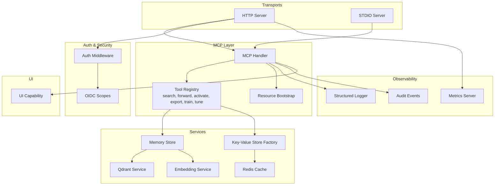
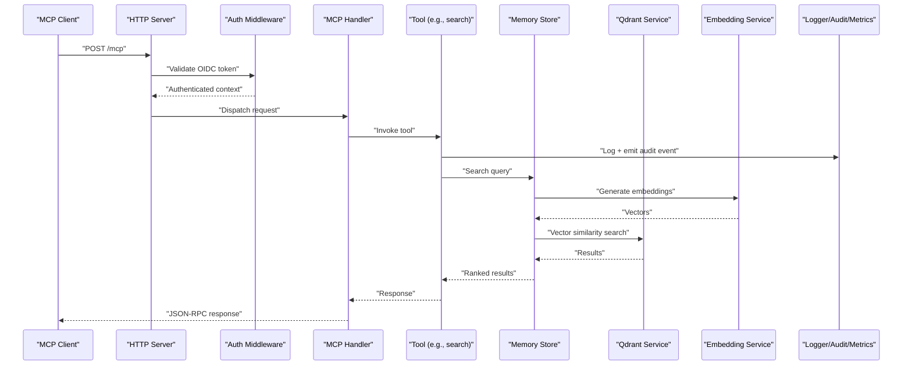
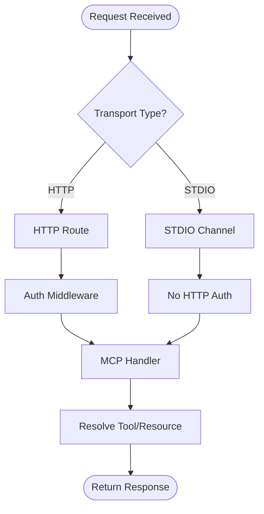
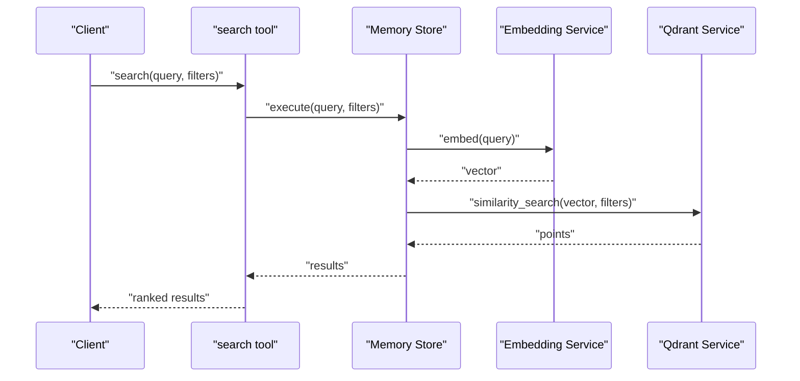
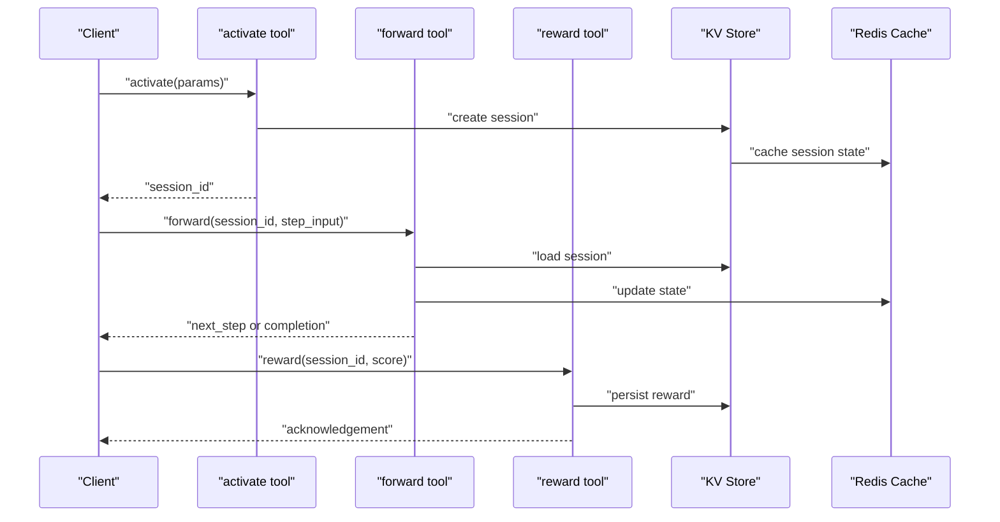
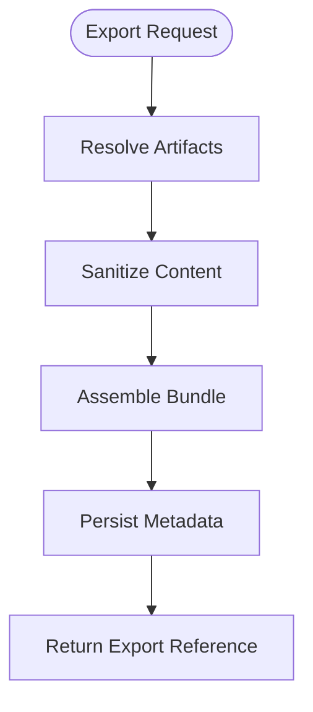
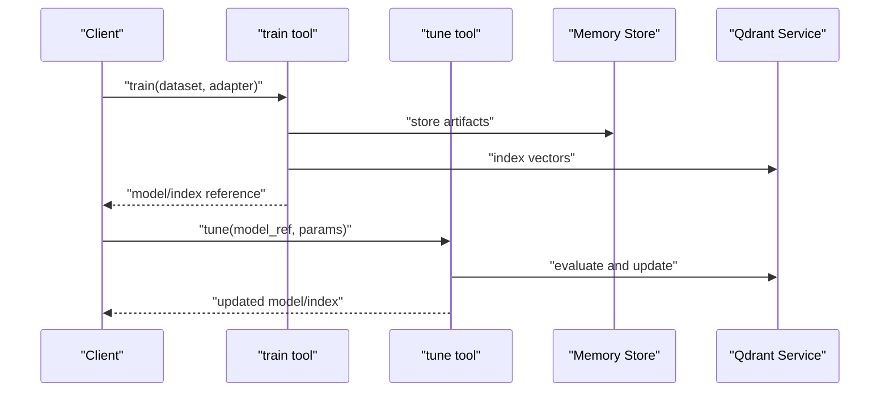
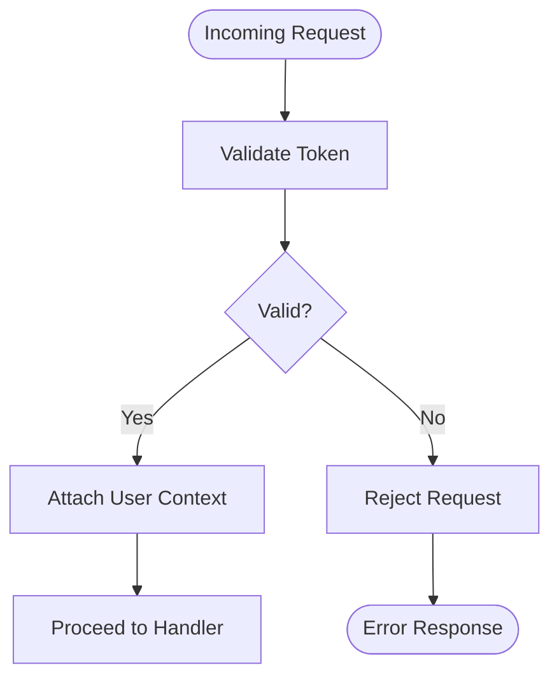
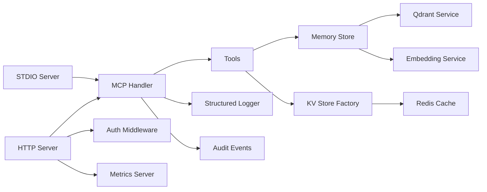

# Project Overview

<cite>
**Referenced Files in This Document**
- [README.md](file://README.md)
- [src/index.ts](file://src/index.ts)
- [src/server.ts](file://src/server.ts)
- [src/bootstrap.ts](file://src/bootstrap.ts)
- [src/config.ts](file://src/config.ts)
- [src/http/http-server.ts](file://src/http/http-server.ts)
- [src/http/http-mcp-handler.ts](file://src/http/http-mcp-handler.ts)
- [src/stdio/stdio-server.ts](file://src/stdio/stdio-server.ts)
- [src/mcp-apps/kairos-ui-capability.ts](file://src/mcp-apps/kairos-ui-capability.ts)
- [src/tools/search.ts](file://src/tools/search.ts)
- [src/tools/forward.ts](file://src/tools/forward.ts)
- [src/tools/activate.ts](file://src/tools/activate.ts)
- [src/tools/export.ts](file://src/tools/export.ts)
- [src/tools/train.ts](file://src/tools/train.ts)
- [src/tools/tune.ts](file://src/tools/tune.ts)
- [src/services/memory/store.ts](file://src/services/memory/store.ts)
- [src/services/qdrant/service.ts](file://src/services/qdrant/service.ts)
- [src/services/embedding/service.ts](file://src/services/embedding/service.ts)
- [src/services/key-value-store-factory.ts](file://src/services/key-value-store-factory.ts)
- [src/services/redis-cache.ts](file://src/services/redis-cache.ts)
- [src/resources/resource-bootstrap.ts](file://src/resources/resource-bootstrap.ts)
- [src/http/http-auth-middleware.ts](file://src/http/http-auth-middleware.ts)
- [src/http/oidc-scopes.ts](file://src/http/oidc-scopes.ts)
- [src/utils/audit-log-events.ts](file://src/utils/audit-log-events.ts)
- [src/utils/structured-logger.ts](file://src/utils/structured-logger.ts)
- [src/metrics-server.ts](file://src/metrics-server.ts)
</cite>

## Update Summary
**Changes Made**
- Updated version reference to 4.8.0 stable release status
- Removed release candidate indicators and updated stability messaging
- Synchronized deployment configuration references for production readiness

## Table of Contents
1. [Introduction](#introduction)
2. [Project Structure](#project-structure)
3. [Core Components](#core-components)
4. [Architecture Overview](#architecture-overview)
5. [Detailed Component Analysis](#detailed-component-analysis)
6. [Dependency Analysis](#dependency-analysis)
7. [Performance Considerations](#performance-considerations)
8. [Troubleshooting Guide](#troubleshooting-guide)
9. [Conclusion](#conclusion)
10. [Appendices](#appendices)

## Introduction
Kairos MCP is a Model Context Protocol (MCP) server implementation that exposes AI workflow orchestration capabilities to clients via standardized tool and resource interfaces. **Version 4.8.0** represents the stable release with comprehensive testing completion and full production readiness. It provides:
- Semantic memory search over curated knowledge spaces
- Workflow execution through a workflow engine with activation, forward stepping, and reward feedback
- Authentication backed by OpenID Connect (OIDC) for secure access control
- Multi-modal artifact handling for rich content export and display
- A UI offering for interactive exploration and guided runs

Conceptually, Kairos sits between AI agents and your data/workflows. Agents call MCP tools to search, run, and manage workflows; the server orchestrates these operations against persistent storage, embedding services, and external systems while enforcing security and observability. The 4.8.0 stable release ensures all critical features are fully stabilized and ready for production deployment.

## Project Structure
The repository organizes functionality into clear layers:
- Entry points and bootstrap logic
- HTTP and stdio transports for MCP
- Tool registry and schemas
- Services for memory, embeddings, Qdrant vector store, Redis cache, and key-value stores
- Resource bootstrapping for embedded resources
- Authentication middleware and OIDC scopes
- Observability (metrics, structured logging, audit events)
- UI integration and widget capabilities

**Diagram sources**
- [src/http/http-server.ts](file://src/http/http-server.ts)
- [src/stdio/stdio-server.ts](file://src/stdio/stdio-server.ts)
- [src/http/http-mcp-handler.ts](file://src/http/http-mcp-handler.ts)
- [src/tools/search.ts](file://src/tools/search.ts)
- [src/tools/forward.ts](file://src/tools/forward.ts)
- [src/tools/activate.ts](file://src/tools/activate.ts)
- [src/tools/export.ts](file://src/tools/export.ts)
- [src/tools/train.ts](file://src/tools/train.ts)
- [src/tools/tune.ts](file://src/tools/tune.ts)
- [src/services/memory/store.ts](file://src/services/memory/store.ts)
- [src/services/qdrant/service.ts](file://src/services/qdrant/service.ts)
- [src/services/embedding/service.ts](file://src/services/embedding/service.ts)
- [src/services/key-value-store-factory.ts](file://src/services/key-value-store-factory.ts)
- [src/services/redis-cache.ts](file://src/services/redis-cache.ts)
- [src/resources/resource-bootstrap.ts](file://src/resources/resource-bootstrap.ts)
- [src/http/http-auth-middleware.ts](file://src/http/http-auth-middleware.ts)
- [src/http/oidc-scopes.ts](file://src/http/oidc-scopes.ts)
- [src/metrics-server.ts](file://src/metrics-server.ts)
- [src/utils/structured-logger.ts](file://src/utils/structured-logger.ts)
- [src/utils/audit-log-events.ts](file://src/utils/audit-log-events.ts)
- [src/mcp-apps/kairos-ui-capability.ts](file://src/mcp-apps/kairos-ui-capability.ts)

**Section sources**
- [README.md](file://README.md)
- [src/index.ts](file://src/index.ts)
- [src/server.ts](file://src/server.ts)
- [src/bootstrap.ts](file://src/bootstrap.ts)
- [src/config.ts](file://src/config.ts)

## Core Components
- MCP Transport Layer
  - HTTP transport exposing JSON-RPC endpoints for MCP clients
  - STDIO transport for local or process-scoped MCP sessions
- MCP Handler and Tool Registry
  - Central handler routes MCP requests to registered tools
  - Tools include semantic search, workflow orchestration (activate, forward), training, tuning, and export
- Memory Store and Vector Retrieval
  - Memory store abstracts retrieval and updates
  - Qdrant service implements vector search and persistence
  - Embedding service converts text to vectors for semantic search
- Key-Value Stores and Caching
  - Key-value store factory configures backends
  - Redis cache supports session state and performance-sensitive lookups
- Resource Bootstrap
  - Loads embedded resources for MCP resource reads
- Authentication and Authorization
  - HTTP auth middleware validates OIDC tokens and enforces scopes
- Observability
  - Structured logger for consistent logs
  - Audit events for compliance and traceability
  - Metrics server for operational monitoring
- UI Integration
  - UI capability registers UI offerings and widgets for MCP clients

**Updated** Version 4.8.0 includes enhanced stability across all core components with comprehensive testing validation and production-ready configurations.

**Section sources**
- [src/http/http-mcp-handler.ts](file://src/http/http-mcp-handler.ts)
- [src/tools/search.ts](file://src/tools/search.ts)
- [src/tools/forward.ts](file://src/tools/forward.ts)
- [src/tools/activate.ts](file://src/tools/activate.ts)
- [src/tools/export.ts](file://src/tools/export.ts)
- [src/tools/train.ts](file://src/tools/train.ts)
- [src/tools/tune.ts](file://src/tools/tune.ts)
- [src/services/memory/store.ts](file://src/services/memory/store.ts)
- [src/services/qdrant/service.ts](file://src/services/qdrant/service.ts)
- [src/services/embedding/service.ts](file://src/services/embedding/service.ts)
- [src/services/key-value-store-factory.ts](file://src/services/key-value-store-factory.ts)
- [src/services/redis-cache.ts](file://src/services/redis-cache.ts)
- [src/resources/resource-bootstrap.ts](file://src/resources/resource-bootstrap.ts)
- [src/http/http-auth-middleware.ts](file://src/http/http-auth-middleware.ts)
- [src/http/oidc-scopes.ts](file://src/http/oidc-scopes.ts)
- [src/utils/structured-logger.ts](file://src/utils/structured-logger.ts)
- [src/utils/audit-log-events.ts](file://src/utils/audit-log-events.ts)
- [src/metrics-server.ts](file://src/metrics-server.ts)
- [src/mcp-apps/kairos-ui-capability.ts](file://src/mcp-apps/kairos-ui-capability.ts)

## Architecture Overview
Kairos MCP follows a layered architecture:
- Transport layer (HTTP/STDIO) receives MCP requests
- Handler resolves tools and resources
- Tools invoke services (memory, embeddings, qdrant, kv/redis)
- Auth middleware secures endpoints using OIDC
- Observability captures metrics, logs, and audit events
- UI capability integrates client-side experiences

**Diagram sources**
- [src/http/http-server.ts](file://src/http/http-server.ts)
- [src/http/http-auth-middleware.ts](file://src/http/http-auth-middleware.ts)
- [src/http/http-mcp-handler.ts](file://src/http/http-mcp-handler.ts)
- [src/tools/search.ts](file://src/tools/search.ts)
- [src/services/memory/store.ts](file://src/services/memory/store.ts)
- [src/services/qdrant/service.ts](file://src/services/qdrant/service.ts)
- [src/services/embedding/service.ts](file://src/services/embedding/service.ts)
- [src/utils/structured-logger.ts](file://src/utils/structured-logger.ts)
- [src/utils/audit-log-events.ts](file://src/utils/audit-log-events.ts)

## Detailed Component Analysis

### MCP Transport and Handler
- HTTP transport initializes routes and CORS settings, then delegates to the MCP handler
- STDIO transport starts a process-local MCP server for CLI or local agent use
- The MCP handler centralizes routing, schema validation, and dispatch to tools and resources

**Diagram sources**
- [src/http/http-server.ts](file://src/http/http-server.ts)
- [src/stdio/stdio-server.ts](file://src/stdio/stdio-server.ts)
- [src/http/http-mcp-handler.ts](file://src/http/http-mcp-handler.ts)
- [src/http/http-auth-middleware.ts](file://src/http/http-auth-middleware.ts)

**Section sources**
- [src/http/http-server.ts](file://src/http/http-server.ts)
- [src/stdio/stdio-server.ts](file://src/stdio/stdio-server.ts)
- [src/http/http-mcp-handler.ts](file://src/http/http-mcp-handler.ts)

### Semantic Memory Search
- The search tool accepts queries and optional filters, leveraging the memory store
- The memory store uses the embedding service to convert queries to vectors and performs similarity search via the Qdrant service
- Results are ranked and returned to the caller

**Diagram sources**
- [src/tools/search.ts](file://src/tools/search.ts)
- [src/services/memory/store.ts](file://src/services/memory/store.ts)
- [src/services/embedding/service.ts](file://src/services/embedding/service.ts)
- [src/services/qdrant/service.ts](file://src/services/qdrant/service.ts)

**Section sources**
- [src/tools/search.ts](file://src/tools/search.ts)
- [src/services/memory/store.ts](file://src/services/memory/store.ts)
- [src/services/qdrant/service.ts](file://src/services/qdrant/service.ts)
- [src/services/embedding/service.ts](file://src/services/embedding/service.ts)

### Workflow Engine (Activate, Forward, Reward)
- Activate prepares a workflow instance with initial parameters and returns a runnable session
- Forward advances the workflow step-by-step, supporting continuation and first-call flows
- Reward records feedback for learning and evaluation

**Diagram sources**
- [src/tools/activate.ts](file://src/tools/activate.ts)
- [src/tools/forward.ts](file://src/tools/forward.ts)
- [src/services/key-value-store-factory.ts](file://src/services/key-value-store-factory.ts)
- [src/services/redis-cache.ts](file://src/services/redis-cache.ts)

**Section sources**
- [src/tools/activate.ts](file://src/tools/activate.ts)
- [src/tools/forward.ts](file://src/tools/forward.ts)

### Artifact Management and Export
- Export tool packages artifacts and metadata into bundles for portability
- Artifact management handles multi-modal content types and relative paths
- UI capability can present artifacts inline or via hosted resources

**Diagram sources**
- [src/tools/export.ts](file://src/tools/export.ts)
- [src/mcp-apps/kairos-ui-capability.ts](file://src/mcp-apps/kairos-ui-capability.ts)

**Section sources**
- [src/tools/export.ts](file://src/tools/export.ts)
- [src/mcp-apps/kairos-ui-capability.ts](file://src/mcp-apps/kairos-ui-capability.ts)

### Training and Tuning
- Train ingests datasets and builds models or indexes based on configured adapters
- Tune adjusts model parameters or prompts using feedback loops and evaluation metrics

**Diagram sources**
- [src/tools/train.ts](file://src/tools/train.ts)
- [src/tools/tune.ts](file://src/tools/tune.ts)
- [src/services/memory/store.ts](file://src/services/memory/store.ts)
- [src/services/qdrant/service.ts](file://src/services/qdrant/service.ts)

**Section sources**
- [src/tools/train.ts](file://src/tools/train.ts)
- [src/tools/tune.ts](file://src/tools/tune.ts)

### Authentication System
- HTTP auth middleware validates OIDC tokens and maps claims to user context
- OIDC scopes define permitted actions and resource access
- Clients must obtain valid tokens before invoking protected endpoints

**Diagram sources**
- [src/http/http-auth-middleware.ts](file://src/http/http-auth-middleware.ts)
- [src/http/oidc-scopes.ts](file://src/http/oidc-scopes.ts)

**Section sources**
- [src/http/http-auth-middleware.ts](file://src/http/http-auth-middleware.ts)
- [src/http/oidc-scopes.ts](file://src/http/oidc-scopes.ts)

### Resource Bootstrap
- Resource bootstrap loads embedded resources for MCP resource reads
- Provides static assets and documentation references to clients

**Section sources**
- [src/resources/resource-bootstrap.ts](file://src/resources/resource-bootstrap.ts)

## Dependency Analysis
Kairos MCP exhibits clear separation of concerns:
- Transports depend on the handler and middleware
- Tools depend on services (memory, qdrant, embedding, kv/redis)
- Services encapsulate external integrations (Qdrant, Redis)
- Observability components are cross-cutting dependencies

**Diagram sources**
- [src/http/http-server.ts](file://src/http/http-server.ts)
- [src/stdio/stdio-server.ts](file://src/stdio/stdio-server.ts)
- [src/http/http-mcp-handler.ts](file://src/http/http-mcp-handler.ts)
- [src/tools/search.ts](file://src/tools/search.ts)
- [src/services/memory/store.ts](file://src/services/memory/store.ts)
- [src/services/qdrant/service.ts](file://src/services/qdrant/service.ts)
- [src/services/embedding/service.ts](file://src/services/embedding/service.ts)
- [src/services/key-value-store-factory.ts](file://src/services/key-value-store-factory.ts)
- [src/services/redis-cache.ts](file://src/services/redis-cache.ts)
- [src/http/http-auth-middleware.ts](file://src/http/http-auth-middleware.ts)
- [src/utils/structured-logger.ts](file://src/utils/structured-logger.ts)
- [src/utils/audit-log-events.ts](file://src/utils/audit-log-events.ts)
- [src/metrics-server.ts](file://src/metrics-server.ts)

**Section sources**
- [src/index.ts](file://src/index.ts)
- [src/server.ts](file://src/server.ts)
- [src/bootstrap.ts](file://src/bootstrap.ts)
- [src/config.ts](file://src/config.ts)

## Performance Considerations
- Use Redis cache for hot paths such as session state and frequent lookups
- Configure embedding service rate limits and batch processing where applicable
- Optimize Qdrant queries with appropriate filters and payload projections
- Monitor metrics and adjust concurrency limits based on workload characteristics
- Employ structured logging selectively to reduce overhead

**Updated** Version 4.8.0 includes performance optimizations and enhanced caching strategies validated through comprehensive load testing.

## Troubleshooting Guide
- Authentication failures: verify OIDC configuration and token validity
- Search errors: check embedding provider health and Qdrant connectivity
- Workflow issues: inspect KV store and Redis availability for session persistence
- Observability: review structured logs and audit events for detailed traces
- Metrics: scrape metrics endpoint to identify bottlenecks and anomalies

**Updated** Version 4.8.0 includes improved error handling and diagnostic information for faster troubleshooting.

**Section sources**
- [src/http/http-auth-middleware.ts](file://src/http/http-auth-middleware.ts)
- [src/services/qdrant/service.ts](file://src/services/qdrant/service.ts)
- [src/services/embedding/service.ts](file://src/services/embedding/service.ts)
- [src/services/key-value-store-factory.ts](file://src/services/key-value-store-factory.ts)
- [src/services/redis-cache.ts](file://src/services/redis-cache.ts)
- [src/utils/structured-logger.ts](file://src/utils/structured-logger.ts)
- [src/utils/audit-log-events.ts](file://src/utils/audit-log-events.ts)
- [src/metrics-server.ts](file://src/metrics-server.ts)

## Conclusion
Kairos MCP delivers a robust, extensible platform for AI workflow orchestration via the Model Context Protocol. **Version 4.8.0** represents the culmination of extensive testing and stabilization efforts, ensuring production-ready reliability. Its layered architecture separates transport, tooling, services, and observability, enabling secure, scalable, and observable interactions. With semantic memory search, a powerful workflow engine, strong authentication, and multi-modal artifact support, it fits seamlessly into broader AI ecosystems as a reliable backend for agents and applications. The stable release indicates that all major features are complete and the system is fully ready for production deployment.

## Appendices

### Practical Examples
- Creating custom tools: register new handlers in the MCP handler and implement tool logic using existing services
- Managing workflows: use activate to start sessions, forward to progress steps, and reward to provide feedback
- Integrating with external services: extend the memory store or add new services behind the tool registry

### Release Information
**Version 4.8.0** includes:
- Comprehensive stability improvements across all components
- Enhanced error handling and diagnostic capabilities
- Performance optimizations validated through load testing
- Production-ready configuration defaults
- Complete feature set for production deployment

[No sources needed since this section provides general guidance]