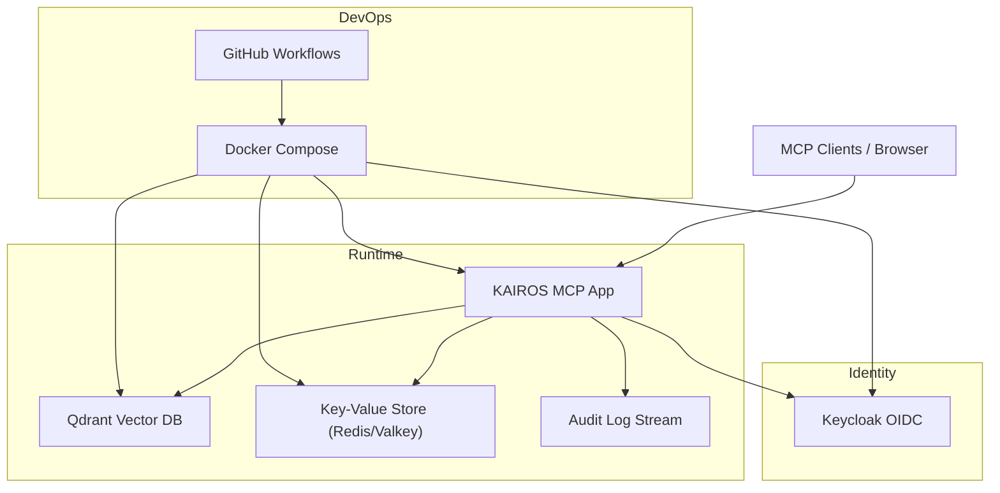
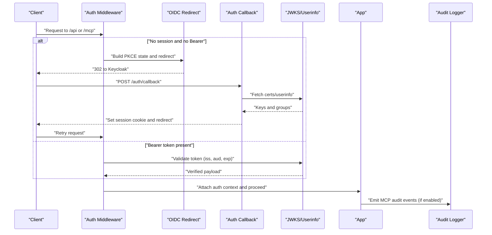
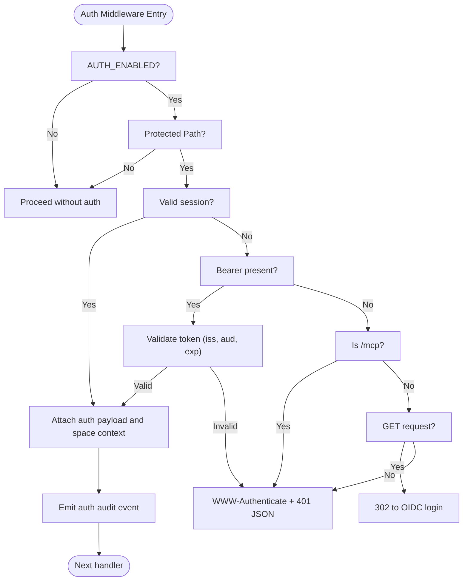
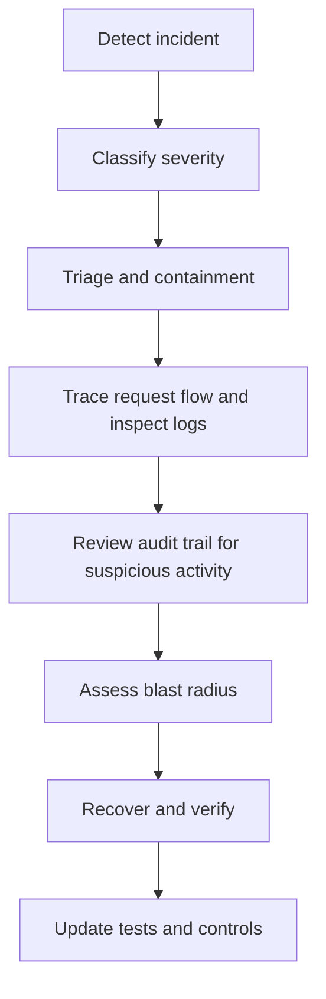
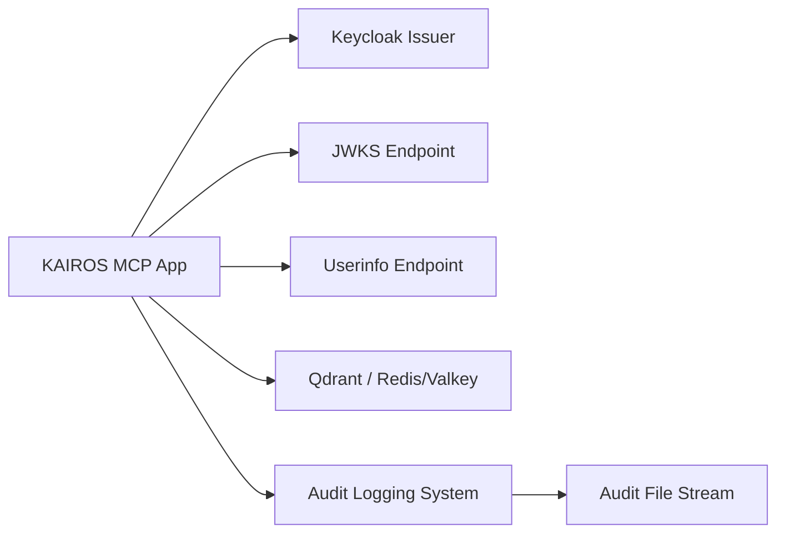

# Security Considerations

<cite>
**Referenced Files in This Document**
- [SECURITY.md](file://SECURITY.md)
- [threat-model.md](file://docs/security/threat-model.md)
- [incident-runbook.md](file://docs/security/incident-runbook.md)
- [code-security-setup.md](file://docs/security/code-security-setup.md)
- [audit-log.md](file://docs/security/audit-log.md)
- [src/config.ts](file://src/config.ts)
- [src/http/http-auth-middleware.ts](file://src/http/http-auth-middleware.ts)
- [src/http/http-auth-oidc-redirect.ts](file://src/http/http-auth-oidc-redirect.ts)
- [src/http/http-auth-callback.ts](file://src/http/http-auth-callback.ts)
- [src/http/bearer-validate.ts](file://src/http/bearer-validate.ts)
- [src/http/oidc-profile-claims.ts](file://src/http/oidc-profile-claims.ts)
- [src/http/oidc-scopes.ts](file://src/http/oidc-scopes.ts)
- [src/http/http-mcp-cors.ts](file://src/http/http-mcp-cors.ts)
- [src/http/mcp-audit-emit.ts](file://src/http/mcp-audit-emit.ts)
- [src/http/http-mcp-handler.ts](file://src/http/http-mcp-handler.ts)
- [src/services/embedding/audit.ts](file://src/services/embedding/audit.ts)
- [src/services/embedding/providers.ts](file://src/services/embedding/providers.ts)
- [src/utils/structured-logger.ts](file://src/utils/structured-logger.ts)
- [src/utils/audit-log-events.ts](file://src/utils/audit-log-events.ts)
- [src/utils/audit-mcp-summary.ts](file://src/utils/audit-mcp-summary.ts)
- [compose.yaml](file://compose.yaml)
</cite>

## Update Summary
**Changes Made**
- Added comprehensive audit logging specification for MCP audit trails
- Documented data sanitization policies for audit events
- Added compliance considerations for audit logging
- Integrated audit logging into authentication security considerations
- Updated security architecture to include audit trail monitoring

## Table of Contents
1. [Introduction](#introduction)
2. [Project Structure](#project-structure)
3. [Core Components](#core-components)
4. [Architecture Overview](#architecture-overview)
5. [Detailed Component Analysis](#detailed-component-analysis)
6. [Dependency Analysis](#dependency-analysis)
7. [Performance Considerations](#performance-considerations)
8. [Troubleshooting Guide](#troubleshooting-guide)
9. [Conclusion](#conclusion)
10. [Appendices](#appendices)

## Introduction
This document consolidates the security posture of KAIROS MCP with a focus on authentication, data protection, security scanning, compliance, and operational security. It synthesizes repository-provided policies, threat models, and implementation details to guide secure deployment and operations. **Updated** to include comprehensive audit logging specifications for MCP audit trails, including data sanitization policies and compliance requirements.

## Project Structure
Security-relevant areas include:
- Authentication and OIDC integration (middleware, redirect, callback, bearer validation)
- Configuration of trusted issuers, audiences, and session parameters
- CORS handling for MCP
- Infrastructure composition for Qdrant, Redis/Valkey, and Keycloak
- Security policy, threat model, incident response, and code security setup documentation
- **New** Audit logging system for MCP tool call events with sanitization and compliance controls

**Diagram sources**
- [compose.yaml:10-183](file://compose.yaml#L10-L183)
- [src/http/http-auth-middleware.ts:167-316](file://src/http/http-auth-middleware.ts#L167-L316)
- [src/http/http-auth-callback.ts:122-233](file://src/http/http-auth-callback.ts#L122-L233)
- [docs/security/audit-log.md:157-163](file://docs/security/audit-log.md#L157-L163)

**Section sources**
- [compose.yaml:10-183](file://compose.yaml#L10-L183)
- [docs/security/audit-log.md:1-217](file://docs/security/audit-log.md#L1-217)

## Core Components
- Authentication middleware supporting session-based and Bearer-based OIDC flows
- OIDC redirect and PKCE state management
- Token callback exchanging authorization code for tokens and establishing session
- Bearer token validation using JWKS and audience/issuer checks
- OIDC profile claims whitelisting and group allowlisting
- MCP CORS configuration for browser and tool clients
- Configuration of trusted issuers, audiences, session secret, and max age
- **New** Audit logging system with configurable verbosity levels and sanitization policies
- **New** MCP tool call audit trail with metadata, request, and response capture levels

**Section sources**
- [src/http/http-auth-middleware.ts:167-316](file://src/http/http-auth-middleware.ts#L167-L316)
- [src/http/http-auth-oidc-redirect.ts:28-101](file://src/http/http-auth-oidc-redirect.ts#L28-L101)
- [src/http/http-auth-callback.ts:122-233](file://src/http/http-auth-callback.ts#L122-L233)
- [src/http/bearer-validate.ts:120-209](file://src/http/bearer-validate.ts#L120-L209)
- [src/http/oidc-profile-claims.ts:119-153](file://src/http/oidc-profile-claims.ts#L119-L153)
- [src/http/http-mcp-cors.ts:3-29](file://src/http/http-mcp-cors.ts#L3-L29)
- [src/config.ts:113-172](file://src/config.ts#L113-L172)
- [docs/security/audit-log.md:89-103](file://docs/security/audit-log.md#L89-L103)
- [docs/security/audit-log.md:145-156](file://docs/security/audit-log.md#L145-L156)

## Architecture Overview
The authentication architecture integrates browser sessions and Bearer tokens through Keycloak, with session cookies and JWT validation ensuring access control across API and MCP endpoints. **Updated** to include audit logging architecture for MCP tool call events with configurable sanitization and compliance controls.

**Diagram sources**
- [src/http/http-auth-middleware.ts:167-316](file://src/http/http-auth-middleware.ts#L167-L316)
- [src/http/http-auth-oidc-redirect.ts:28-101](file://src/http/http-auth-oidc-redirect.ts#L28-L101)
- [src/http/http-auth-callback.ts:122-233](file://src/http/http-auth-callback.ts#L122-L233)
- [src/http/bearer-validate.ts:120-209](file://src/http/bearer-validate.ts#L120-L209)
- [src/http/mcp-audit-emit.ts:1-200](file://src/http/mcp-audit-emit.ts#L1-200)

## Detailed Component Analysis

### Authentication Security
- OIDC configuration
  - Trusted issuers and allowed audiences are centrally configured and expanded to include localhost/127.0.0.1 pairs for compatibility.
  - Scopes advertised via discovery include openid, profile, email, kairos-groups, offline_access.
- Token validation
  - Bearer tokens are validated using JWKS fetched per issuer, with issuer and audience checks and expiration verification.
  - Groups are extracted from access token or merged from userinfo when configured.
- Session management
  - Session cookie is signed with a configurable secret and carries a bounded lifetime.
  - Logout uses RP-initiated logout with optional id_token_hint to bypass static confirmation screens.
- Browser flows
  - PKCE state and code challenge are generated and stored with TTL pruning.
  - CORS headers are set for MCP to support cross-origin RPC.
- **New** Audit trail integration
  - Authentication events are captured in audit logs with configurable verbosity levels.
  - Session creation, validation, and termination events are tracked for security investigations.

**Diagram sources**
- [src/http/http-auth-middleware.ts:167-316](file://src/http/http-auth-middleware.ts#L167-L316)
- [src/http/mcp-audit-emit.ts:1-200](file://src/http/mcp-audit-emit.ts#L1-200)

**Section sources**
- [src/config.ts:113-172](file://src/config.ts#L113-L172)
- [src/http/bearer-validate.ts:120-209](file://src/http/bearer-validate.ts#L120-L209)
- [src/http/oidc-profile-claims.ts:119-153](file://src/http/oidc-profile-claims.ts#L119-L153)
- [src/http/http-auth-oidc-redirect.ts:28-101](file://src/http/http-auth-oidc-redirect.ts#L28-L101)
- [src/http/http-auth-callback.ts:122-233](file://src/http/http-auth-callback.ts#L122-L233)
- [src/http/http-mcp-cors.ts:3-29](file://src/http/http-mcp-cors.ts#L3-L29)
- [docs/security/audit-log.md:89-103](file://docs/security/audit-log.md#L89-L103)

### Audit Logging System
**New** Comprehensive audit logging specification for MCP audit trails:

- **Event Categories**
  - `audit.embedding`: embedding request completion with provider-stage outcomes
  - `audit.anomaly`: heuristic anomalies (high latency, unusual vector norm, dimension mismatch)
  - `audit.mcp`: MCP tool call lifecycle events with configurable verbosity levels

- **Configuration Parameters**
  - `AUDIT_LOG_FILE`: Path to optional append-only audit file stream
  - `AUDIT_LOG_LEVEL`: Verbosity level (0-3) controlling MCP tool call detail capture

- **Audit Levels**
  - Level 0: No MCP audit events
  - Level 1: Metadata only (tool name, correlation_id, tenant_id, request_id, timestamps, duration_ms, status, error_code)
  - Level 2: Request level (Level 1 + sanitized request arguments)
  - Level 3: Full level (Level 2 + sanitized response body)

- **Data Sanitization Policy**
  - Bearer tokens and API keys are redacted using regex patterns
  - Strings capped at 2048 characters
  - Arrays capped at 50 items with `_truncated: true` flag
  - Nested objects capped at depth 6
  - Object keys capped at 50 per level

- **Compliance Considerations**
  - Audit events are sanitized to prevent log injection attacks
  - String and object key bounds prevent log line corruption
  - Structured logging ensures consistent audit trail format
  - Optional separate file stream enables compliance with regulatory requirements

**Section sources**
- [docs/security/audit-log.md:1-217](file://docs/security/audit-log.md#L1-L217)
- [src/utils/audit-mcp-summary.ts:1-200](file://src/utils/audit-mcp-summary.ts#L1-L200)
- [src/utils/audit-log-events.ts:1-200](file://src/utils/audit-log-events.ts#L1-L200)
- [src/http/mcp-audit-emit.ts:1-200](file://src/http/mcp-audit-emit.ts#L1-L200)

### Data Protection Measures
- Encryption at rest
  - Qdrant API key is required when exposing Qdrant beyond localhost.
  - Redis/Valkey is secured with a password when enabled in fullstack profiles.
- Transport security
  - HTTPS recommended for external endpoints; session cookie is marked secure when callback base URL is HTTPS.
  - JWKS and userinfo endpoints are fetched over HTTPS; internal URL override supports container networking.
- Access control
  - Group allowlist restricts which OIDC groups become KAIROS spaces.
  - Space-scoped retrieval and tenant-aware context limit cross-tenant access.
  - Rate limits are configured for HTTP, auth, and MCP endpoints.
- **New** Audit data protection
  - Audit logs are sanitized to remove sensitive information before writing to streams
  - Configurable verbosity levels prevent accidental exposure of sensitive data
  - Separate file streams enable segregation of sensitive vs non-sensitive audit data

**Section sources**
- [compose.yaml:53-106](file://compose.yaml#L53-L106)
- [src/http/http-auth-callback.ts:69-72](file://src/http/http-auth-callback.ts#L69-L72)
- [src/config.ts:87-107](file://src/config.ts#L87-L107)
- [src/http/oidc-profile-claims.ts:119-153](file://src/http/oidc-profile-claims.ts#L119-L153)
- [docs/security/audit-log.md:145-156](file://docs/security/audit-log.md#L145-L156)

### Security Scanning and Compliance
- Vulnerability management
  - Security workflow runs dependency review, npm audit, and CodeQL on PRs, pushes, and weekly.
  - Base image OS Trivy scanning included for critical/high OS packages.
- Release supply chain controls
  - SBOM generation (CycloneDX) and Cosign keyless signing for container images.
  - Renovate prioritization of security updates.
- CI enforcement
  - Branch protection can require Security workflow checks and secret scanning with push protection.
- **New** Audit compliance
  - Audit logging supports compliance frameworks through configurable verbosity and sanitization
  - Structured logging enables automated compliance reporting and monitoring
  - Optional separate audit file stream supports regulatory log retention requirements

**Section sources**
- [SECURITY.md:70-87](file://SECURITY.md#L70-L87)
- [code-security-setup.md:1-46](file://docs/security/code-security-setup.md#L1-L46)
- [docs/security/audit-log.md:13-14](file://docs/security/audit-log.md#L13-L14)

### Deployment and Operational Security
- Secrets management
  - Store secrets in environment variables; avoid committing .env files.
  - SESSION_SECRET must be at least 32 characters when authentication is enabled.
  - **New** AUDIT_LOG_FILE path must be writable by the application process.
- Network exposure
  - Restrict access to Qdrant (port 6333) and Redis/Valkey (port 6379) to trusted hosts.
  - Ensure the data directory is not publicly accessible.
  - **New** Audit log file directory should be restricted to prevent unauthorized access.
- Session alignment
  - Align SESSION_MAX_AGE_SEC with IdP's maximum SSO session for the environment.
- **New** Audit configuration
  - Configure AUDIT_LOG_FILE for compliance requirements in regulated environments
  - Set appropriate AUDIT_LOG_LEVEL based on operational needs and privacy requirements
  - Monitor audit log file permissions and rotation policies

**Section sources**
- [SECURITY.md:28-48](file://SECURITY.md#L28-L48)
- [docs/security/audit-log.md:30-35](file://docs/security/audit-log.md#L30-L35)
- [docs/security/audit-log.md:89-103](file://docs/security/audit-log.md#L89-L103)

### Threat Modeling and Incident Response
- Threat model
  - System boundary includes API surface, identity layer, storage systems, external embedding providers, and **new** audit logging infrastructure.
  - Mitigations address data poisoning, prompt injection, cross-tenant leakage, embedding API abuse, supply-chain compromise, and **new** audit trail tampering.
- Incident response
  - Investigate using request_id, time windows, and tenant/space identifiers.
  - Playbooks for data poisoning, embedding abuse, and cross-tenant access suspicion.
  - **New** Audit trail investigation procedures for unauthorized access attempts and policy violations.
- **New** Audit trail security
  - Monitor for audit log file access patterns and unauthorized modifications
  - Implement integrity checks for audit trail data
  - Establish procedures for audit trail tamper detection and response

**Diagram sources**
- [incident-runbook.md:29-46](file://docs/security/incident-runbook.md#L29-L46)
- [docs/security/audit-log.md:157-163](file://docs/security/audit-log.md#L157-L163)

**Section sources**
- [threat-model.md:1-131](file://docs/security/threat-model.md#L1-L131)
- [incident-runbook.md:1-115](file://docs/security/incident-runbook.md#L1-L115)
- [docs/security/audit-log.md:1-217](file://docs/security/audit-log.md#L1-L217)

### CORS Configuration and Secure Communication
- CORS for MCP
  - Origin-specific headers are set for /mcp with expose of WWW-Authenticate and preflight handling.
- Secure communication
  - Session cookie secure flag is set when callback base URL is HTTPS.
  - Internal URL override allows server-side calls to Keycloak within containers.
- **New** Audit stream security
  - Audit file streams are opened with append mode to prevent log truncation attacks
  - Configured audit paths are validated at startup to prevent path traversal attacks
  - Audit log file permissions are managed to prevent unauthorized access

**Section sources**
- [src/http/http-mcp-cors.ts:3-29](file://src/http/http-mcp-cors.ts#L3-L29)
- [src/http/http-auth-callback.ts:69-72](file://src/http/http-auth-callback.ts#L69-L72)
- [src/config.ts:118-119](file://src/config.ts#L118-L119)
- [docs/security/audit-log.md:34-35](file://docs/security/audit-log.md#L34-L35)

## Dependency Analysis
Authentication and identity dependencies:
- App depends on Keycloak for OIDC issuance and JWKS/userinfo.
- App validates tokens against configured issuers and audiences.
- Session cookie is signed server-side and scoped to the application domain.
- **New** Audit logging system depends on structured logging infrastructure and file system permissions.

**Diagram sources**
- [src/http/bearer-validate.ts:102-109](file://src/http/bearer-validate.ts#L102-L109)
- [src/http/oidc-profile-claims.ts:200-256](file://src/http/oidc-profile-claims.ts#L200-L256)
- [compose.yaml:53-137](file://compose.yaml#L53-L137)
- [docs/security/audit-log.md:157-163](file://docs/security/audit-log.md#L157-L163)

**Section sources**
- [src/http/bearer-validate.ts:102-109](file://src/http/bearer-validate.ts#L102-L109)
- [src/http/oidc-profile-claims.ts:200-256](file://src/http/oidc-profile-claims.ts#L200-L256)
- [compose.yaml:53-137](file://compose.yaml#L53-L137)
- [docs/security/audit-log.md:157-163](file://docs/security/audit-log.md#L157-L163)

## Performance Considerations
- Token validation uses cached JWKS per issuer to minimize repeated fetch overhead.
- Rate limiting is configured for HTTP, auth, and MCP routes to mitigate abuse.
- Session TTL resolution considers token expiry and a small grace period.
- **New** Audit logging performance considerations:
  - Audit file I/O is performed asynchronously to minimize impact on request processing
  - Configurable verbosity levels allow tuning performance vs. observability trade-offs
  - Sanitization operations are optimized to reduce CPU overhead
  - Audit log rotation and size limits prevent disk space exhaustion

**Section sources**
- [src/http/bearer-validate.ts:41-109](file://src/http/bearer-validate.ts#L41-L109)
- [src/config.ts:102-107](file://src/config.ts#L102-L107)
- [src/http/http-auth-callback.ts:39-55](file://src/http/http-auth-callback.ts#L39-L55)
- [docs/security/audit-log.md:89-103](file://docs/security/audit-log.md#L89-L103)

## Troubleshooting Guide
Common authentication issues and resolutions:
- Missing or invalid state during callback
  - Indicates misconfiguration of AUTH_CALLBACK_BASE_URL or expired PKCE state.
- Token exchange failures
  - Check Keycloak availability and callback redirect URI registration.
- Bearer token validation failures
  - Verify trusted issuers, allowed audiences, and token audience/issuer claims.
- Session cookie not secure
  - Ensure AUTH_CALLBACK_BASE_URL uses HTTPS to enable secure cookie flag.
- **New** Audit logging issues:
  - Audit file not created: verify AUDIT_LOG_FILE path permissions and existence
  - Insufficient audit detail: check AUDIT_LOG_LEVEL configuration
  - Sensitive data exposure: adjust sanitization settings and audit level
  - Audit file growth: configure log rotation and retention policies

Operational checks:
- Confirm session secret is set and sufficiently long when AUTH_ENABLED=true.
- Validate group allowlist entries and ensure Keycloak Group Membership mapper is configured.
- **New** Verify audit configuration: test AUDIT_LOG_FILE accessibility and AUDIT_LOG_LEVEL settings.

**Section sources**
- [src/http/http-auth-callback.ts:122-233](file://src/http/http-auth-callback.ts#L122-L233)
- [src/http/http-auth-middleware.ts:232-247](file://src/http/http-auth-middleware.ts#L232-L247)
- [src/http/http-auth-callback.ts:69-72](file://src/http/http-auth-callback.ts#L69-L72)
- [SECURITY.md:32-48](file://SECURITY.md#L32-L48)
- [docs/security/audit-log.md:30-35](file://docs/security/audit-log.md#L30-L35)
- [docs/security/audit-log.md:89-103](file://docs/security/audit-log.md#L89-L103)

## Conclusion
KAIROS MCP implements a robust OIDC-based authentication system with session and Bearer token validation, strict group allowlisting, and MCP-specific CORS handling. **Updated** to include comprehensive audit logging capabilities for MCP tool call events with configurable verbosity levels, advanced data sanitization policies, and compliance controls. The repository provides documented policies for vulnerability management, supply-chain controls, and incident response, along with practical guidance for secure deployment and operational hygiene, including audit trail management for security investigations.

## Appendices
- Configuration reference highlights
  - AUTH_ENABLED, KEYCLOAK_URL, KEYCLOAK_REALM, KEYCLOAK_CLIENT_ID, AUTH_CALLBACK_BASE_URL, SESSION_SECRET, SESSION_MAX_AGE_SEC
  - AUTH_MODE, AUTH_TRUSTED_ISSUERS, AUTH_ALLOWED_AUDIENCES, OIDC_GROUPS_ALLOWLIST, OIDC_BEARER_MERGE_USERINFO_GROUPS
  - QDRANT_API_KEY, KEY_VALUE_STORE_URL/REDIS_URL, OIDC_SCOPES_SUPPORTED
  - **New** AUDIT_LOG_FILE, AUDIT_LOG_LEVEL (audit logging configuration)
- **New** Audit event categories and sanitization rules
  - `audit.embedding`, `audit.anomaly`, `audit.mcp` event types
  - Data sanitization policies for tokens, strings, arrays, and nested objects

**Section sources**
- [src/config.ts:113-172](file://src/config.ts#L113-L172)
- [src/http/oidc-scopes.ts:9-31](file://src/http/oidc-scopes.ts#L9-L31)
- [docs/security/audit-log.md:30-35](file://docs/security/audit-log.md#L30-L35)
- [docs/security/audit-log.md:89-103](file://docs/security/audit-log.md#L89-L103)
- [docs/security/audit-log.md:145-156](file://docs/security/audit-log.md#L145-L156)