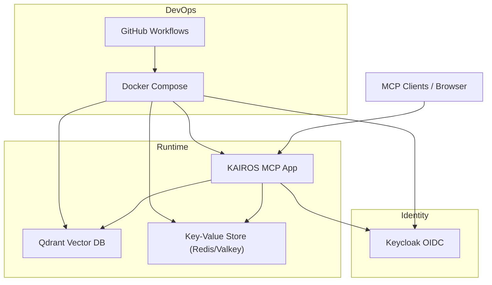
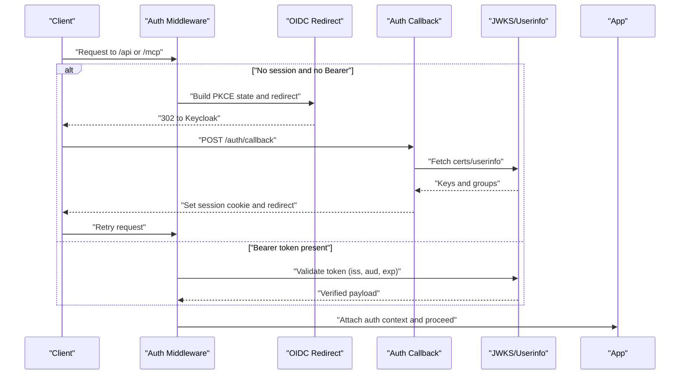
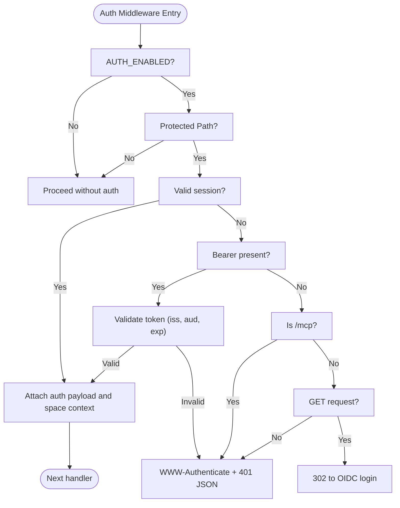
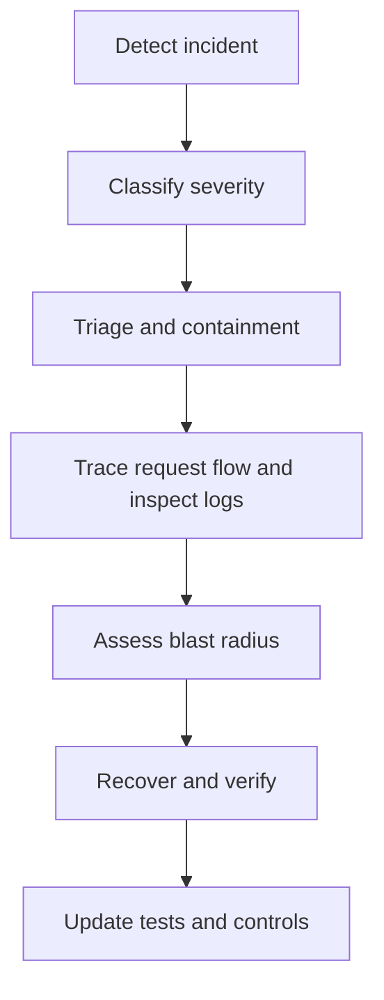
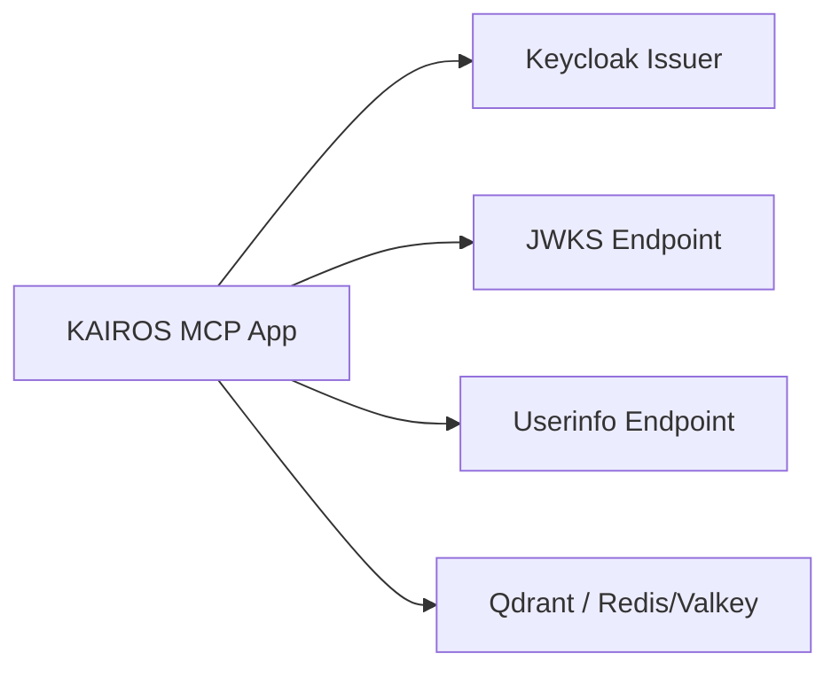

# Security Considerations

<cite>
**Referenced Files in This Document**
- [SECURITY.md](file://SECURITY.md)
- [threat-model.md](file://docs/security/threat-model.md)
- [incident-runbook.md](file://docs/security/incident-runbook.md)
- [code-security-setup.md](file://docs/security/code-security-setup.md)
- [src/config.ts](file://src/config.ts)
- [src/http/http-auth-middleware.ts](file://src/http/http-auth-middleware.ts)
- [src/http/http-auth-oidc-redirect.ts](file://src/http/http-auth-oidc-redirect.ts)
- [src/http/http-auth-callback.ts](file://src/http/http-auth-callback.ts)
- [src/http/bearer-validate.ts](file://src/http/bearer-validate.ts)
- [src/http/oidc-profile-claims.ts](file://src/http/oidc-profile-claims.ts)
- [src/http/oidc-scopes.ts](file://src/http/oidc-scopes.ts)
- [src/http/http-mcp-cors.ts](file://src/http/http-mcp-cors.ts)
- [compose.yaml](file://compose.yaml)
</cite>

## Table of Contents
1. [Introduction](#introduction)
2. [Project Structure](#project-structure)
3. [Core Components](#core-components)
4. [Architecture Overview](#architecture-overview)
5. [Detailed Component Analysis](#detailed-component-analysis)
6. [Dependency Analysis](#dependency-analysis)
7. [Performance Considerations](#performance-considerations)
8. [Troubleshooting Guide](#troubleshooting-guide)
9. [Conclusion](#conclusion)
10. [Appendices](#appendices)

## Introduction
This document consolidates the security posture of KAIROS MCP with a focus on authentication, data protection, security scanning, compliance, and operational security. It synthesizes repository-provided policies, threat models, and implementation details to guide secure deployment and operations.

## Project Structure
Security-relevant areas include:
- Authentication and OIDC integration (middleware, redirect, callback, bearer validation)
- Configuration of trusted issuers, audiences, and session parameters
- CORS handling for MCP
- Infrastructure composition for Qdrant, Redis/Valkey, and Keycloak
- Security policy, threat model, incident response, and code security setup documentation

**Diagram sources**
- [compose.yaml:10-183](file://compose.yaml#L10-L183)
- [src/http/http-auth-middleware.ts:167-316](file://src/http/http-auth-middleware.ts#L167-L316)
- [src/http/http-auth-callback.ts:122-233](file://src/http/http-auth-callback.ts#L122-L233)

**Section sources**
- [compose.yaml:10-183](file://compose.yaml#L10-L183)

## Core Components
- Authentication middleware supporting session-based and Bearer-based OIDC flows
- OIDC redirect and PKCE state management
- Token callback exchanging authorization code for tokens and establishing session
- Bearer token validation using JWKS and audience/issuer checks
- OIDC profile claims whitelisting and group allowlisting
- MCP CORS configuration for browser and tool clients
- Configuration of trusted issuers, audiences, session secret, and max age

**Section sources**
- [src/http/http-auth-middleware.ts:167-316](file://src/http/http-auth-middleware.ts#L167-L316)
- [src/http/http-auth-oidc-redirect.ts:28-101](file://src/http/http-auth-oidc-redirect.ts#L28-L101)
- [src/http/http-auth-callback.ts:122-233](file://src/http/http-auth-callback.ts#L122-L233)
- [src/http/bearer-validate.ts:120-209](file://src/http/bearer-validate.ts#L120-L209)
- [src/http/oidc-profile-claims.ts:119-153](file://src/http/oidc-profile-claims.ts#L119-L153)
- [src/http/http-mcp-cors.ts:3-29](file://src/http/http-mcp-cors.ts#L3-L29)
- [src/config.ts:113-172](file://src/config.ts#L113-L172)

## Architecture Overview
The authentication architecture integrates browser sessions and Bearer tokens through Keycloak, with session cookies and JWT validation ensuring access control across API and MCP endpoints.

**Diagram sources**
- [src/http/http-auth-middleware.ts:167-316](file://src/http/http-auth-middleware.ts#L167-L316)
- [src/http/http-auth-oidc-redirect.ts:28-101](file://src/http/http-auth-oidc-redirect.ts#L28-L101)
- [src/http/http-auth-callback.ts:122-233](file://src/http/http-auth-callback.ts#L122-L233)
- [src/http/bearer-validate.ts:120-209](file://src/http/bearer-validate.ts#L120-L209)

## Detailed Component Analysis

### Authentication Security
- OIDC configuration
  - Trusted issuers and allowed audiences are centrally configured and expanded to include localhost/127.0.0.1 pairs for compatibility.
  - Scopes advertised via discovery include openid, profile, email, kairos-groups, offline_access.
- Token validation
  - Bearer tokens are validated using JWKS fetched per issuer, with issuer and audience checks and expiration verification.
  - Groups are extracted from access token or merged from userinfo when configured.
- Session management
  - Session cookie is signed with a configurable secret and carries a bounded lifetime.
  - Logout uses RP-initiated logout with optional id_token_hint to bypass static confirmation screens.
- Browser flows
  - PKCE state and code challenge are generated and stored with TTL pruning.
  - CORS headers are set for MCP to support cross-origin RPC.

**Diagram sources**
- [src/http/http-auth-middleware.ts:167-316](file://src/http/http-auth-middleware.ts#L167-L316)

**Section sources**
- [src/config.ts:113-172](file://src/config.ts#L113-L172)
- [src/http/bearer-validate.ts:120-209](file://src/http/bearer-validate.ts#L120-L209)
- [src/http/oidc-profile-claims.ts:119-153](file://src/http/oidc-profile-claims.ts#L119-L153)
- [src/http/http-auth-oidc-redirect.ts:28-101](file://src/http/http-auth-oidc-redirect.ts#L28-L101)
- [src/http/http-auth-callback.ts:122-233](file://src/http/http-auth-callback.ts#L122-L233)
- [src/http/http-mcp-cors.ts:3-29](file://src/http/http-mcp-cors.ts#L3-L29)

### Data Protection Measures
- Encryption at rest
  - Qdrant API key is required when exposing Qdrant beyond localhost.
  - Redis/Valkey is secured with a password when enabled in fullstack profiles.
- Transport security
  - HTTPS recommended for external endpoints; session cookie is marked secure when callback base URL is HTTPS.
  - JWKS and userinfo endpoints are fetched over HTTPS; internal URL override supports container networking.
- Access control
  - Group allowlist restricts which OIDC groups become KAIROS spaces.
  - Space-scoped retrieval and tenant-aware context limit cross-tenant access.
  - Rate limits are configured for HTTP, auth, and MCP endpoints.

**Section sources**
- [compose.yaml:53-106](file://compose.yaml#L53-L106)
- [src/http/http-auth-callback.ts:69-72](file://src/http/http-auth-callback.ts#L69-L72)
- [src/config.ts:87-107](file://src/config.ts#L87-L107)
- [src/http/oidc-profile-claims.ts:119-153](file://src/http/oidc-profile-claims.ts#L119-L153)

### Security Scanning and Compliance
- Vulnerability management
  - Security workflow runs dependency review, npm audit, and CodeQL on PRs, pushes, and weekly.
  - Base image OS Trivy scanning included for critical/high OS packages.
- Release supply chain controls
  - SBOM generation (CycloneDX) and Cosign keyless signing for container images.
  - Renovate prioritization of security updates.
- CI enforcement
  - Branch protection can require Security workflow checks and secret scanning with push protection.

**Section sources**
- [SECURITY.md:70-87](file://SECURITY.md#L70-L87)
- [code-security-setup.md:1-46](file://docs/security/code-security-setup.md#L1-L46)

### Deployment and Operational Security
- Secrets management
  - Store secrets in environment variables; avoid committing .env files.
  - SESSION_SECRET must be at least 32 characters when authentication is enabled.
- Network exposure
  - Restrict access to Qdrant (port 6333) and Redis/Valkey (port 6379) to trusted hosts.
  - Ensure the data directory is not publicly accessible.
- Session alignment
  - Align SESSION_MAX_AGE_SEC with IdP’s maximum SSO session for the environment.

**Section sources**
- [SECURITY.md:28-48](file://SECURITY.md#L28-L48)

### Threat Modeling and Incident Response
- Threat model
  - System boundary includes API surface, identity layer, storage systems, and external embedding providers.
  - Mitigations address data poisoning, prompt injection, cross-tenant leakage, embedding API abuse, and supply-chain compromise.
- Incident response
  - Investigate using request_id, time windows, and tenant/space identifiers.
  - Playbooks for data poisoning, embedding abuse, and cross-tenant access suspicion.

**Diagram sources**
- [incident-runbook.md:29-46](file://docs/security/incident-runbook.md#L29-L46)

**Section sources**
- [threat-model.md:1-131](file://docs/security/threat-model.md#L1-L131)
- [incident-runbook.md:1-115](file://docs/security/incident-runbook.md#L1-L115)

### CORS Configuration and Secure Communication
- CORS for MCP
  - Origin-specific headers are set for /mcp with expose of WWW-Authenticate and preflight handling.
- Secure communication
  - Session cookie secure flag is set when callback base URL is HTTPS.
  - Internal URL override allows server-side calls to Keycloak within containers.

**Section sources**
- [src/http/http-mcp-cors.ts:3-29](file://src/http/http-mcp-cors.ts#L3-L29)
- [src/http/http-auth-callback.ts:69-72](file://src/http/http-auth-callback.ts#L69-L72)
- [src/config.ts:118-119](file://src/config.ts#L118-L119)

## Dependency Analysis
Authentication and identity dependencies:
- App depends on Keycloak for OIDC issuance and JWKS/userinfo.
- App validates tokens against configured issuers and audiences.
- Session cookie is signed server-side and scoped to the application domain.

**Diagram sources**
- [src/http/bearer-validate.ts:102-109](file://src/http/bearer-validate.ts#L102-L109)
- [src/http/oidc-profile-claims.ts:200-256](file://src/http/oidc-profile-claims.ts#L200-L256)
- [compose.yaml:53-137](file://compose.yaml#L53-L137)

**Section sources**
- [src/http/bearer-validate.ts:102-109](file://src/http/bearer-validate.ts#L102-L109)
- [src/http/oidc-profile-claims.ts:200-256](file://src/http/oidc-profile-claims.ts#L200-L256)
- [compose.yaml:53-137](file://compose.yaml#L53-L137)

## Performance Considerations
- Token validation uses cached JWKS per issuer to minimize repeated fetch overhead.
- Rate limiting is configured for HTTP, auth, and MCP routes to mitigate abuse.
- Session TTL resolution considers token expiry and a small grace period.

**Section sources**
- [src/http/bearer-validate.ts:41-109](file://src/http/bearer-validate.ts#L41-L109)
- [src/config.ts:102-107](file://src/config.ts#L102-L107)
- [src/http/http-auth-callback.ts:39-55](file://src/http/http-auth-callback.ts#L39-L55)

## Troubleshooting Guide
Common authentication issues and resolutions:
- Missing or invalid state during callback
  - Indicates misconfiguration of AUTH_CALLBACK_BASE_URL or expired PKCE state.
- Token exchange failures
  - Check Keycloak availability and callback redirect URI registration.
- Bearer token validation failures
  - Verify trusted issuers, allowed audiences, and token audience/issuer claims.
- Session cookie not secure
  - Ensure AUTH_CALLBACK_BASE_URL uses HTTPS to enable secure cookie flag.

Operational checks:
- Confirm session secret is set and sufficiently long when AUTH_ENABLED=true.
- Validate group allowlist entries and ensure Keycloak Group Membership mapper is configured.

**Section sources**
- [src/http/http-auth-callback.ts:122-233](file://src/http/http-auth-callback.ts#L122-L233)
- [src/http/http-auth-middleware.ts:232-247](file://src/http/http-auth-middleware.ts#L232-L247)
- [src/http/http-auth-callback.ts:69-72](file://src/http/http-auth-callback.ts#L69-L72)
- [SECURITY.md:32-48](file://SECURITY.md#L32-L48)

## Conclusion
KAIROS MCP implements a robust OIDC-based authentication system with session and Bearer token validation, strict group allowlisting, and MCP-specific CORS handling. The repository provides documented policies for vulnerability management, supply-chain controls, and incident response, along with practical guidance for secure deployment and operational hygiene.

## Appendices
- Configuration reference highlights
  - AUTH_ENABLED, KEYCLOAK_URL, KEYCLOAK_REALM, KEYCLOAK_CLIENT_ID, AUTH_CALLBACK_BASE_URL, SESSION_SECRET, SESSION_MAX_AGE_SEC
  - AUTH_MODE, AUTH_TRUSTED_ISSUERS, AUTH_ALLOWED_AUDIENCES, OIDC_GROUPS_ALLOWLIST, OIDC_BEARER_MERGE_USERINFO_GROUPS
  - QDRANT_API_KEY, KEY_VALUE_STORE_URL/REDIS_URL, OIDC_SCOPES_SUPPORTED

**Section sources**
- [src/config.ts:113-172](file://src/config.ts#L113-L172)
- [src/http/oidc-scopes.ts:9-31](file://src/http/oidc-scopes.ts#L9-L31)