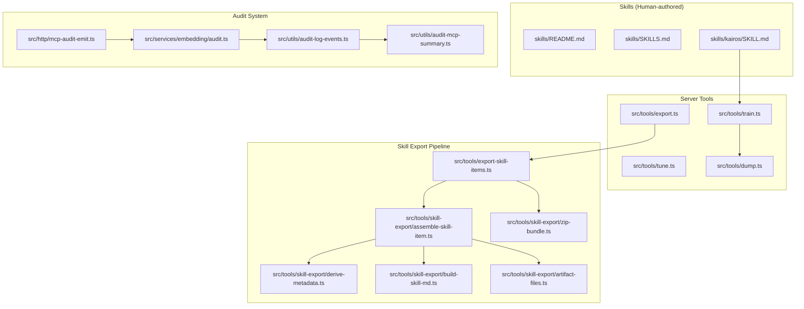
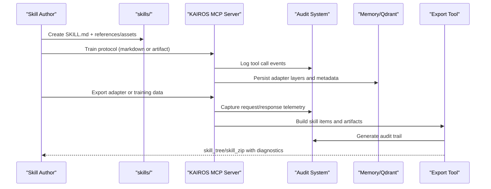
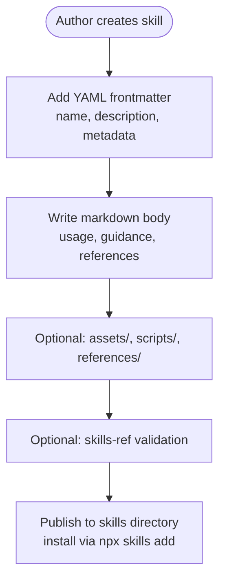
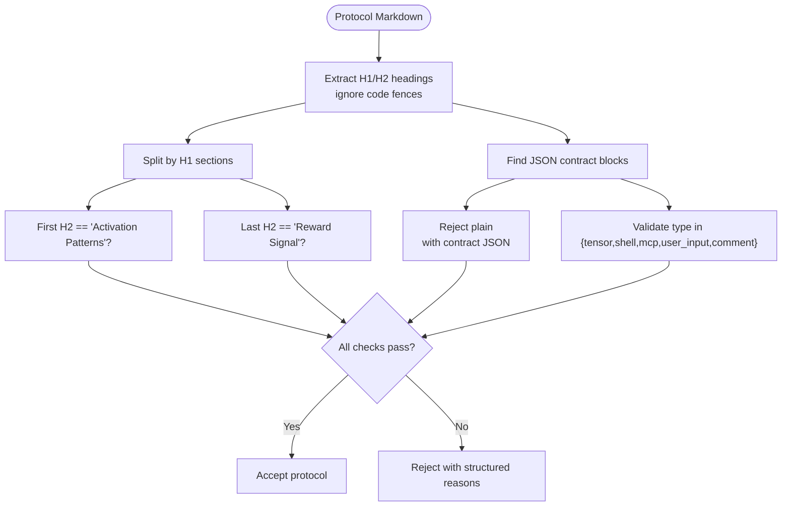
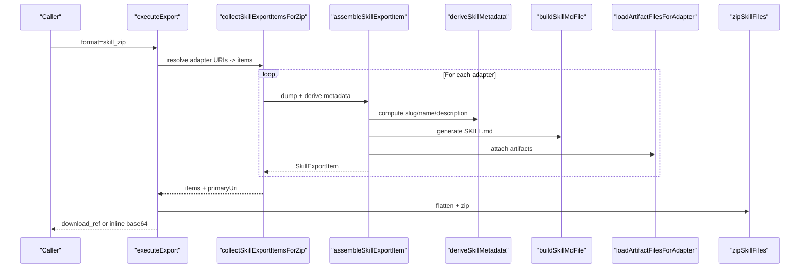
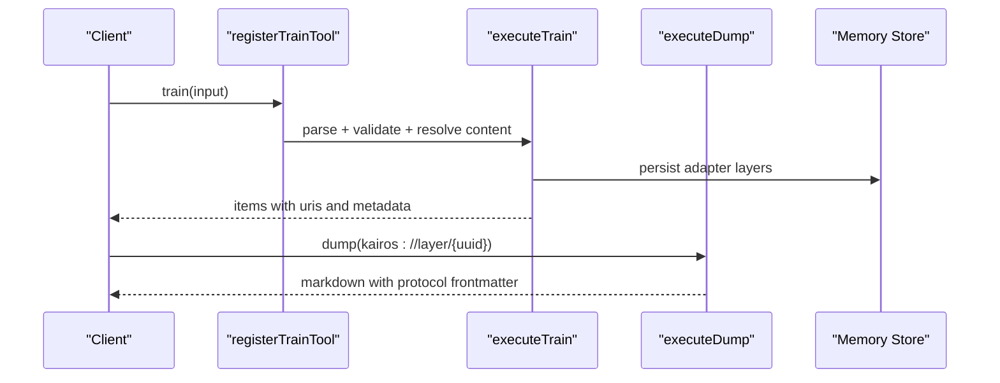
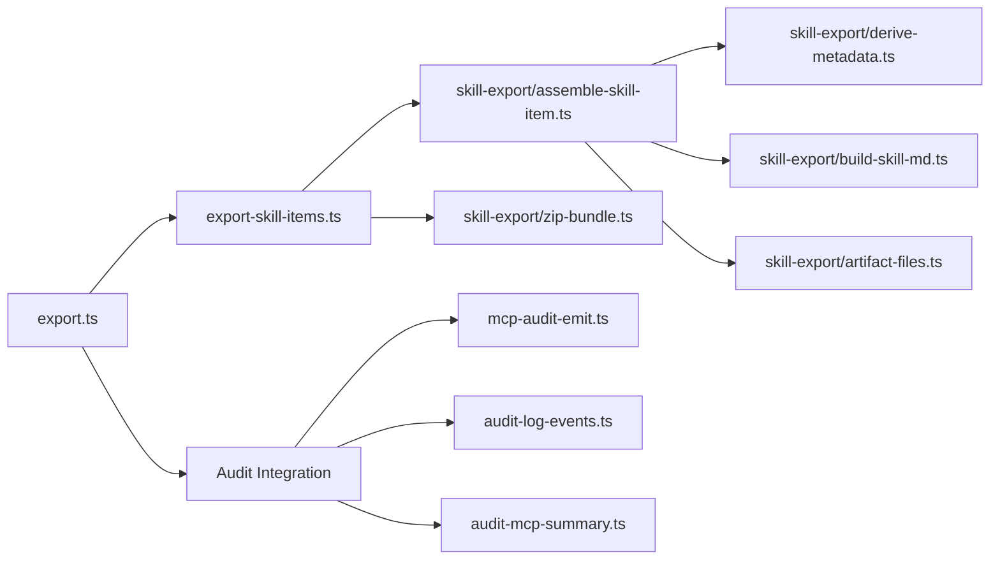

# Skills & Protocols

<cite>
**Referenced Files in This Document**
- [skills/README.md](file://skills/README.md)
- [skills/SKILLS.md](file://skills/SKILLS.md)
- [skills/kairos/SKILL.md](file://skills/kairos/SKILL.md)
- [src/tools/skill-export/types.ts](file://src/tools/skill-export/types.ts)
- [src/tools/skill-export/derive-metadata.ts](file://src/tools/skill-export/derive-metadata.ts)
- [src/tools/skill-export/assemble-skill-item.ts](file://src/tools/skill-export/assemble-skill-item.ts)
- [src/tools/skill-export/build-skill-md.ts](file://src/tools/skill-export/build-skill-md.ts)
- [src/tools/skill-export/scan-diagnostics.ts](file://src/tools/skill-export/scan-diagnostics.ts)
- [src/tools/skill-export/artifact-files.ts](file://src/tools/skill-export/artifact-files.ts)
- [src/tools/skill-export/zip-bundle.ts](file://src/tools/skill-export/zip-bundle.ts)
- [src/tools/export-skill-items.ts](file://src/tools/export-skill-items.ts)
- [src/tools/export.ts](file://src/tools/export.ts)
- [src/tools/train.ts](file://src/tools/train.ts)
- [src/tools/tune.ts](file://src/tools/tune.ts)
- [src/tools/dump.ts](file://src/tools/dump.ts)
- [src/services/memory/validate-protocol-structure.ts](file://src/services/memory/validate-protocol-structure.ts)
- [src/utils/protocol-slug.ts](file://src/utils/protocol-slug.ts)
- [docs/business/case-standardize-commits-and-merge-requests.md](file://docs/business/case-standardize-commits-and-merge-requests.md)
- [src/http/mcp-audit-emit.ts](file://src/http/mcp-audit-emit.ts)
- [src/services/embedding/audit.ts](file://src/services/embedding/audit.ts)
- [src/utils/audit-log-events.ts](file://src/utils/audit-log-events.ts)
- [src/utils/audit-mcp-summary.ts](file://src/utils/audit-mcp-summary.ts)
- [docs/security/audit-log.md](file://docs/security/audit-log.md)
</cite>

## Update Summary
**Changes Made**
- Updated KAIROS skill version from 4.7.1 to 4.7.2 to reflect incremental improvement to audit system's data completeness
- Enhanced audit system documentation to cover improved data completeness and telemetry capture
- Added comprehensive audit logging capabilities for MCP tool calls and request/response monitoring
- Expanded security documentation with detailed audit event specifications and compliance considerations

## Table of Contents
1. [Introduction](#introduction)
2. [Project Structure](#project-structure)
3. [Core Components](#core-components)
4. [Architecture Overview](#architecture-overview)
5. [Detailed Component Analysis](#detailed-component-analysis)
6. [Dependency Analysis](#dependency-analysis)
7. [Performance Considerations](#performance-considerations)
8. [Troubleshooting Guide](#troubleshooting-guide)
9. [Conclusion](#conclusion)
10. [Appendices](#appendices)

## Introduction
This document explains how KAIROS MCP manages skills and protocols, and how to develop, author, validate, export, and distribute them. It covers:
- Skill development and structure for authors
- Protocol authoring with markdown syntax, contract definitions, and validation rules
- Skill bundle creation, metadata derivation, and artifact attachment
- Practical examples for developing skills, authoring protocols, and training
- Distribution, version management, and compatibility considerations
- The relationship between skills, protocols, and the training workflow
- **New**: Enhanced audit system with improved data completeness for compliance and security monitoring

## Project Structure
KAIROS MCP organizes skills and protocols across two primary areas:
- skills/: Human-authored skill packages for installation and use
- src/tools/: Server-side tools implementing training, tuning, exporting, and skill bundling

**Diagram sources**
- [skills/README.md:1-68](file://skills/README.md#L1-L68)
- [skills/SKILLS.md:1-62](file://skills/SKILLS.md#L1-L62)
- [skills/kairos/SKILL.md:1-163](file://skills/kairos/SKILL.md#L1-L163)
- [src/tools/train.ts:1-346](file://src/tools/train.ts#L1-L346)
- [src/tools/tune.ts:1-58](file://src/tools/tune.ts#L1-L58)
- [src/tools/export.ts:1-315](file://src/tools/export.ts#L1-L315)
- [src/tools/dump.ts:1-190](file://src/tools/dump.ts#L1-L190)
- [src/tools/export-skill-items.ts:1-56](file://src/tools/export-skill-items.ts#L1-L56)
- [src/tools/skill-export/assemble-skill-item.ts:1-80](file://src/tools/skill-export/assemble-skill-item.ts#L1-L80)
- [src/tools/skill-export/derive-metadata.ts:1-113](file://src/tools/skill-export/derive-metadata.ts#L1-L113)
- [src/tools/skill-export/build-skill-md.ts:1-23](file://src/tools/skill-export/build-skill-md.ts#L1-L23)
- [src/tools/skill-export/artifact-files.ts:1-88](file://src/tools/skill-export/artifact-files.ts#L1-L88)
- [src/tools/skill-export/zip-bundle.ts:1-67](file://src/tools/skill-export/zip-bundle.ts#L1-L67)
- [src/http/mcp-audit-emit.ts:1-200](file://src/http/mcp-audit-emit.ts#L1-L200)
- [src/services/embedding/audit.ts:1-150](file://src/services/embedding/audit.ts#L1-L150)
- [src/utils/audit-log-events.ts:1-100](file://src/utils/audit-log-events.ts#L1-L100)
- [src/utils/audit-mcp-summary.ts:1-80](file://src/utils/audit-mcp-summary.ts#L1-L80)

**Section sources**
- [skills/README.md:1-68](file://skills/README.md#L1-L68)
- [skills/SKILLS.md:1-62](file://skills/SKILLS.md#L1-L62)
- [skills/kairos/SKILL.md:1-163](file://skills/kairos/SKILL.md#L1-L163)

## Core Components
- Skills: Human-authored packages installed via the skills CLI, containing a SKILL.md frontmatter and optional assets, scripts, and references.
- Protocols: Structured markdown documents describing adapter workflows with required sections and JSON contract blocks.
- Training and Tuning: Tools to register new adapters and update existing ones from markdown or artifacts.
- Export and Bundling: Tools to export adapters as markdown, training JSONL, or skill bundles (ZIP) with metadata and diagnostics.
- **New**: Enhanced Audit System: Comprehensive logging and monitoring capabilities for MCP tool calls, request/response telemetry, and compliance reporting with improved data completeness.

**Section sources**
- [skills/README.md:1-68](file://skills/README.md#L1-L68)
- [skills/SKILLS.md:1-62](file://skills/SKILLS.md#L1-L62)
- [src/tools/train.ts:1-346](file://src/tools/train.ts#L1-L346)
- [src/tools/tune.ts:1-58](file://src/tools/tune.ts#L1-L58)
- [src/tools/export.ts:1-315](file://src/tools/export.ts#L1-L315)
- [skills/kairos/SKILL.md:93-147](file://skills/kairos/SKILL.md#L93-L147)
- [src/http/mcp-audit-emit.ts:1-200](file://src/http/mcp-audit-emit.ts#L1-L200)

## Architecture Overview
The skill and protocol lifecycle spans human-authored content and server-side processing with enhanced audit capabilities:

**Diagram sources**
- [skills/SKILLS.md:16-47](file://skills/SKILLS.md#L16-L47)
- [src/tools/train.ts:134-238](file://src/tools/train.ts#L134-L238)
- [src/tools/export.ts:40-269](file://src/tools/export.ts#L40-L269)
- [src/tools/export-skill-items.ts:17-55](file://src/tools/export-skill-items.ts#L17-L55)
- [src/http/mcp-audit-emit.ts:1-200](file://src/http/mcp-audit-emit.ts#L1-L200)

## Detailed Component Analysis

### Skill Development System
- Template structure: Each skill is a directory with a required SKILL.md frontmatter and optional references/, assets/, scripts/.
- Validation: Optional validation via skills-ref aligns with the Agent Skills specification.
- Distribution: Skills are installed globally or per-project via the skills CLI.

**Diagram sources**
- [skills/SKILLS.md:16-47](file://skills/SKILLS.md#L16-L47)
- [skills/README.md:12-67](file://skills/README.md#L12-L67)

**Section sources**
- [skills/SKILLS.md:16-62](file://skills/SKILLS.md#L16-L62)
- [skills/README.md:1-68](file://skills/README.md#L1-L68)

### Protocol Management and Validation
- Markdown syntax: Protocols are authored as markdown with required sections and JSON contract blocks.
- Contract definitions: Each step includes a JSON block with a type field (shell, mcp, user_input, comment, tensor).
- Validation rules: Structural checks ensure presence of Activation Patterns (first H2), Reward Signal (last H2), at least one JSON contract block, consistent fencing, and allowed contract types.

**Diagram sources**
- [src/services/memory/validate-protocol-structure.ts:113-186](file://src/services/memory/validate-protocol-structure.ts#L113-L186)

**Section sources**
- [src/services/memory/validate-protocol-structure.ts:113-186](file://src/services/memory/validate-protocol-structure.ts#L113-L186)

### Enhanced Audit System and Data Completeness

**Updated** Enhanced audit system with improved data completeness for compliance and security monitoring.

KAIROS MCP now features an enhanced audit system designed to capture comprehensive telemetry data for compliance, security monitoring, and operational visibility. The system provides multiple levels of audit detail with improved data completeness.

#### Audit Event Categories

The audit system captures three primary categories of events:

1. **MCP Request Events**: 
   - `mcp_request_start`: Captures request initiation before space context resolution
   - `mcp_request_end`: Captures request completion in response finish handler
   - `mcp_tool_call`: Logs individual tool invocation with parameters and responses

2. **Embedding Events**: 
   - `audit.embedding`: Embedding service telemetry for vector operations
   - `audit.anomaly`: Anomaly detection system monitoring

3. **Security Events**: 
   - Authentication and authorization audit trails
   - Access control and permission logging
   - Compliance reporting data

#### Audit Levels and Data Completeness

The audit system operates at multiple verbosity levels (0-3) with progressively detailed data capture:

- **Level 0**: Minimal audit data - basic request/response timestamps
- **Level 1**: Standard audit data - includes tool names, parameters, and basic metadata
- **Level 2**: Enhanced audit data - adds sanitized request arguments and response summaries
- **Level 3**: Full audit data - comprehensive telemetry with bounded request/response snapshots

#### Data Completeness Improvements

Version 4.7.2 introduces significant improvements to audit data completeness:

- **Enhanced Telemetry Capture**: Improved collection of tool call parameters, response data, and execution context
- **Bounded Data Structures**: Safe logging mechanisms prevent sensitive data exposure while maintaining audit utility
- **Structured Logging**: Consistent audit event formatting for automated processing and compliance reporting
- **Compliance Alignment**: Audit events designed for regulatory compliance and security monitoring requirements

#### Audit Event Specifications

**Section sources**
- [src/http/mcp-audit-emit.ts:1-200](file://src/http/mcp-audit-emit.ts#L1-L200)
- [src/services/embedding/audit.ts:1-150](file://src/services/embedding/audit.ts#L1-L150)
- [src/utils/audit-log-events.ts:1-100](file://src/utils/audit-log-events.ts#L1-L100)
- [src/utils/audit-mcp-summary.ts:1-80](file://src/utils/audit-mcp-summary.ts#L1-L80)
- [docs/security/audit-log.md:1-200](file://docs/security/audit-log.md#L1-L200)

### KAIROS Decision Heuristic and Routing Framework

**Updated** Added comprehensive decision framework for determining when to route through KAIROS versus execute directly.

KAIROS provides a systematic decision heuristic to help agents determine when to route through KAIROS versus execute directly. The framework is built around the "training-gap test" that identifies when team-specific conventions are required.

#### Decision Matrix

| You are thinking… | Route through KAIROS? |
|---|---|
| "What branch naming convention do they use?" | **Yes** |
| "Is there a required MR/PR template or description format?" | **Yes** |
| "Do I need to reference a ticket, and how?" | **Yes** |
| "Are there post-action steps (pipeline watch, approvals, notifications)?" | **Yes** |
| "Which environment do I deploy to first?" | **Yes** |
| "What commit message format does this team expect?" | **Yes** |
| "I just need to run `npm test` / `git status` / one clear local command." | **No** — execute directly |
| "The user asked me to read a file or explain code." | **No** — not an action intent |

#### Conditions Checklist

Before routing through KAIROS, verify these conditions in order:

1. **Is the user message an action intent?** Look for verbs like build, fix, deploy, write, create, implement, debug, publish, migrate, configure, install, update, edit, refactor, review, audit, test, automate, generate, document, plan, design, or descriptions of a procedure. If no action intent is present, KAIROS routing does not apply.

2. **Do you have follow-up questions about team-specific conventions?** If yes, route through KAIROS — the adapter answers them. If the action is a single obvious command with no ambiguity, execute directly without routing.

3. **Is a KAIROS MCP server connected and authenticated?** If not, follow the unavailability procedure below.

4. **Has the host environment restricted MCP tool access for this session?** If so, respect that restriction.

If conditions 1-3 pass (action intent + team-context questions + server available), KAIROS routing is active for this task.

#### Examples: Route vs. Skip

**Route through KAIROS:**
- "Create a PR for this fix" — needs branch naming, description template, labels
- "Deploy to staging" — needs environment sequence, approval gates, post-deploy checks  
- "Write a commit message" — needs team's conventional-commit format and scope rules
- "Release a new version" — needs semver policy, changelog, tag format, CI triggers

**Skip KAIROS (execute directly):**
- "Run the tests" → `npm run dev:test` — single command, no team-specific form
- "Check git status" → `git status` — read-only, no conventions involved
- "Install dependencies" → `npm install` — mechanical, no team policy
- "Read src/config/index.ts" — not an action intent at all

#### Training-Gap Test

**Rule of thumb:** If the task is a single, self-contained command whose correct form is universally obvious (not team-specific), execute directly. If you have *any* uncertainty about the team-specific "how" — branch naming, ticket format, deploy sequence, commit conventions — **activate KAIROS first**. The adapter exists to fill the gap between your training and this team's rules.

**Multi-step tasks:** Even if each individual step seems obvious, route through KAIROS when the task involves multiple sequential actions (e.g., "fix the tests and push"). The adapter may encode team conventions about step ordering, intermediate validation, or post-action obligations that you'd miss if you just chained obvious commands.

**Section sources**
- [skills/kairos/SKILL.md:93-162](file://skills/kairos/SKILL.md#L93-L162)

### Skill Bundle Creation and Metadata Derivation
- Assembly: For each adapter URI, the system dumps protocol markdown, normalizes vocabulary, derives metadata (slug, name, description), builds SKILL.md, scans for diagnostics, loads artifacts, and computes checksums.
- Deduplication: Slugs are deduplicated and remapped to avoid collisions.
- Packaging: Files are flattened into ZIP layout with a manifest and optional inline base64 encoding.

**Diagram sources**
- [src/tools/export.ts:176-264](file://src/tools/export.ts#L176-L264)
- [src/tools/export-skill-items.ts:17-55](file://src/tools/export-skill-items.ts#L17-L55)
- [src/tools/skill-export/assemble-skill-item.ts:32-79](file://src/tools/skill-export/assemble-skill-item.ts#L32-L79)
- [src/tools/skill-export/derive-metadata.ts:62-99](file://src/tools/skill-export/derive-metadata.ts#L62-L99)
- [src/tools/skill-export/build-skill-md.ts:18-22](file://src/tools/skill-export/build-skill-md.ts#L18-L22)
- [src/tools/skill-export/artifact-files.ts:30-87](file://src/tools/skill-export/artifact-files.ts#L30-L87)
- [src/tools/skill-export/zip-bundle.ts:39-53](file://src/tools/skill-export/zip-bundle.ts#L39-L53)

**Section sources**
- [src/tools/export.ts:40-269](file://src/tools/export.ts#L40-L269)
- [src/tools/export-skill-items.ts:17-55](file://src/tools/export-skill-items.ts#L17-L55)
- [src/tools/skill-export/assemble-skill-item.ts:32-79](file://src/tools/skill-export/assemble-skill-item.ts#L32-L79)
- [src/tools/skill-export/derive-metadata.ts:62-99](file://src/tools/skill-export/derive-metadata.ts#L62-L99)
- [src/tools/skill-export/build-skill-md.ts:18-22](file://src/tools/skill-export/build-skill-md.ts#L18-L22)
- [src/tools/skill-export/artifact-files.ts:30-87](file://src/tools/skill-export/artifact-files.ts#L30-L87)
- [src/tools/skill-export/zip-bundle.ts:11-67](file://src/tools/skill-export/zip-bundle.ts#L11-L67)

### Training Workflow and Execution Patterns
- Train tool: Validates inputs, resolves content (from input or source adapter), normalizes artifact paths, stores adapter layers, and returns URIs and metadata.
- Tune tool: Updates adapter content via Qdrant service.
- Dump tool: Converts stored layers into markdown with protocol frontmatter and optional contract blocks.

**Diagram sources**
- [src/tools/train.ts:240-345](file://src/tools/train.ts#L240-L345)
- [src/tools/dump.ts:107-189](file://src/tools/dump.ts#L107-L189)

**Section sources**
- [src/tools/train.ts:134-238](file://src/tools/train.ts#L134-L238)
- [src/tools/tune.ts:12-57](file://src/tools/tune.ts#L12-L57)
- [src/tools/dump.ts:107-189](file://src/tools/dump.ts#L107-L189)

### Practical Examples

- Developing a skill
  - Create a directory under skills/ with a SKILL.md frontmatter and markdown body.
  - Optionally add references/, assets/, scripts/.
  - Validate locally with skills-ref if available.
  - Install via npx skills add debian777/kairos-mcp.

- Authoring a protocol
  - Write markdown with an H1 title and ordered H2 sections.
  - Include Activation Patterns as the first H2 and Reward Signal as the last H2.
  - Add JSON contract blocks with allowed types.
  - Use the validateProtocolStructure checks to ensure compliance.

- Training and tuning
  - Use the train tool to register a new adapter from markdown or artifact.
  - Use the tune tool to update an existing adapter's content.
  - Use dump to render a markdown representation of an adapter chain.

- **New**: Enhanced Audit System
  - Configure audit verbosity levels (0-3) based on compliance requirements
  - Monitor MCP tool call events for security and operational insights
  - Generate compliance reports using structured audit event data
  - Implement bounded data capture to protect sensitive information

- **New**: KAIROS Decision Framework
  - Use the decision matrix to determine routing: ask "Does this task have team-specific conventions that my training data wouldn't know?"
  - Apply the conditions checklist: action intent → team-specific questions → server availability → host restrictions
  - Follow the examples: route for complex workflows, skip for simple commands
  - Remember the training-gap test: if you're uncertain about team-specific "how," activate KAIROS first

- Exporting and distributing
  - Use export with format=skill_zip to produce a ZIP bundle with a manifest and optional inline base64.
  - Use export with format=skill_tree to receive a JSON tree of skill items.
  - Use export with format=reward_jsonl, sft_jsonl, or preference_jsonl for training datasets.

**Section sources**
- [skills/SKILLS.md:16-62](file://skills/SKILLS.md#L16-L62)
- [src/services/memory/validate-protocol-structure.ts:113-186](file://src/services/memory/validate-protocol-structure.ts#L113-L186)
- [src/tools/train.ts:240-345](file://src/tools/train.ts#L240-L345)
- [src/tools/tune.ts:12-57](file://src/tools/tune.ts#L12-L57)
- [src/tools/export.ts:176-264](file://src/tools/export.ts#L176-L264)
- [skills/kairos/SKILL.md:93-162](file://skills/kairos/SKILL.md#L93-L162)
- [src/http/mcp-audit-emit.ts:1-200](file://src/http/mcp-audit-emit.ts#L1-L200)

### Version Management and Compatibility
- Protocol versioning: Protocols carry an adapter_version when present; exports include adapter_version for single-adapter selections.
- Slug normalization: Deterministic slugs derived from titles or frontmatter; collisions are handled with auto-suffixes up to a limit.
- Compatibility: Skills specify allowed-tools and metadata.version; clients should respect tool availability and version constraints.
- **Updated**: Audit system versioning: Audit components now track version 4.7.2 with enhanced data completeness improvements.

**Section sources**
- [src/tools/dump.ts:157-166](file://src/tools/dump.ts#L157-L166)
- [src/utils/protocol-slug.ts:58-91](file://src/utils/protocol-slug.ts#L58-L91)
- [skills/kairos/SKILL.md:15-19](file://skills/kairos/SKILL.md#L15-L19)
- [src/http/mcp-audit-emit.ts:1-200](file://src/http/mcp-audit-emit.ts#L1-L200)

## Dependency Analysis
The skill export pipeline composes several modules with clear responsibilities and minimal coupling, now enhanced with audit system integration.

**Diagram sources**
- [src/tools/export.ts:16-25](file://src/tools/export.ts#L16-L25)
- [src/tools/export-skill-items.ts:7-12](file://src/tools/export-skill-items.ts#L7-L12)
- [src/tools/skill-export/assemble-skill-item.ts:5-12](file://src/tools/skill-export/assemble-skill-item.ts#L5-L12)
- [src/tools/skill-export/derive-metadata.ts:5-6](file://src/tools/skill-export/derive-metadata.ts#L5-L6)
- [src/tools/skill-export/build-skill-md.ts:5-6](file://src/tools/skill-export/build-skill-md.ts#L5-L6)
- [src/tools/skill-export/artifact-files.ts:5-14](file://src/tools/skill-export/artifact-files.ts#L5-L14)
- [src/tools/skill-export/zip-bundle.ts:5-8](file://src/tools/skill-export/zip-bundle.ts#L5-L8)
- [src/http/mcp-audit-emit.ts:1-200](file://src/http/mcp-audit-emit.ts#L1-L200)
- [src/utils/audit-log-events.ts:1-100](file://src/utils/audit-log-events.ts#L1-L100)
- [src/utils/audit-mcp-summary.ts:1-80](file://src/utils/audit-mcp-summary.ts#L1-L80)

**Section sources**
- [src/tools/export.ts:16-25](file://src/tools/export.ts#L16-L25)
- [src/tools/export-skill-items.ts:7-12](file://src/tools/export-skill-items.ts#L7-L12)
- [src/tools/skill-export/assemble-skill-item.ts:5-12](file://src/tools/skill-export/assemble-skill-item.ts#L5-L12)
- [src/tools/skill-export/derive-metadata.ts:5-6](file://src/tools/skill-export/derive-metadata.ts#L5-L6)
- [src/tools/skill-export/build-skill-md.ts:5-6](file://src/tools/skill-export/build-skill-md.ts#L5-L6)
- [src/tools/skill-export/artifact-files.ts:5-14](file://src/tools/skill-export/artifact-files.ts#L5-L14)
- [src/tools/skill-export/zip-bundle.ts:5-8](file://src/tools/skill-export/zip-bundle.ts#L5-L8)
- [src/http/mcp-audit-emit.ts:1-200](file://src/http/mcp-audit-emit.ts#L1-L200)
- [src/utils/audit-log-events.ts:1-100](file://src/utils/audit-log-events.ts#L1-L100)
- [src/utils/audit-mcp-summary.ts:1-80](file://src/utils/audit-mcp-summary.ts#L1-L80)

## Performance Considerations
- Export streaming: ZIP archives are streamed to avoid buffering the full archive in memory.
- Compression level: Configurable compression level reduces bundle size during skill_zip delivery.
- Caching: Dump reads leverage a Redis cache for memory resources to reduce latency.
- Validation: Structural validation is lightweight and performed before storage to prevent downstream errors.
- **Updated**: Audit performance: Enhanced audit system implements efficient data capture with configurable verbosity levels to balance completeness and performance impact.

## Troubleshooting Guide
- Training errors: The train tool normalizes error codes and enriches messages with actionable next actions (e.g., opening the creation flow).
- Duplicate or similar adapters: Errors distinguish between duplicates and near-duplicates; use force_update when appropriate.
- Export diagnostics: The export pipeline scans for advisory risks in Markdown and logs warnings for invalid artifact paths or mismatched hashes.
- Protocol validation failures: Use the validation rules to identify missing sections, incorrect contract types, or mixed fencing.
- **New**: Enhanced Audit System Issues: Use audit verbosity configuration to adjust logging detail levels. Check audit event capture for tool call failures and verify compliance reporting data integrity.
- **New**: KAIROS routing issues: Use the conditions checklist to diagnose routing problems. Check server connectivity, authentication status, and host restrictions. Follow the unavailability procedure for MCP server issues.

**Section sources**
- [src/tools/train.ts:56-83](file://src/tools/train.ts#L56-L83)
- [src/tools/export.ts:266-268](file://src/tools/export.ts#L266-L268)
- [src/tools/skill-export/scan-diagnostics.ts:15-23](file://src/tools/skill-export/scan-diagnostics.ts#L15-L23)
- [src/services/memory/validate-protocol-structure.ts:163-186](file://src/services/memory/validate-protocol-structure.ts#L163-L186)
- [skills/kairos/SKILL.md:181-199](file://skills/kairos/SKILL.md#L181-L199)
- [src/http/mcp-audit-emit.ts:1-200](file://src/http/mcp-audit-emit.ts#L1-L200)

## Conclusion
KAIROS MCP provides a robust framework for skills and protocols with enhanced audit capabilities:
- Skills are authored following a standardized structure and validated via the Agent Skills specification.
- Protocols are authored with strict markdown and contract rules to ensure reliable execution.
- Training, tuning, and exporting are integrated into MCP tools with clear error handling and observability.
- Skill bundles streamline distribution with metadata, diagnostics, and artifact attachments.
- **New**: The enhanced audit system provides comprehensive logging and monitoring with improved data completeness for compliance and security purposes.
- **New**: The KAIROS decision heuristic provides a systematic framework for determining when to route through KAIROS versus execute directly, based on team-specific conventions and training gaps.

## Appendices

### Appendix A: Skill Metadata Derivation
- Priority order for slug/name/description: frontmatter name/slug, memory slug, adapter name, H1 title, label fallback.
- Slug normalization ensures deterministic routing and length limits.

**Section sources**
- [src/tools/skill-export/derive-metadata.ts:62-99](file://src/tools/skill-export/derive-metadata.ts#L62-L99)
- [src/utils/protocol-slug.ts:26-36](file://src/utils/protocol-slug.ts#L26-L36)

### Appendix B: Export Formats and Delivery
- skill_tree: JSON tree of skill items with files and diagnostics.
- skill_zip: ZIP bundle with manifest; supports inline_base64 or download_ref.
- Training JSONL: trace_jsonl, reward_jsonl, sft_jsonl, preference_jsonl for adapter-specific training.

**Section sources**
- [src/tools/export.ts:176-264](file://src/tools/export.ts#L176-L264)

### Appendix C: Enhanced Audit System Configuration

**Updated** Comprehensive audit system configuration and best practices.

#### Audit Configuration Options

**Verbosity Levels:**
- **Level 0**: Minimal logging for production environments with low overhead
- **Level 1**: Standard audit for compliance monitoring and basic troubleshooting
- **Level 2**: Enhanced logging for detailed debugging and security analysis
- **Level 3**: Full audit for forensic investigations and comprehensive compliance

**Audit Event Categories:**
- **MCP Tool Calls**: Complete tool invocation telemetry with parameter sanitization
- **Request/Response**: Structured request/response capture with bounded data
- **System Events**: Infrastructure and operational monitoring data
- **Security Events**: Authentication, authorization, and access control logs

#### Best Practices

**Production Deployment:**
- Use audit level 1 for standard compliance monitoring
- Implement log rotation and retention policies
- Configure centralized audit log aggregation
- Set up alerting for critical security events

**Development Environment:**
- Enable audit level 2 for detailed debugging
- Use structured logging for easy parsing and analysis
- Implement data masking for sensitive information
- Monitor audit log volume and performance impact

**Section sources**
- [src/http/mcp-audit-emit.ts:1-200](file://src/http/mcp-audit-emit.ts#L1-L200)
- [src/utils/audit-log-events.ts:1-100](file://src/utils/audit-log-events.ts#L1-L100)
- [src/utils/audit-mcp-summary.ts:1-80](file://src/utils/audit-mcp-summary.ts#L1-L80)
- [docs/security/audit-log.md:1-200](file://docs/security/audit-log.md#L1-L200)

### Appendix D: KAIROS Decision Framework Examples

**Updated** Comprehensive examples demonstrating the decision framework in practice.

#### Real-world Scenarios

**Scenario 1: Code Review Process**
- Question: "How do we handle code review comments and approvals?"
- Decision: **Route through KAIROS** — involves team-specific approval gates and notification workflows
- Action: Activate KAIROS to follow the established review procedure

**Scenario 2: Daily Standup Command**
- Question: "Run the daily standup script"
- Decision: **Execute directly** — single command with no team-specific form
- Action: Run `./scripts/daily-standup.sh` without routing

**Scenario 3: Database Migration**
- Question: "Apply the database migration for feature X"
- Decision: **Route through KAIROS** — involves environment sequence, rollback procedures, and monitoring steps
- Action: Activate KAIROS to follow the migration workflow

**Scenario 4: Code Formatting**
- Question: "Format all Python files"
- Decision: **Execute directly** — mechanical task with universal formatting standards
- Action: Run `black .` without routing

#### Decision Matrix Application

**Application Steps:**
1. Identify action intent: "Create merge request" ✓
2. Team-specific questions: "Branch naming convention?" → Yes
3. Server availability: Connected and authenticated ✓
4. Host restrictions: None detected ✓

**Result:** Route through KAIROS using the decision matrix to ensure compliance with team conventions.

**Section sources**
- [skills/kairos/SKILL.md:93-162](file://skills/kairos/SKILL.md#L93-L162)
- [docs/business/case-standardize-commits-and-merge-requests.md:1-66](file://docs/business/case-standardize-commits-and-merge-requests.md#L1-L66)