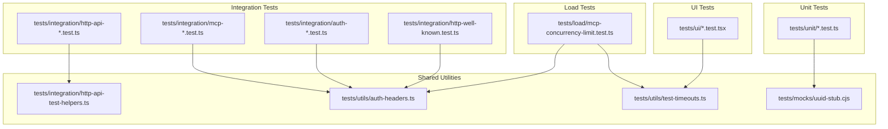
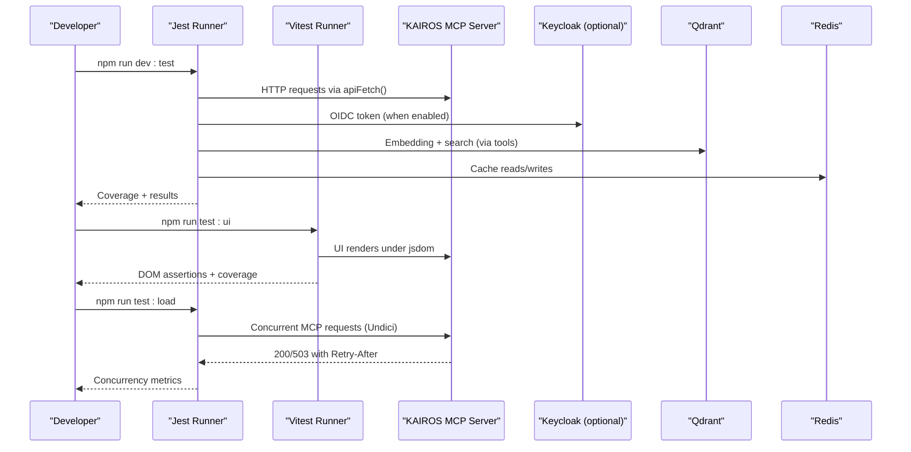
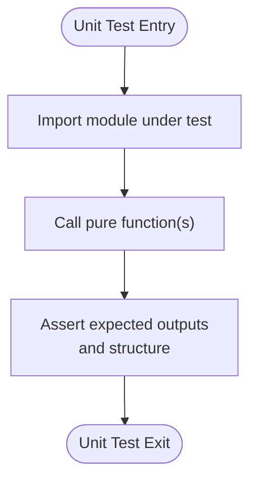
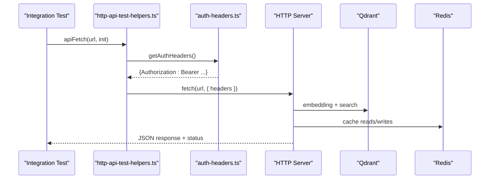
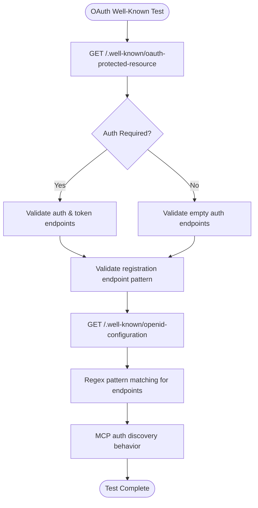
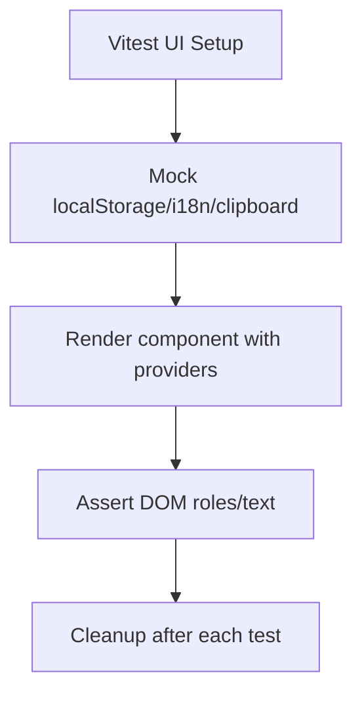
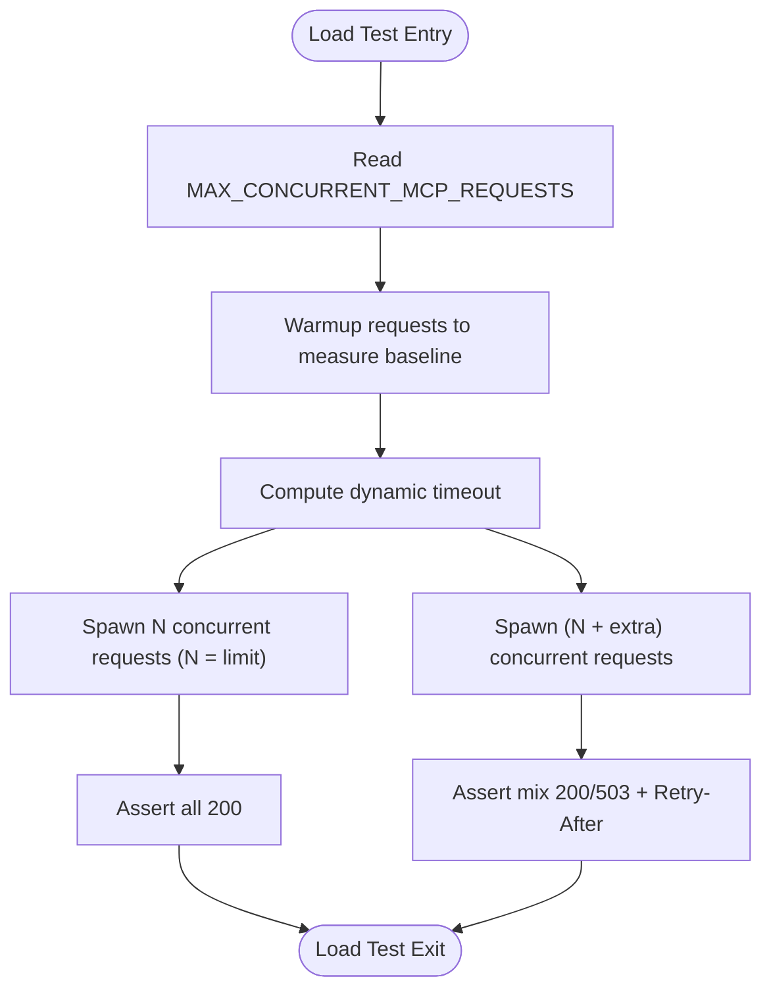
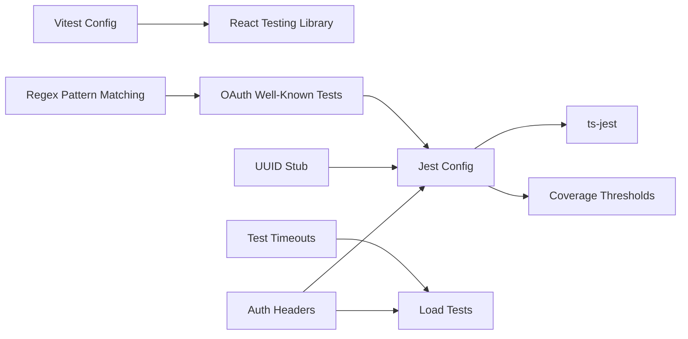

# Testing Strategy

<cite>
**Referenced Files in This Document**
- [package.json](file://package.json)
- [jest.config.js](file://jest.config.js)
- [vitest.config.ts](file://vitest.config.ts)
- [tests/setup.ts](file://tests/setup.ts)
- [tests/ui/setup.ts](file://tests/ui/setup.ts)
- [tests/mocks/uuid-stub.cjs](file://tests/mocks/uuid-stub.cjs)
- [tests/utils/auth-headers.ts](file://tests/utils/auth-headers.ts)
- [tests/utils/test-timeouts.ts](file://tests/utils/test-timeouts.ts)
- [tests/integration/http-api-test-helpers.ts](file://tests/integration/http-api-test-helpers.ts)
- [tests/integration/http-api-activate.test.ts](file://tests/integration/http-api-activate.test.ts)
- [tests/unit/activate-widget-html.test.ts](file://tests/unit/activate-widget-html.test.ts)
- [tests/ui/App.test.tsx](file://tests/ui/App.test.tsx)
- [tests/load/mcp-concurrency-limit.test.ts](file://tests/load/mcp-concurrency-limit.test.ts)
- [tests/integration/http-well-known.test.ts](file://tests/integration/http-well-known.test.ts)
- [src/http/http-well-known.ts](file://src/http/http-well-known.ts)
</cite>

## Update Summary
**Changes Made**
- Updated OAuth 2.0 well-known endpoints testing strategy to reflect improved test reliability through regular expression pattern matching
- Removed conditional test gating approach documentation for OpenID configuration assertions
- Enhanced integration testing patterns for authentication discovery behavior
- Updated test configuration references for improved resilience across deployment environments

## Table of Contents
1. [Introduction](#introduction)
2. [Project Structure](#project-structure)
3. [Core Components](#core-components)
4. [Architecture Overview](#architecture-overview)
5. [Detailed Component Analysis](#detailed-component-analysis)
6. [Dependency Analysis](#dependency-analysis)
7. [Performance Considerations](#performance-considerations)
8. [Troubleshooting Guide](#troubleshooting-guide)
9. [Conclusion](#conclusion)
10. [Appendices](#appendices)

## Introduction
This document defines a comprehensive testing strategy for KAIROS MCP across unit, integration, and end-to-end layers. It covers framework configuration (Jest and Vitest), test data management, mocking strategies, assertion patterns, continuous integration testing, load testing, performance validation, coverage requirements, debugging techniques, and maintenance procedures. The goal is to ensure reliable, deterministic, and observable behavior of the MCP server, HTTP API, CLI, and UI components.

**Updated** Enhanced OAuth 2.0 well-known endpoints testing with improved reliability through regular expression pattern matching and simplified conditional test gating for better cross-environment compatibility.

## Project Structure
The repository organizes tests by layer and domain:
- Unit tests: focused on pure functions, utilities, and small units of logic
- Integration tests: HTTP endpoints, MCP protocol interactions, and cross-service behavior
- UI tests: React components and routing under jsdom
- Load tests: concurrency limits and throughput validation
- Shared utilities: auth headers, timeouts, fixtures, and helpers

**Diagram sources**
- [tests/unit/activate-widget-html.test.ts:1-43](file://tests/unit/activate-widget-html.test.ts#L1-L43)
- [tests/integration/http-api-activate.test.ts:1-79](file://tests/integration/http-api-activate.test.ts#L1-L79)
- [tests/integration/http-well-known.test.ts:1-256](file://tests/integration/http-well-known.test.ts#L1-L256)
- [tests/ui/App.test.tsx:1-46](file://tests/ui/App.test.tsx#L1-L46)
- [tests/load/mcp-concurrency-limit.test.ts:1-141](file://tests/load/mcp-concurrency-limit.test.ts#L1-L141)
- [tests/utils/auth-headers.ts:1-213](file://tests/utils/auth-headers.ts#L1-L213)
- [tests/utils/test-timeouts.ts:1-29](file://tests/utils/test-timeouts.ts#L1-L29)
- [tests/integration/http-api-test-helpers.ts:1-12](file://tests/integration/http-api-test-helpers.ts#L1-L12)
- [tests/mocks/uuid-stub.cjs:1-24](file://tests/mocks/uuid-stub.cjs#L1-L24)

**Section sources**
- [package.json:38-115](file://package.json#L38-L115)
- [jest.config.js:1-72](file://jest.config.js#L1-L72)
- [vitest.config.ts:1-25](file://vitest.config.ts#L1-L25)

## Core Components
- Unit tests: Validate pure logic and small modules (e.g., HTML widget builders, schema validations, utilities).
- Integration tests: Exercise HTTP endpoints and MCP protocol handlers against a live server with optional auth.
- UI tests: Render React components in jsdom, simulate user interactions, and assert DOM state.
- Load tests: Probe concurrency limits and observe overload behavior.

Key configuration highlights:
- Jest for Node-based tests with TypeScript ESM support, coverage thresholds, and global auth lifecycle.
- Vitest for UI tests with jsdom, React Testing Library, and in-memory storage mocks.
- Shared auth and timeout utilities to normalize test environments.
- Enhanced OAuth 2.0 well-known endpoints testing with regular expression pattern matching for improved reliability.

**Section sources**
- [jest.config.js:8-72](file://jest.config.js#L8-L72)
- [vitest.config.ts:1-25](file://vitest.config.ts#L1-L25)
- [tests/setup.ts:1-24](file://tests/setup.ts#L1-L24)
- [tests/ui/setup.ts:1-78](file://tests/ui/setup.ts#L1-L78)

## Architecture Overview
The testing architecture separates concerns by layer and environment:
- Unit layer: isolated modules with deterministic mocks (e.g., UUID stub).
- Integration layer: HTTP and MCP protocol tests using a test server and optional Keycloak auth.
- UI layer: React components tested in jsdom with mocked i18n and clipboard APIs.
- Load layer: Undici-based clients to simulate concurrent MCP requests and validate throttling.

**Diagram sources**
- [tests/integration/http-api-test-helpers.ts:1-12](file://tests/integration/http-api-test-helpers.ts#L1-L12)
- [tests/utils/auth-headers.ts:128-158](file://tests/utils/auth-headers.ts#L128-L158)
- [tests/load/mcp-concurrency-limit.test.ts:25-43](file://tests/load/mcp-concurrency-limit.test.ts#L25-L43)

## Detailed Component Analysis

### Unit Testing Strategy
- Scope: Pure functions, utilities, and small modules that do not require external services.
- Examples:
  - Widget HTML builder assertions validate presence/absence of expected tokens and structure.
- Mocking:
  - UUID stub ensures deterministic identifiers for tests relying on v4/v5 semantics.
- Assertions:
  - Expect-style assertions with explicit checks for substrings and structural keys.

**Diagram sources**
- [tests/unit/activate-widget-html.test.ts:1-43](file://tests/unit/activate-widget-html.test.ts#L1-L43)
- [tests/mocks/uuid-stub.cjs:1-24](file://tests/mocks/uuid-stub.cjs#L1-L24)

**Section sources**
- [tests/unit/activate-widget-html.test.ts:1-43](file://tests/unit/activate-widget-html.test.ts#L1-L43)
- [tests/mocks/uuid-stub.cjs:1-24](file://tests/mocks/uuid-stub.cjs#L1-L24)

### Integration Testing Strategy
- Scope: HTTP API endpoints and MCP protocol interactions, including error paths and auth-required flows.
- Configuration:
  - Jest with ts-jest ESM transformer, environment setup, and global auth lifecycle.
  - Auth headers and base URL helpers enable tests to run with or without Keycloak.
- Patterns:
  - Centralized fetch wrapper merges auth headers with request options.
  - Timeouts derived from measured response durations to avoid flaky waits.
  - Enhanced OAuth 2.0 well-known endpoints testing with regular expression pattern matching for improved reliability across different deployment environments.
- Examples:
  - Activate endpoint tests validate response shape, metadata presence, and safety of artifact hints.
  - MCP concurrency tests probe server limits and overload behavior.
  - OAuth 2.0 well-known endpoints tests validate registration endpoint patterns using regex matching.

**Updated** OAuth 2.0 well-known endpoints testing now uses regular expression pattern matching for registration endpoint validation, making tests more resilient across different deployment environments where exact string comparisons might fail due to varying configurations.

**Diagram sources**
- [tests/integration/http-api-test-helpers.ts:1-12](file://tests/integration/http-api-test-helpers.ts#L1-L12)
- [tests/utils/auth-headers.ts:164-168](file://tests/utils/auth-headers.ts#L164-L168)
- [tests/integration/http-api-activate.test.ts:1-79](file://tests/integration/http-api-activate.test.ts#L1-L79)

**Section sources**
- [jest.config.js:8-72](file://jest.config.js#L8-L72)
- [tests/setup.ts:1-24](file://tests/setup.ts#L1-L24)
- [tests/integration/http-api-test-helpers.ts:1-12](file://tests/integration/http-api-test-helpers.ts#L1-L12)
- [tests/utils/auth-headers.ts:1-213](file://tests/utils/auth-headers.ts#L1-L213)
- [tests/utils/test-timeouts.ts:1-29](file://tests/utils/test-timeouts.ts#L1-L29)
- [tests/integration/http-api-activate.test.ts:1-79](file://tests/integration/http-api-activate.test.ts#L1-L79)

### OAuth 2.0 Well-Known Endpoints Testing Strategy
- Scope: Comprehensive validation of OAuth 2.0 Protected Resource Metadata and OpenID Connect configuration endpoints.
- Configuration:
  - Tests validate both authenticated and unauthenticated scenarios without conditional gating.
  - Enhanced assertion logic using regular expression pattern matching for registration endpoint validation.
- Patterns:
  - Validates well-known endpoints (/oauth-protected-resource, /open-id-configuration) for compliance with RFC 9728 and RFC 8414.
  - Uses regex matching for endpoint patterns to ensure compatibility across different deployment environments.
  - Simplified test structure without conditional gating based on serverRequiresAuth().
- Examples:
  - Protected Resource Metadata validation with resource naming conventions and authorization server discovery.
  - OpenID Configuration proxy validation with registration endpoint pattern matching.
  - Authentication discovery behavior validation for MCP endpoints.

**Updated** Removed conditional test gating approach for OpenID configuration assertions based on serverRequiresAuth() function, simplifying test implementation while maintaining comprehensive coverage for both authenticated and unauthenticated scenarios.

**Diagram sources**
- [tests/integration/http-well-known.test.ts:22-81](file://tests/integration/http-well-known.test.ts#L22-L81)
- [tests/integration/http-well-known.test.ts:99-117](file://tests/integration/http-well-known.test.ts#L99-L117)
- [tests/integration/http-well-known.test.ts:119-254](file://tests/integration/http-well-known.test.ts#L119-L254)

**Section sources**
- [tests/integration/http-well-known.test.ts:1-256](file://tests/integration/http-well-known.test.ts#L1-L256)
- [src/http/http-well-known.ts:1-221](file://src/http/http-well-known.ts#L1-L221)

### UI Testing Strategy
- Scope: React components rendered under jsdom with router and query provider.
- Configuration:
  - Vitest with jsdom environment, React Testing Library, and custom setup for localStorage and i18n.
- Patterns:
  - In-memory localStorage shim to avoid Node limitations.
  - Clipboard mocks for copy operations.
  - Router-based navigation assertions.
- Examples:
  - App route rendering and NotFound handling.
  - Page-specific component assertions.

**Diagram sources**
- [tests/ui/setup.ts:1-78](file://tests/ui/setup.ts#L1-L78)
- [tests/ui/App.test.tsx:1-46](file://tests/ui/App.test.tsx#L1-L46)

**Section sources**
- [vitest.config.ts:1-25](file://vitest.config.ts#L1-L25)
- [tests/ui/setup.ts:1-78](file://tests/ui/setup.ts#L1-L78)
- [tests/ui/App.test.tsx:1-46](file://tests/ui/App.test.tsx#L1-L46)

### Load Testing Strategy
- Scope: Concurrency limits and overload behavior for MCP requests.
- Methodology:
  - Undici Agent configured for high concurrency to simulate bursts.
  - Dynamic request timeout computed from measured baseline response times.
  - Two scenarios: at limit and over limit, asserting mix of 200/503 and Retry-After presence.
- Prerequisites:
  - Configure MAX_CONCURRENT_MCP_REQUESTS in environment and restart server before running the test.

**Diagram sources**
- [tests/load/mcp-concurrency-limit.test.ts:1-141](file://tests/load/mcp-concurrency-limit.test.ts#L1-L141)
- [tests/utils/test-timeouts.ts:23-28](file://tests/utils/test-timeouts.ts#L23-L28)

**Section sources**
- [tests/load/mcp-concurrency-limit.test.ts:1-141](file://tests/load/mcp-concurrency-limit.test.ts#L1-L141)
- [tests/utils/test-timeouts.ts:1-29](file://tests/utils/test-timeouts.ts#L1-L29)

## Dependency Analysis
- Frameworks and tooling:
  - Jest with ts-jest for Node tests; Vitest for UI tests.
  - React Testing Library for component assertions.
- Shared dependencies:
  - Auth utilities unify bearer tokens and base URLs across tests.
  - UUID stub resolves transitive CJS consumers requiring uuid.
  - Test-timeout utilities align test timeouts with client behavior.
  - Enhanced OAuth 2.0 well-known endpoints testing utilities for pattern matching.
- Test discovery and coverage:
  - Jest configured to discover .test.(ts|js) and .spec.(ts|js) files under src and tests.
  - Coverage thresholds enforced globally with optional strict mode.

**Diagram sources**
- [jest.config.js:8-72](file://jest.config.js#L8-L72)
- [vitest.config.ts:1-25](file://vitest.config.ts#L1-L25)
- [tests/utils/auth-headers.ts:1-213](file://tests/utils/auth-headers.ts#L1-L213)
- [tests/mocks/uuid-stub.cjs:1-24](file://tests/mocks/uuid-stub.cjs#L1-L24)
- [tests/utils/test-timeouts.ts:1-29](file://tests/utils/test-timeouts.ts#L1-L29)

**Section sources**
- [jest.config.js:8-72](file://jest.config.js#L8-L72)
- [vitest.config.ts:1-25](file://vitest.config.ts#L1-L25)
- [tests/utils/auth-headers.ts:1-213](file://tests/utils/auth-headers.ts#L1-L213)
- [tests/mocks/uuid-stub.cjs:1-24](file://tests/mocks/uuid-stub.cjs#L1-L24)
- [tests/utils/test-timeouts.ts:1-29](file://tests/utils/test-timeouts.ts#L1-L29)

## Performance Considerations
- Timeouts:
  - Client timeout capped at 30 seconds; per-request timeout derived from measured response time with a 20% buffer.
- Concurrency:
  - Load tests validate server behavior at and over the configured concurrency limit, ensuring graceful degradation with Retry-After.
- Observability:
  - Metrics endpoints and Prometheus scraping tests included in integration suite to monitor operational health.
- OAuth 2.0 Endpoint Reliability:
  - Enhanced test reliability through regular expression pattern matching reduces flakiness in cross-environment deployments.

**Updated** Improved OAuth 2.0 well-known endpoints test reliability through regex pattern matching, reducing test flakiness across different deployment environments.

Practical guidance:
- Keep suites responsive by avoiding unnecessary waits; compute timeouts dynamically.
- Use warmup runs to calibrate baselines before concurrency experiments.
- Monitor overload signals (503, Retry-After) to detect throttling and degraded performance.
- Leverage regex pattern matching for endpoint validation to improve cross-environment compatibility.

**Section sources**
- [tests/utils/test-timeouts.ts:1-29](file://tests/utils/test-timeouts.ts#L1-L29)
- [tests/load/mcp-concurrency-limit.test.ts:70-141](file://tests/load/mcp-concurrency-limit.test.ts#L70-L141)

## Troubleshooting Guide
Common issues and resolutions:
- Authentication failures:
  - Ensure AUTH_ENABLED is set appropriately and that global auth setup writes the test auth environment file. Use refreshTestAuthToken to keep tokens valid.
- Missing localStorage in jsdom:
  - The UI setup creates an in-memory localStorage shim; confirm it is applied before rendering.
- Clipboard API errors:
  - Clipboard mocks are provided; clear mocks between tests to avoid state leakage.
- Flaky timeouts:
  - Use dynamic timeouts derived from measured response times; adjust suite timeouts accordingly.
- UUID-related failures in CJS consumers:
  - The UUID stub ensures deterministic IDs for tests relying on uuid.
- OAuth 2.0 well-known endpoint failures:
  - Tests now use regex pattern matching for registration endpoint validation, improving reliability across different deployment environments.
- Simplified conditional test gating:
  - Removed conditional test gating approach for OpenID configuration assertions, ensuring comprehensive coverage for both authenticated and unauthenticated scenarios.

**Updated** Enhanced troubleshooting guidance for OAuth 2.0 well-known endpoints testing with improved pattern matching and simplified conditional test gating.

Debugging tips:
- Enable DEBUG_TEST_ENV to inspect effective environment variables during test runs.
- Use verbose logging and assertions to isolate failing steps.
- For UI tests, render with minimal providers and assert specific roles/text to reduce noise.
- For OAuth tests, leverage regex pattern matching to identify endpoint validation issues across different environments.

**Section sources**
- [tests/setup.ts:1-24](file://tests/setup.ts#L1-L24)
- [tests/ui/setup.ts:1-78](file://tests/ui/setup.ts#L1-L78)
- [tests/utils/auth-headers.ts:128-158](file://tests/utils/auth-headers.ts#L128-L158)
- [tests/utils/test-timeouts.ts:23-28](file://tests/utils/test-timeouts.ts#L23-L28)
- [tests/mocks/uuid-stub.cjs:1-24](file://tests/mocks/uuid-stub.cjs#L1-L24)

## Conclusion
The testing strategy leverages Jest and Vitest to deliver layered assurance across units, integrations, UI, and load scenarios. Shared utilities and configuration ensure consistent behavior, while dynamic timeouts and concurrency tests validate robustness. Coverage thresholds and CI-friendly reporters support continuous validation and maintainability. Enhanced OAuth 2.0 well-known endpoints testing provides improved reliability through regular expression pattern matching and simplified conditional test gating.

**Updated** The testing strategy now includes enhanced OAuth 2.0 well-known endpoints testing with improved reliability through regular expression pattern matching and simplified conditional test gating, ensuring comprehensive coverage across different deployment environments.

## Appendices

### Test Configuration Reference
- Scripts:
  - dev:test, test:ui, test:load, and related helpers orchestrate test execution.
- Jest:
  - ESM transformer, coverage thresholds, global setup/teardown, and auth environment handling.
- Vitest:
  - jsdom environment, React plugin, aliases, and UI-specific setup.
- OAuth 2.0 Well-Known Endpoints:
  - Enhanced regex pattern matching for registration endpoint validation.
  - Simplified conditional test gating for improved cross-environment compatibility.

**Updated** Added OAuth 2.0 well-known endpoints configuration references for enhanced test reliability.

**Section sources**
- [package.json:38-115](file://package.json#L38-L115)
- [jest.config.js:8-72](file://jest.config.js#L8-L72)
- [vitest.config.ts:1-25](file://vitest.config.ts#L1-L25)