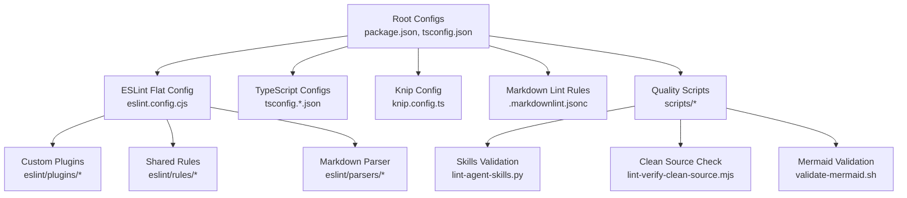
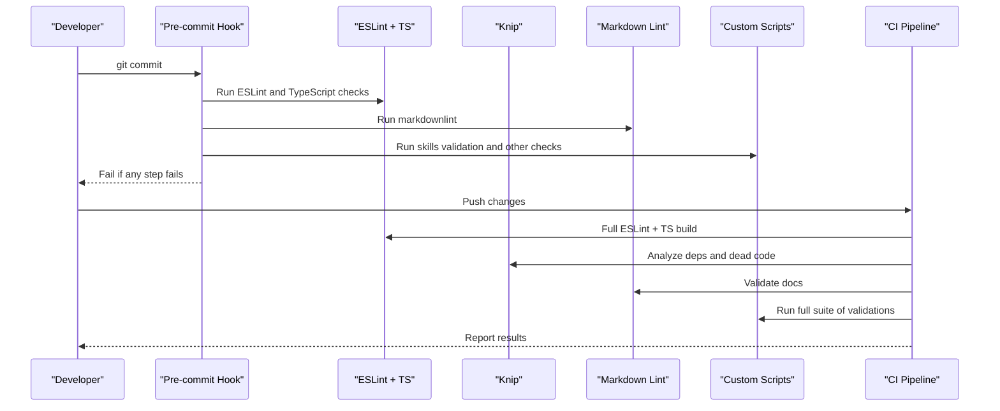
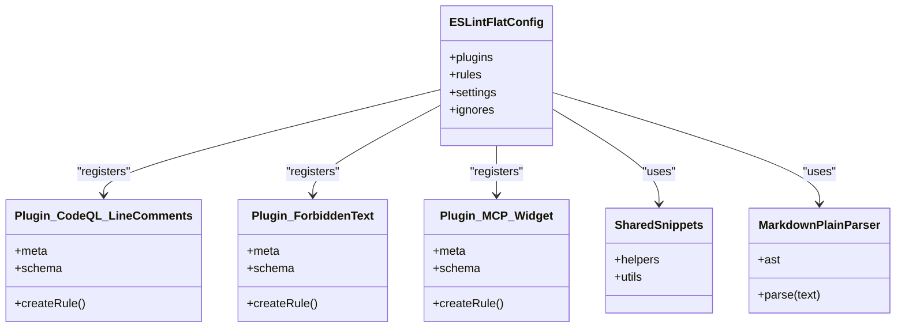
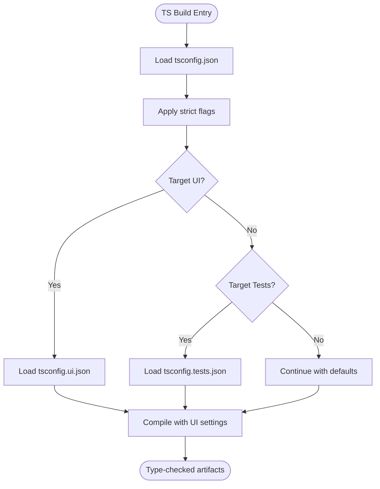
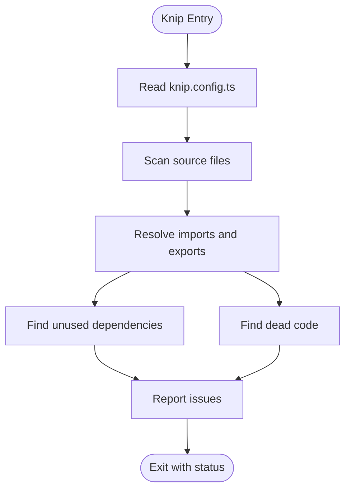
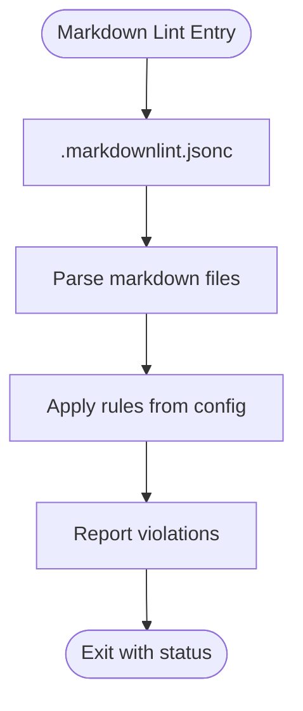
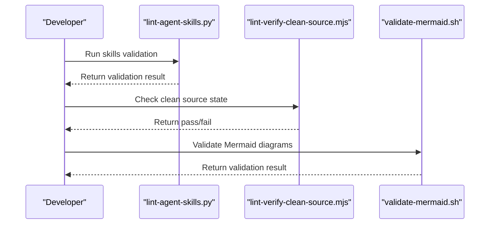
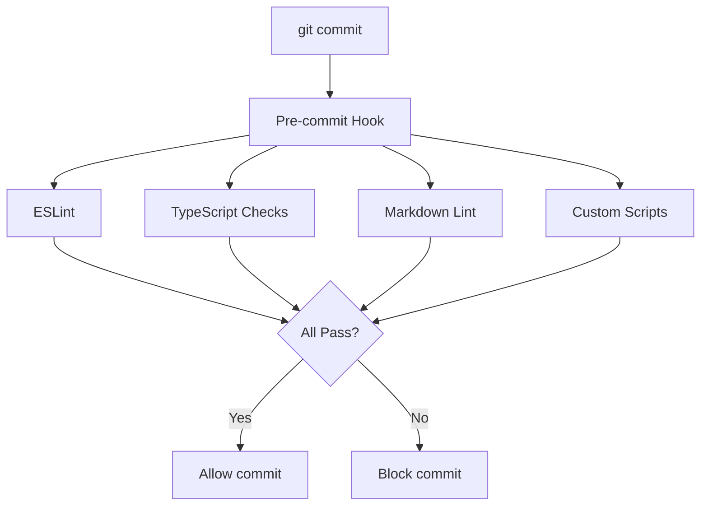
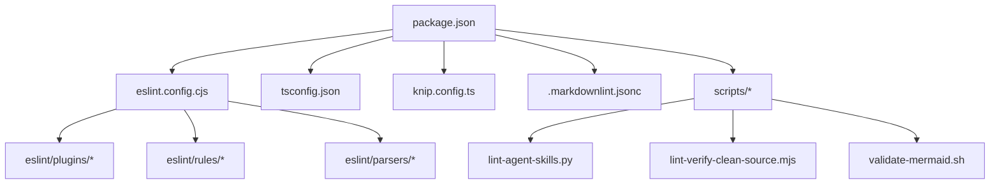

# Code Quality Tools and Linting

<cite>
**Referenced Files in This Document**
- [eslint.config.cjs](file://eslint.config.cjs)
- [eslint/flat-config.cjs](file://eslint/flat-config.cjs)
- [eslint/plugins/kairos-codeql-line-comments.cjs](file://eslint/plugins/kairos-codeql-line-comments.cjs)
- [eslint/plugins/kairos-forbidden-text.cjs](file://eslint/plugins/kairos-forbidden-text.cjs)
- [eslint/plugins/kairos-mcp-widget.cjs](file://eslint/plugins/kairos-mcp-widget.cjs)
- [eslint/rules/shared-snippets.cjs](file://eslint/rules/shared-snippets.cjs)
- [eslint/parsers/markdown-plain-text.cjs](file://eslint/parsers/markdown-plain-text.cjs)
- [tsconfig.json](file://tsconfig.json)
- [tsconfig.tests.json](file://tsconfig.tests.json)
- [tsconfig.ui.json](file://tsconfig.ui.json)
- [knip.config.ts](file://knip.config.ts)
- [.markdownlint.jsonc](file://.markdownlint.jsonc)
- [package.json](file://package.json)
- [scripts/lint-agent-skills.py](file://scripts/lint-agent-skills.py)
- [scripts/lint-verify-clean-source.mjs](file://scripts/lint-verify-clean-source.mjs)
- [scripts/ci-check-trivyignore-expiry.py](file://scripts/ci-check-trivyignore-expiry.py)
- [scripts/validate-mermaid.sh](file://scripts/validate-mermaid.sh)
</cite>

## Table of Contents
1. [Introduction](#introduction)
2. [Project Structure](#project-structure)
3. [Core Components](#core-components)
4. [Architecture Overview](#architecture-overview)
5. [Detailed Component Analysis](#detailed-component-analysis)
6. [Dependency Analysis](#dependency-analysis)
7. [Performance Considerations](#performance-considerations)
8. [Troubleshooting Guide](#troubleshooting-guide)
9. [Conclusion](#conclusion)
10. [Appendices](#appendices)

## Introduction
This document explains the code quality and linting setup used across the Kairos MCP repository. It covers ESLint configuration (including custom rules and plugins), TypeScript strict mode and type checking enforcement, Knip configuration for unused dependencies and dead code analysis, markdown linting and documentation quality checks, custom linting scripts for skills validation and consistency, IDE integration guidance, formatting standards, and quality gates including pre-commit hooks.

The goal is to help contributors understand how to maintain consistent, high-quality code and documentation across the monorepo-style workspace and to integrate their local development environments for real-time feedback.

## Project Structure
The code quality tooling is organized into dedicated directories and configuration files:
- ESLint flat config and custom plugins reside under eslint/.
- TypeScript configurations are defined at the root and per-project scopes.
- Knip configuration is centralized at the root.
- Markdown linting rules are configured via .markdownlint.jsonc.
- Custom linting and validation scripts live under scripts/.
- Package scripts orchestrate running these tools.

[No sources needed since this diagram shows conceptual workflow, not actual code structure]

## Core Components
- ESLint flat configuration and custom plugins enforce project-specific coding standards and domain rules.
- TypeScript strict mode and per-target configs ensure strong typing across CLI, server, UI, and tests.
- Knip identifies unused dependencies and dead code to keep the dependency graph lean.
- Markdown linting ensures documentation quality and consistency.
- Custom scripts validate skills, verify clean source state, and check Mermaid diagrams.
- Package scripts and CI workflows tie everything together as quality gates.

**Section sources**
- [eslint.config.cjs](file://eslint.config.cjs)
- [eslint/flat-config.cjs](file://eslint/flat-config.cjs)
- [eslint/plugins/kairos-codeql-line-comments.cjs](file://eslint/plugins/kairos-codeql-line-comments.cjs)
- [eslint/plugins/kairos-forbidden-text.cjs](file://eslint/plugins/kairos-forbidden-text.cjs)
- [eslint/plugins/kairos-mcp-widget.cjs](file://eslint/plugins/kairos-mcp-widget.cjs)
- [eslint/rules/shared-snippets.cjs](file://eslint/rules/shared-snippets.cjs)
- [eslint/parsers/markdown-plain-text.cjs](file://eslint/parsers/markdown-plain-text.cjs)
- [tsconfig.json](file://tsconfig.json)
- [tsconfig.tests.json](file://tsconfig.tests.json)
- [tsconfig.ui.json](file://tsconfig.ui.json)
- [knip.config.ts](file://knip.config.ts)
- [.markdownlint.jsonc](file://.markdownlint.jsonc)
- [package.json](file://package.json)
- [scripts/lint-agent-skills.py](file://scripts/lint-agent-skills.py)
- [scripts/lint-verify-clean-source.mjs](file://scripts/lint-verify-clean-source.mjs)
- [scripts/validate-mermaid.sh](file://scripts/validate-mermaid.sh)

## Architecture Overview
The quality pipeline integrates multiple layers:
- Static analysis (ESLint + TypeScript)
- Dependency and dead code analysis (Knip)
- Documentation linting (Markdown)
- Domain-specific validations (skills, mermaid diagrams)
- Pre-commit hooks and CI gates

[No sources needed since this diagram shows conceptual workflow, not actual code structure]

## Detailed Component Analysis

### ESLint Configuration and Custom Rules
ESLint uses a flat configuration approach with custom plugins and shared rules tailored to the project’s needs. Key areas include:
- Flat config entrypoint and plugin registration
- Custom rule implementations for domain-specific checks
- Shared snippets for reuse across rules
- Specialized parsers for non-JS content (e.g., plain text within markdown)

**Diagram sources**
- [eslint/flat-config.cjs](file://eslint/flat-config.cjs)
- [eslint/plugins/kairos-codeql-line-comments.cjs](file://eslint/plugins/kairos-codeql-line-comments.cjs)
- [eslint/plugins/kairos-forbidden-text.cjs](file://eslint/plugins/kairos-forbidden-text.cjs)
- [eslint/plugins/kairos-mcp-widget.cjs](file://eslint/plugins/kairos-mcp-widget.cjs)
- [eslint/rules/shared-snippets.cjs](file://eslint/rules/shared-snippets.cjs)
- [eslint/parsers/markdown-plain-text.cjs](file://eslint/parsers/markdown-plain-text.cjs)

**Section sources**
- [eslint.config.cjs](file://eslint.config.cjs)
- [eslint/flat-config.cjs](file://eslint/flat-config.cjs)
- [eslint/plugins/kairos-codeql-line-comments.cjs](file://eslint/plugins/kairos-codeql-line-comments.cjs)
- [eslint/plugins/kairos-forbidden-text.cjs](file://eslint/plugins/kairos-forbidden-text.cjs)
- [eslint/plugins/kairos-mcp-widget.cjs](file://eslint/plugins/kairos-mcp-widget.cjs)
- [eslint/rules/shared-snippets.cjs](file://eslint/rules/shared-snippets.cjs)
- [eslint/parsers/markdown-plain-text.cjs](file://eslint/parsers/markdown-plain-text.cjs)

### TypeScript Strict Mode and Type Checking
TypeScript is configured with strict settings and multiple target configs to support different parts of the application:
- Root tsconfig.json defines shared compiler options and strictness.
- tsconfig.ui.json targets the UI build with appropriate module and JSX settings.
- tsconfig.tests.json tailors behavior for test execution.

Key aspects typically enforced by strict mode include:
- No implicit any
- Strict null checks
- Strict function types
- No unused variables or parameters
- Consistent module resolution

**Diagram sources**
- [tsconfig.json](file://tsconfig.json)
- [tsconfig.ui.json](file://tsconfig.ui.json)
- [tsconfig.tests.json](file://tsconfig.tests.json)

**Section sources**
- [tsconfig.json](file://tsconfig.json)
- [tsconfig.ui.json](file://tsconfig.ui.json)
- [tsconfig.tests.json](file://tsconfig.tests.json)

### Knip Configuration for Unused Dependencies and Dead Code
Knip is configured to analyze the repository for unused dependencies and dead code. Typical responsibilities include:
- Detecting unused imports and exports
- Identifying unreferenced files
- Validating package.json dependencies against usage
- Excluding generated or irrelevant paths

**Diagram sources**
- [knip.config.ts](file://knip.config.ts)

**Section sources**
- [knip.config.ts](file://knip.config.ts)

### Markdown Linting and Documentation Quality Checks
Documentation quality is enforced using markdownlint with a JSONC configuration file. The configuration typically includes:
- Rule enable/disable toggles
- Custom rule options
- Per-file overrides
- Exclusions for generated content

**Diagram sources**
- [.markdownlint.jsonc](file://.markdownlint.jsonc)

**Section sources**
- [.markdownlint.jsonc](file://.markdownlint.jsonc)

### Custom Linting Scripts for Skills Validation and Code Consistency
Custom scripts provide domain-specific validations beyond standard linters:
- Skills validation script checks agent skill definitions and metadata.
- Clean source verification ensures no unintended changes or artifacts remain.
- Additional utilities validate Mermaid diagrams and other assets.

**Diagram sources**
- [scripts/lint-agent-skills.py](file://scripts/lint-agent-skills.py)
- [scripts/lint-verify-clean-source.mjs](file://scripts/lint-verify-clean-source.mjs)
- [scripts/validate-mermaid.sh](file://scripts/validate-mermaid.sh)

**Section sources**
- [scripts/lint-agent-skills.py](file://scripts/lint-agent-skills.py)
- [scripts/lint-verify-clean-source.mjs](file://scripts/lint-verify-clean-source.mjs)
- [scripts/validate-mermaid.sh](file://scripts/validate-mermaid.sh)

### Formatting Standards and Automated Formatting Tools
Formatting standards are typically enforced through:
- Prettier or similar formatter configuration
- Editor integrations for on-save formatting
- Consistent indentation, quote styles, and line endings
- Integration with ESLint to avoid conflicts

Guidance:
- Configure your editor to format on save using the project’s formatter.
- Ensure formatter rules align with ESLint rules to prevent conflicts.
- Use pre-commit hooks to enforce formatting before commits.

[No sources needed since this section provides general guidance]

### IDE Integration for Real-Time Feedback
To get real-time feedback in your IDE:
- Install ESLint and TypeScript language extensions.
- Enable “Format On Save” and “Run Linter On Save.”
- Configure the IDE to use the project’s ESLint flat config and TypeScript configs.
- For markdown linting, install a markdownlint extension and point it to .markdownlint.jsonc.
- Optionally, integrate Knip and custom scripts into your task runner or watch mode.

[No sources needed since this section provides general guidance]

### Quality Gates and Pre-commit Hooks
Quality gates ensure that only compliant code is committed and merged:
- Pre-commit hooks run ESLint, TypeScript checks, markdownlint, and custom scripts.
- CI pipelines re-run the same checks to guarantee consistency.
- Fail-fast strategy stops builds early when any gate fails.

[No sources needed since this diagram shows conceptual workflow, not actual code structure]

## Dependency Analysis
The following diagram illustrates how the quality tools depend on each other and on configuration files:

**Diagram sources**
- [package.json](file://package.json)
- [eslint.config.cjs](file://eslint.config.cjs)
- [eslint/flat-config.cjs](file://eslint/flat-config.cjs)
- [eslint/plugins/kairos-codeql-line-comments.cjs](file://eslint/plugins/kairos-codeql-line-comments.cjs)
- [eslint/plugins/kairos-forbidden-text.cjs](file://eslint/plugins/kairos-forbidden-text.cjs)
- [eslint/plugins/kairos-mcp-widget.cjs](file://eslint/plugins/kairos-mcp-widget.cjs)
- [eslint/rules/shared-snippets.cjs](file://eslint/rules/shared-snippets.cjs)
- [eslint/parsers/markdown-plain-text.cjs](file://eslint/parsers/markdown-plain-text.cjs)
- [tsconfig.json](file://tsconfig.json)
- [knip.config.ts](file://knip.config.ts)
- [.markdownlint.jsonc](file://.markdownlint.jsonc)
- [scripts/lint-agent-skills.py](file://scripts/lint-agent-skills.py)
- [scripts/lint-verify-clean-source.mjs](file://scripts/lint-verify-clean-source.mjs)
- [scripts/validate-mermaid.sh](file://scripts/validate-mermaid.sh)

**Section sources**
- [package.json](file://package.json)
- [eslint.config.cjs](file://eslint.config.cjs)
- [eslint/flat-config.cjs](file://eslint/flat-config.cjs)
- [eslint/plugins/kairos-codeql-line-comments.cjs](file://eslint/plugins/kairos-codeql-line-comments.cjs)
- [eslint/plugins/kairos-forbidden-text.cjs](file://eslint/plugins/kairos-forbidden-text.cjs)
- [eslint/plugins/kairos-mcp-widget.cjs](file://eslint/plugins/kairos-mcp-widget.cjs)
- [eslint/rules/shared-snippets.cjs](file://eslint/rules/shared-snippets.cjs)
- [eslint/parsers/markdown-plain-text.cjs](file://eslint/parsers/markdown-plain-text.cjs)
- [tsconfig.json](file://tsconfig.json)
- [knip.config.ts](file://knip.config.ts)
- [.markdownlint.jsonc](file://.markdownlint.jsonc)
- [scripts/lint-agent-skills.py](file://scripts/lint-agent-skills.py)
- [scripts/lint-verify-clean-source.mjs](file://scripts/lint-verify-clean-source.mjs)
- [scripts/validate-mermaid.sh](file://scripts/validate-mermaid.sh)

## Performance Considerations
- Prefer incremental checks in IDEs to reduce latency.
- Exclude large generated directories from linting and type checking.
- Use parallelization where supported by tools.
- Cache results for expensive operations like Knip scans.
- Keep custom rules efficient; avoid heavy IO inside rule callbacks.

[No sources needed since this section provides general guidance]

## Troubleshooting Guide
Common issues and resolutions:
- ESLint errors due to custom rules: Review plugin implementations and ensure they match the expected rule schema.
- TypeScript strict mode failures: Address implicit any, nullability, and unused variable warnings.
- Knip false positives: Adjust exclusions in knip.config.ts for generated or special-case files.
- Markdown lint violations: Align headings, links, and lists with .markdownlint.jsonc rules.
- Pre-commit hook failures: Run individual steps locally to isolate failing checks.

**Section sources**
- [eslint/plugins/kairos-codeql-line-comments.cjs](file://eslint/plugins/kairos-codeql-line-comments.cjs)
- [eslint/plugins/kairos-forbidden-text.cjs](file://eslint/plugins/kairos-forbidden-text.cjs)
- [eslint/plugins/kairos-mcp-widget.cjs](file://eslint/plugins/kairos-mcp-widget.cjs)
- [tsconfig.json](file://tsconfig.json)
- [knip.config.ts](file://knip.config.ts)
- [.markdownlint.jsonc](file://.markdownlint.jsonc)

## Conclusion
Kairos MCP employs a robust, multi-layered quality system combining ESLint with custom plugins, strict TypeScript configuration, Knip for dependency hygiene, markdownlint for documentation quality, and custom scripts for domain-specific validations. Integrated via package scripts and pre-commit hooks, these tools enforce consistent standards and catch issues early, improving overall codebase health and developer productivity.

[No sources needed since this section summarizes without analyzing specific files]

## Appendices

### Quick Reference: Where to Look
- ESLint flat config and plugins: eslint.config.cjs, eslint/flat-config.cjs, eslint/plugins/*
- Shared rules and snippets: eslint/rules/*
- Markdown parser: eslint/parsers/*
- TypeScript configs: tsconfig.json, tsconfig.ui.json, tsconfig.tests.json
- Knip config: knip.config.ts
- Markdown lint rules: .markdownlint.jsonc
- Custom scripts: scripts/lint-agent-skills.py, scripts/lint-verify-clean-source.mjs, scripts/validate-mermaid.sh
- Orchestration: package.json

**Section sources**
- [eslint.config.cjs](file://eslint.config.cjs)
- [eslint/flat-config.cjs](file://eslint/flat-config.cjs)
- [eslint/plugins/kairos-codeql-line-comments.cjs](file://eslint/plugins/kairos-codeql-line-comments.cjs)
- [eslint/plugins/kairos-forbidden-text.cjs](file://eslint/plugins/kairos-forbidden-text.cjs)
- [eslint/plugins/kairos-mcp-widget.cjs](file://eslint/plugins/kairos-mcp-widget.cjs)
- [eslint/rules/shared-snippets.cjs](file://eslint/rules/shared-snippets.cjs)
- [eslint/parsers/markdown-plain-text.cjs](file://eslint/parsers/markdown-plain-text.cjs)
- [tsconfig.json](file://tsconfig.json)
- [tsconfig.ui.json](file://tsconfig.ui.json)
- [tsconfig.tests.json](file://tsconfig.tests.json)
- [knip.config.ts](file://knip.config.ts)
- [.markdownlint.jsonc](file://.markdownlint.jsonc)
- [scripts/lint-agent-skills.py](file://scripts/lint-agent-skills.py)
- [scripts/lint-verify-clean-source.mjs](file://scripts/lint-verify-clean-source.mjs)
- [scripts/validate-mermaid.sh](file://scripts/validate-mermaid.sh)
- [package.json](file://package.json)