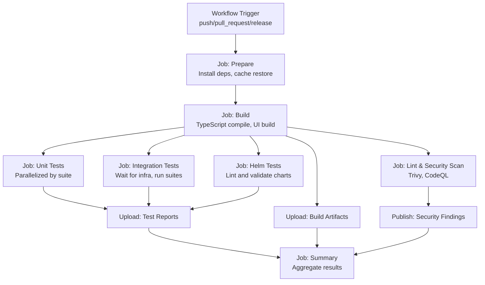
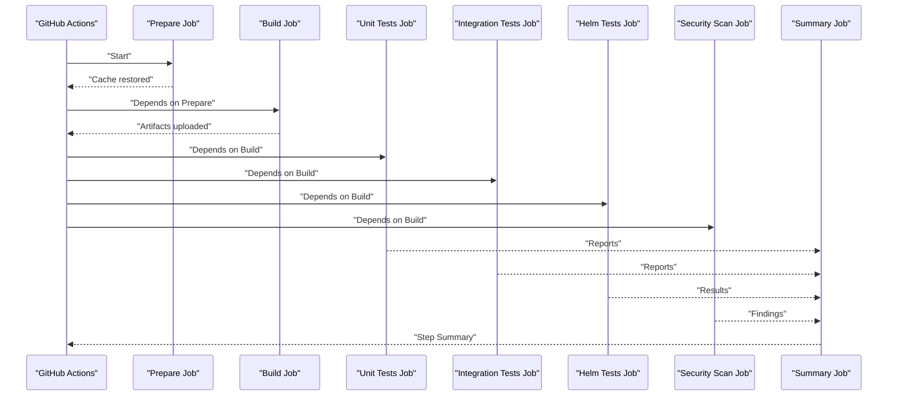
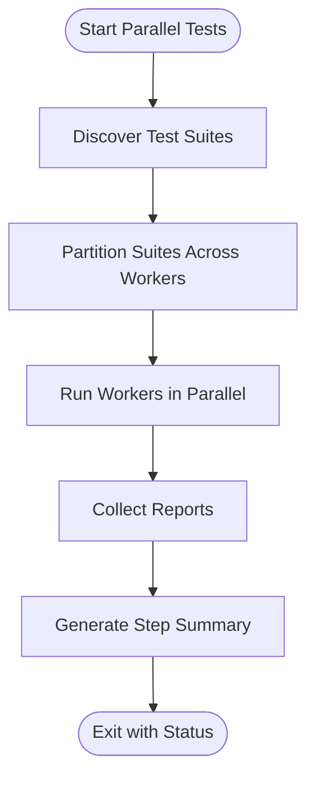
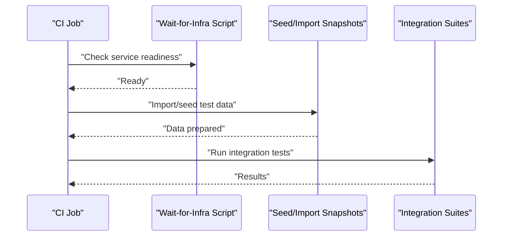
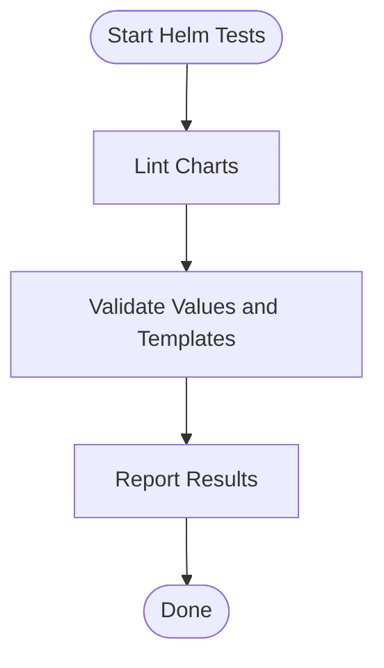
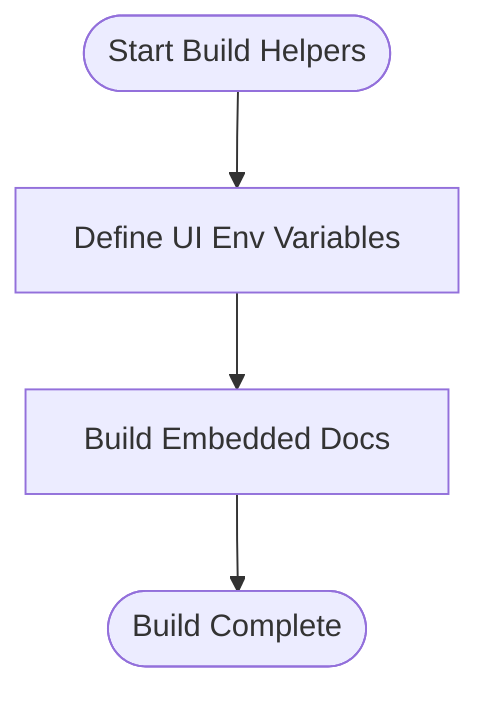
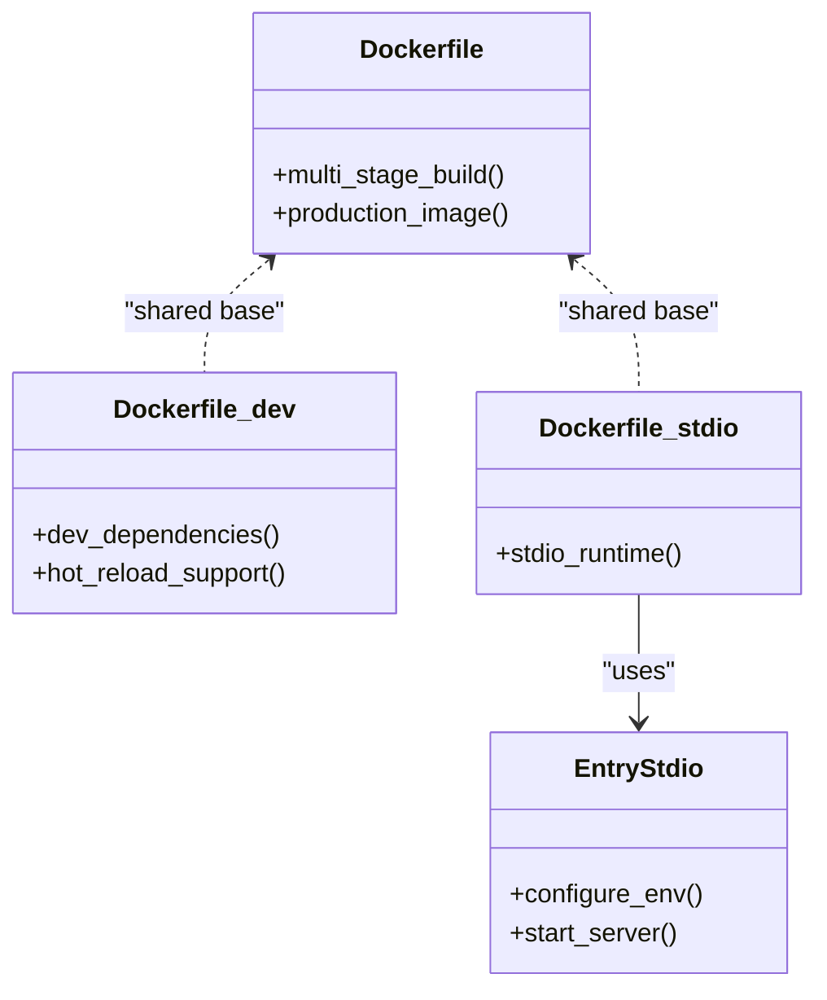
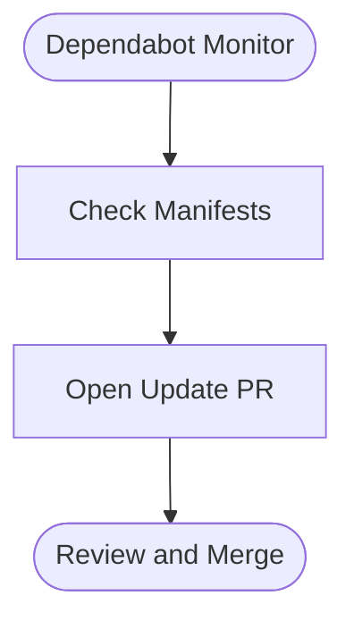
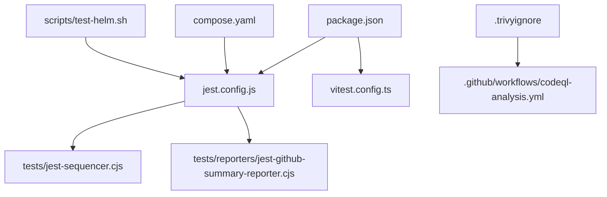

# Continuous Integration and Automation

<cite>
**Referenced Files in This Document**
- [package.json](file://package.json)
- [jest.config.js](file://jest.config.js)
- [vitest.config.ts](file://vitest.config.ts)
- [.github/workflows/ci.yml](file://.github/workflows/ci.yml)
- [.github/workflows/codeql-analysis.yml](file://.github/workflows/codeql-analysis.yml)
- [.github/dependabot.yml](file://.github/dependabot.yml)
- [.husky/pre-commit](file://.husky/pre-commit)
- [.trivyignore](file://.trivyignore)
- [scripts/ci-parallel-checks.mjs](file://scripts/ci-parallel-checks.mjs)
- [scripts/ci-github-step-summary.mjs](file://scripts/ci-github-step-summary.mjs)
- [scripts/ci-test-tgz-install.mjs](file://scripts/ci-test-tgz-install.mjs)
- [scripts/ci-wait-for-infra.sh](file://scripts/ci-wait-for-infra.sh)
- [scripts/test-helm.sh](file://scripts/test-helm.sh)
- [scripts/import-test-snapshot.sh](file://scripts/import-test-snapshot.sh)
- [scripts/seed-test-snapshot.sh](file://scripts/seed-test-snapshot.sh)
- [scripts/build-embed-docs.ts](file://scripts/build-embed-docs.ts)
- [scripts/build-vite-ui-env-define.ts](file://scripts/build-vite-ui-env-define.ts)
- [scripts/deploy-run-env.sh](file://scripts/deploy-run-env.sh)
- [scripts/env/create-env.sh](file://scripts/env/create-env.sh)
- [scripts/stdio/entrypoint.sh](file://scripts/stdio/entrypoint.sh)
- [Dockerfile](file://Dockerfile)
- [Dockerfile.dev](file://Dockerfile.dev)
- [Dockerfile.stdio](file://Dockerfile.stdio)
- [compose.yaml](file://compose.yaml)
- [tests/jest-sequencer.cjs](file://tests/jest-sequencer.cjs)
- [tests/reporters/jest-github-summary-reporter.cjs](file://tests/reporters/jest-github-summary-reporter.cjs)
</cite>

## Table of Contents
1. [Introduction](#introduction)
2. [Project Structure](#project-structure)
3. [Core Components](#core-components)
4. [Architecture Overview](#architecture-overview)
5. [Detailed Component Analysis](#detailed-component-analysis)
6. [Dependency Analysis](#dependency-analysis)
7. [Performance Considerations](#performance-considerations)
8. [Troubleshooting Guide](#troubleshooting-guide)
9. [Conclusion](#conclusion)
10. [Appendices](#appendices)

## Introduction
This document explains the continuous integration setup and automation workflows for Kairos MCP. It covers GitHub Actions configuration for automated testing, building, and deployment; parallel test execution strategy and performance optimizations; pre-commit hooks with Husky; CI pipeline stages, job dependencies, and artifact management; security scanning and compliance checks; caching strategies; debugging guidance; and examples of custom CI scripts and automation tasks.

## Project Structure
The CI and automation surface is composed of:
- GitHub Actions workflows under .github/workflows
- Custom CI scripts under scripts
- Test orchestration and reporting under tests
- Containerization and local dev tooling via Dockerfiles and compose files
- Pre-commit hooks under .husky
- Security scanning configuration (.trivyignore)
- Dependency updates via Dependabot

```mermaid
graph TB
subgraph "CI Orchestration"
GH["GitHub Actions"]
W1[".github/workflows/ci.yml"]
W2[".github/workflows/codeql-analysis.yml"]
DEP[".github/dependabot.yml"]
end
subgraph "Scripts"
PAR["scripts/ci-parallel-checks.mjs"]
SUM["scripts/ci-github-step-summary.mjs"]
TGZ["scripts/ci-test-tgz-install.mjs"]
INFRA["scripts/ci-wait-for-infra.sh"]
HELM["scripts/test-helm.sh"]
SNAP_I["scripts/import-test-snapshot.sh"]
SNAP_S["scripts/seed-test-snapshot.sh"]
BUILD_E["scripts/build-embed-docs.ts"]
VITE_D["scripts/build-vite-ui-env-define.ts"]
RUN_ENV["scripts/deploy-run-env.sh"]
ENV_C["scripts/env/create-env.sh"]
STDIO_EP["scripts/stdio/entrypoint.sh"]
end
subgraph "Tests"
JCFG["jest.config.js"]
VCFG["vitest.config.ts"]
SEQ["tests/jest-sequencer.cjs"]
RPT["tests/reporters/jest-github-summary-reporter.cjs"]
end
subgraph "Containers"
DKR["Dockerfile"]
DKRD["Dockerfile.dev"]
DKRS["Dockerfile.stdio"]
CMP["compose.yaml"]
end
subgraph "Hooks & Security"
HUSKY[".husky/pre-commit"]
TRIVY[".trivyignore"]
end
GH --> W1
GH --> W2
W1 --> PAR
W1 --> SUM
W1 --> TGZ
W1 --> INFRA
W1 --> HELM
W1 --> SNAP_I
W1 --> SNAP_S
W1 --> BUILD_E
W1 --> VITE_D
W1 --> RUN_ENV
W1 --> ENV_C
W1 --> STDIO_EP
W1 --> JCFG
W1 --> VCFG
W1 --> SEQ
W1 --> RPT
W1 --> DKR
W1 --> DKRD
W1 --> DKRS
W1 --> CMP
W1 --> HUSKY
W1 --> TRIVY
GH --> DEP
```

**Diagram sources**
- [.github/workflows/ci.yml](file://.github/workflows/ci.yml)
- [.github/workflows/codeql-analysis.yml](file://.github/workflows/codeql-analysis.yml)
- [.github/dependabot.yml](file://.github/dependabot.yml)
- [scripts/ci-parallel-checks.mjs](file://scripts/ci-parallel-checks.mjs)
- [scripts/ci-github-step-summary.mjs](file://scripts/ci-github-step-summary.mjs)
- [scripts/ci-test-tgz-install.mjs](file://scripts/ci-test-tgz-install.mjs)
- [scripts/ci-wait-for-infra.sh](file://scripts/ci-wait-for-infra.sh)
- [scripts/test-helm.sh](file://scripts/test-helm.sh)
- [scripts/import-test-snapshot.sh](file://scripts/import-test-snapshot.sh)
- [scripts/seed-test-snapshot.sh](file://scripts/seed-test-snapshot.sh)
- [scripts/build-embed-docs.ts](file://scripts/build-embed-docs.ts)
- [scripts/build-vite-ui-env-define.ts](file://scripts/build-vite-ui-env-define.ts)
- [scripts/deploy-run-env.sh](file://scripts/deploy-run-env.sh)
- [scripts/env/create-env.sh](file://scripts/env/create-env.sh)
- [scripts/stdio/entrypoint.sh](file://scripts/stdio/entrypoint.sh)
- [jest.config.js](file://jest.config.js)
- [vitest.config.ts](file://vitest.config.ts)
- [tests/jest-sequencer.cjs](file://tests/jest-sequencer.cjs)
- [tests/reporters/jest-github-summary-reporter.cjs](file://tests/reporters/jest-github-summary-reporter.cjs)
- [Dockerfile](file://Dockerfile)
- [Dockerfile.dev](file://Dockerfile.dev)
- [Dockerfile.stdio](file://Dockerfile.stdio)
- [compose.yaml](file://compose.yaml)
- [.husky/pre-commit](file://.husky/pre-commit)
- [.trivyignore](file://.trivyignore)

**Section sources**
- [.github/workflows/ci.yml](file://.github/workflows/ci.yml)
- [.github/workflows/codeql-analysis.yml](file://.github/workflows/codeql-analysis.yml)
- [.github/dependabot.yml](file://.github/dependabot.yml)
- [package.json](file://package.json)
- [jest.config.js](file://jest.config.js)
- [vitest.config.ts](file://vitest.config.ts)
- [tests/jest-sequencer.cjs](file://tests/jest-sequencer.cjs)
- [tests/reporters/jest-github-summary-reporter.cjs](file://tests/reporters/jest-github-summary-reporter.cjs)
- [Dockerfile](file://Dockerfile)
- [Dockerfile.dev](file://Dockerfile.dev)
- [Dockerfile.stdio](file://Dockerfile.stdio)
- [compose.yaml](file://compose.yaml)
- [.husky/pre-commit](file://.husky/pre-commit)
- [.trivyignore](file://.trivyignore)

## Core Components
- CI workflow orchestrator: Defines jobs, stages, matrix builds, caching, artifacts, and step summaries.
- Parallel test executor: Splits suites across workers to maximize throughput.
- Reporting and summaries: Produces GitHub-friendly summaries and test reports.
- Infrastructure provisioning: Waits for external services (e.g., Keycloak, Redis, Qdrant) before running tests.
- Helm chart validation: Runs chart linting and tests.
- Snapshot import/seed: Prepares deterministic test data.
- Build helpers: UI environment definition and embedded docs build.
- Container images: Multi-stage builds for app, dev, and stdio variants.
- Local automation: Husky pre-commit hook to enforce quality gates locally.
- Security scanning: Trivy vulnerability scanning with ignore rules.
- Dependency updates: Dependabot configuration for automated PRs.

**Section sources**
- [.github/workflows/ci.yml](file://.github/workflows/ci.yml)
- [scripts/ci-parallel-checks.mjs](file://scripts/ci-parallel-checks.mjs)
- [scripts/ci-github-step-summary.mjs](file://scripts/ci-github-step-summary.mjs)
- [scripts/ci-wait-for-infra.sh](file://scripts/ci-wait-for-infra.sh)
- [scripts/test-helm.sh](file://scripts/test-helm.sh)
- [scripts/import-test-snapshot.sh](file://scripts/import-test-snapshot.sh)
- [scripts/seed-test-snapshot.sh](file://scripts/seed-test-snapshot.sh)
- [scripts/build-embed-docs.ts](file://scripts/build-embed-docs.ts)
- [scripts/build-vite-ui-env-define.ts](file://scripts/build-vite-ui-env-define.ts)
- [Dockerfile](file://Dockerfile)
- [Dockerfile.dev](file://Dockerfile.dev)
- [Dockerfile.stdio](file://Dockerfile.stdio)
- [.husky/pre-commit](file://.husky/pre-commit)
- [.trivyignore](file://.trivyignore)
- [.github/dependabot.yml](file://.github/dependabot.yml)

## Architecture Overview
The CI architecture coordinates multiple jobs that share caches and artifacts. Jobs are grouped into logical stages: prepare, build, test, package, and deploy. Matrix strategies run subsets in parallel. Artifacts are uploaded for later jobs or manual inspection.

**Diagram sources**
- [.github/workflows/ci.yml](file://.github/workflows/ci.yml)
- [scripts/ci-parallel-checks.mjs](file://scripts/ci-parallel-checks.mjs)
- [scripts/ci-github-step-summary.mjs](file://scripts/ci-github-step-summary.mjs)
- [scripts/ci-wait-for-infra.sh](file://scripts/ci-wait-for-infra.sh)
- [scripts/test-helm.sh](file://scripts/test-helm.sh)
- [tests/reporters/jest-github-summary-reporter.cjs](file://tests/reporters/jest-github-summary-reporter.cjs)

## Detailed Component Analysis

### GitHub Actions Workflow Configuration
- Triggers: push, pull_request, release events.
- Jobs:
  - Prepare: Node.js setup, dependency install, cache restore.
  - Build: TypeScript compilation and UI build steps.
  - Lint & Security: Static analysis and container/image scanning.
  - Unit Tests: Parallel execution across workers using a custom script.
  - Integration Tests: Provision external services, seed/import snapshots, then run suites.
  - Helm Tests: Chart linting and validation.
  - Summary: Aggregate reports and produce a GitHub summary.
- Artifacts: Upload test reports and build outputs for downstream jobs or manual download.
- Matrix: Split suites and environments to maximize parallelism.

**Diagram sources**
- [.github/workflows/ci.yml](file://.github/workflows/ci.yml)
- [scripts/ci-github-step-summary.mjs](file://scripts/ci-github-step-summary.mjs)

**Section sources**
- [.github/workflows/ci.yml](file://.github/workflows/ci.yml)

### Parallel Test Execution Strategy
- Orchestrated by a dedicated script that discovers and splits test suites across workers.
- Uses a custom Jest sequencer to control ordering and concurrency.
- Integrates a GitHub summary reporter to aggregate results per worker.
- Benefits from shared caches to reduce startup time.

**Diagram sources**
- [scripts/ci-parallel-checks.mjs](file://scripts/ci-parallel-checks.mjs)
- [tests/jest-sequencer.cjs](file://tests/jest-sequencer.cjs)
- [tests/reporters/jest-github-summary-reporter.cjs](file://tests/reporters/jest-github-summary-reporter.cjs)

**Section sources**
- [scripts/ci-parallel-checks.mjs](file://scripts/ci-parallel-checks.mjs)
- [tests/jest-sequencer.cjs](file://tests/jest-sequencer.cjs)
- [tests/reporters/jest-github-summary-reporter.cjs](file://tests/reporters/jest-github-summary-reporter.cjs)

### Infrastructure Provisioning and Snapshots
- Wait-for-infra script ensures external services are ready before running integration tests.
- Snapshot import and seed scripts prepare deterministic datasets for reproducible tests.
- Environment creation helper sets up required variables and files.

**Diagram sources**
- [scripts/ci-wait-for-infra.sh](file://scripts/ci-wait-for-infra.sh)
- [scripts/import-test-snapshot.sh](file://scripts/import-test-snapshot.sh)
- [scripts/seed-test-snapshot.sh](file://scripts/seed-test-snapshot.sh)
- [scripts/env/create-env.sh](file://scripts/env/create-env.sh)

**Section sources**
- [scripts/ci-wait-for-infra.sh](file://scripts/ci-wait-for-infra.sh)
- [scripts/import-test-snapshot.sh](file://scripts/import-test-snapshot.sh)
- [scripts/seed-test-snapshot.sh](file://scripts/seed-test-snapshot.sh)
- [scripts/env/create-env.sh](file://scripts/env/create-env.sh)

### Helm Chart Testing
- Dedicated script runs chart linting and validation.
- Results are included in the CI summary.

**Diagram sources**
- [scripts/test-helm.sh](file://scripts/test-helm.sh)

**Section sources**
- [scripts/test-helm.sh](file://scripts/test-helm.sh)

### Build Helpers and UI Environment
- UI environment definition script injects runtime variables during build.
- Embedded docs build script prepares documentation assets consumed at runtime.

**Diagram sources**
- [scripts/build-vite-ui-env-define.ts](file://scripts/build-vite-ui-env-define.ts)
- [scripts/build-embed-docs.ts](file://scripts/build-embed-docs.ts)

**Section sources**
- [scripts/build-vite-ui-env-define.ts](file://scripts/build-vite-ui-env-define.ts)
- [scripts/build-embed-docs.ts](file://scripts/build-embed-docs.ts)

### Container Images and Entrypoints
- Multi-stage Dockerfiles for production, development, and stdio modes.
- Stdio entrypoint script configures runtime behavior for CLI usage.

**Diagram sources**
- [Dockerfile](file://Dockerfile)
- [Dockerfile.dev](file://Dockerfile.dev)
- [Dockerfile.stdio](file://Dockerfile.stdio)
- [scripts/stdio/entrypoint.sh](file://scripts/stdio/entrypoint.sh)

**Section sources**
- [Dockerfile](file://Dockerfile)
- [Dockerfile.dev](file://Dockerfile.dev)
- [Dockerfile.stdio](file://Dockerfile.stdio)
- [scripts/stdio/entrypoint.sh](file://scripts/stdio/entrypoint.sh)

### Pre-commit Hooks and Local Development Automation
- Husky pre-commit hook enforces code quality and formatting before commits.
- Can be extended to include additional linters or tests.

**Diagram sources**
- [.husky/pre-commit](file://.husky/pre-commit)

**Section sources**
- [.husky/pre-commit](file://.husky/pre-commit)

### Security Scanning and Compliance Checks
- Trivy scans containers and filesystems for vulnerabilities; ignores are managed via an ignore file.
- CodeQL analysis identifies security issues in source code.
- Results are published to the workflow summary.

**Diagram sources**
- [.trivyignore](file://.trivyignore)
- [.github/workflows/codeql-analysis.yml](file://.github/workflows/codeql-analysis.yml)

**Section sources**
- [.trivyignore](file://.trivyignore)
- [.github/workflows/codeql-analysis.yml](file://.github/workflows/codeql-analysis.yml)

### Dependency Updates
- Dependabot monitors package manifests and opens update PRs automatically.

**Diagram sources**
- [.github/dependabot.yml](file://.github/dependabot.yml)

**Section sources**
- [.github/dependabot.yml](file://.github/dependabot.yml)

## Dependency Analysis
The CI workflow depends on:
- Node.js toolchain and package manager for installs and builds.
- Test runners configured via Jest and Vitest.
- External services provisioned by Compose or CI-hosted services.
- Helm CLI for chart validation.
- Security scanners (Trivy, CodeQL).

**Diagram sources**
- [package.json](file://package.json)
- [jest.config.js](file://jest.config.js)
- [vitest.config.ts](file://vitest.config.ts)
- [tests/jest-sequencer.cjs](file://tests/jest-sequencer.cjs)
- [tests/reporters/jest-github-summary-reporter.cjs](file://tests/reporters/jest-github-summary-reporter.cjs)
- [compose.yaml](file://compose.yaml)
- [scripts/test-helm.sh](file://scripts/test-helm.sh)
- [.trivyignore](file://.trivyignore)
- [.github/workflows/codeql-analysis.yml](file://.github/workflows/codeql-analysis.yml)

**Section sources**
- [package.json](file://package.json)
- [jest.config.js](file://jest.config.js)
- [vitest.config.ts](file://vitest.config.ts)
- [tests/jest-sequencer.cjs](file://tests/jest-sequencer.cjs)
- [tests/reporters/jest-github-summary-reporter.cjs](file://tests/reporters/jest-github-summary-reporter.cjs)
- [compose.yaml](file://compose.yaml)
- [scripts/test-helm.sh](file://scripts/test-helm.sh)
- [.trivyignore](file://.trivyignore)
- [.github/workflows/codeql-analysis.yml](file://.github/workflows/codeql-analysis.yml)

## Performance Considerations
- Caching:
  - Restore and save Node modules and build caches between jobs to minimize install times.
  - Cache test snapshots where appropriate to speed up integration tests.
- Parallelization:
  - Use matrix strategies to split suites across workers.
  - Leverage the parallel checks script to distribute workloads efficiently.
- Artifact reuse:
  - Upload build artifacts once and consume them in subsequent jobs to avoid redundant builds.
- Concurrency limits:
  - Configure runner concurrency to prevent resource contention.
- Image optimization:
  - Use multi-stage Dockerfiles to keep images lean and reduce scan times.

[No sources needed since this section provides general guidance]

## Troubleshooting Guide
- Debugging CI failures:
  - Inspect step summaries generated by the summary script for aggregated results.
  - Download artifacts containing logs and reports for deeper analysis.
  - Use wait-for-infra logs to verify external service readiness.
- Common issues:
  - Missing environment variables: Ensure create-env and deploy-run-env scripts are executed in the correct order.
  - Snapshot mismatches: Re-seed or import snapshots if test data drift occurs.
  - Helm validation errors: Review values and templates referenced by the Helm test script.
  - Security findings: Adjust .trivyignore only when justified; otherwise remediate vulnerabilities.
- Optimization tips:
  - Increase cache keys specificity to avoid stale caches.
  - Reduce suite size or shard further if tests exceed timeouts.
  - Pin Node.js versions to ensure consistent builds.

**Section sources**
- [scripts/ci-github-step-summary.mjs](file://scripts/ci-github-step-summary.mjs)
- [scripts/ci-wait-for-infra.sh](file://scripts/ci-wait-for-infra.sh)
- [scripts/env/create-env.sh](file://scripts/env/create-env.sh)
- [scripts/deploy-run-env.sh](file://scripts/deploy-run-env.sh)
- [scripts/import-test-snapshot.sh](file://scripts/import-test-snapshot.sh)
- [scripts/seed-test-snapshot.sh](file://scripts/seed-test-snapshot.sh)
- [scripts/test-helm.sh](file://scripts/test-helm.sh)
- [.trivyignore](file://.trivyignore)

## Conclusion
Kairos MCP’s CI system combines robust orchestration, parallel execution, comprehensive security scanning, and efficient caching to deliver fast and reliable feedback. The modular scripts and clear separation of concerns make it straightforward to extend pipelines, add new checks, and optimize performance. Adopting the recommended practices will help maintain high-quality releases and secure deployments.

[No sources needed since this section summarizes without analyzing specific files]

## Appendices

### Example Custom CI Scripts and Tasks
- Parallel checks: Distribute test suites across workers for faster execution.
- Step summary: Aggregate results into a single GitHub summary for visibility.
- TGZ install test: Validate packaged artifacts installation flows.
- Infra wait: Poll external services until healthy before running dependent tests.
- Helm tests: Lint and validate charts consistently across environments.
- Snapshot management: Import and seed deterministic datasets for stable tests.
- Build helpers: Define UI env variables and build embedded docs for runtime consumption.
- Deploy environment: Prepare runtime environment variables and secrets for deployment jobs.
- Stdio entrypoint: Configure CLI runtime behavior for headless operations.

**Section sources**
- [scripts/ci-parallel-checks.mjs](file://scripts/ci-parallel-checks.mjs)
- [scripts/ci-github-step-summary.mjs](file://scripts/ci-github-step-summary.mjs)
- [scripts/ci-test-tgz-install.mjs](file://scripts/ci-test-tgz-install.mjs)
- [scripts/ci-wait-for-infra.sh](file://scripts/ci-wait-for-infra.sh)
- [scripts/test-helm.sh](file://scripts/test-helm.sh)
- [scripts/import-test-snapshot.sh](file://scripts/import-test-snapshot.sh)
- [scripts/seed-test-snapshot.sh](file://scripts/seed-test-snapshot.sh)
- [scripts/build-vite-ui-env-define.ts](file://scripts/build-vite-ui-env-define.ts)
- [scripts/build-embed-docs.ts](file://scripts/build-embed-docs.ts)
- [scripts/deploy-run-env.sh](file://scripts/deploy-run-env.sh)
- [scripts/stdio/entrypoint.sh](file://scripts/stdio/entrypoint.sh)