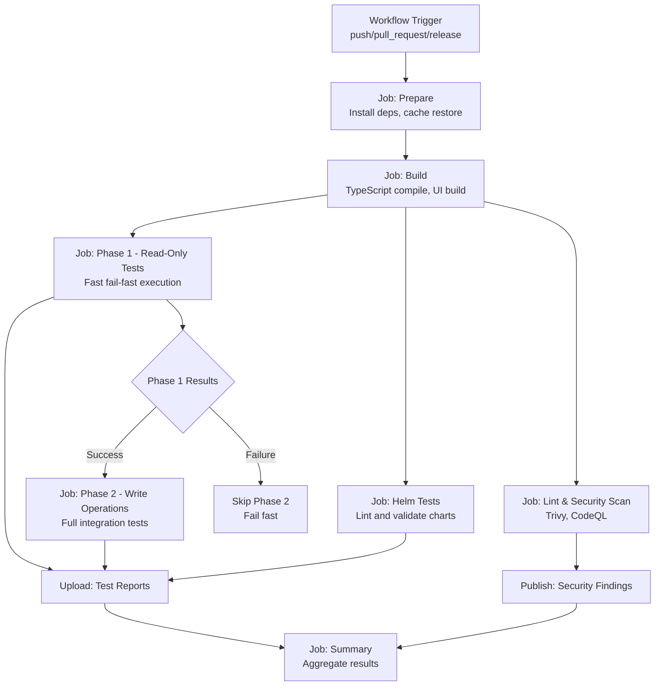
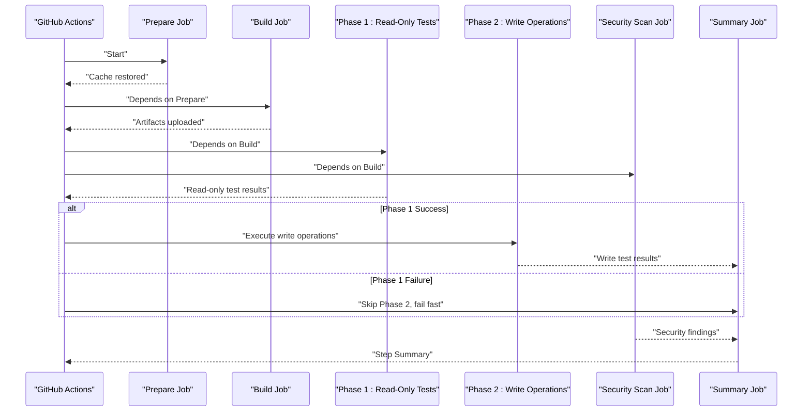
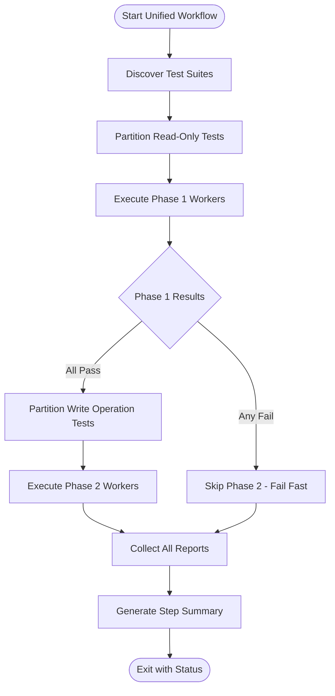
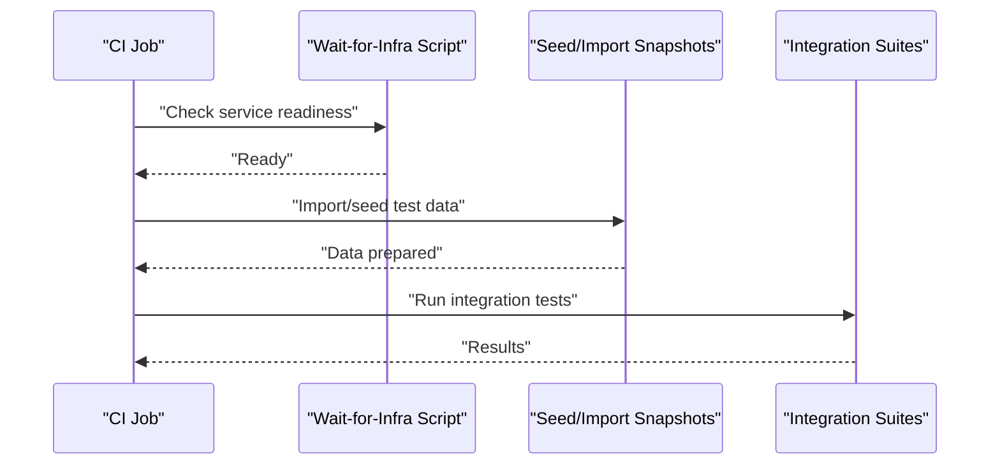
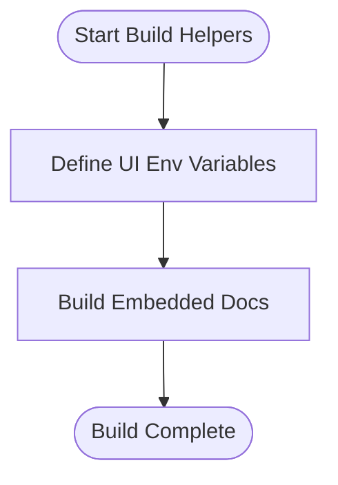
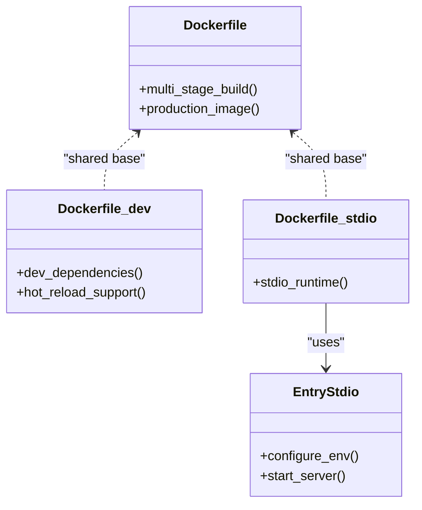
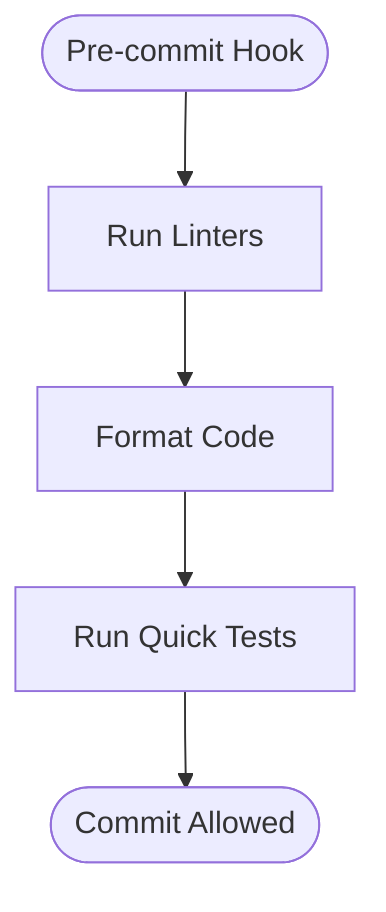
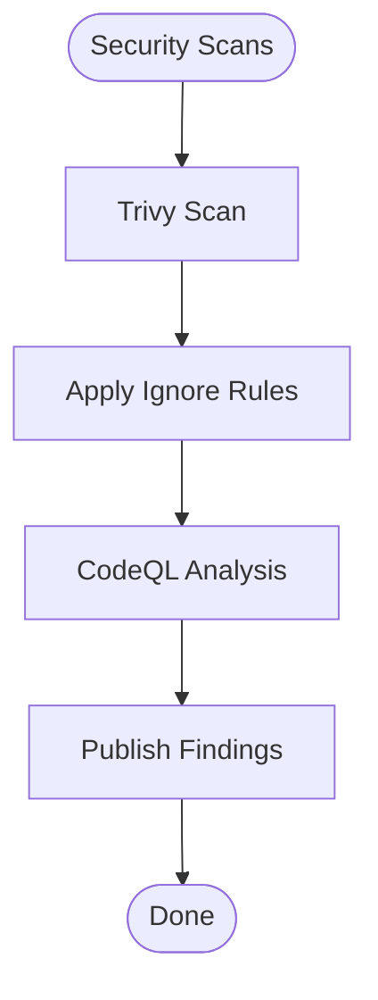
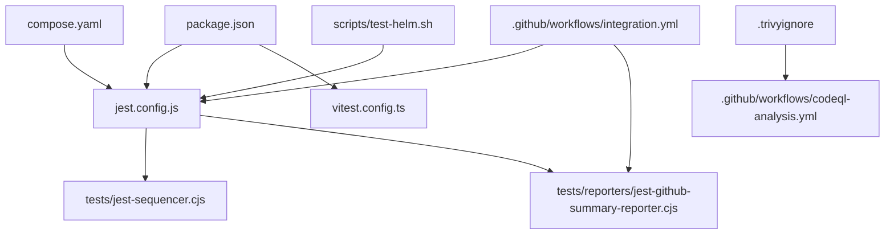

# Continuous Integration and Automation

<cite>
**Referenced Files in This Document**
- [package.json](file://package.json)
- [jest.config.js](file://jest.config.js)
- [vitest.config.ts](file://vitest.config.ts)
- [.github/workflows/ci.yml](file://.github/workflows/ci.yml)
- [.github/workflows/integration.yml](file://.github/workflows/integration.yml)
- [.github/workflows/codeql-analysis.yml](file://.github/workflows/codeql-analysis.yml)
- [.github/dependabot.yml](file://.github/dependabot.yml)
- [.husky/pre-commit](file://.husky/pre-commit)
- [.trivyignore](file://.trivyignore)
- [scripts/ci-parallel-checks.mjs](file://scripts/ci-parallel-checks.mjs)
- [scripts/ci-github-step-summary.mjs](file://scripts/ci-github-step-summary.mjs)
- [scripts/ci-test-tgz-install.mjs](file://scripts/ci-test-tgz-install.mjs)
- [scripts/ci-wait-for-infra.sh](file://scripts/ci-wait-for-infra.sh)
- [scripts/test-helm.sh](file://scripts/test-helm.sh)
- [scripts/import-test-snapshot.sh](file://scripts/import-test-snapshot.sh)
- [scripts/seed-test-snapshot.sh](file://scripts/seed-test-snapshot.sh)
- [scripts/build-embed-docs.ts](file://scripts/build-embed-docs.ts)
- [scripts/build-vite-ui-env-define.ts](file://scripts/build-vite-ui-env-define.ts)
- [scripts/deploy-run-env.sh](file://scripts/deploy-run-env.sh)
- [scripts/env/create-env.sh](file://scripts/env/create-env.sh)
- [scripts/stdio/entrypoint.sh](file://scripts/stdio/entrypoint.sh)
- [Dockerfile](file://Dockerfile)
- [Dockerfile.dev](file://Dockerfile.dev)
- [Dockerfile.stdio](file://Dockerfile.stdio)
- [compose.yaml](file://compose.yaml)
- [tests/jest-sequencer.cjs](file://tests/jest-sequencer.cjs)
- [tests/reporters/jest-github-summary-reporter.cjs](file://tests/reporters/jest-github-summary-reporter.cjs)
</cite>

## Update Summary
**Changes Made**
- Updated GitHub Actions workflow configuration to reflect consolidation of three separate integration workflows into single unified integration.yml
- Added documentation for new two-phase testing strategy with read-only-first fail-fast behavior
- Updated CI pipeline architecture diagrams to show streamlined workflow structure
- Enhanced parallel test execution strategy section to reflect optimized testing approach
- Updated troubleshooting guide with new workflow-specific debugging information

## Table of Contents
1. [Introduction](#introduction)
2. [Project Structure](#project-structure)
3. [Core Components](#core-components)
4. [Architecture Overview](#architecture-overview)
5. [Detailed Component Analysis](#detailed-component-analysis)
6. [Dependency Analysis](#dependency-analysis)
7. [Performance Considerations](#performance-considerations)
8. [Troubleshooting Guide](#troubleshooting-guide)
9. [Conclusion](#conclusion)
10. [Appendices](#appendices)

## Introduction
This document explains the continuous integration setup and automation workflows for Kairos MCP. It covers GitHub Actions configuration for automated testing, building, and deployment; parallel test execution strategy and performance optimizations; pre-commit hooks with Husky; CI pipeline stages, job dependencies, and artifact management; security scanning and compliance checks; caching strategies; debugging guidance; and examples of custom CI scripts and automation tasks.

The CI/CD pipeline has been significantly streamlined through consolidation of three separate integration workflows (Integration, Integration Simple, Integration Stdio) into a single unified integration.yml workflow, implementing a new two-phase testing strategy with read-only-first fail-fast behavior for improved efficiency and faster feedback loops.

## Project Structure
The CI and automation surface is composed of:
- GitHub Actions workflows under .github/workflows with consolidated integration testing
- Custom CI scripts under scripts
- Test orchestration and reporting under tests
- Containerization and local dev tooling via Dockerfiles and compose files
- Pre-commit hooks under .husky
- Security scanning configuration (.trivyignore)
- Dependency updates via Dependabot

```mermaid
graph TB
subgraph "CI Orchestration"
GH["GitHub Actions"]
W1[".github/workflows/ci.yml"]
W2[".github/workflows/integration.yml"]
W3[".github/workflows/codeql-analysis.yml"]
DEP[".github/dependabot.yml"]
end
subgraph "Scripts"
PAR["scripts/ci-parallel-checks.mjs"]
SUM["scripts/ci-github-step-summary.mjs"]
TGZ["scripts/ci-test-tgz-install.mjs"]
INFRA["scripts/ci-wait-for-infra.sh"]
HELM["scripts/test-helm.sh"]
SNAP_I["scripts/import-test-snapshot.sh"]
SNAP_S["scripts/seed-test-snapshot.sh"]
BUILD_E["scripts/build-embed-docs.ts"]
VITE_D["scripts/build-vite-ui-env-define.ts"]
RUN_ENV["scripts/deploy-run-env.sh"]
ENV_C["scripts/env/create-env.sh"]
STDIO_EP["scripts/stdio/entrypoint.sh"]
end
subgraph "Tests"
JCFG["jest.config.js"]
VCFG["vitest.config.ts"]
SEQ["tests/jest-sequencer.cjs"]
RPT["tests/reporters/jest-github-summary-reporter.cjs"]
end
subgraph "Containers"
DKR["Dockerfile"]
DKRD["Dockerfile.dev"]
DKRS["Dockerfile.stdio"]
CMP["compose.yaml"]
end
subgraph "Hooks & Security"
HUSKY[".husky/pre-commit"]
TRIVY[".trivyignore"]
end
GH --> W1
GH --> W2
GH --> W3
W1 --> PAR
W1 --> SUM
W1 --> TGZ
W1 --> INFRA
W1 --> HELM
W1 --> SNAP_I
W1 --> SNAP_S
W1 --> BUILD_E
W1 --> VITE_D
W1 --> RUN_ENV
W1 --> ENV_C
W1 --> STDIO_EP
W1 --> JCFG
W1 --> VCFG
W1 --> SEQ
W1 --> RPT
W1 --> DKR
W1 --> DKRD
W1 --> DKRS
W1 --> CMP
W1 --> HUSKY
W1 --> TRIVY
GH --> DEP
```

**Diagram sources**
- [.github/workflows/ci.yml](file://.github/workflows/ci.yml)
- [.github/workflows/integration.yml](file://.github/workflows/integration.yml)
- [.github/workflows/codeql-analysis.yml](file://.github/workflows/codeql-analysis.yml)
- [.github/dependabot.yml](file://.github/dependabot.yml)
- [scripts/ci-parallel-checks.mjs](file://scripts/ci-parallel-checks.mjs)
- [scripts/ci-github-step-summary.mjs](file://scripts/ci-github-step-summary.mjs)
- [scripts/ci-test-tgz-install.mjs](file://scripts/ci-test-tgz-install.mjs)
- [scripts/ci-wait-for-infra.sh](file://scripts/ci-wait-for-infra.sh)
- [scripts/test-helm.sh](file://scripts/test-helm.sh)
- [scripts/import-test-snapshot.sh](file://scripts/import-test-snapshot.sh)
- [scripts/seed-test-snapshot.sh](file://scripts/seed-test-snapshot.sh)
- [scripts/build-embed-docs.ts](file://scripts/build-embed-docs.ts)
- [scripts/build-vite-ui-env-define.ts](file://scripts/build-vite-ui-env-define.ts)
- [scripts/deploy-run-env.sh](file://scripts/deploy-run-env.sh)
- [scripts/env/create-env.sh](file://scripts/env/create-env.sh)
- [scripts/stdio/entrypoint.sh](file://scripts/stdio/entrypoint.sh)
- [jest.config.js](file://jest.config.js)
- [vitest.config.ts](file://vitest.config.ts)
- [tests/jest-sequencer.cjs](file://tests/jest-sequencer.cjs)
- [tests/reporters/jest-github-summary-reporter.cjs](file://tests/reporters/jest-github-summary-reporter.cjs)
- [Dockerfile](file://Dockerfile)
- [Dockerfile.dev](file://Dockerfile.dev)
- [Dockerfile.stdio](file://Dockerfile.stdio)
- [compose.yaml](file://compose.yaml)
- [.husky/pre-commit](file://.husky/pre-commit)
- [.trivyignore](file://.trivyignore)

**Section sources**
- [.github/workflows/ci.yml](file://.github/workflows/ci.yml)
- [.github/workflows/integration.yml](file://.github/workflows/integration.yml)
- [.github/workflows/codeql-analysis.yml](file://.github/workflows/codeql-analysis.yml)
- [.github/dependabot.yml](file://.github/dependabot.yml)
- [package.json](file://package.json)
- [jest.config.js](file://jest.config.js)
- [vitest.config.ts](file://vitest.config.ts)
- [tests/jest-sequencer.cjs](file://tests/jest-sequencer.cjs)
- [tests/reporters/jest-github-summary-reporter.cjs](file://tests/reporters/jest-github-summary-reporter.cjs)
- [Dockerfile](file://Dockerfile)
- [Dockerfile.dev](file://Dockerfile.dev)
- [Dockerfile.stdio](file://Dockerfile.stdio)
- [compose.yaml](file://compose.yaml)
- [.husky/pre-commit](file://.husky/pre-commit)
- [.trivyignore](file://.trivyignore)

## Core Components
- **Consolidated CI workflow orchestrator**: Streamlined workflow that combines previously separate integration tests into unified pipeline with optimized job orchestration, matrix builds, caching, artifacts, and step summaries.
- **Two-phase testing strategy**: New fail-fast approach that executes read-only tests first, followed by write operations only if read-only phase succeeds, improving feedback speed and resource utilization.
- **Parallel test executor**: Splits suites across workers to maximize throughput with enhanced distribution logic.
- **Reporting and summaries**: Produces GitHub-friendly summaries and test reports with consolidated results from unified workflow.
- **Infrastructure provisioning**: Waits for external services (e.g., Keycloak, Redis, Qdrant) before running tests.
- **Helm chart validation**: Runs chart linting and tests.
- **Snapshot import/seed**: Prepares deterministic test data.
- **Build helpers**: UI environment definition and embedded docs build.
- **Container images**: Multi-stage builds for app, dev, and stdio variants.
- **Local automation**: Husky pre-commit hook to enforce quality gates locally.
- **Security scanning**: Trivy vulnerability scanning with ignore rules.
- **Dependency updates**: Dependabot configuration for automated PRs.

**Section sources**
- [.github/workflows/integration.yml](file://.github/workflows/integration.yml)
- [.github/workflows/ci.yml](file://.github/workflows/ci.yml)
- [scripts/ci-parallel-checks.mjs](file://scripts/ci-parallel-checks.mjs)
- [scripts/ci-github-step-summary.mjs](file://scripts/ci-github-step-summary.mjs)
- [scripts/ci-wait-for-infra.sh](file://scripts/ci-wait-for-infra.sh)
- [scripts/test-helm.sh](file://scripts/test-helm.sh)
- [scripts/import-test-snapshot.sh](file://scripts/import-test-snapshot.sh)
- [scripts/seed-test-snapshot.sh](file://scripts/seed-test-snapshot.sh)
- [scripts/build-embed-docs.ts](file://scripts/build-embed-docs.ts)
- [scripts/build-vite-ui-env-define.ts](file://scripts/build-vite-ui-env-define.ts)
- [Dockerfile](file://Dockerfile)
- [Dockerfile.dev](file://Dockerfile.dev)
- [Dockerfile.stdio](file://Dockerfile.stdio)
- [.husky/pre-commit](file://.husky/pre-commit)
- [.trivyignore](file://.trivyignore)
- [.github/dependabot.yml](file://.github/dependabot.yml)

## Architecture Overview
The CI architecture coordinates multiple jobs that share caches and artifacts with a streamlined workflow structure. Jobs are grouped into logical stages: prepare, build, test (two-phase), package, and deploy. Matrix strategies run subsets in parallel with optimized resource allocation. Artifacts are uploaded for later jobs or manual inspection.

**Diagram sources**
- [.github/workflows/integration.yml](file://.github/workflows/integration.yml)
- [.github/workflows/ci.yml](file://.github/workflows/ci.yml)
- [scripts/ci-parallel-checks.mjs](file://scripts/ci-parallel-checks.mjs)
- [scripts/ci-github-step-summary.mjs](file://scripts/ci-github-step-summary.mjs)
- [scripts/ci-wait-for-infra.sh](file://scripts/ci-wait-for-infra.sh)
- [scripts/test-helm.sh](file://scripts/test-helm.sh)
- [tests/reporters/jest-github-summary-reporter.cjs](file://tests/reporters/jest-github-summary-reporter.cjs)

## Detailed Component Analysis

### Consolidated GitHub Actions Workflow Configuration
**Updated** The CI workflow has been significantly streamlined through consolidation of three separate integration workflows into a single unified integration.yml workflow.

- **Unified Workflow**: Single integration.yml replaces separate Integration, Integration Simple, and Integration Stdio workflows
- **Two-Phase Testing Strategy**: 
  - Phase 1: Read-only tests execute first with fail-fast behavior
  - Phase 2: Write operation tests only run if Phase 1 succeeds
- **Optimized Job Dependencies**: Streamlined dependency chain reduces workflow complexity
- **Enhanced Matrix Strategy**: Consolidated matrix configurations for better resource utilization
- **Improved Artifact Management**: Centralized artifact handling across all test phases

**Diagram sources**
- [.github/workflows/integration.yml](file://.github/workflows/integration.yml)
- [.github/workflows/ci.yml](file://.github/workflows/ci.yml)
- [scripts/ci-github-step-summary.mjs](file://scripts/ci-github-step-summary.mjs)

**Section sources**
- [.github/workflows/integration.yml](file://.github/workflows/integration.yml)
- [.github/workflows/ci.yml](file://.github/workflows/ci.yml)

### Enhanced Parallel Test Execution Strategy
**Updated** The parallel test execution strategy now operates within the unified workflow with improved distribution logic and two-phase execution model.

- **Unified Distribution**: Single script manages test suite distribution across both phases
- **Phase-Aware Partitioning**: Read-only tests partitioned separately from write operations
- **Enhanced Concurrency Control**: Improved worker allocation based on test type and resource requirements
- **Optimized Cache Sharing**: Better cache utilization between phases and workers
- **Fail-Fast Integration**: Immediate failure propagation from Phase 1 prevents unnecessary Phase 2 execution

**Diagram sources**
- [scripts/ci-parallel-checks.mjs](file://scripts/ci-parallel-checks.mjs)
- [.github/workflows/integration.yml](file://.github/workflows/integration.yml)
- [tests/jest-sequencer.cjs](file://tests/jest-sequencer.cjs)
- [tests/reporters/jest-github-summary-reporter.cjs](file://tests/reporters/jest-github-summary-reporter.cjs)

**Section sources**
- [scripts/ci-parallel-checks.mjs](file://scripts/ci-parallel-checks.mjs)
- [.github/workflows/integration.yml](file://.github/workflows/integration.yml)
- [tests/jest-sequencer.cjs](file://tests/jest-sequencer.cjs)
- [tests/reporters/jest-github-summary-reporter.cjs](file://tests/reporters/jest-github-summary-reporter.cjs)

### Infrastructure Provisioning and Snapshots
- Wait-for-infra script ensures external services are ready before running integration tests.
- Snapshot import and seed scripts prepare deterministic datasets for reproducible tests.
- Environment creation helper sets up required variables and files.

**Diagram sources**
- [scripts/ci-wait-for-infra.sh](file://scripts/ci-wait-for-infra.sh)
- [scripts/import-test-snapshot.sh](file://scripts/import-test-snapshot.sh)
- [scripts/seed-test-snapshot.sh](file://scripts/seed-test-snapshot.sh)
- [scripts/env/create-env.sh](file://scripts/env/create-env.sh)

**Section sources**
- [scripts/ci-wait-for-infra.sh](file://scripts/ci-wait-for-infra.sh)
- [scripts/import-test-snapshot.sh](file://scripts/import-test-snapshot.sh)
- [scripts/seed-test-snapshot.sh](file://scripts/seed-test-snapshot.sh)
- [scripts/env/create-env.sh](file://scripts/env/create-env.sh)

### Helm Chart Testing
- Dedicated script runs chart linting and validation.
- Results are included in the CI summary.

**Diagram sources**
- [scripts/test-helm.sh](file://scripts/test-helm.sh)

**Section sources**
- [scripts/test-helm.sh](file://scripts/test-helm.sh)

### Build Helpers and UI Environment
- UI environment definition script injects runtime variables during build.
- Embedded docs build script prepares documentation assets consumed at runtime.

**Diagram sources**
- [scripts/build-vite-ui-env-define.ts](file://scripts/build-vite-ui-env-define.ts)
- [scripts/build-embed-docs.ts](file://scripts/build-embed-docs.ts)

**Section sources**
- [scripts/build-vite-ui-env-define.ts](file://scripts/build-vite-ui-env-define.ts)
- [scripts/build-embed-docs.ts](file://scripts/build-embed-docs.ts)

### Container Images and Entrypoints
- Multi-stage Dockerfiles for production, development, and stdio modes.
- Stdio entrypoint script configures runtime behavior for CLI usage.

**Diagram sources**
- [Dockerfile](file://Dockerfile)
- [Dockerfile.dev](file://Dockerfile.dev)
- [Dockerfile.stdio](file://Dockerfile.stdio)
- [scripts/stdio/entrypoint.sh](file://scripts/stdio/entrypoint.sh)

**Section sources**
- [Dockerfile](file://Dockerfile)
- [Dockerfile.dev](file://Dockerfile.dev)
- [Dockerfile.stdio](file://Dockerfile.stdio)
- [scripts/stdio/entrypoint.sh](file://scripts/stdio/entrypoint.sh)

### Pre-commit Hooks and Local Development Automation
- Husky pre-commit hook enforces code quality and formatting before commits.
- Can be extended to include additional linters or tests.

**Diagram sources**
- [.husky/pre-commit](file://.husky/pre-commit)

**Section sources**
- [.husky/pre-commit](file://.husky/pre-commit)

### Security Scanning and Compliance Checks
- Trivy scans containers and filesystems for vulnerabilities; ignores are managed via an ignore file.
- CodeQL analysis identifies security issues in source code.
- Results are published to the workflow summary.

**Diagram sources**
- [.trivyignore](file://.trivyignore)
- [.github/workflows/codeql-analysis.yml](file://.github/workflows/codeql-analysis.yml)

**Section sources**
- [.trivyignore](file://.trivyignore)
- [.github/workflows/codeql-analysis.yml](file://.github/workflows/codeql-analysis.yml)

### Dependency Updates
- Dependabot monitors package manifests and opens update PRs automatically.

**Diagram sources**
- [.github/dependabot.yml](file://.github/dependabot.yml)

**Section sources**
- [.github/dependabot.yml](file://.github/dependabot.yml)

## Dependency Analysis
The CI workflow depends on:
- Node.js toolchain and package manager for installs and builds.
- Test runners configured via Jest and Vitest.
- External services provisioned by Compose or CI-hosted services.
- Helm CLI for chart validation.
- Security scanners (Trivy, CodeQL).

**Diagram sources**
- [package.json](file://package.json)
- [jest.config.js](file://jest.config.js)
- [vitest.config.ts](file://vitest.config.ts)
- [tests/jest-sequencer.cjs](file://tests/jest-sequencer.cjs)
- [tests/reporters/jest-github-summary-reporter.cjs](file://tests/reporters/jest-github-summary-reporter.cjs)
- [compose.yaml](file://compose.yaml)
- [scripts/test-helm.sh](file://scripts/test-helm.sh)
- [.trivyignore](file://.trivyignore)
- [.github/workflows/codeql-analysis.yml](file://.github/workflows/codeql-analysis.yml)
- [.github/workflows/integration.yml](file://.github/workflows/integration.yml)

**Section sources**
- [package.json](file://package.json)
- [jest.config.js](file://jest.config.js)
- [vitest.config.ts](file://vitest.config.ts)
- [tests/jest-sequencer.cjs](file://tests/jest-sequencer.cjs)
- [tests/reporters/jest-github-summary-reporter.cjs](file://tests/reporters/jest-github-summary-reporter.cjs)
- [compose.yaml](file://compose.yaml)
- [scripts/test-helm.sh](file://scripts/test-helm.sh)
- [.trivyignore](file://.trivyignore)
- [.github/workflows/codeql-analysis.yml](file://.github/workflows/codeql-analysis.yml)
- [.github/workflows/integration.yml](file://.github/workflows/integration.yml)

## Performance Considerations
**Updated** Performance optimizations have been enhanced through workflow consolidation and two-phase testing strategy.

- **Caching**:
  - Restore and save Node modules and build caches between jobs to minimize install times.
  - Cache test snapshots where appropriate to speed up integration tests.
  - **New**: Optimized cache sharing between Phase 1 and Phase 2 tests to reduce redundant setup.
- **Parallelization**:
  - Use matrix strategies to split suites across workers.
  - Leverage the parallel checks script to distribute workloads efficiently.
  - **New**: Phase-aware worker allocation optimizes resource usage based on test type.
- **Artifact reuse**:
  - Upload build artifacts once and consume them in subsequent jobs to avoid redundant builds.
  - **New**: Consolidated artifact management reduces upload/download overhead.
- **Concurrency limits**:
  - Configure runner concurrency to prevent resource contention.
  - **New**: Dynamic concurrency adjustment based on test phase requirements.
- **Image optimization**:
  - Use multi-stage Dockerfiles to keep images lean and reduce scan times.
- **Two-Phase Optimization**:
  - **New**: Fail-fast behavior eliminates unnecessary Phase 2 execution when Phase 1 fails.
  - **New**: Read-only tests execute faster, providing quicker feedback.
  - **New**: Reduced overall workflow duration through intelligent test ordering.

## Troubleshooting Guide
**Updated** Enhanced troubleshooting guidance for the consolidated workflow and two-phase testing strategy.

- **Debugging CI failures**:
  - Inspect step summaries generated by the summary script for aggregated results.
  - Download artifacts containing logs and reports for deeper analysis.
  - Use wait-for-infra logs to verify external service readiness.
  - **New**: Check Phase 1 vs Phase 2 failure indicators in workflow output.
  - **New**: Review consolidated workflow logs instead of separate integration workflow logs.
- **Common issues**:
  - Missing environment variables: Ensure create-env and deploy-run-env scripts are executed in the correct order.
  - Snapshot mismatches: Re-seed or import snapshots if test data drift occurs.
  - Helm validation errors: Review values and templates referenced by the Helm test script.
  - Security findings: Adjust .trivyignore only when justified; otherwise remediate vulnerabilities.
  - **New**: Phase 1 failures preventing Phase 2 execution - verify read-only test dependencies.
  - **New**: Resource contention in unified workflow - adjust matrix configuration if needed.
- **Optimization tips**:
  - Increase cache keys specificity to avoid stale caches.
  - Reduce suite size or shard further if tests exceed timeouts.
  - Pin Node.js versions to ensure consistent builds.
  - **New**: Optimize test partitioning between phases for balanced execution time.
  - **New**: Monitor Phase 1 completion time to identify slow read-only tests.

**Section sources**
- [scripts/ci-github-step-summary.mjs](file://scripts/ci-github-step-summary.mjs)
- [scripts/ci-wait-for-infra.sh](file://scripts/ci-wait-for-infra.sh)
- [scripts/env/create-env.sh](file://scripts/env/create-env.sh)
- [scripts/deploy-run-env.sh](file://scripts/deploy-run-env.sh)
- [scripts/import-test-snapshot.sh](file://scripts/import-test-snapshot.sh)
- [scripts/seed-test-snapshot.sh](file://scripts/seed-test-snapshot.sh)
- [scripts/test-helm.sh](file://scripts/test-helm.sh)
- [.trivyignore](file://.trivyignore)
- [.github/workflows/integration.yml](file://.github/workflows/integration.yml)

## Conclusion
Kairos MCP's CI system has been significantly streamlined through consolidation of three separate integration workflows into a single unified integration.yml workflow, implementing a new two-phase testing strategy with read-only-first fail-fast behavior. This enhancement delivers faster feedback loops, improved resource utilization, and simplified maintenance while maintaining comprehensive test coverage. The modular scripts and clear separation of concerns make it straightforward to extend pipelines, add new checks, and optimize performance. Adopting the recommended practices will help maintain high-quality releases and secure deployments with enhanced efficiency.

## Appendices

### Example Custom CI Scripts and Tasks
- **Unified workflow orchestration**: Consolidates multiple integration workflows into single streamlined pipeline.
- **Two-phase testing**: Implements read-only-first fail-fast strategy for faster feedback.
- **Parallel checks**: Distribute test suites across workers for faster execution with phase-aware distribution.
- **Step summary**: Aggregate results into a single GitHub summary for visibility.
- **TGZ install test**: Validate packaged artifacts installation flows.
- **Infra wait**: Poll external services until healthy before running dependent tests.
- **Helm tests**: Lint and validate charts consistently across environments.
- **Snapshot management**: Import and seed deterministic datasets for stable tests.
- **Build helpers**: Define UI env variables and build embedded docs for runtime consumption.
- **Deploy environment**: Prepare runtime environment variables and secrets for deployment jobs.
- **Stdio entrypoint**: Configure CLI runtime behavior for headless operations.

**Section sources**
- [.github/workflows/integration.yml](file://.github/workflows/integration.yml)
- [scripts/ci-parallel-checks.mjs](file://scripts/ci-parallel-checks.mjs)
- [scripts/ci-github-step-summary.mjs](file://scripts/ci-github-step-summary.mjs)
- [scripts/ci-test-tgz-install.mjs](file://scripts/ci-test-tgz-install.mjs)
- [scripts/ci-wait-for-infra.sh](file://scripts/ci-wait-for-infra.sh)
- [scripts/test-helm.sh](file://scripts/test-helm.sh)
- [scripts/import-test-snapshot.sh](file://scripts/import-test-snapshot.sh)
- [scripts/seed-test-snapshot.sh](file://scripts/seed-test-snapshot.sh)
- [scripts/build-vite-ui-env-define.ts](file://scripts/build-vite-ui-env-define.ts)
- [scripts/build-embed-docs.ts](file://scripts/build-embed-docs.ts)
- [scripts/deploy-run-env.sh](file://scripts/deploy-run-env.sh)
- [scripts/stdio/entrypoint.sh](file://scripts/stdio/entrypoint.sh)