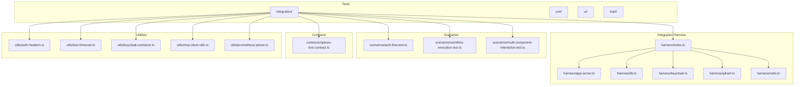
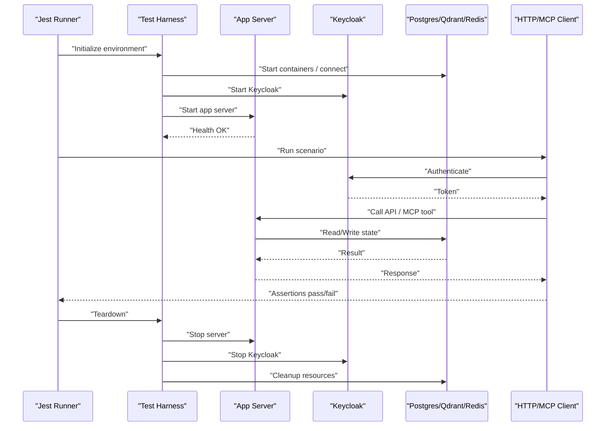
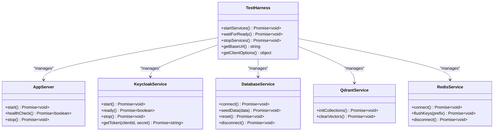
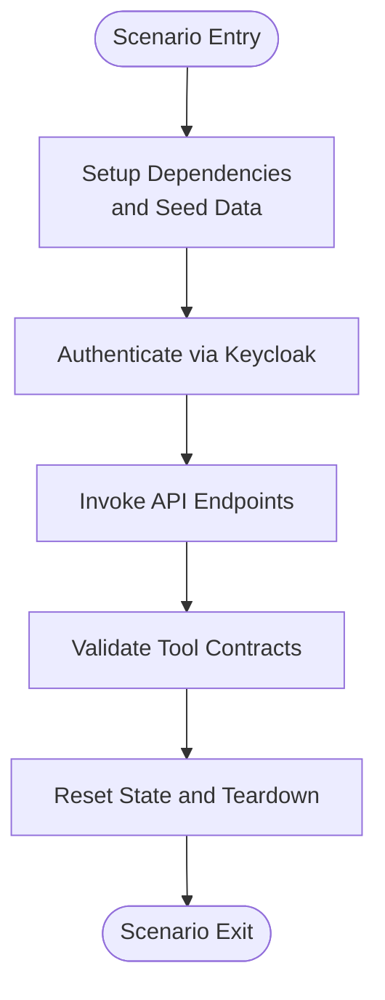
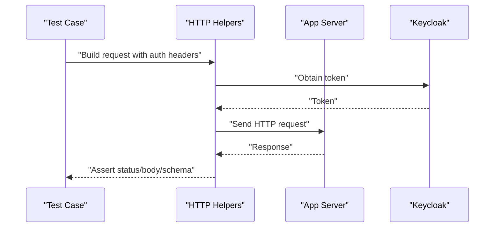
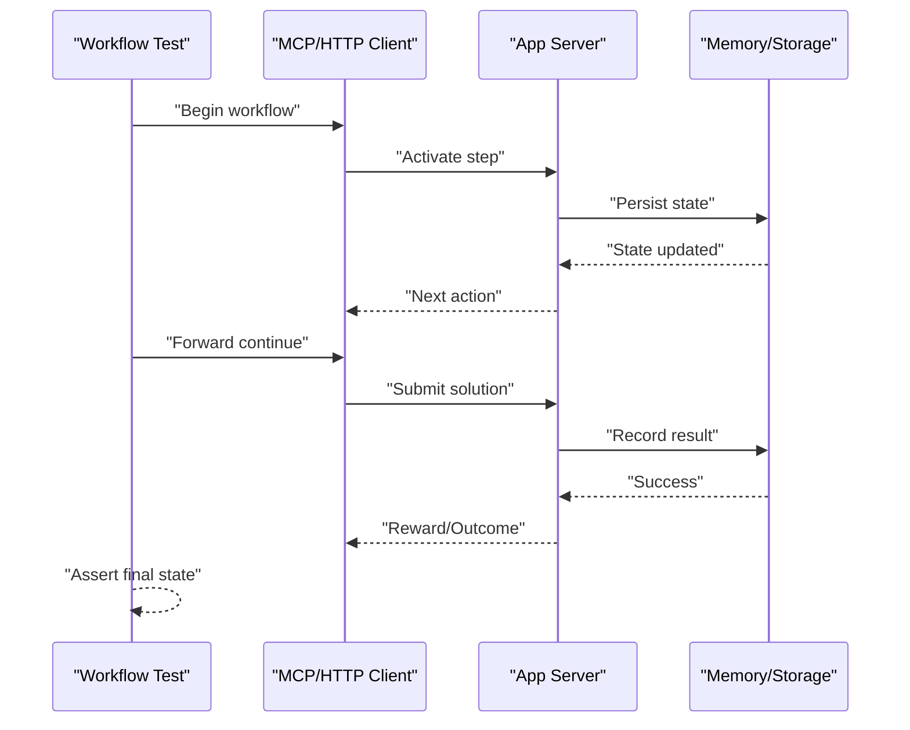
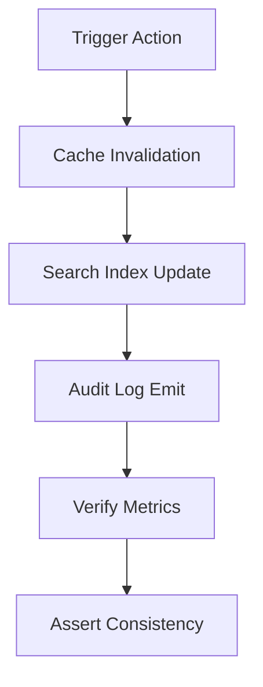
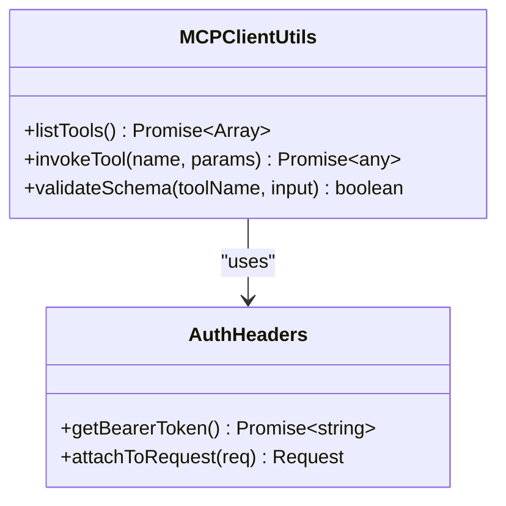
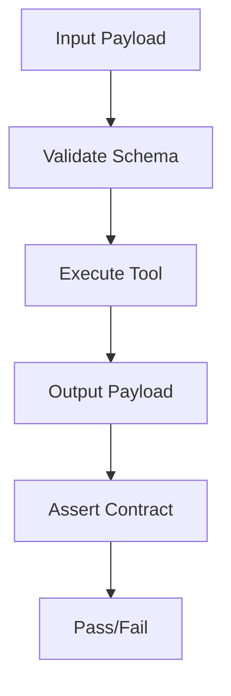
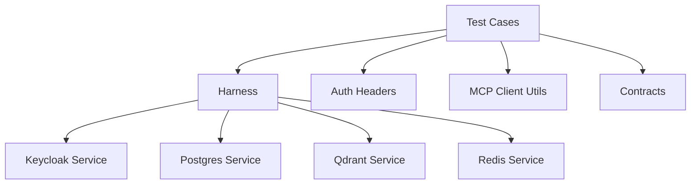

# Integration Testing

<cite>
**Referenced Files in This Document**
- [jest.config.js](file://jest.config.js)
- [tsconfig.tests.json](file://tsconfig.tests.json)
- [setup.ts](file://tests/setup.ts)
- [global-setup-auth.ts](file://tests/global-setup-auth.ts)
- [global-teardown-auth.ts](file://tests/global-teardown-auth.ts)
- [harness/index.ts](file://tests/integration/harness/index.ts)
- [harness/app-server.ts](file://tests/integration/harness/app-server.ts)
- [harness/db.ts](file://tests/integration/harness/db.ts)
- [harness/keycloak.ts](file://tests/integration/harness/keycloak.ts)
- [harness/qdrant.ts](file://tests/integration/harness/qdrant.ts)
- [harness/redis.ts](file://tests/integration/harness/redis.ts)
- [scenarios/auth-flow.test.ts](file://tests/integration/scenarios/auth-flow.test.ts)
- [scenarios/workflow-execution.test.ts](file://tests/integration/scenarios/workflow-execution.test.ts)
- [scenarios/multi-component-interaction.test.ts](file://tests/integration/scenarios/multi-component-interaction.test.ts)
- [utils/test-timeouts.ts](file://tests/utils/test-timeouts.ts)
- [utils/auth-headers.ts](file://tests/utils/auth-headers.ts)
- [utils/keycloak-container.ts](file://tests/utils/keycloak-container.ts)
- [contracts/spaces-tool.contract.ts](file://tests/integration/contracts/spaces-tool.contract.ts)
- [http-api-test-helpers.ts](file://tests/integration/http-api-test-helpers.ts)
- [v4-kairos-activate.test.ts](file://tests/integration/v4-kairos-activate.test.ts)
- [mcp-client-utils.ts](file://tests/utils/mcp-client-utils.ts)
- [prometheus-parser.ts](file://tests/utils/prometheus-parser.ts)
</cite>

## Table of Contents
1. [Introduction](#introduction)
2. [Project Structure](#project-structure)
3. [Core Components](#core-components)
4. [Architecture Overview](#architecture-overview)
5. [Detailed Component Analysis](#detailed-component-analysis)
6. [Dependency Analysis](#dependency-analysis)
7. [Performance Considerations](#performance-considerations)
8. [Troubleshooting Guide](#troubleshooting-guide)
9. [Conclusion](#conclusion)
10. [Appendices](#appendices)

## Introduction
This document explains the integration testing strategy for Kairos MCP. It covers the test harness architecture, scenario-based testing approach, and how to set up tests against real dependencies such as databases, authentication services, and external APIs. It also documents utilities and helpers for creating test scenarios, examples for API endpoints, workflow execution, and multi-component interactions, and provides guidance on database state management, data isolation, cleanup procedures, performance considerations, parallel execution strategies, and maintainability best practices.

## Project Structure
Integration tests live under the tests/integration directory and are organized by feature area with a shared harness for bootstrapping real dependencies. The harness manages lifecycle of external services (Keycloak, Qdrant, Redis, Postgres), application server startup, and per-test setup/teardown. Contracts define expected behavior for tools and APIs. Shared utilities provide common helpers for authentication headers, timeouts, and client utilities.

**Diagram sources**
- [harness/index.ts](file://tests/integration/harness/index.ts)
- [harness/app-server.ts](file://tests/integration/harness/app-server.ts)
- [harness/db.ts](file://tests/integration/harness/db.ts)
- [harness/keycloak.ts](file://tests/integration/harness/keycloak.ts)
- [harness/qdrant.ts](file://tests/integration/harness/qdrant.ts)
- [harness/redis.ts](file://tests/integration/harness/redis.ts)
- [scenarios/auth-flow.test.ts](file://tests/integration/scenarios/auth-flow.test.ts)
- [scenarios/workflow-execution.test.ts](file://tests/integration/scenarios/workflow-execution.test.ts)
- [scenarios/multi-component-interaction.test.ts](file://tests/integration/scenarios/multi-component-interaction.test.ts)
- [contracts/spaces-tool.contract.ts](file://tests/integration/contracts/spaces-tool.contract.ts)
- [utils/auth-headers.ts](file://tests/utils/auth-headers.ts)
- [utils/test-timeouts.ts](file://tests/utils/test-timeouts.ts)
- [utils/keycloak-container.ts](file://tests/utils/keycloak-container.ts)
- [utils/mcp-client-utils.ts](file://tests/utils/mcp-client-utils.ts)
- [utils/prometheus-parser.ts](file://tests/utils/prometheus-parser.ts)

**Section sources**
- [jest.config.js](file://jest.config.js)
- [tsconfig.tests.json](file://tsconfig.tests.json)
- [setup.ts](file://tests/setup.ts)

## Core Components
The integration test harness is responsible for:
- Bootstrapping the application server with real configuration
- Starting and managing external dependencies (Keycloak, Qdrant, Redis, Postgres)
- Providing per-test fixtures and teardown logic
- Exposing typed helpers for HTTP and MCP clients
- Enforcing contracts for tool responses and behaviors

Key responsibilities:
- Application server lifecycle: start, stop, health checks
- Dependency lifecycle: containerized or local service management
- Test data seeding and isolation: ensure deterministic state per test
- Authentication flow: obtain tokens and attach headers
- Contract validation: assert schema and behavior consistency

**Section sources**
- [harness/index.ts](file://tests/integration/harness/index.ts)
- [harness/app-server.ts](file://tests/integration/harness/app-server.ts)
- [harness/db.ts](file://tests/integration/harness/db.ts)
- [harness/keycloak.ts](file://tests/integration/harness/keycloak.ts)
- [harness/qdrant.ts](file://tests/integration/harness/qdrant.ts)
- [harness/redis.ts](file://tests/integration/harness/redis.ts)
- [http-api-test-helpers.ts](file://tests/integration/http-api-test-helpers.ts)
- [utils/auth-headers.ts](file://tests/utils/auth-headers.ts)
- [utils/mcp-client-utils.ts](file://tests/utils/mcp-client-utils.ts)

## Architecture Overview
The integration test suite orchestrates multiple components:
- Test runner (Jest) executes scenario files
- Harness initializes the app server and external services
- Scenarios drive workflows via HTTP and MCP clients
- Contracts validate tool outputs and schemas
- Utilities assist with auth, timeouts, and parsing metrics

**Diagram sources**
- [harness/index.ts](file://tests/integration/harness/index.ts)
- [harness/app-server.ts](file://tests/integration/harness/app-server.ts)
- [harness/keycloak.ts](file://tests/integration/harness/keycloak.ts)
- [harness/db.ts](file://tests/integration/harness/db.ts)
- [harness/qdrant.ts](file://tests/integration/harness/qdrant.ts)
- [harness/redis.ts](file://tests/integration/harness/redis.ts)
- [http-api-test-helpers.ts](file://tests/integration/http-api-test-helpers.ts)
- [utils/mcp-client-utils.ts](file://tests/utils/mcp-client-utils.ts)

## Detailed Component Analysis

### Test Harness Lifecycle
The harness centralizes dependency management and server lifecycle. It exposes methods to start services, wait for readiness, and perform cleanup. Tests import the harness to bootstrap their environment deterministically.

**Diagram sources**
- [harness/index.ts](file://tests/integration/harness/index.ts)
- [harness/app-server.ts](file://tests/integration/harness/app-server.ts)
- [harness/keycloak.ts](file://tests/integration/harness/keycloak.ts)
- [harness/db.ts](file://tests/integration/harness/db.ts)
- [harness/qdrant.ts](file://tests/integration/harness/qdrant.ts)
- [harness/redis.ts](file://tests/integration/harness/redis.ts)

**Section sources**
- [harness/index.ts](file://tests/integration/harness/index.ts)
- [harness/app-server.ts](file://tests/integration/harness/app-server.ts)
- [harness/keycloak.ts](file://tests/integration/harness/keycloak.ts)
- [harness/db.ts](file://tests/integration/harness/db.ts)
- [harness/qdrant.ts](file://tests/integration/harness/qdrant.ts)
- [harness/redis.ts](file://tests/integration/harness/redis.ts)

### Scenario-Based Testing Approach
Scenarios encapsulate end-to-end flows such as authentication, workflow execution, and multi-component interactions. Each scenario imports the harness and uses typed helpers to interact with the system.

**Diagram sources**
- [scenarios/auth-flow.test.ts](file://tests/integration/scenarios/auth-flow.test.ts)
- [scenarios/workflow-execution.test.ts](file://tests/integration/scenarios/workflow-execution.test.ts)
- [scenarios/multi-component-interaction.test.ts](file://tests/integration/scenarios/multi-component-interaction.test.ts)
- [contracts/spaces-tool.contract.ts](file://tests/integration/contracts/spaces-tool.contract.ts)

**Section sources**
- [scenarios/auth-flow.test.ts](file://tests/integration/scenarios/auth-flow.test.ts)
- [scenarios/workflow-execution.test.ts](file://tests/integration/scenarios/workflow-execution.test.ts)
- [scenarios/multi-component-interaction.test.ts](file://tests/integration/scenarios/multi-component-interaction.test.ts)
- [contracts/spaces-tool.contract.ts](file://tests/integration/contracts/spaces-tool.contract.ts)

### API Endpoint Testing
HTTP API tests use shared helpers to construct requests, attach authentication headers, and assert responses. They cover success paths, error handling, and contract compliance.

**Diagram sources**
- [http-api-test-helpers.ts](file://tests/integration/http-api-test-helpers.ts)
- [utils/auth-headers.ts](file://tests/utils/auth-headers.ts)
- [harness/keycloak.ts](file://tests/integration/harness/keycloak.ts)

**Section sources**
- [http-api-test-helpers.ts](file://tests/integration/http-api-test-helpers.ts)
- [utils/auth-headers.ts](file://tests/utils/auth-headers.ts)
- [harness/keycloak.ts](file://tests/integration/harness/keycloak.ts)

### Workflow Execution Testing
Workflow tests exercise multi-step processes such as activation, forward, and reward operations. They validate state transitions and outputs across components.

**Diagram sources**
- [v4-kairos-activate.test.ts](file://tests/integration/v4-kairos-activate.test.ts)
- [scenarios/workflow-execution.test.ts](file://tests/integration/scenarios/workflow-execution.test.ts)
- [harness/app-server.ts](file://tests/integration/harness/app-server.ts)

**Section sources**
- [v4-kairos-activate.test.ts](file://tests/integration/v4-kairos-activate.test.ts)
- [scenarios/workflow-execution.test.ts](file://tests/integration/scenarios/workflow-execution.test.ts)
- [harness/app-server.ts](file://tests/integration/harness/app-server.ts)

### Multi-Component Interaction Testing
These tests verify cross-service interactions including caching, search retrieval, and audit logging. They often combine HTTP calls with direct storage checks.

**Diagram sources**
- [scenarios/multi-component-interaction.test.ts](file://tests/integration/scenarios/multi-component-interaction.test.ts)
- [utils/prometheus-parser.ts](file://tests/utils/prometheus-parser.ts)
- [harness/redis.ts](file://tests/integration/harness/redis.ts)
- [harness/qdrant.ts](file://tests/integration/harness/qdrant.ts)

**Section sources**
- [scenarios/multi-component-interaction.test.ts](file://tests/integration/scenarios/multi-component-interaction.test.ts)
- [utils/prometheus-parser.ts](file://tests/utils/prometheus-parser.ts)
- [harness/redis.ts](file://tests/integration/harness/redis.ts)
- [harness/qdrant.ts](file://tests/integration/harness/qdrant.ts)

### MCP Client Utilities
MCP-specific helpers simplify tool invocation, schema validation, and response parsing. They integrate with the harness to reuse authenticated sessions.

**Diagram sources**
- [utils/mcp-client-utils.ts](file://tests/utils/mcp-client-utils.ts)
- [utils/auth-headers.ts](file://tests/utils/auth-headers.ts)

**Section sources**
- [utils/mcp-client-utils.ts](file://tests/utils/mcp-client-utils.ts)
- [utils/auth-headers.ts](file://tests/utils/auth-headers.ts)

### Contract Validation
Contracts define expected shapes and behaviors for tools and APIs. Tests assert that implementations adhere to these contracts, ensuring parity across interfaces.

**Diagram sources**
- [contracts/spaces-tool.contract.ts](file://tests/integration/contracts/spaces-tool.contract.ts)

**Section sources**
- [contracts/spaces-tool.contract.ts](file://tests/integration/contracts/spaces-tool.contract.ts)

## Dependency Analysis
Integration tests depend on:
- External services: Keycloak, Postgres, Qdrant, Redis
- Application server: started by harness
- Utilities: auth headers, timeouts, MCP client helpers
- Contracts: tool/API shape definitions

**Diagram sources**
- [harness/index.ts](file://tests/integration/harness/index.ts)
- [harness/keycloak.ts](file://tests/integration/harness/keycloak.ts)
- [harness/db.ts](file://tests/integration/harness/db.ts)
- [harness/qdrant.ts](file://tests/integration/harness/qdrant.ts)
- [harness/redis.ts](file://tests/integration/harness/redis.ts)
- [utils/auth-headers.ts](file://tests/utils/auth-headers.ts)
- [utils/mcp-client-utils.ts](file://tests/utils/mcp-client-utils.ts)
- [contracts/spaces-tool.contract.ts](file://tests/integration/contracts/spaces-tool.contract.ts)

**Section sources**
- [harness/index.ts](file://tests/integration/harness/index.ts)
- [harness/keycloak.ts](file://tests/integration/harness/keycloak.ts)
- [harness/db.ts](file://tests/integration/harness/db.ts)
- [harness/qdrant.ts](file://tests/integration/harness/qdrant.ts)
- [harness/redis.ts](file://tests/integration/harness/redis.ts)
- [utils/auth-headers.ts](file://tests/utils/auth-headers.ts)
- [utils/mcp-client-utils.ts](file://tests/utils/mcp-client-utils.ts)
- [contracts/spaces-tool.contract.ts](file://tests/integration/contracts/spaces-tool.contract.ts)

## Performance Considerations
- Use connection pooling for databases and caches to reduce overhead
- Reuse authenticated sessions within a test file when safe
- Minimize seed data size; only include necessary records
- Prefer targeted queries over full scans during assertions
- Leverage in-memory stores where acceptable for speed
- Avoid unnecessary restarts of services between tests
- Use timeouts judiciously to fail fast without flakiness

[No sources needed since this section provides general guidance]

## Troubleshooting Guide
Common issues and resolutions:
- Service readiness: Ensure health checks pass before invoking APIs
- Authentication failures: Verify Keycloak realm and client credentials
- Data leakage: Reset state between tests using dedicated cleanup routines
- Timeouts: Increase test timeouts for slow operations and adjust globally if needed
- Metrics parsing: Validate Prometheus scrape endpoints and metric names

**Section sources**
- [utils/test-timeouts.ts](file://tests/utils/test-timeouts.ts)
- [utils/keycloak-container.ts](file://tests/utils/keycloak-container.ts)
- [utils/prometheus-parser.ts](file://tests/utils/prometheus-parser.ts)
- [harness/app-server.ts](file://tests/integration/harness/app-server.ts)

## Conclusion
The integration testing framework for Kairos MCP provides a robust foundation for validating system behavior with real dependencies. By leveraging the harness, contracts, and utilities, teams can write maintainable, reliable tests that cover API endpoints, workflow execution, and multi-component interactions. Adhering to the guidelines in this document will improve test stability, performance, and clarity.

[No sources needed since this section summarizes without analyzing specific files]

## Appendices

### Setting Up Integration Tests with Real Dependencies
- Configure environment variables for service URLs and credentials
- Initialize Keycloak realms and users via global setup hooks
- Prepare database schemas and seed initial data
- Start Qdrant collections and Redis keyspace prefixes
- Launch the application server and verify health endpoints

**Section sources**
- [global-setup-auth.ts](file://tests/global-setup-auth.ts)
- [global-teardown-auth.ts](file://tests/global-teardown-auth.ts)
- [harness/db.ts](file://tests/integration/harness/db.ts)
- [harness/qdrant.ts](file://tests/integration/harness/qdrant.ts)
- [harness/redis.ts](file://tests/integration/harness/redis.ts)
- [harness/keycloak.ts](file://tests/integration/harness/keycloak.ts)
- [harness/app-server.ts](file://tests/integration/harness/app-server.ts)

### Creating Test Scenarios
- Import the harness and initialize services
- Authenticate and obtain bearer tokens
- Build requests using HTTP helpers or MCP client utilities
- Assert responses against contracts and business rules
- Clean up state and release resources

**Section sources**
- [scenarios/auth-flow.test.ts](file://tests/integration/scenarios/auth-flow.test.ts)
- [scenarios/workflow-execution.test.ts](file://tests/integration/scenarios/workflow-execution.test.ts)
- [scenarios/multi-component-interaction.test.ts](file://tests/integration/scenarios/multi-component-interaction.test.ts)
- [http-api-test-helpers.ts](file://tests/integration/http-api-test-helpers.ts)
- [utils/mcp-client-utils.ts](file://tests/utils/mcp-client-utils.ts)

### Database State Management and Isolation
- Use transactional resets or dedicated test databases
- Prefix keys in Redis to isolate cache state
- Clear Qdrant vectors per test run or namespace
- Ensure deterministic ordering for writes affecting search results

**Section sources**
- [harness/db.ts](file://tests/integration/harness/db.ts)
- [harness/redis.ts](file://tests/integration/harness/redis.ts)
- [harness/qdrant.ts](file://tests/integration/harness/qdrant.ts)

### Parallel Test Execution Strategies
- Partition tests by feature area to minimize contention
- Use unique identifiers for test data to avoid collisions
- Limit concurrency for resource-heavy tests
- Monitor metrics and logs for bottlenecks

**Section sources**
- [jest.config.js](file://jest.config.js)
- [utils/test-timeouts.ts](file://tests/utils/test-timeouts.ts)