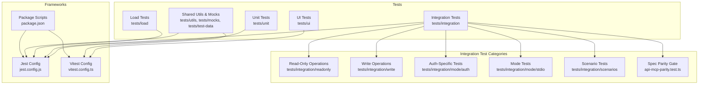
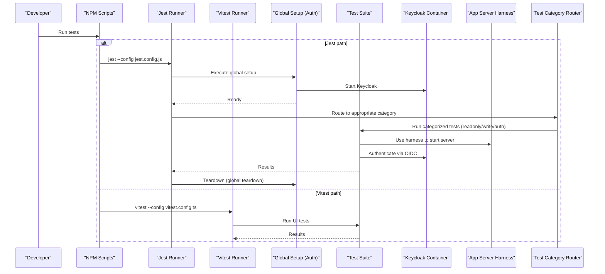
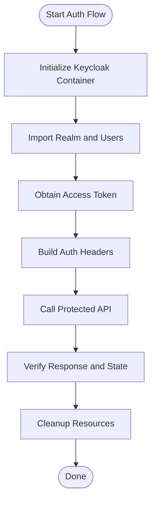
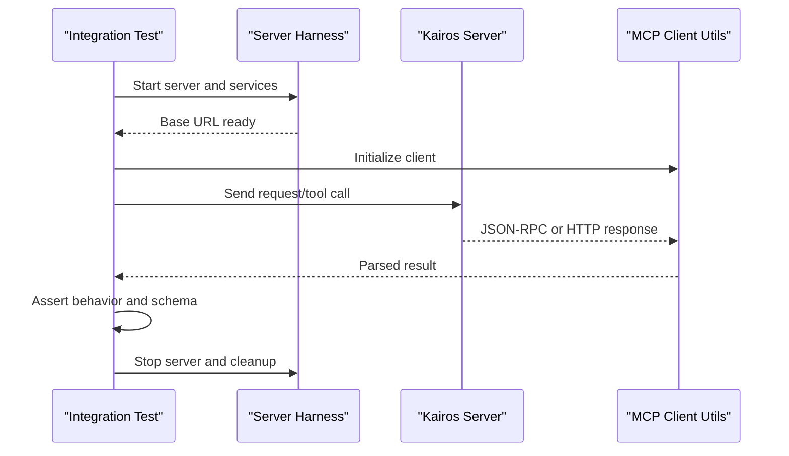
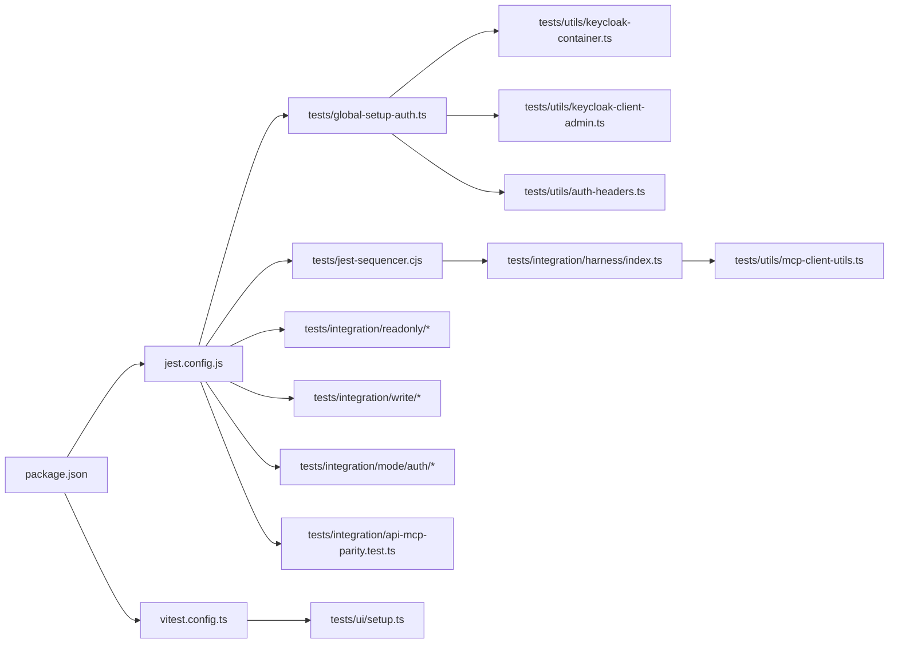

# Testing Strategy and Frameworks

<cite>
**Referenced Files in This Document**
- [jest.config.js](file://jest.config.js)
- [vitest.config.ts](file://vitest.config.ts)
- [package.json](file://package.json)
- [tests/setup.ts](file://tests/setup.ts)
- [tests/global-setup-auth.ts](file://tests/global-setup-auth.ts)
- [tests/global-teardown-auth.ts](file://tests/global-teardown-auth.ts)
- [tests/jest-sequencer.cjs](file://tests/jest-sequencer.cjs)
- [tests/ui/setup.ts](file://tests/ui/setup.ts)
- [tests/integration/harness/index.ts](file://tests/integration/harness/index.ts)
- [tests/utils/keycloak-container.ts](file://tests/utils/keycloak-container.ts)
- [tests/utils/keycloak-client-admin.ts](file://tests/utils/keycloak-client-admin.ts)
- [tests/utils/auth-headers.ts](file://tests/utils/auth-headers.ts)
- [tests/utils/mcp-client-utils.ts](file://tests/utils/mcp-client-utils.ts)
- [tests/unit/oauth-refresh.test.ts](file://tests/unit/oauth-refresh.test.ts)
- [tests/integration/readonly/http-api-activate.test.ts](file://tests/integration/readonly/http-api-activate.test.ts)
- [tests/integration/write/http-api-train-json.test.ts](file://tests/integration/write/http-api-train-json.test.ts)
- [tests/integration/mode/auth/http-auth.test.ts](file://tests/integration/mode/auth/http-auth.test.ts)
- [tests/integration/api-mcp-parity.test.ts](file://tests/integration/api-mcp-parity.test.ts)
- [tests/integration/http-api-test-helpers.ts](file://tests/integration/http-api-test-helpers.ts)
- [tests/integration/v4-kairos-activate.test.ts](file://tests/integration/v4-kairos-activate.test.ts)
</cite>

## Update Summary
**Changes Made**
- Removed references to deprecated test snapshot documentation files (test-snapshot-caching.md, test-snapshot-final-summary.md, test-snapshot-quick-start.md, test-snapshot-seeding.md)
- Updated testing strategy documentation to reflect current implementation approaches
- Streamlined content to focus on active testing practices and frameworks
- Enhanced clarity around dual framework approach using Jest and Vitest

## Table of Contents
1. [Introduction](#introduction)
2. [Project Structure](#project-structure)
3. [Core Components](#core-components)
4. [Architecture Overview](#architecture-overview)
5. [Detailed Component Analysis](#detailed-component-analysis)
6. [Dependency Analysis](#dependency-analysis)
7. [Performance Considerations](#performance-considerations)
8. [Troubleshooting Guide](#troubleshooting-guide)
9. [Conclusion](#conclusion)

## Introduction
This document explains the testing strategy and framework setup for Kairos MCP. It covers the dual testing approach using Jest for unit tests and Vitest for modern TypeScript and UI tests, including configuration, environment setup, global fixtures, authentication testing with Keycloak integration, test data management, database seeding, service mocking patterns, and guidelines for organizing and naming tests. The testing infrastructure emphasizes clear separation of concerns and efficient execution through logical test categorization.

## Project Structure
The repository organizes tests under a dedicated tests directory with clear categorization:
- Unit tests: Pure logic and utility functions without external dependencies
- Integration tests: End-to-end flows against real or containerized services (Keycloak, Redis, Qdrant), organized into logical categories
  - **readonly/**: Read-only operations and queries
  - **write/**: Mutation operations and state changes
  - **mode/auth/**: Authentication-specific tests
  - **mode/stdio/**: Standard I/O mode tests
  - **scenarios/**: Cross-cutting scenario tests
- UI tests: React components and hooks using Vitest + DOM testing utilities
- Load tests: Concurrency and performance scenarios
- Shared utilities and mocks: Reusable helpers for auth, MCP clients, fixtures, and infrastructure

**Diagram sources**
- [jest.config.js](file://jest.config.js)
- [vitest.config.ts](file://vitest.config.ts)
- [package.json](file://package.json)
- [tests/integration/readonly/http-api-activate.test.ts](file://tests/integration/readonly/http-api-activate.test.ts)
- [tests/integration/write/http-api-train-json.test.ts](file://tests/integration/write/http-api-train-json.test.ts)
- [tests/integration/mode/auth/http-auth.test.ts](file://tests/integration/mode/auth/http-auth.test.ts)
- [tests/integration/api-mcp-parity.test.ts](file://tests/integration/api-mcp-parity.test.ts)

**Section sources**
- [jest.config.js](file://jest.config.js)
- [vitest.config.ts](file://vitest.config.ts)
- [package.json](file://package.json)

## Core Components
- Dual frameworks:
  - Jest for unit and integration tests
  - Vitest for TypeScript-first and UI tests
- Global lifecycle:
  - Global setup/teardown for shared state and external services
  - Per-suite setup files for environment initialization
- Authentication:
  - Keycloak container orchestration and admin client utilities
  - Auth header helpers for authenticated requests
- Test harness:
  - Integration harness to bootstrap server and services
  - MCP client utilities for tool invocation and assertions
- Data and fixtures:
  - Centralized test data and artifact fixtures
  - Seeding scripts and utilities
- Logical test categorization for improved organization and execution efficiency

**Section sources**
- [tests/setup.ts](file://tests/setup.ts)
- [tests/global-setup-auth.ts](file://tests/global-setup-auth.ts)
- [tests/global-teardown-auth.ts](file://tests/global-teardown-auth.ts)
- [tests/ui/setup.ts](file://tests/ui/setup.ts)
- [tests/integration/harness/index.ts](file://tests/integration/harness/index.ts)
- [tests/utils/keycloak-container.ts](file://tests/utils/keycloak-container.ts)
- [tests/utils/keycloak-client-admin.ts](file://tests/utils/keycloak-client-admin.ts)
- [tests/utils/auth-headers.ts](file://tests/utils/auth-headers.ts)
- [tests/utils/mcp-client-utils.ts](file://tests/utils/mcp-client-utils.ts)

## Architecture Overview
The testing architecture separates concerns by framework and scope, with enhanced organization through logical test categorization:
- Jest runs unit and integration suites with global auth lifecycle and sequencer control
- Vitest runs UI tests with its own setup and DOM environment
- Shared utilities provide consistent auth, MCP client behavior, and fixture management
- Integration tests are partitioned into logical categories for better maintainability and faster parallel execution

**Diagram sources**
- [jest.config.js](file://jest.config.js)
- [vitest.config.ts](file://vitest.config.ts)
- [tests/global-setup-auth.ts](file://tests/global-setup-auth.ts)
- [tests/global-teardown-auth.ts](file://tests/global-teardown-auth.ts)
- [tests/integration/harness/index.ts](file://tests/integration/harness/index.ts)
- [tests/utils/keycloak-container.ts](file://tests/utils/keycloak-container.ts)

## Detailed Component Analysis

### Jest Configuration and Environment
- Purpose: Configure Jest for unit and integration tests, including module resolution, coverage, and custom reporters
- Key aspects:
  - Module name mapping and resolver settings
  - Test environment selection and setup files
  - Custom sequencer for deterministic ordering when needed
  - Coverage thresholds and reporting
  - Enhanced support for categorized test execution

**Section sources**
- [jest.config.js](file://jest.config.js)
- [tests/jest-sequencer.cjs](file://tests/jest-sequencer.cjs)

### Vitest Configuration and UI Environment
- Purpose: Configure Vitest for TypeScript-first testing and UI component tests
- Key aspects:
  - Environment setup for DOM testing
  - Alias resolution and preprocessor options
  - Test file pattern matching for UI suite
  - Integration with existing TS config

**Section sources**
- [vitest.config.ts](file://vitest.config.ts)
- [tests/ui/setup.ts](file://tests/ui/setup.ts)

### Global Lifecycle and Shared Fixtures
- Global setup:
  - Starts Keycloak container and prepares realms/users
  - Exposes shared environment variables and endpoints
- Global teardown:
  - Stops containers and cleans up resources
- Per-suite setup:
  - Initializes app-level fixtures and resets state between suites

**Section sources**
- [tests/global-setup-auth.ts](file://tests/global-setup-auth.ts)
- [tests/global-teardown-auth.ts](file://tests/global-teardown-auth.ts)
- [tests/setup.ts](file://tests/setup.ts)

### Authentication Testing Infrastructure (Keycloak)
- Container orchestration:
  - Spin up Keycloak with realm import and user provisioning
- Admin client:
  - Programmatic operations on realms, clients, and users
- Auth headers:
  - Helpers to obtain tokens and build request headers
- Example usage:
  - Unit tests for OAuth refresh flow
  - Integration tests validating OIDC login and protected routes

**Diagram sources**
- [tests/utils/keycloak-container.ts](file://tests/utils/keycloak-container.ts)
- [tests/utils/keycloak-client-admin.ts](file://tests/utils/keycloak-client-admin.ts)
- [tests/utils/auth-headers.ts](file://tests/utils/auth-headers.ts)
- [tests/unit/oauth-refresh.test.ts](file://tests/unit/oauth-refresh.test.ts)
- [tests/integration/mode/auth/http-auth.test.ts](file://tests/integration/mode/auth/http-auth.test.ts)

**Section sources**
- [tests/utils/keycloak-container.ts](file://tests/utils/keycloak-container.ts)
- [tests/utils/keycloak-client-admin.ts](file://tests/utils/keycloak-client-admin.ts)
- [tests/utils/auth-headers.ts](file://tests/utils/auth-headers.ts)
- [tests/unit/oauth-refresh.test.ts](file://tests/unit/oauth-refresh.test.ts)
- [tests/integration/mode/auth/http-auth.test.ts](file://tests/integration/mode/auth/http-auth.test.ts)

### Integration Test Harness and MCP Client Utilities
- Harness:
  - Bootstraps the application server and required services for integration tests
  - Provides stable base URLs and lifecycle hooks
- MCP client utilities:
  - Helpers to invoke tools, parse responses, and assert contracts
- Example usage:
  - HTTP API endpoint validation
  - v4 activation and forward flows

**Diagram sources**
- [tests/integration/harness/index.ts](file://tests/integration/harness/index.ts)
- [tests/utils/mcp-client-utils.ts](file://tests/utils/mcp-client-utils.ts)
- [tests/integration/http-api-test-helpers.ts](file://tests/integration/http-api-test-helpers.ts)
- [tests/integration/v4-kairos-activate.test.ts](file://tests/integration/v4-kairos-activate.test.ts)

**Section sources**
- [tests/integration/harness/index.ts](file://tests/integration/harness/index.ts)
- [tests/utils/mcp-client-utils.ts](file://tests/utils/mcp-client-utils.ts)
- [tests/integration/http-api-test-helpers.ts](file://tests/integration/http-api-test-helpers.ts)
- [tests/integration/v4-kairos-activate.test.ts](file://tests/integration/v4-kairos-activate.test.ts)

### Test Data Management, Database Seeding, and Service Mocking
- Test data:
  - Centralized fixtures under tests/test-data for artifacts and sample content
- Seeding:
  - Scripts and utilities to seed databases and caches before running suites
- Service mocking:
  - Replace external dependencies with lightweight stubs or in-memory implementations
  - Use per-test isolation to avoid cross-test pollution

Guidelines:
- Keep fixtures small and focused on the scenario being tested
- Seed only what is necessary for each suite
- Prefer deterministic mocks over network calls for speed and reliability

**Section sources**
- [tests/test-data/AI_CODING_RULES.md](file://tests/test-data/AI_CODING_RULES.md)
- [tests/test-data/cli-minimal-test.md](file://tests/test-data/cli-minimal-test.md)
- [tests/test-data/kairos-search-score-baseline.json](file://tests/test-data/kairos-search-score-baseline.json)

### Guidelines for Organizing Tests, Naming, and Categorization
- Organization:
  - Group by concern: unit, integration, ui, load
  - Integration tests are partitioned into logical categories:
    - **readonly/**: Read-only operations like search, dump, activate, and listing
    - **write/**: Mutation operations like train, update, delete, and reward
    - **mode/auth/**: Authentication-specific tests for different modes
    - **mode/stdio/**: Standard I/O mode specific tests
    - **scenarios/**: Cross-cutting scenario tests that span multiple categories
  - Co-locate related helpers under tests/utils and tests/mocks
- Naming conventions:
  - Use descriptive names that reflect the feature and scenario
  - Append .test.ts or .e2e.test.ts where applicable
- Categorization:
  - Unit: Fast, isolated, no external services
  - Integration: Requires server and external services (Keycloak, Redis, Qdrant)
  - UI: Component and hook tests with DOM environment
  - E2E: Full workflow across boundaries

Best practices:
- Keep tests independent and idempotent
- Use shared setup only for expensive initialization; reset state per suite
- Avoid flakiness by controlling time and randomness deterministically
- Place tests in appropriate categories based on their operation type (read vs write) and authentication requirements

**Section sources**
- [tests/integration/readonly/http-api-activate.test.ts](file://tests/integration/readonly/http-api-activate.test.ts)
- [tests/integration/write/http-api-train-json.test.ts](file://tests/integration/write/http-api-train-json.test.ts)
- [tests/integration/mode/auth/http-auth.test.ts](file://tests/integration/mode/auth/http-auth.test.ts)

### Static Spec-Parity Gate for Fast-Failure Detection
- A dedicated test file (`api-mcp-parity.test.ts`) serves as a static spec-parity gate
- Purpose:
  - Ensures API and MCP contract consistency
  - Provides fast-failure detection for breaking changes
  - Validates backward compatibility across interfaces
- Benefits:
  - Catches specification drift early in development
  - Reduces false positives in other test suites
  - Maintains contract integrity across the codebase

**Section sources**
- [tests/integration/api-mcp-parity.test.ts](file://tests/integration/api-mcp-parity.test.ts)

### Common Testing Patterns
- Unit tests:
  - Validate pure functions and internal logic with minimal setup
  - Example: OAuth refresh flow edge cases
- Integration tests:
  - Exercise HTTP APIs and MCP tool contracts end-to-end
  - Now organized by operation type (readonly/write) and authentication requirements
  - Example: Activation and forward workflows
- UI tests:
  - Render components and assert interactions and rendered output
- Contract tests:
  - Ensure schema consistency and backward compatibility
  - Includes static spec-parity gate for fast-failure detection

Examples:
- OAuth refresh unit test
- Keycloak integration test
- HTTP API helper usage
- v4 activation integration test
- Categorized integration tests demonstrating the new structure

**Section sources**
- [tests/unit/oauth-refresh.test.ts](file://tests/unit/oauth-refresh.test.ts)
- [tests/integration/mode/auth/http-auth.test.ts](file://tests/integration/mode/auth/http-auth.test.ts)
- [tests/integration/http-api-test-helpers.ts](file://tests/integration/http-api-test-helpers.ts)
- [tests/integration/v4-kairos-activate.test.ts](file://tests/integration/v4-kairos-activate.test.ts)
- [tests/integration/api-mcp-parity.test.ts](file://tests/integration/api-mcp-parity.test.ts)

## Dependency Analysis
The testing stack depends on configuration files and shared utilities:
- Jest and Vitest configurations drive runner behavior
- Package scripts orchestrate execution
- Shared utilities centralize auth, MCP client, and harness logic
- New test categorization structure affects dependency routing

**Diagram sources**
- [package.json](file://package.json)
- [jest.config.js](file://jest.config.js)
- [vitest.config.ts](file://vitest.config.ts)
- [tests/global-setup-auth.ts](file://tests/global-setup-auth.ts)
- [tests/jest-sequencer.cjs](file://tests/jest-sequencer.cjs)
- [tests/ui/setup.ts](file://tests/ui/setup.ts)
- [tests/utils/keycloak-container.ts](file://tests/utils/keycloak-container.ts)
- [tests/utils/keycloak-client-admin.ts](file://tests/utils/keycloak-client-admin.ts)
- [tests/utils/auth-headers.ts](file://tests/utils/auth-headers.ts)
- [tests/integration/harness/index.ts](file://tests/integration/harness/index.ts)
- [tests/utils/mcp-client-utils.ts](file://tests/utils/mcp-client-utils.ts)
- [tests/integration/readonly/http-api-activate.test.ts](file://tests/integration/readonly/http-api-activate.test.ts)
- [tests/integration/write/http-api-train-json.test.ts](file://tests/integration/write/http-api-train-json.test.ts)
- [tests/integration/mode/auth/http-auth.test.ts](file://tests/integration/mode/auth/http-auth.test.ts)
- [tests/integration/api-mcp-parity.test.ts](file://tests/integration/api-mcp-parity.test.ts)

**Section sources**
- [package.json](file://package.json)
- [jest.config.js](file://jest.config.js)
- [vitest.config.ts](file://vitest.config.ts)
- [tests/global-setup-auth.ts](file://tests/global-setup-auth.ts)
- [tests/jest-sequencer.cjs](file://tests/jest-sequencer.cjs)
- [tests/ui/setup.ts](file://tests/ui/setup.ts)
- [tests/utils/keycloak-container.ts](file://tests/utils/keycloak-container.ts)
- [tests/utils/keycloak-client-admin.ts](file://tests/utils/keycloak-client-admin.ts)
- [tests/utils/auth-headers.ts](file://tests/utils/auth-headers.ts)
- [tests/integration/harness/index.ts](file://tests/integration/harness/index.ts)
- [tests/utils/mcp-client-utils.ts](file://tests/utils/mcp-client-utils.ts)

## Performance Considerations
- Prefer unit tests for fast feedback; reserve integration and UI tests for critical paths
- Use deterministic mocks to avoid network latency and flakiness
- Parallelize independent suites; limit concurrency for resource-heavy tests
- Cache snapshots and fixtures locally; invalidate selectively
- Profile slow tests and refactor into smaller, focused suites
- Leverage the new test categorization to run read-only tests in parallel with write tests for improved performance
- Utilize the static spec-parity gate for fast-failure detection to catch breaking changes early

## Troubleshooting Guide
Common issues and resolutions:
- Keycloak not reachable:
  - Ensure global setup started the container successfully
  - Verify realm import completed and credentials are correct
- Flaky integration tests:
  - Add explicit waits for service readiness
  - Isolate state changes per suite and reset after each run
  - Check if tests are in the correct category (readonly vs write) to avoid state conflicts
- UI test failures due to environment:
  - Confirm Vitest DOM setup is loaded and polyfills are present
- Slow test runs:
  - Reduce scope of seeded data
  - Use targeted test filters to run specific suites
  - Run only relevant test categories instead of the entire suite
- Spec parity failures:
  - Check api-mcp-parity.test.ts for contract violations
  - Ensure API and MCP interfaces remain synchronized

**Section sources**
- [tests/global-setup-auth.ts](file://tests/global-setup-auth.ts)
- [tests/global-teardown-auth.ts](file://tests/global-teardown-auth.ts)
- [tests/ui/setup.ts](file://tests/ui/setup.ts)
- [tests/integration/api-mcp-parity.test.ts](file://tests/integration/api-mcp-parity.test.ts)

## Conclusion
Kairos MCP employs a robust dual-framework testing strategy: Jest for unit and integration tests and Vitest for modern TypeScript and UI tests. The architecture emphasizes clear separation of concerns, reusable authentication and MCP utilities, and disciplined organization. The reorganization of integration tests into logical categories (readonly/, write/, mode/auth/) enhances maintainability and execution efficiency. By following the provided guidelines and leveraging shared fixtures and harnesses, teams can maintain fast, reliable, and comprehensive test coverage across all layers of the system. The addition of the static spec-parity gate ensures contract consistency and enables fast-failure detection for breaking changes. The streamlined documentation now focuses on current implementation approaches, removing references to deprecated snapshot testing documentation while maintaining comprehensive coverage of the active testing infrastructure.