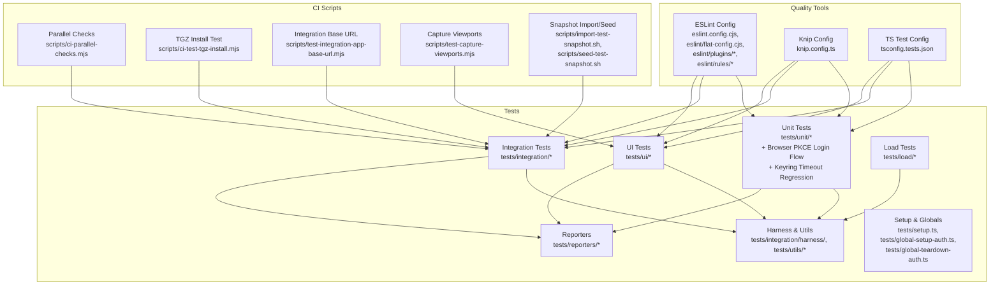
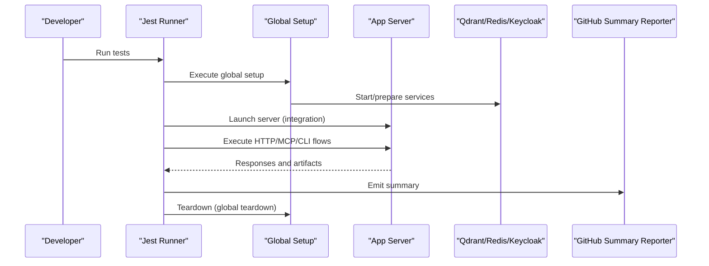
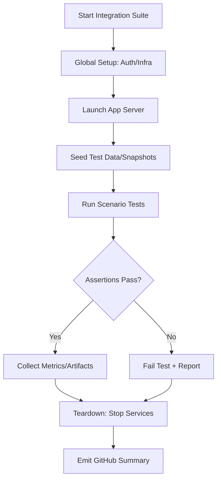
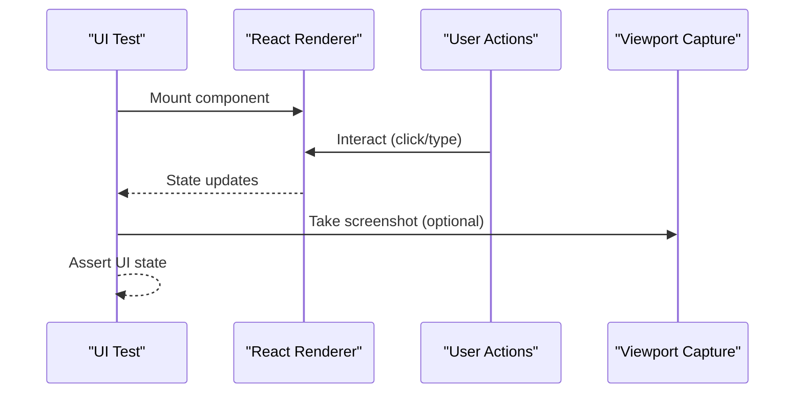
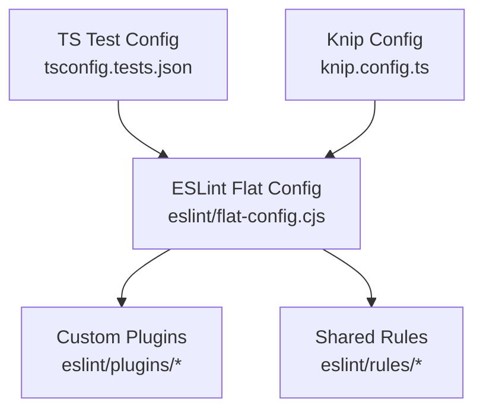
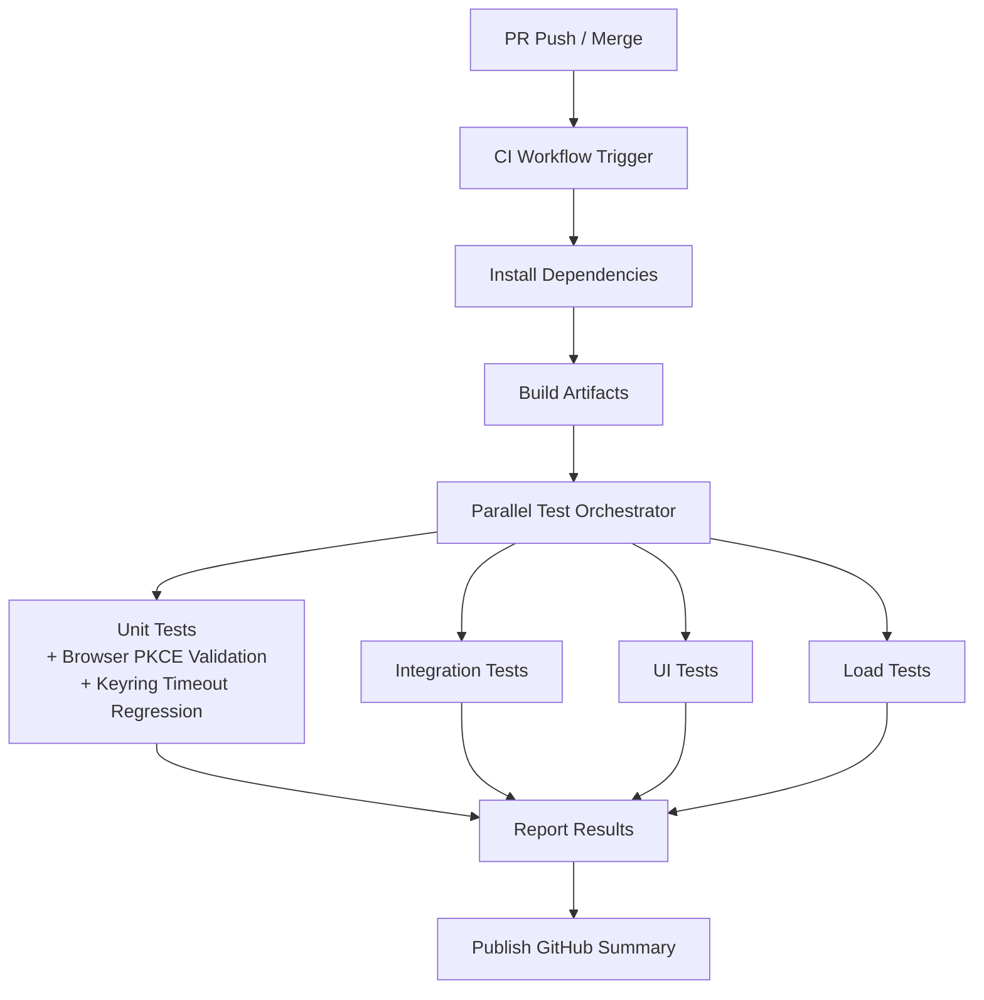
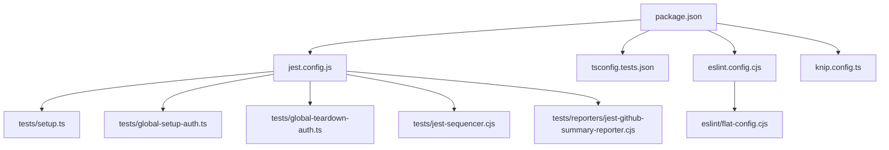

# Testing and Quality Assurance

<cite>
**Referenced Files in This Document**
- [jest.config.js](file://jest.config.js)
- [tsconfig.tests.json](file://tsconfig.tests.json)
- [eslint.config.cjs](file://eslint.config.cjs)
- [knip.config.ts](file://knip.config.ts)
- [package.json](file://package.json)
- [.github/workflows/ci.yml](file://.github/workflows/ci.yml)
- [tests/setup.ts](file://tests/setup.ts)
- [tests/global-setup-auth.ts](file://tests/global-setup-auth.ts)
- [tests/global-teardown-auth.ts](file://tests/global-teardown-auth.ts)
- [tests/jest-sequencer.cjs](file://tests/jest-sequencer.cjs)
- [tests/reporters/jest-github-summary-reporter.cjs](file://tests/reporters/jest-github-summary-reporter.cjs)
- [tests/integration/harness/](file://tests/integration/harness/)
- [tests/unit/](file://tests/unit/)
- [tests/integration/](file://tests/integration/)
- [tests/ui/](file://tests/ui/)
- [tests/load/mcp-concurrency-limit.test.ts](file://tests/load/mcp-concurrency-limit.test.ts)
- [scripts/ci-parallel-checks.mjs](file://scripts/ci-parallel-checks.mjs)
- [scripts/ci-test-tgz-install.mjs](file://scripts/ci-test-tgz-install.mjs)
- [scripts/test-integration-app-base-url.mjs](file://scripts/test-integration-app-base-url.mjs)
- [scripts/test-capture-viewports.mjs](file://scripts/test-capture-viewports.mjs)
- [scripts/import-test-snapshot.sh](file://scripts/import-test-snapshot.sh)
- [scripts/seed-test-snapshot.sh](file://scripts/seed-test-snapshot.sh)
- [eslint/flat-config.cjs](file://eslint/flat-config.cjs)
- [eslint/plugins/kairos-codeql-line-comments.cjs](file://eslint/plugins/kairos-codeql-line-comments.cjs)
- [eslint/plugins/kairos-forbidden-text.cjs](file://eslint/plugins/kairos-forbidden-text.cjs)
- [eslint/plugins/kairos-mcp-widget.cjs](file://eslint/plugins/kairos-mcp-widget.cjs)
- [eslint/rules/shared-snippets.cjs](file://eslint/rules/shared-snippets.cjs)
</cite>

## Update Summary
**Changes Made**
- Updated Unit Testing Strategy section to reflect comprehensive browser PKCE login flow validation (217 lines)
- Added keyring timeout regression testing coverage (38 lines) for CLI stability improvements
- Enhanced test infrastructure documentation with new authentication and security testing patterns
- Updated unit testing guidelines to include browser-based authentication flows and timeout handling

## Table of Contents
1. [Introduction](#introduction)
2. [Project Structure](#project-structure)
3. [Core Components](#core-components)
4. [Architecture Overview](#architecture-overview)
5. [Detailed Component Analysis](#detailed-component-analysis)
6. [Dependency Analysis](#dependency-analysis)
7. [Performance Considerations](#performance-considerations)
8. [Troubleshooting Guide](#troubleshooting-guide)
9. [Conclusion](#conclusion)
10. [Appendices](#appendices)

## Introduction
This document describes the testing and quality assurance strategy for Kairos MCP. It covers unit, integration, UI, and end-to-end tests; test infrastructure setup; mocking strategies; test data management; code quality tools (ESLint, TypeScript strict mode, static analysis); continuous integration configuration; automated workflows; guidelines for writing effective tests; performance and security testing approaches; and code review processes with quality gates.

**Updated** Enhanced focus on browser-based authentication testing and CLI stability regression testing to ensure robust security and reliability.

## Project Structure
The repository organizes tests under a dedicated directory with clear separation by scope:
- Unit tests validate isolated logic and utilities, including comprehensive browser PKCE login flow validation and keyring timeout regression testing.
- Integration tests exercise HTTP APIs, MCP tooling, CLI commands, and external services via containers or local infra.
- UI tests cover React components and hooks using a browser-like environment.
- Load tests target concurrency and throughput characteristics.
- Shared harnesses, reporters, and utilities support consistent test execution across suites.

**Diagram sources**
- [jest.config.js](file://jest.config.js)
- [tsconfig.tests.json](file://tsconfig.tests.json)
- [eslint.config.cjs](file://eslint.config.cjs)
- [knip.config.ts](file://knip.config.ts)
- [tests/setup.ts](file://tests/setup.ts)
- [tests/global-setup-auth.ts](file://tests/global-setup-auth.ts)
- [tests/global-teardown-auth.ts](file://tests/global-teardown-auth.ts)
- [tests/jest-sequencer.cjs](file://tests/jest-sequencer.cjs)
- [tests/reporters/jest-github-summary-reporter.cjs](file://tests/reporters/jest-github-summary-reporter.cjs)
- [tests/integration/harness/](file://tests/integration/harness/)
- [tests/unit/](file://tests/unit/)
- [tests/integration/](file://tests/integration/)
- [tests/ui/](file://tests/ui/)
- [tests/load/mcp-concurrency-limit.test.ts](file://tests/load/mcp-concurrency-limit.test.ts)
- [scripts/ci-parallel-checks.mjs](file://scripts/ci-parallel-checks.mjs)
- [scripts/ci-test-tgz-install.mjs](file://scripts/ci-test-tgz-install.mjs)
- [scripts/test-integration-app-base-url.mjs](file://scripts/test-integration-app-base-url.mjs)
- [scripts/test-capture-viewports.mjs](file://scripts/test-capture-viewports.mjs)
- [scripts/import-test-snapshot.sh](file://scripts/import-test-snapshot.sh)
- [scripts/seed-test-snapshot.sh](file://scripts/seed-test-snapshot.sh)

**Section sources**
- [jest.config.js](file://jest.config.js)
- [tsconfig.tests.json](file://tsconfig.tests.json)
- [eslint.config.cjs](file://eslint.config.cjs)
- [knip.config.ts](file://knip.config.ts)
- [package.json](file://package.json)

## Core Components
- Jest configuration centralizes test discovery, environment setup, coverage thresholds, and reporter registration.
- TypeScript test configuration isolates compilation settings for tests, enabling stricter checks and targeted module resolution.
- ESLint flat config integrates custom plugins and rules to enforce project standards, including MCP-specific checks and forbidden text detection.
- Knip identifies unused dependencies, exports, and files to keep the codebase lean.
- Global setup/teardown scripts manage shared state such as authentication fixtures and Keycloak lifecycle.
- Custom sequencer and GitHub summary reporter improve CI feedback and parallelization control.

**Section sources**
- [jest.config.js](file://jest.config.js)
- [tsconfig.tests.json](file://tsconfig.tests.json)
- [eslint.config.cjs](file://eslint.config.cjs)
- [knip.config.ts](file://knip.config.ts)
- [tests/setup.ts](file://tests/setup.ts)
- [tests/global-setup-auth.ts](file://tests/global-setup-auth.ts)
- [tests/global-teardown-auth.ts](file://tests/global-teardown-auth.ts)
- [tests/jest-sequencer.cjs](file://tests/jest-sequencer.cjs)
- [tests/reporters/jest-github-summary-reporter.cjs](file://tests/reporters/jest-github-summary-reporter.cjs)

## Architecture Overview
The testing architecture is layered:
- Unit layer validates pure functions, schemas, and internal modules without external dependencies, now including comprehensive browser PKCE login flow validation and keyring timeout regression testing.
- Integration layer boots the application server, connects to Qdrant/Redis/Keycloak, and exercises HTTP/MCP/CLI endpoints.
- UI layer renders React components/hooks in a JSDOM/Puppeteer-like environment.
- Load layer measures concurrency limits and throughput.
- CI orchestrates these layers with parallelization, snapshot seeding, and reporting.

**Diagram sources**
- [jest.config.js](file://jest.config.js)
- [tests/global-setup-auth.ts](file://tests/global-setup-auth.ts)
- [tests/global-teardown-auth.ts](file://tests/global-teardown-auth.ts)
- [tests/reporters/jest-github-summary-reporter.cjs](file://tests/reporters/jest-github-summary-reporter.cjs)

## Detailed Component Analysis

### Unit Testing Strategy
- Scope: Pure logic, schema validation, adapters, utility functions, browser PKCE login flow validation, and keyring timeout regression testing.
- Execution: Fast, deterministic, no external services.
- Patterns:
  - Input/output assertions on functions and parsers.
  - Schema consistency checks against JSONSchema definitions.
  - Deterministic time and randomness stubbing where needed.
  - **New**: Comprehensive browser PKCE login flow validation ensuring secure authentication workflows.
  - **New**: Keyring timeout regression testing validating CLI stability improvements.
- Organization: One file per feature/module under tests/unit.

**Updated** Enhanced with comprehensive browser-based authentication testing and CLI stability regression testing to ensure robust security and reliability.

Guidelines:
- Keep tests small and focused on a single behavior.
- Prefer explicit inputs and expected outputs over snapshots when possible.
- Use helpers from tests/utils for common operations like zip parsing or fixture generation.
- **New**: Include browser PKCE flow validation for authentication-related functionality.
- **New**: Add timeout regression tests for critical CLI operations to prevent stability regressions.

**Section sources**
- [tests/unit/](file://tests/unit/)
- [tests/utils/zip-parser.ts](file://tests/utils/zip-parser.ts)
- [tests/utils/skill-bundle-sha-assert.ts](file://tests/utils/skill-bundle-sha-assert.ts)
- [tests/utils/mime-artifact-fixture-contract.ts](file://tests/utils/mime-artifact-fixture-contract.ts)

### Integration Testing Strategy
- Scope: End-to-end flows through HTTP API, MCP tools, CLI commands, and storage backends.
- Execution: Boots the app server, initializes memory/Qdrant, seeds data, and runs scenario-based tests.
- Infrastructure:
  - Harness provides reusable client factories, auth headers, and service lifecycles.
  - Sequencer controls ordering for dependent scenarios.
  - Snapshot import/seed scripts prepare stable datasets.
- Reporting: GitHub summary reporter aggregates results for PRs.

**Diagram sources**
- [tests/integration/harness/](file://tests/integration/harness/)
- [tests/jest-sequencer.cjs](file://tests/jest-sequencer.cjs)
- [scripts/import-test-snapshot.sh](file://scripts/import-test-snapshot.sh)
- [scripts/seed-test-snapshot.sh](file://scripts/seed-test-snapshot.sh)
- [tests/reporters/jest-github-summary-reporter.cjs](file://tests/reporters/jest-github-summary-reporter.cjs)

**Section sources**
- [tests/integration/](file://tests/integration/)
- [tests/integration/harness/](file://tests/integration/harness/)
- [tests/jest-sequencer.cjs](file://tests/jest-sequencer.cjs)
- [scripts/import-test-snapshot.sh](file://scripts/import-test-snapshot.sh)
- [scripts/seed-test-snapshot.sh](file://scripts/seed-test-snapshot.sh)
- [tests/reporters/jest-github-summary-reporter.cjs](file://tests/reporters/jest-github-summary-reporter.cjs)

### UI Testing Strategy
- Scope: React components, hooks, and page-level interactions.
- Execution: Uses a DOM/JSDOM environment with optional Puppeteer for viewport capture.
- Utilities:
  - Helpers for rendering components and simulating user actions.
  - Viewport capture script supports visual regression aids.

**Diagram sources**
- [tests/ui/](file://tests/ui/)
- [scripts/test-capture-viewports.mjs](file://scripts/test-capture-viewports.mjs)

**Section sources**
- [tests/ui/](file://tests/ui/)
- [scripts/test-capture-viewports.mjs](file://scripts/test-capture-viewports.mjs)

### Load Testing Approach
- Scope: Concurrency limits and throughput for MCP endpoints.
- Execution: Dedicated load test suite targets resource contention and rate limiting behaviors.
- Metrics: Observability endpoints are scraped to validate capacity and stability.

**Section sources**
- [tests/load/mcp-concurrency-limit.test.ts](file://tests/load/mcp-concurrency-limit.test.ts)

### Mocking Strategies
- External services:
  - Keycloak lifecycle managed via global setup/teardown and admin utilities.
  - Redis and Qdrant connections abstracted behind test-friendly clients or in-process mocks where feasible.
- UUID and random values:
  - Centralized stubs ensure deterministic IDs and hashes.
- Network and filesystem:
  - Local artifact directories and temporary paths used to avoid side effects.
- **New**: Browser PKCE flow mocking for authentication testing scenarios.

**Updated** Enhanced with browser PKCE flow mocking capabilities to support comprehensive authentication testing.

**Section sources**
- [tests/global-setup-auth.ts](file://tests/global-setup-auth.ts)
- [tests/global-teardown-auth.ts](file://tests/global-teardown-auth.ts)
- [tests/mocks/uuid-stub.cjs](file://tests/mocks/uuid-stub.cjs)
- [tests/utils/keycloak-client-admin.ts](file://tests/utils/keycloak-client-admin.ts)
- [tests/utils/keycloak-container.ts](file://tests/utils/keycloak-container.ts)

### Test Data Management
- Snapshots:
  - Import and seed scripts provide stable baseline datasets for search and export tests.
- Fixtures:
  - MIME artifact samples and training documents live under tests/test-data.
- Cleanup:
  - Utility functions remove temporary artifacts between runs.

**Section sources**
- [scripts/import-test-snapshot.sh](file://scripts/import-test-snapshot.sh)
- [scripts/seed-test-snapshot.sh](file://scripts/seed-test-snapshot.sh)
- [tests/test-data/](file://tests/test-data/)
- [tests/utils/artifact-fixture-cleanup.ts](file://tests/utils/artifact-fixture-cleanup.ts)

### Code Quality Tools
- ESLint:
  - Flat config centralizes rules and plugins.
  - Custom plugins enforce MCP widget patterns, forbidden text, and CodeQL line comments.
  - Shared snippets standardize rule reuse.
- TypeScript:
  - Strict mode enabled via tsconfig for type safety.
  - Separate tsconfig.tests.json isolates test compilation settings.
- Static Analysis:
  - Knip detects unused exports, dependencies, and dead code.

**Diagram sources**
- [eslint/flat-config.cjs](file://eslint/flat-config.cjs)
- [eslint/plugins/kairos-codeql-line-comments.cjs](file://eslint/plugins/kairos-codeql-line-comments.cjs)
- [eslint/plugins/kairos-forbidden-text.cjs](file://eslint/plugins/kairos-forbidden-text.cjs)
- [eslint/plugins/kairos-mcp-widget.cjs](file://eslint/plugins/kairos-mcp-widget.cjs)
- [eslint/rules/shared-snippets.cjs](file://eslint/rules/shared-snippets.cjs)
- [tsconfig.tests.json](file://tsconfig.tests.json)
- [knip.config.ts](file://knip.config.ts)

**Section sources**
- [eslint.config.cjs](file://eslint.config.cjs)
- [eslint/flat-config.cjs](file://eslint/flat-config.cjs)
- [eslint/plugins/kairos-codeql-line-comments.cjs](file://eslint/plugins/kairos-codeql-line-comments.cjs)
- [eslint/plugins/kairos-forbidden-text.cjs](file://eslint/plugins/kairos-forbidden-text.cjs)
- [eslint/plugins/kairos-mcp-widget.cjs](file://eslint/plugins/kairos-mcp-widget.cjs)
- [eslint/rules/shared-snippets.cjs](file://eslint/rules/shared-snippets.cjs)
- [tsconfig.tests.json](file://tsconfig.tests.json)
- [knip.config.ts](file://knip.config.ts)

### Continuous Integration Pipeline
- Parallelization:
  - Script orchestrates parallel test execution across suites to reduce CI duration.
- Artifact and install verification:
  - TGZ install test ensures packaging integrity.
- Environment preparation:
  - Integration base URL script configures runtime URLs for tests.
- Visual aids:
  - Viewport capture script assists UI regression debugging.
- Reporting:
  - GitHub summary reporter posts concise results to PRs.

**Diagram sources**
- [.github/workflows/ci.yml](file://.github/workflows/ci.yml)
- [scripts/ci-parallel-checks.mjs](file://scripts/ci-parallel-checks.mjs)
- [scripts/ci-test-tgz-install.mjs](file://scripts/ci-test-tgz-install.mjs)
- [scripts/test-integration-app-base-url.mjs](file://scripts/test-integration-app-base-url.mjs)
- [scripts/test-capture-viewports.mjs](file://scripts/test-capture-viewports.mjs)
- [tests/reporters/jest-github-summary-reporter.cjs](file://tests/reporters/jest-github-summary-reporter.cjs)

**Section sources**
- [.github/workflows/ci.yml](file://.github/workflows/ci.yml)
- [scripts/ci-parallel-checks.mjs](file://scripts/ci-parallel-checks.mjs)
- [scripts/ci-test-tgz-install.mjs](file://scripts/ci-test-tgz-install.mjs)
- [scripts/test-integration-app-base-url.mjs](file://scripts/test-integration-app-base-url.mjs)
- [scripts/test-capture-viewports.mjs](file://scripts/test-capture-viewports.mjs)
- [tests/reporters/jest-github-summary-reporter.cjs](file://tests/reporters/jest-github-summary-reporter.cjs)

### Guidelines for Writing Effective Tests
- Unit tests:
  - Focus on one assertion per test case.
  - Avoid flakiness by controlling time and randomness.
  - Prefer explicit expectations over large snapshots.
  - **New**: Include comprehensive browser PKCE login flow validation for authentication features.
  - **New**: Add keyring timeout regression tests to ensure CLI stability improvements remain effective.
- Integration tests:
  - Use harness utilities for consistent client creation and auth.
  - Seed deterministic data via snapshot scripts.
  - Order dependent scenarios with the sequencer.
- UI tests:
  - Keep interactions minimal and meaningful.
  - Use viewport captures sparingly to aid debugging.
- Performance tests:
  - Validate concurrency limits and error propagation under load.
  - Correlate metrics with observed behavior.

**Updated** Enhanced guidelines to include browser PKCE flow validation and keyring timeout regression testing requirements.

### Security Testing Procedures
- Authentication flows:
  - Keycloak integration tests verify OIDC redirects, token handling, and group-based authorization.
  - **New**: Comprehensive browser PKCE login flow validation ensures secure authentication workflows.
- Authorization boundaries:
  - Access control tests ensure protected spaces and resources are enforced.
- Input validation:
  - Adversarial input tests probe sanitization and schema validation.
- Supply chain:
  - Dependabot and Renovate configurations maintain dependency hygiene.

**Updated** Enhanced with comprehensive browser PKCE login flow validation to ensure robust authentication security testing.

**Section sources**
- [tests/integration/auth-keycloak.test.ts](file://tests/integration/auth-keycloak.test.ts)
- [tests/integration/adversarial-inputs.test.ts](file://tests/integration/adversarial-inputs.test.ts)
- [renovate.json](file://renovate.json)
- [.github/dependabot.yml](file://.github/dependabot.yml)

## Dependency Analysis
Testing dependencies include Jest, TypeScript compiler options for tests, ESLint with custom plugins, Knip for static analysis, and CI orchestration scripts. The following diagram highlights key relationships among configuration and test assets.

**Diagram sources**
- [package.json](file://package.json)
- [jest.config.js](file://jest.config.js)
- [tsconfig.tests.json](file://tsconfig.tests.json)
- [eslint.config.cjs](file://eslint.config.cjs)
- [eslint/flat-config.cjs](file://eslint/flat-config.cjs)
- [knip.config.ts](file://knip.config.ts)
- [tests/setup.ts](file://tests/setup.ts)
- [tests/global-setup-auth.ts](file://tests/global-setup-auth.ts)
- [tests/global-teardown-auth.ts](file://tests/global-teardown-auth.ts)
- [tests/jest-sequencer.cjs](file://tests/jest-sequencer.cjs)
- [tests/reporters/jest-github-summary-reporter.cjs](file://tests/reporters/jest-github-summary-reporter.cjs)

**Section sources**
- [package.json](file://package.json)
- [jest.config.js](file://jest.config.js)
- [tsconfig.tests.json](file://tsconfig.tests.json)
- [eslint.config.cjs](file://eslint.config.cjs)
- [knip.config.ts](file://knip.config.ts)

## Performance Considerations
- Parallel execution:
  - Use the orchestrator script to run suites concurrently while respecting resource constraints.
- Snapshot caching:
  - Leverage snapshot import/seed scripts to minimize cold-start overhead.
- Resource isolation:
  - Ensure each integration test uses independent namespaces or keys to avoid cross-test interference.
- Metrics correlation:
  - Scrape Prometheus endpoints during load tests to identify bottlenecks.
- **New**: Browser PKCE flow tests should be optimized for performance while maintaining comprehensive coverage.

**Updated** Added consideration for optimizing browser PKCE flow tests for performance.

## Troubleshooting Guide
- Flaky integration tests:
  - Verify global setup/teardown order and service readiness.
  - Check sequencer ordering for dependent scenarios.
- UI test failures:
  - Use viewport captures to inspect rendered states.
  - Confirm base URL configuration for the running app.
- Slow CI:
  - Review parallel orchestrator configuration and split heavy suites.
- Missing artifacts:
  - Re-run snapshot import/seed steps to restore baseline data.
- **New**: Browser PKCE test failures:
  - Verify Keycloak configuration and redirect URIs.
  - Check PKCE parameters and state management.
- **New**: Keyring timeout issues:
  - Validate timeout configurations and retry mechanisms.
  - Check system resource availability during timeout scenarios.

**Updated** Added troubleshooting guidance for browser PKCE tests and keyring timeout issues.

**Section sources**
- [tests/global-setup-auth.ts](file://tests/global-setup-auth.ts)
- [tests/global-teardown-auth.ts](file://tests/global-teardown-auth.ts)
- [tests/jest-sequencer.cjs](file://tests/jest-sequencer.cjs)
- [scripts/test-capture-viewports.mjs](file://scripts/test-capture-viewports.mjs)
- [scripts/test-integration-app-base-url.mjs](file://scripts/test-integration-app-base-url.mjs)
- [scripts/import-test-snapshot.sh](file://scripts/import-test-snapshot.sh)
- [scripts/seed-test-snapshot.sh](file://scripts/seed-test-snapshot.sh)

## Conclusion
Kairos MCP employs a comprehensive testing strategy spanning unit, integration, UI, and load tests, supported by robust infrastructure, deterministic data management, and strong code quality enforcement. CI pipelines integrate parallel execution, snapshot seeding, and detailed reporting to maintain high reliability and speed. The enhanced unit testing coverage includes comprehensive browser PKCE login flow validation and keyring timeout regression testing, ensuring CLI stability improvements remain effective. Following the provided guidelines and leveraging the shared harnesses will help sustain quality as the system evolves.

**Updated** Enhanced conclusion reflecting the comprehensive browser PKCE login flow validation and keyring timeout regression testing that ensures CLI stability improvements remain effective.

## Appendices

### Appendix A: Running Tests Locally
- Unit tests:
  - Execute the unit suite using the configured runner.
- Integration tests:
  - Ensure required services are available or use provided setup scripts.
- UI tests:
  - Run with the UI configuration; optionally capture viewports for debugging.
- Load tests:
  - Run the dedicated load suite to validate concurrency limits.
- **New**: Browser PKCE tests:
  - Ensure Keycloak is properly configured with correct redirect URIs.
  - Verify PKCE parameters are correctly set up for testing.

**Updated** Added guidance for running browser PKCE tests locally.

**Section sources**
- [jest.config.js](file://jest.config.js)
- [tests/setup.ts](file://tests/setup.ts)
- [scripts/test-integration-app-base-url.mjs](file://scripts/test-integration-app-base-url.mjs)
- [scripts/test-capture-viewports.mjs](file://scripts/test-capture-viewports.mjs)
- [tests/load/mcp-concurrency-limit.test.ts](file://tests/load/mcp-concurrency-limit.test.ts)

### Appendix B: Adding New Tests
- Place unit tests under tests/unit aligned with source modules.
- Add integration scenarios under tests/integration with appropriate naming.
- For UI changes, add component or hook tests under tests/ui.
- Update jest configuration if introducing new environments or reporters.
- Ensure any new dependencies are declared and validated by Knip.
- **New**: For authentication features, include comprehensive browser PKCE login flow validation.
- **New**: For CLI stability improvements, add keyring timeout regression tests to prevent future regressions.

**Updated** Added guidelines for adding browser PKCE login flow validation and keyring timeout regression tests.

**Section sources**
- [tests/unit/](file://tests/unit/)
- [tests/integration/](file://tests/integration/)
- [tests/ui/](file://tests/ui/)
- [jest.config.js](file://jest.config.js)
- [knip.config.ts](file://knip.config.ts)