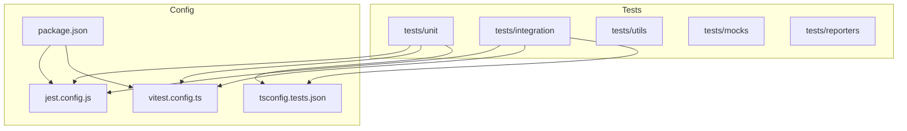
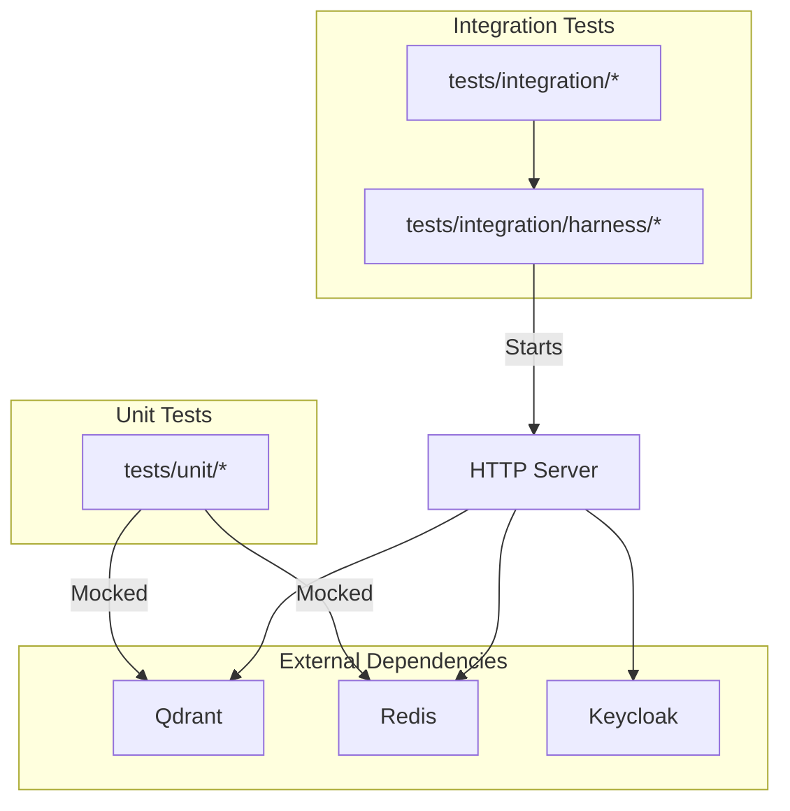
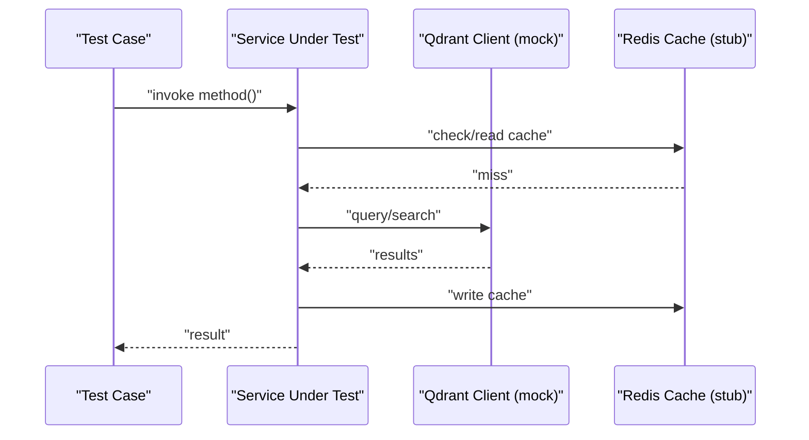
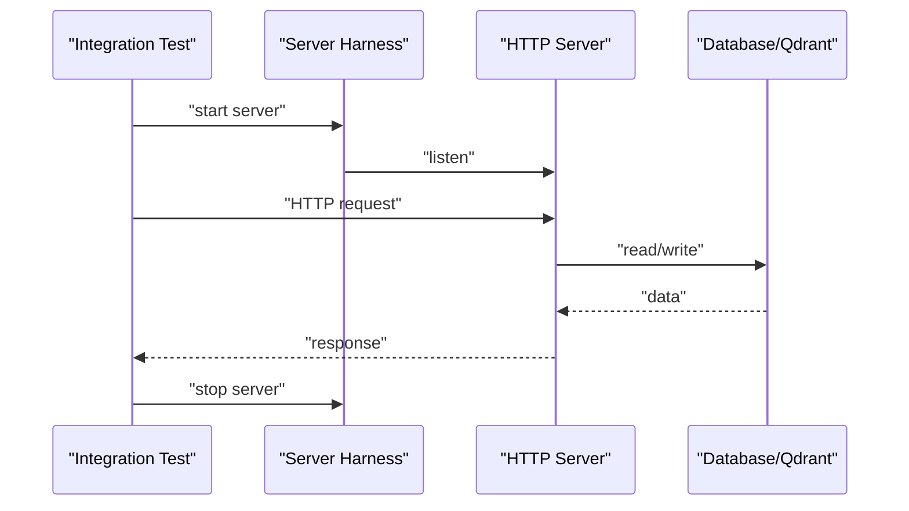
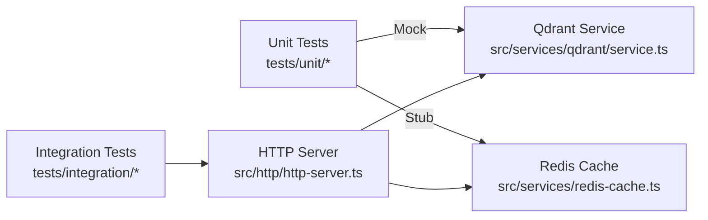

# Unit Testing

<cite>
**Referenced Files in This Document**
- [jest.config.js](file://jest.config.js)
- [vitest.config.ts](file://vitest.config.ts)
- [tsconfig.tests.json](file://tsconfig.tests.json)
- [package.json](file://package.json)
- [tests/setup.ts](file://tests/setup.ts)
- [tests/global-setup-auth.ts](file://tests/global-setup-auth.ts)
- [tests/global-teardown-auth.ts](file://tests/global-teardown-auth.ts)
- [tests/jest-sequencer.cjs](file://tests/jest-sequencer.cjs)
- [tests/reporters/jest-github-summary-reporter.cjs](file://tests/reporters/jest-github-summary-reporter.cjs)
- [tests/utils/test-timeouts.ts](file://tests/utils/test-timeouts.ts)
- [tests/utils/mcp-client-utils.ts](file://tests/utils/mcp-client-utils.ts)
- [tests/utils/auth-headers.ts](file://tests/utils/auth-headers.ts)
- [tests/utils/keycloak-container.ts](file://tests/utils/keycloak-container.ts)
- [tests/utils/adapter-space-test-helpers.ts](file://tests/utils/adapter-space-test-helpers.ts)
- [tests/unit/memory-store.test.ts](file://tests/unit/memory-store.test.ts)
- [tests/unit/oauth-refresh.test.ts](file://tests/unit/oauth-refresh.test.ts)
- [tests/unit/reward.test.ts](file://tests/unit/reward.test.ts)
- [tests/unit/tune-execute.test.ts](file://tests/unit/tune-execute.test.ts)
- [tests/unit/cli-config-file.test.ts](file://tests/unit/cli-config-file.test.ts)
- [tests/unit/structured-logger.test.ts](file://tests/unit/structured-logger.test.ts)
- [tests/integration/http-api-endpoints.test.ts](file://tests/integration/http-api-endpoints.test.ts)
- [tests/integration/harness/server.ts](file://tests/integration/harness/server.ts)
- [tests/integration/harness/db.ts](file://tests/integration/harness/db.ts)
- [tests/integration/harness/fixtures.ts](file://tests/integration/harness/fixtures.ts)
- [src/services/qdrant/service.ts](file://src/services/qdrant/service.ts)
- [src/services/redis-cache.ts](file://src/services/redis-cache.ts)
- [src/http/http-server.ts](file://src/http/http-server.ts)
</cite>

## Table of Contents
1. [Introduction](#introduction)
2. [Project Structure](#project-structure)
3. [Core Components](#core-components)
4. [Architecture Overview](#architecture-overview)
5. [Detailed Component Analysis](#detailed-component-analysis)
6. [Dependency Analysis](#dependency-analysis)
7. [Performance Considerations](#performance-considerations)
8. [Troubleshooting Guide](#troubleshooting-guide)
9. [Conclusion](#conclusion)
10. [Appendices](#appendices)

## Introduction
This document explains unit testing practices for Kairos MCP, focusing on how to write effective tests for functions, classes, and modules; how to mock external dependencies (databases, HTTP clients, file systems); what testing utilities are available; how to cover business logic, utilities, and internal services; coverage requirements and reporting; asynchronous code and error handling; and guidelines for high-quality tests with strong assertions and descriptive names.

## Project Structure
Kairos MCP uses a layered test layout:
- Unit tests under tests/unit for pure logic and isolated components
- Integration tests under tests/integration that exercise HTTP APIs, MCP flows, and storage backends
- Shared test utilities and mocks under tests/utils and tests/mocks
- Test configuration via Jest and Vitest, plus TypeScript settings for tests

**Diagram sources**
- [jest.config.js](file://jest.config.js)
- [vitest.config.ts](file://vitest.config.ts)
- [tsconfig.tests.json](file://tsconfig.tests.json)
- [package.json](file://package.json)

**Section sources**
- [jest.config.js](file://jest.config.js)
- [vitest.config.ts](file://vitest.config.ts)
- [tsconfig.tests.json](file://tsconfig.tests.json)
- [package.json](file://package.json)

## Core Components
- Test runners and configuration
  - Jest is configured for Node-based tests (unit and integration). See [jest.config.js](file://jest.config.js).
  - Vitest is configured for UI tests. See [vitest.config.ts](file://vitest.config.ts).
  - TypeScript test compilation options are defined in [tsconfig.tests.json](file://tsconfig.tests.json).
- Global setup and teardown
  - Authentication-related global setup/teardown hooks are provided in [tests/global-setup-auth.ts](file://tests/global-setup-auth.ts) and [tests/global-teardown-auth.ts](file://tests/global-teardown-auth.ts).
  - Per-suite setup can be added via [tests/setup.ts](file://tests/setup.ts).
- Reporting
  - A GitHub summary reporter is available at [tests/reporters/jest-github-summary-reporter.cjs](file://tests/reporters/jest-github-summary-reporter.cjs).
- Utilities and helpers
  - Timeouts and timing helpers: [tests/utils/test-timeouts.ts](file://tests/utils/test-timeouts.ts)
  - MCP client utilities: [tests/utils/mcp-client-utils.ts](file://tests/utils/mcp-client-utils.ts)
  - Auth headers builder: [tests/utils/auth-headers.ts](file://tests/utils/auth-headers.ts)
  - Keycloak container helper: [tests/utils/keycloak-container.ts](file://tests/utils/keycloak-container.ts)
  - Adapter/space helpers: [tests/utils/adapter-space-test-helpers.ts](file://tests/utils/adapter-space-test-helpers.ts)

**Section sources**
- [jest.config.js](file://jest.config.js)
- [vitest.config.ts](file://vitest.config.ts)
- [tsconfig.tests.json](file://tsconfig.tests.json)
- [tests/setup.ts](file://tests/setup.ts)
- [tests/global-setup-auth.ts](file://tests/global-setup-auth.ts)
- [tests/global-teardown-auth.ts](file://tests/global-teardown-auth.ts)
- [tests/reporters/jest-github-summary-reporter.cjs](file://tests/reporters/jest-github-summary-reporter.cjs)
- [tests/utils/test-timeouts.ts](file://tests/utils/test-timeouts.ts)
- [tests/utils/mcp-client-utils.ts](file://tests/utils/mcp-client-utils.ts)
- [tests/utils/auth-headers.ts](file://tests/utils/auth-headers.ts)
- [tests/utils/keycloak-container.ts](file://tests/utils/keycloak-container.ts)
- [tests/utils/adapter-space-test-helpers.ts](file://tests/utils/adapter-space-test-helpers.ts)

## Architecture Overview
The testing architecture separates concerns by scope:
- Unit tests validate deterministic logic without real I/O
- Integration tests run the HTTP server and interact with real or containerized backends (e.g., Qdrant, Redis, Keycloak)
- Shared harnesses bootstrap servers, databases, and fixtures for integration suites

[No sources needed since this diagram shows conceptual workflow, not actual code structure]

## Detailed Component Analysis

### Writing Effective Unit Tests
- Scope and isolation
  - Keep each test focused on a single function, class, or module behavior.
  - Avoid real network calls, disk writes, or database access; use mocks or in-memory implementations.
- Naming and organization
  - Use descriptive names that state the scenario and expected outcome.
  - Group related tests using nested describe blocks.
- Assertions
  - Prefer explicit equality checks and structured matchers over vague truthiness.
  - Assert both happy paths and error branches.
- Asynchronous code
  - Return promises from test functions or use async/await.
  - For timers, prefer controlled time utilities rather than sleeping.
- Edge cases
  - Cover empty inputs, boundary values, invalid schemas, and unexpected types.
- Examples in the repository
  - Business logic and utilities: see [tests/unit/reward.test.ts](file://tests/unit/reward.test.ts), [tests/unit/tune-execute.test.ts](file://tests/unit/tune-execute.test.ts), [tests/unit/cli-config-file.test.ts](file://tests/unit/cli-config-file.test.ts), [tests/unit/structured-logger.test.ts](file://tests/unit/structured-logger.test.ts).

**Section sources**
- [tests/unit/reward.test.ts](file://tests/unit/reward.test.ts)
- [tests/unit/tune-execute.test.ts](file://tests/unit/tune-execute.test.ts)
- [tests/unit/cli-config-file.test.ts](file://tests/unit/cli-config-file.test.ts)
- [tests/unit/structured-logger.test.ts](file://tests/unit/structured-logger.test.ts)

### Mocking External Dependencies
- Databases and vector stores
  - Replace real Qdrant client with a mock implementation or an in-memory adapter when testing memory operations.
  - Example pattern: see [tests/unit/memory-store.test.ts](file://tests/unit/memory-store.test.ts).
- HTTP clients
  - Intercept or stub HTTP requests using your preferred strategy (e.g., node-fetch mocking, undici interceptors) to avoid real network calls.
- File system
  - Use temporary directories or in-memory filesystem abstractions to isolate file-based logic.
- Caching and background services
  - Stub Redis cache and metrics collectors to prevent side effects.
- Example service interfaces used across tests
  - Qdrant service: [src/services/qdrant/service.ts](file://src/services/qdrant/service.ts)
  - Redis cache: [src/services/redis-cache.ts](file://src/services/redis-cache.ts)

**Section sources**
- [tests/unit/memory-store.test.ts](file://tests/unit/memory-store.test.ts)
- [src/services/qdrant/service.ts](file://src/services/qdrant/service.ts)
- [src/services/redis-cache.ts](file://src/services/redis-cache.ts)

### Testing Internal Services and Business Logic
- Memory store
  - Validate CRUD operations, search filters, and consistency guarantees.
  - Reference: [tests/unit/memory-store.test.ts](file://tests/unit/memory-store.test.ts).
- OAuth refresh flow
  - Verify token refresh, error propagation, and retry behavior.
  - Reference: [tests/unit/oauth-refresh.test.ts](file://tests/unit/oauth-refresh.test.ts).
- Reward evaluation
  - Ensure scoring rules and aggregation behave as specified.
  - Reference: [tests/unit/reward.test.ts](file://tests/unit/reward.test.ts).
- Tune execution pipeline
  - Check orchestration steps, input validation, and output shapes.
  - Reference: [tests/unit/tune-execute.test.ts](file://tests/unit/tune-execute.test.ts).

**Diagram sources**
- [tests/unit/memory-store.test.ts](file://tests/unit/memory-store.test.ts)
- [src/services/qdrant/service.ts](file://src/services/qdrant/service.ts)
- [src/services/redis-cache.ts](file://src/services/redis-cache.ts)

**Section sources**
- [tests/unit/memory-store.test.ts](file://tests/unit/memory-store.test.ts)
- [tests/unit/oauth-refresh.test.ts](file://tests/unit/oauth-refresh.test.ts)
- [tests/unit/reward.test.ts](file://tests/unit/reward.test.ts)
- [tests/unit/tune-execute.test.ts](file://tests/unit/tune-execute.test.ts)

### Testing HTTP APIs and MCP Flows
- Integration tests start the HTTP server and issue real requests against it.
- Harness utilities bootstrap the server and shared resources.
- References:
  - HTTP server entry: [src/http/http-server.ts](file://src/http/http-server.ts)
  - Endpoint tests: [tests/integration/http-api-endpoints.test.ts](file://tests/integration/http-api-endpoints.test.ts)
  - Server harness: [tests/integration/harness/server.ts](file://tests/integration/harness/server.ts)
  - Database harness: [tests/integration/harness/db.ts](file://tests/integration/harness/db.ts)
  - Fixtures: [tests/integration/harness/fixtures.ts](file://tests/integration/harness/fixtures.ts)

**Diagram sources**
- [tests/integration/http-api-endpoints.test.ts](file://tests/integration/http-api-endpoints.test.ts)
- [tests/integration/harness/server.ts](file://tests/integration/harness/server.ts)
- [tests/integration/harness/db.ts](file://tests/integration/harness/db.ts)
- [tests/integration/harness/fixtures.ts](file://tests/integration/harness/fixtures.ts)
- [src/http/http-server.ts](file://src/http/http-server.ts)

**Section sources**
- [tests/integration/http-api-endpoints.test.ts](file://tests/integration/http-api-endpoints.test.ts)
- [tests/integration/harness/server.ts](file://tests/integration/harness/server.ts)
- [tests/integration/harness/db.ts](file://tests/integration/harness/db.ts)
- [tests/integration/harness/fixtures.ts](file://tests/integration/harness/fixtures.ts)
- [src/http/http-server.ts](file://src/http/http-server.ts)

### Testing Utilities and Helpers
- Timeouts and timing
  - Centralized timeout constants and helpers: [tests/utils/test-timeouts.ts](file://tests/utils/test-timeouts.ts)
- MCP client utilities
  - Helpers for constructing and sending MCP messages: [tests/utils/mcp-client-utils.ts](file://tests/utils/mcp-client-utils.ts)
- Authentication
  - Build auth headers for protected endpoints: [tests/utils/auth-headers.ts](file://tests/utils/auth-headers.ts)
  - Manage Keycloak lifecycle in tests: [tests/utils/keycloak-container.ts](file://tests/utils/keycloak-container.ts)
- Domain helpers
  - Adapter/space manipulation helpers: [tests/utils/adapter-space-test-helpers.ts](file://tests/utils/adapter-space-test-helpers.ts)

**Section sources**
- [tests/utils/test-timeouts.ts](file://tests/utils/test-timeouts.ts)
- [tests/utils/mcp-client-utils.ts](file://tests/utils/mcp-client-utils.ts)
- [tests/utils/auth-headers.ts](file://tests/utils/auth-headers.ts)
- [tests/utils/keycloak-container.ts](file://tests/utils/keycloak-container.ts)
- [tests/utils/adapter-space-test-helpers.ts](file://tests/utils/adapter-space-test-helpers.ts)

### Error Handling Scenarios and Edge Cases
- Validate error codes, messages, and recovery paths.
- Include negative tests for malformed inputs, missing fields, and permission failures.
- Examples:
  - CLI config parsing errors: [tests/unit/cli-config-file.test.ts](file://tests/unit/cli-config-file.test.ts)
  - Structured logging edge cases: [tests/unit/structured-logger.test.ts](file://tests/unit/structured-logger.test.ts)

**Section sources**
- [tests/unit/cli-config-file.test.ts](file://tests/unit/cli-config-file.test.ts)
- [tests/unit/structured-logger.test.ts](file://tests/unit/structured-logger.test.ts)

### Test Coverage Requirements and Reporting
- Coverage thresholds and reporters are configured in the test runner configuration files.
- GitHub summary reporting is available via the custom reporter.
- References:
  - Jest configuration: [jest.config.js](file://jest.config.js)
  - Reporter: [tests/reporters/jest-github-summary-reporter.cjs](file://tests/reporters/jest-github-summary-reporter.cjs)

**Section sources**
- [jest.config.js](file://jest.config.js)
- [tests/reporters/jest-github-summary-reporter.cjs](file://tests/reporters/jest-github-summary-reporter.cjs)

### Guidelines for High-Quality Unit Tests
- Deterministic and fast
  - Avoid flaky sleeps; use controlled timers and timeouts from [tests/utils/test-timeouts.ts](file://tests/utils/test-timeouts.ts).
- Isolated and repeatable
  - Reset or seed state between tests; do not share mutable state across tests.
- Clear expectations
  - Use precise assertions and include context in failure messages.
- Descriptive names
  - Follow “should <behavior> when <condition>” naming style.
- Minimal coupling
  - Mock only what is necessary; keep mocks close to the tested component.

[No sources needed since this section provides general guidance]

## Dependency Analysis
The following diagram maps key test dependencies and their relationships to production services.

**Diagram sources**
- [src/services/qdrant/service.ts](file://src/services/qdrant/service.ts)
- [src/services/redis-cache.ts](file://src/services/redis-cache.ts)
- [src/http/http-server.ts](file://src/http/http-server.ts)

**Section sources**
- [src/services/qdrant/service.ts](file://src/services/qdrant/service.ts)
- [src/services/redis-cache.ts](file://src/services/redis-cache.ts)
- [src/http/http-server.ts](file://src/http/http-server.ts)

## Performance Considerations
- Keep unit tests fast by avoiding real I/O and heavy initialization.
- Parallelize independent tests; limit concurrency where shared resources are involved.
- Reuse expensive fixtures within a suite rather than recreating them per test.
- Use targeted mocks to reduce overhead in hot paths.

[No sources needed since this section provides general guidance]

## Troubleshooting Guide
- Flaky tests
  - Increase timeouts selectively using [tests/utils/test-timeouts.ts](file://tests/utils/test-timeouts.ts).
  - Stabilize randomness with seeds and fixed timestamps.
- Network and auth issues
  - Ensure Keycloak lifecycle is managed via [tests/utils/keycloak-container.ts](file://tests/utils/keycloak-container.ts).
  - Use [tests/utils/auth-headers.ts](file://tests/utils/auth-headers.ts) to construct valid headers consistently.
- Report generation
  - If GitHub summaries are missing, verify the reporter path and configuration in [tests/reporters/jest-github-summary-reporter.cjs](file://tests/reporters/jest-github-summary-reporter.cjs).
- Sequencing and ordering
  - If order-dependent tests fail, review any custom sequencer configuration such as [tests/jest-sequencer.cjs](file://tests/jest-sequencer.cjs).

**Section sources**
- [tests/utils/test-timeouts.ts](file://tests/utils/test-timeouts.ts)
- [tests/utils/keycloak-container.ts](file://tests/utils/keycloak-container.ts)
- [tests/utils/auth-headers.ts](file://tests/utils/auth-headers.ts)
- [tests/reporters/jest-github-summary-reporter.cjs](file://tests/reporters/jest-github-summary-reporter.cjs)
- [tests/jest-sequencer.cjs](file://tests/jest-sequencer.cjs)

## Conclusion
Adopting these practices ensures reliable, maintainable tests across unit and integration layers. By isolating logic, mocking external dependencies, leveraging shared utilities, and enforcing clear assertions and naming, you can achieve robust coverage and faster feedback loops.

## Appendices

### Quick Start Checklist
- Choose the right runner: Jest for Node tests, Vitest for UI tests.
- Place unit tests under tests/unit and integration tests under tests/integration.
- Use shared helpers from tests/utils for timeouts, auth, and MCP interactions.
- Mock Qdrant and Redis in unit tests; use harnesses for integration tests.
- Add descriptive test names and explicit assertions.
- Configure coverage thresholds and enable reporting.

[No sources needed since this section provides general guidance]