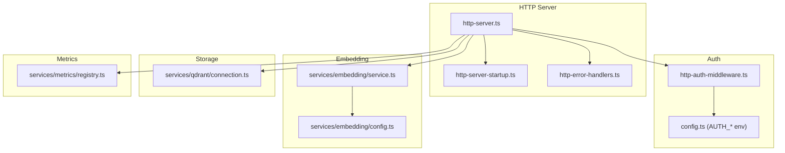
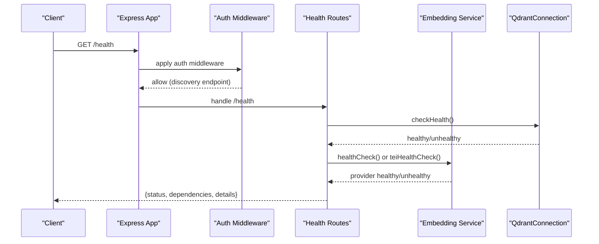
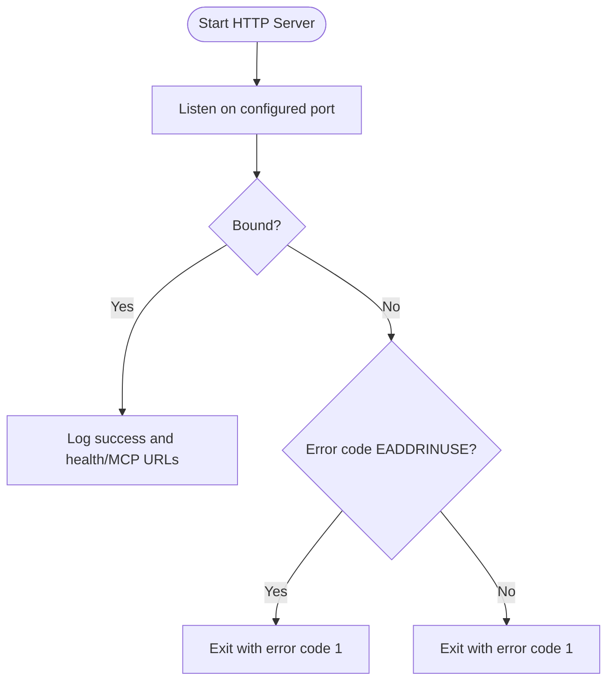
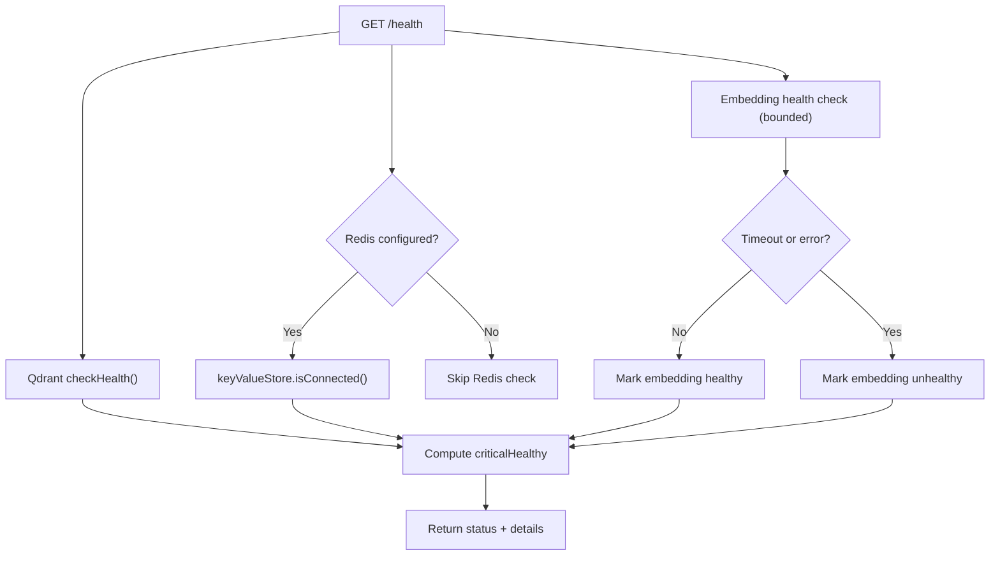
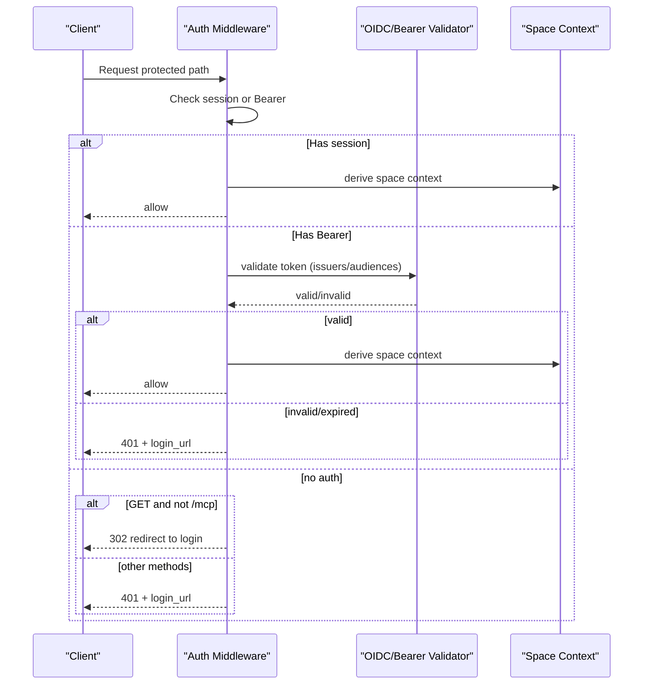
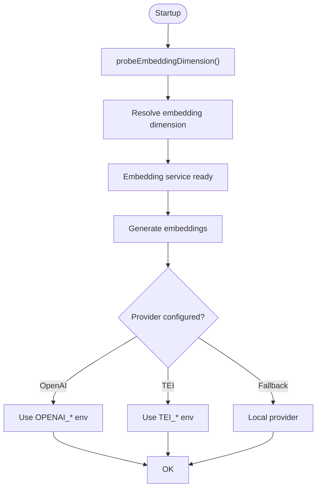
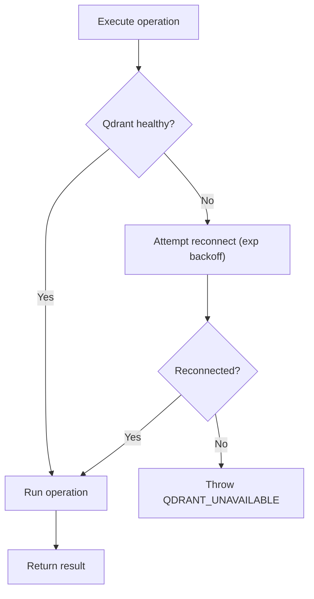
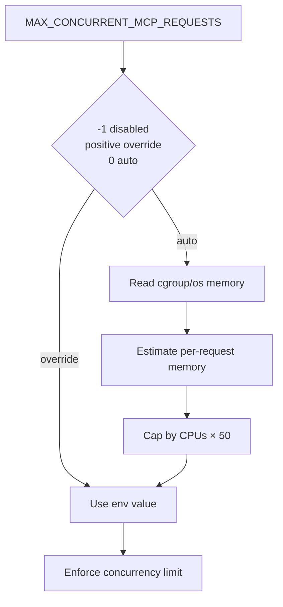
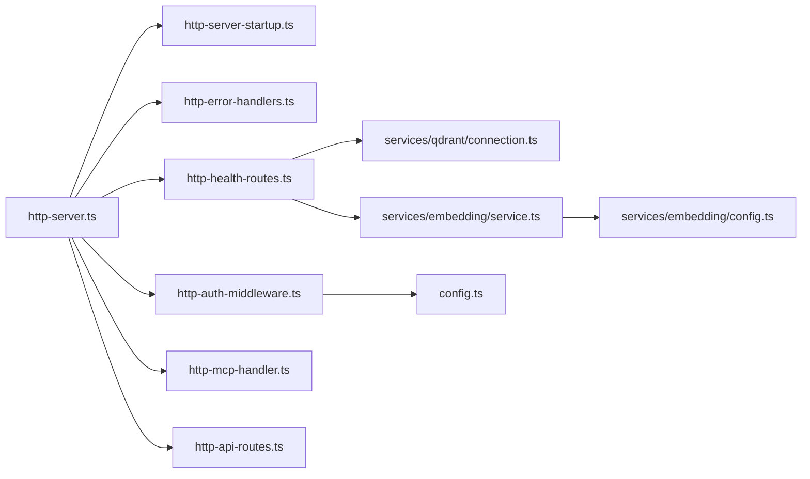

# Troubleshooting & FAQ

<cite>
**Referenced Files in This Document**
- [src/http/http-server-startup.ts](file://src/http/http-server-startup.ts)
- [src/http/http-health-routes.ts](file://src/http/http-health-routes.ts)
- [src/services/embedding/service.ts](file://src/services/embedding/service.ts)
- [src/services/embedding/config.ts](file://src/services/embedding/config.ts)
- [src/http/http-error-handlers.ts](file://src/http/http-error-handlers.ts)
- [src/bootstrap.ts](file://src/bootstrap.ts)
- [src/config.ts](file://src/config.ts)
- [src/http/http-auth-middleware.ts](file://src/http/http-auth-middleware.ts)
- [src/services/metrics/registry.ts](file://src/services/metrics/registry.ts)
- [src/http/http-server.ts](file://src/http/http-server.ts)
- [src/services/qdrant/connection.ts](file://src/services/qdrant/connection.ts)
- [src/utils/concurrency-limit.ts](file://src/utils/concurrency-limit.ts)
- [docs/install/README.md](file://docs/install/README.md)
- [docs/known-issues-and-limitations.md](file://docs/known-issues-and-limitations.md)
- [CONTRIBUTING.md](file://CONTRIBUTING.md)
</cite>

## Table of Contents
1. [Introduction](#introduction)
2. [Project Structure](#project-structure)
3. [Core Components](#core-components)
4. [Architecture Overview](#architecture-overview)
5. [Detailed Component Analysis](#detailed-component-analysis)
6. [Dependency Analysis](#dependency-analysis)
7. [Performance Considerations](#performance-considerations)
8. [Troubleshooting Guide](#troubleshooting-guide)
9. [Conclusion](#conclusion)
10. [Appendices](#appendices)

## Introduction
This document provides comprehensive troubleshooting and FAQ guidance for KAIROS MCP. It focuses on diagnosing and resolving common operational issues such as server startup failures, health check problems, embedding configuration pitfalls, authentication and network connectivity concerns, and performance tuning. It also outlines debugging techniques, diagnostic procedures, and frequently asked questions around deployment, configuration, and usage patterns.

## Project Structure
KAIROS MCP is an HTTP/MCP server with integrated authentication, embedding, and vector storage. The runtime is primarily HTTP-based, with modular route registration and middleware. Key areas relevant to troubleshooting include:
- HTTP server lifecycle and error handling
- Health checks for critical dependencies
- Authentication middleware and OIDC integration
- Embedding service configuration and health
- Qdrant connection and resilience
- Metrics exposure and concurrency limits

**Diagram sources**
- [src/http/http-server.ts:22-48](file://src/http/http-server.ts#L22-L48)
- [src/http/http-server-startup.ts:10-28](file://src/http/http-server-startup.ts#L10-L28)
- [src/http/http-error-handlers.ts:39-53](file://src/http/http-error-handlers.ts#L39-L53)
- [src/http/http-auth-middleware.ts:167-316](file://src/http/http-auth-middleware.ts#L167-L316)
- [src/config.ts:113-144](file://src/config.ts#L113-L144)
- [src/services/embedding/service.ts:38-286](file://src/services/embedding/service.ts#L38-L286)
- [src/services/embedding/config.ts:1-40](file://src/services/embedding/config.ts#L1-L40)
- [src/services/qdrant/connection.ts:11-131](file://src/services/qdrant/connection.ts#L11-L131)
- [src/services/metrics/registry.ts:1-23](file://src/services/metrics/registry.ts#L1-L23)

**Section sources**
- [src/http/http-server.ts:22-59](file://src/http/http-server.ts#L22-L59)
- [src/http/http-server-startup.ts:10-28](file://src/http/http-server-startup.ts#L10-L28)
- [src/http/http-error-handlers.ts:39-53](file://src/http/http-error-handlers.ts#L39-L53)
- [src/http/http-auth-middleware.ts:167-316](file://src/http/http-auth-middleware.ts#L167-L316)
- [src/config.ts:113-144](file://src/config.ts#L113-L144)
- [src/services/embedding/service.ts:38-286](file://src/services/embedding/service.ts#L38-L286)
- [src/services/embedding/config.ts:1-40](file://src/services/embedding/config.ts#L1-L40)
- [src/services/qdrant/connection.ts:11-131](file://src/services/qdrant/connection.ts#L11-L131)
- [src/services/metrics/registry.ts:1-23](file://src/services/metrics/registry.ts#L1-L23)

## Core Components
- HTTP server lifecycle and startup error handling
- Health check endpoint validating Qdrant, Redis/cache, and embedding provider
- Authentication middleware enforcing session or Bearer tokens
- Embedding service with provider selection and dimension probing
- Qdrant connection with reconnect and health checks
- Metrics registry and concurrency limit resolver

**Section sources**
- [src/http/http-server-startup.ts:10-28](file://src/http/http-server-startup.ts#L10-L28)
- [src/http/http-health-routes.ts:13-115](file://src/http/http-health-routes.ts#L13-L115)
- [src/http/http-auth-middleware.ts:167-316](file://src/http/http-auth-middleware.ts#L167-L316)
- [src/services/embedding/service.ts:38-286](file://src/services/embedding/service.ts#L38-L286)
- [src/services/qdrant/connection.ts:63-131](file://src/services/qdrant/connection.ts#L63-L131)
- [src/services/metrics/registry.ts:11-23](file://src/services/metrics/registry.ts#L11-L23)

## Architecture Overview
The HTTP server registers middleware and routes in a specific order to ensure discovery endpoints are accessible without authentication, then applies auth, and finally exposes MCP and API endpoints. Health checks validate critical dependencies and report status and details.

**Diagram sources**
- [src/http/http-server.ts:29-42](file://src/http/http-server.ts#L29-L42)
- [src/http/http-auth-middleware.ts:167-316](file://src/http/http-auth-middleware.ts#L167-L316)
- [src/http/http-health-routes.ts:15-89](file://src/http/http-health-routes.ts#L15-L89)
- [src/services/qdrant/connection.ts:63-74](file://src/services/qdrant/connection.ts#L63-L74)
- [src/services/embedding/service.ts:254-256](file://src/services/embedding/service.ts#L254-L256)

## Detailed Component Analysis

### HTTP Server Startup and Error Handling
- Port binding and startup logging
- EADDRINUSE handling and graceful exit
- Global error handler for uncaught conditions

**Diagram sources**
- [src/http/http-server-startup.ts:10-28](file://src/http/http-server-startup.ts#L10-L28)

**Section sources**
- [src/http/http-server-startup.ts:10-28](file://src/http/http-server-startup.ts#L10-L28)
- [src/bootstrap.ts:37-51](file://src/bootstrap.ts#L37-L51)

### Health Checks and Dependencies
- Validates Qdrant availability
- Checks Redis connectivity when configured
- Runs embedding health check with a bounded timeout
- Reports status, version, uptime, dependencies, and details

**Diagram sources**
- [src/http/http-health-routes.ts:15-89](file://src/http/http-health-routes.ts#L15-L89)
- [src/services/qdrant/connection.ts:63-74](file://src/services/qdrant/connection.ts#L63-L74)
- [src/services/embedding/service.ts:254-256](file://src/services/embedding/service.ts#L254-L256)

**Section sources**
- [src/http/http-health-routes.ts:13-115](file://src/http/http-health-routes.ts#L13-L115)
- [src/services/qdrant/connection.ts:63-131](file://src/services/qdrant/connection.ts#L63-L131)
- [src/services/embedding/service.ts:254-256](file://src/services/embedding/service.ts#L254-L256)

### Authentication and Authorization
- Enforces session or Bearer for protected paths
- OIDC Bearer validation when issuers/audiences configured
- Redirects browsers for GET requests to protected paths
- Exposes login URL guidance in JSON responses

**Diagram sources**
- [src/http/http-auth-middleware.ts:167-316](file://src/http/http-auth-middleware.ts#L167-L316)
- [src/config.ts:113-144](file://src/config.ts#L113-L144)

**Section sources**
- [src/http/http-auth-middleware.ts:167-316](file://src/http/http-auth-middleware.ts#L167-L316)
- [src/config.ts:113-144](file://src/config.ts#L113-L144)

### Embedding Configuration and Provider Selection
- Provider selection order: explicit preference, OpenAI, TEI, fallback local
- Dimension probing at startup to validate provider output
- Health checks for embedding provider with timeouts
- Audit and metrics for embedding requests

**Diagram sources**
- [src/services/embedding/service.ts:288-292](file://src/services/embedding/service.ts#L288-L292)
- [src/services/embedding/config.ts:12-31](file://src/services/embedding/config.ts#L12-L31)
- [src/services/embedding/service.ts:254-256](file://src/services/embedding/service.ts#L254-L256)

**Section sources**
- [src/services/embedding/service.ts:38-286](file://src/services/embedding/service.ts#L38-L286)
- [src/services/embedding/config.ts:1-40](file://src/services/embedding/config.ts#L1-L40)

### Qdrant Connection and Resilience
- Client initialization with TLS and CA cert handling
- Health checks and exponential backoff reconnect
- Operation wrapper with error logging and rethrow

**Diagram sources**
- [src/services/qdrant/connection.ts:98-131](file://src/services/qdrant/connection.ts#L98-L131)

**Section sources**
- [src/services/qdrant/connection.ts:11-131](file://src/services/qdrant/connection.ts#L11-L131)

### Metrics and Concurrency Limits
- Prometheus registry with default labels
- Auto-detected concurrency limit based on memory and CPU

**Diagram sources**
- [src/utils/concurrency-limit.ts:57-87](file://src/utils/concurrency-limit.ts#L57-L87)
- [src/services/metrics/registry.ts:11-23](file://src/services/metrics/registry.ts#L11-L23)

**Section sources**
- [src/utils/concurrency-limit.ts:1-88](file://src/utils/concurrency-limit.ts#L1-L88)
- [src/services/metrics/registry.ts:1-23](file://src/services/metrics/registry.ts#L1-L23)

## Dependency Analysis
- HTTP server depends on middleware, routes, and error handlers
- Health routes depend on Qdrant store, key-value store, and embedding service
- Auth middleware depends on configuration and OIDC/bearer validators
- Embedding service depends on provider endpoints and dimension config
- Qdrant connection encapsulates client and reconnect logic

**Diagram sources**
- [src/http/http-server.ts:22-48](file://src/http/http-server.ts#L22-L48)
- [src/http/http-server-startup.ts:10-28](file://src/http/http-server-startup.ts#L10-L28)
- [src/http/http-error-handlers.ts:39-53](file://src/http/http-error-handlers.ts#L39-L53)
- [src/http/http-auth-middleware.ts:167-316](file://src/http/http-auth-middleware.ts#L167-L316)
- [src/http/http-health-routes.ts:13-115](file://src/http/http-health-routes.ts#L13-L115)
- [src/services/qdrant/connection.ts:11-131](file://src/services/qdrant/connection.ts#L11-L131)
- [src/services/embedding/service.ts:38-286](file://src/services/embedding/service.ts#L38-L286)
- [src/services/embedding/config.ts:1-40](file://src/services/embedding/config.ts#L1-L40)
- [src/config.ts:113-144](file://src/config.ts#L113-L144)

**Section sources**
- [src/http/http-server.ts:22-59](file://src/http/http-server.ts#L22-L59)
- [src/http/http-health-routes.ts:13-115](file://src/http/http-health-routes.ts#L13-L115)
- [src/http/http-auth-middleware.ts:167-316](file://src/http/http-auth-middleware.ts#L167-L316)
- [src/services/embedding/service.ts:38-286](file://src/services/embedding/service.ts#L38-L286)
- [src/services/qdrant/connection.ts:11-131](file://src/services/qdrant/connection.ts#L11-L131)
- [src/config.ts:113-144](file://src/config.ts#L113-L144)

## Performance Considerations
- Concurrency limit auto-detection balances memory footprint and CPU capacity
- Embedding dimension probing prevents costly runtime mismatches
- Qdrant reconnect with exponential backoff improves resilience
- Metrics registry enables monitoring of embedding throughput and latency

[No sources needed since this section provides general guidance]

## Troubleshooting Guide

### Server Startup Problems
Symptoms:
- Server fails to start or exits immediately
- Port already in use error

Resolution steps:
- Verify the configured port is free; change PORT if needed
- Check startup logs for port binding and health/MCP URLs
- Ensure environment variables are loaded and valid

Diagnostics:
- Confirm port availability and process ownership
- Review structured logs emitted during startup

**Section sources**
- [src/http/http-server-startup.ts:10-28](file://src/http/http-server-startup.ts#L10-L28)
- [src/bootstrap.ts:37-51](file://src/bootstrap.ts#L37-L51)

### Health Check Failures
Symptoms:
- GET /health returns unhealthy or 503
- Missing or incorrect dependency status

Resolution steps:
- Validate Qdrant URL and credentials; ensure collection exists
- If using Redis, confirm REDIS_URL and connectivity
- Configure embedding provider (OpenAI or TEI) and verify endpoints
- Check embedding health with bounded timeout

Diagnostics:
- Inspect /health response fields: status, dependencies, details
- Review embedding provider logs and metrics
- Confirm Qdrant health and reconnect behavior

**Section sources**
- [src/http/http-health-routes.ts:13-115](file://src/http/http-health-routes.ts#L13-L115)
- [src/services/qdrant/connection.ts:63-131](file://src/services/qdrant/connection.ts#L63-L131)
- [src/services/embedding/service.ts:254-256](file://src/services/embedding/service.ts#L254-L256)

### Embedding Configuration Issues
Symptoms:
- Embedding dimension mismatch errors
- Provider not configured or failing health check
- Unexpected vector sizes or anomalies

Resolution steps:
- Ensure probeEmbeddingDimension runs at startup before using embedding-dependent features
- Set provider via EMBEDDING_PROVIDER or environment variables (OPENAI_* or TEI_*)
- Verify model names and API keys
- Monitor embedding metrics and audit logs

Diagnostics:
- Check embedding provider configuration and health
- Validate resolved dimension and vector sizes
- Review anomaly detection logs

**Section sources**
- [src/services/embedding/service.ts:288-292](file://src/services/embedding/service.ts#L288-L292)
- [src/services/embedding/config.ts:12-31](file://src/services/embedding/config.ts#L12-L31)
- [src/services/embedding/service.ts:254-256](file://src/services/embedding/service.ts#L254-L256)

### Authentication and Authorization Problems
Symptoms:
- 401 Unauthorized on protected endpoints
- Browser redirects to login or JSON with login_url
- Bearer token validation failures

Resolution steps:
- When AUTH_ENABLED=true, ensure KEYCLOAK_URL, KEYCLOAK_REALM, KEYCLOAK_CLIENT_ID, AUTH_CALLBACK_BASE_URL, and SESSION_SECRET are set
- For Bearer auth, configure AUTH_TRUSTED_ISSUERS and AUTH_ALLOWED_AUDIENCES (and AUTH_MODE if required)
- Verify OIDC groups allowlist and session cookie validity
- Confirm redirect URI matches Keycloak client configuration

Diagnostics:
- Review auth middleware logs and error responses
- Validate token issuer/audience claims
- Check session cookie signature and expiry

**Section sources**
- [src/config.ts:113-144](file://src/config.ts#L113-L144)
- [src/http/http-auth-middleware.ts:167-316](file://src/http/http-auth-middleware.ts#L167-L316)

### Network Connectivity and Integration Challenges
Symptoms:
- MCP client cannot discover or connect
- Discovery endpoint inaccessible without auth
- CORS or cross-origin issues

Resolution steps:
- Confirm discovery endpoint is reachable without credentials
- Ensure MCP CORS routes are registered before auth middleware
- Verify MCP URL matches server host/port and path (/mcp)
- Check UI static routes and capability downloads

Diagnostics:
- Use curl to test /.well-known/oauth-protected-resource
- Validate MCP handler registration order
- Inspect UI static and capability routes

**Section sources**
- [src/http/http-server.ts:29-42](file://src/http/http-server.ts#L29-L42)
- [docs/install/README.md:142-156](file://docs/install/README.md#L142-L156)

### Performance Tuning Guidelines
- Tune MAX_CONCURRENT_MCP_REQUESTS or rely on auto-detection
- Adjust embedding latency thresholds and scoring parameters
- Monitor embedding metrics and Qdrant performance
- Use metrics endpoint for observability

Diagnostics:
- Examine Prometheus metrics and default labels
- Review concurrency limit calculation and enforced limits

**Section sources**
- [src/utils/concurrency-limit.ts:57-87](file://src/utils/concurrency-limit.ts#L57-L87)
- [src/services/metrics/registry.ts:11-23](file://src/services/metrics/registry.ts#L11-L23)
- [src/config.ts:75-107](file://src/config.ts#L75-L107)

### Debugging Techniques and Diagnostic Procedures
- Enable structured logging and review error payloads
- Use global error handler for uncaught exceptions and rejections
- Inspect HTTP error responses and 413 payload size limits
- Validate request IDs and auth traces when enabled

Procedures:
- Capture request_id from headers for correlation
- Review global error handler logs for uncaught errors
- Confirm payload size limits and adjust HTTP_JSON_BODY_LIMIT if needed

**Section sources**
- [src/http/http-error-handlers.ts:9-33](file://src/http/http-error-handlers.ts#L9-L33)
- [src/bootstrap.ts:37-51](file://src/bootstrap.ts#L37-L51)
- [src/config.ts:98-100](file://src/config.ts#L98-L100)

### Frequently Asked Questions (FAQ)

- What ports does KAIROS use?
  - Default HTTP port is configurable; health and MCP endpoints share the same host and port. See installation docs for examples.

- How do I configure authentication?
  - Set AUTH_ENABLED and required Keycloak/issuer/audience variables. For Bearer auth, configure trusted issuers and allowed audiences.

- How do I select an embedding provider?
  - Use EMBEDDING_PROVIDER or environment variables for OpenAI or TEI. Ensure model names and API keys are correct.

- What are the runtime limitations?
  - HTTP transport only, Qdrant required, embedding provider required, Redis optional (in-memory fallback when not configured).

- How do I diagnose MCP connectivity issues?
  - Verify health endpoint, discovery endpoint, and MCP CORS setup. Confirm host and port alignment.

- Where can I find deployment and installation guidance?
  - Refer to installation docs for Docker Compose and Helm paths, prerequisites, and quick start steps.

**Section sources**
- [docs/install/README.md:16-163](file://docs/install/README.md#L16-L163)
- [docs/known-issues-and-limitations.md:6-52](file://docs/known-issues-and-limitations.md#L6-L52)
- [src/config.ts:113-144](file://src/config.ts#L113-L144)
- [src/services/embedding/service.ts:254-256](file://src/services/embedding/service.ts#L254-L256)

### Community Resources, Support Channels, and Contribution Guidelines
- Reporting issues: include description, steps, environment, and logs
- Feature requests and questions: open an issue
- Contribution workflow: branch, test, handoff checks, PR, and release process
- Code style and quality: ESLint, pre-commit hooks, and multitenancy audit checklist

**Section sources**
- [CONTRIBUTING.md:485-504](file://CONTRIBUTING.md#L485-L504)

## Conclusion
This guide consolidates practical troubleshooting and FAQ content for KAIROS MCP. By focusing on server startup, health checks, authentication, embedding configuration, and performance tuning, operators can quickly diagnose and resolve common operational issues. Use the referenced files and sections as authoritative sources for configuration, behavior, and diagnostics.

## Appendices

### Step-by-Step Resolution Procedures

- Server fails to start on configured port
  - Change PORT to an available port
  - Restart and confirm startup logs
  - Validate EADDRINUSE handling and exit behavior

- Health check reports unhealthy
  - Verify Qdrant URL and credentials
  - Check Redis connectivity if configured
  - Configure embedding provider and run health check
  - Review /health response details

- Embedding dimension mismatch
  - Ensure probeEmbeddingDimension runs at startup
  - Validate provider model and API keys
  - Check resolved dimension and vector sizes
  - Review anomaly detection logs

- 401 Unauthorized on protected endpoints
  - Set AUTH_ENABLED and required Keycloak variables
  - Configure Bearer validation (issuers/audiences) if using Bearer
  - Validate session cookie and redirect URI
  - Confirm OIDC groups allowlist

- MCP client cannot connect
  - Confirm discovery endpoint accessibility
  - Verify MCP CORS routes and handler registration
  - Align MCP URL with host/port and path
  - Check UI static and capability routes

- Performance bottlenecks
  - Adjust MAX_CONCURRENT_MCP_REQUESTS or rely on auto-detection
  - Tune embedding and scoring parameters
  - Monitor metrics and Qdrant performance
  - Review concurrency limit calculation

**Section sources**
- [src/http/http-server-startup.ts:10-28](file://src/http/http-server-startup.ts#L10-L28)
- [src/http/http-health-routes.ts:13-115](file://src/http/http-health-routes.ts#L13-L115)
- [src/services/embedding/service.ts:288-292](file://src/services/embedding/service.ts#L288-L292)
- [src/http/http-auth-middleware.ts:167-316](file://src/http/http-auth-middleware.ts#L167-L316)
- [src/http/http-server.ts:29-42](file://src/http/http-server.ts#L29-L42)
- [src/utils/concurrency-limit.ts:57-87](file://src/utils/concurrency-limit.ts#L57-L87)
- [docs/install/README.md:142-156](file://docs/install/README.md#L142-L156)