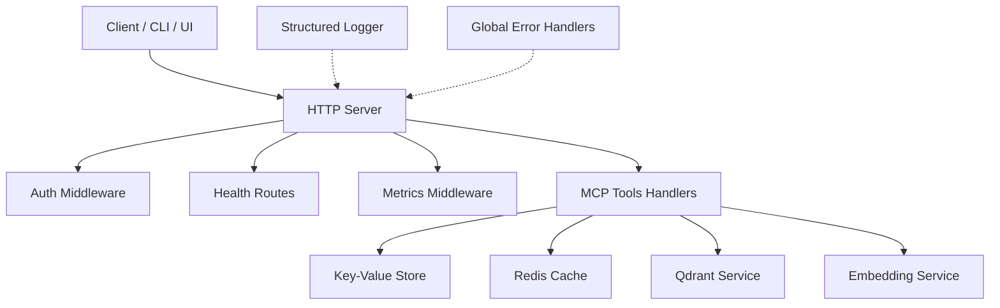
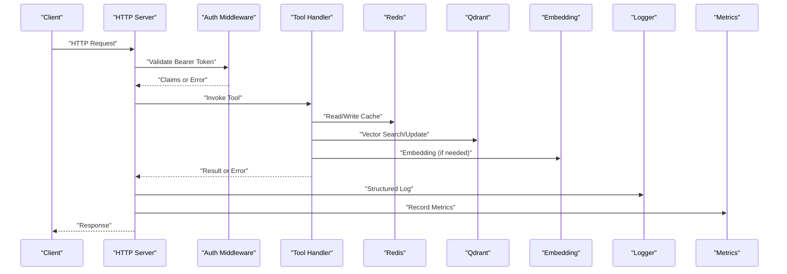
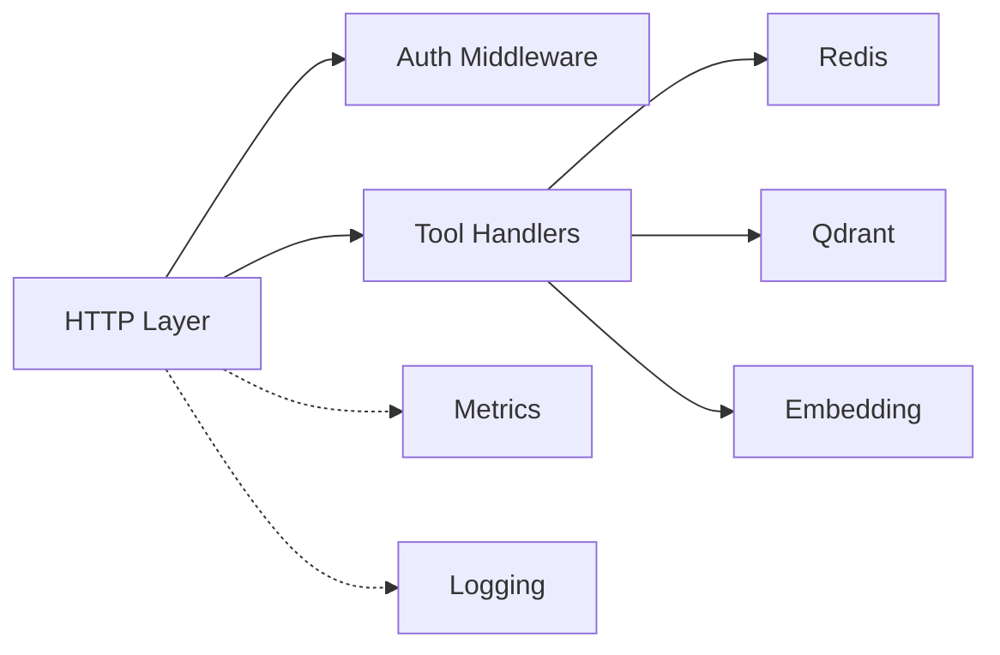

# Troubleshooting and FAQ

<cite>
**Referenced Files in This Document**
- [README.md](file://README.md)
- [CONTRIBUTING.md](file://CONTRIBUTING.md)
- [SECURITY.md](file://SECURITY.md)
- [known-issues-and-limitations.md](file://docs/known-issues-and-limitations.md)
- [logging.md](file://docs/architecture/logging.md)
- [http-error-handlers.ts](file://src/http/http-error-handlers.ts)
- [structured-logger.ts](file://src/utils/structured-logger.ts)
- [log-core.ts](file://src/utils/log-core.ts)
- [global-error-handlers.ts](file://src/utils/global-error-handlers.ts)
- [mcp-tool-input-teaching.ts](file://src/tools/mcp-tool-input-teaching.ts)
- [mcp-runtime-error.ts](file://src/tools/mcp-runtime-error.ts)
- [forward-tool-error.ts](file://src/tools/forward-tool-error.ts)
- [auth-error.ts](file://src/cli/auth-error.ts)
- [http-auth-middleware.ts](file://src/http/http-auth-middleware.ts)
- [bearer-validate.ts](file://src/http/bearer-validate.ts)
- [oidc-profile-claims.ts](file://src/http/oidc-profile-claims.ts)
- [http-health-routes.ts](file://src/http/http-health-routes.ts)
- [metrics-server.ts](file://src/metrics-server.ts)
- [http-metrics-middleware.ts](file://src/http/http-metrics-middleware.ts)
- [redis-cache.ts](file://src/services/redis-cache.ts)
- [qdrant/connection.ts](file://src/services/qdrant/connection.ts)
- [qdrant/service.ts](file://src/services/qdrant/service.ts)
- [embedding/config.ts](file://src/services/embedding/config.ts)
- [embedding/health.ts](file://src/services/embedding/health.ts)
- [services/redis.ts](file://src/services/redis.ts)
- [config.ts](file://src/config.ts)
- [bootstrap.ts](file://src/bootstrap.ts)
- [server.ts](file://src/server.ts)
- [http-server-startup.ts](file://src/http/http-server-startup.ts)
- [http-server-config.ts](file://src/http/http-server-config.ts)
- [docker-compose-simple.md](file://docs/install/docker-compose-simple.md)
- [docker-compose-full-stack.md](file://docs/install/docker-compose-full-stack.md)
- [helm.md](file://docs/install/helm.md)
- [prerequisites.md](file://docs/install/prerequisites.md)
- [prometheusrule.yaml](file://helm/kairos-mcp/templates/prometheusrule.yaml)
- [app-servicemonitor.yaml](file://helm/kairos-mcp/templates/app-servicemonitor.yaml)
- [keycloak-realm-import.yaml](file://helm/kairos-mcp/templates/keycloak-realm-import.yaml)
- [kairos-mcp-deployment.yaml](file://helm/kairos-mcp/templates/kairos-mcp-deployment.yaml)
- [values.yaml](file://helm/kairos-mcp/values.yaml)
</cite>

## Table of Contents
1. [Introduction](#introduction)
2. [Project Structure](#project-structure)
3. [Core Components](#core-components)
4. [Architecture Overview](#architecture-overview)
5. [Detailed Component Analysis](#detailed-component-analysis)
6. [Dependency Analysis](#dependency-analysis)
7. [Performance Considerations](#performance-considerations)
8. [Troubleshooting Guide](#troubleshooting-guide)
9. [Conclusion](#conclusion)
10. [Appendices](#appendices)

## Introduction
This document provides comprehensive troubleshooting and FAQ guidance for Kairos MCP. It focuses on diagnosing installation, configuration, and runtime issues; interpreting error messages; leveraging structured logging and metrics; identifying performance bottlenecks; and understanding known limitations and migration considerations. It also points to community resources and contribution guidelines for reporting issues and getting help.

## Project Structure
Kairos MCP is a Node.js application with:
- HTTP server and MCP handlers
- Structured logging and global error handling
- Authentication middleware and OIDC integration
- Health and metrics endpoints
- Integrations with Redis, Qdrant, and embedding providers
- Helm charts and Docker Compose for deployment

[No sources needed since this diagram shows conceptual workflow, not actual code structure]

## Core Components
- HTTP server and routes: entry point for requests, health checks, and MCP tool execution.
- Authentication and authorization: OIDC bearer validation and profile claims extraction.
- Structured logging: centralized logger used across the app.
- Global error handling: consistent error propagation and user-friendly responses.
- Metrics and health: Prometheus-compatible metrics and readiness/liveness probes.
- External integrations: Redis (cache/pubsub), Qdrant (vector store), embedding providers.

**Section sources**
- [server.ts](file://src/server.ts)
- [http-server-startup.ts](file://src/http/http-server-startup.ts)
- [http-server-config.ts](file://src/http/http-server-config.ts)
- [http-health-routes.ts](file://src/http/http-health-routes.ts)
- [http-metrics-middleware.ts](file://src/http/http-metrics-middleware.ts)
- [metrics-server.ts](file://src/metrics-server.ts)
- [http-auth-middleware.ts](file://src/http/http-auth-middleware.ts)
- [bearer-validate.ts](file://src/http/bearer-validate.ts)
- [oidc-profile-claims.ts](file://src/http/oidc-profile-claims.ts)
- [structured-logger.ts](file://src/utils/structured-logger.ts)
- [log-core.ts](file://src/utils/log-core.ts)
- [global-error-handlers.ts](file://src/utils/global-error-handlers.ts)
- [redis-cache.ts](file://src/services/redis-cache.ts)
- [qdrant/service.ts](file://src/services/qdrant/service.ts)
- [embedding/config.ts](file://src/services/embedding/config.ts)

## Architecture Overview
The request lifecycle includes authentication, optional caching, tool execution, and response formatting. Errors are normalized and logged with context. Metrics are recorded per route and operation.

**Diagram sources**
- [http-auth-middleware.ts](file://src/http/http-auth-middleware.ts)
- [bearer-validate.ts](file://src/http/bearer-validate.ts)
- [http-metrics-middleware.ts](file://src/http/http-metrics-middleware.ts)
- [structured-logger.ts](file://src/utils/structured-logger.ts)
- [redis-cache.ts](file://src/services/redis-cache.ts)
- [qdrant/service.ts](file://src/services/qdrant/service.ts)
- [embedding/config.ts](file://src/services/embedding/config.ts)

## Detailed Component Analysis

### Authentication and Authorization Issues
Common symptoms:
- 401 Unauthorized or redirect loops during login
- Missing or invalid OIDC scopes
- Profile claims missing required fields

Diagnostic steps:
- Verify OIDC client registration and redirect URIs.
- Ensure bearer token presence and validity.
- Inspect extracted claims and required scope mappings.

Resolution tips:
- Re-import realm configurations if Keycloak changes.
- Align scopes with expected claims.
- Check network connectivity to OIDC provider.

**Section sources**
- [http-auth-middleware.ts](file://src/http/http-auth-middleware.ts)
- [bearer-validate.ts](file://src/http/bearer-validate.ts)
- [oidc-profile-claims.ts](file://src/http/oidc-profile-claims.ts)
- [keycloak-realm-import.yaml](file://helm/kairos-mcp/templates/keycloak-realm-import.yaml)

### MCP Tool Input Teaching and Runtime Errors
Symptoms:
- Invalid input schema errors when invoking tools
- Runtime failures inside tool logic
- Forward tool-specific errors

Diagnostics:
- Review structured logs around tool invocation.
- Validate inputs against schemas.
- Inspect runtime error wrappers for actionable details.

Resolutions:
- Correct input payloads according to tool schemas.
- Handle tool-specific error types and propagate user-friendly messages.

**Section sources**
- [mcp-tool-input-teaching.ts](file://src/tools/mcp-tool-input-teaching.ts)
- [mcp-runtime-error.ts](file://src/tools/mcp-runtime-error.ts)
- [forward-tool-error.ts](file://src/tools/forward-tool-error.ts)

### CLI Authentication Errors
Symptoms:
- Login failures or token refresh errors
- Redirect URL rewriting problems

Diagnostics:
- Check environment variables for API base URL and OIDC settings.
- Inspect CLI auth error outputs.

Resolutions:
- Update configuration files or environment variables.
- Clear cached tokens if necessary.

**Section sources**
- [auth-error.ts](file://src/cli/auth-error.ts)
- [resolve-api-base.ts](file://src/cli/resolve-api-base.ts)

### Health and Readiness Checks
Symptoms:
- Kubernetes liveness/readiness probe failures
- Load balancer marking service unhealthy

Diagnostics:
- Call health endpoints directly.
- Inspect dependency health (Redis, Qdrant, embeddings).

Resolutions:
- Fix underlying dependency connectivity or credentials.
- Adjust startup timeouts if initialization takes longer.

**Section sources**
- [http-health-routes.ts](file://src/http/http-health-routes.ts)
- [embedding/health.ts](file://src/services/embedding/health.ts)

### Metrics and Observability
Symptoms:
- Missing metrics in Prometheus
- High latency without visibility

Diagnostics:
- Scrape metrics endpoint.
- Correlate HTTP metrics with business metrics.

Resolutions:
- Ensure metrics server is enabled and exposed.
- Configure ServiceMonitor/PrometheusRule for alerting.

**Section sources**
- [metrics-server.ts](file://src/metrics-server.ts)
- [http-metrics-middleware.ts](file://src/http/http-metrics-middleware.ts)
- [prometheusrule.yaml](file://helm/kairos-mcp/templates/prometheusrule.yaml)
- [app-servicemonitor.yaml](file://helm/kairos-mcp/templates/app-servicemonitor.yaml)

### Structured Logging and Global Error Handling
Symptoms:
- Unhelpful stack traces
- Missing contextual information in logs

Diagnostics:
- Enable structured logging and ensure log levels are appropriate.
- Use global error handlers to normalize error shapes.

Resolutions:
- Add correlation IDs and tenant context to logs.
- Centralize error formatting for consistent responses.

**Section sources**
- [structured-logger.ts](file://src/utils/structured-logger.ts)
- [log-core.ts](file://src/utils/log-core.ts)
- [global-error-handlers.ts](file://src/utils/global-error-handlers.ts)

### External Dependencies: Redis and Qdrant
Symptoms:
- Cache misses or stale data
- Vector search failures or slow queries

Diagnostics:
- Test connectivity and credentials to Redis and Qdrant.
- Monitor connection pools and retry behavior.

Resolutions:
- Tune connection parameters and timeouts.
- Validate collection/index setup and vector dimensions.

**Section sources**
- [redis-cache.ts](file://src/services/redis-cache.ts)
- [services/redis.ts](file://src/services/redis.ts)
- [qdrant/connection.ts](file://src/services/qdrant/connection.ts)
- [qdrant/service.ts](file://src/services/qdrant/service.ts)

### Configuration and Bootstrap
Symptoms:
- Startup crashes due to missing env vars
- Misconfigured server ports or TLS

Diagnostics:
- Validate config loading order and defaults.
- Inspect bootstrap and server startup logs.

Resolutions:
- Provide required environment variables.
- Align Helm values or compose overrides with deployment targets.

**Section sources**
- [config.ts](file://src/config.ts)
- [bootstrap.ts](file://src/bootstrap.ts)
- [server.ts](file://src/server.ts)
- [http-server-startup.ts](file://src/http/http-server-startup.ts)
- [http-server-config.ts](file://src/http/http-server-config.ts)

## Dependency Analysis
High-level dependencies and their roles:
- HTTP layer depends on auth middleware, metrics middleware, and tool handlers.
- Tool handlers depend on Redis cache, Qdrant service, and embedding service.
- Logging and error handling are cross-cutting concerns applied throughout.

[No sources needed since this diagram shows conceptual relationships, not exact file mappings]

**Section sources**
- [http-auth-middleware.ts](file://src/http/http-auth-middleware.ts)
- [http-metrics-middleware.ts](file://src/http/http-metrics-middleware.ts)
- [redis-cache.ts](file://src/services/redis-cache.ts)
- [qdrant/service.ts](file://src/services/qdrant/service.ts)
- [embedding/config.ts](file://src/services/embedding/config.ts)

## Performance Considerations
- Connection pooling: Ensure Redis and Qdrant clients are configured with appropriate pool sizes and timeouts.
- Caching strategy: Leverage Redis for hot paths; invalidate caches on state changes.
- Embedding throughput: Batch operations where possible and monitor provider rate limits.
- Metrics-driven tuning: Use Prometheus metrics to identify hotspots and set alerts.
- Resource sizing: Right-size pods based on CPU/memory profiles and adjust HPA/VPA accordingly.

[No sources needed since this section provides general guidance]

## Troubleshooting Guide

### Installation and Deployment
- Docker Compose quick start:
  - Symptoms: Service not reachable, port conflicts, missing .env.
  - Steps: Validate prerequisites, review compose overrides, check container logs.
- Helm deployment:
  - Symptoms: Pod CrashLoopBackOff, readiness probe failing.
  - Steps: Inspect values.yaml overrides, verify secrets and ConfigMaps, check operator prerequisites.

**Section sources**
- [docker-compose-simple.md](file://docs/install/docker-compose-simple.md)
- [docker-compose-full-stack.md](file://docs/install/docker-compose-full-stack.md)
- [helm.md](file://docs/install/helm.md)
- [prerequisites.md](file://docs/install/prerequisites.md)
- [kairos-mcp-deployment.yaml](file://helm/kairos-mcp/templates/kairos-mcp-deployment.yaml)
- [values.yaml](file://helm/kairos-mcp/values.yaml)

### Configuration
- Common misconfigurations:
  - Missing or incorrect OIDC client ID/secret/issuer URLs.
  - Wrong API base URL or CORS settings.
  - Redis/Qdrant connection strings or TLS flags.
- Resolution checklist:
  - Validate environment variables and Helm values.
  - Confirm realm import completed successfully.
  - Test connectivity from within the pod/container.

**Section sources**
- [config.ts](file://src/config.ts)
- [http-server-config.ts](file://src/http/http-server-config.ts)
- [keycloak-realm-import.yaml](file://helm/kairos-mcp/templates/keycloak-realm-import.yaml)

### Runtime Errors and Error Messages
- Authentication errors:
  - Interpretation: Invalid token, expired session, or missing scopes.
  - Actions: Refresh token, re-login, verify OIDC configuration.
- Tool input errors:
  - Interpretation: Schema mismatch or missing required fields.
  - Actions: Align payload with tool schema; use teaching hints if provided.
- Runtime tool errors:
  - Interpretation: Internal failure during tool execution.
  - Actions: Inspect structured logs; check downstream services.

**Section sources**
- [auth-error.ts](file://src/cli/auth-error.ts)
- [mcp-tool-input-teaching.ts](file://src/tools/mcp-tool-input-teaching.ts)
- [mcp-runtime-error.ts](file://src/tools/mcp-runtime-error.ts)
- [forward-tool-error.ts](file://src/tools/forward-tool-error.ts)

### Debugging Techniques
- Structured logging:
  - Enable appropriate log levels and include correlation IDs.
  - Filter logs by tenant or request context.
- Metrics and profiling:
  - Scrape Prometheus metrics; correlate latency spikes with specific routes.
  - Use HPA/VPA to auto-scale under load.
- Diagnostic endpoints:
  - Health checks for liveness/readiness.
  - Metrics endpoint for observability.

**Section sources**
- [structured-logger.ts](file://src/utils/structured-logger.ts)
- [log-core.ts](file://src/utils/log-core.ts)
- [http-metrics-middleware.ts](file://src/http/http-metrics-middleware.ts)
- [metrics-server.ts](file://src/metrics-server.ts)
- [http-health-routes.ts](file://src/http/http-health-routes.ts)

### Performance Optimization Tips
- Tune Redis cache TTLs and eviction policies.
- Optimize Qdrant query filters and vector dimensions.
- Reduce embedding calls via caching and batching.
- Monitor memory usage and GC pauses; adjust Node.js flags if needed.

[No sources needed since this section provides general guidance]

### Memory Leak Detection and Bottleneck Identification
- Detect leaks:
  - Track heap snapshots over time; compare growth patterns.
  - Correlate with long-running tasks or unbounded caches.
- Identify bottlenecks:
  - Use metrics to pinpoint slow endpoints.
  - Profile CPU-intensive operations and I/O waits.

[No sources needed since this section provides general guidance]

### Known Limitations and Workarounds
- Refer to documented limitations and recommended workarounds for current version constraints.

**Section sources**
- [known-issues-and-limitations.md](file://docs/known-issues-and-limitations.md)

### Migration Guides and Version Upgrades
- Before upgrading:
  - Review Helm values schema changes and required migrations.
  - Back up Redis and Qdrant data.
- During upgrade:
  - Apply rolling updates; monitor readiness probes.
  - Validate realm imports and OIDC settings post-upgrade.
- After upgrade:
  - Verify metrics and health endpoints.
  - Run smoke tests for critical flows.

**Section sources**
- [helm.md](file://docs/install/helm.md)
- [values.yaml](file://helm/kairos-mcp/values.yaml)
- [keycloak-realm-import.yaml](file://helm/kairos-mcp/templates/keycloak-realm-import.yaml)

### Community Resources and Support
- Reporting issues and contributing:
  - Follow contribution guidelines and security policy.
  - Use issue templates and provide logs/metrics snippets.
- Getting help:
  - Engage with community channels referenced in documentation.

**Section sources**
- [CONTRIBUTING.md](file://CONTRIBUTING.md)
- [SECURITY.md](file://SECURITY.md)
- [README.md](file://README.md)

## Conclusion
Use structured logging, metrics, and health endpoints to diagnose issues quickly. Validate configuration early, especially OIDC and external service connections. For performance, focus on caching, connection pooling, and embedding throughput. Consult known limitations and migration guides before upgrades. When stuck, gather logs, metrics, and reproduction steps, then engage the community following contribution and security guidelines.

## Appendices

### Quick Reference: Where to Look
- HTTP and MCP handlers: [http-server-startup.ts](file://src/http/http-server-startup.ts), [server.ts](file://src/server.ts)
- Auth and OIDC: [http-auth-middleware.ts](file://src/http/http-auth-middleware.ts), [bearer-validate.ts](file://src/http/bearer-validate.ts), [oidc-profile-claims.ts](file://src/http/oidc-profile-claims.ts)
- Logging and errors: [structured-logger.ts](file://src/utils/structured-logger.ts), [global-error-handlers.ts](file://src/utils/global-error-handlers.ts)
- Metrics and health: [metrics-server.ts](file://src/metrics-server.ts), [http-metrics-middleware.ts](file://src/http/http-metrics-middleware.ts), [http-health-routes.ts](file://src/http/http-health-routes.ts)
- External services: [redis-cache.ts](file://src/services/redis-cache.ts), [qdrant/service.ts](file://src/services/qdrant/service.ts), [embedding/config.ts](file://src/services/embedding/config.ts)
- Deployment: [helm.md](file://docs/install/helm.md), [docker-compose-simple.md](file://docs/install/docker-compose-simple.md), [values.yaml](file://helm/kairos-mcp/values.yaml)