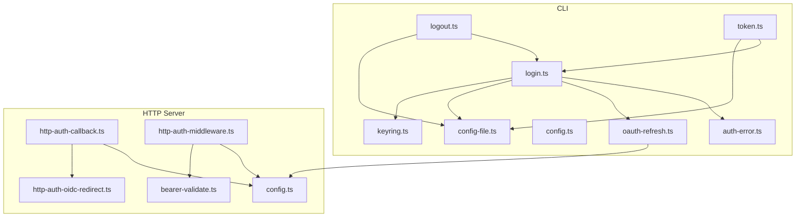
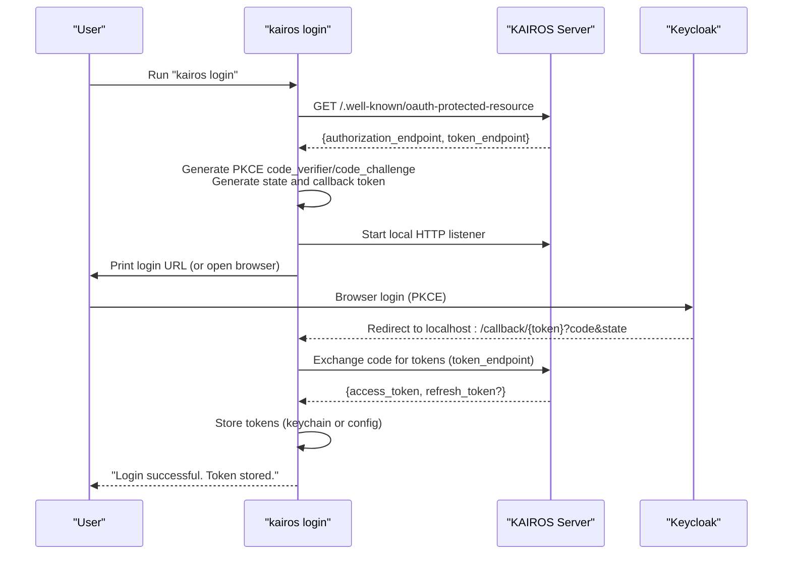
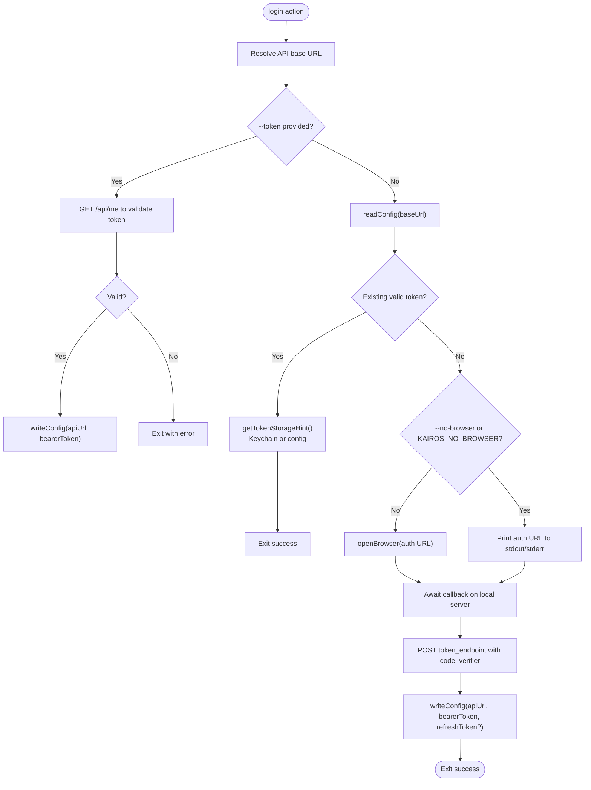
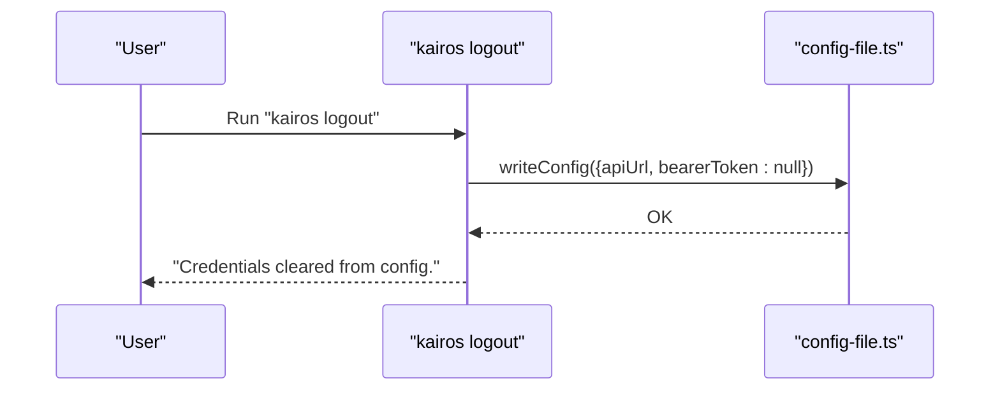
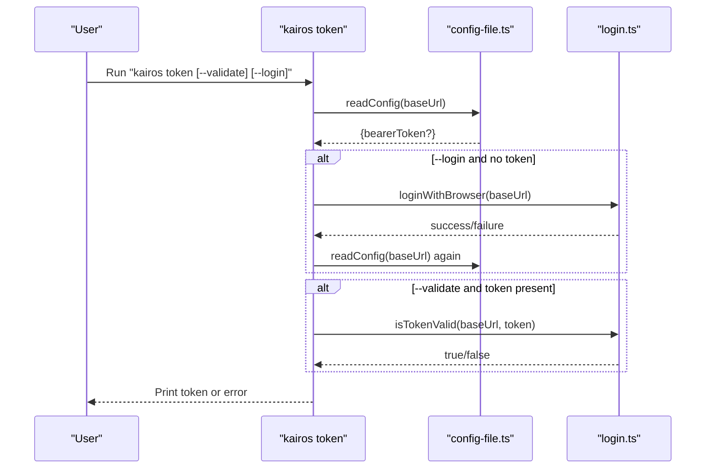
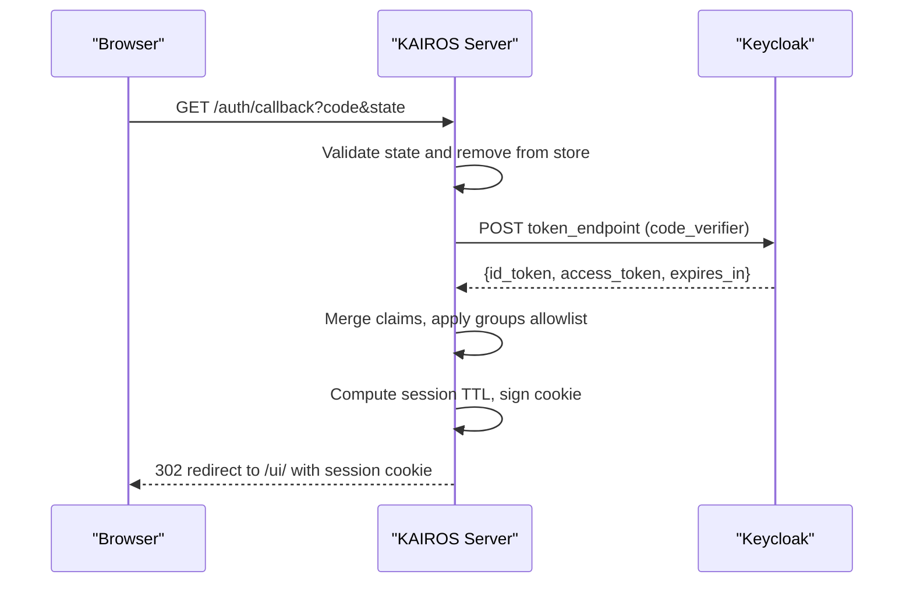
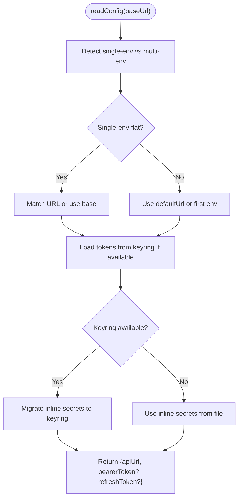
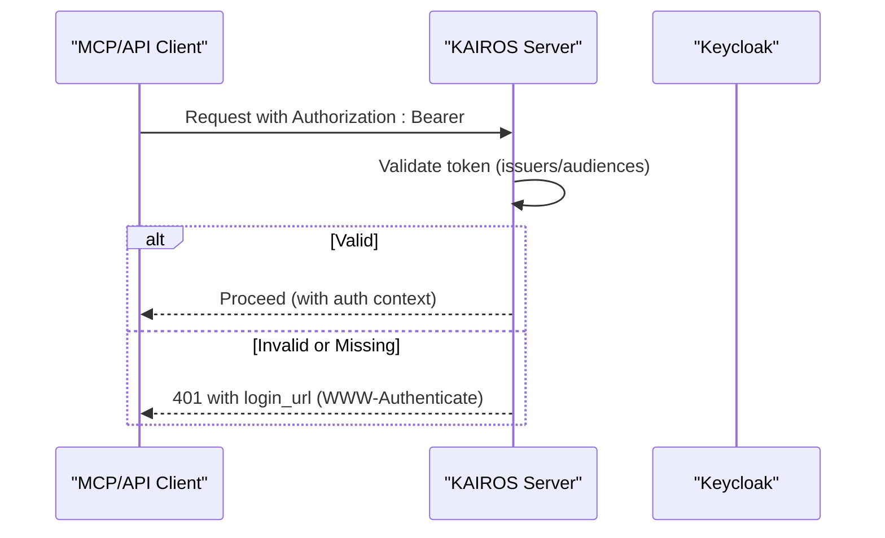
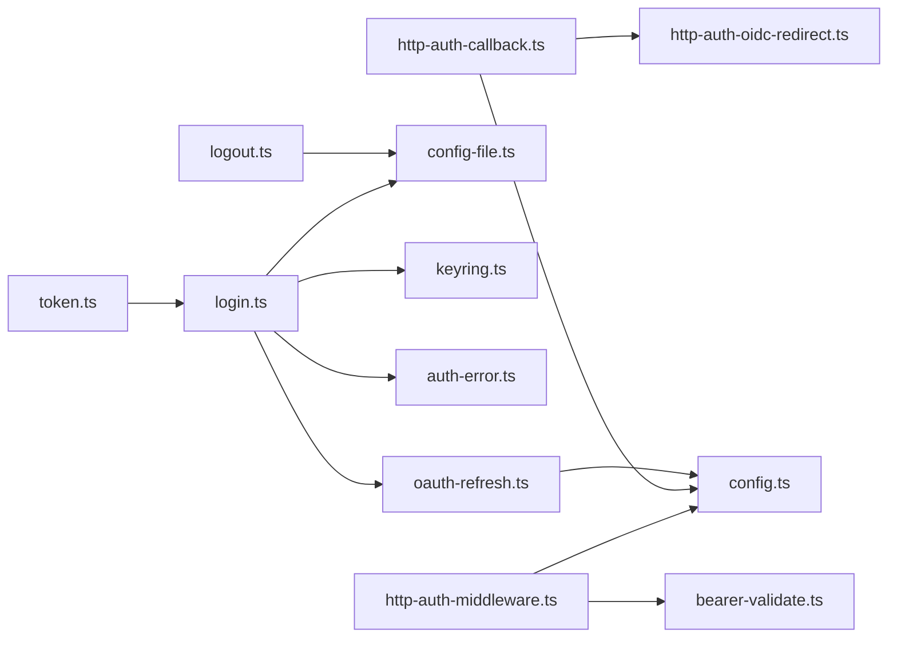

# Authentication Commands

<cite>
**Referenced Files in This Document**
- [src/cli/commands/login.ts](file://src/cli/commands/login.ts)
- [src/cli/commands/logout.ts](file://src/cli/commands/logout.ts)
- [src/cli/commands/token.ts](file://src/cli/commands/token.ts)
- [src/cli/oauth-refresh.ts](file://src/cli/oauth-refresh.ts)
- [src/cli/keyring.ts](file://src/cli/keyring.ts)
- [src/cli/config-file.ts](file://src/cli/config-file.ts)
- [src/cli/config.ts](file://src/cli/config.ts)
- [src/http/http-auth-callback.ts](file://src/http/http-auth-callback.ts)
- [src/http/http-auth-oidc-redirect.ts](file://src/http/http-auth-oidc-redirect.ts)
- [src/http/http-auth-middleware.ts](file://src/http/http-auth-middleware.ts)
- [src/http/bearer-validate.ts](file://src/http/bearer-validate.ts)
- [src/cli/auth-error.ts](file://src/cli/auth-error.ts)
- [src/config.ts](file://src/config.ts)
- [scripts/env/create-env.sh](file://scripts/env/create-env.sh)
- [docs/install/README.md](file://docs/install/README.md)
</cite>

## Table of Contents
1. [Introduction](#introduction)
2. [Project Structure](#project-structure)
3. [Core Components](#core-components)
4. [Architecture Overview](#architecture-overview)
5. [Detailed Component Analysis](#detailed-component-analysis)
6. [Dependency Analysis](#dependency-analysis)
7. [Performance Considerations](#performance-considerations)
8. [Troubleshooting Guide](#troubleshooting-guide)
9. [Security Best Practices](#security-best-practices)
10. [Configuration and Multi-Environment Setup](#configuration-and-multi-environment-setup)
11. [Conclusion](#conclusion)

## Introduction
This document explains the KAIROS MCP authentication commands and the underlying authentication system. It focuses on:
- The login command for browser-based authentication using PKCE
- The logout command for clearing stored credentials
- The token command for manual token retrieval and validation
It also documents the authentication flow, browser redirect handling, token storage mechanisms, credential persistence, configuration file locations, environment variable overrides, and multi-environment setup patterns. Practical examples, troubleshooting tips, and security best practices are included to help users operate the system reliably and securely.

## Project Structure
The authentication system spans CLI commands, HTTP handlers, and configuration utilities:
- CLI commands: login, logout, token
- HTTP handlers: OIDC callback, redirect, middleware, and bearer validation
- Supporting modules: OAuth metadata discovery, keychain/keyring, config file management, and centralized environment configuration

**Diagram sources**
- [src/cli/commands/login.ts:1-229](file://src/cli/commands/login.ts#L1-L229)
- [src/cli/commands/logout.ts:1-20](file://src/cli/commands/logout.ts#L1-L20)
- [src/cli/commands/token.ts:1-50](file://src/cli/commands/token.ts#L1-L50)
- [src/cli/keyring.ts:1-121](file://src/cli/keyring.ts#L1-L121)
- [src/cli/config-file.ts:1-189](file://src/cli/config-file.ts#L1-L189)
- [src/cli/config.ts:1-26](file://src/cli/config.ts#L1-L26)
- [src/cli/oauth-refresh.ts:1-101](file://src/cli/oauth-refresh.ts#L1-L101)
- [src/cli/auth-error.ts:1-133](file://src/cli/auth-error.ts#L1-L133)
- [src/http/http-auth-callback.ts:1-233](file://src/http/http-auth-callback.ts#L1-L233)
- [src/http/http-auth-oidc-redirect.ts:1-101](file://src/http/http-auth-oidc-redirect.ts#L1-L101)
- [src/http/http-auth-middleware.ts:1-316](file://src/http/http-auth-middleware.ts#L1-L316)
- [src/http/bearer-validate.ts](file://src/http/bearer-validate.ts)
- [src/config.ts:113-171](file://src/config.ts#L113-L171)

**Section sources**
- [src/cli/commands/login.ts:1-229](file://src/cli/commands/login.ts#L1-L229)
- [src/cli/commands/logout.ts:1-20](file://src/cli/commands/logout.ts#L1-L20)
- [src/cli/commands/token.ts:1-50](file://src/cli/commands/token.ts#L1-L50)
- [src/http/http-auth-callback.ts:1-233](file://src/http/http-auth-callback.ts#L1-L233)
- [src/http/http-auth-oidc-redirect.ts:1-101](file://src/http/http-auth-oidc-redirect.ts#L1-L101)
- [src/http/http-auth-middleware.ts:1-316](file://src/http/http-auth-middleware.ts#L1-L316)
- [src/cli/oauth-refresh.ts:1-101](file://src/cli/oauth-refresh.ts#L1-L101)
- [src/cli/keyring.ts:1-121](file://src/cli/keyring.ts#L1-L121)
- [src/cli/config-file.ts:1-189](file://src/cli/config-file.ts#L1-L189)
- [src/cli/config.ts:1-26](file://src/cli/config.ts#L1-L26)
- [src/config.ts:113-171](file://src/config.ts#L113-L171)

## Core Components
- Login command: supports manual token entry and browser-based PKCE flow; validates tokens via /api/me; stores tokens in keychain or config file; handles environment selection via URL.
- Logout command: clears stored bearer token for the current environment.
- Token command: prints stored bearer token, optionally validating it or triggering browser login if missing.
- OAuth metadata discovery: reads well-known endpoints for authorization and token exchange.
- Keychain/keyring: OS-native secure storage for bearer and refresh tokens; falls back to config file when unavailable.
- Config file: multi-environment storage keyed by normalized API URL; migrates secrets to keychain when available.
- HTTP OIDC callback and middleware: handle browser login, session cookies, logout, and Bearer token validation.

**Section sources**
- [src/cli/commands/login.ts:1-229](file://src/cli/commands/login.ts#L1-L229)
- [src/cli/commands/logout.ts:1-20](file://src/cli/commands/logout.ts#L1-L20)
- [src/cli/commands/token.ts:1-50](file://src/cli/commands/token.ts#L1-L50)
- [src/cli/oauth-refresh.ts:1-101](file://src/cli/oauth-refresh.ts#L1-L101)
- [src/cli/keyring.ts:1-121](file://src/cli/keyring.ts#L1-L121)
- [src/cli/config-file.ts:1-189](file://src/cli/config-file.ts#L1-L189)
- [src/http/http-auth-callback.ts:1-233](file://src/http/http-auth-callback.ts#L1-L233)
- [src/http/http-auth-middleware.ts:1-316](file://src/http/http-auth-middleware.ts#L1-L316)

## Architecture Overview
The authentication architecture combines CLI-driven browser PKCE with server-side OIDC handling and Bearer token validation.

**Diagram sources**
- [src/cli/commands/login.ts:69-196](file://src/cli/commands/login.ts#L69-L196)
- [src/cli/oauth-refresh.ts:26-51](file://src/cli/oauth-refresh.ts#L26-L51)
- [src/http/http-auth-callback.ts:122-231](file://src/http/http-auth-callback.ts#L122-L231)
- [src/http/http-auth-oidc-redirect.ts:28-87](file://src/http/http-auth-oidc-redirect.ts#L28-L87)

## Detailed Component Analysis

### Login Command (Browser-based PKCE)
- Reads the effective API base URL from environment or config.
- If a token is provided, validates it via /api/me and stores it.
- If no valid token exists, discovers OAuth endpoints from well-known metadata, starts a local HTTP server, generates PKCE state and challenge, and opens the browser to the authorization endpoint.
- Handles callback errors, validates state/code, exchanges authorization code for tokens, and persists tokens.
- Supports skipping browser opening via options or environment variables.

**Diagram sources**
- [src/cli/commands/login.ts:198-229](file://src/cli/commands/login.ts#L198-L229)
- [src/cli/commands/login.ts:40-61](file://src/cli/commands/login.ts#L40-L61)
- [src/cli/commands/login.ts:69-196](file://src/cli/commands/login.ts#L69-L196)
- [src/cli/oauth-refresh.ts:26-51](file://src/cli/oauth-refresh.ts#L26-L51)

**Section sources**
- [src/cli/commands/login.ts:1-229](file://src/cli/commands/login.ts#L1-L229)
- [src/cli/oauth-refresh.ts:1-101](file://src/cli/oauth-refresh.ts#L1-L101)
- [src/cli/auth-error.ts:1-133](file://src/cli/auth-error.ts#L1-L133)

### Logout Command (Session Termination)
- Clears the stored bearer token for the current environment identified by the API base URL.
- Uses the same URL resolution logic as login to ensure the correct environment is targeted.

**Diagram sources**
- [src/cli/commands/logout.ts:10-18](file://src/cli/commands/logout.ts#L10-L18)
- [src/cli/config-file.ts:1-189](file://src/cli/config-file.ts#L1-L189)

**Section sources**
- [src/cli/commands/logout.ts:1-20](file://src/cli/commands/logout.ts#L1-L20)
- [src/cli/config-file.ts:1-189](file://src/cli/config-file.ts#L1-L189)

### Token Command (Manual Token Management)
- Prints the stored bearer token to stdout (with newline when TTY).
- Supports validation via /api/me and optional automatic browser login if no token exists.
- Integrates with the login flow to trigger PKCE when needed.

**Diagram sources**
- [src/cli/commands/token.ts:10-48](file://src/cli/commands/token.ts#L10-L48)
- [src/cli/commands/login.ts:39-61](file://src/cli/commands/login.ts#L39-L61)

**Section sources**
- [src/cli/commands/token.ts:1-50](file://src/cli/commands/token.ts#L1-L50)
- [src/cli/commands/login.ts:1-229](file://src/cli/commands/login.ts#L1-L229)

### Browser Redirect Handling and OIDC Callback
- The server exposes /auth/callback for handling the OIDC authorization code.
- Validates state, exchanges code for tokens, merges claims from id_token and access_token, applies group allowlist filtering, computes session TTL, signs a session cookie, and redirects to the UI.
- Provides RP-initiated logout via /auth/logout with optional id_token_hint to skip the IdP’s logged-out page.

**Diagram sources**
- [src/http/http-auth-callback.ts:122-231](file://src/http/http-auth-callback.ts#L122-L231)
- [src/http/http-auth-oidc-redirect.ts:51-87](file://src/http/http-auth-oidc-redirect.ts#L51-L87)

**Section sources**
- [src/http/http-auth-callback.ts:1-233](file://src/http/http-auth-callback.ts#L1-L233)
- [src/http/http-auth-oidc-redirect.ts:1-101](file://src/http/http-auth-oidc-redirect.ts#L1-L101)

### Token Storage Mechanisms and Credential Persistence
- Keychain/keyring: OS-native secure storage for bearer and refresh tokens; accounts are normalized API URLs; refresh tokens use a distinct account suffix.
- Config file: XDG-compliant user-only-readable file storing defaultUrl and environments keyed by normalized API URL; secrets are migrated to keychain when available.
- Multi-environment: Each environment (API URL) maintains separate tokens; default environment is resolved from environment variables or config file.

**Diagram sources**
- [src/cli/config-file.ts:77-188](file://src/cli/config-file.ts#L77-L188)
- [src/cli/keyring.ts:1-121](file://src/cli/keyring.ts#L1-L121)

**Section sources**
- [src/cli/keyring.ts:1-121](file://src/cli/keyring.ts#L1-L121)
- [src/cli/config-file.ts:1-189](file://src/cli/config-file.ts#L1-L189)

### Bearer Token Validation (for MCP and API)
- When AUTH_MODE=oidc_bearer or AUTH_ENABLED is true, Bearer tokens are validated against trusted issuers and allowed audiences.
- Middleware responds with 401 and a login_url for non-browser clients (MCP) or redirects browsers to login for GET requests.

**Diagram sources**
- [src/http/http-auth-middleware.ts:226-282](file://src/http/http-auth-middleware.ts#L226-L282)
- [src/http/bearer-validate.ts](file://src/http/bearer-validate.ts)
- [src/config.ts:139-171](file://src/config.ts#L139-L171)

**Section sources**
- [src/http/http-auth-middleware.ts:1-316](file://src/http/http-auth-middleware.ts#L1-L316)
- [src/http/bearer-validate.ts](file://src/http/bearer-validate.ts)
- [src/config.ts:139-171](file://src/config.ts#L139-L171)

## Dependency Analysis
- CLI login depends on OAuth metadata discovery, local HTTP server, browser opening, and config/keyring persistence.
- HTTP callback depends on OIDC state management, token exchange, JWT decoding, and session cookie signing.
- Middleware depends on bearer validation and environment configuration for issuer/audience checks.

**Diagram sources**
- [src/cli/commands/login.ts:1-229](file://src/cli/commands/login.ts#L1-L229)
- [src/cli/commands/token.ts:1-50](file://src/cli/commands/token.ts#L1-L50)
- [src/cli/commands/logout.ts:1-20](file://src/cli/commands/logout.ts#L1-L20)
- [src/cli/oauth-refresh.ts:1-101](file://src/cli/oauth-refresh.ts#L1-L101)
- [src/cli/config-file.ts:1-189](file://src/cli/config-file.ts#L1-L189)
- [src/cli/keyring.ts:1-121](file://src/cli/keyring.ts#L1-L121)
- [src/cli/auth-error.ts:1-133](file://src/cli/auth-error.ts#L1-L133)
- [src/http/http-auth-callback.ts:1-233](file://src/http/http-auth-callback.ts#L1-L233)
- [src/http/http-auth-oidc-redirect.ts:1-101](file://src/http/http-auth-oidc-redirect.ts#L1-L101)
- [src/http/http-auth-middleware.ts:1-316](file://src/http/http-auth-middleware.ts#L1-L316)
- [src/http/bearer-validate.ts](file://src/http/bearer-validate.ts)
- [src/config.ts:113-171](file://src/config.ts#L113-L171)

**Section sources**
- [src/cli/commands/login.ts:1-229](file://src/cli/commands/login.ts#L1-L229)
- [src/cli/commands/token.ts:1-50](file://src/cli/commands/token.ts#L1-L50)
- [src/cli/commands/logout.ts:1-20](file://src/cli/commands/logout.ts#L1-L20)
- [src/http/http-auth-callback.ts:1-233](file://src/http/http-auth-callback.ts#L1-L233)
- [src/http/http-auth-oidc-redirect.ts:1-101](file://src/http/http-auth-oidc-redirect.ts#L1-L101)
- [src/http/http-auth-middleware.ts:1-316](file://src/http/http-auth-middleware.ts#L1-L316)
- [src/cli/oauth-refresh.ts:1-101](file://src/cli/oauth-refresh.ts#L1-L101)
- [src/cli/keyring.ts:1-121](file://src/cli/keyring.ts#L1-L121)
- [src/cli/config-file.ts:1-189](file://src/cli/config-file.ts#L1-L189)
- [src/config.ts:113-171](file://src/config.ts#L113-L171)

## Performance Considerations
- Browser PKCE login spins up a local HTTP server; choose a free port or set KAIROS_LOGIN_CALLBACK_PORT to avoid conflicts.
- Token validation via /api/me is lightweight but should be avoided in tight loops; reuse stored tokens when possible.
- Keychain/keyring operations are fast but may fail on some systems; the system gracefully falls back to file-based storage with a one-time warning.
- OIDC callback performs token exchange and JWT payload decoding; ensure network connectivity to Keycloak and appropriate timeouts.

[No sources needed since this section provides general guidance]

## Troubleshooting Guide
Common issues and resolutions:
- Port in use for local callback server: Set KAIROS_LOGIN_CALLBACK_PORT to a free port.
  - Section sources
    - [src/cli/commands/login.ts:164-171](file://src/cli/commands/login.ts#L164-L171)
- Missing auth metadata: Ensure the server exposes /.well-known/oauth-protected-resource and auth is enabled.
  - Section sources
    - [src/cli/commands/login.ts:71-76](file://src/cli/commands/login.ts#L71-L76)
    - [src/cli/oauth-refresh.ts:26-51](file://src/cli/oauth-refresh.ts#L26-L51)
- Invalid or expired token: Use kairos login to re-authenticate or kairos token --login to trigger browser login.
  - Section sources
    - [src/cli/commands/token.ts:22-30](file://src/cli/commands/token.ts#L22-L30)
    - [src/cli/commands/login.ts:40-61](file://src/cli/commands/login.ts#L40-L61)
- Browser not opening automatically: Disable via KAIROS_NO_BROWSER=1 or BROWSER environment variable; the login URL is printed to stdout/stderr.
  - Section sources
    - [src/cli/auth-error.ts:22-27](file://src/cli/auth-error.ts#L22-L27)
    - [src/cli/auth-error.ts:96-117](file://src/cli/auth-error.ts#L96-L117)
- OIDC callback misconfiguration: Ensure AUTH_ENABLED, KEYCLOAK_URL, KEYCLOAK_REALM, KEYCLOAK_CLIENT_ID, AUTH_CALLBACK_BASE_URL, and SESSION_SECRET are set.
  - Section sources
    - [src/http/http-auth-callback.ts:122-129](file://src/http/http-auth-callback.ts#L122-L129)
    - [src/config.ts:229-241](file://src/config.ts#L229-L241)
- Bearer token validation failures: Set AUTH_TRUSTED_ISSUERS and AUTH_ALLOWED_AUDIENCES (and AUTH_MODE=oidc_bearer or AUTH_ENABLED) to enable validation.
  - Section sources
    - [src/http/http-auth-middleware.ts:233-247](file://src/http/http-auth-middleware.ts#L233-L247)
    - [src/config.ts:139-171](file://src/config.ts#L139-L171)

## Security Best Practices
- Prefer browser-based PKCE login over long-lived tokens when possible.
- Store tokens in the OS keychain/keyring; if unavailable, ensure the config file is user-only readable.
- Use HTTPS for AUTH_CALLBACK_BASE_URL to set secure cookies for logout flows.
- Limit OIDC scopes to the minimum required; configure OIDC_GROUPS_ALLOWLIST to restrict group-based spaces.
- Regularly rotate client IDs and secrets; avoid embedding secrets in scripts.
- Monitor logs and enable trace mode (AUTH_TRACE or LOG_LEVEL=trace) for debugging authentication flows.

[No sources needed since this section provides general guidance]

## Configuration and Multi-Environment Setup
- Environment selection: The CLI resolves the API base URL from KAIROS_API_URL, then the defaultUrl from config, then defaults to http://localhost:3000.
  - Section sources
    - [src/cli/config.ts:11-24](file://src/cli/config.ts#L11-L24)
- Config file location: XDG-compliant user-only-readable file; multi-environment support with normalized API URL keys.
  - Section sources
    - [src/cli/config-file.ts:1-11](file://src/cli/config-file.ts#L1-L11)
- Environment variable overrides for OIDC and session behavior:
  - AUTH_ENABLED, KEYCLOAK_URL, KEYCLOAK_INTERNAL_URL, KEYCLOAK_REALM, KEYCLOAK_CLIENT_ID, KEYCLOAK_CLI_CLIENT_ID, AUTH_CALLBACK_BASE_URL, SESSION_SECRET, SESSION_MAX_AGE_SEC, OIDC_SCOPES_SUPPORTED, AUTH_MODE, AUTH_TRUSTED_ISSUERS, AUTH_ALLOWED_AUDIENCES, OIDC_GROUPS_ALLOWLIST.
  - Section sources
    - [src/config.ts:113-171](file://src/config.ts#L113-L171)
- Creating a development environment: Use the provided script to generate a .env file with secrets.
  - Section sources
    - [scripts/env/create-env.sh:1-12](file://scripts/env/create-env.sh#L1-L12)
- Installation and discovery endpoints: The repository documentation describes discovery via /.well-known/oauth-protected-resource and provides quick start guidance.
  - Section sources
    - [docs/install/README.md:146-152](file://docs/install/README.md#L146-L152)

## Conclusion
The KAIROS MCP authentication system provides robust CLI-driven browser-based PKCE login, secure token storage via OS keychain/keyring, and server-side OIDC handling with Bearer token validation. By understanding the commands, flows, and configuration options, users can operate the system reliably across multiple environments while adhering to security best practices.