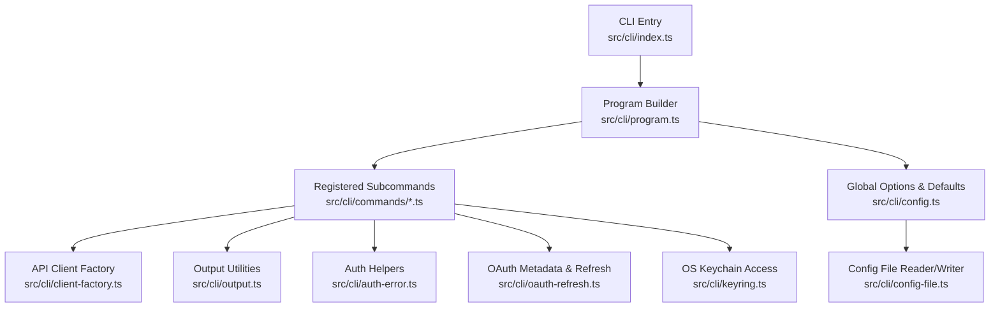
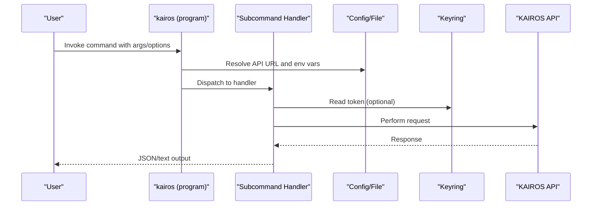
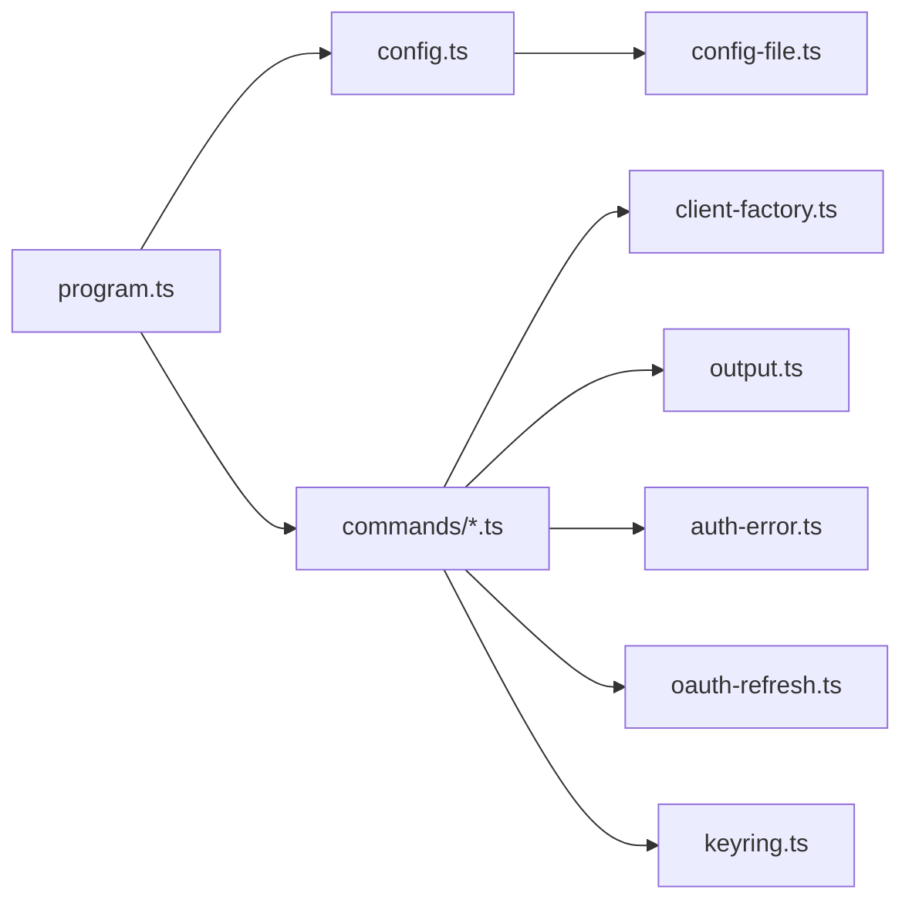

# CLI Interface

<cite>
**Referenced Files in This Document**
- [index.ts](file://src/cli/index.ts)
- [program.ts](file://src/cli/program.ts)
- [config.ts](file://src/cli/config.ts)
- [config-file.ts](file://src/cli/config-file.ts)
- [login.ts](file://src/cli/commands/login.ts)
- [search.ts](file://src/cli/commands/search.ts)
- [cli-train.ts](file://src/cli/commands/cli-train.ts)
- [export.ts](file://src/cli/commands/export.ts)
- [spaces.ts](file://src/cli/commands/spaces.ts)
- [delete.ts](file://src/cli/commands/delete.ts)
- [logout.ts](file://src/cli/commands/logout.ts)
- [token.ts](file://src/cli/commands/token.ts)
- [serve.ts](file://src/cli/commands/serve.ts)
- [begin.ts](file://src/cli/commands/begin.ts)
- [attest.ts](file://src/cli/commands/attest.ts)
- [update.ts](file://src/cli/commands/update.ts)
</cite>

## Update Summary
**Changes Made**
- Added comprehensive documentation for all CLI commands including authentication, training, export, search, utility commands
- Documented the complete command structure with arguments, options, and usage examples
- Enhanced authentication mechanisms coverage including browser-based PKCE flow
- Expanded configuration management documentation covering environment variables and keyring integration
- Added detailed error handling and troubleshooting guidance
- Included practical workflows and security considerations

## Table of Contents
1. [Introduction](#introduction)
2. [Project Structure](#project-structure)
3. [Core Components](#core-components)
4. [Architecture Overview](#architecture-overview)
5. [Detailed Component Analysis](#detailed-component-analysis)
6. [Authentication Commands](#authentication-commands)
7. [Training Commands](#training-commands)
8. [Export Commands](#export-commands)
9. [Search Commands](#search-commands)
10. [Utility Commands](#utility-commands)
11. [Configuration Management](#configuration-management)
12. [Dependency Analysis](#dependency-analysis)
13. [Performance Considerations](#performance-considerations)
14. [Troubleshooting Guide](#troubleshooting-guide)
15. [Practical Workflows and Examples](#practical-workflows-and-examples)
16. [Security Considerations](#security-considerations)
17. [Conclusion](#conclusion)

## Introduction
This document describes the KAIROS MCP CLI interface, focusing on command structure, argument parsing, subcommand organization, authentication, configuration, environment handling, and operational workflows. The CLI provides comprehensive coverage of the KAIROS MCP ecosystem including authentication, training, export, search, and utility functions.

## Project Structure
The CLI is implemented as a Commander-based application with a central entry point that registers subcommands. Global options propagate to nested commands, and environment variables influence runtime behavior. Authentication and configuration are managed via a config file and OS keychain when available.



**Diagram sources**
- [index.ts:1-11](file://src/cli/index.ts#L1-L11)
- [program.ts:31-73](file://src/cli/program.ts#L31-L73)
- [config.ts:11-24](file://src/cli/config.ts#L11-L24)
- [config-file.ts:77-188](file://src/cli/config-file.ts#L77-L188)

**Section sources**
- [index.ts:1-11](file://src/cli/index.ts#L1-L11)
- [program.ts:31-73](file://src/cli/program.ts#L31-L73)
- [config.ts:11-24](file://src/cli/config.ts#L11-L24)

## Core Components
- Entry point initializes the CLI and delegates to the program builder.
- Program builder defines global options, registers subcommands, and propagates environment variables to nested commands.
- Configuration utilities resolve the API base URL from environment, config file, or defaults.
- Command modules encapsulate each subcommand's arguments, options, and execution logic.
- Authentication and token management integrate with OS keychain and browser-based PKCE flow.
- Output utilities standardize JSON and text output formatting.

**Section sources**
- [index.ts:6-9](file://src/cli/index.ts#L6-L9)
- [program.ts:31-73](file://src/cli/program.ts#L31-L73)
- [config.ts:11-24](file://src/cli/config.ts#L11-L24)
- [config-file.ts:77-188](file://src/cli/config-file.ts#L77-L188)

## Architecture Overview
The CLI composes a global configuration and environment-aware client factory to execute commands against the KAIROS API. Authentication is centralized in the login command and reused by other commands when needed.



**Diagram sources**
- [program.ts:42-54](file://src/cli/program.ts#L42-L54)
- [login.ts:25-32](file://src/cli/commands/login.ts#L25-L32)
- [config-file.ts:77-188](file://src/cli/config-file.ts#L77-L188)

## Detailed Component Analysis

### Global Options and Environment Handling
- Global options:
  - --url <url>: Sets the API base URL. Propagates to nested commands via preAction hook.
  - --timeout <seconds>: Request timeout in seconds (default 15).
  - --retries <n>: Max retries on network errors (default 2).
  - --no-browser: Suppress opening the browser for auth flows.
- Environment variables:
  - KAIROS_API_URL: Overrides default API base URL.
  - KAIROS_NO_BROWSER: Suppresses browser launch for auth.
  - KAIROS_TIMEOUT_MS, KAIROS_RETRIES: Respectively override timeout and retries.
  - KAIROS_LOGIN_CALLBACK_PORT: Controls local callback server port for PKCE.
- PreAction hook:
  - Merges global options into nested commands and sets environment variables accordingly.

**Section sources**
- [program.ts:34-54](file://src/cli/program.ts#L34-L54)
- [config.ts:11-24](file://src/cli/config.ts#L11-L24)

## Authentication Commands

### Command: login
- Purpose: Store a Bearer token via manual token or browser PKCE flow.
- Options:
  - -t, --token <token>: Validates token against /api/me and stores it.
  - --no-browser: Prints auth URL instead of opening browser.
- Behavior:
  - Reads current environment's token; if valid, prints storage location and exits.
  - Uses OAuth metadata discovery and PKCE to exchange authorization code for tokens.
  - Stores tokens in OS keychain when available; otherwise in config file.
- Outputs:
  - Success messages and errors; writes to stdout/stderr as appropriate.

**Section sources**
- [login.ts:198-228](file://src/cli/commands/login.ts#L198-L228)
- [login.ts:48-61](file://src/cli/commands/login.ts#L48-L61)
- [login.ts:69-196](file://src/cli/commands/login.ts#L69-L196)

### Command: token
- Purpose: Print stored bearer token to stdout for scripting.
- Options:
  - -v, --validate: Validate token via /api/me before printing.
  - -l, --login: Trigger browser login if no valid token exists.
- Behavior:
  - Reads token from config; optionally triggers login flow.
  - Exits with error if no token and login fails.

**Section sources**
- [token.ts:10-48](file://src/cli/commands/token.ts#L10-L48)

### Command: logout
- Purpose: Clear stored access and refresh credentials for the current environment.
- Behavior:
  - Resolves current base URL and clears bearer token in config.

**Section sources**
- [logout.ts:10-18](file://src/cli/commands/logout.ts#L10-L18)

## Training Commands

### Command: train
- Purpose: Register a new adapter from markdown or attach a text artifact to an adapter; supports single-file and directory batch modes.
- Arguments:
  - [path]: Path to a markdown/artifact file or directory of .md files.
- Options:
  - --model <model>: LLM model ID for attribution.
  - --force: Force update if an adapter with the same label exists.
  - --recursive: Include nested .md files when path is a directory.
  - --source-adapter-uri <uri>: Fork from an existing adapter via POST /api/train; requires --model; optional --space for target space.
  - --space <space>: Target space for train or fork.
  - Artifact mode flags (only for single-file):
    - --adapter <uri>: Parent adapter URI (kairos://adapter/{slug}).
    - --artifact-name <name>: Artifact filename override.
    - --mime <mime>: MIME override; otherwise inferred from extension.
    - --relative-path <path>: Optional skill-root-relative path for export bundles.
  - --allow-sensitive-upload: Allow uploads containing token-like or private-key-like text.
- Behavior:
  - Single-file mode:
    - If artifact flags present or MIME is not text/markdown, enters artifact mode and validates requirements.
    - Otherwise treats as markdown training.
  - Directory mode:
    - Skips README.md, walks recursively if requested, and batches training requests.
  - Fork mode:
    - Requires --model and optional --space; ignores file path argument.
- Outputs:
  - JSON responses; batch mode returns aggregated results.

**Section sources**
- [cli-train.ts:56-275](file://src/cli/commands/cli-train.ts#L56-L275)

### Command: tune
- Purpose: Update one or more KAIROS adapter layers.
- Arguments:
  - <uris...>: KAIROS adapter or layer URIs.
- Options:
  - --file <file>: Path to markdown file to apply to all specified URIs.
  - --files <files...>: Paths to markdown files, one per URI (must match number of URIs).
  - --updates <json>: Updates object as JSON string (alternative to --file/--files).
  - --space <space>: Move all layers of each target adapter to this space.
  - --allow-sensitive-upload: Allow uploads that contain token-like or private-key-like text.
- Behavior:
  - Supports three update modes: single file for all URIs, individual files per URI, or direct JSON updates.
  - Can perform space moves without content changes.
- Outputs:
  - JSON responses with update results.

**Section sources**
- [update.ts:11-98](file://src/cli/commands/update.ts#L11-L98)

## Export Commands

### Command: export
- Purpose: Export adapters in various formats (markdown, skill_zip, skill_tree, source, trace_jsonl, reward_jsonl, sft_jsonl, preference_jsonl).
- Arguments:
  - [uri]: Adapter or layer URI (single-selection mode).
- Options:
  - --adapters <uri-or-slug> (repeatable): Select adapters by URI or slug.
  - --all-adapters: Export every adapter in --space-name.
  - --space-name <name>: Required with --all-adapters.
  - --format <format>: Output format (default markdown).
  - --output <mode>: text (print raw content) or json (print full response).
  - --zip-out <file>: Write downloaded ZIP bytes to a file when format is skill_zip and --output text.
  - --json-only: Print JSON response and do not follow download_ref.
  - --no-download: Alias for --json-only.
- Selection rules:
  - Exactly one selection mode must be used: positional <uri>, --adapters, or --all-adapters.
  - --space-name is only valid with --all-adapters.
- Behavior:
  - Builds export input according to CLI flags.
  - For skill_zip:
    - If response includes download_ref, downloads and writes to file.
    - If inline base64 content is present, decodes and writes to file.
    - Otherwise emits a diagnostic and exits with error.
  - For other formats, prints markdown content.

**Section sources**
- [export.ts:72-152](file://src/cli/commands/export.ts#L72-L152)
- [export.ts:28-70](file://src/cli/commands/export.ts#L28-L70)

## Search Commands

### Command: activate
- Purpose: Activate the best matching KAIROS adapter for a query.
- Arguments:
  - <query...>: Search query (multiple words allowed).
- Behavior:
  - Calls client.activate(), formats next-call hint, and prints JSON.

**Section sources**
- [search.ts:11-26](file://src/cli/commands/search.ts#L11-L26)

### Command: forward
- Purpose: Run the first or next KAIROS adapter layer.
- Arguments:
  - <uri>: Adapter or layer URI.
- Options:
  - --solution <json>: Forward solution as JSON string.
- Behavior:
  - Parses solution JSON if provided, calls client.forward(), and prints JSON with optional next-call hint.

**Section sources**
- [begin.ts:11-27](file://src/cli/commands/begin.ts#L11-L27)

## Utility Commands

### Command: spaces
- Purpose: List available spaces and adapter counts.
- Options:
  - --include-adapter-titles: Include per-space adapter titles and layer counts.
- Behavior:
  - Calls client.spaces() and prints JSON.

**Section sources**
- [spaces.ts:9-27](file://src/cli/commands/spaces.ts#L9-L27)

### Command: delete
- Purpose: Delete one or more adapters/layers by URI.
- Arguments:
  - <uris...>: One or more URIs to delete.
- Behavior:
  - Calls client.delete() and prints JSON.

**Section sources**
- [delete.ts:11-24](file://src/cli/commands/delete.ts#L11-L24)

### Command: reward
- Purpose: Record a reward signal for a KAIROS adapter execution.
- Arguments:
  - <uri>: KAIROS layer URI (kairos://layer/...).
  - <outcome>: Outcome: success or failure.
  - <feedback>: Reward feedback describing the completion or failure.
- Options:
  - --score <number>: Normalized reward score in the 0..1 range.
  - --rater <rater>: Evaluator identifier used for export gating.
  - --rubric-version <version>: Rubric or policy version used for evaluation.
  - --model <model>: LLM model ID for attribution.
- Behavior:
  - Validates outcome parameter and score range.
  - Records reward signals with optional metadata.
- Outputs:
  - JSON responses with reward processing results.

**Section sources**
- [attest.ts:11-70](file://src/cli/commands/attest.ts#L11-L70)

### Command: serve
- Purpose: Start the KAIROS HTTP/MCP server with configurable ports and environment.
- Options:
  - --env-file <path>: Path to dotenv file (default .env).
  - --port <n>: HTTP listen port (sets PORT).
  - --metrics-port <n>: Metrics listen port (sets METRICS_PORT).
- Behavior:
  - Loads environment from dotenv if present.
  - Validates numeric ports and sets environment variables.
  - Invokes the server bootstrap.

**Section sources**
- [serve.ts:10-48](file://src/cli/commands/serve.ts#L10-L48)

## Configuration Management

### Configuration File Structure
The CLI manages configuration through a structured config file supporting multiple environments:

- **New Format**: 
  ```json
  {
    "defaultUrl": "http://localhost:<PORT>",
    "environments": {
      "http://localhost:<PORT>": {
        "bearerToken": "...",
        "refreshToken": "..."
      }
    }
  }
  ```

- **Legacy Format**: `{ "KAIROS_API_URL": "...", "bearerToken": "..." }` — migrated on first write.

### Environment Resolution Order
1. KAIROS_API_URL environment variable
2. Saved config defaultUrl
3. Default localhost:3000

### Keyring Integration
- When available, bearer and refresh tokens are stored in OS keychain
- When unavailable, secrets are stored in the file (with a one-time warning)
- Automatic migration from file to keychain on first read/write

**Section sources**
- [config-file.ts:1-189](file://src/cli/config-file.ts#L1-L189)
- [config.ts:11-26](file://src/cli/config.ts#L11-L26)

## Dependency Analysis
The CLI composes several subsystems:
- Global configuration and environment propagation.
- Command registration and dispatch.
- Authentication and token lifecycle.
- Output formatting and error handling.
- API client creation and request execution.



**Diagram sources**
- [program.ts:31-73](file://src/cli/program.ts#L31-L73)
- [config.ts:11-24](file://src/cli/config.ts#L11-L24)
- [config-file.ts:77-188](file://src/cli/config-file.ts#L77-L188)

**Section sources**
- [program.ts:31-73](file://src/cli/program.ts#L31-L73)
- [config.ts:11-24](file://src/cli/config.ts#L11-L24)
- [config-file.ts:77-188](file://src/cli/config-file.ts#L77-L188)

## Performance Considerations
- Batch training: Directory mode enumerates and processes files sequentially; consider limiting recursion depth and file count for very large directories.
- Export downloads: skill_zip may stream large binaries; ensure sufficient disk space and consider using --json-only to inspect metadata first.
- Retries and timeouts: Tune --retries and --timeout to balance reliability and responsiveness in unstable networks.
- Output formatting: JSON output is compact; text output may be larger for certain formats.

## Troubleshooting Guide
- Authentication failures:
  - Use kairos login with --no-browser to print the auth URL and complete login externally.
  - Verify OAuth metadata availability at the server's well-known endpoint.
- Token validation:
  - Use kairos token -v to check token validity; re-run kairos login if invalid.
- Export issues:
  - For skill_zip with inline base64 content but no content available, use --output json to inspect the response.
  - If download_ref is missing, use --json-only to review export metadata.
- Port conflicts during PKCE callback:
  - Set KAIROS_LOGIN_CALLBACK_PORT to a free port.
- Environment variables:
  - Ensure KAIROS_API_URL is set correctly; remember that root --url propagates to nested commands via preAction hook.

**Section sources**
- [login.ts:69-196](file://src/cli/commands/login.ts#L69-L196)
- [token.ts:32-40](file://src/cli/commands/token.ts#L32-L40)
- [export.ts:109-145](file://src/cli/commands/export.ts#L109-L145)
- [program.ts:42-54](file://src/cli/program.ts#L42-L54)

## Practical Workflows and Examples
- Interactive login and token retrieval:
  - kairos login
  - kairos token -v
- Training a single markdown file:
  - kairos train path/to/docs.md --model gpt-4
- Training a directory (batch):
  - kairos train ./docs --recursive --model claude-3
- Forking an adapter:
  - kairos train --source-adapter-uri kairos://adapter/my-slug --model gpt-4 --space "My Space"
- Exporting a single adapter:
  - kairos export kairos://adapter/my-slug --format skill_zip --output text --zip-out bundle.zip
- Exporting all adapters in a space:
  - kairos export --all-adapters --space-name "My Space" --format markdown
- Running the local server:
  - kairos serve --env-file .env --port 3000 --metrics-port 9090

## Security Considerations
- Tokens are stored in OS keychain when available; otherwise in the config file. Prefer keychain-backed storage for production environments.
- Avoid piping sensitive tokens to untrusted processes; use kairos token -v to validate before use.
- Use --no-browser for CI environments and external browsers for interactive sessions.
- Keep KAIROS_API_URL and related environment variables secure and scoped to trusted contexts.

## Conclusion
The KAIROS MCP CLI provides a robust, environment-aware interface for interacting with the KAIROS API. Its subcommands cover activation, forwarding, training, exporting, space listing, deletion, authentication, and local server startup. Configuration and authentication are designed to integrate with OS keychain and browser-based flows, while output formatting and error handling support both interactive and scripted usage.