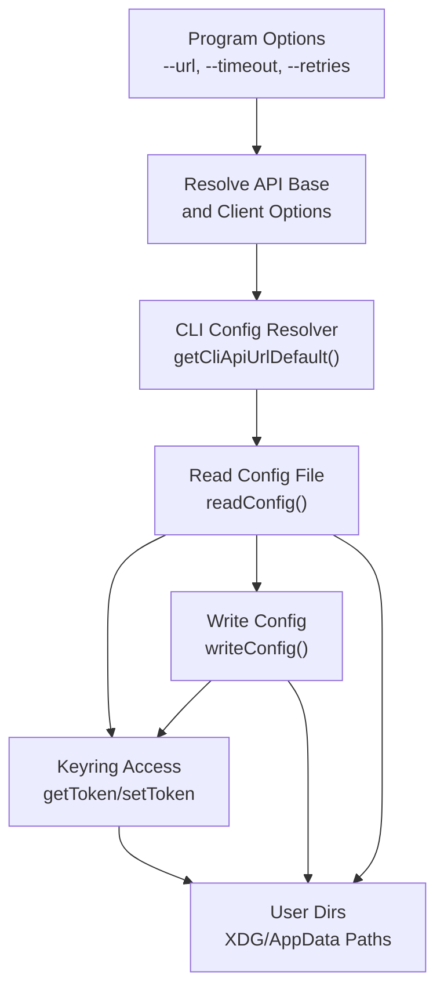
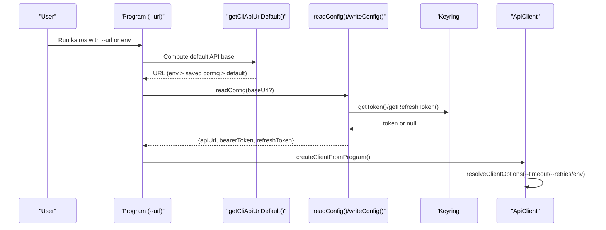
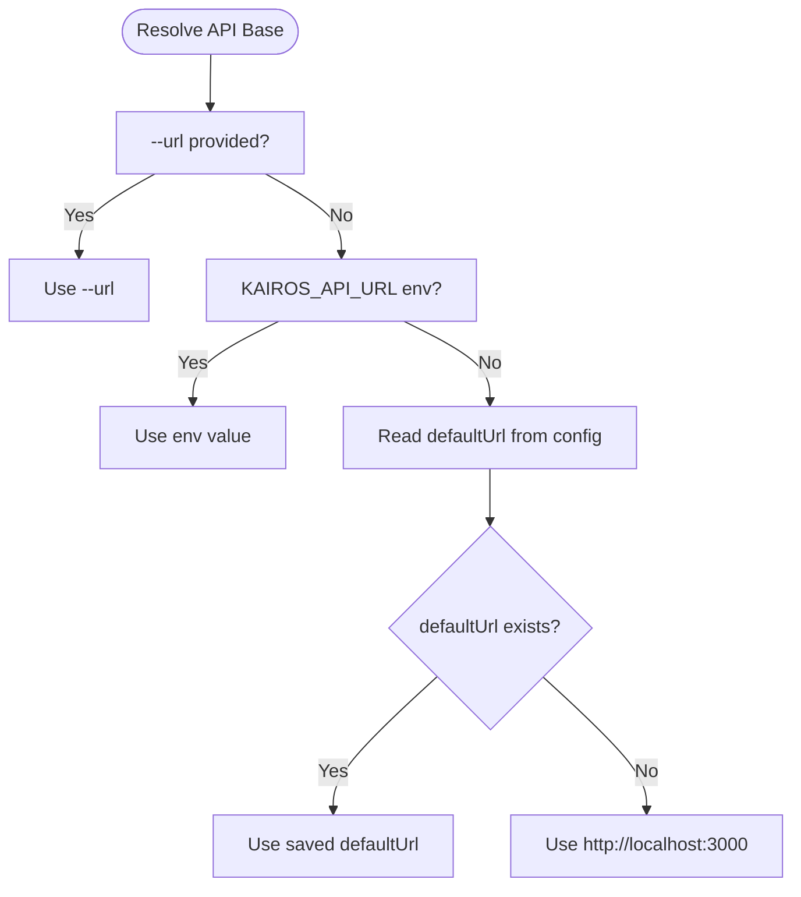
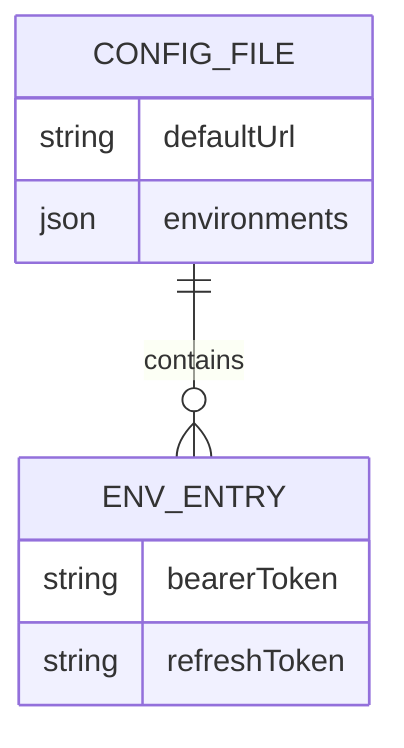
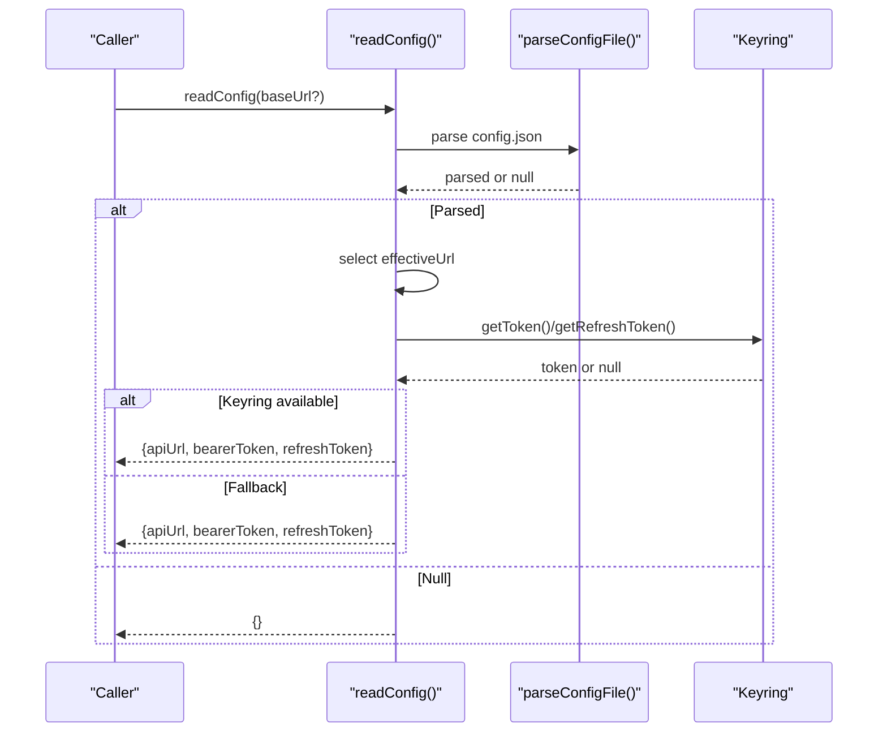
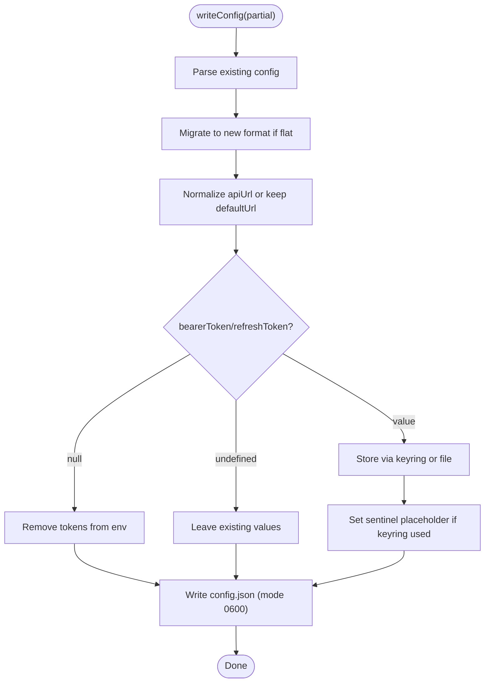
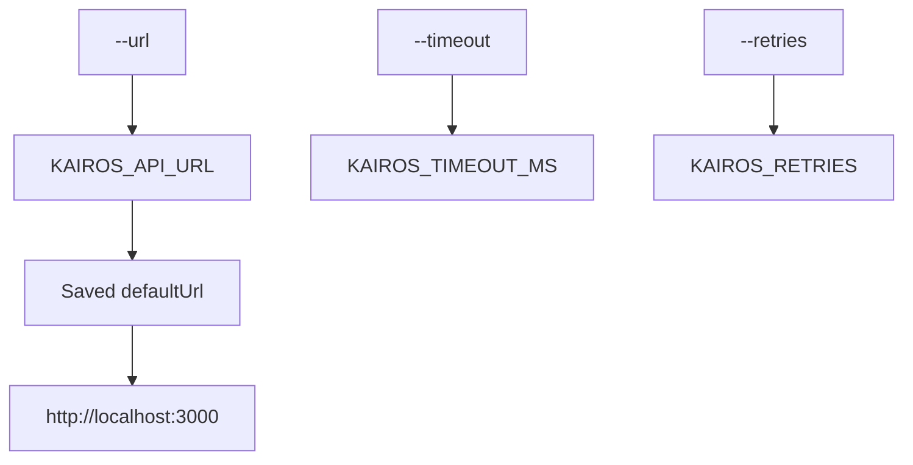
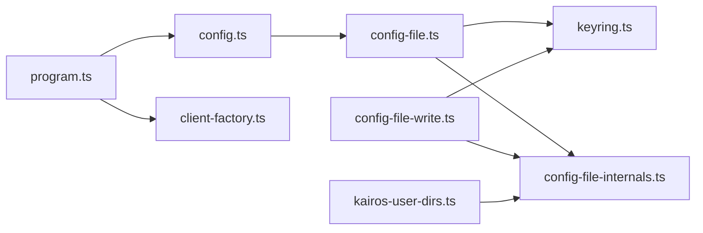

# Configuration Management

<cite>
**Referenced Files in This Document**
- [src/cli/config.ts](file://src/cli/config.ts)
- [src/cli/config-file.ts](file://src/cli/config-file.ts)
- [src/cli/config-file-internals.ts](file://src/cli/config-file-internals.ts)
- [src/cli/config-file-write.ts](file://src/cli/config-file-write.ts)
- [src/cli/keyring.ts](file://src/cli/keyring.ts)
- [src/utils/kairos-user-dirs.ts](file://src/utils/kairos-user-dirs.ts)
- [src/cli/program.ts](file://src/cli/program.ts)
- [src/cli/client-factory.ts](file://src/cli/client-factory.ts)
- [src/cli/commands/login.ts](file://src/cli/commands/login.ts)
- [src/cli/commands/logout.ts](file://src/cli/commands/logout.ts)
- [src/cli/commands/token.ts](file://src/cli/commands/token.ts)
- [docs/CLI.md](file://docs/CLI.md)
</cite>

## Table of Contents
1. [Introduction](#introduction)
2. [Project Structure](#project-structure)
3. [Core Components](#core-components)
4. [Architecture Overview](#architecture-overview)
5. [Detailed Component Analysis](#detailed-component-analysis)
6. [Dependency Analysis](#dependency-analysis)
7. [Performance Considerations](#performance-considerations)
8. [Troubleshooting Guide](#troubleshooting-guide)
9. [Conclusion](#conclusion)
10. [Appendices](#appendices)

## Introduction
This document explains how the KAIROS MCP CLI manages configuration, including the configuration file structure, environment variable precedence, runtime loading, validation, defaults, overrides, and security practices. It covers how the CLI resolves the API base URL, stores and retrieves tokens, and migrates legacy configuration formats. It also provides examples for multi-environment setups, troubleshooting, and best practices for secure configuration handling.

## Project Structure
The configuration system spans several CLI modules:
- Program-level option parsing and environment synchronization
- Configuration file read/write and migration
- Keyring-backed secure credential storage
- User directory utilities for cross-platform config paths
- Client factory for resolving timeouts and retries from flags and environment variables

**Diagram sources**
- [src/cli/program.ts:31-74](file://src/cli/program.ts#L31-L74)
- [src/cli/config.ts:11-24](file://src/cli/config.ts#L11-L24)
- [src/cli/config-file.ts:77-188](file://src/cli/config-file.ts#L77-L188)
- [src/cli/config-file-write.ts:39-166](file://src/cli/config-file-write.ts#L39-L166)
- [src/cli/keyring.ts:43-120](file://src/cli/keyring.ts#L43-120)
- [src/utils/kairos-user-dirs.ts:14-35](file://src/utils/kairos-user-dirs.ts#L14-L35)

**Section sources**
- [src/cli/program.ts:31-74](file://src/cli/program.ts#L31-L74)
- [src/cli/config.ts:11-24](file://src/cli/config.ts#L11-L24)
- [src/cli/config-file.ts:77-188](file://src/cli/config-file.ts#L77-L188)
- [src/cli/config-file-write.ts:39-166](file://src/cli/config-file-write.ts#L39-L166)
- [src/cli/keyring.ts:43-120](file://src/cli/keyring.ts#L43-120)
- [src/utils/kairos-user-dirs.ts:14-35](file://src/utils/kairos-user-dirs.ts#L14-L35)

## Core Components
- API base URL resolution: The CLI resolves the API base URL from flags, environment variables, saved config, and a default fallback.
- Configuration file: Stores defaultUrl and environments with optional bearer and refresh tokens; supports migration from a single-environment flat format.
- Keyring integration: OS-native secure storage for tokens; falls back to the config file when unavailable.
- Client options: Timeout and retries are resolved from CLI flags, environment variables, and defaults.
- Commands: Login, logout, and token commands operate on the current environment’s credentials.

**Section sources**
- [src/cli/config.ts:11-24](file://src/cli/config.ts#L11-L24)
- [src/cli/config-file.ts:77-188](file://src/cli/config-file.ts#L77-L188)
- [src/cli/config-file-internals.ts:44-67](file://src/cli/config-file-internals.ts#L44-L67)
- [src/cli/keyring.ts:43-120](file://src/cli/keyring.ts#L43-L120)
- [src/cli/client-factory.ts:14-55](file://src/cli/client-factory.ts#L14-L55)
- [src/cli/commands/login.ts:35-61](file://src/cli/commands/login.ts#L35-L61)
- [src/cli/commands/logout.ts:10-18](file://src/cli/commands/logout.ts#L10-L18)
- [src/cli/commands/token.ts:10-48](file://src/cli/commands/token.ts#L10-L48)

## Architecture Overview
The configuration pipeline integrates CLI options, environment variables, and persistent storage:

**Diagram sources**
- [src/cli/program.ts:38-54](file://src/cli/program.ts#L38-L54)
- [src/cli/config.ts:11-24](file://src/cli/config.ts#L11-L24)
- [src/cli/config-file.ts:77-188](file://src/cli/config-file.ts#L77-L188)
- [src/cli/config-file-write.ts:39-166](file://src/cli/config-file-write.ts#L39-L166)
- [src/cli/keyring.ts:50-120](file://src/cli/keyring.ts#L50-L120)
- [src/cli/client-factory.ts:53-55](file://src/cli/client-factory.ts#L53-L55)

## Detailed Component Analysis

### API Base URL Resolution
- Precedence: CLI flag (--url) > environment variable (KAIROS_API_URL) > saved defaultUrl in config > fallback to http://localhost:3000.
- The program synchronizes --url into KAIROS_API_URL for downstream consumers.
- The resolver also exposes a convenience getter for the API base URL.

**Diagram sources**
- [src/cli/program.ts:38-54](file://src/cli/program.ts#L38-L54)
- [src/cli/config.ts:11-24](file://src/cli/config.ts#L11-L24)

**Section sources**
- [src/cli/config.ts:11-24](file://src/cli/config.ts#L11-L24)
- [src/cli/program.ts:38-54](file://src/cli/program.ts#L38-L54)
- [docs/CLI.md:47-60](file://docs/CLI.md#L47-L60)

### Configuration File Format and Migration
- New format: defaultUrl plus environments map keyed by normalized API base URL. Each environment entry can contain bearerToken and refreshToken.
- Legacy single-environment flat format: KAIROS_API_URL, bearerToken, refreshToken at top level. First read/write migrates to the new format.
- Tokens are stored in the OS keyring when available; otherwise, they are written to the config file. A sentinel marker indicates keyring-backed secrets.

**Diagram sources**
- [src/cli/config-file.ts:32-37](file://src/cli/config-file.ts#L32-L37)
- [src/cli/config-file-internals.ts:17-23](file://src/cli/config-file-internals.ts#L17-L23)
- [src/cli/config-file-internals.ts:33-42](file://src/cli/config-file-internals.ts#L33-L42)

**Section sources**
- [src/cli/config-file.ts:1-11](file://src/cli/config-file.ts#L1-L11)
- [src/cli/config-file-internals.ts:17-67](file://src/cli/config-file-internals.ts#L17-L67)
- [src/cli/config-file.ts:77-188](file://src/cli/config-file.ts#L77-L188)
- [docs/CLI.md:87-139](file://docs/CLI.md#L87-L139)

### Runtime Loading and Credential Resolution
- readConfig loads the file, normalizes URLs, selects the effective environment, and resolves tokens from the keyring when available. If keyring is unavailable or fails, it falls back to the file.
- On first read, inline tokens are migrated to the keyring and replaced with sentinel markers in the file.
- The effective environment is either the explicitly requested URL or the defaultUrl; if neither is available, an empty object is returned.

**Diagram sources**
- [src/cli/config-file.ts:77-188](file://src/cli/config-file.ts#L77-L188)
- [src/cli/keyring.ts:50-120](file://src/cli/keyring.ts#L50-L120)
- [src/cli/config-file-internals.ts:44-52](file://src/cli/config-file-internals.ts#L44-L52)

**Section sources**
- [src/cli/config-file.ts:77-188](file://src/cli/config-file.ts#L77-L188)
- [src/cli/keyring.ts:50-120](file://src/cli/keyring.ts#L50-L120)
- [src/cli/config-file-internals.ts:44-52](file://src/cli/config-file-internals.ts#L44-L52)

### Writing and Overriding Configuration
- writeConfig updates defaultUrl and environments, migrating from legacy format if needed.
- When keyring is available, tokens are stored there; otherwise, they are written to the file. Sentinel placeholders indicate keyring-backed secrets.
- Passing null removes tokens for the selected environment; passing undefined leaves existing values unchanged.

**Diagram sources**
- [src/cli/config-file-write.ts:39-166](file://src/cli/config-file-write.ts#L39-L166)
- [src/cli/keyring.ts:64-87](file://src/cli/keyring.ts#L64-L87)
- [src/cli/config-file-internals.ts:54-59](file://src/cli/config-file-internals.ts#L54-L59)

**Section sources**
- [src/cli/config-file-write.ts:39-166](file://src/cli/config-file-write.ts#L39-L166)
- [src/cli/keyring.ts:64-87](file://src/cli/keyring.ts#L64-L87)
- [src/cli/config-file-internals.ts:54-59](file://src/cli/config-file-internals.ts#L54-L59)

### Environment Variable Precedence and Overrides
- API base URL precedence: --url > KAIROS_API_URL > saved config defaultUrl > http://localhost:3000.
- Timeout and retries precedence: CLI flags > environment variables > defaults.
- The program injects KAIROS_API_URL and KAIROS_NO_BROWSER into the environment during preAction for nested commands.

**Diagram sources**
- [src/cli/program.ts:38-54](file://src/cli/program.ts#L38-L54)
- [src/cli/client-factory.ts:14-55](file://src/cli/client-factory.ts#L14-L55)
- [src/cli/config.ts:11-24](file://src/cli/config.ts#L11-L24)

**Section sources**
- [src/cli/program.ts:38-54](file://src/cli/program.ts#L38-L54)
- [src/cli/client-factory.ts:14-55](file://src/cli/client-factory.ts#L14-L55)
- [src/cli/config.ts:11-24](file://src/cli/config.ts#L11-L24)
- [docs/CLI.md:47-85](file://docs/CLI.md#L47-L85)

### Multi-Environment Configurations
- The environments map allows storing distinct credentials per normalized API base URL. Switching environments is implicit via --url or KAIROS_API_URL.
- Tokens are scoped to the normalized base URL; a token for one host/port is not reused for another.

**Section sources**
- [src/cli/config-file.ts:138-153](file://src/cli/config-file.ts#L138-L153)
- [src/cli/config-file.ts:359-374](file://src/cli/config-file.ts#L359-L374)
- [docs/CLI.md:370-374](file://docs/CLI.md#L370-L374)

### Security and Credential Management
- Keyring-first storage: Tokens are stored in the OS keyring when available; otherwise, a one-time warning is printed and tokens are stored in the config file.
- Sentinel markers: When keyring is used, the file contains placeholders indicating secrets are managed externally.
- File permissions: The config file is written with restrictive permissions to protect secrets.
- Refresh tokens: Stored separately from access tokens in the keyring; handled similarly to access tokens.

**Section sources**
- [src/cli/config-file-write.ts:26-31](file://src/cli/config-file-write.ts#L26-L31)
- [src/cli/config-file-write.ts:77-89](file://src/cli/config-file-write.ts#L77-L89)
- [src/cli/config-file-write.ts:95-107](file://src/cli/config-file-write.ts#L95-L107)
- [src/cli/config-file.ts:44-54](file://src/cli/config-file.ts#L44-L54)
- [src/cli/config-file-internals.ts:58](file://src/cli/config-file-internals.ts#L58)
- [src/cli/keyring.ts:10-18](file://src/cli/keyring.ts#L10-L18)
- [src/cli/keyring.ts:111-120](file://src/cli/keyring.ts#L111-L120)
- [docs/CLI.md:87-139](file://docs/CLI.md#L87-L139)

### Validation and Defaults
- Token validation: The login command validates tokens by calling the server’s user endpoint before storing them.
- Defaults: If no config exists or no defaultUrl is set, the resolver falls back to a localhost URL.
- Client defaults: Timeout defaults to a fixed value; retries default to a fixed value when not specified.

**Section sources**
- [src/cli/commands/login.ts:48-61](file://src/cli/commands/login.ts#L48-L61)
- [src/cli/config.ts:11-24](file://src/cli/config.ts#L11-L24)
- [src/cli/client-factory.ts:14-55](file://src/cli/client-factory.ts#L14-L55)

### Examples and Workflows
- Browser PKCE login: The login command opens an auth URL and stores both access and refresh tokens when available.
- Store an existing token: Validates the token against the server and stores it without refresh token.
- Logout: Clears stored credentials for the current environment.
- Token inspection: Prints the stored token and optionally validates it or triggers login.

**Section sources**
- [src/cli/commands/login.ts:69-196](file://src/cli/commands/login.ts#L69-L196)
- [src/cli/commands/login.ts:48-61](file://src/cli/commands/login.ts#L48-L61)
- [src/cli/commands/logout.ts:10-18](file://src/cli/commands/logout.ts#L10-L18)
- [src/cli/commands/token.ts:10-48](file://src/cli/commands/token.ts#L10-L48)

## Dependency Analysis
The configuration system exhibits clear separation of concerns:
- Program orchestrates option parsing and environment propagation.
- Config resolver centralizes URL precedence.
- Config file module encapsulates read/write and migration logic.
- Keyring module abstracts OS credential storage.
- Client factory resolves HTTP client options independently of configuration.

**Diagram sources**
- [src/cli/program.ts:31-74](file://src/cli/program.ts#L31-L74)
- [src/cli/config.ts:11-24](file://src/cli/config.ts#L11-L24)
- [src/cli/config-file.ts:77-188](file://src/cli/config-file.ts#L77-L188)
- [src/cli/config-file-internals.ts:44-67](file://src/cli/config-file-internals.ts#L44-L67)
- [src/cli/config-file-write.ts:39-166](file://src/cli/config-file-write.ts#L39-L166)
- [src/cli/keyring.ts:43-120](file://src/cli/keyring.ts#L43-L120)
- [src/utils/kairos-user-dirs.ts:14-35](file://src/utils/kairos-user-dirs.ts#L14-L35)

**Section sources**
- [src/cli/program.ts:31-74](file://src/cli/program.ts#L31-L74)
- [src/cli/config.ts:11-24](file://src/cli/config.ts#L11-L24)
- [src/cli/config-file.ts:77-188](file://src/cli/config-file.ts#L77-L188)
- [src/cli/config-file-write.ts:39-166](file://src/cli/config-file-write.ts#L39-L166)
- [src/cli/keyring.ts:43-120](file://src/cli/keyring.ts#L43-L120)
- [src/cli/config-file-internals.ts:44-67](file://src/cli/config-file-internals.ts#L44-L67)
- [src/utils/kairos-user-dirs.ts:14-35](file://src/utils/kairos-user-dirs.ts#L14-L35)

## Performance Considerations
- Keyring availability: When available, token retrieval is delegated to the OS keyring, avoiding repeated file IO for sensitive data.
- Single-pass migration: During first read, inline tokens are migrated to the keyring and the file updated once, minimizing future overhead.
- Minimal file I/O: Configuration is read on demand and cached implicitly by the process lifetime; frequent writes are avoided except during login/logout.

[No sources needed since this section provides general guidance]

## Troubleshooting Guide
Common issues and resolutions:
- Command not found: Verify Node.js version and reinstall the package.
- Connection refused or timeout: Confirm the server is reachable and the correct --url or KAIROS_API_URL is used.
- Authentication required: Run login with browser PKCE or store an existing token; ensure the token is valid.
- Stored token not used: Remember that tokens are stored per normalized API base URL; switching ports or hosts requires separate credentials.
- Keyring fallback warnings: If the keyring is unavailable, tokens are stored in the config file; ensure the file permissions are restrictive.

**Section sources**
- [docs/CLI.md:335-382](file://docs/CLI.md#L335-L382)
- [src/cli/config-file-write.ts:26-31](file://src/cli/config-file-write.ts#L26-L31)
- [src/cli/config-file.ts:359-374](file://src/cli/config-file.ts#L359-L374)

## Conclusion
The KAIROS MCP CLI configuration system provides a robust, secure, and flexible mechanism for managing API base URLs and credentials. It prioritizes OS-native keyring storage, supports multi-environment configurations, and offers clear precedence rules for environment variables and CLI flags. By following the recommended practices and using the provided commands, users can maintain secure and reliable configurations across environments.

## Appendices

### Configuration File Location
- Unix: $XDG_CONFIG_HOME/kairos/config.json or ~/.config/kairos/config.json
- Windows: %APPDATA%\kairos\config.json

**Section sources**
- [src/utils/kairos-user-dirs.ts:14-21](file://src/utils/kairos-user-dirs.ts#L14-L21)
- [docs/CLI.md:89-94](file://docs/CLI.md#L89-L94)

### Best Practices for Configuration File Handling
- Prefer keyring-backed storage when available; avoid manual editing of sensitive values.
- Use environment variables for CI/automation and CLI flags for interactive sessions.
- Keep the config file private; restrict file permissions to prevent unauthorized access.
- Use normalized API base URLs consistently across environments to avoid credential confusion.

**Section sources**
- [src/cli/config-file-write.ts:26-31](file://src/cli/config-file-write.ts#L26-L31)
- [src/cli/config-file-internals.ts:58](file://src/cli/config-file-internals.ts#L58)
- [docs/CLI.md:87-139](file://docs/CLI.md#L87-L139)