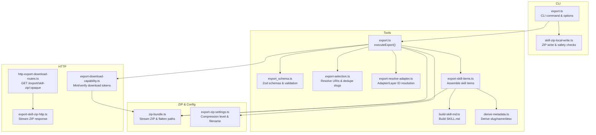
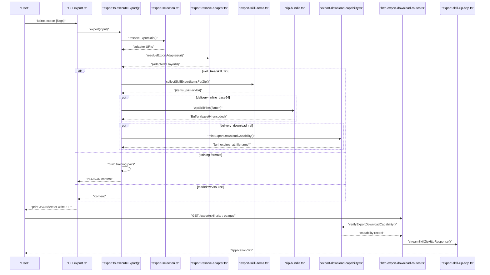
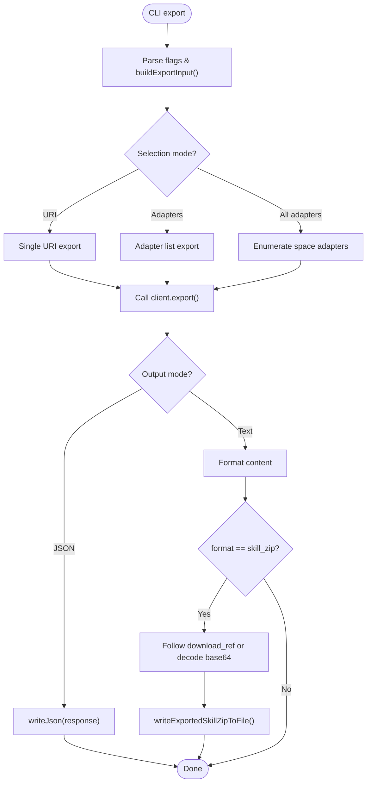
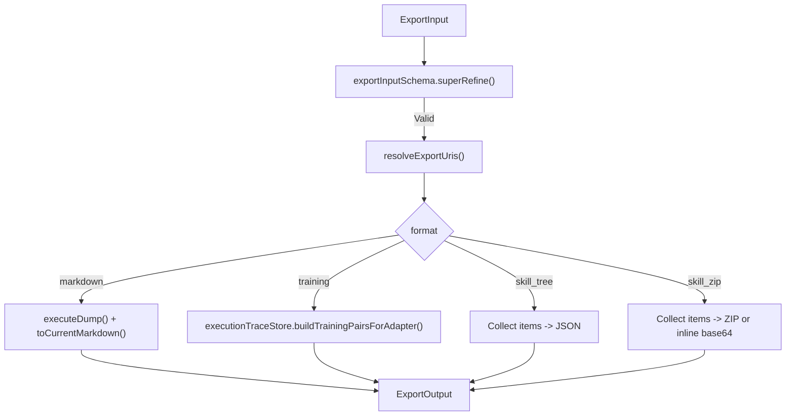
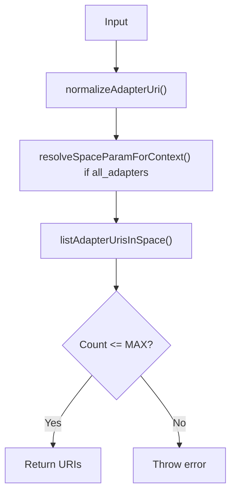
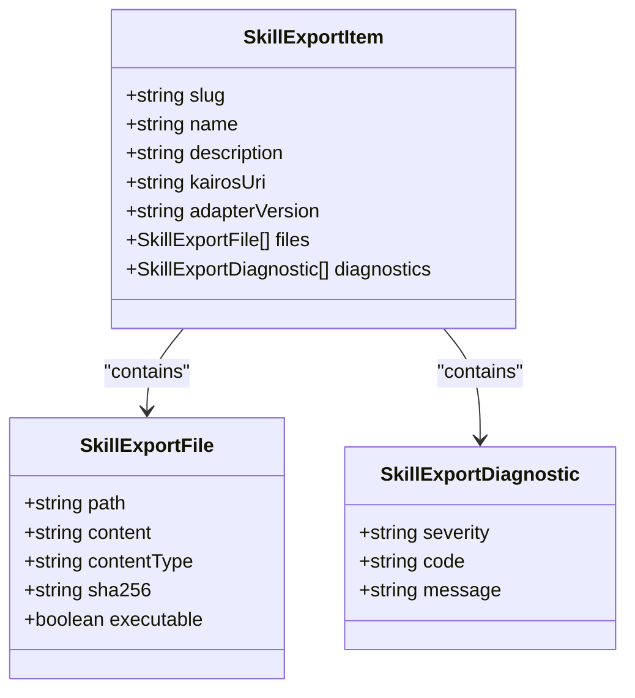
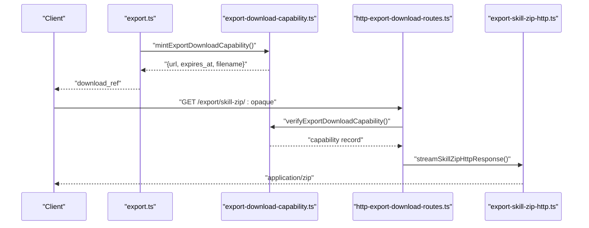
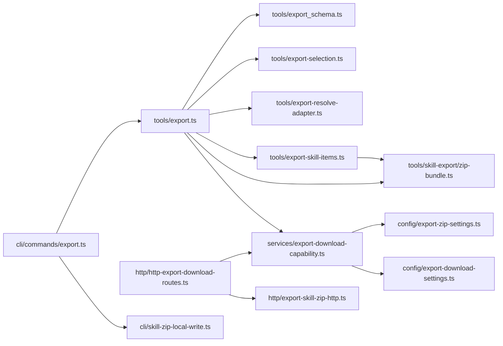

# Export Commands

<cite>
**Referenced Files in This Document**
- [export.ts](file://src/cli/commands/export.ts)
- [export.ts](file://src/tools/export.ts)
- [export_schema.ts](file://src/tools/export_schema.ts)
- [export-selection.ts](file://src/tools/export-selection.ts)
- [export-resolve-adapter.ts](file://src/tools/export-resolve-adapter.ts)
- [export-skill-items.ts](file://src/tools/export-skill-items.ts)
- [zip-bundle.ts](file://src/tools/skill-export/zip-bundle.ts)
- [build-skill-md.ts](file://src/tools/skill-export/build-skill-md.ts)
- [derive-metadata.ts](file://src/tools/skill-export/derive-metadata.ts)
- [export-download-capability.ts](file://src/services/export-download-capability.ts)
- [http-export-download-routes.ts](file://src/http/http-export-download-routes.ts)
- [export-skill-zip-http.ts](file://src/http/export-skill-zip-http.ts)
- [export-download-settings.ts](file://src/config/export-download-settings.ts)
- [export-zip-settings.ts](file://src/config/export-zip-settings.ts)
- [skill-zip-local-write.ts](file://src/cli/skill-zip-local-write.ts)
</cite>

## Table of Contents
1. [Introduction](#introduction)
2. [Project Structure](#project-structure)
3. [Core Components](#core-components)
4. [Architecture Overview](#architecture-overview)
5. [Detailed Component Analysis](#detailed-component-analysis)
6. [Dependency Analysis](#dependency-analysis)
7. [Performance Considerations](#performance-considerations)
8. [Troubleshooting Guide](#troubleshooting-guide)
9. [Conclusion](#conclusion)
10. [Appendices](#appendices)

## Introduction
This document explains the KAIROS MCP export commands for downloading skill bundles, training data, and artifacts. It covers supported export formats, selection modes, filtering options, compression settings, output directory management, skill bundle structure, artifact dependency resolution, export validation, and security controls. It also provides examples for selective exports, bulk operations, and CI/CD integration guidance.

## Project Structure
The export functionality spans CLI commands, tool logic, HTTP handlers, configuration, and ZIP packaging utilities. Key areas:
- CLI command definition and option parsing
- Export tool implementation and validation
- Selection and adapter resolution
- Training data generation
- Skill bundle assembly and ZIP creation
- Download capability signing and HTTP streaming
- Configuration for compression and download security

**Diagram sources**
- [export.ts:72-152](file://src/cli/commands/export.ts#L72-L152)
- [export.ts:40-269](file://src/tools/export.ts#L40-L269)
- [export_schema.ts:44-146](file://src/tools/export_schema.ts#L44-L146)
- [export-selection.ts:37-66](file://src/tools/export-selection.ts#L37-L66)
- [export-resolve-adapter.ts:6-44](file://src/tools/export-resolve-adapter.ts#L6-L44)
- [export-skill-items.ts:17-55](file://src/tools/export-skill-items.ts#L17-L55)
- [build-skill-md.ts:18-22](file://src/tools/skill-export/build-skill-md.ts#L18-L22)
- [derive-metadata.ts:62-99](file://src/tools/skill-export/derive-metadata.ts#L62-L99)
- [zip-bundle.ts:11-53](file://src/tools/skill-export/zip-bundle.ts#L11-L53)
- [export-zip-settings.ts:17-27](file://src/config/export-zip-settings.ts#L17-L27)
- [export-download-capability.ts:63-90](file://src/services/export-download-capability.ts#L63-L90)
- [http-export-download-routes.ts:9-47](file://src/http/http-export-download-routes.ts#L9-L47)
- [export-skill-zip-http.ts:11-36](file://src/http/export-skill-zip-http.ts#L11-L36)
- [skill-zip-local-write.ts:41-76](file://src/cli/skill-zip-local-write.ts#L41-L76)

**Section sources**
- [export.ts:72-152](file://src/cli/commands/export.ts#L72-L152)
- [export.ts:40-269](file://src/tools/export.ts#L40-L269)

## Core Components
- CLI export command: parses flags, builds export input, invokes export tool, and writes output or downloads ZIP.
- Export tool: validates input, resolves adapters, selects format, generates content, and returns structured output.
- Selection and adapter resolution: normalizes URIs, supports single URI, adapter lists, or space-wide enumeration.
- Training data formats: trace_jsonl, reward_jsonl, sft_jsonl, preference_jsonl.
- Skill bundle formats: skill_tree (JSON) and skill_zip (ZIP or inline base64).
- Download capability: signed short-lived tokens for ZIP downloads.
- ZIP configuration: compression level and default filename.
- CLI ZIP write: safety checks and output path resolution.

**Section sources**
- [export.ts:8-17](file://src/cli/commands/export.ts#L8-L17)
- [export.ts:40-269](file://src/tools/export.ts#L40-L269)
- [export_schema.ts:24-33](file://src/tools/export_schema.ts#L24-L33)
- [export-selection.ts:37-66](file://src/tools/export-selection.ts#L37-L66)
- [export-resolve-adapter.ts:6-44](file://src/tools/export-resolve-adapter.ts#L6-L44)
- [export-download-capability.ts:63-90](file://src/services/export-download-capability.ts#L63-L90)
- [export-zip-settings.ts:17-27](file://src/config/export-zip-settings.ts#L17-L27)
- [skill-zip-local-write.ts:41-76](file://src/cli/skill-zip-local-write.ts#L41-L76)

## Architecture Overview
End-to-end export flow for CLI and HTTP:

**Diagram sources**
- [export.ts:96-151](file://src/cli/commands/export.ts#L96-L151)
- [export.ts:62-269](file://src/tools/export.ts#L62-L269)
- [export-selection.ts:37-66](file://src/tools/export-selection.ts#L37-L66)
- [export-resolve-adapter.ts:6-44](file://src/tools/export-resolve-adapter.ts#L6-L44)
- [export-skill-items.ts:17-55](file://src/tools/export-skill-items.ts#L17-L55)
- [zip-bundle.ts:39-53](file://src/tools/skill-export/zip-bundle.ts#L39-L53)
- [export-download-capability.ts:63-90](file://src/services/export-download-capability.ts#L63-L90)
- [http-export-download-routes.ts:14-46](file://src/http/http-export-download-routes.ts#L14-L46)
- [export-skill-zip-http.ts:11-36](file://src/http/export-skill-zip-http.ts#L11-L36)

## Detailed Component Analysis

### CLI Export Command
- Supports mutually exclusive selection modes:
  - Single adapter/layer URI positional argument
  - Repeatable --adapters selecting multiple adapter URIs/slugs
  - --all-adapters enumerates adapters in a named space (requires --space-name)
- Output modes:
  - --output text prints formatted content (markdown or NDJSON)
  - --output json prints the full structured response
  - --json-only and --no-download suppress download following for skill_zip
- ZIP handling:
  - --zip-out sets the output file path for skill_zip
  - When returning inline base64 or download_ref, the CLI writes the ZIP to disk after validation

**Diagram sources**
- [export.ts:28-70](file://src/cli/commands/export.ts#L28-L70)
- [export.ts:96-151](file://src/cli/commands/export.ts#L96-L151)
- [skill-zip-local-write.ts:73-76](file://src/cli/skill-zip-local-write.ts#L73-L76)

**Section sources**
- [export.ts:72-152](file://src/cli/commands/export.ts#L72-L152)
- [export.ts:8-17](file://src/cli/commands/export.ts#L8-L17)

### Export Tool Implementation
- Validates input against Zod schema, ensuring exactly one selection mode and correct format constraints.
- Resolves adapter URIs and adapter IDs; supports artifact source exports.
- Generates:
  - Flat markdown for a single adapter
  - Training data in NDJSON formats (trace, reward, SFT, preference)
  - Skill tree (JSON) or skill ZIP (binary or inline base64)
- Emits telemetry and structured metadata (adapter name/version, counts, optional manifest).

**Diagram sources**
- [export.ts:62-269](file://src/tools/export.ts#L62-L269)
- [export_schema.ts:44-113](file://src/tools/export_schema.ts#L44-L113)
- [export-selection.ts:37-66](file://src/tools/export-selection.ts#L37-L66)

**Section sources**
- [export.ts:40-269](file://src/tools/export.ts#L40-L269)
- [export_schema.ts:44-113](file://src/tools/export_schema.ts#L44-L113)

### Selection and Adapter Resolution
- Normalizes adapter slugs to URIs and deduplicates slugs across items.
- Enumerates adapters in a space when requested, enforcing a maximum count.
- Resolves adapter and layer IDs from URIs or slugs, using Qdrant when needed.

**Diagram sources**
- [export-selection.ts:37-66](file://src/tools/export-selection.ts#L37-L66)
- [export_schema.ts](file://src/tools/export_schema.ts#L22)

**Section sources**
- [export-selection.ts:37-66](file://src/tools/export-selection.ts#L37-L66)
- [export-resolve-adapter.ts:6-44](file://src/tools/export-resolve-adapter.ts#L6-L44)

### Training Data Formats
- Supported formats: trace_jsonl, reward_jsonl, sft_jsonl, preference_jsonl.
- Require a single adapter URI; each produces newline-delimited JSON content.
- Reward inclusion controlled by include_reward flag.

**Section sources**
- [export.ts:119-174](file://src/tools/export.ts#L119-L174)
- [export_schema.ts:24-42](file://src/tools/export_schema.ts#L24-L42)

### Skill Bundle Assembly and ZIP Packaging
- Collects skill items per adapter, merges artifacts, appends SHA256 sums, and deduplicates slugs.
- Builds either:
  - skill_tree: JSON with per-skill entries and file arrays
  - skill_zip: downloadable ZIP or inline base64 with manifest and SHA256
- ZIP compression level is configurable; default filename is standardized.

**Diagram sources**
- [export-skill-items.ts:21-29](file://src/tools/export-skill-items.ts#L21-L29)
- [derive-metadata.ts:53-57](file://src/tools/skill-export/derive-metadata.ts#L53-L57)
- [build-skill-md.ts:18-22](file://src/tools/skill-export/build-skill-md.ts#L18-L22)

**Section sources**
- [export-skill-items.ts:17-55](file://src/tools/export-skill-items.ts#L17-L55)
- [zip-bundle.ts:39-53](file://src/tools/skill-export/zip-bundle.ts#L39-L53)
- [export-zip-settings.ts:17-27](file://src/config/export-zip-settings.ts#L17-L27)

### Download Capability and HTTP Streaming
- For skill_zip with download_ref, a signed, short-lived token is minted with an opaque payload.
- HTTP route verifies the token, reconstructs space context, and streams ZIP bytes to the client.
- CLI can also write ZIP to disk when returning inline base64 or following download_ref.

**Diagram sources**
- [export.ts:242-263](file://src/tools/export.ts#L242-L263)
- [export-download-capability.ts:63-90](file://src/services/export-download-capability.ts#L63-L90)
- [http-export-download-routes.ts:14-46](file://src/http/http-export-download-routes.ts#L14-L46)
- [export-skill-zip-http.ts:11-36](file://src/http/export-skill-zip-http.ts#L11-L36)

**Section sources**
- [export-download-capability.ts:63-111](file://src/services/export-download-capability.ts#L63-L111)
- [http-export-download-routes.ts:9-47](file://src/http/http-export-download-routes.ts#L9-L47)
- [export-skill-zip-http.ts:11-36](file://src/http/export-skill-zip-http.ts#L11-L36)

### Validation and Constraints
- Exactly one selection mode: URI, adapters list, or all_adapters with space_name.
- Format constraints:
  - markdown requires a single URI
  - training formats require a single adapter URI
  - skill_tree/skill_zip support multiple adapters
- Maximum adapters per export is enforced.
- Delivery mode is only valid for skill_zip.

**Section sources**
- [export_schema.ts:54-113](file://src/tools/export_schema.ts#L54-L113)

### Export Formats and Options
- markdown: flat single-file adapter Markdown
- skill_tree: JSON with per-skill files and diagnostics
- skill_zip: ZIP archive or inline base64; supports delivery modes
- source: artifact source content
- trace_jsonl, reward_jsonl, sft_jsonl, preference_jsonl: training datasets
- Filtering options:
  - Single URI
  - Multiple adapters via --adapters
  - All adapters in a space via --all-adapters with --space-name
- Compression settings:
  - KAIROS_EXPORT_ZIP_COMPRESSION_LEVEL (0–9)
  - Default filename for ZIP downloads
- Output directory management:
  - CLI: --zip-out to specify output path; otherwise defaults to current working directory with sanitized filename
  - Safety checks prevent unsafe paths and oversized ZIPs

**Section sources**
- [export.ts:24-33](file://src/tools/export.ts#L24-L33)
- [export.ts:84-95](file://src/cli/commands/export.ts#L84-L95)
- [export-zip-settings.ts:17-27](file://src/config/export-zip-settings.ts#L17-L27)
- [skill-zip-local-write.ts:41-76](file://src/cli/skill-zip-local-write.ts#L41-L76)

### Security and Access Control
- Download links are signed with HMAC and short expiration; verification rejects tampered or expired tokens.
- Environment variables control secret and TTL; public base URL resolution supports flexible hosting.
- Artifact exports use separate capability tokens and headers for integrity (SHA-256).
- CLI ZIP writes enforce ZIP signature checks and size limits.

**Section sources**
- [export-download-capability.ts:44-56](file://src/services/export-download-capability.ts#L44-L56)
- [export-download-capability.ts:63-90](file://src/services/export-download-capability.ts#L63-L90)
- [export-download-settings.ts:17-30](file://src/config/export-download-settings.ts#L17-L30)
- [skill-zip-local-write.ts:56-70](file://src/cli/skill-zip-local-write.ts#L56-L70)

### Examples and Workflows
- Selective export of a single adapter to markdown:
  - kairos export kairos://adapter/my-slug --format markdown
- Export multiple adapters as a skill tree:
  - kairos export --adapters kairos://adapter/a --adapters kairos://adapter/b --format skill_tree
- Bulk export of all adapters in a space:
  - kairos export --all-adapters --space-name "My Space" --format skill_zip
- Download ZIP via CLI:
  - kairos export --adapters kairos://adapter/a --format skill_zip --output text --zip-out ./bundle.zip
- Use JSON output to inspect download_ref:
  - kairos export --adapters kairos://adapter/a --format skill_zip --output json
- CI/CD integration:
  - Use --output json to capture download_ref and follow with curl/wget
  - Set KAIROS_EXPORT_ZIP_COMPRESSION_LEVEL and KAIROS_EXPORT_ZIP_MAX_DOWNLOAD_BYTES for pipeline stability
  - For artifact exports, use the artifact download endpoint with opaque token

**Section sources**
- [export.ts:72-152](file://src/cli/commands/export.ts#L72-L152)
- [export.ts:242-263](file://src/tools/export.ts#L242-L263)
- [export-download-settings.ts:17-30](file://src/config/export-download-settings.ts#L17-L30)
- [skill-zip-local-write.ts:41-76](file://src/cli/skill-zip-local-write.ts#L41-L76)

## Dependency Analysis
Key dependencies and coupling:
- CLI depends on export tool and client factory; writes ZIP via dedicated utility.
- Export tool depends on selection, adapter resolution, training store, and ZIP utilities.
- ZIP utilities depend on configuration for compression level.
- Download capability depends on configuration and storage; HTTP routes depend on capability verification.

**Diagram sources**
- [export.ts:1-7](file://src/cli/commands/export.ts#L1-L7)
- [export.ts:1-26](file://src/tools/export.ts#L1-L26)
- [export_selection.ts:1-6](file://src/tools/export-selection.ts#L1-L6)
- [export-resolve-adapter.ts:1-4](file://src/tools/export-resolve-adapter.ts#L1-L4)
- [export-skill-items.ts:1-12](file://src/tools/export-skill-items.ts#L1-L12)
- [zip-bundle.ts:1-8](file://src/tools/skill-export/zip-bundle.ts#L1-L8)
- [export-download-capability.ts:1-12](file://src/services/export-download-capability.ts#L1-L12)
- [export-zip-settings.ts:1-8](file://src/config/export-zip-settings.ts#L1-L8)
- [export-download-settings.ts:1-8](file://src/config/export-download-settings.ts#L1-L8)
- [http-export-download-routes.ts:1-7](file://src/http/http-export-download-routes.ts#L1-L7)
- [export-skill-zip-http.ts:1-9](file://src/http/export-skill-zip-http.ts#L1-L9)
- [skill-zip-local-write.ts:1-9](file://src/cli/skill-zip-local-write.ts#L1-L9)

**Section sources**
- [export.ts:1-7](file://src/cli/commands/export.ts#L1-L7)
- [export.ts:1-26](file://src/tools/export.ts#L1-L26)

## Performance Considerations
- Compression level: Lower values reduce CPU but increase file size; higher values increase CPU but reduce bandwidth/storage.
- Streaming ZIP: ZIP is streamed to avoid buffering the entire archive in memory.
- Max adapter count: Prevents excessive memory and processing during multi-adapter exports.
- Inline base64 vs download_ref: Prefer download_ref for large ZIPs to avoid large JSON payloads.

[No sources needed since this section provides general guidance]

## Troubleshooting Guide
- Export requires exactly one selection mode; combining URI, adapters list, and all_adapters is invalid.
- markdown requires a single URI; use skill_tree or skill_zip for multiple adapters.
- Training formats require a single adapter URI.
- skill_zip with download_ref missing or inline base64 absent: use --output json to inspect response.
- Empty or non-ZIP download: indicates server-side issue or misconfiguration; check --output json and logs.
- Excessive adapters: exceeds maximum per export; reduce selection or split operations.
- Download link invalid/expired: verify token signature and TTL; regenerate capability.

**Section sources**
- [export.ts:36-54](file://src/cli/commands/export.ts#L36-L54)
- [export.ts:84-117](file://src/tools/export.ts#L84-L117)
- [export.ts:125-174](file://src/tools/export.ts#L125-L174)
- [export.ts:132-145](file://src/tools/export.ts#L132-L145)
- [export_schema.ts:54-113](file://src/tools/export_schema.ts#L54-L113)

## Conclusion
The export subsystem provides robust, secure, and flexible mechanisms to export adapter content, training data, and skill bundles. It enforces strict validation, supports multiple selection modes, offers configurable compression and output options, and secures downloads with short-lived, signed capabilities. Integrating with CI/CD involves capturing JSON responses and following download_ref URLs or streaming ZIPs directly.

[No sources needed since this section summarizes without analyzing specific files]

## Appendices

### Appendix A: Export Formats Reference
- markdown: Flat single-file adapter Markdown
- skill_tree: JSON with per-skill files and diagnostics
- skill_zip: ZIP archive or inline base64; includes manifest and SHA256
- source: Artifact source content
- trace_jsonl: Execution traces
- reward_jsonl: Reward-ranked pairs
- sft_jsonl: Supervised fine-tuning items
- preference_jsonl: Preference ranking items

**Section sources**
- [export.ts:24-33](file://src/tools/export.ts#L24-L33)
- [export.ts:119-174](file://src/tools/export.ts#L119-L174)

### Appendix B: Environment Variables
- KAIROS_EXPORT_ZIP_COMPRESSION_LEVEL: Integer 0–9 (default 6)
- KAIROS_EXPORT_ZIP_MAX_DOWNLOAD_BYTES: Positive integer (default ~512 MB)
- KAIROS_EXPORT_DOWNLOAD_SECRET: Secret for signing download tokens
- KAIROS_EXPORT_DOWNLOAD_TTL_SEC: Token TTL in seconds (default 600)
- KAIROS_PUBLIC_BASE_URL / AUTH_CALLBACK_BASE_URL: Public base URL resolution

**Section sources**
- [export-zip-settings.ts:17-27](file://src/config/export-zip-settings.ts#L17-L27)
- [skill-zip-local-write.ts:19-21](file://src/cli/skill-zip-local-write.ts#L19-L21)
- [export-download-settings.ts:17-30](file://src/config/export-download-settings.ts#L17-L30)