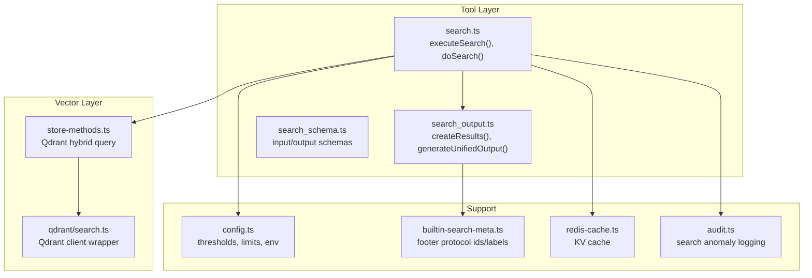
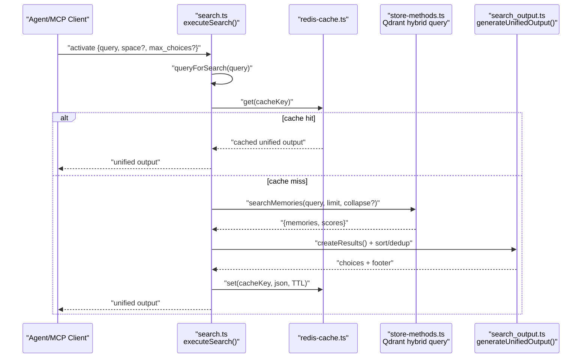
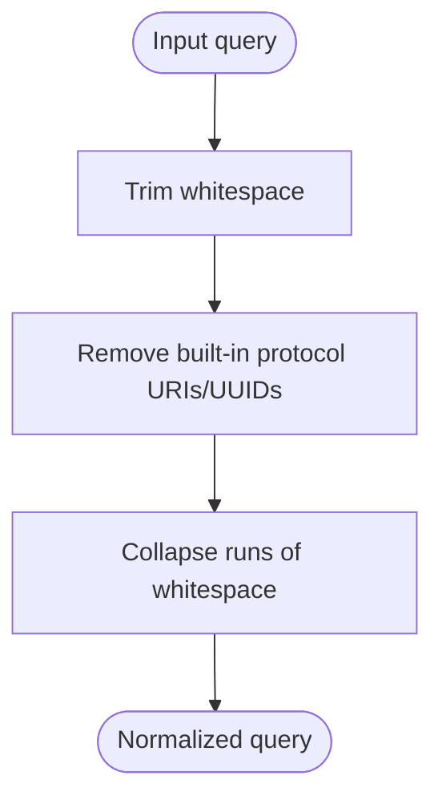
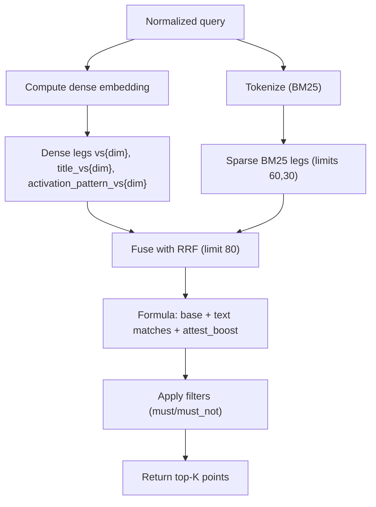
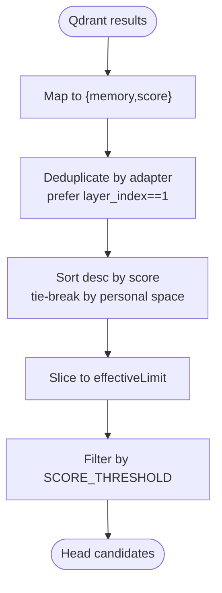
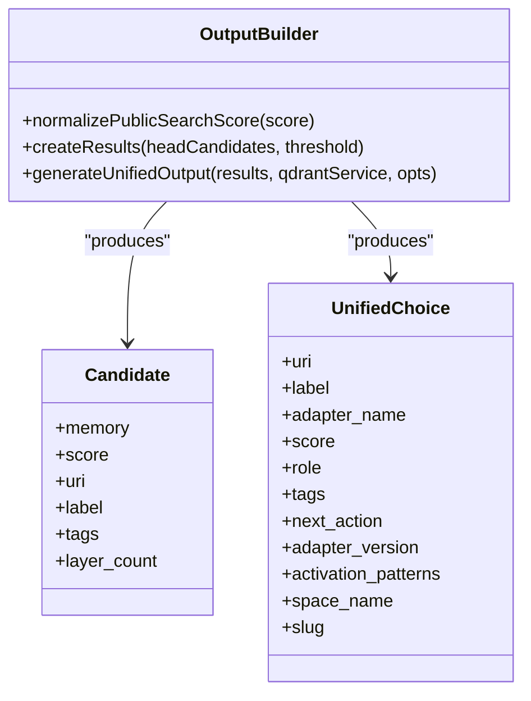
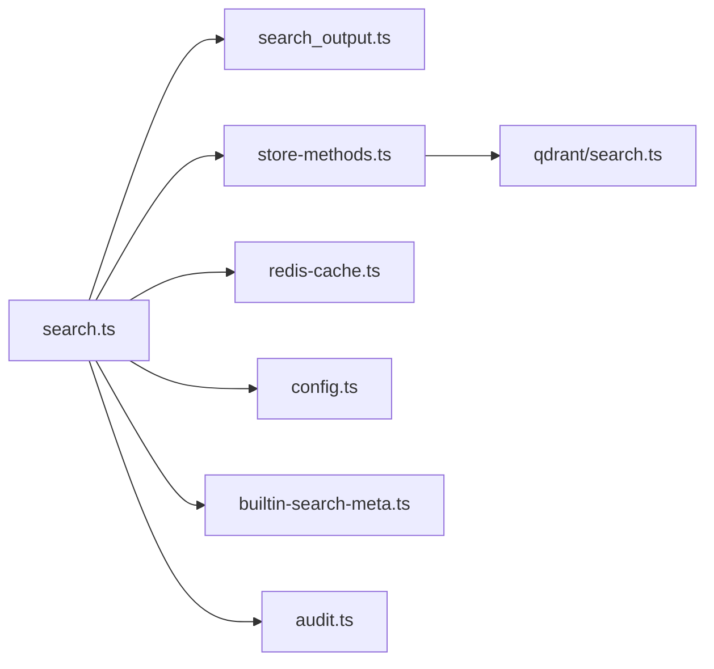

# Search Commands

<cite>
**Referenced Files in This Document**
- [search.ts](file://src/tools/search.ts)
- [search_output.ts](file://src/tools/search_output.ts)
- [search_schema.ts](file://src/tools/search_schema.ts)
- [search-query.md](file://docs/architecture/search-query.md)
- [store-methods.ts](file://src/services/memory/store-methods.ts)
- [qdrant-search.ts](file://src/services/qdrant/search.ts)
- [audit.ts](file://src/services/embedding/audit.ts)
- [config.ts](file://src/config.ts)
- [builtin-search-meta.ts](file://src/constants/builtin-search-meta.ts)
- [redis-cache.ts](file://src/services/redis-cache.ts)
- [kairos-search-case1.test.ts](file://tests/integration/kairos-search-case1.test.ts)
- [kairos-search-case2.test.ts](file://tests/integration/kairos-search-case2.test.ts)
- [kairos-search-case4.test.ts](file://tests/integration/kairos-search-case4.test.ts)
</cite>

## Table of Contents
1. [Introduction](#introduction)
2. [Project Structure](#project-structure)
3. [Core Components](#core-components)
4. [Architecture Overview](#architecture-overview)
5. [Detailed Component Analysis](#detailed-component-analysis)
6. [Dependency Analysis](#dependency-analysis)
7. [Performance Considerations](#performance-considerations)
8. [Troubleshooting Guide](#troubleshooting-guide)
9. [Conclusion](#conclusion)

## Introduction
This document explains the KAIROS MCP search commands that power protocol and artifact discovery. It focuses on the activate tool (the primary entry point), the underlying hybrid search pipeline, query normalization, semantic search mechanics, vector similarity, filters, result ranking, and output formatting. It also covers advanced query patterns, boolean operators, result interpretation, performance optimization, caching strategies, and troubleshooting accuracy issues.

## Project Structure
The search command spans several layers:
- Tool layer: input validation, cache, candidate building, and unified output generation
- Vector layer: hybrid Qdrant search combining dense vectors, BM25 sparse terms, and payload boosts
- Output layer: normalization to bounded confidence, footer choices, and choice deduplication
- Configuration and constants: thresholds, limits, and built-in protocol metadata

**Diagram sources**
- [search.ts:187-248](file://src/tools/search.ts#L187-L248)
- [search_output.ts:77-238](file://src/tools/search_output.ts#L77-L238)
- [search_schema.ts:11-52](file://src/tools/search_schema.ts#L11-L52)
- [store-methods.ts:150-243](file://src/services/memory/store-methods.ts#L150-L243)
- [qdrant-search.ts:27-44](file://src/services/qdrant/search.ts#L27-L44)
- [config.ts:258-268](file://src/config.ts#L258-L268)
- [builtin-search-meta.ts:5-50](file://src/constants/builtin-search-meta.ts#L5-L50)
- [redis-cache.ts:21-240](file://src/services/redis-cache.ts#L21-L240)
- [audit.ts:159-195](file://src/services/embedding/audit.ts#L159-L195)

**Section sources**
- [search.ts:187-248](file://src/tools/search.ts#L187-L248)
- [search_output.ts:77-238](file://src/tools/search_output.ts#L77-L238)
- [search_schema.ts:11-52](file://src/tools/search_schema.ts#L11-L52)
- [store-methods.ts:150-243](file://src/services/memory/store-methods.ts#L150-L243)
- [qdrant-search.ts:27-44](file://src/services/qdrant/search.ts#L27-L44)
- [config.ts:258-268](file://src/config.ts#L258-L268)
- [builtin-search-meta.ts:5-50](file://src/constants/builtin-search-meta.ts#L5-L50)
- [redis-cache.ts:21-240](file://src/services/redis-cache.ts#L21-L240)
- [audit.ts:159-195](file://src/services/embedding/audit.ts#L159-L195)

## Core Components
- Search tool entry point: validates input, normalizes query, applies cache, executes hybrid vector search, and produces unified output with match choices and footer actions.
- Hybrid vector search: dense embeddings, adapter title, activation patterns, and BM25 sparse terms fused with reciprocal rank fusion, then boosted by payload quality metrics.
- Output normalization: converts raw Qdrant scores into bounded public confidence and appends refine/create footer choices.
- Configuration: tunable thresholds, limits, and flags controlling search behavior and performance.

**Section sources**
- [search.ts:187-248](file://src/tools/search.ts#L187-L248)
- [search_output.ts:77-238](file://src/tools/search_output.ts#L77-L238)
- [store-methods.ts:150-243](file://src/services/memory/store-methods.ts#L150-L243)
- [config.ts:258-268](file://src/config.ts#L258-L268)

## Architecture Overview
The search pipeline follows a strict order: input normalization, cache lookup, vector retrieval, candidate consolidation, normalization, and unified output assembly.

**Diagram sources**
- [search.ts:187-248](file://src/tools/search.ts#L187-L248)
- [redis-cache.ts:21-240](file://src/services/redis-cache.ts#L21-L240)
- [store-methods.ts:150-243](file://src/services/memory/store-methods.ts#L150-L243)
- [search_output.ts:117-238](file://src/tools/search_output.ts#L117-L238)

## Detailed Component Analysis

### Query Syntax and Normalization
- Query normalization strips built-in refine/create protocol URIs and UUIDs from the query to avoid literal matches for those protocols. This ensures the query targets user adapters and artifacts.
- After stripping, whitespace is collapsed and trimmed. An empty query after normalization still returns refine/create choices.

**Diagram sources**
- [search.ts:37-51](file://src/tools/search.ts#L37-L51)
- [builtin-search-meta.ts:5-12](file://src/constants/builtin-search-meta.ts#L5-L12)

**Section sources**
- [search.ts:37-51](file://src/tools/search.ts#L37-L51)
- [builtin-search-meta.ts:5-12](file://src/constants/builtin-search-meta.ts#L5-L12)

### Semantic Search and Vector Similarity
- Hybrid search in Qdrant:
  - Dense vector legs: query embedding against primary, adapter title, and activation pattern vector fields
  - Sparse BM25 legs: tokenize query and search against sparse fields with two different limits
  - Fusion: reciprocal rank fusion (RRF) merges heterogeneous signals
  - Outer formula: adds payload-based boosts (e.g., attest_boost) and textual match weights for adapter name, activation patterns, label, and tags
- Fallback: if the Query API fails, falls back to a plain dense search with the same filter and rescore.
- Filters:
  - Must: space_id in allowed set, adapter.layer_index == 1
  - Must_not: exclude built-in refine protocol by UUID

**Diagram sources**
- [store-methods.ts:150-243](file://src/services/memory/store-methods.ts#L150-L243)
- [search-query.md:89-136](file://docs/architecture/search-query.md#L89-L136)

**Section sources**
- [store-methods.ts:150-243](file://src/services/memory/store-methods.ts#L150-L243)
- [search-query.md:89-136](file://docs/architecture/search-query.md#L89-L136)

### Filtering Options and Space Scope
- Allowed spaces include the current context’s allowed spaces plus the KAIROS app space. Search runs within this union.
- Adapter heads only (layer_index == 1) are considered; built-in refine protocol is excluded by UUID in the filter.

**Section sources**
- [search-query.md:82-87](file://docs/architecture/search-query.md#L82-L87)
- [store-methods.ts:129-134](file://src/services/memory/store-methods.ts#L129-L134)

### Candidate Building and Ranking
- Candidates are collected from Qdrant results, deduplicated by adapter (prefer entry layer), and sorted by score with tie-breaking favoring personal/default write space.
- Thresholding: candidates are filtered by SCORE_THRESHOLD (normalized to public confidence).
- Limiting: enforced by effectiveLimit derived from max_choices with min/max caps.

**Diagram sources**
- [search.ts:97-115](file://src/tools/search.ts#L97-L115)
- [search.ts:139-181](file://src/tools/search.ts#L139-L181)

**Section sources**
- [search.ts:97-115](file://src/tools/search.ts#L97-L115)
- [search.ts:139-181](file://src/tools/search.ts#L139-L181)

### Unified Output and Footer Choices
- Public confidence: raw scores are normalized using a pivot to a 0.0–1.0 range.
- Choices: match rows include uri, label, adapter_name, score, role, tags, next_action, adapter_version, activation_patterns, space_name, and slug.
- Footer choices: refine and create are appended unconditionally (role: refine/create) with their respective next_actions and protocol versions resolved from Qdrant when available.
- Chain root resolution: for chained adapters, the root step may be substituted for a clearer entry URI/label.

**Diagram sources**
- [search_output.ts:43-115](file://src/tools/search_output.ts#L43-L115)
- [search_output.ts:117-238](file://src/tools/search_output.ts#L117-L238)

**Section sources**
- [search_output.ts:70-92](file://src/tools/search_output.ts#L70-L92)
- [search_output.ts:117-238](file://src/tools/search_output.ts#L117-L238)
- [builtin-search-meta.ts:5-50](file://src/constants/builtin-search-meta.ts#L5-L50)

### Boolean Operators and Advanced Queries
- The hybrid query uses BM25 sparse terms and textual match clauses. While explicit boolean operators are not exposed in the tool schema, BM25 tokenization supports multi-term queries. Use natural language phrasing and include relevant keywords to improve recall and precision.
- For precise matching, rely on adapter metadata (title, activation patterns, labels, tags) that are weighted in the outer formula.

**Section sources**
- [store-methods.ts:186-218](file://src/services/memory/store-methods.ts#L186-L218)
- [search-query.md:102-122](file://docs/architecture/search-query.md#L102-L122)

### Search Result Interpretation
- role:
  - match: a discovered adapter/head
  - refine: meta choice to refine search
  - create: meta choice to author a new protocol
- score: normalized 0.0–1.0 confidence; interpret as relative strength among matches
- next_action: per-choice instruction (e.g., forward with the adapter URI)
- tags: metadata tags associated with the adapter
- adapter_version: stored protocol version for matches; null for refine/create
- space_name: human-readable space name for matches; null for refine/create

**Section sources**
- [search_output.ts:160-173](file://src/tools/search_output.ts#L160-L173)
- [search_output.ts:190-216](file://src/tools/search_output.ts#L190-L216)
- [search_schema.ts:27-52](file://src/tools/search_schema.ts#L27-L52)

### Examples of Advanced Search Queries
- Single strong match: use a concise, unique term that aligns with adapter title/activation patterns/labels/tags.
- Multiple matches: phrase the query to disambiguate; include domain-specific keywords to increase discriminative power.
- Zero relevant results: refine the query or choose the create option to register a new adapter/protocol.

Behavioral test coverage demonstrates:
- One perfect match scenario
- Multiple perfect matches scenario
- No relevant results scenario

**Section sources**
- [kairos-search-case1.test.ts:28-120](file://tests/integration/kairos-search-case1.test.ts#L28-L120)
- [kairos-search-case2.test.ts:29-125](file://tests/integration/kairos-search-case2.test.ts#L29-L125)
- [kairos-search-case4.test.ts:28-50](file://tests/integration/kairos-search-case4.test.ts#L28-L50)

## Dependency Analysis
- search.ts depends on:
  - store-methods.ts for vector search
  - redis-cache.ts for unified cache
  - search_output.ts for result shaping
  - config.ts for thresholds and limits
  - builtin-search-meta.ts for footer protocol metadata
  - audit.ts for anomaly logging
- store-methods.ts depends on:
  - qdrant/client for vector operations
  - payload fields for boosting (e.g., attest_boost)

**Diagram sources**
- [search.ts:187-248](file://src/tools/search.ts#L187-L248)
- [search_output.ts:117-238](file://src/tools/search_output.ts#L117-L238)
- [store-methods.ts:150-243](file://src/services/memory/store-methods.ts#L150-L243)
- [qdrant-search.ts:27-44](file://src/services/qdrant/search.ts#L27-L44)
- [redis-cache.ts:21-240](file://src/services/redis-cache.ts#L21-L240)
- [config.ts:258-268](file://src/config.ts#L258-L268)
- [builtin-search-meta.ts:5-50](file://src/constants/builtin-search-meta.ts#L5-L50)
- [audit.ts:159-195](file://src/services/embedding/audit.ts#L159-L195)

**Section sources**
- [search.ts:187-248](file://src/tools/search.ts#L187-L248)
- [search_output.ts:117-238](file://src/tools/search_output.ts#L117-L238)
- [store-methods.ts:150-243](file://src/services/memory/store-methods.ts#L150-L243)
- [qdrant-search.ts:27-44](file://src/services/qdrant/search.ts#L27-L44)
- [redis-cache.ts:21-240](file://src/services/redis-cache.ts#L21-L240)
- [config.ts:258-268](file://src/config.ts#L258-L268)
- [builtin-search-meta.ts:5-50](file://src/constants/builtin-search-meta.ts#L5-L50)
- [audit.ts:159-195](file://src/services/embedding/audit.ts#L159-L195)

## Performance Considerations
- Unified cache:
  - Cache key includes space, normalized query, group collapse flag, and limit; TTL is configurable.
  - Cache hit avoids Qdrant calls and reduces latency.
- Overfetch and limits:
  - Effective limit is bounded by min/max caps; overfetch factor influences initial retrieval.
- Quantization rescore:
  - Rescoring with quantization improves ranking stability and speed.
- Payload boosts:
  - attestation-based boost improves ranking without changing the retrieval model.

**Section sources**
- [search.ts:201-247](file://src/tools/search.ts#L201-L247)
- [config.ts:89-97](file://src/config.ts#L89-L97)
- [store-methods.ts:164-165](file://src/services/memory/store-methods.ts#L164-L165)

## Troubleshooting Guide
Common issues and diagnostics:
- Low confidence or zero results:
  - Verify query length and content; long queries below threshold may produce low scores.
  - Check anomaly logs for “search_zero_results” or “search_low_score” warnings.
- Embedding anomalies:
  - Embedding latency or dimension mismatches trigger warnings; investigate provider/model configuration.
- Accuracy tuning:
  - Adjust SCORE_THRESHOLD to raise or lower the minimum relevance.
  - Increase max_choices for broader exploration.
  - Ensure attest_boost is populated for better ranking of high-quality adapters.

Operational checks:
- Confirm Qdrant collection and vector field names align with expectations.
- Validate that filters exclude unwanted spaces and built-in refine protocol.
- Inspect cache backend availability and TTL behavior.

**Section sources**
- [audit.ts:159-195](file://src/services/embedding/audit.ts#L159-L195)
- [config.ts:258-268](file://src/config.ts#L258-L268)
- [search-query.md:176-182](file://docs/architecture/search-query.md#L176-L182)

## Conclusion
The KAIROS search command integrates a robust hybrid retrieval pipeline with payload-driven ranking, strict normalization, and a unified output format. By leveraging query normalization, careful filtering, and cache-aware execution, it delivers accurate, interpretable results and actionable next steps. Tuning thresholds, limits, and payload boosts enables reliable adaptation to diverse use cases.