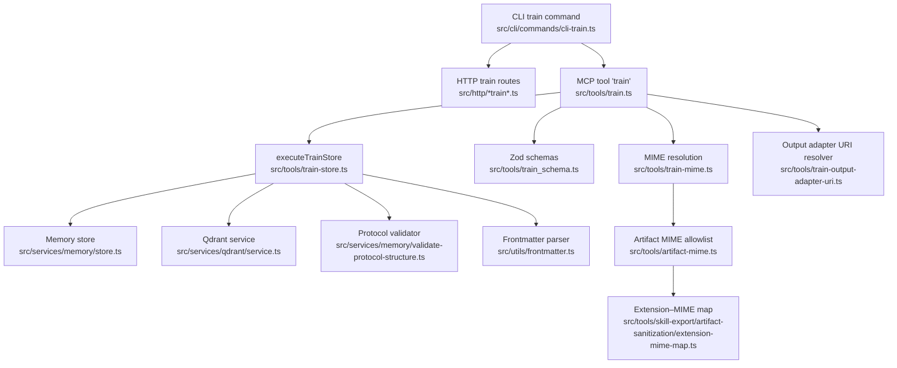
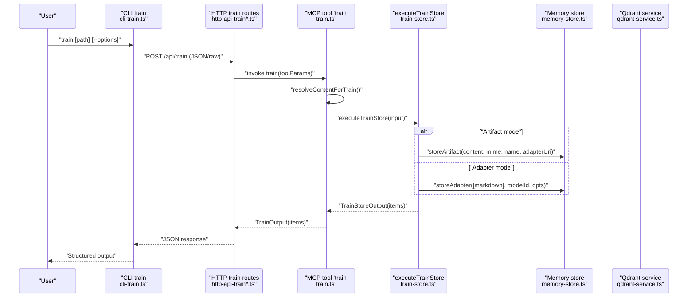
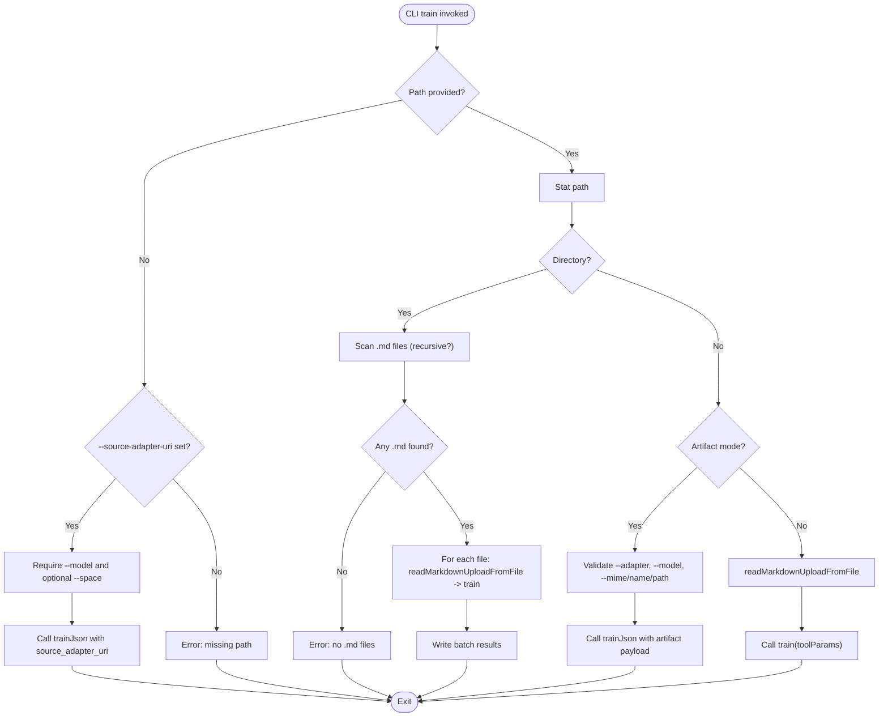
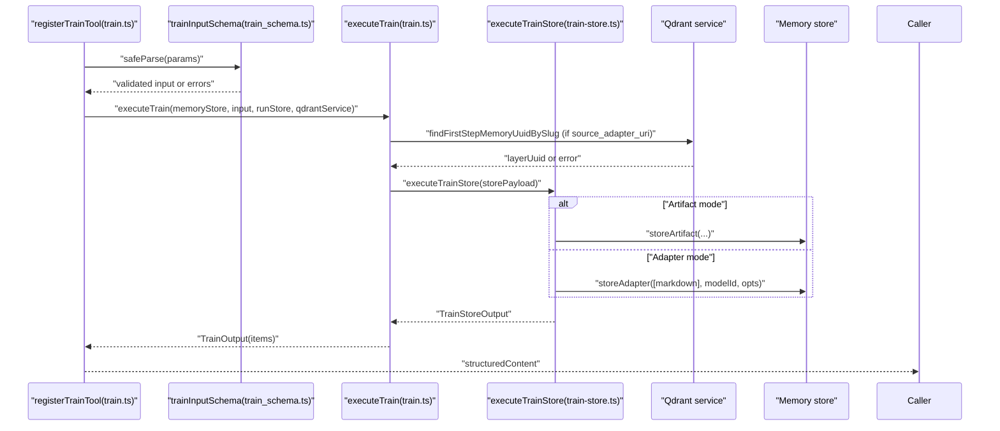
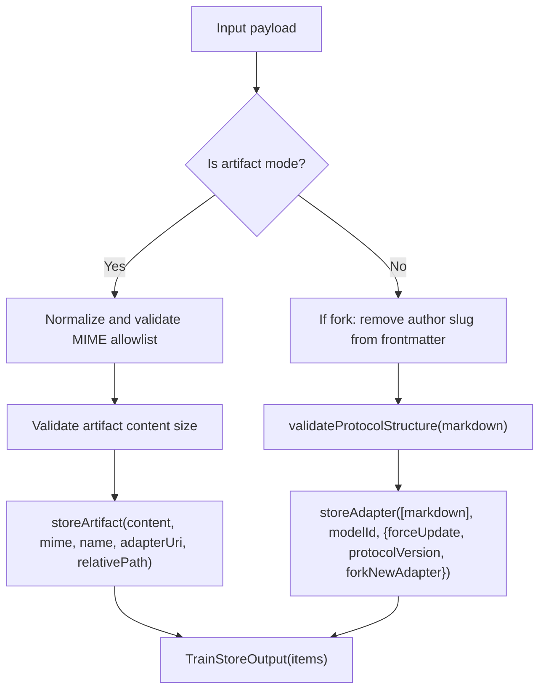
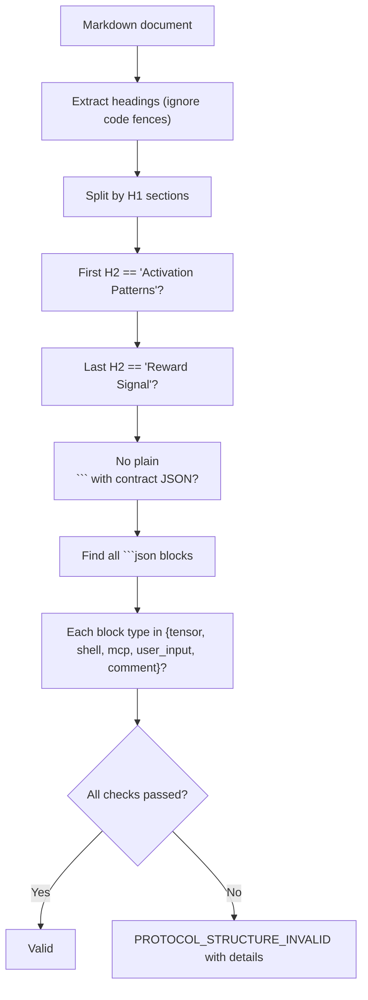
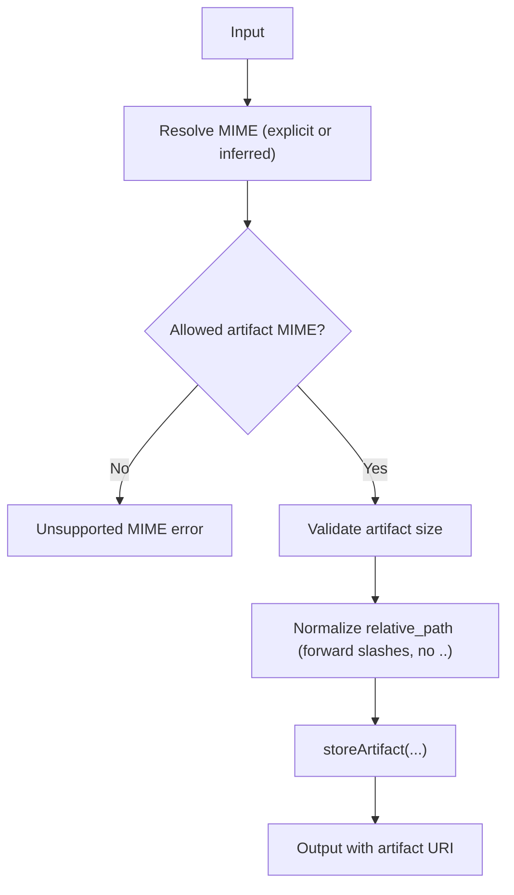
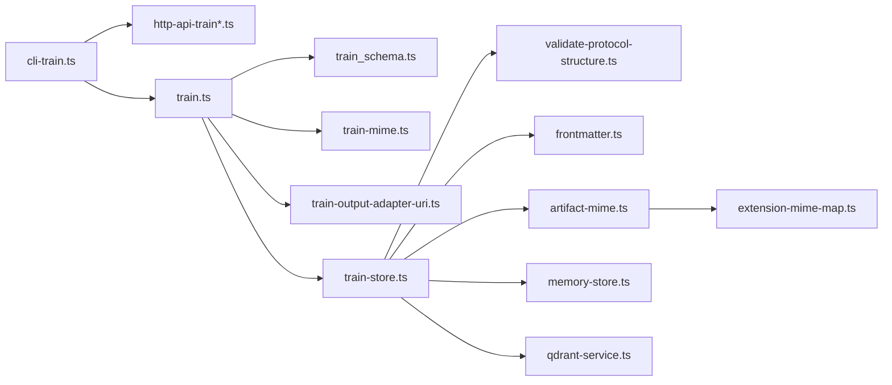

# Training Commands

<cite>
**Referenced Files in This Document**
- [cli-train.ts](file://src/cli/commands/cli-train.ts)
- [train.ts](file://src/tools/train.ts)
- [train-store.ts](file://src/tools/train-store.ts)
- [train_schema.ts](file://src/tools/train_schema.ts)
- [train-mime.ts](file://src/tools/train-mime.ts)
- [train-artifact-adapter-uri.ts](file://src/tools/train-artifact-adapter-uri.ts)
- [train-output-adapter-uri.ts](file://src/tools/train-output-adapter-uri.ts)
- [artifact-mime.ts](file://src/tools/artifact-mime.ts)
- [validate-protocol-structure.ts](file://src/services/memory/validate-protocol-structure.ts)
- [frontmatter.ts](file://src/utils/frontmatter.ts)
- [extension-mime-map.ts](file://src/tools/skill-export/artifact-sanitization/extension-mime-map.ts)
- [upload-guards.ts](file://src/cli/upload-guards.ts)
- [artifact-mime.ts](file://src/tools/artifact-mime.ts)
- [artifact-relative-path.ts](file://src/tools/artifact-relative-path.ts)
- [kairos-uri.ts](file://src/tools/kairos-uri.ts)
- [qdrant-service.ts](file://src/services/qdrant/service.ts)
- [memory-store.ts](file://src/services/memory/store.ts)
- [http-api-train-json.ts](file://src/http/http-api-train-json.ts)
- [http-api-train-raw.ts](file://src/http/http-api-train-raw.ts)
- [cli-commands-shared.ts](file://tests/integration/cli-commands-shared.ts)
- [cli-train-batch.test.ts](file://tests/integration/cli-train-batch.test.ts)
- [http-api-train-json.test.ts](file://tests/integration/http-api-train-json.test.ts)
- [http-api-train-similarity-guard.test.ts](file://tests/integration/http-api-train-similarity-guard.test.ts)
- [http-api-train-space-errors.test.ts](file://tests/integration/http-api-train-space-errors.test.ts)
- [kairos-train-basic.test.ts](file://tests/integration/kairos-train-basic.test.ts)
- [kairos-train-artifact.test.ts](file://tests/integration/kairos-train-artifact.test.ts)
- [kairos-train-validation.test.ts](file://tests/integration/kairos-train-validation.test.ts)
- [kairos-train-import-data.test.ts](file://tests/integration/kairos-train-import-data.test.ts)
- [kairos-train-integration.test.ts](file://tests/integration/kairos-train-integration.test.ts)
- [kairos-train-access.test.ts](file://tests/integration/kairos-train-access.test.ts)
- [kairos-train-edge-cases.test.ts](file://tests/integration/kairos-train-edge-cases.test.ts)
- [kairos-train-docs-examples.test.ts](file://tests/integration/kairos-train-docs-examples.test.ts)
- [kairos-train-ai-coding-rules.test.ts](file://tests/integration/kairos-train-ai-coding-rules.test.ts)
- [kairos-train-heading-sanitization.test.ts](file://tests/integration/kairos-train-heading-sanitization.test.ts)
- [train-mime.test.ts](file://tests/unit/train-mime.test.ts)
- [train-schema-fork.test.ts](file://tests/unit/train-schema-fork.test.ts)
- [train-schema-relative-path.test.ts](file://tests/unit/train-schema-relative-path.test.ts)
- [train-similarity-query.test.ts](file://tests/unit/train-similarity-query.test.ts)
- [train-similarity-guard.test.ts](file://tests/unit/train-similarity-guard.test.ts)
- [train-artifact-adapter-uri.test.ts](file://tests/unit/train-artifact-adapter-uri.test.ts)
- [train-artifact-mime-inference.test.ts](file://tests/unit/train-artifact-mime-inference.test.ts)
- [train-artifact-adapter-uri.test.ts](file://tests/unit/train-artifact-adapter-uri.test.ts)
- [train-artifact-adapter-uri.test.ts](file://tests/unit/train-artifact-adapter-uri.test.ts)
</cite>

## Table of Contents
1. [Introduction](#introduction)
2. [Project Structure](#project-structure)
3. [Core Components](#core-components)
4. [Architecture Overview](#architecture-overview)
5. [Detailed Component Analysis](#detailed-component-analysis)
6. [Dependency Analysis](#dependency-analysis)
7. [Performance Considerations](#performance-considerations)
8. [Troubleshooting Guide](#troubleshooting-guide)
9. [Conclusion](#conclusion)
10. [Appendices](#appendices)

## Introduction
This document explains the KAIROS MCP training commands that enable registering adapters from protocol markdown and attaching artifacts to adapters. It covers:
- The train command for single files and directory batches
- Protocol markdown syntax and validation rules
- Artifact attachment, MIME inference, and relative path handling
- Embedding configuration and quality assurance checks
- Batch processing, error handling, and performance optimization
- Integration with external data sources and validation pipelines

## Project Structure
The training subsystem spans CLI, HTTP APIs, tools, services, and validation utilities:
- CLI command implementation and batch orchestration
- Tool registration and input/output schemas
- Store-level persistence for adapters and artifacts
- Validation of protocol structure and size limits
- MIME allowlists and inference for artifacts
- Qdrant-backed adapter lookup and URI resolution



**Diagram sources**
- [cli-train.ts:56-276](file://src/cli/commands/cli-train.ts#L56-L276)
- [train.ts:240-346](file://src/tools/train.ts#L240-L346)
- [train-store.ts:47-131](file://src/tools/train-store.ts#L47-L131)
- [train_schema.ts:54-168](file://src/tools/train_schema.ts#L54-L168)
- [train-mime.ts:4-22](file://src/tools/train-mime.ts#L4-L22)
- [train-output-adapter-uri.ts:4-33](file://src/tools/train-output-adapter-uri.ts#L4-L33)
- [validate-protocol-structure.ts:113-187](file://src/services/memory/validate-protocol-structure.ts#L113-L187)
- [frontmatter.ts:23-54](file://src/utils/frontmatter.ts#L23-L54)
- [artifact-mime.ts:34-50](file://src/tools/artifact-mime.ts#L34-L50)
- [extension-mime-map.ts:10-27](file://src/tools/skill-export/artifact-sanitization/extension-mime-map.ts#L10-L27)
- [http-api-train-json.ts](file://src/http/http-api-train-json.ts)
- [http-api-train-raw.ts](file://src/http/http-api-train-raw.ts)
- [memory-store.ts](file://src/services/memory/store.ts)
- [qdrant-service.ts](file://src/services/qdrant/service.ts)

**Section sources**
- [cli-train.ts:56-276](file://src/cli/commands/cli-train.ts#L56-L276)
- [train.ts:240-346](file://src/tools/train.ts#L240-L346)
- [train-store.ts:47-131](file://src/tools/train-store.ts#L47-L131)
- [train_schema.ts:54-168](file://src/tools/train_schema.ts#L54-L168)

## Core Components
- CLI train command: supports single-file and directory batch modes, artifact mode detection, and sensitive content guards.
- MCP tool 'train': validates inputs, resolves content (including forking from another adapter), and persists to memory/Qdrant.
- Store-level persistence: validates protocol structure and sizes, stores adapters or artifacts, and normalizes relative paths for exports.
- Protocol validation: enforces required sections and contract blocks.
- MIME handling: allowlist, normalization, and inference from filenames.
- Adapter URI resolution: canonicalizes adapter URIs for artifacts and constructs output adapter URIs.

**Section sources**
- [cli-train.ts:56-276](file://src/cli/commands/cli-train.ts#L56-L276)
- [train.ts:134-238](file://src/tools/train.ts#L134-L238)
- [train-store.ts:47-131](file://src/tools/train-store.ts#L47-L131)
- [validate-protocol-structure.ts:113-187](file://src/services/memory/validate-protocol-structure.ts#L113-L187)
- [artifact-mime.ts:34-50](file://src/tools/artifact-mime.ts#L34-L50)
- [train-mime.ts:4-22](file://src/tools/train-mime.ts#L4-L22)
- [train-artifact-adapter-uri.ts:5-37](file://src/tools/train-artifact-adapter-uri.ts#L5-L37)
- [train-output-adapter-uri.ts:4-33](file://src/tools/train-output-adapter-uri.ts#L4-L33)

## Architecture Overview
The training pipeline accepts either raw markdown or artifact content, validates inputs, resolves content (including forking), and persists to memory/Qdrant. The MCP tool integrates with space scoping and error formatting.



**Diagram sources**
- [cli-train.ts:77-276](file://src/cli/commands/cli-train.ts#L77-L276)
- [http-api-train-json.ts](file://src/http/http-api-train-json.ts)
- [http-api-train-raw.ts](file://src/http/http-api-train-raw.ts)
- [train.ts:134-238](file://src/tools/train.ts#L134-L238)
- [train-store.ts:47-131](file://src/tools/train-store.ts#L47-L131)
- [memory-store.ts](file://src/services/memory/store.ts)
- [qdrant-service.ts](file://src/services/qdrant/service.ts)

## Detailed Component Analysis

### CLI train command
- Modes:
  - Single file: reads markdown or artifact content, infers artifact mode by flags/MIME, and sends to the MCP tool or HTTP API.
  - Directory batch: recursively scans .md files (skips top-level README.md), applies upload guards, and streams results per file.
  - Fork mode: trains from an existing adapter by exporting its markdown and optionally overriding content.
- Options:
  - Model attribution, force updates, recursive directory scanning, space targeting, artifact-specific flags, and sensitive content allowance.
- Error handling:
  - Validates presence of path, regular file semantics, and artifact mode preconditions; delegates API errors to centralized handlers.



**Diagram sources**
- [cli-train.ts:56-276](file://src/cli/commands/cli-train.ts#L56-L276)

**Section sources**
- [cli-train.ts:56-276](file://src/cli/commands/cli-train.ts#L56-L276)

### MCP tool 'train'
- Input parsing: Zod schema with strict refinements for artifact mode, relative path normalization, and mutual constraints.
- Space resolution: personal vs group spaces with validation and fallbacks.
- Execution:
  - Resolves content (supports forking from another adapter via Qdrant).
  - Determines artifact vs adapter mode and canonicalizes adapter URI for artifacts.
  - Normalizes relative paths for artifact storage.
  - Persists via executeTrainStore and constructs output URIs.
- Error formatting: maps domain errors to user-friendly messages with actionable next steps.



**Diagram sources**
- [train.ts:240-346](file://src/tools/train.ts#L240-L346)
- [train.ts:134-238](file://src/tools/train.ts#L134-L238)
- [train-store.ts:47-131](file://src/tools/train-store.ts#L47-L131)
- [train_schema.ts:54-168](file://src/tools/train_schema.ts#L54-L168)
- [qdrant-service.ts](file://src/services/qdrant/service.ts)

**Section sources**
- [train.ts:240-346](file://src/tools/train.ts#L240-L346)
- [train.ts:134-238](file://src/tools/train.ts#L134-L238)
- [train_schema.ts:54-168](file://src/tools/train_schema.ts#L54-L168)

### Store-level persistence and validation
- Artifact mode:
  - Validates MIME against allowlist and content size.
  - Stores artifact under the specified adapter URI with optional relative path.
- Adapter mode:
  - Removes conflicting author slug when forking to prevent collisions.
  - Validates protocol structure and enforces required sections and contract blocks.
  - Stores adapter with optional protocol version and fork flag.



**Diagram sources**
- [train-store.ts:47-131](file://src/tools/train-store.ts#L47-L131)
- [validate-protocol-structure.ts:113-187](file://src/services/memory/validate-protocol-structure.ts#L113-L187)
- [frontmatter.ts:23-54](file://src/utils/frontmatter.ts#L23-L54)

**Section sources**
- [train-store.ts:47-131](file://src/tools/train-store.ts#L47-L131)
- [validate-protocol-structure.ts:113-187](file://src/services/memory/validate-protocol-structure.ts#L113-L187)
- [frontmatter.ts:23-54](file://src/utils/frontmatter.ts#L23-L54)

### Protocol markdown syntax and validation
- Required structure:
  - At least one H1 title.
  - First H2 must be "Activation Patterns".
  - Last H2 must be "Reward Signal".
  - At least one JSON contract block with allowed types.
- Contract block rules:
  - Only ```json fences are permitted for contract blocks.
  - Contract type must be one of: tensor, shell, mcp, user_input, comment.
- Multi-adapter documents:
  - Each H1 section must satisfy the above constraints.
- Frontmatter:
  - Optional version, title, slug, chain_root; stored separately and used for versioning and chaining.



**Diagram sources**
- [validate-protocol-structure.ts](file://src/services/memory/validate-protocol-structure.ts#L113-L187)

**Section sources**
- [validate-protocol-structure.ts](file://src/services/memory/validate-protocol-structure.ts#L113-L187)
- [frontmatter.ts](file://src/utils/frontmatter.ts#L23-L54)

### Artifact attachment, MIME configuration, and relative paths
- Artifact mode detection:
  - Explicit non-markdown MIME or inferred artifact MIME from filename.
- MIME handling:
  - Allowlist enforced; normalization to lowercase.
  - Inference from filename extension; unknown extensions require explicit MIME.
- Relative path handling:
  - Allowed only for artifacts; normalized and validated to be skill-root-relative without .. segments.
- Adapter URI resolution:
  - Canonicalizes adapter slugs to layer UUIDs via Qdrant when required.



**Diagram sources**
- [train-mime.ts](file://src/tools/train-mime.ts#L4-L22)
- [artifact-mime.ts](file://src/tools/artifact-mime.ts#L34-L50)
- [extension-mime-map.ts](file://src/tools/skill-export/artifact-sanitization/extension-mime-map.ts#L10-L27)
- [artifact-relative-path.ts](file://src/tools/artifact-relative-path.ts)
- [train-artifact-adapter-uri.ts](file://src/tools/train-artifact-adapter-uri.ts#L5-L37)

**Section sources**
- [train-mime.ts](file://src/tools/train-mime.ts#L4-L22)
- [artifact-mime.ts](file://src/tools/artifact-mime.ts#L34-L50)
- [extension-mime-map.ts](file://src/tools/skill-export/artifact-sanitization/extension-mime-map.ts#L10-L27)
- [train-artifact-adapter-uri.ts](file://src/tools/train-artifact-adapter-uri.ts#L5-L37)
- [train-output-adapter-uri.ts](file://src/tools/train-output-adapter-uri.ts#L4-L33)

### Embedding configuration and quality assurance
- Model attribution:
  - llm_model_id is required for both adapter and artifact training.
- Similarity guard:
  - Duplicate or highly similar adapters trigger warnings and guidance to use force_update with the same adapter id.
- Quality metadata:
  - Protocol version can be supplied via frontmatter or input to track adapter evolution.
- Export parity:
  - Relative paths for artifacts are preserved during skill export.

**Section sources**
- [train.ts](file://src/tools/train.ts#L56-L83)
- [train-store.ts](file://src/tools/train-store.ts#L105-L112)
- [frontmatter.ts](file://src/utils/frontmatter.ts#L23-L54)

### Examples of training workflows
- Train a new adapter from markdown:
  - Provide a markdown file with required sections and contract blocks; specify llm_model_id.
- Attach an artifact to an existing adapter:
  - Supply --adapter kairos://adapter/{slug}, --artifact-name, --mime (or infer from extension), and --model.
- Fork from an existing adapter:
  - Use --source-adapter-uri and --model; optional content override.
- Batch training from a directory:
  - Run train on a directory to process all .md files; use --recursive for nested discovery.

**Section sources**
- [cli-train.ts](file://src/cli/commands/cli-train.ts#L139-L183)
- [cli-train.ts](file://src/cli/commands/cli-train.ts#L190-L256)
- [cli-train.ts](file://src/cli/commands/cli-train.ts#L96-L117)

### Error handling for malformed inputs
Common errors and guidance:
- Missing path or invalid file type: ensure a readable file or directory is provided.
- Artifact mode preconditions: adapter_uri and model are required; MIME must be allowed or inferable.
- Protocol structure invalid: ensure required sections and contract blocks conform to rules.
- Similar adapters found: use force_update with the same adapter id or adjust title/content.
- Space errors: verify personal/group space names and permissions.

**Section sources**
- [cli-train.ts](file://src/cli/commands/cli-train.ts#L261-L272)
- [train.ts](file://src/tools/train.ts#L56-L83)
- [train-store.ts](file://src/tools/train-store.ts#L105-L112)
- [http-api-train-space-errors.test.ts](file://tests/integration/http-api-train-space-errors.test.ts)

### Performance optimization techniques
- Batch processing:
  - Use directory mode to process multiple .md files efficiently.
- Concurrency:
  - The CLI iterates sequentially; consider external batching tools for large directories.
- Content size limits:
  - Pre-validate artifact sizes to avoid repeated failures.
- Fork resolution:
  - Prefer exporting content from Qdrant when forking to reduce manual overrides.

**Section sources**
- [cli-train.ts](file://src/cli/commands/cli-train.ts#L150-L182)
- [train-store.ts](file://src/tools/train-store.ts#L70-L73)

### Training data preparation and validation pipelines
- Upload guards:
  - Apply sensitive content checks before reading files.
- Protocol validation:
  - Structural checks and contract block enforcement occur prior to persistence.
- Integration with external data sources:
  - Use --source-adapter-uri to import/export markdown from adapters and augment with local content.

**Section sources**
- [upload-guards.ts](file://src/cli/upload-guards.ts)
- [validate-protocol-structure.ts](file://src/services/memory/validate-protocol-structure.ts#L113-L187)
- [train.ts](file://src/tools/train.ts#L85-L132)

## Dependency Analysis
The training subsystem exhibits clear layering:
- CLI depends on HTTP routes and the MCP tool.
- The MCP tool depends on schemas, MIME resolution, adapter URI resolution, and the store.
- The store depends on memory/Qdrant services and validation utilities.



**Diagram sources**
- [cli-train.ts:56-276](file://src/cli/commands/cli-train.ts#L56-L276)
- [train.ts:240-346](file://src/tools/train.ts#L240-L346)
- [train-store.ts:47-131](file://src/tools/train-store.ts#L47-L131)
- [train_schema.ts:54-168](file://src/tools/train_schema.ts#L54-L168)
- [train-mime.ts:4-22](file://src/tools/train-mime.ts#L4-L22)
- [train-output-adapter-uri.ts:4-33](file://src/tools/train-output-adapter-uri.ts#L4-L33)
- [validate-protocol-structure.ts:113-187](file://src/services/memory/validate-protocol-structure.ts#L113-L187)
- [frontmatter.ts:23-54](file://src/utils/frontmatter.ts#L23-L54)
- [artifact-mime.ts:34-50](file://src/tools/artifact-mime.ts#L34-L50)
- [extension-mime-map.ts:10-27](file://src/tools/skill-export/artifact-sanitization/extension-mime-map.ts#L10-L27)
- [memory-store.ts](file://src/services/memory/store.ts)
- [qdrant-service.ts](file://src/services/qdrant/service.ts)

**Section sources**
- [cli-train.ts:56-276](file://src/cli/commands/cli-train.ts#L56-L276)
- [train.ts:240-346](file://src/tools/train.ts#L240-L346)
- [train-store.ts:47-131](file://src/tools/train-store.ts#L47-L131)

## Performance Considerations
- Prefer artifact MIME inference from filenames to avoid redundant explicit MIME declarations.
- Use batch directory mode for bulk ingestion to minimize overhead.
- Validate artifact sizes early to prevent repeated store attempts.
- Leverage forking to reuse existing adapters and reduce manual content creation.

[No sources needed since this section provides general guidance]

## Troubleshooting Guide
- “Adapter with this label already exists”:
  - Use force_update to overwrite or choose a distinct label/title.
- “Adapter title is very similar to an existing one”:
  - Inspect similarity matches and adjust title/content; use force_update with the same adapter id if intentional.
- “Provide content and/or source_adapter_uri”:
  - Either supply content or a valid source adapter URI.
- “artifact_name is required when mime is non-markdown”:
  - Provide artifact_name and adapter_uri for artifact mode.
- “mime is required when artifact_name extension is unknown”:
  - Specify MIME explicitly for unrecognized extensions.
- “Invalid adapter URI”:
  - Ensure adapter_uri matches kairos://adapter/{slug} and resolves via Qdrant.

**Section sources**
- [train.ts:56-83](file://src/tools/train.ts#L56-L83)
- [train-store.ts:105-112](file://src/tools/train-store.ts#L105-L112)
- [train-artifact-adapter-uri.ts:12-36](file://src/tools/train-artifact-adapter-uri.ts#L12-L36)
- [train_schema.ts:105-152](file://src/tools/train_schema.ts#L105-L152)

## Conclusion
The KAIROS training subsystem provides robust support for registering adapters from protocol markdown and attaching artifacts to adapters. Its layered design ensures strong validation, clear error messaging, and flexible integration with Qdrant and external data sources. By following the guidelines in this document—especially around protocol structure, artifact MIME handling, and batch processing—you can reliably train and evolve adapters at scale.

[No sources needed since this section summarizes without analyzing specific files]

## Appendices

### File format requirements and validation rules
- Protocol markdown:
  - Required sections and contract blocks; no mixed contract fences.
- Artifact content:
  - MIME must be allowed; size limits enforced; filename extension may infer MIME.

**Section sources**
- [validate-protocol-structure.ts:113-187](file://src/services/memory/validate-protocol-structure.ts#L113-L187)
- [artifact-mime.ts:34-50](file://src/tools/artifact-mime.ts#L34-L50)
- [train-store.ts:70-73](file://src/tools/train-store.ts#L70-L73)

### Batch processing capabilities
- Directory scanning:
  - Recursively include .md files; skip top-level README.md.
- Results:
  - Per-file outcomes with status and items returned as JSON.

**Section sources**
- [cli-train.ts:19-42](file://src/cli/commands/cli-train.ts#L19-L42)
- [cli-train.ts:150-182](file://src/cli/commands/cli-train.ts#L150-L182)

### Integration with external data sources
- Forking:
  - Export markdown from an existing adapter and optionally override content.
- Space scoping:
  - Personal or group spaces supported with validation.

**Section sources**
- [train.ts:85-132](file://src/tools/train.ts#L85-L132)
- [train.ts:259-280](file://src/tools/train.ts#L259-L280)