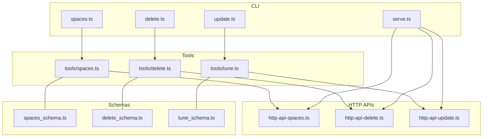
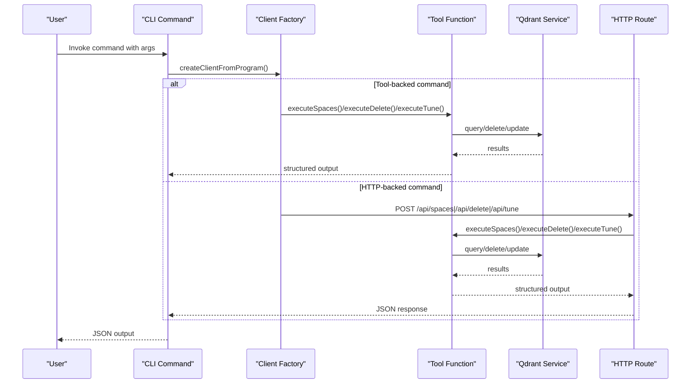
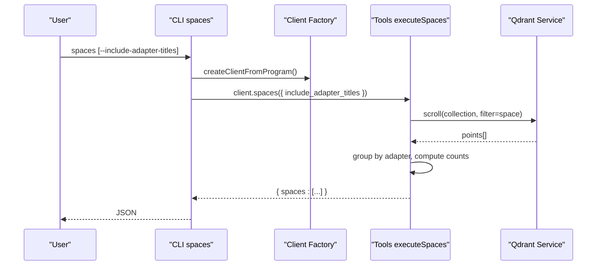
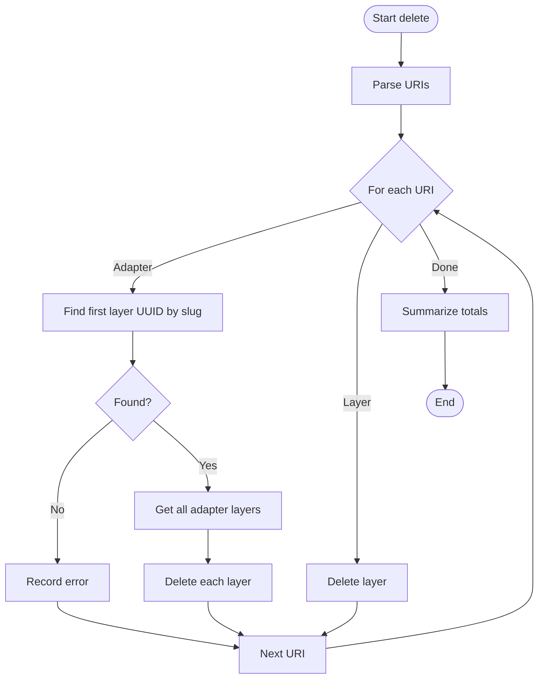
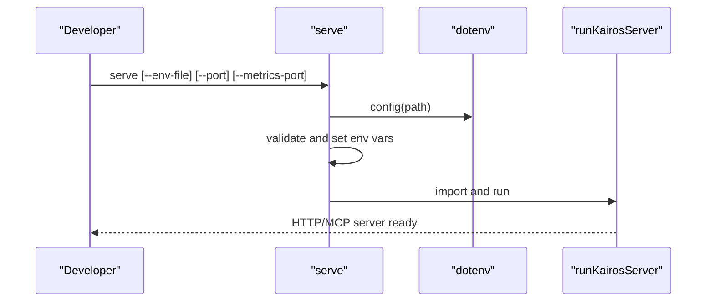
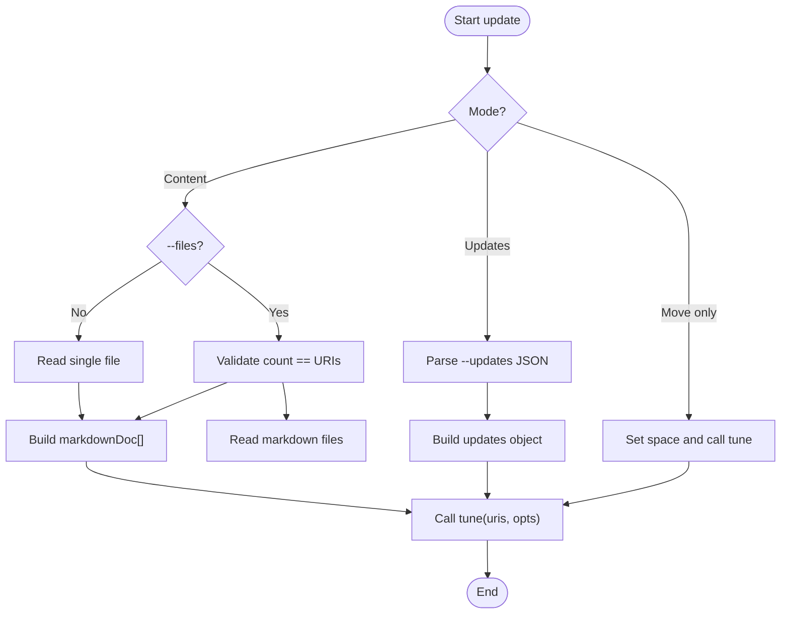
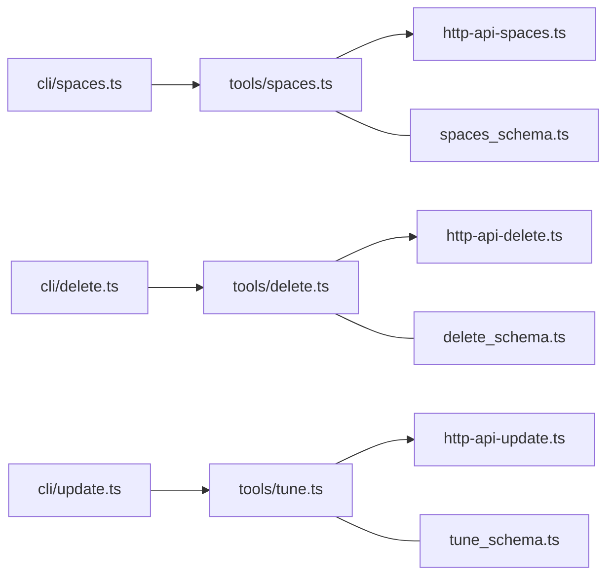

# Utility Commands

<cite>
**Referenced Files in This Document**
- [spaces.ts](file://src/cli/commands/spaces.ts)
- [delete.ts](file://src/cli/commands/delete.ts)
- [serve.ts](file://src/cli/commands/serve.ts)
- [update.ts](file://src/cli/commands/update.ts)
- [spaces.ts](file://src/tools/spaces.ts)
- [delete.ts](file://src/tools/delete.ts)
- [tune.ts](file://src/tools/tune.ts)
- [http-api-spaces.ts](file://src/http/http-api-spaces.ts)
- [http-api-delete.ts](file://src/http/http-api-delete.ts)
- [http-api-update.ts](file://src/http/http-api-update.ts)
- [spaces_schema.ts](file://src/tools/spaces_schema.ts)
- [delete_schema.ts](file://src/tools/delete_schema.ts)
- [tune_schema.ts](file://src/tools/tune_schema.ts)
- [delete-metadata.ts](file://src/cli/commands/delete-metadata.ts)
</cite>

## Table of Contents
1. [Introduction](#introduction)
2. [Project Structure](#project-structure)
3. [Core Components](#core-components)
4. [Architecture Overview](#architecture-overview)
5. [Detailed Component Analysis](#detailed-component-analysis)
6. [Dependency Analysis](#dependency-analysis)
7. [Performance Considerations](#performance-considerations)
8. [Troubleshooting Guide](#troubleshooting-guide)
9. [Conclusion](#conclusion)

## Introduction
This document explains the KAIROS MCP utility commands focused on protocol spaces, resource cleanup, local development, and system maintenance. It covers:
- spaces: list available spaces and adapter counts, with optional adapter titles and artifacts
- delete: remove adapter resources (all layers) or individual layers
- serve: start the HTTP/MCP server for local development
- update: tune adapter layers via content updates, structured updates, or space moves

It also documents space management operations, permission scoping via tenant context, administrative functions, resource deletion policies, cascade operations, and safety mechanisms.

## Project Structure
The utility commands are implemented as CLI commands backed by tools and HTTP APIs. The CLI commands delegate to a shared client that invokes tools or HTTP endpoints. Tools encapsulate domain logic and integrate with storage/services (Qdrant for memory). HTTP routes expose the same capabilities externally.

**Diagram sources**
- [spaces.ts:1-29](file://src/cli/commands/spaces.ts#L1-L29)
- [delete.ts:1-27](file://src/cli/commands/delete.ts#L1-L27)
- [serve.ts:1-50](file://src/cli/commands/serve.ts#L1-L50)
- [update.ts:1-98](file://src/cli/commands/update.ts#L1-L98)
- [spaces.ts:1-273](file://src/tools/spaces.ts#L1-L273)
- [delete.ts:1-116](file://src/tools/delete.ts#L1-L116)
- [tune.ts:1-58](file://src/tools/tune.ts#L1-L58)
- [http-api-spaces.ts:1-32](file://src/http/http-api-spaces.ts#L1-L32)
- [http-api-delete.ts:1-38](file://src/http/http-api-delete.ts#L1-L38)
- [http-api-update.ts:1-37](file://src/http/http-api-update.ts#L1-L37)
- [spaces_schema.ts:1-53](file://src/tools/spaces_schema.ts#L1-L53)
- [delete_schema.ts:1-33](file://src/tools/delete_schema.ts#L1-L33)
- [tune_schema.ts:1-55](file://src/tools/tune_schema.ts#L1-L55)

**Section sources**
- [spaces.ts:1-29](file://src/cli/commands/spaces.ts#L1-L29)
- [delete.ts:1-27](file://src/cli/commands/delete.ts#L1-L27)
- [serve.ts:1-50](file://src/cli/commands/serve.ts#L1-L50)
- [update.ts:1-98](file://src/cli/commands/update.ts#L1-L98)
- [spaces.ts:1-273](file://src/tools/spaces.ts#L1-L273)
- [delete.ts:1-116](file://src/tools/delete.ts#L1-L116)
- [tune.ts:1-58](file://src/tools/tune.ts#L1-L58)
- [http-api-spaces.ts:1-32](file://src/http/http-api-spaces.ts#L1-L32)
- [http-api-delete.ts:1-38](file://src/http/http-api-delete.ts#L1-L38)
- [http-api-update.ts:1-37](file://src/http/http-api-update.ts#L1-L37)
- [spaces_schema.ts:1-53](file://src/tools/spaces_schema.ts#L1-L53)
- [delete_schema.ts:1-33](file://src/tools/delete_schema.ts#L1-L33)
- [tune_schema.ts:1-55](file://src/tools/tune_schema.ts#L1-L55)

## Core Components
- CLI commands define user-facing subcommands and argument parsing, delegating to a shared client factory and error handler.
- Tools implement the core logic for spaces listing, resource deletion, and adapter updates, integrating with Qdrant and tenant context.
- HTTP routes expose the same tools as REST endpoints for external clients.
- Schemas validate inputs and outputs for robustness and clear documentation.

Key responsibilities:
- spaces: list spaces, adapter counts, and optionally adapter titles and artifacts
- delete: delete adapters (all layers) or layers; report per-URI status
- serve: start the HTTP/MCP server with environment configuration
- update: update content or metadata of adapter layers; optionally move to a space

**Section sources**
- [spaces.ts:9-28](file://src/cli/commands/spaces.ts#L9-L28)
- [delete.ts:11-25](file://src/cli/commands/delete.ts#L11-L25)
- [serve.ts:10-49](file://src/cli/commands/serve.ts#L10-L49)
- [update.ts:11-96](file://src/cli/commands/update.ts#L11-L96)
- [spaces.ts:190-207](file://src/tools/spaces.ts#L190-L207)
- [delete.ts:12-71](file://src/tools/delete.ts#L12-L71)
- [tune.ts:10-58](file://src/tools/tune.ts#L10-L58)
- [http-api-spaces.ts:11-31](file://src/http/http-api-spaces.ts#L11-L31)
- [http-api-delete.ts:11-35](file://src/http/http-api-delete.ts#L11-L35)
- [http-api-update.ts:11-34](file://src/http/http-api-update.ts#L11-L34)
- [spaces_schema.ts:3-52](file://src/tools/spaces_schema.ts#L3-L52)
- [delete_schema.ts:14-29](file://src/tools/delete_schema.ts#L14-L29)
- [tune_schema.ts:14-50](file://src/tools/tune_schema.ts#L14-L50)

## Architecture Overview
The commands follow a layered pattern:
- CLI layer parses arguments and invokes a client
- Client layer calls tools or HTTP endpoints
- Tools layer performs domain logic and integrates with services
- HTTP layer exposes tools as REST endpoints
- Schemas enforce input/output contracts

**Diagram sources**
- [spaces.ts:17-26](file://src/cli/commands/spaces.ts#L17-L26)
- [delete.ts:16-24](file://src/cli/commands/delete.ts#L16-L24)
- [update.ts:24-95](file://src/cli/commands/update.ts#L24-L95)
- [spaces.ts:190-207](file://src/tools/spaces.ts#L190-L207)
- [delete.ts:12-71](file://src/tools/delete.ts#L12-L71)
- [tune.ts:10-58](file://src/tools/tune.ts#L10-L58)
- [http-api-spaces.ts:12-30](file://src/http/http-api-spaces.ts#L12-L30)
- [http-api-delete.ts:12-34](file://src/http/http-api-delete.ts#L12-L34)
- [http-api-update.ts:12-33](file://src/http/http-api-update.ts#L12-L33)

## Detailed Component Analysis

### spaces command
Purpose:
- List available spaces and adapter counts
- Optionally include adapter titles, layer counts, and artifact metadata

Behavior:
- Accepts an option to include adapter titles and artifacts
- Delegates to a client that calls the spaces tool
- The tool queries Qdrant, groups by adapter, computes counts, and builds a typed response

**Diagram sources**
- [spaces.ts:17-26](file://src/cli/commands/spaces.ts#L17-L26)
- [spaces.ts:190-207](file://src/tools/spaces.ts#L190-L207)
- [http-api-spaces.ts:12-30](file://src/http/http-api-spaces.ts#L12-L30)
- [spaces_schema.ts:3-52](file://src/tools/spaces_schema.ts#L3-L52)

Operational notes:
- Permission scoping: the tool reads allowed spaces from tenant context and includes app space; reported adapters respect current space context
- Data structures: SpaceInfo includes name, space_id, type, adapter_count, and optional adapters with titles, layer counts, slugs, URIs, and artifacts
- Safety: includes adapter titles only when requested; artifacts require explicit inclusion

**Section sources**
- [spaces.ts:9-28](file://src/cli/commands/spaces.ts#L9-L28)
- [spaces.ts:190-207](file://src/tools/spaces.ts#L190-L207)
- [http-api-spaces.ts:11-31](file://src/http/http-api-spaces.ts#L11-L31)
- [spaces_schema.ts:42-52](file://src/tools/spaces_schema.ts#L42-L52)

### delete command
Purpose:
- Remove adapter resources (all layers) or individual layers
- Report per-URI status and totals

Behavior:
- Accepts one or more URIs (adapter or layer)
- For adapter URIs, finds the adapter’s first layer, enumerates all layers, and deletes each
- For layer URIs, deletes the specific layer
- Returns a results array with status and messages, plus totals

**Diagram sources**
- [delete.ts:16-24](file://src/cli/commands/delete.ts#L16-L24)
- [delete.ts:12-71](file://src/tools/delete.ts#L12-L71)
- [http-api-delete.ts:12-35](file://src/http/http-api-delete.ts#L12-L35)
- [delete_schema.ts:14-29](file://src/tools/delete_schema.ts#L14-L29)

Resource deletion policies and safety:
- Cascade behavior: deleting an adapter deletes all its layers
- Validation: URIs must match adapter or layer patterns; invalid URIs produce errors
- Reporting: per-URI status and aggregated totals aid auditing and recovery

Administrative workflows:
- Bulk cleanup: pass multiple adapter or layer URIs
- Idempotent operation: deleting already-deleted layers reports as error but does not fail the entire batch

**Section sources**
- [delete.ts:11-25](file://src/cli/commands/delete.ts#L11-L25)
- [delete.ts:12-71](file://src/tools/delete.ts#L12-L71)
- [http-api-delete.ts:11-35](file://src/http/http-api-delete.ts#L11-L35)
- [delete_metadata.ts:1-6](file://src/cli/commands/delete-metadata.ts#L1-L6)
- [delete_schema.ts:4-12](file://src/tools/delete_schema.ts#L4-L12)

### serve command
Purpose:
- Start the KAIROS HTTP/MCP server locally for development
- Load environment variables from a dotenv file and configure ports

Behavior:
- Loads .env by default or a custom path
- Validates and sets PORT and METRICS_PORT from CLI options
- Imports and runs the server bootstrap

**Diagram sources**
- [serve.ts:19-42](file://src/cli/commands/serve.ts#L19-L42)

Development server setup:
- Use --env-file to point to a dotenv file
- Use --port and --metrics-port to control listening ports
- The server starts the same bootstrap used by the production entry point

**Section sources**
- [serve.ts:10-49](file://src/cli/commands/serve.ts#L10-L49)

### update command
Purpose:
- Update one or more KAIROS adapter layers
- Supports content updates, structured updates, or moving layers to a space

Behavior:
- Accepts URIs (adapters or layers)
- Supports three modes:
  - Move-only: specify --space without content/updates
  - Content updates: provide --file (shared) or --files (per-URI)
  - Structured updates: provide --updates JSON
- Validates counts and formats; applies updates and optional space moves

**Diagram sources**
- [update.ts:24-95](file://src/cli/commands/update.ts#L24-L95)
- [tune.ts:10-58](file://src/tools/tune.ts#L10-L58)
- [http-api-update.ts:11-34](file://src/http/http-api-update.ts#L11-L34)
- [tune_schema.ts:14-40](file://src/tools/tune_schema.ts#L14-L40)

System maintenance procedures:
- Batch updates: use --files with one file per URI for targeted updates
- Move-only: reorganize layers into a space (e.g., personal or group) without changing content
- Structured updates: modify metadata fields safely via updates object

**Section sources**
- [update.ts:11-96](file://src/cli/commands/update.ts#L11-L96)
- [tune.ts:10-58](file://src/tools/tune.ts#L10-L58)
- [http-api-update.ts:11-34](file://src/http/http-api-update.ts#L11-L34)
- [tune_schema.ts:14-50](file://src/tools/tune_schema.ts#L14-L50)

## Dependency Analysis
- CLI commands depend on a shared client factory and error handling
- Tools depend on schemas for validation, tenant context for scoping, and Qdrant service for persistence
- HTTP routes depend on tools and tenant context wrappers
- Schemas define contracts for inputs and outputs across tools and routes

**Diagram sources**
- [spaces.ts:1-29](file://src/cli/commands/spaces.ts#L1-L29)
- [delete.ts:1-27](file://src/cli/commands/delete.ts#L1-L27)
- [update.ts:1-98](file://src/cli/commands/update.ts#L1-L98)
- [spaces.ts:1-273](file://src/tools/spaces.ts#L1-L273)
- [delete.ts:1-116](file://src/tools/delete.ts#L1-L116)
- [tune.ts:1-58](file://src/tools/tune.ts#L1-L58)
- [http-api-spaces.ts:1-32](file://src/http/http-api-spaces.ts#L1-L32)
- [http-api-delete.ts:1-38](file://src/http/http-api-delete.ts#L1-L38)
- [http-api-update.ts:1-37](file://src/http/http-api-update.ts#L1-L37)
- [spaces_schema.ts:1-53](file://src/tools/spaces_schema.ts#L1-L53)
- [delete_schema.ts:1-33](file://src/tools/delete_schema.ts#L1-L33)
- [tune_schema.ts:1-55](file://src/tools/tune_schema.ts#L1-L55)

**Section sources**
- [spaces.ts:1-29](file://src/cli/commands/spaces.ts#L1-L29)
- [delete.ts:1-27](file://src/cli/commands/delete.ts#L1-L27)
- [update.ts:1-98](file://src/cli/commands/update.ts#L1-L98)
- [spaces.ts:1-273](file://src/tools/spaces.ts#L1-L273)
- [delete.ts:1-116](file://src/tools/delete.ts#L1-L116)
- [tune.ts:1-58](file://src/tools/tune.ts#L1-L58)
- [http-api-spaces.ts:1-32](file://src/http/http-api-spaces.ts#L1-L32)
- [http-api-delete.ts:1-38](file://src/http/http-api-delete.ts#L1-L38)
- [http-api-update.ts:1-37](file://src/http/http-api-update.ts#L1-L37)
- [spaces_schema.ts:1-53](file://src/tools/spaces_schema.ts#L1-L53)
- [delete_schema.ts:1-33](file://src/tools/delete_schema.ts#L1-L33)
- [tune_schema.ts:1-55](file://src/tools/tune_schema.ts#L1-L55)

## Performance Considerations
- Listing spaces: scrolling with a fixed limit per space; consider pagination or filtering for very large datasets
- Deleting adapters: cascading deletes iterate over all layers; batch large deletions carefully
- Updating layers: content updates and structured updates are processed per URI; prefer batch operations where appropriate
- Metrics: tools record input/output sizes and durations; monitor these for operational insights

## Troubleshooting Guide
Common issues and resolutions:
- Invalid port or metrics port values: the serve command validates numeric values and exits with an error message
- File not found during updates: the update command checks for file existence and reports “File not found”
- Invalid JSON in updates: the update command validates JSON and exits with an error message
- Invalid URIs in delete: the delete command validates URI formats and reports per-URI errors
- HTTP route errors: routes return structured error objects with codes and messages

**Section sources**
- [serve.ts:25-47](file://src/cli/commands/serve.ts#L25-L47)
- [update.ts:89-95](file://src/cli/commands/update.ts#L89-L95)
- [delete.ts:16-24](file://src/cli/commands/delete.ts#L16-L24)
- [http-api-delete.ts:14-21](file://src/http/http-api-delete.ts#L14-L21)
- [http-api-update.ts:14-21](file://src/http/http-api-update.ts#L14-L21)

## Conclusion
The KAIROS MCP utility commands provide a cohesive toolkit for managing protocol spaces, cleaning up resources, developing locally, and maintaining system content. They emphasize safety through validation, permission scoping via tenant context, and clear reporting. Use spaces to discover and audit content, delete to remove unwanted resources with cascade semantics, serve to run a local development server, and update to refine or reorganize adapter layers.