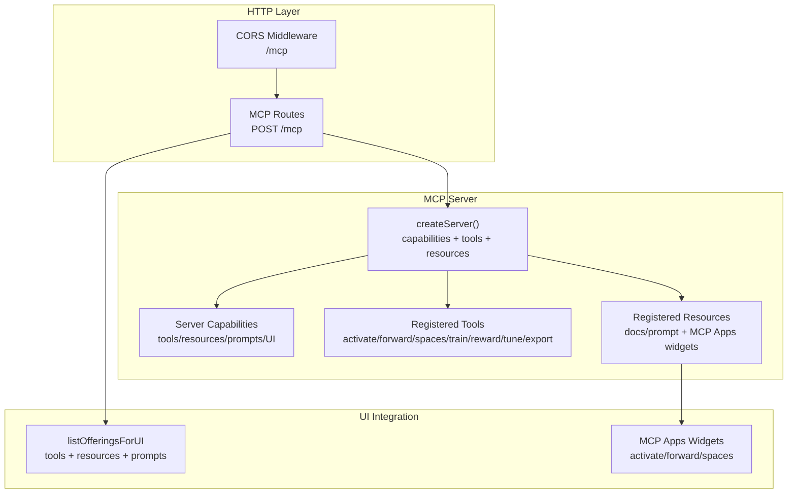
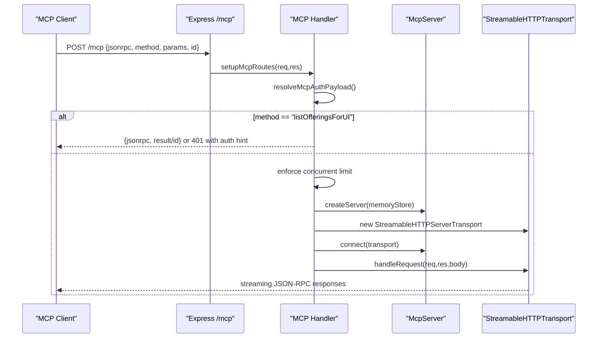
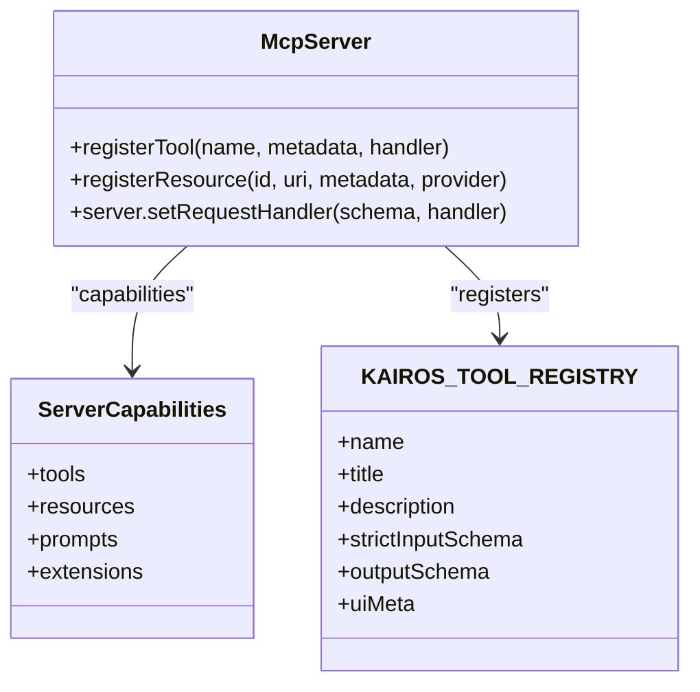
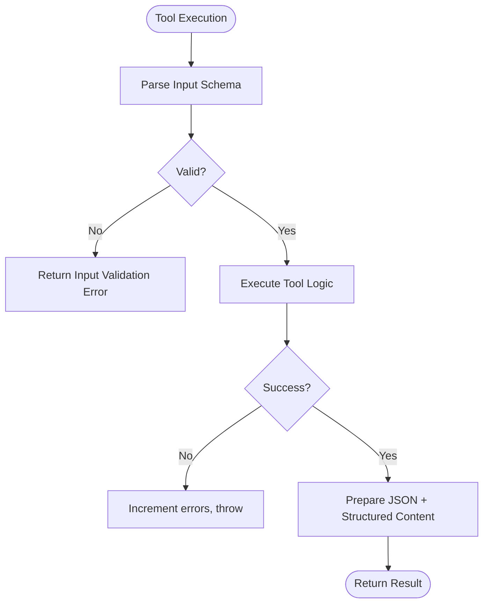
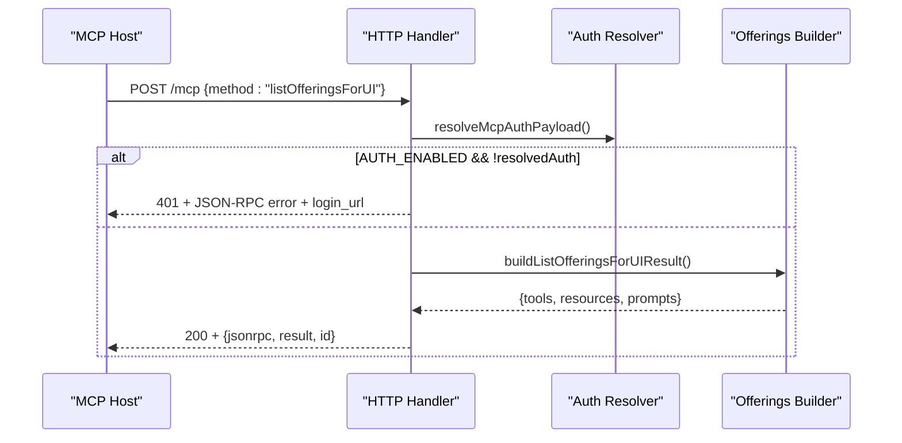
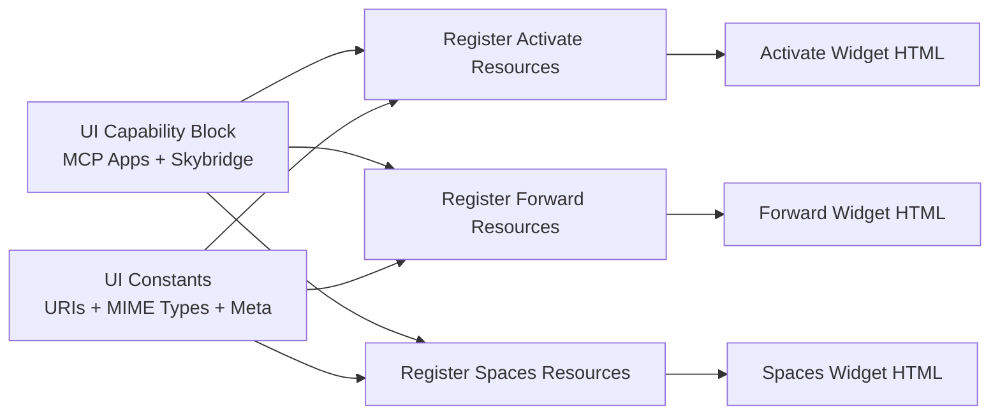
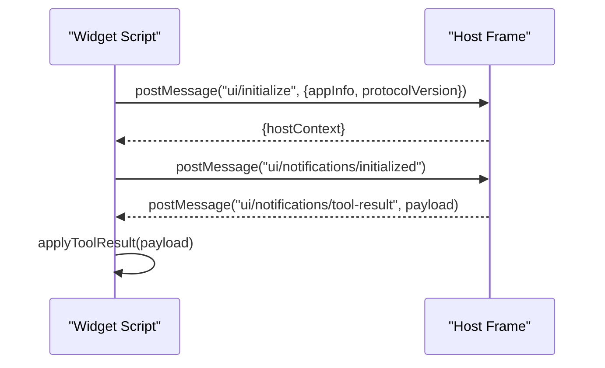
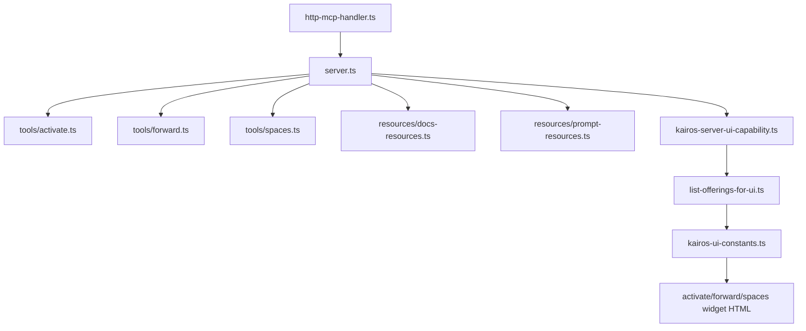

# MCP Protocol Integration

<cite>
**Referenced Files in This Document**
- [src/http/http-mcp-handler.ts](file://src/http/http-mcp-handler.ts)
- [src/http/mcp-ui-offerings-auth-jsonrpc.ts](file://src/http/mcp-ui-offerings-auth-jsonrpc.ts)
- [src/http/http-mcp-cors.ts](file://src/http/http-mcp-cors.ts)
- [src/server.ts](file://src/server.ts)
- [src/mcp-apps/kairos-server-ui-capability.ts](file://src/mcp-apps/kairos-server-ui-capability.ts)
- [src/mcp-apps/list-offerings-for-ui.ts](file://src/mcp-apps/list-offerings-for-ui.ts)
- [src/mcp-apps/register-activate-ui-resources.ts](file://src/mcp-apps/register-activate-ui-resources.ts)
- [src/mcp-apps/register-forward-ui-resources.ts](file://src/mcp-apps/register-forward-ui-resources.ts)
- [src/mcp-apps/register-spaces-ui-resources.ts](file://src/mcp-apps/register-spaces-ui-resources.ts)
- [src/mcp-apps/kairos-ui-constants.ts](file://src/mcp-apps/kairos-ui-constants.ts)
- [src/mcp-apps/activate-widget-html.ts](file://src/mcp-apps/activate-widget-html.ts)
- [src/mcp-apps/forward-widget-html.ts](file://src/mcp-apps/forward-widget-html.ts)
- [src/mcp-apps/spaces-mcp-app-widget-html.ts](file://src/mcp-apps/spaces-mcp-app-widget-html.ts)
- [src/mcp-apps/mcp-widget-presentation-inject.ts](file://src/mcp-apps/mcp-widget-presentation-inject.ts)
- [src/tools/activate.ts](file://src/tools/activate.ts)
- [src/tools/forward.ts](file://src/tools/forward.ts)
- [src/tools/spaces.ts](file://src/tools/spaces.ts)
</cite>

## Table of Contents
1. [Introduction](#introduction)
2. [Project Structure](#project-structure)
3. [Core Components](#core-components)
4. [Architecture Overview](#architecture-overview)
5. [Detailed Component Analysis](#detailed-component-analysis)
6. [Dependency Analysis](#dependency-analysis)
7. [Performance Considerations](#performance-considerations)
8. [Security and Authentication](#security-and-authentication)
9. [Client Integration Patterns](#client-integration-patterns)
10. [Troubleshooting Guide](#troubleshooting-guide)
11. [Conclusion](#conclusion)

## Introduction
This document explains the MCP (Model Context Protocol) integration in KAIROS MCP. It covers the MCP server implementation, tool registration system, protocol specification, UI capability extensions, resource registration, client integration patterns, offerings system, tool discovery mechanisms, dynamic UI resource loading, examples of MCP client implementations, protocol negotiation, error handling, the relationship between MCP tools and web UI components, message formatting, state synchronization, performance considerations, security implications, and debugging techniques.

## Project Structure
KAIROS MCP integrates MCP at the HTTP transport layer with a per-request server instance, exposing tools and UI resources via the Model Context Protocol. Key areas:
- HTTP transport and routing for MCP requests
- MCP server creation and capability advertisement
- Tool registration for activate, forward, spaces, and others
- UI capability advertisement and resource registration for MCP Apps and Skybridge profiles
- Widget HTML builders and presentation injection
- Offerings discovery for UI prefetching

**Diagram sources**
- [src/http/http-mcp-handler.ts:128-344](file://src/http/http-mcp-handler.ts#L128-L344)
- [src/server.ts:125-193](file://src/server.ts#L125-L193)
- [src/mcp-apps/list-offerings-for-ui.ts:162-179](file://src/mcp-apps/list-offerings-for-ui.ts#L162-L179)

**Section sources**
- [src/http/http-mcp-handler.ts:128-344](file://src/http/http-mcp-handler.ts#L128-L344)
- [src/server.ts:125-193](file://src/server.ts#L125-L193)

## Core Components
- HTTP MCP Handler: Manages per-request MCP server instances, concurrency limits, authentication, logging, and error responses.
- MCP Server Creator: Builds a server with capabilities, registers tools, and sets up resources and UI extensions.
- Tool Registry: Defines tool metadata, schemas, and registration for activate, forward, spaces, and auxiliary tools.
- UI Capability and Resource Registration: Exposes MCP Apps/Skybridge support, registers HTML resources for widgets, and builds offerings for UI discovery.
- Widget Builders: Produce inline HTML fragments with injected presentation mode and styling for activate, forward, and spaces views.

**Section sources**
- [src/http/http-mcp-handler.ts:128-344](file://src/http/http-mcp-handler.ts#L128-L344)
- [src/server.ts:125-193](file://src/server.ts#L125-L193)
- [src/mcp-apps/kairos-server-ui-capability.ts:1-14](file://src/mcp-apps/kairos-server-ui-capability.ts#L1-L14)
- [src/mcp-apps/list-offerings-for-ui.ts:1-180](file://src/mcp-apps/list-offerings-for-ui.ts#L1-L180)
- [src/mcp-apps/register-activate-ui-resources.ts:1-41](file://src/mcp-apps/register-activate-ui-resources.ts#L1-L41)
- [src/mcp-apps/register-forward-ui-resources.ts:1-41](file://src/mcp-apps/register-forward-ui-resources.ts#L1-L41)
- [src/mcp-apps/register-spaces-ui-resources.ts:1-41](file://src/mcp-apps/register-spaces-ui-resources.ts#L1-L41)
- [src/mcp-apps/activate-widget-html.ts:1-30](file://src/mcp-apps/activate-widget-html.ts#L1-L30)
- [src/mcp-apps/forward-widget-html.ts:1-35](file://src/mcp-apps/forward-widget-html.ts#L1-L35)
- [src/mcp-apps/spaces-mcp-app-widget-html.ts:1-410](file://src/mcp-apps/spaces-mcp-app-widget-html.ts#L1-L410)

## Architecture Overview
The MCP integration follows a request-per-transport pattern: each HTTP request creates a new MCP server instance, connects a streamable HTTP transport, and runs within a scoped request context. The server advertises capabilities, registers tools and resources, and supports UI discovery via listOfferingsForUI.

**Diagram sources**
- [src/http/http-mcp-handler.ts:128-344](file://src/http/http-mcp-handler.ts#L128-L344)
- [src/server.ts:125-193](file://src/server.ts#L125-L193)

## Detailed Component Analysis

### MCP Server Implementation
- Capability Advertisement: The server declares support for tools, resources, prompts, and UI extensions (MCP Apps and Skybridge).
- Tool Registration: Tools are registered with metadata, input/output schemas, and optional UI meta for widget binding.
- Resource Bootstrapping: Embedded docs and prompts are registered; empty handlers are bootstrapped for extensibility.
- Strict Tools List: Overrides the default tools/list to return precise schemas and UI metadata.

**Diagram sources**
- [src/server.ts:125-193](file://src/server.ts#L125-L193)
- [src/mcp-apps/kairos-server-ui-capability.ts:1-14](file://src/mcp-apps/kairos-server-ui-capability.ts#L1-L14)

**Section sources**
- [src/server.ts:125-193](file://src/server.ts#L125-L193)
- [src/mcp-apps/kairos-server-ui-capability.ts:1-14](file://src/mcp-apps/kairos-server-ui-capability.ts#L1-L14)

### Tool Registration System
- Activate Tool: Finds best adapter, ranks choices, includes next actions, optional artifacts, and UI meta for widget binding.
- Forward Tool: Executes adapter layers, handles proof-of-work submissions, manages execution traces, and transitions to next layers.
- Spaces Tool: Lists spaces, adapter counts, optional adapter titles and artifacts, and supports widget rendering.

**Diagram sources**
- [src/tools/activate.ts:252-282](file://src/tools/activate.ts#L252-L282)
- [src/tools/forward.ts:93-318](file://src/tools/forward.ts#L93-L318)
- [src/tools/spaces.ts:225-271](file://src/tools/spaces.ts#L225-L271)

**Section sources**
- [src/tools/activate.ts:236-284](file://src/tools/activate.ts#L236-L284)
- [src/tools/forward.ts:93-318](file://src/tools/forward.ts#L93-L318)
- [src/tools/spaces.ts:213-273](file://src/tools/spaces.ts#L213-L273)

### Protocol Specification and Offerings Discovery
- listOfferingsForUI: Prefetch mechanism for UI hosts to discover tools, resources, and prompts aligned with MCP Apps/Skybridge profiles.
- Auth Handling: When authentication is enabled, unauthorized requests receive a machine-actionable error with a login URL.
- Offerings Shape: Mirrors tools/list and UI resource listings with metadata for visibility and resource binding.

**Diagram sources**
- [src/http/http-mcp-handler.ts:157-174](file://src/http/http-mcp-handler.ts#L157-L174)
- [src/http/mcp-ui-offerings-auth-jsonrpc.ts:1-19](file://src/http/mcp-ui-offerings-auth-jsonrpc.ts#L1-L19)
- [src/mcp-apps/list-offerings-for-ui.ts:162-179](file://src/mcp-apps/list-offerings-for-ui.ts#L162-L179)

**Section sources**
- [src/mcp-apps/list-offerings-for-ui.ts:1-180](file://src/mcp-apps/list-offerings-for-ui.ts#L1-L180)
- [src/http/mcp-ui-offerings-auth-jsonrpc.ts:1-19](file://src/http/mcp-ui-offerings-auth-jsonrpc.ts#L1-L19)
- [src/http/http-mcp-handler.ts:157-174](file://src/http/http-mcp-handler.ts#L157-L174)

### UI Capability Extensions and Dynamic Resource Loading
- UI Capability Block: Declares supported UI extensions and MIME types for MCP Apps and Skybridge.
- Resource Registration: Registers HTML resources for activate, forward, and spaces widgets under ui:// URIs.
- Widget HTML Builders: Produce inline HTML fragments with injected presentation mode and styles.
- Presentation Injection: Replaces a token in widget scripts based on configuration to enable/disable live data.

**Diagram sources**
- [src/mcp-apps/kairos-server-ui-capability.ts:1-14](file://src/mcp-apps/kairos-server-ui-capability.ts#L1-L14)
- [src/mcp-apps/register-activate-ui-resources.ts:1-41](file://src/mcp-apps/register-activate-ui-resources.ts#L1-L41)
- [src/mcp-apps/register-forward-ui-resources.ts:1-41](file://src/mcp-apps/register-forward-ui-resources.ts#L1-L41)
- [src/mcp-apps/register-spaces-ui-resources.ts:1-41](file://src/mcp-apps/register-spaces-ui-resources.ts#L1-L41)
- [src/mcp-apps/kairos-ui-constants.ts:1-68](file://src/mcp-apps/kairos-ui-constants.ts#L1-L68)
- [src/mcp-apps/activate-widget-html.ts:1-30](file://src/mcp-apps/activate-widget-html.ts#L1-L30)
- [src/mcp-apps/forward-widget-html.ts:1-35](file://src/mcp-apps/forward-widget-html.ts#L1-L35)
- [src/mcp-apps/spaces-mcp-app-widget-html.ts:1-410](file://src/mcp-apps/spaces-mcp-app-widget-html.ts#L1-L410)
- [src/mcp-apps/mcp-widget-presentation-inject.ts:1-13](file://src/mcp-apps/mcp-widget-presentation-inject.ts#L1-L13)

**Section sources**
- [src/mcp-apps/kairos-server-ui-capability.ts:1-14](file://src/mcp-apps/kairos-server-ui-capability.ts#L1-L14)
- [src/mcp-apps/register-activate-ui-resources.ts:1-41](file://src/mcp-apps/register-activate-ui-resources.ts#L1-L41)
- [src/mcp-apps/register-forward-ui-resources.ts:1-41](file://src/mcp-apps/register-forward-ui-resources.ts#L1-L41)
- [src/mcp-apps/register-spaces-ui-resources.ts:1-41](file://src/mcp-apps/register-spaces-ui-resources.ts#L1-L41)
- [src/mcp-apps/kairos-ui-constants.ts:1-68](file://src/mcp-apps/kairos-ui-constants.ts#L1-L68)
- [src/mcp-apps/activate-widget-html.ts:1-30](file://src/mcp-apps/activate-widget-html.ts#L1-L30)
- [src/mcp-apps/forward-widget-html.ts:1-35](file://src/mcp-apps/forward-widget-html.ts#L1-L35)
- [src/mcp-apps/spaces-mcp-app-widget-html.ts:1-410](file://src/mcp-apps/spaces-mcp-app-widget-html.ts#L1-L410)
- [src/mcp-apps/mcp-widget-presentation-inject.ts:1-13](file://src/mcp-apps/mcp-widget-presentation-inject.ts#L1-L13)

### Message Formatting and State Synchronization
- JSON-RPC 2.0: Requests and responses conform to JSON-RPC 2.0 with id and method fields.
- Structured Content: Tools return both text content and structured content for UI rendering.
- Widget Lifecycle: Widgets support ui/initialize, ui/notifications/initialized, and ui/notifications/tool-result for state synchronization.
- Presentation Mode: A token is injected to switch between live data and presentation-only mode.

**Diagram sources**
- [src/mcp-apps/spaces-mcp-app-widget-html.ts:389-404](file://src/mcp-apps/spaces-mcp-app-widget-html.ts#L389-L404)

**Section sources**
- [src/mcp-apps/spaces-mcp-app-widget-html.ts:1-410](file://src/mcp-apps/spaces-mcp-app-widget-html.ts#L1-L410)
- [src/mcp-apps/mcp-widget-presentation-inject.ts:1-13](file://src/mcp-apps/mcp-widget-presentation-inject.ts#L1-L13)

## Dependency Analysis
- HTTP to MCP: The handler depends on the server factory and transport to process requests.
- Server to Tools/Resources: The server aggregates tool registrations and resource registrations.
- UI Constants to Widgets: Widget builders depend on constants for URIs, MIME types, and meta.
- Offerings to Tools/Resources: Offerings composition depends on tool schemas and resource metadata.

**Diagram sources**
- [src/http/http-mcp-handler.ts:128-344](file://src/http/http-mcp-handler.ts#L128-L344)
- [src/server.ts:125-193](file://src/server.ts#L125-L193)
- [src/mcp-apps/list-offerings-for-ui.ts:1-180](file://src/mcp-apps/list-offerings-for-ui.ts#L1-L180)
- [src/mcp-apps/kairos-ui-constants.ts:1-68](file://src/mcp-apps/kairos-ui-constants.ts#L1-L68)

**Section sources**
- [src/http/http-mcp-handler.ts:128-344](file://src/http/http-mcp-handler.ts#L128-L344)
- [src/server.ts:125-193](file://src/server.ts#L125-L193)
- [src/mcp-apps/list-offerings-for-ui.ts:1-180](file://src/mcp-apps/list-offerings-for-ui.ts#L1-L180)
- [src/mcp-apps/kairos-ui-constants.ts:1-68](file://src/mcp-apps/kairos-ui-constants.ts#L1-L68)

## Performance Considerations
- Concurrency Control: Tracks in-flight requests and rejects excess with 503 and Retry-After header.
- Request Timing: Logs warnings around 25s and completion thresholds; cleans up stale timestamps.
- Backpressure: Limits concurrent MCP requests to prevent overload.
- Logging Levels: Conditional logging reduces overhead in production.

Recommendations:
- Tune MAX_CONCURRENT_MCP_REQUESTS based on deployment capacity.
- Monitor request durations and adjust timeouts for long-running tools.
- Use structured logging to identify hotspots in tool execution.

**Section sources**
- [src/http/http-mcp-handler.ts:176-200](file://src/http/http-mcp-handler.ts#L176-L200)
- [src/http/http-mcp-handler.ts:208-285](file://src/http/http-mcp-handler.ts#L208-L285)

## Security and Authentication
- Bearer Token Validation: Optional OIDC-backed bearer validation with trusted issuers and audiences.
- Auth Fallback: Attempts to validate tokens; logs failures and proceeds without auth when disabled.
- Unauthorized Offerings: Returns a machine-actionable JSON-RPC error with login_url when auth is required.
- CORS Exposure: Exposes WWW-Authenticate header for proper auth integration.

Best Practices:
- Enable AUTH_ENABLED and configure trusted issuers and audiences.
- Use HTTPS and secure cookies for OIDC flows.
- Limit tool capabilities to least privilege.

**Section sources**
- [src/http/http-mcp-handler.ts:46-73](file://src/http/http-mcp-handler.ts#L46-L73)
- [src/http/mcp-ui-offerings-auth-jsonrpc.ts:1-19](file://src/http/mcp-ui-offerings-auth-jsonrpc.ts#L1-L19)
- [src/http/http-mcp-cors.ts:1-28](file://src/http/http-mcp-cors.ts#L1-L28)

## Client Integration Patterns
- Shared Connection Pattern: Tests demonstrate a singleton connection to reuse across suites.
- Transport Setup: Clients connect using StreamableHTTPClientTransport with authenticated fetch.
- Cleanup: Always close the client to release resources.

Example References:
- [tests/utils/mcp-client-utils.ts:81-98](file://tests/utils/mcp-client-utils.ts#L81-L98)
- [tests/integration/mcp-client-connection.test.ts:1-20](file://tests/integration/mcp-client-connection.test.ts#L1-L20)

**Section sources**
- [tests/utils/mcp-client-utils.ts:81-98](file://tests/utils/mcp-client-utils.ts#L81-L98)
- [tests/integration/mcp-client-connection.test.ts:1-20](file://tests/integration/mcp-client-connection.test.ts#L1-L20)

## Troubleshooting Guide
Common Issues and Remedies:
- Overloaded Server: Expect 503 with Retry-After when concurrent limit is exceeded; reduce client concurrency or scale out.
- Authentication Required: For listOfferingsForUI, ensure proper auth headers or use returned login_url.
- Unexpected Errors: The handler sanitizes and returns machine-actionable messages with error_code and retry_hint.
- Client Cancelled: Detects notifications/cancelled and logs duration; operations may continue in background.
- Timeout Warnings: Long-running requests log warnings around 25s; investigate tool execution or network latency.

Operational Checks:
- Verify CORS headers and MCP-Protocol-Version support.
- Confirm server capabilities include UI extensions if using widgets.
- Inspect structured logs for request_id, method, and duration.

**Section sources**
- [src/http/http-mcp-handler.ts:176-200](file://src/http/http-mcp-handler.ts#L176-L200)
- [src/http/http-mcp-handler.ts:308-342](file://src/http/http-mcp-handler.ts#L308-L342)
- [src/http/http-mcp-handler.ts:230-260](file://src/http/http-mcp-handler.ts#L230-L260)
- [src/http/mcp-ui-offerings-auth-jsonrpc.ts:1-19](file://src/http/mcp-ui-offerings-auth-jsonrpc.ts#L1-L19)

## Conclusion
KAIROS MCP provides a robust, per-request MCP server implementation with strict tool schemas, UI capability extensions, and dynamic resource loading. The integration supports UI discovery via listOfferingsForUI, authenticated flows, and resilient error handling. By leveraging the provided patterns for tool registration, resource registration, and client connection, teams can integrate MCP clients effectively while maintaining performance, security, and maintainability.