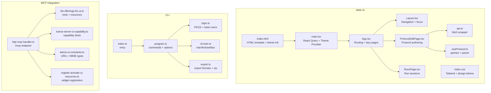
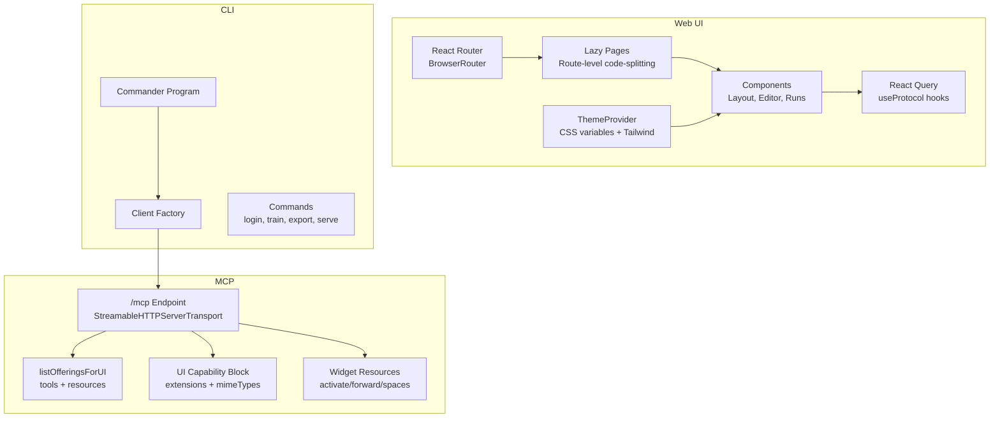
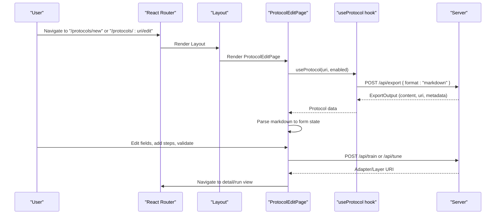
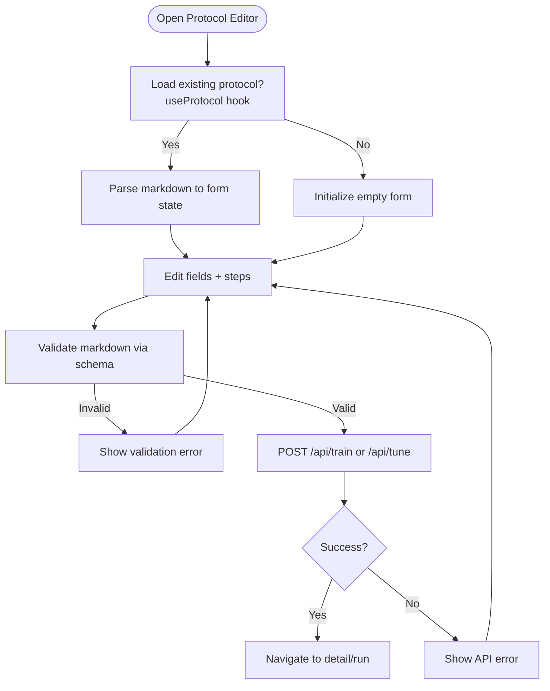
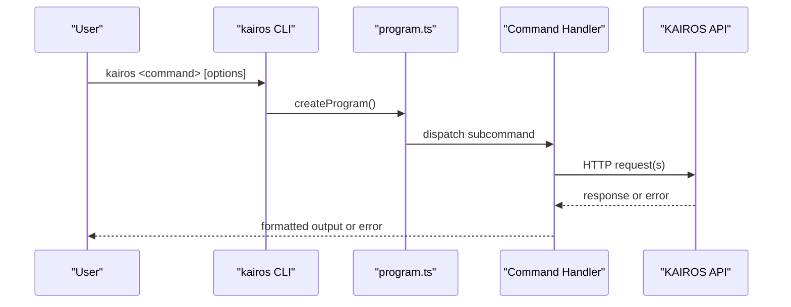
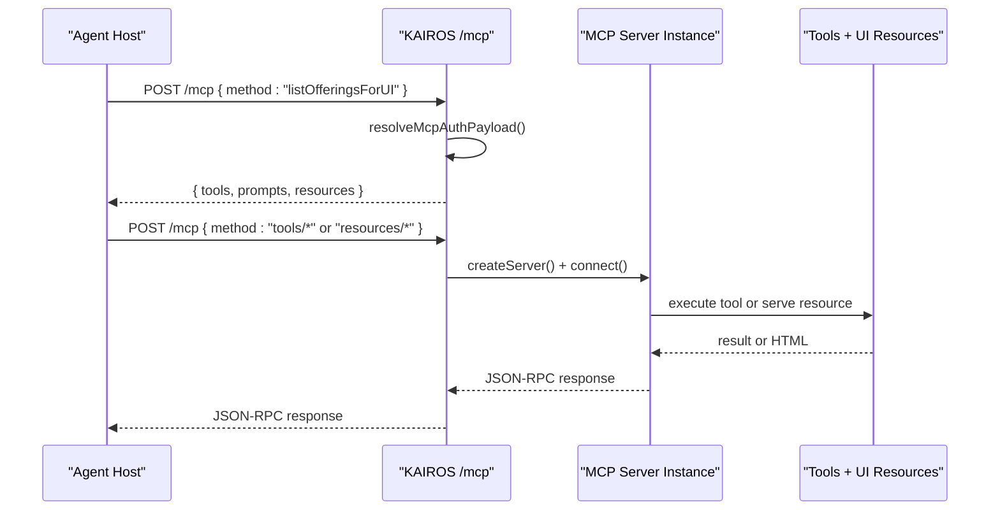
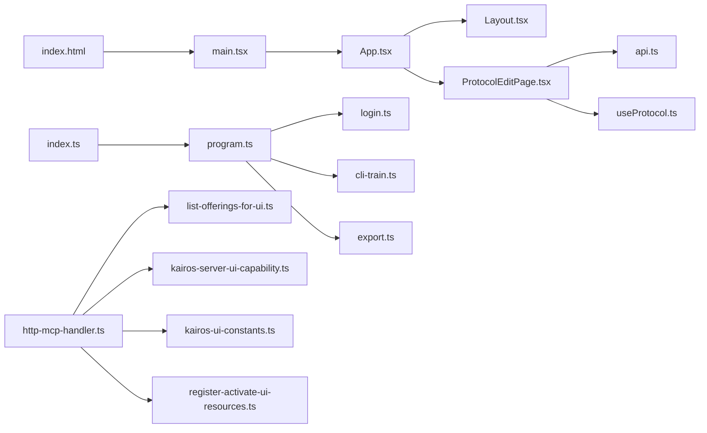

# User Interfaces

<cite>
**Referenced Files in This Document**
- [App.tsx](file://src/ui/App.tsx)
- [main.tsx](file://src/ui/main.tsx)
- [index.html](file://src/ui/index.html)
- [index.css](file://src/ui/index.css)
- [Layout.tsx](file://src/ui/components/Layout.tsx)
- [ProtocolEditPage.tsx](file://src/ui/pages/ProtocolEditPage.tsx)
- [RunsPage.tsx](file://src/ui/pages/RunsPage.tsx)
- [api.ts](file://src/ui/lib/api.ts)
- [useProtocol.ts](file://src/ui/hooks/useProtocol.ts)
- [index.ts](file://src/cli/index.ts)
- [program.ts](file://src/cli/program.ts)
- [login.ts](file://src/cli/commands/login.ts)
- [cli-train.ts](file://src/cli/commands/cli-train.ts)
- [export.ts](file://src/cli/commands/export.ts)
- [http-mcp-handler.ts](file://src/http/http-mcp-handler.ts)
- [list-offerings-for-ui.ts](file://src/mcp-apps/list-offerings-for-ui.ts)
- [kairos-server-ui-capability.ts](file://src/mcp-apps/kairos-server-ui-capability.ts)
- [kairos-ui-constants.ts](file://src/mcp-apps/kairos-ui-constants.ts)
- [register-activate-ui-resources.ts](file://src/mcp-apps/register-activate-ui-resources.ts)
</cite>

## Update Summary
**Changes Made**
- Enhanced web application architecture documentation with comprehensive component analysis
- Expanded CLI interface coverage with detailed command structure and authentication workflows
- Strengthened MCP protocol integration documentation with widget resource management
- Added detailed component documentation for protocol editor, run manager, and skill bundle viewer
- Included comprehensive accessibility and responsive design considerations
- Updated practical examples and user workflows across all interface types

## Table of Contents
1. [Introduction](#introduction)
2. [Project Structure](#project-structure)
3. [Core Components](#core-components)
4. [Architecture Overview](#architecture-overview)
5. [Detailed Component Analysis](#detailed-component-analysis)
6. [Dependency Analysis](#dependency-analysis)
7. [Performance Considerations](#performance-considerations)
8. [Troubleshooting Guide](#troubleshooting-guide)
9. [Conclusion](#conclusion)
10. [Appendices](#appendices)

## Introduction
This document describes the user interfaces for KAIROS MCP across three primary access methods:
- Web application built with React and React Router
- Command-line interface (CLI) for automation and scripting
- MCP client integration for agent communication and UI capability extensions

It covers the React app's component hierarchy, routing, state management, and UI capabilities; the CLI's command structure, authentication, training, and export workflows; and the MCP protocol integration for agents, including protocol discovery, resource registration, and UI capability advertisement.

## Project Structure
The UI system is organized around a React SPA with route-level code splitting and a typed API client. The CLI is a command suite built on top of a shared client factory. The MCP integration exposes a dedicated endpoint and registers UI resources for agent hosts.

**Diagram sources**
- [App.tsx:1-133](file://src/ui/App.tsx#L1-L133)
- [main.tsx:1-20](file://src/ui/main.tsx#L1-L20)
- [index.html:1-35](file://src/ui/index.html#L1-L35)
- [index.css:1-116](file://src/ui/index.css#L1-L116)
- [Layout.tsx:1-109](file://src/ui/components/Layout.tsx#L1-L109)
- [ProtocolEditPage.tsx:1-338](file://src/ui/pages/ProtocolEditPage.tsx#L1-L338)
- [RunsPage.tsx:1-57](file://src/ui/pages/RunsPage.tsx#L1-L57)
- [api.ts:1-14](file://src/ui/lib/api.ts#L1-L14)
- [useProtocol.ts:1-247](file://src/ui/hooks/useProtocol.ts#L1-L247)
- [index.ts:1-11](file://src/cli/index.ts#L1-L11)
- [program.ts:1-74](file://src/cli/program.ts#L1-L74)
- [login.ts:1-229](file://src/cli/commands/login.ts#L1-L229)
- [cli-train.ts:1-276](file://src/cli/commands/cli-train.ts#L1-L276)
- [export.ts:1-153](file://src/cli/commands/export.ts#L1-L153)
- [http-mcp-handler.ts:1-344](file://src/http/http-mcp-handler.ts#L1-L344)
- [list-offerings-for-ui.ts:1-180](file://src/mcp-apps/list-offerings-for-ui.ts#L1-L180)
- [kairos-server-ui-capability.ts:1-14](file://src/mcp-apps/kairos-server-ui-capability.ts#L1-L14)
- [kairos-ui-constants.ts:1-68](file://src/mcp-apps/kairos-ui-constants.ts#L1-L68)
- [register-activate-ui-resources.ts:1-41](file://src/mcp-apps/register-activate-ui-resources.ts#L1-L41)

**Section sources**
- [App.tsx:1-133](file://src/ui/App.tsx#L1-L133)
- [main.tsx:1-20](file://src/ui/main.tsx#L1-L20)
- [index.html:1-35](file://src/ui/index.html#L1-L35)
- [index.css:1-116](file://src/ui/index.css#L1-L116)
- [Layout.tsx:1-109](file://src/ui/components/Layout.tsx#L1-L109)
- [ProtocolEditPage.tsx:1-338](file://src/ui/pages/ProtocolEditPage.tsx#L1-L338)
- [RunsPage.tsx:1-57](file://src/ui/pages/RunsPage.tsx#L1-L57)
- [api.ts:1-14](file://src/ui/lib/api.ts#L1-L14)
- [useProtocol.ts:1-247](file://src/ui/hooks/useProtocol.ts#L1-L247)
- [index.ts:1-11](file://src/cli/index.ts#L1-L11)
- [program.ts:1-74](file://src/cli/program.ts#L1-L74)
- [login.ts:1-229](file://src/cli/commands/login.ts#L1-L229)
- [cli-train.ts:1-276](file://src/cli/commands/cli-train.ts#L1-L276)
- [export.ts:1-153](file://src/cli/commands/export.ts#L1-L153)
- [http-mcp-handler.ts:1-344](file://src/http/http-mcp-handler.ts#L1-L344)
- [list-offerings-for-ui.ts:1-180](file://src/mcp-apps/list-offerings-for-ui.ts#L1-L180)
- [kairos-server-ui-capability.ts:1-14](file://src/mcp-apps/kairos-server-ui-capability.ts#L1-L14)
- [kairos-ui-constants.ts:1-68](file://src/mcp-apps/kairos-ui-constants.ts#L1-L68)
- [register-activate-ui-resources.ts:1-41](file://src/mcp-apps/register-activate-ui-resources.ts#L1-L41)

## Core Components
- React Router-based SPA with route-level code splitting for fast initial loads and on-demand page loading.
- Centralized API fetch wrapper for consistent headers and credentials.
- Protocol editor with live preview, step management, and validation.
- Run sessions list with resume/remove actions.
- CLI program with shared options and subcommands for authentication, training, exporting, and serving.
- MCP endpoint handling with concurrency limits, timeouts, and error normalization.
- MCP Apps UI capability advertisement and resource registration for activate/forward/spaces widgets.

**Section sources**
- [App.tsx:1-133](file://src/ui/App.tsx#L1-L133)
- [Layout.tsx:1-109](file://src/ui/components/Layout.tsx#L1-L109)
- [ProtocolEditPage.tsx:1-338](file://src/ui/pages/ProtocolEditPage.tsx#L1-L338)
- [RunsPage.tsx:1-57](file://src/ui/pages/RunsPage.tsx#L1-L57)
- [api.ts:1-14](file://src/ui/lib/api.ts#L1-L14)
- [useProtocol.ts:1-247](file://src/ui/hooks/useProtocol.ts#L1-L247)
- [program.ts:1-74](file://src/cli/program.ts#L1-L74)
- [http-mcp-handler.ts:1-344](file://src/http/http-mcp-handler.ts#L1-L344)
- [list-offerings-for-ui.ts:1-180](file://src/mcp-apps/list-offerings-for-ui.ts#L1-L180)
- [kairos-server-ui-capability.ts:1-14](file://src/mcp-apps/kairos-server-ui-capability.ts#L1-L14)
- [kairos-ui-constants.ts:1-68](file://src/mcp-apps/kairos-ui-constants.ts#L1-L68)
- [register-activate-ui-resources.ts:1-41](file://src/mcp-apps/register-activate-ui-resources.ts#L1-L41)

## Architecture Overview
High-level UI architecture across access methods:

**Diagram sources**
- [App.tsx:1-133](file://src/ui/App.tsx#L1-L133)
- [Layout.tsx:1-109](file://src/ui/components/Layout.tsx#L1-L109)
- [ProtocolEditPage.tsx:1-338](file://src/ui/pages/ProtocolEditPage.tsx#L1-L338)
- [RunsPage.tsx:1-57](file://src/ui/pages/RunsPage.tsx#L1-L57)
- [useProtocol.ts:1-247](file://src/ui/hooks/useProtocol.ts#L1-L247)
- [main.tsx:1-20](file://src/ui/main.tsx#L1-L20)
- [program.ts:1-74](file://src/cli/program.ts#L1-L74)
- [http-mcp-handler.ts:1-344](file://src/http/http-mcp-handler.ts#L1-L344)
- [list-offerings-for-ui.ts:1-180](file://src/mcp-apps/list-offerings-for-ui.ts#L1-L180)
- [kairos-server-ui-capability.ts:1-14](file://src/mcp-apps/kairos-server-ui-capability.ts#L1-L14)
- [register-activate-ui-resources.ts:1-41](file://src/mcp-apps/register-activate-ui-resources.ts#L1-L41)

## Detailed Component Analysis

### Web Application Architecture
- Routing and navigation:
  - Root layout with sidebar navigation and main content area.
  - Route-level code splitting for pages to reduce initial bundle size.
  - Responsive layout with dynamic max widths for content areas.
- State and data:
  - Protocol editor uses React state plus React Query for fetching and caching protocol content.
  - Validation and submission flows for creating or updating protocols.
- Accessibility and UX:
  - Skip link to main content.
  - Focus styles and keyboard navigation.
  - Clear error and validation messaging.

**Diagram sources**
- [App.tsx:1-133](file://src/ui/App.tsx#L1-L133)
- [Layout.tsx:1-109](file://src/ui/components/Layout.tsx#L1-L109)
- [ProtocolEditPage.tsx:1-338](file://src/ui/pages/ProtocolEditPage.tsx#L1-L338)
- [useProtocol.ts:1-247](file://src/ui/hooks/useProtocol.ts#L1-L247)

**Section sources**
- [App.tsx:1-133](file://src/ui/App.tsx#L1-L133)
- [Layout.tsx:1-109](file://src/ui/components/Layout.tsx#L1-L109)
- [ProtocolEditPage.tsx:1-338](file://src/ui/pages/ProtocolEditPage.tsx#L1-L338)
- [RunsPage.tsx:1-57](file://src/ui/pages/RunsPage.tsx#L1-L57)
- [useProtocol.ts:1-247](file://src/ui/hooks/useProtocol.ts#L1-L247)
- [api.ts:1-14](file://src/ui/lib/api.ts#L1-L14)

### Protocol Editor
- Features:
  - Import protocol from markdown file.
  - Edit protocol label, triggers, steps, and completion.
  - Live preview of parsed protocol content.
  - Add/remove steps with type-specific challenge payloads.
  - Validation using a schema and error reporting.
  - Fork from an existing adapter or create a new one.
- Data flow:
  - Markdown parsing to form state and vice versa.
  - Submission to training or tuning endpoints.
  - Navigation to detail/run views upon success.

**Diagram sources**
- [ProtocolEditPage.tsx:1-338](file://src/ui/pages/ProtocolEditPage.tsx#L1-L338)
- [useProtocol.ts:1-247](file://src/ui/hooks/useProtocol.ts#L1-L247)

**Section sources**
- [ProtocolEditPage.tsx:1-338](file://src/ui/pages/ProtocolEditPage.tsx#L1-L338)
- [useProtocol.ts:1-247](file://src/ui/hooks/useProtocol.ts#L1-L247)

### Run Manager
- Purpose:
  - List active run sessions with status, last message, and timestamps.
  - Resume a run session or remove it from the list.
- Interaction:
  - Links to run view with session context.
  - Button to remove a session.

**Section sources**
- [RunsPage.tsx:1-57](file://src/ui/pages/RunsPage.tsx#L1-L57)

### CLI Interface
- Entry point:
  - Node script invokes the CLI program.
- Program options:
  - Global flags for API base URL, timeout, retries, and browser behavior.
- Commands:
  - Authentication: login (browser PKCE or token), logout, token introspection.
  - Training: train from file or directory, fork from existing adapter, artifact mode.
  - Export: export formats (markdown, skill_zip, skill_tree, source, traces, rewards, SFT, preferences).
  - Serve: local development server.
- Error handling:
  - Graceful error messages and suggestions; optional browser opening for auth.

**Diagram sources**
- [index.ts:1-11](file://src/cli/index.ts#L1-L11)
- [program.ts:1-74](file://src/cli/program.ts#L1-L74)
- [login.ts:1-229](file://src/cli/commands/login.ts#L1-L229)
- [cli-train.ts:1-276](file://src/cli/commands/cli-train.ts#L1-L276)
- [export.ts:1-153](file://src/cli/commands/export.ts#L1-L153)

**Section sources**
- [index.ts:1-11](file://src/cli/index.ts#L1-L11)
- [program.ts:1-74](file://src/cli/program.ts#L1-L74)
- [login.ts:1-229](file://src/cli/commands/login.ts#L1-L229)
- [cli-train.ts:1-276](file://src/cli/commands/cli-train.ts#L1-L276)
- [export.ts:1-153](file://src/cli/commands/export.ts#L1-L153)

### MCP Client Integration
- Endpoint:
  - POST /mcp with per-request server instances and streamable HTTP transport.
  - Concurrency limiting and request timeout logging.
  - Authentication resolution via Bearer token validation.
- Discovery:
  - listOfferingsForUI returns tools and UI resources for agent hosts.
- Capability advertisement:
  - Server capability block advertises supported UI MIME types.
- Widget resources:
  - Registration of activate/forward/spaces widgets with MCP Apps and Skybridge profiles.

**Diagram sources**
- [http-mcp-handler.ts:1-344](file://src/http/http-mcp-handler.ts#L1-L344)
- [list-offerings-for-ui.ts:1-180](file://src/mcp-apps/list-offerings-for-ui.ts#L1-L180)
- [kairos-server-ui-capability.ts:1-14](file://src/mcp-apps/kairos-server-ui-capability.ts#L1-L14)
- [kairos-ui-constants.ts:1-68](file://src/mcp-apps/kairos-ui-constants.ts#L1-L68)
- [register-activate-ui-resources.ts:1-41](file://src/mcp-apps/register-activate-ui-resources.ts#L1-L41)

**Section sources**
- [http-mcp-handler.ts:1-344](file://src/http/http-mcp-handler.ts#L1-L344)
- [list-offerings-for-ui.ts:1-180](file://src/mcp-apps/list-offerings-for-ui.ts#L1-L180)
- [kairos-server-ui-capability.ts:1-14](file://src/mcp-apps/kairos-server-ui-capability.ts#L1-L14)
- [kairos-ui-constants.ts:1-68](file://src/mcp-apps/kairos-ui-constants.ts#L1-L68)
- [register-activate-ui-resources.ts:1-41](file://src/mcp-apps/register-activate-ui-resources.ts#L1-L41)

## Dependency Analysis
- Web UI depends on:
  - React Router for routing and Layout for navigation.
  - React Query for protocol data fetching and caching.
  - Local API fetch wrapper for consistent request behavior.
- CLI depends on:
  - Commander for command definition and a shared client factory.
  - Command handlers for login, training, export, and serve.
- MCP integration depends on:
  - MCP SDK for transport and server creation.
  - UI capability constants and resource registration utilities.

**Diagram sources**
- [App.tsx:1-133](file://src/ui/App.tsx#L1-L133)
- [Layout.tsx:1-109](file://src/ui/components/Layout.tsx#L1-L109)
- [ProtocolEditPage.tsx:1-338](file://src/ui/pages/ProtocolEditPage.tsx#L1-L338)
- [api.ts:1-14](file://src/ui/lib/api.ts#L1-L14)
- [useProtocol.ts:1-247](file://src/ui/hooks/useProtocol.ts#L1-L247)
- [main.tsx:1-20](file://src/ui/main.tsx#L1-L20)
- [index.html:1-35](file://src/ui/index.html#L1-L35)
- [index.ts:1-11](file://src/cli/index.ts#L1-L11)
- [program.ts:1-74](file://src/cli/program.ts#L1-L74)
- [login.ts:1-229](file://src/cli/commands/login.ts#L1-L229)
- [cli-train.ts:1-276](file://src/cli/commands/cli-train.ts#L1-L276)
- [export.ts:1-153](file://src/cli/commands/export.ts#L1-L153)
- [http-mcp-handler.ts:1-344](file://src/http/http-mcp-handler.ts#L1-L344)
- [list-offerings-for-ui.ts:1-180](file://src/mcp-apps/list-offerings-for-ui.ts#L1-L180)
- [kairos-server-ui-capability.ts:1-14](file://src/mcp-apps/kairos-server-ui-capability.ts#L1-L14)
- [kairos-ui-constants.ts:1-68](file://src/mcp-apps/kairos-ui-constants.ts#L1-L68)
- [register-activate-ui-resources.ts:1-41](file://src/mcp-apps/register-activate-ui-resources.ts#L1-L41)

**Section sources**
- [App.tsx:1-133](file://src/ui/App.tsx#L1-L133)
- [Layout.tsx:1-109](file://src/ui/components/Layout.tsx#L1-L109)
- [ProtocolEditPage.tsx:1-338](file://src/ui/pages/ProtocolEditPage.tsx#L1-L338)
- [api.ts:1-14](file://src/ui/lib/api.ts#L1-L14)
- [useProtocol.ts:1-247](file://src/ui/hooks/useProtocol.ts#L1-L247)
- [main.tsx:1-20](file://src/ui/main.tsx#L1-L20)
- [index.html:1-35](file://src/ui/index.html#L1-L35)
- [index.ts:1-11](file://src/cli/index.ts#L1-L11)
- [program.ts:1-74](file://src/cli/program.ts#L1-L74)
- [login.ts:1-229](file://src/cli/commands/login.ts#L1-L229)
- [cli-train.ts:1-276](file://src/cli/commands/cli-train.ts#L1-L276)
- [export.ts:1-153](file://src/cli/commands/export.ts#L1-L153)
- [http-mcp-handler.ts:1-344](file://src/http/http-mcp-handler.ts#L1-L344)
- [list-offerings-for-ui.ts:1-180](file://src/mcp-apps/list-offerings-for-ui.ts#L1-L180)
- [kairos-server-ui-capability.ts:1-14](file://src/mcp-apps/kairos-server-ui-capability.ts#L1-L14)
- [kairos-ui-constants.ts:1-68](file://src/mcp-apps/kairos-ui-constants.ts#L1-L68)
- [register-activate-ui-resources.ts:1-41](file://src/mcp-apps/register-activate-ui-resources.ts#L1-L41)

## Performance Considerations
- Web UI:
  - Route-level code splitting keeps initial chunks small; lazy-load pages to improve perceived performance.
  - React Query caching reduces redundant network requests for protocol content.
- MCP:
  - Per-request server instances prevent single-transport bottlenecks.
  - Concurrency limits and request timestamps mitigate overload scenarios.
  - Timeout logging helps detect slow operations without impacting client responsiveness.
- CLI:
  - Batch processing for directory-based training reduces overhead.
  - Artifact mode supports efficient uploads with MIME inference.

## Troubleshooting Guide
- Web UI:
  - Protocol editor validation errors indicate malformed markdown or invalid schema; check the validation message and adjust content accordingly.
  - Network errors during save or export are surfaced with clear messages; retry after addressing underlying issues.
- CLI:
  - Authentication failures: ensure the API base URL is correct and the token is valid; use login with browser PKCE or provide a valid token.
  - Training errors: verify file paths, model IDs, and space names; check sensitive content warnings and allow uploads if appropriate.
  - Export errors: confirm selection mode (URI/adapters/all-adapters) and space name; use JSON output to inspect server responses.
- MCP:
  - Overloaded server responses with retry hints; wait and retry after the indicated interval.
  - Authentication-required UI offerings: reconnect MCP after completing SSO to receive proper responses.

**Section sources**
- [ProtocolEditPage.tsx:120-187](file://src/ui/pages/ProtocolEditPage.tsx#L120-L187)
- [login.ts:40-61](file://src/cli/commands/login.ts#L40-L61)
- [cli-train.ts:150-182](file://src/cli/commands/cli-train.ts#L150-L182)
- [export.ts:100-151](file://src/cli/commands/export.ts#L100-L151)
- [http-mcp-handler.ts:176-200](file://src/http/http-mcp-handler.ts#L176-L200)

## Conclusion
KAIROS MCP provides a cohesive multi-access interface:
- The React web app offers a modern, accessible, and responsive authoring and management experience with route-level code splitting and robust state management.
- The CLI enables automation and integration with flexible authentication, training, and export workflows.
- The MCP integration delivers discoverable tools and branded UI widgets for agent hosts, with capability advertisement and resource registration.

Together, these interfaces support diverse user workflows while maintaining consistency, reliability, and extensibility.

## Appendices

### Practical Examples and Workflows

- Web: Protocol authoring and run management
  - Create a new protocol: navigate to "Create" → "New Protocol", edit label/triggers/steps/completion, validate, and save.
  - Edit an existing protocol: open the detail page, switch to edit mode, update content, and save.
  - Manage runs: view sessions on the "Runs" page, resume a session, or remove it.
  - Access account settings: use the "Account" link in the sidebar.

- CLI: Authentication and training
  - Authenticate: run the login command; optionally supply a token or use browser PKCE.
  - Train from file: provide a markdown file and optional model ID; use artifact mode for non-markdown artifacts.
  - Train from directory: scan recursively if desired; batch results are printed as JSON.
  - Fork from existing adapter: specify the source adapter URI and model ID; choose target space if needed.

- CLI: Export
  - Export a single adapter: provide the adapter URI and desired format.
  - Export multiple adapters: use repeatable adapter flags or export all adapters in a space.
  - Write skill zip locally: when format is skill_zip, the CLI downloads and writes the archive to disk.

- MCP: Agent integration
  - Discover UI offerings: call listOfferingsForUI to receive tools and resources.
  - Execute tools: send tool requests to /mcp; receive JSON-RPC responses.
  - Receive widget HTML: hosts render activate/forward/spaces widgets delivered as MCP Apps resources.

**Section sources**
- [ProtocolEditPage.tsx:120-187](file://src/ui/pages/ProtocolEditPage.tsx#L120-L187)
- [RunsPage.tsx:9-54](file://src/ui/pages/RunsPage.tsx#L9-L54)
- [login.ts:198-229](file://src/cli/commands/login.ts#L198-L229)
- [cli-train.ts:56-276](file://src/cli/commands/cli-train.ts#L56-L276)
- [export.ts:72-153](file://src/cli/commands/export.ts#L72-L153)
- [http-mcp-handler.ts:128-344](file://src/http/http-mcp-handler.ts#L128-L344)
- [list-offerings-for-ui.ts:162-180](file://src/mcp-apps/list-offerings-for-ui.ts#L162-L180)

### Accessibility and Cross-Browser Compatibility
- Accessibility:
  - Skip link to main content improves keyboard navigation.
  - Focus styles and outline-based focus indicators support keyboard-only users.
  - Semantic labels and ARIA attributes (e.g., navigation roles) enhance screen reader support.
- Cross-browser compatibility:
  - The UI relies on widely supported React and modern JavaScript APIs; ensure polyfills if targeting legacy browsers.
  - The MCP endpoint uses standard HTTP and JSON-RPC; verify CORS and transport compatibility with agent hosts.

### Responsive Design Implementation
- Mobile-first approach with Tailwind CSS breakpoints
- Flexible grid layouts that adapt to different screen sizes
- Touch-friendly navigation targets (minimum 44px touch targets)
- Dynamic content width based on route context
- Reduced motion support for accessibility compliance

**Section sources**
- [index.css:1-116](file://src/ui/index.css#L1-L116)
- [Layout.tsx:8-25](file://src/ui/components/Layout.tsx#L8-L25)
- [index.html:8-27](file://src/ui/index.html#L8-L27)