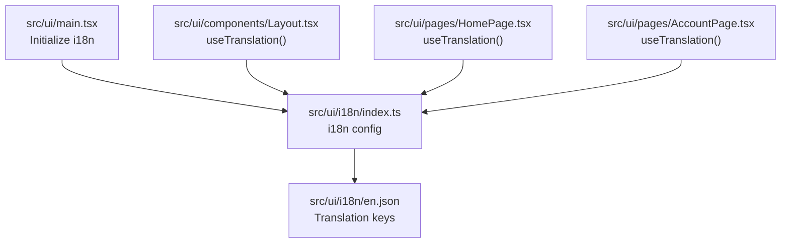
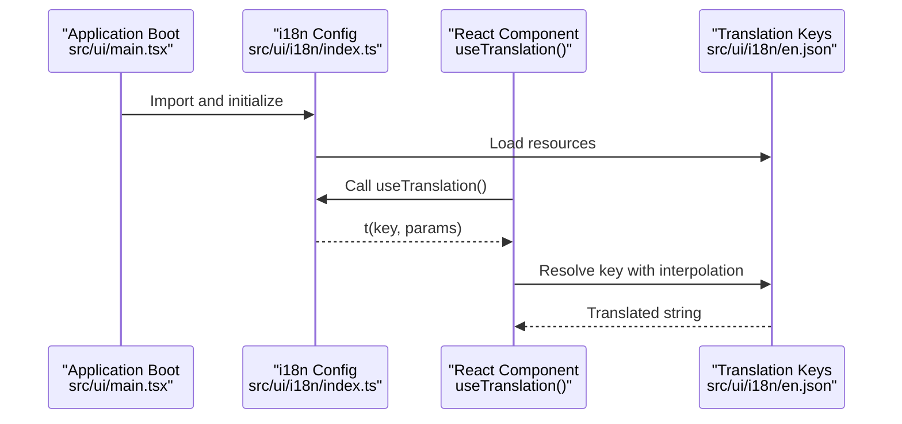
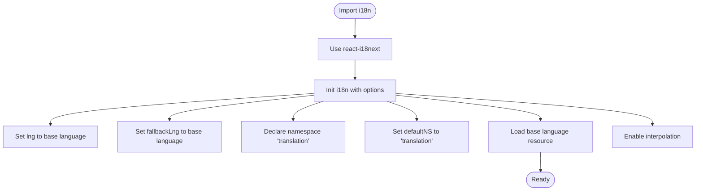
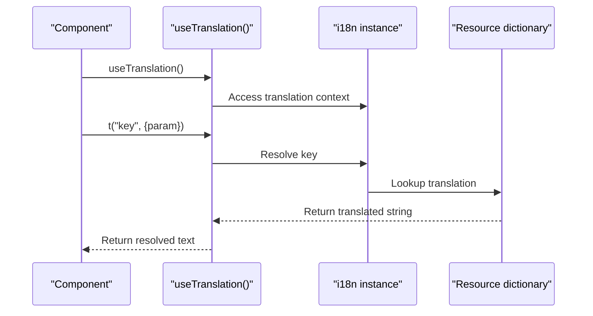
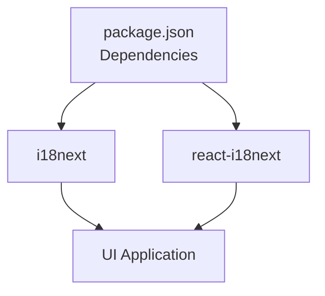

# Internationalization

<cite>
**Referenced Files in This Document**
- [src/ui/i18n/index.ts](file://src/ui/i18n/index.ts)
- [src/ui/i18n/en.json](file://src/ui/i18n/en.json)
- [src/ui/main.tsx](file://src/ui/main.tsx)
- [src/ui/components/Layout.tsx](file://src/ui/components/Layout.tsx)
- [src/ui/pages/HomePage.tsx](file://src/ui/pages/HomePage.tsx)
- [src/ui/pages/AccountPage.tsx](file://src/ui/pages/AccountPage.tsx)
- [tests/ui/setup.ts](file://tests/ui/setup.ts)
- [package.json](file://package.json)
</cite>

## Table of Contents
1. [Introduction](#introduction)
2. [Project Structure](#project-structure)
3. [Core Components](#core-components)
4. [Architecture Overview](#architecture-overview)
5. [Detailed Component Analysis](#detailed-component-analysis)
6. [Dependency Analysis](#dependency-analysis)
7. [Performance Considerations](#performance-considerations)
8. [Troubleshooting Guide](#troubleshooting-guide)
9. [Conclusion](#conclusion)

## Introduction
This document explains the internationalization (i18n) system used by the KAIROS MCP UI. It covers configuration, translation key management, pluralization, integration with React components via hooks, and practical guidance for adding new languages and maintaining consistency across the application.

## Project Structure
The i18n system is implemented in the UI layer and initialized early in the application lifecycle. Translation resources are organized as JSON files grouped under a single namespace.

**Diagram sources**
- [src/ui/main.tsx:1-20](file://src/ui/main.tsx#L1-L20)
- [src/ui/i18n/index.ts:1-13](file://src/ui/i18n/index.ts#L1-L13)
- [src/ui/i18n/en.json:1-273](file://src/ui/i18n/en.json#L1-L273)
- [src/ui/components/Layout.tsx:1-109](file://src/ui/components/Layout.tsx#L1-L109)
- [src/ui/pages/HomePage.tsx:1-132](file://src/ui/pages/HomePage.tsx#L1-L132)
- [src/ui/pages/AccountPage.tsx:1-155](file://src/ui/pages/AccountPage.tsx#L1-L155)

**Section sources**
- [src/ui/main.tsx:1-20](file://src/ui/main.tsx#L1-L20)
- [src/ui/i18n/index.ts:1-13](file://src/ui/i18n/index.ts#L1-L13)
- [src/ui/i18n/en.json:1-273](file://src/ui/i18n/en.json#L1-L273)

## Core Components
- i18n initialization and configuration: Sets default language, fallback language, namespace, and resources.
- Translation keys: Stored in a single namespace file for the base language.
- React integration: Components consume translations via the useTranslation hook.

Key behaviors:
- Default and fallback language: Both set to the base language.
- Namespace: Single namespace "translation" is used for all keys.
- Interpolation: Enabled with variable substitution.
- Escape values: Disabled to allow HTML inside translations.

**Section sources**
- [src/ui/i18n/index.ts:5-12](file://src/ui/i18n/index.ts#L5-L12)
- [src/ui/i18n/en.json:1-273](file://src/ui/i18n/en.json#L1-L273)

## Architecture Overview
The i18n pipeline initializes at startup, registers the translation resources, and exposes the translation function to React components.

**Diagram sources**
- [src/ui/main.tsx:1-20](file://src/ui/main.tsx#L1-L20)
- [src/ui/i18n/index.ts:1-13](file://src/ui/i18n/index.ts#L1-L13)
- [src/ui/i18n/en.json:1-273](file://src/ui/i18n/en.json#L1-L273)

## Detailed Component Analysis

### i18n Initialization
- Initializes i18next with react-i18next.
- Sets default and fallback language to the base language.
- Declares a single namespace "translation".
- Loads the base language resource file.
- Enables interpolation and disables escaping to support HTML.

**Diagram sources**
- [src/ui/i18n/index.ts:1-13](file://src/ui/i18n/index.ts#L1-L13)

**Section sources**
- [src/ui/i18n/index.ts:1-13](file://src/ui/i18n/index.ts#L1-L13)

### Translation Key Management
- All keys are defined under a single namespace "translation".
- Keys are organized hierarchically using dot notation (for example, navigation and layout keys).
- Pluralization is supported via a standard key suffix for plural forms.

Examples visible in the key set:
- Navigation and layout keys: "nav.home", "nav.kairos", "layout.kairosVersion"
- Home page keys: "home.title", "home.tagline", "home.searchLabel", "home.stats.protocolCount"
- Account page keys: "account.title", "account.themeOptionLight", "account.themeOptionDark"

Pluralization example:
- A key pair demonstrates singular/plural variants for count-based messages.

**Section sources**
- [src/ui/i18n/en.json:1-273](file://src/ui/i18n/en.json#L1-L273)

### React Integration with useTranslation Hook
Components integrate by importing the useTranslation hook and calling the returned t function with translation keys and optional parameters.

Representative usages:
- Layout component uses translation for skip link and navigation labels.
- Home page uses translation for form labels, hints, and statistics.
- Account page uses translation for theme options and user info presentation.

**Diagram sources**
- [src/ui/components/Layout.tsx:1-109](file://src/ui/components/Layout.tsx#L1-L109)
- [src/ui/pages/HomePage.tsx:1-132](file://src/ui/pages/HomePage.tsx#L1-L132)
- [src/ui/pages/AccountPage.tsx:1-155](file://src/ui/pages/AccountPage.tsx#L1-L155)

**Section sources**
- [src/ui/components/Layout.tsx:11-33](file://src/ui/components/Layout.tsx#L11-L33)
- [src/ui/pages/HomePage.tsx:10-63](file://src/ui/pages/HomePage.tsx#L10-L63)
- [src/ui/pages/AccountPage.tsx:24-84](file://src/ui/pages/AccountPage.tsx#L24-L84)

### Adding New Languages
To add a new language:
1. Create a new translation file under the i18n directory with the target locale code (for example, "fr.json").
2. Mirror the structure of the base language file, ensuring all keys present in the base are also present in the new language file.
3. Add the new language resource to the i18n configuration, registering it under the same namespace and default namespace.
4. Optionally configure language detection to select the new language automatically based on user preferences or environment.

Notes:
- The current configuration sets both default and fallback language to the base language. Adjusting fallback enables graceful degradation when a key is missing in the active language.
- Keep the namespace consistent ("translation") across all language files.

**Section sources**
- [src/ui/i18n/index.ts:5-12](file://src/ui/i18n/index.ts#L5-L12)
- [src/ui/i18n/en.json:1-273](file://src/ui/i18n/en.json#L1-L273)

### Managing Translation Keys
- Use hierarchical dot notation to organize keys by feature area (for example, "home.searchLabel", "kairos.search").
- Maintain a single source of truth for keys by mirroring all keys across languages.
- Use pluralization keys for count-dependent messages.
- Prefer interpolation for dynamic values to avoid concatenating strings in components.

**Section sources**
- [src/ui/i18n/en.json:1-273](file://src/ui/i18n/en.json#L1-L273)

### Locale-Specific Formatting
- Interpolation supports passing parameters to templates in translation keys.
- Example usage appears in layout and home page components where version and counts are injected into localized strings.

**Section sources**
- [src/ui/components/Layout.tsx:27-94](file://src/ui/components/Layout.tsx#L27-L94)
- [src/ui/pages/HomePage.tsx:107-124](file://src/ui/pages/HomePage.tsx#L107-L124)

## Dependency Analysis
The i18n stack relies on two primary libraries declared in the project dependencies.

**Diagram sources**
- [package.json:135-142](file://package.json#L135-L142)

**Section sources**
- [package.json:135-142](file://package.json#L135-L142)

## Performance Considerations
- Single namespace reduces overhead and simplifies lookups.
- Keeping translation resources in a single file minimizes network requests and parsing work during initialization.
- Interpolation is enabled; avoid excessive nested interpolations in hot paths to reduce string processing cost.
- Consider code-splitting pages to limit initial payload; i18n initialization occurs once at boot.

## Troubleshooting Guide
Common issues and resolutions:
- Missing translation keys: With the current configuration, missing keys fall back to the base language. To improve visibility, temporarily adjust fallback or enable key lookup warnings in development builds.
- Incorrect pluralization: Ensure the plural variant key follows the expected suffix convention used in the base language file.
- Interpolated values not rendering: Verify that parameters passed to the translation function match the placeholders in the translation key.
- Testing with mocked hooks: Tests can mock the translation hook to return keys directly, aiding deterministic UI tests.

**Section sources**
- [src/ui/i18n/index.ts:5-12](file://src/ui/i18n/index.ts#L5-L12)
- [src/ui/i18n/en.json:1-273](file://src/ui/i18n/en.json#L1-L273)
- [tests/ui/setup.ts:75-77](file://tests/ui/setup.ts#L75-L77)

## Conclusion
The KAIROS MCP UI employs a straightforward i18n setup centered on a single namespace and a base language resource. Components integrate seamlessly via the useTranslation hook, and the system supports interpolation and pluralization. Extending to new languages requires mirroring keys and updating configuration. Following the naming conventions and pluralization patterns outlined here ensures consistency and maintainability across the application.