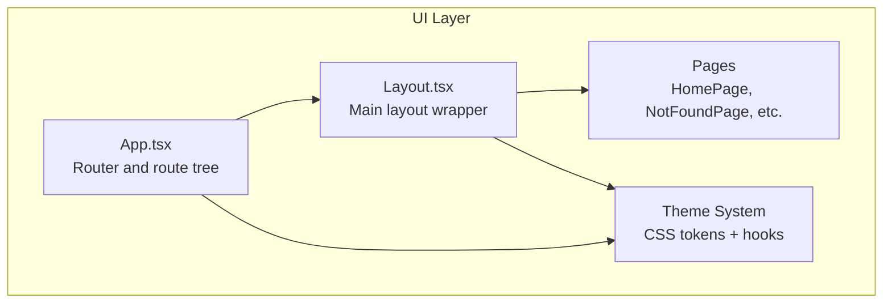
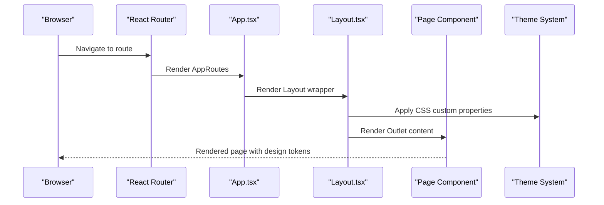
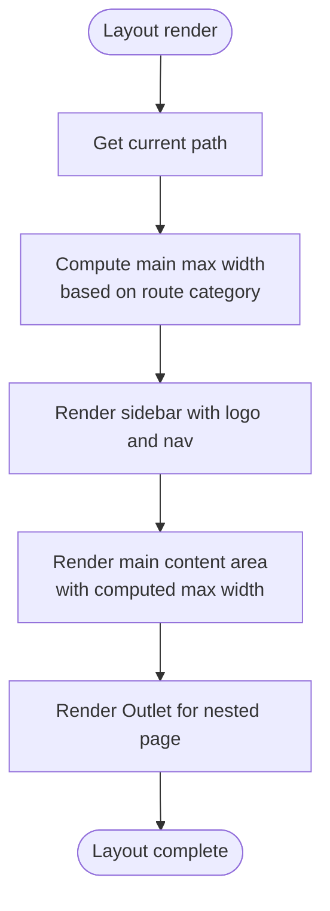
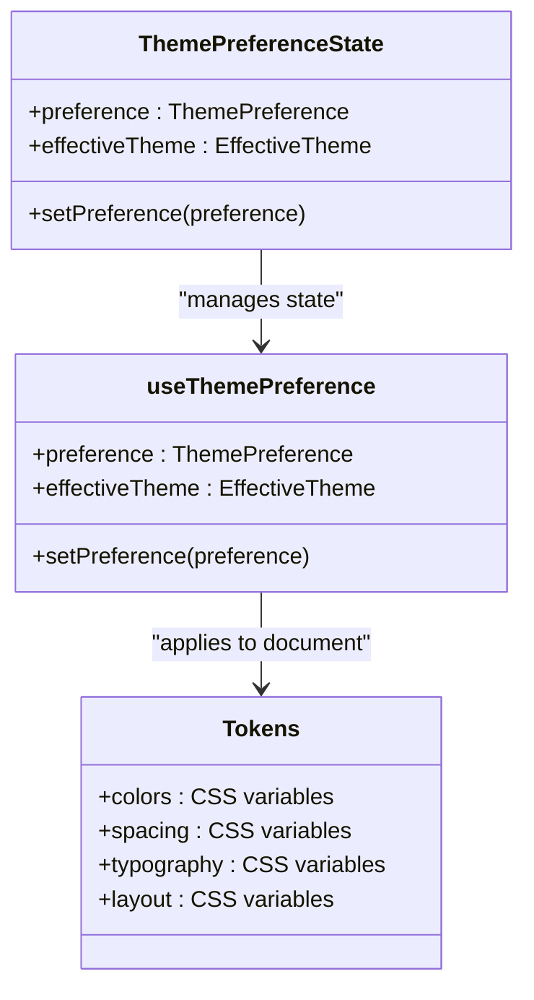
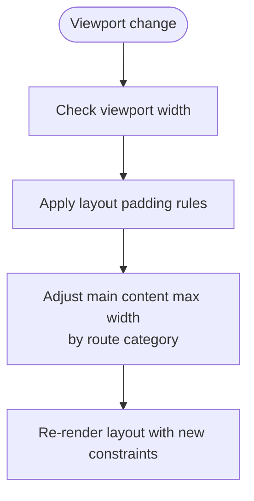
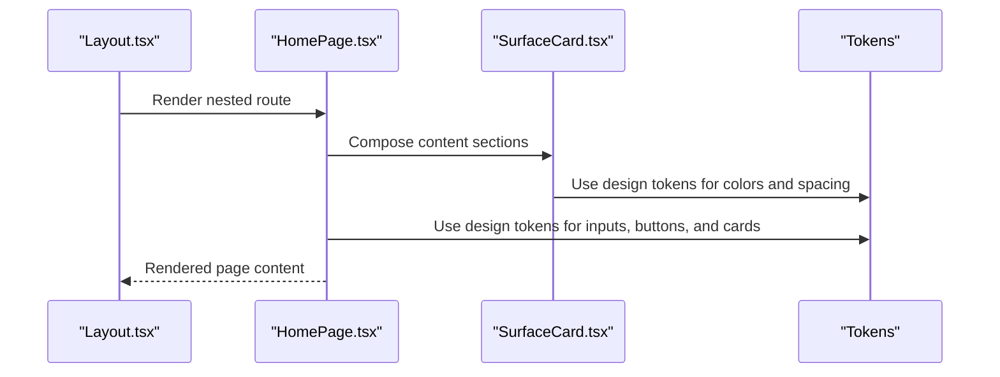
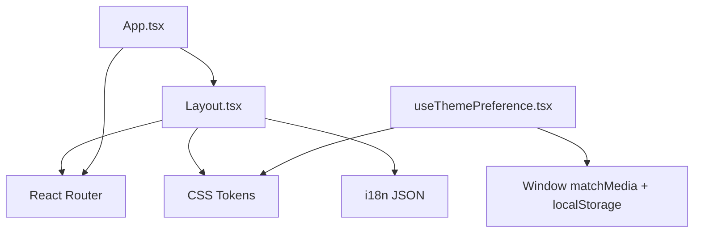

# Layout System

<cite>
**Referenced Files in This Document**
- [Layout.tsx](file://src/ui/components/Layout.tsx)
- [App.tsx](file://src/ui/App.tsx)
- [index.css](file://src/ui/index.css)
- [tokens.css](file://src/ui/theme/tokens.css)
- [tokens-shared.css](file://src/ui/theme/tokens-shared.css)
- [tokens-theme-light.css](file://src/ui/theme/tokens-theme-light.css)
- [tokens-theme-dark.css](file://src/ui/theme/tokens-theme-dark.css)
- [useThemePreference.tsx](file://src/ui/hooks/useThemePreference.tsx)
- [HomePage.tsx](file://src/ui/pages/HomePage.tsx)
- [NotFoundPage.tsx](file://src/ui/pages/NotFoundPage.tsx)
- [SurfaceCard.tsx](file://src/ui/components/SurfaceCard.tsx)
- [en.json](file://src/ui/i18n/en.json)
- [SKILL.md](file://.agents/skills/kmcp-dev-ui-spec/SKILL.md)
</cite>

## Table of Contents
1. [Introduction](#introduction)
2. [Project Structure](#project-structure)
3. [Core Components](#core-components)
4. [Architecture Overview](#architecture-overview)
5. [Detailed Component Analysis](#detailed-component-analysis)
6. [Dependency Analysis](#dependency-analysis)
7. [Performance Considerations](#performance-considerations)
8. [Troubleshooting Guide](#troubleshooting-guide)
9. [Conclusion](#conclusion)

## Introduction
This document describes the KAIROS MCP layout system, focusing on the main Layout component structure, header navigation, sidebar organization, and content areas. It explains the theme system built on CSS custom properties and dark/light mode switching, details responsive design patterns and breakpoints, and demonstrates layout customization, component composition patterns, and integration with the overall application structure. The CSS architecture, design tokens usage, and styling best practices are documented throughout.

## Project Structure
The layout system is implemented in the UI layer with a single-page application routing model. The main layout wraps page routes and provides a consistent header, sidebar navigation, and content area. Themes are applied globally via CSS custom properties and React hooks.

**Diagram sources**
- [App.tsx:36-124](file://src/ui/App.tsx#L36-L124)
- [Layout.tsx:11-108](file://src/ui/components/Layout.tsx#L11-L108)

**Section sources**
- [App.tsx:1-133](file://src/ui/App.tsx#L1-133)
- [Layout.tsx:1-109](file://src/ui/components/Layout.tsx#L1-L109)

## Core Components
- Layout: Provides the main container with fixed sidebar, responsive content area, and navigation links. Uses CSS custom properties for colors, spacing, typography, and layout constraints.
- Theme system: Centralized design tokens mapped to CSS custom properties, with light/dark themes and system preference detection.
- Application shell: Router-based composition with route-level code splitting and lazy-loaded pages.

Key implementation highlights:
- Navigation uses semantic markup with active state indicators and internationalized labels.
- Content area adapts width based on route categories (wide vs. narrow).
- Global styles integrate Tailwind utilities with design tokens.

**Section sources**
- [Layout.tsx:11-108](file://src/ui/components/Layout.tsx#L11-L108)
- [index.css:1-116](file://src/ui/index.css#L1-L116)
- [tokens.css:1-12](file://src/ui/theme/tokens.css#L1-L12)

## Architecture Overview
The layout architecture follows a clean separation of concerns:
- Routing defines the application shell and nested routes.
- Layout composes the sidebar, header, and outlet for page content.
- Theme system applies design tokens globally and switches modes dynamically.
- Pages consume design tokens for consistent styling.

**Diagram sources**
- [App.tsx:36-124](file://src/ui/App.tsx#L36-L124)
- [Layout.tsx:11-108](file://src/ui/components/Layout.tsx#L11-L108)
- [useThemePreference.tsx:68-133](file://src/ui/hooks/useThemePreference.tsx#L68-L133)

## Detailed Component Analysis

### Layout Component
The Layout component establishes:
- Fixed sidebar with logo, navigation links, and version footer.
- Responsive main content area with route-aware max widths.
- Internationalized labels and skip link for accessibility.

**Diagram sources**
- [Layout.tsx:8-25](file://src/ui/components/Layout.tsx#L8-L25)
- [Layout.tsx:34-104](file://src/ui/components/Layout.tsx#L34-L104)

**Section sources**
- [Layout.tsx:11-108](file://src/ui/components/Layout.tsx#L11-L108)
- [en.json:1-8](file://src/ui/i18n/en.json#L1-L8)

### Theme System
The theme system uses CSS custom properties and a React hook to manage preferences:
- Tokens define structural values (spacing, typography, layout) and semantic colors (light/dark).
- The hook reads user preference, detects system preference, persists to localStorage, and applies the theme to the document element.
- Tailwind integrates with tokens via @theme inline to maintain a single source of truth.

**Diagram sources**
- [useThemePreference.tsx:62-133](file://src/ui/hooks/useThemePreference.tsx#L62-L133)
- [tokens-shared.css:6-52](file://src/ui/theme/tokens-shared.css#L6-L52)
- [tokens-theme-light.css:5-47](file://src/ui/theme/tokens-theme-light.css#L5-L47)
- [tokens-theme-dark.css:5-47](file://src/ui/theme/tokens-theme-dark.css#L5-L47)

**Section sources**
- [useThemePreference.tsx:1-149](file://src/ui/hooks/useThemePreference.tsx#L1-L149)
- [tokens.css:1-12](file://src/ui/theme/tokens.css#L1-L12)
- [tokens-shared.css:1-80](file://src/ui/theme/tokens-shared.css#L1-L80)
- [index.css:5-67](file://src/ui/index.css#L5-L67)

### Responsive Design and Breakpoints
Responsive behavior is driven by:
- CSS custom properties for layout constraints and touch targets.
- Media queries adjusting content padding at larger viewports.
- Route-based content width selection for wide vs. narrow layouts.

**Diagram sources**
- [tokens-shared.css:69-73](file://src/ui/theme/tokens-shared.css#L69-L73)
- [Layout.tsx:23-25](file://src/ui/components/Layout.tsx#L23-L25)

**Section sources**
- [tokens-shared.css:69-79](file://src/ui/theme/tokens-shared.css#L69-L79)
- [Layout.tsx:8-25](file://src/ui/components/Layout.tsx#L8-L25)

### Page Composition and Examples
Pages demonstrate consistent use of design tokens:
- HomePage shows search forms, cards, and navigation buttons styled with CSS variables.
- NotFoundPage uses shared alert components and maintains consistent spacing and typography.

**Diagram sources**
- [HomePage.tsx:10-132](file://src/ui/pages/HomePage.tsx#L10-L132)
- [SurfaceCard.tsx:3-26](file://src/ui/components/SurfaceCard.tsx#L3-L26)
- [tokens-shared.css:6-52](file://src/ui/theme/tokens-shared.css#L6-L52)

**Section sources**
- [HomePage.tsx:1-132](file://src/ui/pages/HomePage.tsx#L1-L132)
- [SurfaceCard.tsx:1-26](file://src/ui/components/SurfaceCard.tsx#L1-L26)

## Dependency Analysis
The layout system depends on:
- React Router for routing and nested routes.
- CSS custom properties for design tokens and theme application.
- Tailwind for utility classes integrated with tokens.
- i18n for navigation and layout labels.

**Diagram sources**
- [Layout.tsx:1-3](file://src/ui/components/Layout.tsx#L1-L3)
- [App.tsx:2-3](file://src/ui/App.tsx#L2-L3)
- [useThemePreference.tsx:1-12](file://src/ui/hooks/useThemePreference.tsx#L1-L12)
- [en.json:1-8](file://src/ui/i18n/en.json#L1-L8)

**Section sources**
- [Layout.tsx:1-109](file://src/ui/components/Layout.tsx#L1-L109)
- [App.tsx:1-133](file://src/ui/App.tsx#L1-L133)
- [useThemePreference.tsx:1-149](file://src/ui/hooks/useThemePreference.tsx#L1-L149)

## Performance Considerations
- Route-level code splitting reduces initial bundle size by loading pages on demand.
- CSS custom properties enable efficient theme switching without re-rendering components.
- Tailwind integration via @theme inline ensures consistent design system usage.

[No sources needed since this section provides general guidance]

## Troubleshooting Guide
Common issues and resolutions:
- Theme not applying: Verify the document element has the correct data-theme attribute and color-scheme property set by the theme hook.
- Tokens not updating: Ensure tokens.css is imported and Tailwind’s @theme inline matches the token variable names.
- Navigation active state: Confirm aria-current usage and isActive class logic in the layout navigation.
- Accessibility: Ensure skip link and focus-visible outlines remain visible for keyboard navigation.

**Section sources**
- [useThemePreference.tsx:53-60](file://src/ui/hooks/useThemePreference.tsx#L53-L60)
- [index.css:69-91](file://src/ui/index.css#L69-L91)
- [Layout.tsx:58-90](file://src/ui/components/Layout.tsx#L58-L90)

## Conclusion
The KAIROS MCP layout system provides a consistent, accessible, and themeable foundation for the UI. By centralizing design tokens in CSS custom properties and managing theme preferences with a React hook, the system achieves maintainability and scalability. The responsive design patterns and route-aware content sizing ensure optimal readability across devices. Pages compose consistently with design tokens, promoting a cohesive user experience.