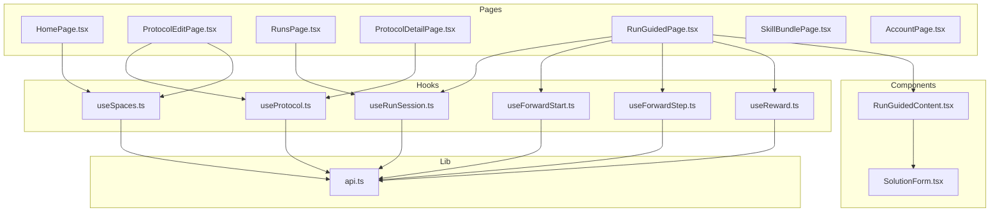
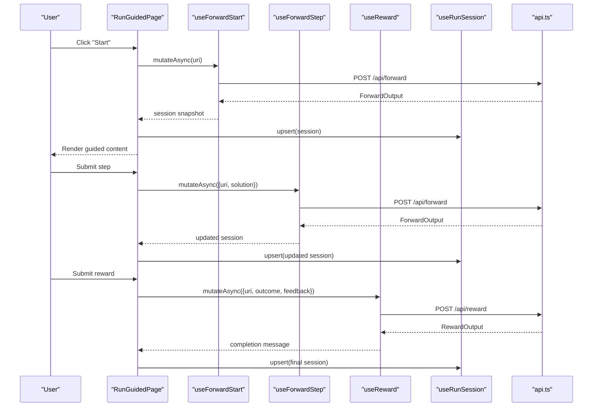
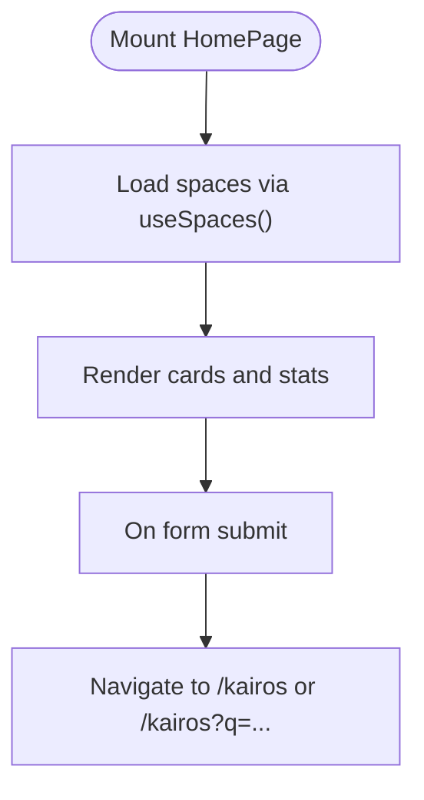
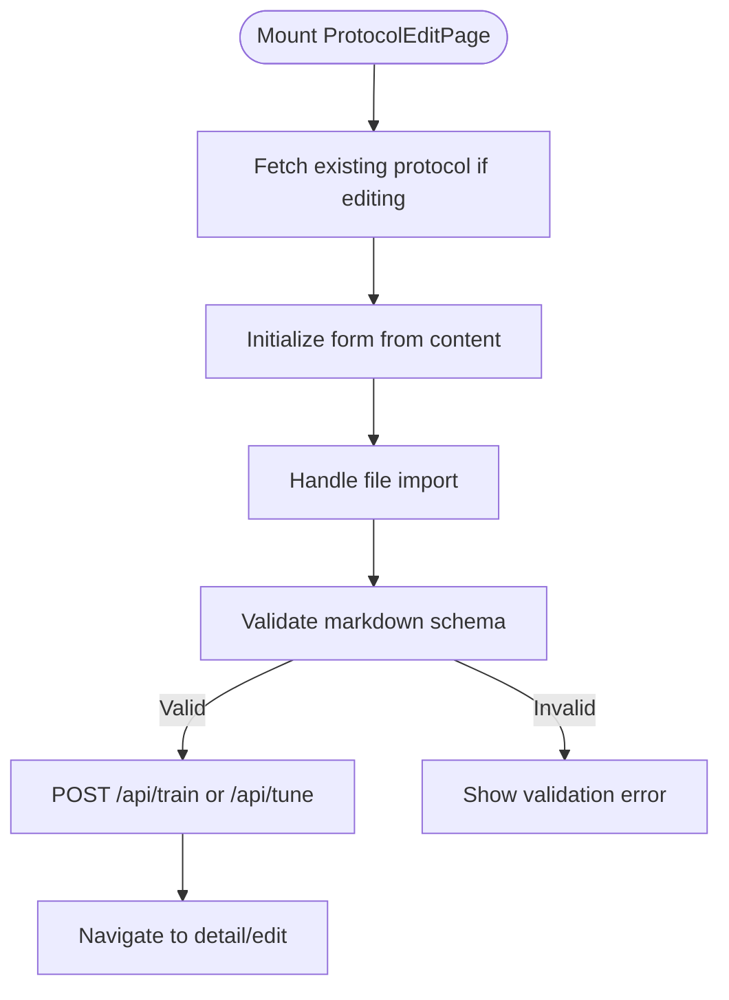
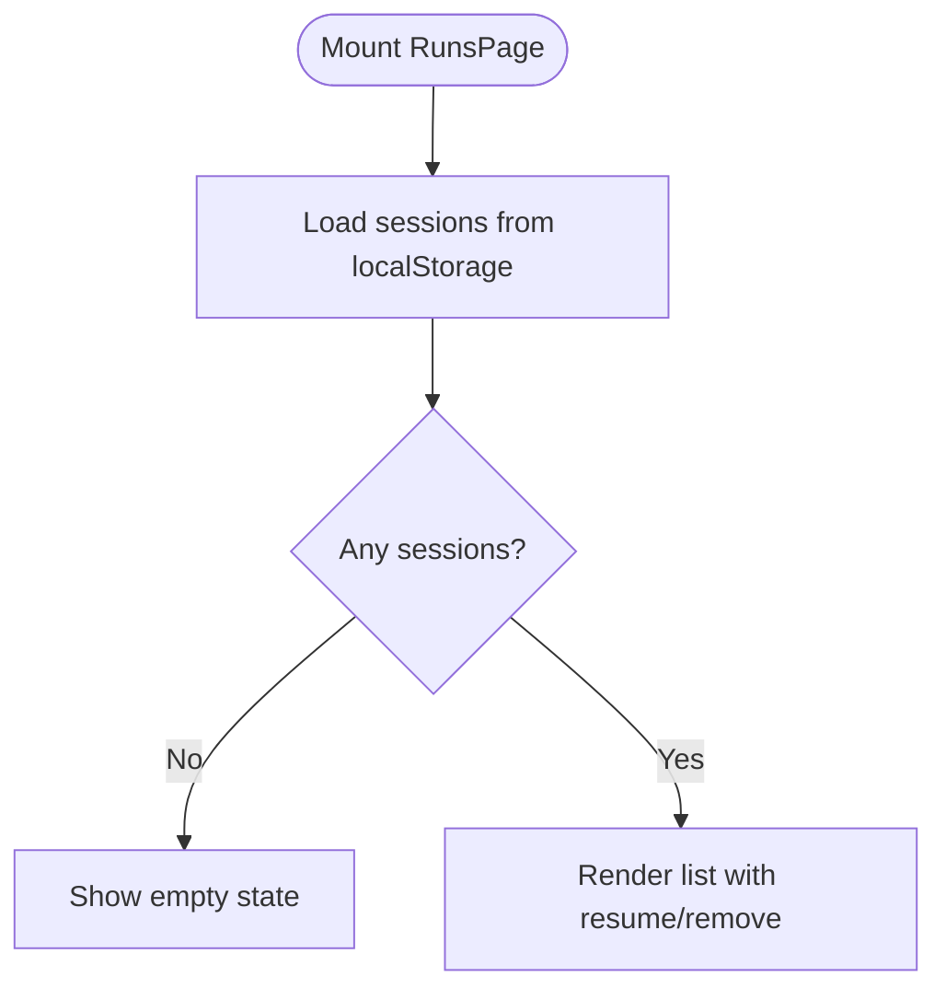
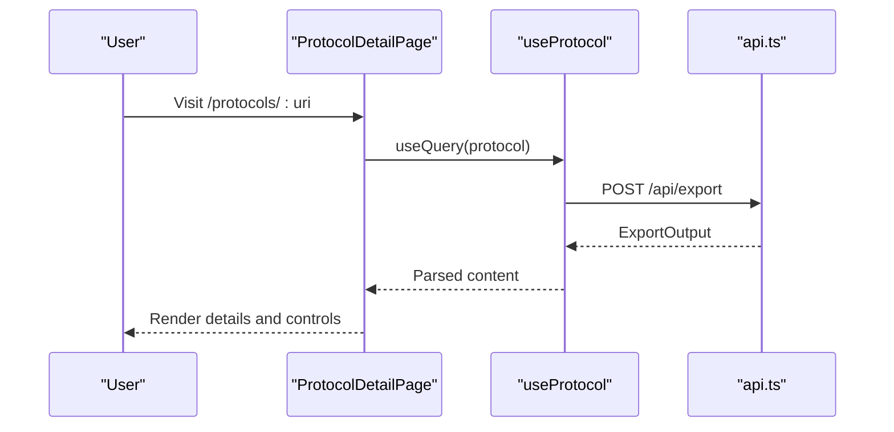
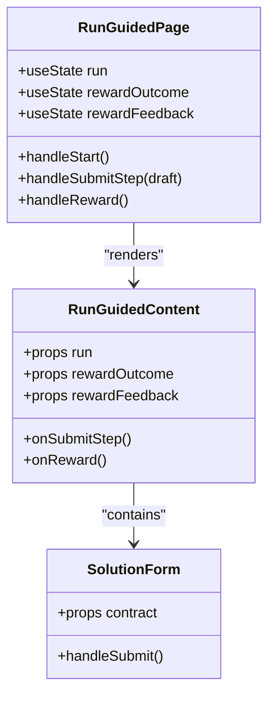
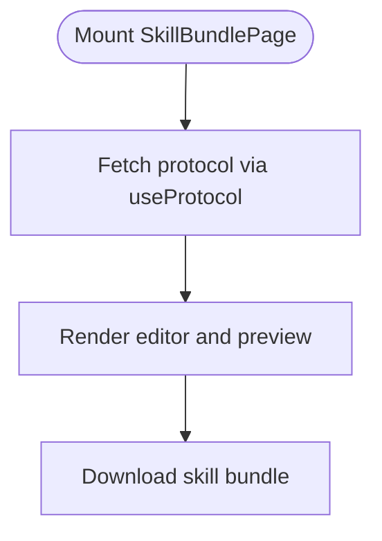
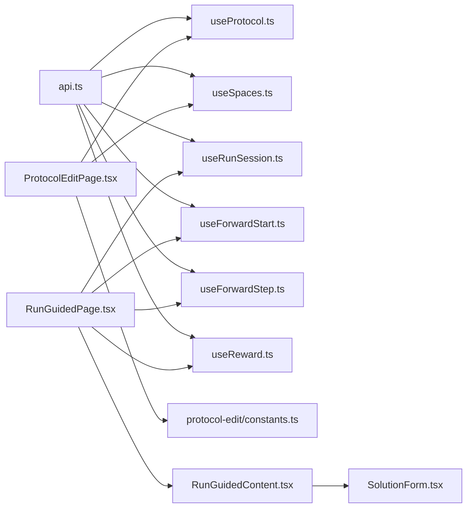

# Page Components

<cite>
**Referenced Files in This Document**
- [HomePage.tsx](file://src/ui/pages/HomePage.tsx)
- [ProtocolEditPage.tsx](file://src/ui/pages/ProtocolEditPage.tsx)
- [RunsPage.tsx](file://src/ui/pages/RunsPage.tsx)
- [ProtocolDetailPage.tsx](file://src/ui/pages/ProtocolDetailPage.tsx)
- [RunGuidedPage.tsx](file://src/ui/pages/RunGuidedPage.tsx)
- [SkillBundlePage.tsx](file://src/ui/pages/SkillBundlePage.tsx)
- [AccountPage.tsx](file://src/ui/pages/AccountPage.tsx)
- [useProtocol.ts](file://src/ui/hooks/useProtocol.ts)
- [useRunSession.ts](file://src/ui/hooks/useRunSession.ts)
- [useSpaces.ts](file://src/ui/hooks/useSpaces.ts)
- [api.ts](file://src/ui/lib/api.ts)
- [constants.ts](file://src/ui/pages/protocol-edit/constants.ts)
- [RunGuidedContent.tsx](file://src/ui/components/run/RunGuidedContent.tsx)
- [SolutionForm.tsx](file://src/ui/components/run/SolutionForm.tsx)
- [useForwardStart.ts](file://src/ui/hooks/useForwardStart.ts)
- [useForwardStep.ts](file://src/ui/hooks/useForwardStep.ts)
- [useReward.ts](file://src/ui/hooks/useReward.ts)
</cite>

## Table of Contents
1. [Introduction](#introduction)
2. [Project Structure](#project-structure)
3. [Core Components](#core-components)
4. [Architecture Overview](#architecture-overview)
5. [Detailed Component Analysis](#detailed-component-analysis)
6. [Dependency Analysis](#dependency-analysis)
7. [Performance Considerations](#performance-considerations)
8. [Troubleshooting Guide](#troubleshooting-guide)
9. [Conclusion](#conclusion)

## Introduction
This document provides a comprehensive guide to the KAIROS MCP page components and their specific functionality. It covers the major pages: HomePage, ProtocolEditPage, RunsPage, ProtocolDetailPage, RunGuidedPage, SkillBundlePage, and AccountPage. For each page, we explain component structure, data fetching patterns, state management, backend API integration, page-specific features, form handling, data visualization, user interaction patterns, lifecycle considerations, loading states, and performance characteristics.

## Project Structure
The UI pages are located under src/ui/pages and are composed of reusable components and hooks. Pages integrate with TanStack Query for data fetching, React Router for navigation, and local storage for run session persistence. Backend communication is centralized via a small wrapper around fetch.

**Diagram sources**
- [HomePage.tsx:1-132](file://src/ui/pages/HomePage.tsx#L1-L132)
- [ProtocolEditPage.tsx:1-338](file://src/ui/pages/ProtocolEditPage.tsx#L1-L338)
- [RunsPage.tsx:1-57](file://src/ui/pages/RunsPage.tsx#L1-L57)
- [ProtocolDetailPage.tsx:1-214](file://src/ui/pages/ProtocolDetailPage.tsx#L1-L214)
- [RunGuidedPage.tsx:1-240](file://src/ui/pages/RunGuidedPage.tsx#L1-L240)
- [SkillBundlePage.tsx:1-172](file://src/ui/pages/SkillBundlePage.tsx#L1-L172)
- [AccountPage.tsx:1-155](file://src/ui/pages/AccountPage.tsx#L1-L155)
- [useProtocol.ts:1-247](file://src/ui/hooks/useProtocol.ts#L1-L247)
- [useRunSession.ts:1-194](file://src/ui/hooks/useRunSession.ts#L1-L194)
- [useSpaces.ts:1-48](file://src/ui/hooks/useSpaces.ts#L1-L48)
- [useForwardStart.ts:1-22](file://src/ui/hooks/useForwardStart.ts#L1-L22)
- [useForwardStep.ts:1-27](file://src/ui/hooks/useForwardStep.ts#L1-L27)
- [useReward.ts:1-28](file://src/ui/hooks/useReward.ts#L1-L28)
- [RunGuidedContent.tsx:1-276](file://src/ui/components/run/RunGuidedContent.tsx#L1-L276)
- [SolutionForm.tsx:1-316](file://src/ui/components/run/SolutionForm.tsx#L1-L316)
- [api.ts:1-14](file://src/ui/lib/api.ts#L1-L14)

**Section sources**
- [HomePage.tsx:1-132](file://src/ui/pages/HomePage.tsx#L1-L132)
- [ProtocolEditPage.tsx:1-338](file://src/ui/pages/ProtocolEditPage.tsx#L1-L338)
- [RunsPage.tsx:1-57](file://src/ui/pages/RunsPage.tsx#L1-L57)
- [ProtocolDetailPage.tsx:1-214](file://src/ui/pages/ProtocolDetailPage.tsx#L1-L214)
- [RunGuidedPage.tsx:1-240](file://src/ui/pages/RunGuidedPage.tsx#L1-L240)
- [SkillBundlePage.tsx:1-172](file://src/ui/pages/SkillBundlePage.tsx#L1-L172)
- [AccountPage.tsx:1-155](file://src/ui/pages/AccountPage.tsx#L1-L155)

## Core Components
- HomePage: Provides quick search, space statistics, and navigation to browse, create, and runs.
- ProtocolEditPage: Full-featured editor for protocol markdown with live preview, import, validation, and save actions.
- RunsPage: Lists recent run sessions with resume and remove actions.
- ProtocolDetailPage: Renders protocol content, export options, and step visualization.
- RunGuidedPage: Orchestrates guided runs with start, step submission, reward, and session persistence.
- SkillBundlePage: Allows exporting a protocol as a skill bundle with configurable metadata and preview.
- AccountPage: Displays user profile and theme preferences.

**Section sources**
- [HomePage.tsx:10-132](file://src/ui/pages/HomePage.tsx#L10-L132)
- [ProtocolEditPage.tsx:21-338](file://src/ui/pages/ProtocolEditPage.tsx#L21-L338)
- [RunsPage.tsx:5-57](file://src/ui/pages/RunsPage.tsx#L5-L57)
- [ProtocolDetailPage.tsx:16-214](file://src/ui/pages/ProtocolDetailPage.tsx#L16-L214)
- [RunGuidedPage.tsx:24-240](file://src/ui/pages/RunGuidedPage.tsx#L24-L240)
- [SkillBundlePage.tsx:17-172](file://src/ui/pages/SkillBundlePage.tsx#L17-L172)
- [AccountPage.tsx:24-155](file://src/ui/pages/AccountPage.tsx#L24-L155)

## Architecture Overview
The pages rely on a consistent data-fetching and state management architecture:
- TanStack Query for caching and refetching: useProtocol, useSpaces, useRunSession, and mutations for forward/start/reward.
- Local storage-backed run sessions for offline continuity.
- Centralized API client for HTTP requests.
- Reusable components for guided run UI and form handling.

**Diagram sources**
- [RunGuidedPage.tsx:56-165](file://src/ui/pages/RunGuidedPage.tsx#L56-L165)
- [useForwardStart.ts:5-21](file://src/ui/hooks/useForwardStart.ts#L5-L21)
- [useForwardStep.ts:10-26](file://src/ui/hooks/useForwardStep.ts#L10-L26)
- [useReward.ts:11-27](file://src/ui/hooks/useReward.ts#L11-L27)
- [useRunSession.ts:164-180](file://src/ui/hooks/useRunSession.ts#L164-L180)
- [api.ts:3-13](file://src/ui/lib/api.ts#L3-L13)

## Detailed Component Analysis

### HomePage
- Purpose: Lightweight orientation and quick access to protocols, browsing, creation, and runs.
- Data fetching: Uses useSpaces to load space statistics and adapter counts.
- State management: Local form state for search input; navigates on submit.
- UI patterns: Surface cards, search input with hints, and action buttons.
- Lifecycle: Renders immediately while data loads; shows placeholders when loading or empty.

**Diagram sources**
- [HomePage.tsx:13-20](file://src/ui/pages/HomePage.tsx#L13-L20)
- [HomePage.tsx:25-131](file://src/ui/pages/HomePage.tsx#L25-L131)

**Section sources**
- [HomePage.tsx:10-132](file://src/ui/pages/HomePage.tsx#L10-L132)
- [useSpaces.ts:24-47](file://src/ui/hooks/useSpaces.ts#L24-L47)

### ProtocolEditPage
- Purpose: Edit protocol markdown with live preview, import from file, validation, and save to backend.
- Data fetching: useProtocol for existing protocol content; useSpaces for spaces and target/move selection.
- State management: Form state for protocol label, triggers, steps, completion; validation errors; saving state; file upload handling.
- Validation: Zod schema ensures required sections and structure.
- API integration: POST /api/train for new protocols; POST /api/tune for updates; supports forking via source adapter URI.
- Preview: Live rendering of parsed markdown from form state.

**Diagram sources**
- [ProtocolEditPage.tsx:28-80](file://src/ui/pages/ProtocolEditPage.tsx#L28-L80)
- [constants.ts:4-21](file://src/ui/pages/protocol-edit/constants.ts#L4-L21)
- [useProtocol.ts:18-49](file://src/ui/hooks/useProtocol.ts#L18-L49)
- [useSpaces.ts:24-47](file://src/ui/hooks/useSpaces.ts#L24-L47)

**Section sources**
- [ProtocolEditPage.tsx:21-338](file://src/ui/pages/ProtocolEditPage.tsx#L21-L338)
- [useProtocol.ts:87-247](file://src/ui/hooks/useProtocol.ts#L87-L247)
- [constants.ts:1-21](file://src/ui/pages/protocol-edit/constants.ts#L1-L21)

### RunsPage
- Purpose: List recent run sessions, resume, and remove.
- Data fetching: useRunSessions for persisted sessions.
- UI patterns: List items with metadata and action buttons; empty state handling.

**Diagram sources**
- [RunsPage.tsx:7-54](file://src/ui/pages/RunsPage.tsx#L7-L54)
- [useRunSession.ts:152-180](file://src/ui/hooks/useRunSession.ts#L152-L180)

**Section sources**
- [RunsPage.tsx:5-57](file://src/ui/pages/RunsPage.tsx#L5-L57)
- [useRunSession.ts:139-194](file://src/ui/hooks/useRunSession.ts#L139-L194)

### ProtocolDetailPage
- Purpose: Display protocol details, export as Markdown or Skill bundle, and visualize steps.
- Data fetching: useProtocol for content parsing.
- Features: Download Markdown, download Skill bundle, copy URI, edit/duplicate links, step flow graph, and step list with challenge cards.
- Error handling: Loading, error, and not-found states with navigation to home.

**Diagram sources**
- [ProtocolDetailPage.tsx:20-41](file://src/ui/pages/ProtocolDetailPage.tsx#L20-L41)
- [useProtocol.ts:18-49](file://src/ui/hooks/useProtocol.ts#L18-L49)
- [api.ts:3-13](file://src/ui/lib/api.ts#L3-L13)

**Section sources**
- [ProtocolDetailPage.tsx:16-214](file://src/ui/pages/ProtocolDetailPage.tsx#L16-L214)
- [useProtocol.ts:87-160](file://src/ui/hooks/useProtocol.ts#L87-L160)

### RunGuidedPage
- Purpose: Guide users through a protocol run with step-by-step challenges, solution submission, and reward.
- Data fetching: useForwardStart, useForwardStep, useReward for mutations; useRunSession for persistence.
- State management: Session state, reward outcome/feedback, copy status, and pending states.
- UI composition: Delegated to RunGuidedContent, which renders flow graph, current step, challenge card, solution form, reward form, and history.

**Diagram sources**
- [RunGuidedPage.tsx:24-240](file://src/ui/pages/RunGuidedPage.tsx#L24-L240)
- [RunGuidedContent.tsx:43-276](file://src/ui/components/run/RunGuidedContent.tsx#L43-L276)
- [SolutionForm.tsx:13-316](file://src/ui/components/run/SolutionForm.tsx#L13-L316)

**Section sources**
- [RunGuidedPage.tsx:24-240](file://src/ui/pages/RunGuidedPage.tsx#L24-L240)
- [useForwardStart.ts:5-21](file://src/ui/hooks/useForwardStart.ts#L5-L21)
- [useForwardStep.ts:10-26](file://src/ui/hooks/useForwardStep.ts#L10-L26)
- [useReward.ts:11-27](file://src/ui/hooks/useReward.ts#L11-L27)
- [useRunSession.ts:14-28](file://src/ui/hooks/useRunSession.ts#L14-L28)

### SkillBundlePage
- Purpose: Export a protocol as a skill bundle with customizable metadata and preview.
- Data fetching: useProtocol for content parsing.
- Features: Name/description/usage inputs, include references toggle, preview tree, and download action.

**Diagram sources**
- [SkillBundlePage.tsx:17-172](file://src/ui/pages/SkillBundlePage.tsx#L17-L172)
- [useProtocol.ts:18-49](file://src/ui/hooks/useProtocol.ts#L18-L49)

**Section sources**
- [SkillBundlePage.tsx:17-172](file://src/ui/pages/SkillBundlePage.tsx#L17-L172)

### AccountPage
- Purpose: Display user identity and account details, manage theme preference.
- Data fetching: useMe hook for profile data.
- UI patterns: Theme selector with system preference support and sign-in/out actions.

**Section sources**
- [AccountPage.tsx:24-155](file://src/ui/pages/AccountPage.tsx#L24-L155)

## Dependency Analysis
- Pages depend on hooks for data and side effects; hooks depend on api.ts for HTTP calls.
- ProtocolEditPage depends on constants.ts for validation and defaults.
- RunGuidedPage composes RunGuidedContent and SolutionForm for complex interactions.
- useRunSession persists sessions to localStorage and normalizes legacy keys.

**Diagram sources**
- [api.ts:3-13](file://src/ui/lib/api.ts#L3-L13)
- [useProtocol.ts:18-49](file://src/ui/hooks/useProtocol.ts#L18-L49)
- [useSpaces.ts:24-47](file://src/ui/hooks/useSpaces.ts#L24-L47)
- [useRunSession.ts:152-194](file://src/ui/hooks/useRunSession.ts#L152-L194)
- [useForwardStart.ts:5-21](file://src/ui/hooks/useForwardStart.ts#L5-L21)
- [useForwardStep.ts:10-26](file://src/ui/hooks/useForwardStep.ts#L10-L26)
- [useReward.ts:11-27](file://src/ui/hooks/useReward.ts#L11-L27)
- [ProtocolEditPage.tsx:14-45](file://src/ui/pages/ProtocolEditPage.tsx#L14-L45)
- [constants.ts:4-21](file://src/ui/pages/protocol-edit/constants.ts#L4-L21)
- [RunGuidedPage.tsx:34-36](file://src/ui/pages/RunGuidedPage.tsx#L34-L36)
- [RunGuidedContent.tsx:43-276](file://src/ui/components/run/RunGuidedContent.tsx#L43-L276)
- [SolutionForm.tsx:13-316](file://src/ui/components/run/SolutionForm.tsx#L13-L316)

**Section sources**
- [ProtocolEditPage.tsx:14-45](file://src/ui/pages/ProtocolEditPage.tsx#L14-L45)
- [RunGuidedPage.tsx:34-36](file://src/ui/pages/RunGuidedPage.tsx#L34-L36)
- [RunGuidedContent.tsx:43-276](file://src/ui/components/run/RunGuidedContent.tsx#L43-L276)
- [SolutionForm.tsx:13-316](file://src/ui/components/run/SolutionForm.tsx#L13-L316)

## Performance Considerations
- Prefer lazy loading and conditional enabling of queries (e.g., useProtocol enabled only when URI exists).
- Debounce or batch frequent updates in forms to reduce re-renders.
- Use minimal state updates; compute derived values from normalized data.
- Persist run sessions locally to avoid repeated network calls during guided runs.
- Validate early and fail fast to minimize unnecessary API calls.
- Use memoization for expensive computations in render-heavy components.

## Troubleshooting Guide
- ProtocolEditPage validation errors: Ensure required sections exist and markdown conforms to schema.
- ProtocolEditPage save failures: Inspect error messages from API responses and surface them to users.
- RunGuidedPage errors: Check forwardStart, forwardStep, and reward mutation errors; display actionable alerts and allow retry.
- RunsPage empty state: Sessions may be cleared or missing; verify localStorage availability.
- ProtocolDetailPage not found: Confirm URI correctness and backend export endpoint availability.

**Section sources**
- [ProtocolEditPage.tsx:120-187](file://src/ui/pages/ProtocolEditPage.tsx#L120-L187)
- [RunGuidedPage.tsx:202-218](file://src/ui/pages/RunGuidedPage.tsx#L202-L218)
- [RunsPage.tsx:14-18](file://src/ui/pages/RunsPage.tsx#L14-L18)
- [ProtocolDetailPage.tsx:27-39](file://src/ui/pages/ProtocolDetailPage.tsx#L27-L39)

## Conclusion
The KAIROS MCP pages provide a cohesive, data-driven UI for managing protocols, running guided workflows, and exporting skill bundles. They leverage TanStack Query for robust data fetching, React Router for navigation, and local storage for continuity. The architecture emphasizes clear separation of concerns, reusable components, and resilient error handling to deliver a reliable user experience.