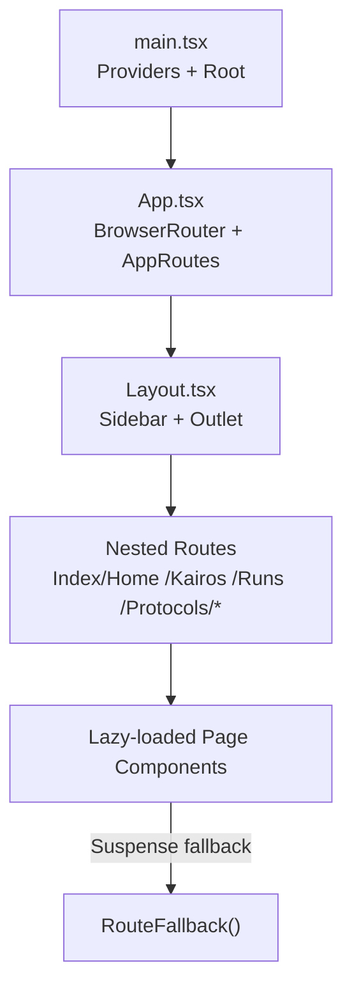
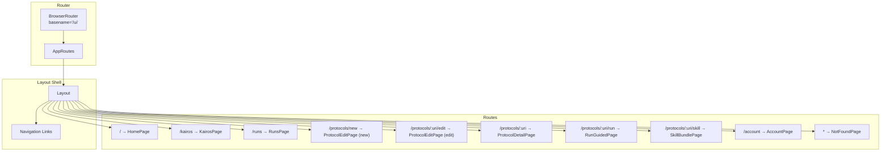
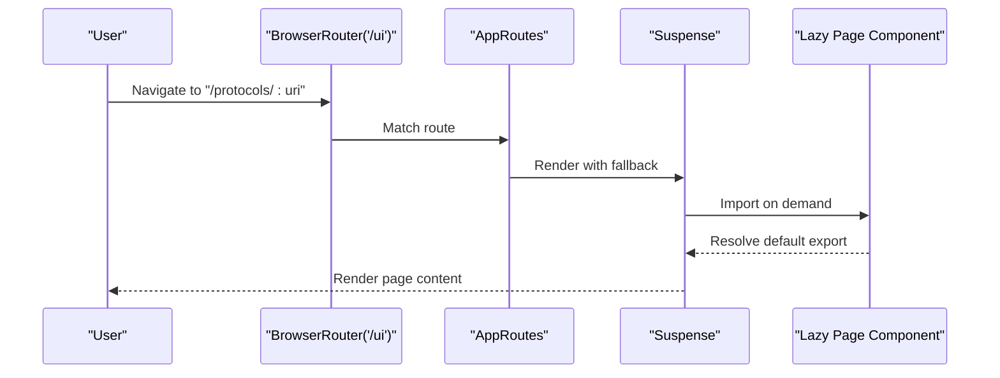
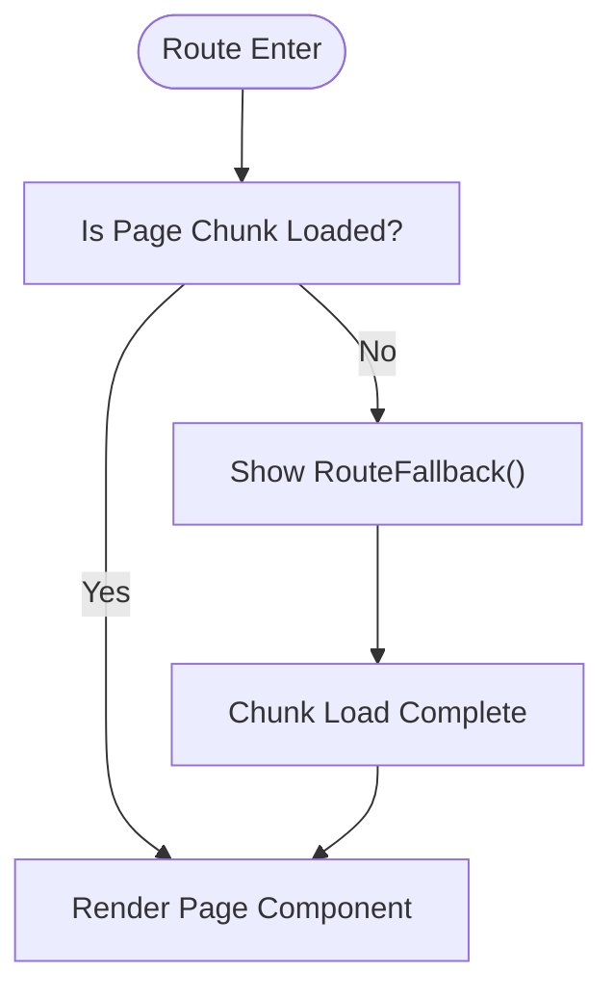
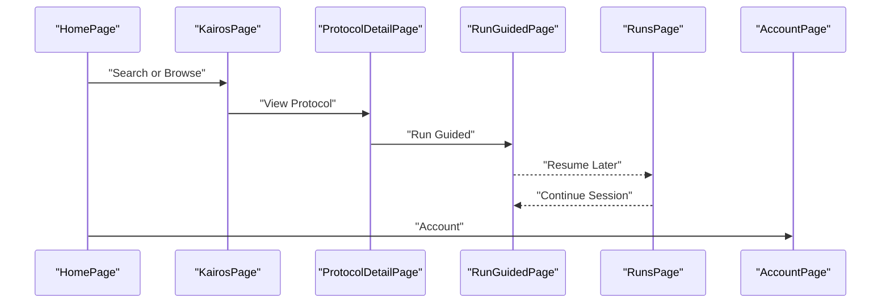
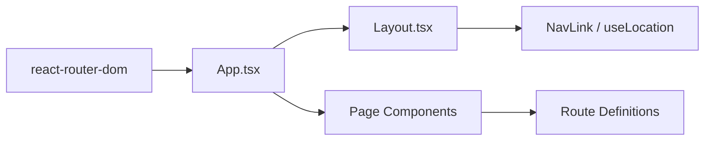

# Routing & Navigation

<cite>
**Referenced Files in This Document**
- [src/ui/main.tsx](file://src/ui/main.tsx)
- [src/ui/App.tsx](file://src/ui/App.tsx)
- [src/ui/components/Layout.tsx](file://src/ui/components/Layout.tsx)
- [src/ui/pages/HomePage.tsx](file://src/ui/pages/HomePage.tsx)
- [src/ui/pages/ProtocolDetailPage.tsx](file://src/ui/pages/ProtocolDetailPage.tsx)
- [src/ui/pages/ProtocolEditPage.tsx](file://src/ui/pages/ProtocolEditPage.tsx)
- [src/ui/pages/RunGuidedPage.tsx](file://src/ui/pages/RunGuidedPage.tsx)
- [src/ui/pages/RunsPage.tsx](file://src/ui/pages/RunsPage.tsx)
- [src/ui/pages/AccountPage.tsx](file://src/ui/pages/AccountPage.tsx)
- [src/ui/pages/NotFoundPage.tsx](file://src/ui/pages/NotFoundPage.tsx)
- [src/ui/pages/kairos-page-sections.tsx](file://src/ui/pages/kairos-page-sections.tsx)
- [src/ui/pages/protocol-edit/ProtocolEditImportSection.tsx](file://src/ui/pages/protocol-edit/ProtocolEditImportSection.tsx)
- [src/ui/pages/protocol-edit/ProtocolEditPreviewColumn.tsx](file://src/ui/pages/protocol-edit/ProtocolEditPreviewColumn.tsx)
- [src/ui/pages/protocol-edit/ProtocolEditSpaceSection.tsx](file://src/ui/pages/protocol-edit/ProtocolEditSpaceSection.tsx)
</cite>

## Table of Contents
1. [Introduction](#introduction)
2. [Project Structure](#project-structure)
3. [Core Components](#core-components)
4. [Architecture Overview](#architecture-overview)
5. [Detailed Component Analysis](#detailed-component-analysis)
6. [Dependency Analysis](#dependency-analysis)
7. [Performance Considerations](#performance-considerations)
8. [Troubleshooting Guide](#troubleshooting-guide)
9. [Conclusion](#conclusion)

## Introduction
This document explains the KAIROS MCP UI routing and navigation system. It covers route-level code splitting using React.lazy and Suspense for performance, the route tree and nested routing patterns, BrowserRouter configuration with a basename, dynamic routing via parameters, fallback loading states, navigation flows between pages, and guidance for adding new routes while preserving maintainability.

## Project Structure
The routing is implemented in the UI layer under src/ui. The main entry initializes providers and mounts the router. The App component defines the route tree and wraps each page in Suspense for lazy loading. The Layout component provides a shared shell with persistent sidebar navigation and renders child routes via Outlet.

**Diagram sources**
- [src/ui/main.tsx:11-19](file://src/ui/main.tsx#L11-L19)
- [src/ui/App.tsx:126-132](file://src/ui/App.tsx#L126-L132)
- [src/ui/App.tsx:37-124](file://src/ui/App.tsx#L37-L124)
- [src/ui/components/Layout.tsx:11-108](file://src/ui/components/Layout.tsx#L11-L108)

**Section sources**
- [src/ui/main.tsx:1-20](file://src/ui/main.tsx#L1-L20)
- [src/ui/App.tsx:126-132](file://src/ui/App.tsx#L126-L132)
- [src/ui/components/Layout.tsx:11-108](file://src/ui/components/Layout.tsx#L11-L108)

## Core Components
- BrowserRouter with basename "/ui": Ensures all client-side routes are prefixed under /ui, aligning with backend static serving expectations.
- AppRoutes: Declares the route tree with nested routes inside Layout.
- Lazy-loaded pages: Each page is imported on-demand using React.lazy and wrapped in Suspense for fallback rendering.
- RouteFallback: Centralized loading indicator for lazy chunks.
- Layout: Provides persistent navigation and renders child routes via Outlet.

**Section sources**
- [src/ui/App.tsx:5-26](file://src/ui/App.tsx#L5-L26)
- [src/ui/App.tsx:28-34](file://src/ui/App.tsx#L28-L34)
- [src/ui/App.tsx:37-124](file://src/ui/App.tsx#L37-L124)
- [src/ui/App.tsx:126-132](file://src/ui/App.tsx#L126-L132)
- [src/ui/components/Layout.tsx:11-108](file://src/ui/components/Layout.tsx#L11-L108)

## Architecture Overview
The routing architecture uses a single route tree with nested routes under a shared layout. Dynamic segments power protocol-centric views, and the basename ensures compatibility with reverse proxies and backend routing.

**Diagram sources**
- [src/ui/App.tsx:126-132](file://src/ui/App.tsx#L126-L132)
- [src/ui/App.tsx:37-124](file://src/ui/App.tsx#L37-L124)
- [src/ui/components/Layout.tsx:58-90](file://src/ui/components/Layout.tsx#L58-L90)

## Detailed Component Analysis

### Route Tree and Nested Routing
- Root route "/" renders HomePage inside Layout.
- "/kairos" renders Kairos-related content (implemented in KairosPage).
- "/runs" renders RunsPage with saved run sessions.
- "/protocols/new" renders ProtocolEditPage for creating new protocols.
- "/protocols/:uri/edit" renders ProtocolEditPage for editing existing protocols.
- "/protocols/:uri" renders ProtocolDetailPage for viewing protocol details.
- "/protocols/:uri/run" renders RunGuidedPage for guided runs.
- "/protocols/:uri/skill" renders SkillBundlePage for skill bundle actions.
- "/account" renders AccountPage.
- Wildcard "*" renders NotFoundPage.

Dynamic segment ":uri" carries protocol identifiers across multiple routes, enabling deep linking and navigation between protocol-centric views.

**Section sources**
- [src/ui/App.tsx:37-124](file://src/ui/App.tsx#L37-L124)

### Route-Level Code Splitting with React.lazy and Suspense
Each page component is imported lazily and wrapped in Suspense with a shared fallback. This keeps the initial bundle small and defers loading of less-frequently visited pages until navigation occurs.

**Diagram sources**
- [src/ui/App.tsx:5-26](file://src/ui/App.tsx#L5-L26)
- [src/ui/App.tsx:28-34](file://src/ui/App.tsx#L28-L34)
- [src/ui/App.tsx:37-124](file://src/ui/App.tsx#L37-L124)

**Section sources**
- [src/ui/App.tsx:5-26](file://src/ui/App.tsx#L5-L26)
- [src/ui/App.tsx:28-34](file://src/ui/App.tsx#L28-L34)

### BrowserRouter Basename and Navigation Patterns
- BrowserRouter is configured with basename "/ui". All internal links and navigation should be relative to this base.
- Layout provides NavLink-based navigation for primary sections (Home, Kairos, Create, Runs, Account).
- Many page components construct URLs using template literals with encodeURIComponent to safely encode dynamic segments like ":uri".

Examples of navigation patterns:
- From HomePage to Kairos search with query params.
- From ProtocolDetailPage to run/edit/skill routes using ":uri".
- From RunsPage to resume a run with a session query param.
- From Kairos results to ProtocolDetailPage using ":uri".

**Section sources**
- [src/ui/App.tsx:126-132](file://src/ui/App.tsx#L126-L132)
- [src/ui/components/Layout.tsx:58-90](file://src/ui/components/Layout.tsx#L58-L90)
- [src/ui/pages/HomePage.tsx:15-20](file://src/ui/pages/HomePage.tsx#L15-L20)
- [src/ui/pages/ProtocolDetailPage.tsx:94-105](file://src/ui/pages/ProtocolDetailPage.tsx#L94-L105)
- [src/ui/pages/RunsPage.tsx:35-40](file://src/ui/pages/RunsPage.tsx#L35-L40)
- [src/ui/pages/kairos-page-sections.tsx:101-107](file://src/ui/pages/kairos-page-sections.tsx#L101-L107)

### Dynamic Routing and Route Parameters
- ":uri" is a dynamic segment used across protocol routes. Components decode the parameter and use it to fetch data or construct further links.
- RunGuidedPage also reads a "session" query parameter to restore an existing run session.

Common patterns:
- Decoding ":uri" before use.
- Using useNavigate/useSearchParams to pass state via URL.
- Constructing links with proper encoding for special characters.

**Section sources**
- [src/ui/App.tsx:74-82](file://src/ui/App.tsx#L74-L82)
- [src/ui/pages/ProtocolDetailPage.tsx:18-20](file://src/ui/pages/ProtocolDetailPage.tsx#L18-L20)
- [src/ui/pages/RunGuidedPage.tsx:26-31](file://src/ui/pages/RunGuidedPage.tsx#L26-L31)

### Fallback Loading States
- RouteFallback provides a consistent loading indicator during lazy imports.
- Individual pages may render loading placeholders while fetching data (e.g., ProtocolDetailPage, ProtocolEditPage, RunsPage).

**Diagram sources**
- [src/ui/App.tsx:28-34](file://src/ui/App.tsx#L28-L34)
- [src/ui/App.tsx:44-46](file://src/ui/App.tsx#L44-L46)

**Section sources**
- [src/ui/App.tsx:28-34](file://src/ui/App.tsx#L28-L34)
- [src/ui/pages/ProtocolDetailPage.tsx:24-29](file://src/ui/pages/ProtocolDetailPage.tsx#L24-L29)
- [src/ui/pages/RunsPage.tsx:6-8](file://src/ui/pages/RunsPage.tsx#L6-L8)

### Navigation Flow Between Pages
The typical flow:
- Home: Search or quick links to Kairos browse, Create, or Runs.
- Kairos: Browse or refine search; select a protocol to view details.
- ProtocolDetail: Actions to run, edit, duplicate, or download skill bundle.
- RunGuided: Guided execution with start, step submission, and reward.
- Runs: Resume or remove previous sessions.
- Account: View profile and theme preferences.

**Diagram sources**
- [src/ui/pages/HomePage.tsx:56-90](file://src/ui/pages/HomePage.tsx#L56-L90)
- [src/ui/pages/kairos-page-sections.tsx:187-211](file://src/ui/pages/kairos-page-sections.tsx#L187-L211)
- [src/ui/pages/ProtocolDetailPage.tsx:94-105](file://src/ui/pages/ProtocolDetailPage.tsx#L94-L105)
- [src/ui/pages/RunGuidedPage.tsx:56-81](file://src/ui/pages/RunGuidedPage.tsx#L56-L81)
- [src/ui/pages/RunsPage.tsx:35-40](file://src/ui/pages/RunsPage.tsx#L35-L40)
- [src/ui/pages/AccountPage.tsx:24-48](file://src/ui/pages/AccountPage.tsx#L24-L48)

**Section sources**
- [src/ui/pages/HomePage.tsx:56-90](file://src/ui/pages/HomePage.tsx#L56-L90)
- [src/ui/pages/kairos-page-sections.tsx:187-211](file://src/ui/pages/kairos-page-sections.tsx#L187-L211)
- [src/ui/pages/ProtocolDetailPage.tsx:94-105](file://src/ui/pages/ProtocolDetailPage.tsx#L94-L105)
- [src/ui/pages/RunGuidedPage.tsx:56-81](file://src/ui/pages/RunGuidedPage.tsx#L56-L81)
- [src/ui/pages/RunsPage.tsx:35-40](file://src/ui/pages/RunsPage.tsx#L35-L40)
- [src/ui/pages/AccountPage.tsx:24-48](file://src/ui/pages/AccountPage.tsx#L24-L48)

### Route Guards and Authentication
- Authentication state is surfaced in AccountPage (signed-in vs anonymous).
- Authentication callbacks and logout links are present in AccountPage.
- No explicit route guard logic is implemented in the routing layer itself; authentication checks are typically handled by hooks and page components.

Recommendation:
- Add a higher-order wrapper around lazy components to check auth state before rendering.
- Alternatively, enforce guards at the component level using redirect logic when unauthenticated.

**Section sources**
- [src/ui/pages/AccountPage.tsx:24-48](file://src/ui/pages/AccountPage.tsx#L24-L48)

### Adding New Routes and Maintaining Structure
Steps to add a new route:
1. Create a new page component under src/ui/pages/.
2. Import the component lazily in App.tsx and wrap it in Suspense with RouteFallback.
3. Add a new Route under the Layout in App.tsx with appropriate path and parameter segments.
4. Update Layout navigation (optional) to include a link to the new route.
5. Ensure any dynamic parameters are decoded and sanitized before use.
6. Verify basename "/ui" compatibility for internal links.

Best practices:
- Keep route paths concise and hierarchical.
- Use consistent parameter naming (e.g., ":uri").
- Centralize fallback UI in RouteFallback.
- Prefer relative links within the app; absolute links should respect the basename.

**Section sources**
- [src/ui/App.tsx:5-26](file://src/ui/App.tsx#L5-L26)
- [src/ui/App.tsx:37-124](file://src/ui/App.tsx#L37-L124)
- [src/ui/components/Layout.tsx:58-90](file://src/ui/components/Layout.tsx#L58-L90)

## Dependency Analysis
The routing layer depends on:
- react-router-dom for routing primitives (BrowserRouter, Routes, Route, Outlet, NavLink, useNavigate, useLocation, useSearchParams, useParams).
- Internal page components and shared layout.
- Suspense and lazy for code splitting.

**Diagram sources**
- [src/ui/App.tsx:1-3](file://src/ui/App.tsx#L1-L3)
- [src/ui/components/Layout.tsx:1-3](file://src/ui/components/Layout.tsx#L1-L3)

**Section sources**
- [src/ui/App.tsx:1-3](file://src/ui/App.tsx#L1-L3)
- [src/ui/components/Layout.tsx:1-3](file://src/ui/components/Layout.tsx#L1-L3)

## Performance Considerations
- Route-level code splitting reduces initial bundle size by deferring page loads until navigation.
- Suspense fallback prevents blank screen while chunks are loading.
- Keep lazy imports granular; avoid overly large lazy boundaries.
- Minimize heavy work in route components during initial render; defer to effects or lazy initialization.

[No sources needed since this section provides general guidance]

## Troubleshooting Guide
Common issues and resolutions:
- Blank screen on navigation: Verify Suspense fallback is present and lazy imports resolve correctly.
- 404 after refresh: Confirm BrowserRouter basename "/ui" matches backend static serving and that links use relative paths.
- Broken dynamic links: Ensure ":uri" parameters are encoded/decoded properly when constructing or parsing URLs.
- Navigation not updating active state: Check NavLink end and aria-current attributes in Layout.

**Section sources**
- [src/ui/App.tsx:28-34](file://src/ui/App.tsx#L28-L34)
- [src/ui/App.tsx:126-132](file://src/ui/App.tsx#L126-L132)
- [src/ui/pages/ProtocolDetailPage.tsx:18-20](file://src/ui/pages/ProtocolDetailPage.tsx#L18-L20)
- [src/ui/components/Layout.tsx:58-90](file://src/ui/components/Layout.tsx#L58-L90)

## Conclusion
The routing system leverages React Router with route-level code splitting to optimize performance, a shared Layout for consistent navigation, and a clear route tree with dynamic segments for protocol-centric workflows. By following the established patterns for lazy loading, basename usage, and parameter handling, new features can be integrated efficiently while maintaining a predictable and scalable structure.