# State Management

<cite>
**Referenced Files in This Document**
- [useActivate.ts](file://src/ui/hooks/useActivate.ts)
- [useForwardStart.ts](file://src/ui/hooks/useForwardStart.ts)
- [useForwardStep.ts](file://src/ui/hooks/useForwardStep.ts)
- [useProtocol.ts](file://src/ui/hooks/useProtocol.ts)
- [useReward.ts](file://src/ui/hooks/useReward.ts)
- [useRunSession.ts](file://src/ui/hooks/useRunSession.ts)
- [useSpaces.ts](file://src/ui/hooks/useSpaces.ts)
- [useAuth.ts](file://src/ui/hooks/useAuth.ts)
- [api.ts](file://src/ui/lib/api.ts)
- [runToolTypes.ts](file://src/ui/lib/runToolTypes.ts)
- [activate_schema.ts](file://src/tools/activate_schema.ts)
- [forward_schema.ts](file://src/tools/forward_schema.ts)
- [reward_schema.ts](file://src/tools/reward_schema.ts)
- [spaces_schema.ts](file://src/tools/spaces_schema.ts)
</cite>

## Table of Contents
1. [Introduction](#introduction)
2. [Project Structure](#project-structure)
3. [Core Components](#core-components)
4. [Architecture Overview](#architecture-overview)
5. [Detailed Component Analysis](#detailed-component-analysis)
6. [Dependency Analysis](#dependency-analysis)
7. [Performance Considerations](#performance-considerations)
8. [Troubleshooting Guide](#troubleshooting-guide)
9. [Conclusion](#conclusion)
10. [Appendices](#appendices)

## Introduction
This document explains the KAIROS MCP state management system implemented via custom React hooks in the UI layer. It focuses on the following hooks: useActivate, useForwardStart, useForwardStep, useProtocol, useReward, useRunSession, useSpaces, and useAuth. The guide covers state management patterns, data fetching strategies, backend integration, hook composition, error handling, loading states, caching, and performance optimizations. It also provides practical guidance for extending the system with new hooks while maintaining consistency.

## Project Structure
The state management hooks live under the UI layer and integrate with typed tool schemas and a lightweight API client. The key areas are:
- UI hooks: encapsulate TanStack Query patterns for queries and mutations
- API client: centralizes HTTP requests with consistent headers and credentials
- Tool schemas: define backend contract shapes for activation, forwarding, rewards, and spaces
- Run types: unify forward and reward types for session state

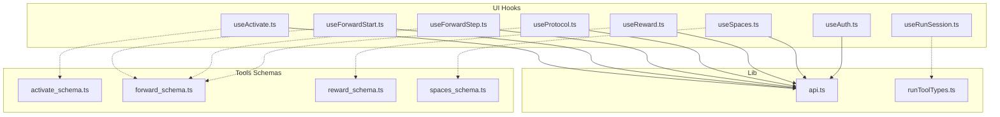

**Diagram sources**
- [useActivate.ts:1-41](file://src/ui/hooks/useActivate.ts#L1-L41)
- [useForwardStart.ts:1-22](file://src/ui/hooks/useForwardStart.ts#L1-L22)
- [useForwardStep.ts:1-27](file://src/ui/hooks/useForwardStep.ts#L1-L27)
- [useProtocol.ts:1-247](file://src/ui/hooks/useProtocol.ts#L1-L247)
- [useReward.ts:1-28](file://src/ui/hooks/useReward.ts#L1-L28)
- [useRunSession.ts:1-194](file://src/ui/hooks/useRunSession.ts#L1-L194)
- [useSpaces.ts:1-48](file://src/ui/hooks/useSpaces.ts#L1-L48)
- [useAuth.ts:1-25](file://src/ui/hooks/useAuth.ts#L1-L25)
- [api.ts:1-14](file://src/ui/lib/api.ts#L1-L14)
- [runToolTypes.ts:1-10](file://src/ui/lib/runToolTypes.ts#L1-L10)
- [activate_schema.ts:1-120](file://src/tools/activate_schema.ts#L1-L120)
- [forward_schema.ts:1-351](file://src/tools/forward_schema.ts#L1-L351)
- [reward_schema.ts:1-53](file://src/tools/reward_schema.ts#L1-L53)
- [spaces_schema.ts:1-53](file://src/tools/spaces_schema.ts#L1-L53)

**Section sources**
- [useActivate.ts:1-41](file://src/ui/hooks/useActivate.ts#L1-L41)
- [useForwardStart.ts:1-22](file://src/ui/hooks/useForwardStart.ts#L1-L22)
- [useForwardStep.ts:1-27](file://src/ui/hooks/useForwardStep.ts#L1-L27)
- [useProtocol.ts:1-247](file://src/ui/hooks/useProtocol.ts#L1-L247)
- [useReward.ts:1-28](file://src/ui/hooks/useReward.ts#L1-L28)
- [useRunSession.ts:1-194](file://src/ui/hooks/useRunSession.ts#L1-L194)
- [useSpaces.ts:1-48](file://src/ui/hooks/useSpaces.ts#L1-L48)
- [useAuth.ts:1-25](file://src/ui/hooks/useAuth.ts#L1-L25)
- [api.ts:1-14](file://src/ui/lib/api.ts#L1-L14)
- [runToolTypes.ts:1-10](file://src/ui/lib/runToolTypes.ts#L1-L10)
- [activate_schema.ts:1-120](file://src/tools/activate_schema.ts#L1-L120)
- [forward_schema.ts:1-351](file://src/tools/forward_schema.ts#L1-L351)
- [reward_schema.ts:1-53](file://src/tools/reward_schema.ts#L1-L53)
- [spaces_schema.ts:1-53](file://src/tools/spaces_schema.ts#L1-L53)

## Core Components
This section summarizes each hook’s responsibilities, state shape, and integration points.

- useActivate
  - Purpose: Fetch adapter activation suggestions for a query with optional scoping and limits.
  - State: TanStack Query query state (data, error, isLoading, isSuccess).
  - Inputs: query string, enabled flag, options (space, max_choices).
  - Backend: POST /api/activate with JSON body; parses ActivateOutput.
  - Caching: queryKey includes query, space, and max_choices; enabled gating prevents unnecessary requests.

- useForwardStart
  - Purpose: Start a forward run from an adapter or layer URI.
  - State: Mutation state (mutate, reset, data, error, isLoading).
  - Inputs: uri string.
  - Backend: POST /api/forward with { uri }.
  - Side effects: Returns ForwardOutput; caller continues with useForwardStep.

- useForwardStep
  - Purpose: Submit a solution to continue a forward run.
  - State: Mutation state (mutate, reset, data, error, isLoading).
  - Inputs: { uri, solution } where solution conforms to ForwardSolution.
  - Backend: POST /api/forward with { uri, solution }.
  - Side effects: Returns ForwardOutput with next_call, contract, and proof_hash.

- useProtocol
  - Purpose: Load protocol content by URI and parse markdown into structured data/form state.
  - State: Query state for ProtocolQueryData; parsing utilities produce ParsedStep and ProtocolFormState.
  - Inputs: uri string, enabled boolean.
  - Backend: POST /api/export with { uri, format: "markdown" }.
  - Parsing: parseProtocolMarkdown, parseProtocolMarkdownToForm, buildMarkdownFromForm.

- useReward
  - Purpose: Submit reward outcome and feedback for a run’s terminal layer.
  - State: Mutation state (mutate, reset, data, error, isLoading).
  - Inputs: { uri, outcome, feedback }.
  - Backend: POST /api/reward with JSON body; returns RewardOutput.

- useRunSession
  - Purpose: Manage run sessions in localStorage with CRUD operations and normalization.
  - State: sessions array, plus actions: refresh, upsert, remove.
  - Storage: JSON in localStorage keyed by a versioned storage key.
  - Types: RunSession, RunHistoryItem, derived from ForwardOutput and ForwardSolution.

- useSpaces
  - Purpose: List spaces and optionally include adapter summaries.
  - State: Query state for { spaces: SpaceInfo[] }.
  - Inputs: enabled flag, options (includeAdapterTitles).
  - Backend: POST /api/spaces with { include_adapter_titles }.

- useAuth
  - Purpose: Fetch current user identity.
  - State: Query state for MeResponse; retry disabled to avoid repeated failed attempts.
  - Backend: GET /api/me.

**Section sources**
- [useActivate.ts:1-41](file://src/ui/hooks/useActivate.ts#L1-L41)
- [useForwardStart.ts:1-22](file://src/ui/hooks/useForwardStart.ts#L1-L22)
- [useForwardStep.ts:1-27](file://src/ui/hooks/useForwardStep.ts#L1-L27)
- [useProtocol.ts:1-247](file://src/ui/hooks/useProtocol.ts#L1-L247)
- [useReward.ts:1-28](file://src/ui/hooks/useReward.ts#L1-L28)
- [useRunSession.ts:1-194](file://src/ui/hooks/useRunSession.ts#L1-L194)
- [useSpaces.ts:1-48](file://src/ui/hooks/useSpaces.ts#L1-L48)
- [useAuth.ts:1-25](file://src/ui/hooks/useAuth.ts#L1-L25)

## Architecture Overview
The state management architecture follows a layered pattern:
- UI hooks encapsulate TanStack Query operations (queries/mutations).
- An API client abstracts HTTP transport and credentials.
- Tool schemas define strict input/output contracts for backend integration.
- Session state for runs is persisted locally with normalization and validation.

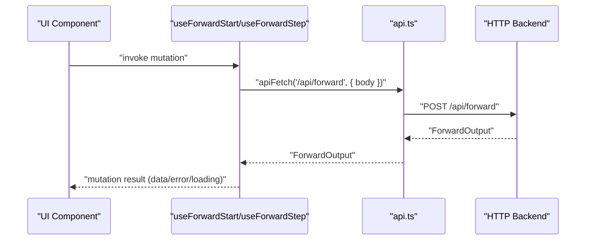

**Diagram sources**
- [useForwardStart.ts:1-22](file://src/ui/hooks/useForwardStart.ts#L1-L22)
- [useForwardStep.ts:1-27](file://src/ui/hooks/useForwardStep.ts#L1-L27)
- [api.ts:1-14](file://src/ui/lib/api.ts#L1-L14)
- [forward_schema.ts:1-351](file://src/tools/forward_schema.ts#L1-L351)

## Detailed Component Analysis

### useActivate
- Pattern: Query with enabled gating and normalized queryKey.
- Error handling: Parses JSON error payload and throws Error with optional statusCode.
- Loading: Controlled by enabled flag; avoids empty-string requests.
- Caching: queryKey includes query, space, and max_choices to prevent cache collisions.

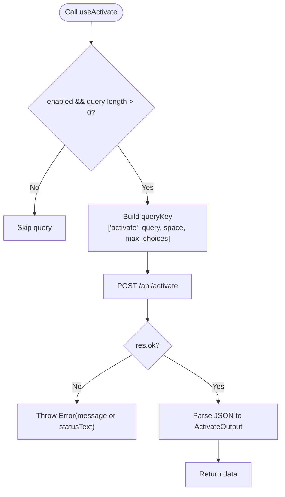

**Diagram sources**
- [useActivate.ts:28-40](file://src/ui/hooks/useActivate.ts#L28-L40)
- [activate_schema.ts:1-120](file://src/tools/activate_schema.ts#L1-L120)

**Section sources**
- [useActivate.ts:1-41](file://src/ui/hooks/useActivate.ts#L1-L41)
- [activate_schema.ts:1-120](file://src/tools/activate_schema.ts#L1-L120)

### useForwardStart
- Pattern: Mutation to start a forward run.
- Error handling: Parses JSON error payload and throws Error with optional statusCode.
- Side effects: Returns ForwardOutput; caller should call useForwardStep with the returned contract.

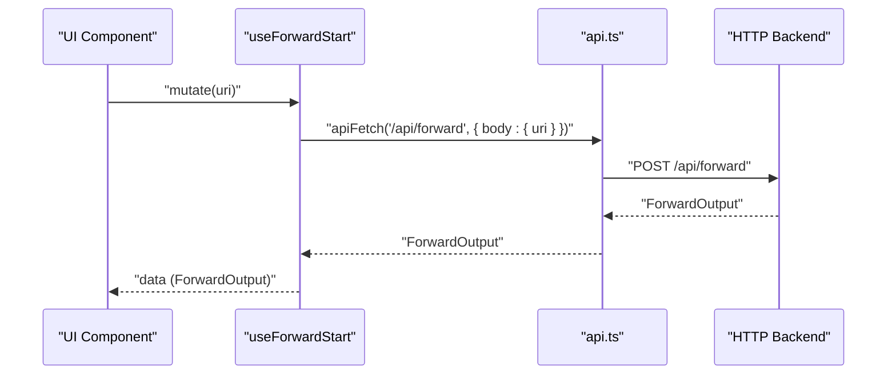

**Diagram sources**
- [useForwardStart.ts:1-22](file://src/ui/hooks/useForwardStart.ts#L1-L22)
- [api.ts:1-14](file://src/ui/lib/api.ts#L1-L14)
- [forward_schema.ts:1-351](file://src/tools/forward_schema.ts#L1-L351)

**Section sources**
- [useForwardStart.ts:1-22](file://src/ui/hooks/useForwardStart.ts#L1-L22)
- [forward_schema.ts:1-351](file://src/tools/forward_schema.ts#L1-L351)

### useForwardStep
- Pattern: Mutation to submit a solution and continue a run.
- Error handling: Parses JSON error payload and throws Error with optional statusCode.
- Validation: Enforces that solution.type matches contract.type and includes required fields.

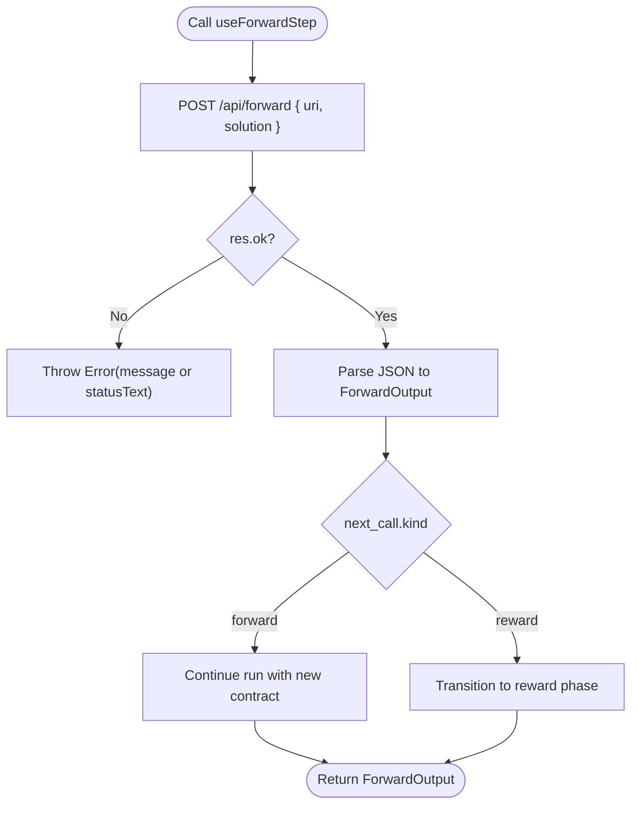

**Diagram sources**
- [useForwardStep.ts:1-27](file://src/ui/hooks/useForwardStep.ts#L1-L27)
- [forward_schema.ts:1-351](file://src/tools/forward_schema.ts#L1-L351)

**Section sources**
- [useForwardStep.ts:1-27](file://src/ui/hooks/useForwardStep.ts#L1-L27)
- [forward_schema.ts:1-351](file://src/tools/forward_schema.ts#L1-L351)

### useProtocol
- Pattern: Query to fetch markdown export and transform into structured data/form state.
- Parsing: Extracts title, steps, activation patterns, and reward signal; builds form state and rebuilds markdown.
- Error handling: Attaches statusCode to thrown Error.

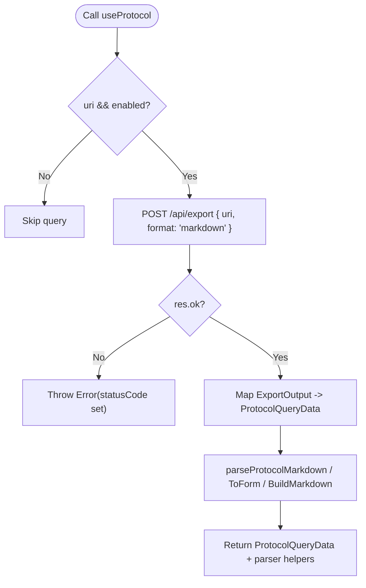

**Diagram sources**
- [useProtocol.ts:43-49](file://src/ui/hooks/useProtocol.ts#L43-L49)
- [forward_schema.ts:1-351](file://src/tools/forward_schema.ts#L1-L351)

**Section sources**
- [useProtocol.ts:1-247](file://src/ui/hooks/useProtocol.ts#L1-L247)

### useReward
- Pattern: Mutation to submit reward outcome and feedback.
- Error handling: Parses JSON error payload and throws Error with optional statusCode.

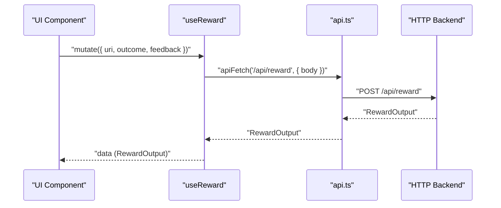

**Diagram sources**
- [useReward.ts:1-28](file://src/ui/hooks/useReward.ts#L1-L28)
- [api.ts:1-14](file://src/ui/lib/api.ts#L1-L14)
- [reward_schema.ts:1-53](file://src/tools/reward_schema.ts#L1-L53)

**Section sources**
- [useReward.ts:1-28](file://src/ui/hooks/useReward.ts#L1-L28)
- [reward_schema.ts:1-53](file://src/tools/reward_schema.ts#L1-L53)

### useRunSession
- Pattern: Local state management with localStorage persistence.
- Normalization: Converts legacy keys to canonical RunSession shape; validates arrays and objects.
- Operations: loadAll, upsert, remove; exposes refresh and update helpers.

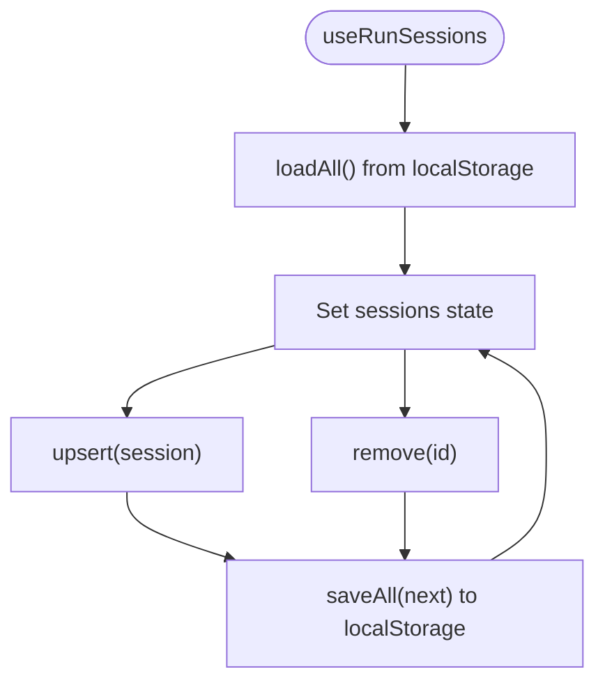

**Diagram sources**
- [useRunSession.ts:139-180](file://src/ui/hooks/useRunSession.ts#L139-L180)

**Section sources**
- [useRunSession.ts:1-194](file://src/ui/hooks/useRunSession.ts#L1-L194)
- [runToolTypes.ts:1-10](file://src/ui/lib/runToolTypes.ts#L1-L10)

### useSpaces
- Pattern: Query to list spaces with optional adapter summaries.
- Error handling: Parses JSON error payload and throws Error with message.

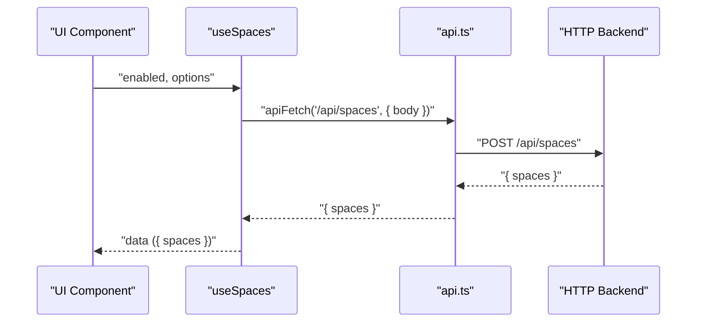

**Diagram sources**
- [useSpaces.ts:1-48](file://src/ui/hooks/useSpaces.ts#L1-L48)
- [api.ts:1-14](file://src/ui/lib/api.ts#L1-L14)
- [spaces_schema.ts:1-53](file://src/tools/spaces_schema.ts#L1-L53)

**Section sources**
- [useSpaces.ts:1-48](file://src/ui/hooks/useSpaces.ts#L1-L48)
- [spaces_schema.ts:1-53](file://src/tools/spaces_schema.ts#L1-L53)

### useAuth
- Pattern: Query to fetch current user identity.
- Behavior: retry: false to avoid repeated failed attempts.

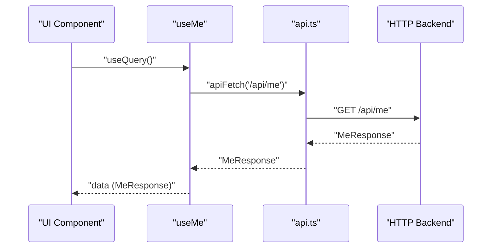

**Diagram sources**
- [useAuth.ts:1-25](file://src/ui/hooks/useAuth.ts#L1-L25)
- [api.ts:1-14](file://src/ui/lib/api.ts#L1-L14)

**Section sources**
- [useAuth.ts:1-25](file://src/ui/hooks/useAuth.ts#L1-L25)

## Dependency Analysis
- UI hooks depend on:
  - TanStack Query for queryKey/queryFn and mutationFn patterns
  - api.ts for HTTP transport
  - Tool schemas for type-safe contracts
- useRunSession depends on runToolTypes for unioned types across forward and reward
- useProtocol depends on forward_schema types for parsing markdown contracts

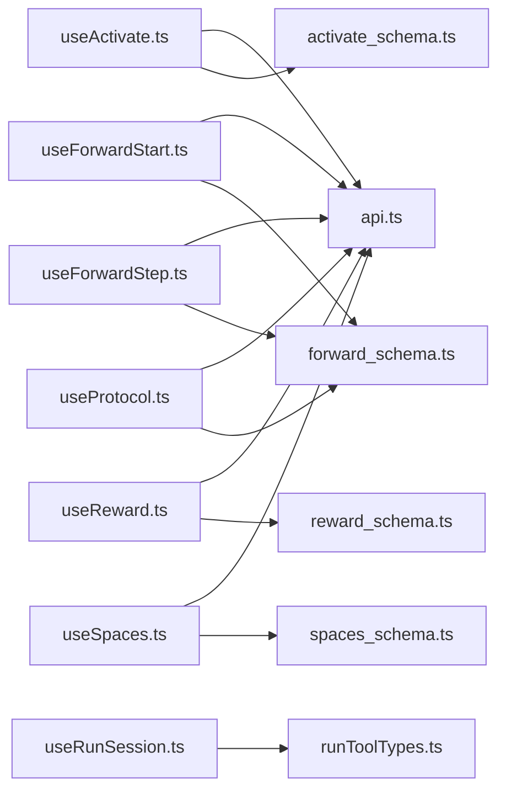

**Diagram sources**
- [useActivate.ts:1-41](file://src/ui/hooks/useActivate.ts#L1-L41)
- [useForwardStart.ts:1-22](file://src/ui/hooks/useForwardStart.ts#L1-L22)
- [useForwardStep.ts:1-27](file://src/ui/hooks/useForwardStep.ts#L1-L27)
- [useProtocol.ts:1-247](file://src/ui/hooks/useProtocol.ts#L1-L247)
- [useReward.ts:1-28](file://src/ui/hooks/useReward.ts#L1-L28)
- [useRunSession.ts:1-194](file://src/ui/hooks/useRunSession.ts#L1-L194)
- [useSpaces.ts:1-48](file://src/ui/hooks/useSpaces.ts#L1-L48)
- [useAuth.ts:1-25](file://src/ui/hooks/useAuth.ts#L1-L25)
- [api.ts:1-14](file://src/ui/lib/api.ts#L1-L14)
- [runToolTypes.ts:1-10](file://src/ui/lib/runToolTypes.ts#L1-L10)
- [activate_schema.ts:1-120](file://src/tools/activate_schema.ts#L1-L120)
- [forward_schema.ts:1-351](file://src/tools/forward_schema.ts#L1-L351)
- [reward_schema.ts:1-53](file://src/tools/reward_schema.ts#L1-L53)
- [spaces_schema.ts:1-53](file://src/tools/spaces_schema.ts#L1-L53)

**Section sources**
- [useActivate.ts:1-41](file://src/ui/hooks/useActivate.ts#L1-L41)
- [useForwardStart.ts:1-22](file://src/ui/hooks/useForwardStart.ts#L1-L22)
- [useForwardStep.ts:1-27](file://src/ui/hooks/useForwardStep.ts#L1-L27)
- [useProtocol.ts:1-247](file://src/ui/hooks/useProtocol.ts#L1-L247)
- [useReward.ts:1-28](file://src/ui/hooks/useReward.ts#L1-L28)
- [useRunSession.ts:1-194](file://src/ui/hooks/useRunSession.ts#L1-L194)
- [useSpaces.ts:1-48](file://src/ui/hooks/useSpaces.ts#L1-L48)
- [useAuth.ts:1-25](file://src/ui/hooks/useAuth.ts#L1-L25)
- [api.ts:1-14](file://src/ui/lib/api.ts#L1-L14)
- [runToolTypes.ts:1-10](file://src/ui/lib/runToolTypes.ts#L1-L10)
- [activate_schema.ts:1-120](file://src/tools/activate_schema.ts#L1-L120)
- [forward_schema.ts:1-351](file://src/tools/forward_schema.ts#L1-L351)
- [reward_schema.ts:1-53](file://src/tools/reward_schema.ts#L1-L53)
- [spaces_schema.ts:1-53](file://src/tools/spaces_schema.ts#L1-L53)

## Performance Considerations
- QueryKey granularity: useActivate and useSpaces include parameters in queryKey to avoid cache collisions and enable precise invalidation.
- Enabled gating: Prevents unnecessary network calls when inputs are empty or disabled.
- Local persistence: useRunSession minimizes server round trips by persisting sessions locally; normalization ensures robustness against schema variations.
- Type safety: Tool schemas reduce runtime errors and improve DX, indirectly improving performance by catching issues earlier.
- Caching strategy: Prefer TanStack Query cache for remote data; localStorage for client-side session continuity.

[No sources needed since this section provides general guidance]

## Troubleshooting Guide
- Error handling patterns
  - All hooks parse JSON error payloads and throw Error with message/statusText.
  - useProtocol attaches statusCode to thrown Error for downstream handling.
  - useAuth disables retries to avoid repeated failures.

- Common issues and resolutions
  - Empty query triggers: useActivate requires enabled true and non-empty query; otherwise skip.
  - First forward call misuse: useForwardStep forbids solution on initial call; include solution only on continuation with execution_id.
  - Run session corruption: useRunSession normalizes legacy keys; if malformed, entries are filtered out.

- Debugging tips
  - Inspect queryKey and enabled flags for queries.
  - Log mutation inputs (uri, solution) for forward calls.
  - Verify localStorage key and content for run sessions.

**Section sources**
- [useActivate.ts:17-26](file://src/ui/hooks/useActivate.ts#L17-L26)
- [useForwardStart.ts:5-15](file://src/ui/hooks/useForwardStart.ts#L5-L15)
- [useForwardStep.ts:10-20](file://src/ui/hooks/useForwardStep.ts#L10-L20)
- [useProtocol.ts:23-29](file://src/ui/hooks/useProtocol.ts#L23-L29)
- [useReward.ts:11-21](file://src/ui/hooks/useReward.ts#L11-L21)
- [useRunSession.ts:41-137](file://src/ui/hooks/useRunSession.ts#L41-L137)
- [useAuth.ts:9-16](file://src/ui/hooks/useAuth.ts#L9-L16)

## Conclusion
The KAIROS MCP state management system leverages TanStack Query for remote data and localStorage for client-side session continuity. Each hook encapsulates a single responsibility, integrates with typed tool schemas, and adheres to consistent error and loading patterns. The architecture supports scalable extension and maintains reliability through normalization, enabled gating, and explicit error handling.

[No sources needed since this section summarizes without analyzing specific files]

## Appendices

### Creating New Hooks: Best Practices
- Use queryKey/queryFn for queries; mutationFn for mutations.
- Normalize inputs (trim, defaults) and include them in queryKey.
- Parse JSON error payloads and throw Error with message/statusText.
- For run-like workflows, consider combining TanStack Query with localStorage persistence similar to useRunSession.
- Keep UI components declarative; expose only necessary state and actions.

[No sources needed since this section provides general guidance]